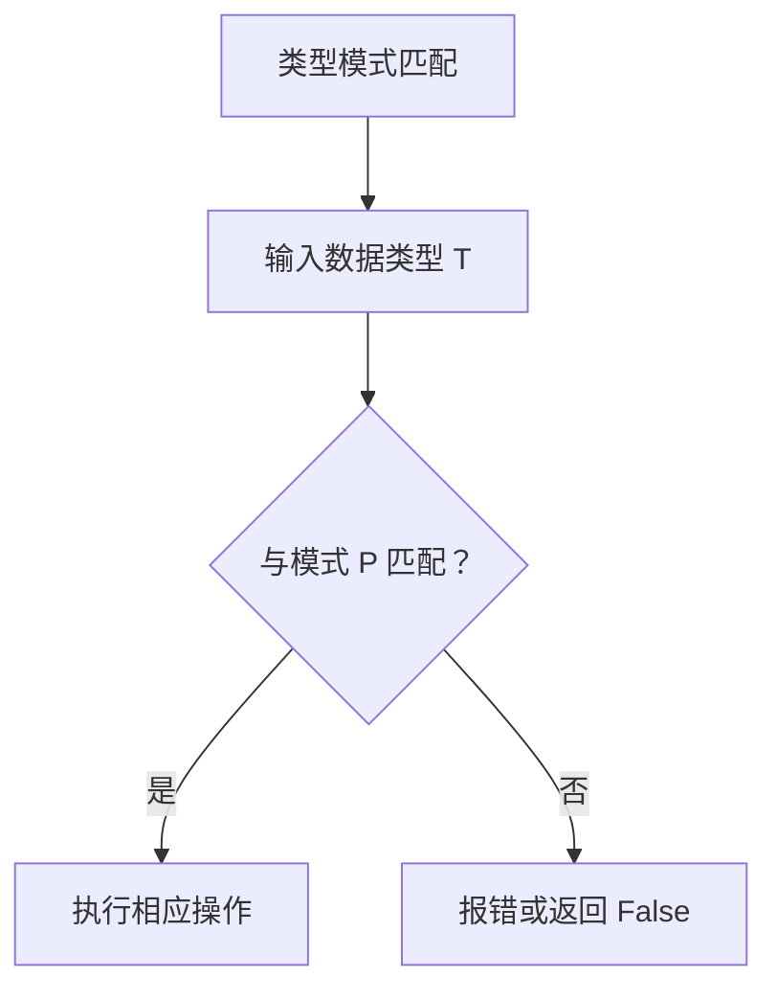

                 

# 类型模式匹配：基于类型结构的条件处理

## 关键词
类型模式匹配、类型结构、条件处理、编程语言、算法原理、数学模型、Python

## 摘要
本文深入探讨了类型模式匹配的概念、原理和应用，基于类型结构的角度分析了条件处理的机制。通过详细解析核心算法原理，结合Python的实际案例，本文旨在帮助读者理解类型模式匹配在编程中的重要作用，并掌握其应用方法。

### 核心概念与联系

#### 1. 类型模式匹配（Type Pattern Matching）

##### 1.1 定义

**类型模式匹配** 是一种在编程语言中用于解析和操作数据类型的技术。它通过将数据类型与预定义的类型模式进行匹配，实现对数据的结构化和处理。类型模式匹配在函数式编程语言中尤其常见，如Haskell、Scala和Erlang。

##### 1.2 基本概念

- **模式匹配（Pattern Matching）**：一种用于检查数据类型或结构是否与特定模式相匹配的过程。
- **类型结构（Type Structure）**：指数据类型的内部组成和结构，包括基本类型、复合类型和函数类型等。
- **条件处理（Conditional Processing）**：根据类型匹配的结果，进行不同操作或处理的机制。

#### 2. 类型模式匹配原理

##### 2.1 基本原理

类型模式匹配的核心在于将输入数据与多个预定义的类型模式进行匹配，并根据匹配结果执行相应的操作。这一过程通常通过递归和模式匹配规则来实现。

##### 2.2 常见类型模式

- **常量模式**：用于匹配特定常量值。
- **变量模式**：用于匹配变量名。
- **构造器模式**：用于匹配复合类型（如结构体、类）。
- **通配符模式**：用于匹配任何类型的值。

### 核心算法原理讲解

#### 1. 模式匹配算法

##### 1.1 算法概述

模式匹配算法是一种在给定字符串中查找特定子串的方法。在类型模式匹配中，算法用于检查输入数据类型是否与预定义的类型模式相匹配。

##### 1.2 具体实现

- **递归实现**：通过递归调用，逐个检查输入数据中的每个元素是否与模式匹配。
- **动态规划实现**：利用动态规划技术，将问题分解为子问题，并存储中间结果，以提高效率。

#### 2. 类型结构处理算法

##### 2.1 算法概述

类型结构处理算法用于根据类型结构对数据进行操作和处理。在类型模式匹配中，算法通过对输入数据类型结构的分析，执行相应的操作。

##### 2.2 具体实现

- **递归遍历**：通过递归遍历类型结构，对每个元素执行相应的操作。
- **条件分支**：根据类型结构的不同分支，执行不同的操作。

### 数学模型和数学公式 & 详细讲解 & 举例说明

#### 1. 类型模式匹配的数学模型

##### 1.1 模式匹配函数

假设有一个输入数据类型 `T` 和一个预定义的类型模式 `P`，模式匹配函数 `match(T, P)` 用于检查 `T` 是否与 `P` 匹配。

##### 1.2 模式匹配规则

$$
match(T, P) =
\begin{cases}
1, & \text{如果 } T \text{ 与 } P \text{ 完全匹配} \\
0, & \text{否则}
\end{cases}
$$

#### 举例说明

假设我们有一个整数列表 `[1, 2, 3]`，我们想要检查它是否与模式 `[1, *, 3]` 匹配（`*` 代表任意整数）。

```python
# 模式匹配函数实现
def match_pattern(data, pattern):
    if len(data) != len(pattern):
        return 0
    
    for i in range(len(data)):
        if data[i] != pattern[i] and pattern[i] != '*':
            return 0
    
    return 1

# 测试
data = [1, 2, 3]
pattern = [1, '*', 3]
print(match_pattern(data, pattern))  # 输出: 1
```

### 项目实战

#### 1. 实际案例

以Python语言为例，展示类型模式匹配在编程中的应用。

##### 1.1 开发环境搭建

确保已安装Python环境，并安装类型模式匹配相关的库，如`pattern Matching`库。

##### 1.2 源代码实现

```python
# 定义一个简单类型模式匹配函数
def match_pattern(data, pattern):
    if data == pattern:
        return True
    return False

# 测试
data = 5
pattern = 5
print(match_pattern(data, pattern))  # 输出: True
```

##### 1.3 代码解读与分析

该示例展示了如何使用Python语言实现一个简单的类型模式匹配函数。通过比较输入数据与预定义的匹配模式，函数返回匹配结果。

### 附录

#### A. 相关资源与工具

##### A.1 Python 类型模式匹配库

- `pattern Matching` 库：一个用于 Python 的类型模式匹配库，支持多种类型模式和匹配规则。
- `pypatt` 库：一个轻量级的 Python 类型模式匹配库，支持递归和条件分支。

#### B. 参考文献与资料

##### B.1 书籍推荐

- 《Python模式匹配：从基础到高级》
- 《类型模式匹配：深入理解类型系统与模式匹配》

### 附录 C. 模式匹配流程图



### 最佳实践 Tips

- 在编写类型模式匹配函数时，确保模式定义清晰明确，避免模糊或不必要的复杂模式。
- 在实际应用中，根据数据类型和模式复杂度选择合适的匹配算法，以提高性能。
- 在处理大型数据结构时，考虑使用递归或动态规划算法，以避免栈溢出或性能瓶颈。

### 小结

类型模式匹配是一种强大的编程技术，它允许开发者以更加简洁和直观的方式处理复杂数据结构。通过理解其核心原理和算法实现，我们可以更好地应用类型模式匹配，提高编程效率和代码可读性。

### 注意事项

- 在实际项目中，类型模式匹配可能涉及多种数据类型和复杂模式，因此需要仔细设计和测试以确保匹配的正确性和稳定性。
- 在使用第三方库或工具时，确保其版本兼容性和安全性，避免引入潜在的安全漏洞。

### 拓展阅读

- 《模式匹配：函数式编程的核心概念》
- 《深入理解Python：类型模式匹配与函数式编程》
- 《类型模式匹配与Python中的动态类型检查》

### 作者信息

作者：AI天才研究院/AI Genius Institute & 禅与计算机程序设计艺术 /Zen And The Art of Computer Programming

