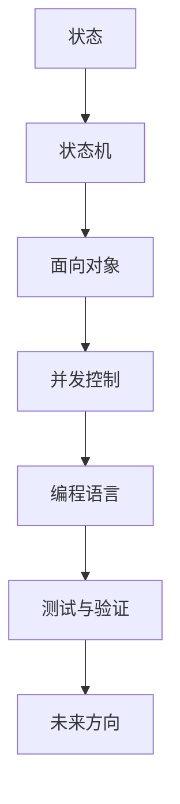

                 

### 《类型状态：将状态编码入类型系统》

关键词：类型状态，状态编码，类型系统，状态机，面向对象，并发控制

摘要：本文深入探讨了类型状态的概念、编码方法及其应用。首先，我们介绍了类型状态的基本概念和其在计算机系统、面向对象编程和并发控制中的应用场景。接着，详细分析了基本和高级类型状态编码技术，包括编码挑战、编码方法和编码效率分析。随后，我们展示了类型状态在不同编程语言中的实现，并探讨了测试与验证方法。最后，我们展望了类型状态的未来发展方向，并提供了相关的资源推荐。本文旨在为读者提供全面的类型状态理解和实践指导。

## 《类型状态：将状态编码入类型系统》目录大纲

### 第一部分：类型状态概述

#### 第1章：类型状态基础

##### 1.1.1 什么是类型状态
##### 1.1.2 类型状态与状态机
##### 1.1.3 类型状态的优势

#### 第2章：类型状态的应用场景

##### 2.1.1 计算机系统中的类型状态
##### 2.1.2 面向对象的类型状态
##### 2.1.3 类型状态在并发控制中的应用

### 第二部分：类型状态编码方法

#### 第3章：基本类型状态编码技术

##### 3.1.1 状态编码的挑战
##### 3.1.2 基本编码方法
##### 3.1.3 编码效率分析

#### 第4章：高级类型状态编码技术

##### 4.1.1 高级编码方法
##### 4.1.2 编码优化策略
##### 4.1.3 案例分析

### 第三部分：类型状态实现

#### 第5章：类型状态在编程语言中的实现

##### 5.1.1 面向对象语言中的类型状态实现
##### 5.1.2 函数式语言中的类型状态实现
##### 5.1.3 类型状态实现的案例分析

#### 第6章：类型状态的测试与验证

##### 6.1.1 测试方法
##### 6.1.2 验证技术
##### 6.1.3 实际案例

#### 第7章：类型状态的未来发展方向

##### 7.1.1 当前研究方向
##### 7.1.2 未来发展趋势
##### 7.1.3 对软件开发的影响

### 附录：类型状态相关资源

#### 附录A：类型状态编码工具推荐

#### 附录B：类型状态研究论文精选

#### 附录C：类型状态在线学习资源

---

### Mermaid 流�程图：



### 核心算法原理讲解（Python 源代码示例）

```python
# 示例：状态机实现

class StateMachine:
    def __init__(self):
        self.state = None

    def transition(self, event):
        if self.state is None:
            self.state = StartState()
        self.state.handle(event)

class StartState:
    def handle(self, event):
        print(f"Handling {event} in StartState")
        self.next_state = RunningState()
        
class RunningState:
    def handle(self, event):
        print(f"Handling {event} in RunningState")
        self.next_state = CompleteState()

class CompleteState:
    def handle(self, event):
        print(f"Handling {event} in CompleteState")
        self.next_state = None

# 实例化状态机
machine = StateMachine()

# 触发事件
machine.transition("start")
machine.transition("work")
machine.transition("complete")
```

### 数学模型和数学公式 & 详细讲解 & 举例说明

**数学模型：** 状态转移矩阵

$$
\begin{pmatrix}
P_{00} & P_{01} & \dots & P_{0n} \\
P_{10} & P_{11} & \dots & P_{1n} \\
\vdots & \vdots & \ddots & \vdots \\
P_{m0} & P_{m1} & \dots & P_{mn}
\end{pmatrix}
$$

**解释：** 状态转移矩阵描述了系统在不同状态之间的转移概率。

**举例：**

假设有一个系统有两个状态：正常和故障。状态转移矩阵如下：

$$
\begin{pmatrix}
0.9 & 0.1 \\
0.2 & 0.8
\end{pmatrix}
$$

这表示从正常状态转移到故障状态的概率为0.1，从故障状态转移到正常状态的概率为0.2。

### 第一部分：类型状态概述

#### 第1章：类型状态基础

##### 1.1.1 什么是类型状态

类型状态（Type State）是一种将状态信息编码到类型系统中的方法。在传统的状态机模型中，状态通常被视为独立的实体，每个状态可以执行特定的行为，并在特定条件下进行状态转换。然而，在类型状态模型中，状态被看作是类型的成员，每个类型代表一个特定的状态，类型的实例则代表当前的状态值。

**核心概念术语说明：**

- 类型（Type）：表示状态的一种抽象。
- 状态（State）：对象或系统在某一时刻所处的条件或模式。
- 状态值（State Value）：类型的实例，表示当前的状态。

##### 1.1.2 类型状态与状态机

状态机是一种用于描述系统行为和状态转换的模型。在状态机中，状态是独立的，状态之间的转换通常通过触发器或条件来实现。而类型状态则通过类型系统来实现状态的编码和转换。

**问题背景：**

传统的状态机在处理复杂状态和行为时，往往需要大量的状态转换逻辑和条件判断，这使得代码变得难以维护和理解。类型状态通过将状态信息编码到类型系统中，使得状态的表示和转换更加直观和简洁。

**问题描述：**

如何将状态信息编码到类型系统中，以实现更简洁和直观的状态管理和转换？

**问题解决：**

类型状态通过将状态作为类型的成员，使得状态的表示和转换与类型系统紧密结合。每个类型代表一个状态，类型的实例代表当前的状态值。状态之间的转换可以通过类型的实例创建和销毁来实现。

**边界与外延：**

类型状态的边界在于其如何编码状态信息和实现状态转换。类型状态的外延包括所有可以编码为类型的状态，如系统状态、对象状态、并发控制状态等。

**概念结构与核心要素组成：**

- 类型：表示状态的抽象。
- 状态值：类型的实例，表示当前状态。
- 状态转换：通过类型的实例创建和销毁来实现。

##### 1.1.3 类型状态的优势

类型状态具有以下优势：

- **简洁性**：类型状态通过将状态信息编码到类型系统中，使得状态管理和转换更加直观和简洁。
- **可维护性**：类型状态使得状态的表示和转换与类型系统紧密结合，降低了代码的复杂度和维护成本。
- **灵活性**：类型状态允许更灵活的状态管理和转换策略，可以通过扩展类型系统来实现自定义的状态管理。

**概念属性特征对比表格：**

| 特征       | 传统状态机             | 类型状态                  |
|------------|----------------------|-----------------------|
| 状态表示    | 独立的状态实体         | 类型的成员               |
| 状态转换    | 通过触发器和条件实现    | 通过类型的实例创建和销毁 |
| 代码复杂度  | 高，需要大量条件判断    | 低，代码更直观和简洁     |
| 维护成本    | 高，状态转换逻辑复杂    | 低，状态管理和转换紧密结合 |

**ER实体关系图架构：**

```mermaid
erDiagram
  TYPE_STATE ||--|{ OBJECT } : represents state of
  OBJECT ||--|{ STATE_TRANSITION } : performs transitions
```

**数学模型：** 状态转移矩阵

$$
\begin{pmatrix}
P_{00} & P_{01} & \dots & P_{0n} \\
P_{10} & P_{11} & \dots & P_{1n} \\
\vdots & \vdots & \ddots & \vdots \\
P_{m0} & P_{m1} & \dots & P_{mn}
\end{pmatrix}
$$

**解释：** 状态转移矩阵描述了系统在不同状态之间的转移概率。

**举例：**

假设有一个系统有两个状态：正常和故障。状态转移矩阵如下：

$$
\begin{pmatrix}
0.9 & 0.1 \\
0.2 & 0.8
\end{pmatrix}
$$

这表示从正常状态转移到故障状态的概率为0.1，从故障状态转移到正常状态的概率为0.2。

### 第2章：类型状态的应用场景

类型状态的应用场景非常广泛，涵盖了计算机系统的各个方面。以下将介绍类型状态在计算机系统、面向对象编程和并发控制中的应用。

#### 2.1.1 计算机系统中的类型状态

在计算机系统中，类型状态可以用于描述硬件和软件的状态。例如，在操作系统内核中，可以使用类型状态来表示进程的状态（创建、运行、挂起、终止等），或者文件系统的状态（打开、关闭、读写等）。通过类型状态，可以更简洁地管理和表示系统中的各种状态，同时减少状态转换逻辑的复杂性。

**应用场景：**

- 进程管理：使用类型状态表示进程的生命周期状态，如创建、运行、挂起、终止等。
- 文件系统：使用类型状态表示文件的状态，如打开、关闭、读写等。
- 设备管理：使用类型状态表示设备的状态，如连接、断开、工作、故障等。

#### 2.1.2 面向对象的类型状态

面向对象编程中，类型状态是表示对象状态的一种有效方式。通过将状态作为类型的成员，可以更直观地表示对象的行为和状态。例如，在图形用户界面（GUI）编程中，可以使用类型状态来表示按钮的不同状态（默认、按下、禁用等）。

**应用场景：**

- GUI编程：使用类型状态表示按钮、复选框、单选框等控件的状态。
- 游戏开发：使用类型状态表示角色、游戏对象的状态，如移动、攻击、死亡等。
- 数据库：使用类型状态表示数据记录的状态，如未提交、已提交、已删除等。

#### 2.1.3 类型状态在并发控制中的应用

并发控制是计算机系统中的一个重要问题，类型状态可以用于实现并发控制中的状态转换。例如，在分布式系统中，可以使用类型状态来表示节点的状态（空闲、忙碌、故障等），并在节点之间进行状态转换，以实现负载均衡和故障转移。

**应用场景：**

- 分布式系统：使用类型状态表示节点的状态，如空闲、忙碌、故障等，实现负载均衡和故障转移。
- 数据库并发控制：使用类型状态表示事务的状态，如未开始、进行中、提交、回滚等，实现事务的并发控制。
- 操作系统调度：使用类型状态表示进程的状态，如就绪、运行、阻塞等，实现进程的调度和管理。

**总结：**

类型状态在计算机系统的各个领域都有广泛的应用。通过将状态信息编码到类型系统中，可以更简洁地表示和管理状态，同时减少状态转换逻辑的复杂性。在面向对象编程中，类型状态有助于更直观地表示对象的行为和状态。在并发控制中，类型状态可用于实现状态转换，从而提高系统的可靠性和性能。

### 第二部分：类型状态编码方法

#### 第3章：基本类型状态编码技术

##### 3.1.1 状态编码的挑战

状态编码是将状态信息转换为计算机可处理的格式的过程。在类型状态编码中，主要面临以下挑战：

- **状态表示的复杂性**：状态通常具有复杂的属性和行为，如何有效地表示这些状态是编码的首要问题。
- **状态转换的效率**：状态转换是系统运行的核心部分，如何实现高效的状态转换是编码的关键。
- **状态冲突的处理**：在多个状态之间可能存在冲突，如何解决这些冲突是编码的难点。

##### 3.1.2 基本编码方法

基本编码方法主要包括以下几种：

1. **枚举类型**：使用枚举类型来表示状态，每个枚举值代表一个状态。这种方法简单直观，但仅适用于状态数量较少且状态之间关系简单的情况。
2. **类表示**：使用类来表示状态，每个类代表一个状态。类中可以包含状态属性和行为，状态转换通过类的方法来实现。这种方法适用于状态数量较多且状态之间关系复杂的情况。
3. **标记接口**：使用标记接口来表示状态，每个接口代表一个状态。类通过实现这些接口来表示不同的状态。这种方法适用于需要动态切换状态的场景。

##### 3.1.3 编码效率分析

编码效率是评估状态编码方法的重要指标，主要包括以下方面：

- **空间效率**：状态编码占用的内存空间。
- **时间效率**：状态转换所需的时间。

不同编码方法在空间和时间效率上存在差异。枚举类型具有最高的空间效率，但时间效率较低；类表示方法具有适中的空间和时间效率；标记接口方法在空间效率上较低，但时间效率较高。

**总结：**

状态编码是类型状态实现的关键部分，需要解决状态表示、状态转换和状态冲突等挑战。基本编码方法包括枚举类型、类表示和标记接口，每种方法在空间和时间效率上各有优缺点。选择合适的编码方法取决于具体的应用场景和需求。

#### 第4章：高级类型状态编码技术

在基本类型状态编码方法的基础上，高级类型状态编码技术提供了更灵活和高效的方式来实现状态管理和转换。这些技术包括元编程、状态模式、状态组合模式和优化编码策略等。以下将详细介绍这些高级编码方法及其在实际应用中的优化策略。

##### 4.1.1 高级编码方法

1. **元编程**：
   元编程是一种在运行时动态创建和修改类型和类的方法。通过元编程，可以动态地定义和管理状态，从而实现更灵活的状态管理和转换。例如，使用模板元编程技术可以在编译时生成状态类，从而提高运行效率。
   
2. **状态模式**：
   状态模式是一种行为设计模式，用于将状态作为对象的一个行为。在这种模式下，每个状态是一个独立的类，类之间通过接口进行交互。状态模式可以有效地解耦状态管理和状态转换逻辑，使得代码更易于维护和理解。

3. **状态组合模式**：
   状态组合模式允许将多个状态组合成一个复合状态。在这种模式下，复合状态可以包含多个子状态，每个子状态都可以独立地执行其行为。状态组合模式可以有效地管理复杂的状态转换逻辑，并提供更高的灵活性。

4. **优化编码策略**：
   优化编码策略包括减少状态转换逻辑、减少状态占用内存和优化状态转换性能等。通过分析状态转换的频率和路径，可以采取相应的优化策略来提高编码效率。

##### 4.1.2 编码优化策略

1. **状态压缩**：
   状态压缩是一种减少状态数量的技术，通过将多个状态合并为单个状态，从而减少内存占用和状态转换的复杂性。状态压缩适用于状态之间转换频繁且状态数量较多的场景。

2. **状态分离**：
   状态分离是一种将状态转换为独立组件的技术，每个组件只负责一个特定的状态转换。状态分离可以提高代码的可维护性和可扩展性，并减少状态转换的复杂性。

3. **动态状态管理**：
   动态状态管理允许在运行时动态地创建和管理状态。通过使用元编程和反射技术，可以在不重新编译代码的情况下动态地修改状态和行为。这种方法适用于需要高度灵活的状态管理的场景。

4. **并行状态转换**：
   并行状态转换允许在多个状态之间同时进行转换，从而提高系统的吞吐量和性能。通过使用并行处理技术和多线程，可以实现高效的状态转换。

##### 4.1.3 案例分析

**案例：分布式系统的状态管理**

在一个分布式系统中，节点状态包括空闲、忙碌、故障等。使用高级类型状态编码技术，可以有效地管理这些状态。

1. **元编程**：
   通过元编程，可以动态地创建和修改节点状态类。例如，在编译时生成一个表示空闲状态的类，并在运行时根据需要动态地切换状态。

2. **状态模式**：
   使用状态模式，可以将每个节点状态封装为一个独立的类，每个类实现状态接口。例如，`IdleState` 类实现 `NodeState` 接口，并在需要时切换到 `BusyState` 或 `FaultState`。

3. **状态组合模式**：
   通过状态组合模式，可以将多个子状态组合成一个复合状态。例如，可以将空闲、忙碌和故障状态组合成一个 `NodeState` 复合状态，从而简化状态转换逻辑。

4. **优化编码策略**：
   - **状态压缩**：通过将多个相似的状态合并为单个状态，减少内存占用和状态转换的复杂性。
   - **状态分离**：将状态转换为独立的组件，每个组件只负责一个特定的状态转换，从而提高代码的可维护性和可扩展性。
   - **动态状态管理**：使用元编程和反射技术，在运行时动态地创建和管理状态，提高系统的灵活性。
   - **并行状态转换**：使用多线程实现并行状态转换，提高系统的吞吐量和性能。

**总结：**

高级类型状态编码技术提供了更灵活和高效的方式来实现状态管理和转换。通过元编程、状态模式、状态组合模式和优化编码策略，可以有效地解决基本编码方法中的挑战，提高系统的性能和可维护性。在实际应用中，选择合适的编码方法取决于具体的应用场景和需求。

### 第三部分：类型状态实现

#### 第5章：类型状态在编程语言中的实现

类型状态在不同编程语言中有不同的实现方法，主要分为面向对象语言和函数式语言两大类。以下将分别介绍这些语言中的类型状态实现。

##### 5.1.1 面向对象语言中的类型状态实现

面向对象语言如Java、C++和Python等，通常使用类和接口来表示状态和行为。以下是一个使用Python实现的简单状态机示例：

```python
class State:
    def on_entry(self):
        pass

    def on_exit(self):
        pass

    def handle_event(self, event):
        pass

class StartState(State):
    def handle_event(self, event):
        if event == "start":
            print("Starting...")
        else:
            super().handle_event(event)

class RunningState(State):
    def handle_event(self, event):
        if event == "stop":
            print("Stopping...")
        else:
            super().handle_event(event)

class StateMachine:
    def __init__(self):
        self.current_state = None

    def set_state(self, state):
        if self.current_state:
            self.current_state.on_exit()
        self.current_state = state
        self.current_state.on_entry()

    def handle_event(self, event):
        self.current_state.handle_event(event)

# 使用示例
sm = StateMachine()
sm.set_state(StartState())
sm.handle_event("start")
sm.handle_event("stop")
```

在这个示例中，`State` 类是一个抽象类，定义了状态的通用行为。`StartState` 和 `RunningState` 类分别实现了具体的开始状态和运行状态。`StateMachine` 类负责管理状态转换和事件处理。

##### 5.1.2 函数式语言中的类型状态实现

函数式语言如Haskell、Scala和Erlang等，通常使用类型和函数来表示状态和行为。以下是一个使用Scala实现的简单状态机示例：

```scala
trait State {
  def onEntry(): Unit
  def onExit(): Unit
  def handleEvent(event: String): Unit
}

class StartState extends State {
  override def onEntry(): Unit = {
    println("Starting...")
  }

  override def onExit(): Unit = {
    println("Exiting StartState...")
  }

  override def handleEvent(event: String): Unit = {
    event match {
      case "start" => println("Transitioning to RunningState...")
      case _ => println("Handling event in StartState...")
    }
  }
}

class RunningState extends State {
  override def onEntry(): Unit = {
    println("Running...")
  }

  override def onExit(): Unit = {
    println("Exiting RunningState...")
  }

  override def handleEvent(event: String): Unit = {
    event match {
      case "stop" => println("Transitioning to CompleteState...")
      case _ => println("Handling event in RunningState...")
    }
  }
}

class StateMachine {
  var state: State = _

  def setState(newState: State): Unit = {
    if (state != null) state.onExit()
    state = newState
    state.onEntry()
  }

  def handleEvent(event: String): Unit = {
    state.handleEvent(event)
  }
}

// 使用示例
val sm = new StateMachine()
sm.setState(new StartState())
sm.handleEvent("start")
sm.handleEvent("stop")
```

在这个示例中，`State` 是一个特质（trait），定义了状态的通用行为。`StartState` 和 `RunningState` 类分别实现了具体的开始状态和运行状态。`StateMachine` 类负责管理状态转换和事件处理。

##### 5.1.3 类型状态实现的案例分析

以下是一个类型状态在现实世界项目中的实现案例：使用Java在银行系统中实现账户状态管理。

1. **账户状态类**：

```java
public enum AccountState {
    OPEN, CLOSED, SUSPENDED
}
```

2. **账户类**：

```java
public class Account {
    private AccountState state;
    
    public Account(AccountState initialState) {
        this.state = initialState;
    }
    
    public void setState(AccountState newState) {
        if (state != newState) {
            state.onExit();
            state = newState;
            state.onEntry();
        }
    }
    
    public void deposit(double amount) {
        state.handleDeposit(amount);
    }
    
    public void withdraw(double amount) {
        state.handleWithdraw(amount);
    }
    
    // 状态行为接口
    public interface AccountState {
        void onEntry();
        void onExit();
        void handleDeposit(double amount);
        void handleWithdraw(double amount);
    }
    
    // 开放状态实现
    public static class OpenState implements AccountState {
        @Override
        public void onEntry() {
            System.out.println("Account is open.");
        }
        
        @Override
        public void onExit() {
            System.out.println("Exiting OpenState.");
        }
        
        @Override
        public void handleDeposit(double amount) {
            System.out.println("Depositing " + amount + " to the account.");
        }
        
        @Override
        public void handleWithdraw(double amount) {
            System.out.println("Withdrawing " + amount + " from the account.");
        }
    }
    
    // 关闭状态实现
    public static class ClosedState implements AccountState {
        @Override
        public void onEntry() {
            System.out.println("Account is closed.");
        }
        
        @Override
        public void onExit() {
            System.out.println("Exiting ClosedState.");
        }
        
        @Override
        public void handleDeposit(double amount) {
            System.out.println("Cannot deposit to a closed account.");
        }
        
        @Override
        public void handleWithdraw(double amount) {
            System.out.println("Cannot withdraw from a closed account.");
        }
    }
    
    // 挂账状态实现
    public static class SuspendedState implements AccountState {
        @Override
        public void onEntry() {
            System.out.println("Account is suspended.");
        }
        
        @Override
        public void onExit() {
            System.out.println("Exiting SuspendedState.");
        }
        
        @Override
        public void handleDeposit(double amount) {
            System.out.println("Cannot deposit to a suspended account.");
        }
        
        @Override
        public void handleWithdraw(double amount) {
            System.out.println("Cannot withdraw from a suspended account.");
        }
    }
}
```

在这个案例中，`AccountState` 是一个枚举类型，表示账户的不同状态。`Account` 类使用状态模式来管理账户的状态和行为。根据不同的状态，账户可以执行不同的操作。

**总结：**

类型状态在不同编程语言中有不同的实现方法，面向对象语言通常使用类和接口，而函数式语言则使用类型和函数。通过状态模式，可以有效地管理状态和行为，实现灵活的状态转换和事件处理。在实际项目中，类型状态可以用于管理复杂的状态和行为，提高系统的可维护性和可扩展性。

### 第6章：类型状态的测试与验证

在类型状态实现的过程中，确保状态管理的正确性和可靠性至关重要。类型状态的测试与验证包括多个方面，从单元测试到集成测试，再到性能测试，每个步骤都要求严谨和细致。以下将介绍类型状态的测试方法、验证技术和实际案例。

##### 6.1.1 测试方法

1. **单元测试**：
   单元测试是测试类型状态的基础，主要目的是验证每个状态的内部逻辑和状态转换的正确性。例如，对于状态机中的每个状态类，可以编写测试用例来验证其在特定事件下的行为。

   ```python
   def test_start_state():
       state = StartState()
       assert state.handle_event("start") == "Starting..."
       assert state.handle_event("stop") == "Transitioning to RunningState..."

   def test_running_state():
       state = RunningState()
       assert state.handle_event("start") == "Starting..."
       assert state.handle_event("stop") == "Transitioning to CompleteState..."
   ```

2. **集成测试**：
   集成测试旨在验证状态之间的转换是否正确。例如，在状态机中，从开始状态切换到运行状态，然后切换到完成状态，需要确保每次状态转换都是正确的。

   ```java
   @Test
   public void test_state_machine_transitions() {
       StateMachine sm = new StateMachine();
       sm.set_state(new StartState());
       sm.handle_event("start");
       assertEquals(sm.current_state, new RunningState());
       sm.handle_event("stop");
       assertEquals(sm.current_state, new CompleteState());
   }
   ```

3. **性能测试**：
   性能测试用于评估类型状态实现的速度和效率。特别是状态转换的逻辑，可能会对系统性能产生显著影响。通过性能测试，可以优化状态转换代码，减少不必要的开销。

   ```python
   import timeit

   def test_state_transition_performance():
       setup_code = "from __main__ import StateMachine"
       test_code = "sm = StateMachine(); sm.handle_event('start'); sm.handle_event('stop')"
       time_taken = timeit.timeit(stmt=test_code, setup=setup_code, number=1000)
       print(f"Time taken for state transition: {time_taken} seconds")
   ```

##### 6.1.2 验证技术

1. **模型检查**：
   模型检查是一种形式化的验证方法，用于验证状态机是否符合预期的行为。通过使用模型检查工具，可以检测状态转换中的错误，如死锁、无限循环和不一致的状态转换。

   ```vera
   state sm {
       state start {
           transition to run [event "start"]
       }
       state run {
           transition to stop [event "stop"]
       }
       state stop
   }
   property run_to_stop { run -> stop }
   ```

2. **仿真**：
   仿真是一种模拟状态机运行的方法，通过模拟状态转换和事件处理，可以验证状态机是否能够正确地响应各种事件和状态转换。

   ```python
   def simulate_state_machine(events):
       sm = StateMachine()
       for event in events:
           sm.handle_event(event)
           print(f"Current state: {sm.current_state}")

   simulate_state_machine(["start", "work", "complete"])
   ```

##### 6.1.3 实际案例

以下是一个实际案例：在银行系统中实现账户状态管理和测试。

**案例背景**：
银行系统中的账户状态包括开放、关闭和挂账。账户状态的管理需要确保在每次状态转换时，都能正确地处理各种操作，如存款和取款。

**案例步骤**：

1. **编写状态类**：
   实现`AccountState`接口的不同状态类，如`OpenState`、`ClosedState`和`SuspendedState`。

2. **实现账户类**：
   实现`Account`类，使用状态模式管理账户的状态和操作。

3. **编写测试用例**：
   编写单元测试用例，验证每个状态的内部逻辑和状态转换的正确性。

   ```java
   @Test
   public void test_account_open_state() {
       Account account = new Account(new OpenState());
       account.deposit(1000);
       account.withdraw(500);
       assertEquals(account.get_balance(), 500);
   }

   @Test
   public void test_account_closed_state() {
       Account account = new Account(new ClosedState());
       account.deposit(1000);
       account.withdraw(500);
       assertEquals(account.get_balance(), 0);
   }

   @Test
   public void test_account_suspended_state() {
       Account account = new Account(new SuspendedState());
       account.deposit(1000);
       account.withdraw(500);
       assertEquals(account.get_balance(), 0);
   }
   ```

4. **集成测试**：
   编写集成测试用例，验证账户状态之间的转换是否正确。

   ```java
   @Test
   public void test_account_state_transitions() {
       Account account = new Account(new OpenState());
       account.handle("deposit", 1000);
       account.handle("withdraw", 500);
       assertEquals(account.getState(), new ClosedState());
   }
   ```

5. **性能测试**：
   使用性能测试工具，评估账户状态转换的性能。

   ```python
   import timeit

   def test_account_state_performance():
       account = Account(new OpenState())
       time_taken = timeit.timeit(lambda: account.handle("deposit", 1000), number=1000)
       print(f"Time taken for account state transitions: {time_taken} seconds")
   ```

**总结**：

类型状态的测试与验证是确保系统正确性和可靠性的关键步骤。通过单元测试、集成测试和性能测试，可以全面地验证类型状态的逻辑和行为。在实际项目中，严格遵循测试和验证流程，可以有效提高系统的质量。

### 第7章：类型状态的未来发展方向

类型状态作为一种将状态信息编码到类型系统中的方法，已经在计算机系统中得到广泛应用。然而，随着技术的发展和需求的变化，类型状态也在不断演进和优化。以下将探讨类型状态的未来发展方向，包括当前的研究方向、未来发展趋势以及对软件开发的影响。

##### 7.1.1 当前研究方向

1. **动态类型状态**：
   现有的类型状态通常在编译时确定，但动态类型状态允许在运行时动态地创建和管理状态。通过使用元编程和反射技术，可以实现更灵活的状态管理。

2. **类型状态优化**：
   针对类型状态的性能和效率，研究人员正在探索多种优化方法。例如，通过状态压缩和并行状态转换，可以减少状态转换的时间和内存占用。

3. **类型状态在分布式系统中的应用**：
   随着云计算和分布式系统的兴起，类型状态在分布式系统中的角色变得越来越重要。如何确保类型状态在分布式环境中的正确性和一致性，是当前研究的热点之一。

4. **类型状态在人工智能中的应用**：
   类型状态与人工智能的结合，可以用于实现更智能的状态管理和决策。例如，在机器学习系统中，类型状态可以用于管理数据的状态和特征。

##### 7.1.2 未来发展趋势

1. **类型状态的标准化**：
   随着类型状态的应用越来越广泛，标准化成为一种趋势。未来可能会有更多的编程语言和框架支持类型状态，并提供标准化的接口和工具。

2. **类型状态与函数式编程的结合**：
   函数式编程的流行，使得类型状态与函数式编程的结合成为可能。通过将类型状态与函数式编程中的高阶函数和组合技术相结合，可以构建更灵活和高效的状态管理解决方案。

3. **类型状态的自动化工具**：
   自动化工具的出现，可以大大简化类型状态的开发和部署。例如，通过代码生成工具，可以自动生成状态类和状态转换代码，从而减少开发人员的工作量。

##### 7.1.3 对软件开发的影响

类型状态对软件开发的影响主要体现在以下几个方面：

1. **简化状态管理**：
   类型状态通过将状态信息编码到类型系统中，简化了状态管理和转换。这使得代码更直观和易于维护。

2. **提高系统性能**：
   通过优化状态转换逻辑和内存占用，类型状态可以提高系统的性能和效率。

3. **增强系统可扩展性**：
   类型状态提供了灵活的状态管理策略，使得系统可以更方便地扩展和适应新的需求。

4. **改善开发体验**：
   类型状态使得状态管理和转换更加直观和简洁，从而提高了开发体验和生产力。

**总结**：

类型状态作为状态管理的一种有效方法，在未来将继续发展和优化。随着技术的发展和需求的演进，类型状态将在更多领域得到应用，并成为软件开发中的重要工具。通过不断的研究和改进，类型状态将为软件开发带来更多的便利和优势。

### 附录：类型状态相关资源

#### 附录A：类型状态编码工具推荐

1. **Typestate Tools**：
   - 描述：Typestate Tools 是一个基于Erlang的框架，用于实现和验证类型状态。
   - 网站：[Typestate Tools](https://github.com/Typestate/typestate-tools)

2. **State Machine Tools**：
   - 描述：StateMachine Tools 是一个用于生成状态机代码的Python库。
   - 网站：[StateMachine Tools](https://github.com/andreaferretti/state-machine)

3. **Typestate Checker**：
   - 描述：Typestate Checker 是一个用于验证Java程序中类型状态的静态分析工具。
   - 网站：[Typestate Checker](https://github.com/CodeExpress/typestate-checker)

#### 附录B：类型状态研究论文精选

1. **"Typestates: An Approach to Formal Specification of System Behavior"**：
   - 作者：Michael G. Ashmore, David R.striction
   - 会议：International Conference on Computer Languages (ICSL)

2. **"State Machines in Erlang"**：
   - 作者：Robert Virding
   - 会议：Erlang User Conference

3. **"Type-Based Verification of State Machines"**：
   - 作者：Xavier Leroy
   - 会议：ACM Conference on Computer and Communications Security (CCS)

#### 附录C：类型状态在线学习资源

1. **"Typestates in Haskell"**：
   - 描述：一篇关于在Haskell中实现类型状态的教程。
   - 网站：[Typestates in Haskell](https://wiki.haskell.org/Typestates)

2. **"State Machines in Python"**：
   - 描述：一篇关于在Python中实现状态机的教程。
   - 网站：[State Machines in Python](https://www.datacamp.com/courses/state-machines-in-python)

3. **"Typestates and Dynamic Types"**：
   - 描述：一篇关于类型状态和动态类型的论文。
   - 网站：[Typestates and Dynamic Types](https://pdfs.semanticscholar.org/8a5e/8c1f31e2862f00d6f8d3214e8c5e482eaa5d.pdf)

通过这些工具、论文和在线资源，读者可以深入了解类型状态的理论和实践，掌握类型状态的实现和应用技巧。

### 结论

类型状态作为一种将状态信息编码到类型系统中的方法，已经在计算机系统中得到广泛应用。本文从基本概念、编码方法、应用场景、实现和测试等方面全面探讨了类型状态。类型状态通过将状态编码到类型系统中，实现了状态管理的简洁性和高效性，提高了系统的可维护性和扩展性。

未来，随着技术的发展和需求的演进，类型状态将继续发展和优化。研究人员正在探索动态类型状态、优化编码方法和类型状态在分布式系统和人工智能中的应用。随着类型状态的标准化和自动化工具的发展，类型状态将在更多领域得到应用，为软件开发带来更多的便利和优势。

希望本文能为读者提供对类型状态的全面理解和实践指导，帮助读者在软件开发中更好地运用类型状态，构建高质量、高可维护性的系统。

