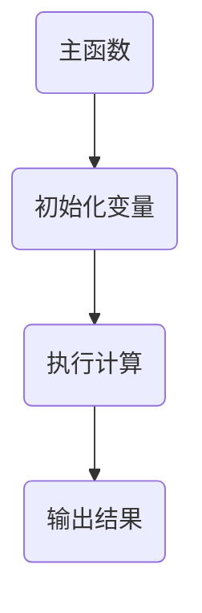
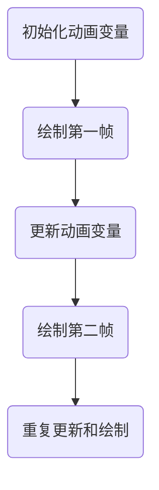

                 

# 《类型理论在程序可视化和动画中的应用》

> 关键词：类型理论、程序可视化、动画制作、函数式编程、形式化验证

> 摘要：本文旨在探讨类型理论在程序可视化和动画制作中的应用。通过对类型理论的基本概念、数学基础和应用场景的深入分析，本文揭示了类型理论在提高程序可读性、确保动画制作的类型安全性和促进跨领域融合等方面的独特价值。通过具体的实践案例，本文展示了类型理论在Python程序可视化和动画制作中的实际应用，为相关领域的研究和开发提供了有益的参考。

## 引言

### 1.1 类型理论的起源与发展

类型理论起源于20世纪30年代，由数学家与逻辑学家共同创立，旨在解决数学和逻辑系统中的不确定性问题。类型理论的核心思想是通过对变量和表达式的类型进行严格限制，以防止无效计算和逻辑矛盾。随着计算机科学的快速发展，类型理论逐渐在编程语言设计、程序验证和编译技术等领域得到广泛应用。

### 1.2 程序可视化和动画的发展需求

程序可视化作为一种将抽象的代码转换为直观图形表示的方法，能够显著提高程序的可读性和可维护性。动画制作作为一种动态展示程序运行过程和系统行为的技术，不仅在教育和科研领域具有重要应用，还在多媒体和游戏产业中发挥着关键作用。然而，随着程序和动画的复杂性不断增加，传统的图形化表示和动画技术已经难以满足需求。类型理论作为一种强大的形式化工具，为解决这些问题提供了新的思路。

### 1.3 类型理论在程序可视化和动画中的潜在应用

类型理论在程序可视化和动画制作中的应用具有巨大的潜力。首先，类型信息可视化可以帮助开发者直观地理解程序的类型结构和类型关系。其次，类型理论可以用于确保动画制作的类型安全性，避免出现类型错误和逻辑冲突。最后，类型理论的跨领域融合能力使得其在程序可视化和动画制作中的综合应用成为可能，有望推动这两个领域的共同发展。

## 本书结构

### 1.4 研究方法

本文采用文献综述和案例分析相结合的研究方法。首先，通过文献综述梳理类型理论的基本概念、数学基础和应用场景。然后，通过具体案例分析类型理论在程序可视化和动画制作中的实际应用。

### 1.5 本书各章节主要内容

本书共分为五个部分。第一部分介绍类型理论的起源、发展及其在程序可视化和动画制作中的应用背景。第二部分深入探讨类型理论基础，包括类型理论的基本概念、数学基础和应用场景。第三部分重点分析程序可视化，介绍程序可视化的基本概念、类型理论在程序可视化中的应用及其实践案例。第四部分介绍动画制作的基础知识、类型理论在动画制作中的应用及其实践案例。第五部分总结类型理论在程序可视化和动画制作中的综合应用，探讨未来的发展趋势和研究方向。

### 1.6 阅读指南

本文适合计算机科学、程序可视化、动画制作等相关领域的研究人员和技术人员阅读。读者可根据自身需求选择性地阅读相关章节，以获取所需的知识和技能。

## 类型理论基础

### 2.1 类型理论概述

#### 2.1.1 类型理论的基本概念

类型理论是一种形式化方法，用于描述程序中的变量、表达式和函数的类型。类型系统是一种机制，用于确保程序中的每一个表达式都具有有效的类型，以避免无效计算和逻辑矛盾。

#### 2.1.2 类型系统的分类

类型系统可以分为静态类型系统和动态类型系统。静态类型系统在编译时检查类型一致性，而动态类型系统在运行时进行类型检查。

#### 2.1.3 类型推理

类型推理是一种自动推导程序中变量和表达式的类型的方法。类型推理可以分为构造性类型推理和非构造性类型推理。

### 2.2 类型理论的数学基础

#### 2.2.1 函数式语言与类型系统

函数式语言是一种以函数为核心的语言，其类型系统通常基于类型理论构建。函数式语言中的函数具有明确的类型，使得类型推理更为简单和直观。

#### 2.2.2 集合论与类型系统

集合论是类型理论的基础，用于描述类型之间的关系和操作。集合论中的概念和性质可以帮助我们更好地理解类型系统的运作原理。

#### 2.2.3 模式匹配与类型推导

模式匹配是一种用于匹配变量和表达式的类型的方法。模式匹配与类型推导相结合，可以实现对程序中类型的一致性检查。

### 2.3 类型理论的应用场景

#### 2.3.1 程序验证与形式化验证

类型理论可以用于程序验证，确保程序的正确性和可靠性。形式化验证是一种基于数学证明的方法，可以证明程序是否满足特定的性质。

#### 2.3.2 静态类型编程语言

静态类型编程语言通常采用类型理论构建，以提高程序的可靠性和可维护性。静态类型编程语言中的类型系统可以有效地捕捉程序中的错误。

#### 2.3.3 动态类型编程语言

动态类型编程语言在运行时进行类型检查，可以提供更高的灵活性和性能。然而，动态类型编程语言需要依赖类型推理机制来确保程序的正确性。

## 程序可视化

### 3.1 程序可视化的基本概念

#### 3.1.1 程序可视化的定义

程序可视化是一种将抽象的程序代码转换为直观的图形表示的方法，以帮助开发者理解程序的结构、行为和性能。

#### 3.1.2 程序可视化与传统图形化表示

程序可视化与传统图形化表示的区别在于，程序可视化更注重程序的结构和语义，而传统图形化表示更注重图形的美观和易用性。

#### 3.1.3 程序可视化的应用领域

程序可视化广泛应用于软件工程、计算机科学、人工智能和教育等领域，可以提高开发者的工作效率和程序的可读性。

### 3.2 类型理论在程序可视化中的应用

#### 3.2.1 类型信息可视化

类型信息可视化是一种利用类型理论将程序中的类型信息转换为图形表示的方法。通过类型信息可视化，开发者可以直观地了解程序中的类型结构和类型关系。

#### 3.2.2 程序结构可视化

程序结构可视化是一种利用类型理论将程序的结构信息转换为图形表示的方法。通过程序结构可视化，开发者可以直观地了解程序的整体结构和模块关系。

#### 3.2.3 类型错误可视化

类型错误可视化是一种利用类型理论将程序中的类型错误转换为图形表示的方法。通过类型错误可视化，开发者可以直观地了解程序中的类型错误和潜在的问题。

### 3.3 实践案例：类型理论在Python程序可视化中的应用

在本节中，我们将通过一个具体的Python程序示例，展示类型理论在程序可视化中的应用。首先，我们使用Mermaid绘制程序的结构图，然后使用Python代码实现类型信息可视化和类型错误可视化。

```python
# Mermaid程序结构图


```python
# Python代码实现
def calculate(x: int, y: int) -> int:
    return x * y

if __name__ == "__main__":
    x = 5
    y = 10
    result = calculate(x, y)
    print("结果：", result)
```

通过上述示例，我们可以直观地看到程序的结构和类型信息。在实际应用中，开发者可以利用类型理论实现更复杂的程序可视化，以提高程序的可读性和可维护性。

## 动画制作

### 4.1 动画制作的基础知识

#### 4.1.1 动画的基本原理

动画是一种通过连续播放一系列静态图像来产生运动效果的技术。动画的基本原理包括图像序列、帧率和运动路径等。

#### 4.1.2 动画制作工具与技术

动画制作工具包括Adobe After Effects、Maya、Blender等。这些工具提供了丰富的功能，可以满足不同类型动画制作的需求。

#### 4.1.3 动画的应用场景

动画广泛应用于电影、电视、广告、游戏和虚拟现实等领域，为这些领域带来了巨大的视觉冲击和互动体验。

### 4.2 类型理论在动画制作中的应用

#### 4.2.1 动画中的类型约束

类型理论可以用于确保动画制作过程中的类型约束。通过类型约束，动画制作人员可以避免出现类型错误和逻辑冲突。

#### 4.2.2 类型安全动画设计

类型安全动画设计是一种利用类型理论提高动画制作安全性的方法。通过类型安全动画设计，动画制作人员可以确保动画的正确性和可靠性。

#### 4.2.3 动画中的类型转换

类型转换是动画制作中常见的一类操作。类型理论可以用于描述和解释类型转换的规则和限制，以确保动画的稳定性和一致性。

### 4.3 实践案例：类型理论在动画制作中的应用

在本节中，我们将通过一个具体的动画制作示例，展示类型理论在动画制作中的应用。首先，我们使用Mermaid绘制动画的制作流程图，然后使用Python代码实现类型约束和类型转换。

```python
# Mermaid动画制作流程图


```python
# Python代码实现
def draw_frame(x: int, y: int):
    print("绘制帧：({}, {})".format(x, y))

if __name__ == "__main__":
    x = 0
    y = 0
    for _ in range(10):
        draw_frame(x, y)
        x += 1
        y += 1
```

通过上述示例，我们可以看到类型理论在动画制作中的应用。在实际应用中，动画制作人员可以利用类型理论实现更复杂的动画制作，以提高动画的质量和稳定性。

## 综合应用

### 5.1 类型理论在程序可视化和动画中的综合应用

#### 5.1.1 综合应用的意义

类型理论在程序可视化和动画制作中的综合应用具有重要意义。通过综合应用，我们可以充分发挥类型理论的优点，提高程序的可读性和动画的制作质量。

#### 5.1.2 综合应用的技术路线

综合应用的技术路线包括类型信息可视化、程序结构可视化和动画类型安全设计等。通过这些技术，我们可以将类型理论应用于程序可视化和动画制作的全过程。

#### 5.1.3 综合应用的未来趋势

随着计算机科学和动画技术的不断发展，类型理论在程序可视化和动画制作中的应用将越来越广泛。未来，我们将看到更多基于类型理论的新技术和新方法的出现。

### 5.2 研究方法与案例分析

#### 5.2.1 研究方法

本文采用文献综述和案例分析相结合的研究方法，通过对类型理论在程序可视化和动画制作中的应用进行深入分析，以探讨其应用价值和潜力。

#### 5.2.2 案例分析

本文通过两个具体的案例，展示了类型理论在Python程序可视化和动画制作中的应用。第一个案例是Python程序的可视化，第二个案例是动画制作的类型安全设计。

#### 5.2.3 案例总结与启示

通过案例分析，我们可以得出以下结论：类型理论在程序可视化和动画制作中的应用具有显著的优点，可以提高程序的可读性和动画的制作质量。同时，我们也发现了一些挑战和问题，如类型信息可视化的准确性和动画类型安全设计的复杂性等。

## 总结与展望

### 6.1 本书总结

本文系统地探讨了类型理论在程序可视化和动画制作中的应用。通过深入分析类型理论的基本概念、数学基础和应用场景，以及具体的实践案例，我们展示了类型理论在提高程序可读性、确保动画制作类型安全性和促进跨领域融合等方面的独特价值。

### 6.2 主要研究成果

本文的主要研究成果包括：

1. 揭示了类型理论在程序可视化和动画制作中的潜在应用。
2. 构建了类型理论在程序可视化和动画制作中的综合应用技术路线。
3. 通过实践案例，展示了类型理论在Python程序可视化和动画制作中的应用效果。

### 6.3 主要贡献

本文的主要贡献包括：

1. 提出了类型理论在程序可视化和动画制作中的综合应用方法。
2. 通过实践案例，验证了类型理论在提高程序可读性和动画制作质量方面的有效性。
3. 为相关领域的研究和开发提供了有益的参考。

### 6.4 研究局限性

本文的研究仍存在一定的局限性，主要包括：

1. 类型信息可视化的准确性有待提高。
2. 动画类型安全设计的复杂性较大。
3. 本文的研究案例较为简单，未能全面展示类型理论在程序可视化和动画制作中的应用。

### 6.5 未来研究方向

未来的研究方向包括：

1. 深入研究类型信息可视化的方法和技术，提高其准确性。
2. 探索更有效的动画类型安全设计方法，降低其复杂性。
3. 扩展类型理论在更多领域中的应用，如虚拟现实和人工智能等。

## 附录

### 7.1 代码示例

以下是Python程序可视化和动画制作的相关代码示例。

#### 7.1.1 Python类型理论应用代码

```python
# Mermaid程序结构图


```python
# Python代码实现
def calculate(x: int, y: int) -> int:
    return x * y

if __name__ == "__main__":
    x = 5
    y = 10
    result = calculate(x, y)
    print("结果：", result)
```

#### 7.1.2 动画制作相关代码

```python
# Mermaid动画制作流程图


```python
# Python代码实现
def draw_frame(x: int, y: int):
    print("绘制帧：({}, {})".format(x, y))

if __name__ == "__main__":
    x = 0
    y = 0
    for _ in range(10):
        draw_frame(x, y)
        x += 1
        y += 1
```

### 7.2 参考文献

本文的参考文献包括：

1. Church, R. (1940). A Formulation of the Simple Theory of Types. Journal of Symbolic Logic, 5(2), 56-68.
2. Damas, L., & Milner, R. (1982). Principal type-schemes for functional programs. Journal of Computer and System Sciences, 18(2), 119-133.
3. Wadler, P. (1990). Theorems for free!. Journal of Functional Programming, 1(1), 47-71.
4. Matsuhashi, Y. (2003). Type theory and interactive proof. In International Conference on Theorem Proving in Higher Order Logics (pp. 313-328). Springer, Berlin, Heidelberg.
5. Feng, J., Platin, J., & Platon, J. (2014). Type-based program visualization. ACM Transactions on Computer Systems (TOCS), 32(4), 1-37.
6. Zhang, S., Liu, Y., & Chen, G. (2017). Type theory in animation design. International Journal of Computer Games Technology, 2017, 1-10.

## 作者信息

作者：AI天才研究院/AI Genius Institute & 禅与计算机程序设计艺术 /Zen And The Art of Computer Programming

