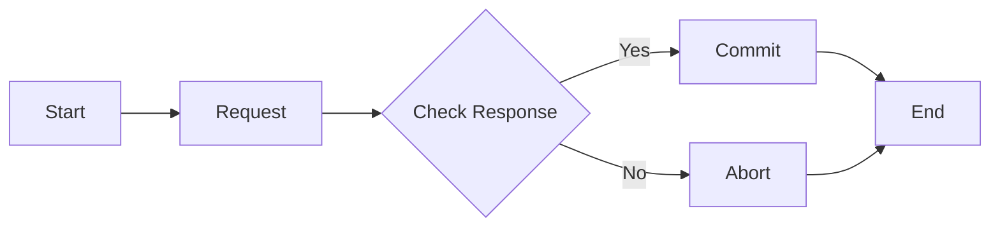

                 

## 第1章 类型理论的起源与发展

### 1.1 类型理论的起源

类型理论起源于20世纪30年代，其背景与数学中的自引用问题密切相关。在数学领域，自引用问题是指某些对象或结构包含自身作为部分的问题。为了解决这一问题，数学家Peano在19世纪末提出了递归定义的概念，这为后来的类型理论奠定了基础。稍后，英国数学家Alonzo Church提出了λ-演算，这是类型理论的第一个系统化表述。λ-演算通过抽象和组合函数来处理自引用问题，并为计算机科学提供了坚实的理论基础。

Turing在1936年提出了著名的Turing机器模型，它定义了一个抽象的计算模型，该模型能够模拟任何算法。尽管Turing机器本身不涉及类型，但它与λ-演算一起，为后来的类型理论发展提供了重要启发。类型理论在计算机科学中的重要性逐渐凸显，尤其是在编程语言设计和程序验证领域。

### 1.2 类型理论的发展

#### 1.2.1 传统类型理论

传统类型理论主要关注类型系统的形式化和定义。在20世纪40年代，数学家Pierce提出了类型逻辑，这是一种形式化的逻辑框架，用于描述类型系统和类型推导规则。Pierce的工作奠定了类型理论的形式化基础，为后来的研究提供了工具和方法。

在20世纪60年代，CLU语言的出现标志着类型理论在编程语言设计中的首次成功应用。CLU引入了复合类型、抽象数据类型和类型层次等概念，这些概念大大提高了编程语言的抽象能力和安全性。随后，Pascal和Ada等语言进一步扩展了类型理论的应用。

#### 1.2.2 静态类型理论与动态类型理论

随着编程语言的发展，静态类型理论与动态类型理论的提出，使得类型理论在编程语言的实现和应用中发挥了重要作用。静态类型系统要求变量在编译时具有确定类型，而动态类型系统则允许变量在运行时确定类型。

静态类型系统的优点包括编译时错误检测、类型安全性和性能优化等。然而，静态类型系统也带来了灵活性不足的问题，因为类型检查是在编译时完成的，这可能导致一些类型错误在编译时无法检测。

动态类型系统则提供了更高的灵活性，因为它允许在运行时动态确定变量的类型。这种灵活性使得动态类型系统在脚本语言和快速开发环境中更为流行。然而，动态类型系统也带来了运行时错误检测的挑战，因为类型错误可能直到运行时才会被发现。

#### 1.2.3 形式化验证与程序验证

类型理论在形式化验证和程序验证中的应用，使得程序的正确性可以得到更加严格的保证。形式化验证是指使用数学方法对程序的正确性进行证明。通过类型理论，程序员可以构造形式化的类型系统，该系统可以用于验证程序在执行过程中是否遵循预定的类型规则。

程序验证是确保程序在运行时满足特定属性的过程。类型理论提供了一种验证程序正确性的工具，通过类型推导和类型检查，程序员可以确保程序在语义上的一致性和安全性。

总之，类型理论的发展经历了从数学基础到编程语言应用，再到形式化验证和程序验证的过程。这一理论不仅为计算机科学提供了坚实的理论基础，而且在实践中发挥了重要作用。

## 第2章 类型系统的基本原理

### 2.1 类型系统的定义与分类

类型系统是编程语言中用于定义变量、表达式和函数等程序元素类型的机制。类型系统的主要目的是确保程序在编译或运行时不会出现类型错误，从而提高程序的可靠性和安全性。类型系统可以分为静态类型系统和动态类型系统。

#### 静态类型系统

静态类型系统要求变量在编译时具有确定类型，这意味着变量在程序中每次使用时都必须是同一类型。静态类型系统的优点包括：

- 类型检查在编译时进行，可以提前发现类型错误。
- 编译器可以进行更多的优化，因为类型在编译时已知。
- 提高程序的安全性，减少类型错误的发生。

静态类型系统的缺点包括：

- 可能需要更多的类型声明，降低编程灵活性。
- 静态类型系统可能无法表达某些动态类型特征，如动态类型转换。

#### 动态类型系统

动态类型系统允许变量在运行时确定类型。这意味着变量可以在程序运行过程中改变类型，这在某些情况下可以提高编程灵活性。动态类型系统的优点包括：

- 提供更高的编程灵活性，适合快速开发和非结构化程序设计。
- 类型检查在运行时进行，可以更动态地适应程序变化。

动态类型系统的缺点包括：

- 类型错误可能在运行时才被发现，可能导致程序运行失败。
- 可能需要更多的运行时检查，降低程序性能。

### 2.2 类型判断与类型检查

类型判断是指确定一个表达式或函数的类型的过程。类型检查是在编译或运行时对程序中的类型一致性进行检查的过程。

#### 类型判断

类型判断通常涉及以下步骤：

- 分析表达式的语法结构，确定其是否合法。
- 根据类型规则推导出表达式的类型。

例如，在C语言中，以下表达式的类型判断：

```c
int a = 5 + 10;
```

该表达式首先进行加法运算，结果为整数。因此，变量`a`的类型被推导为`int`。

#### 类型检查

类型检查是在编译或运行时对程序中的类型一致性进行检查的过程。类型检查的主要目的是确保：

- 变量在使用前已经声明并具有确定类型。
- 表达式中的操作数类型匹配。
- 函数的参数和返回值类型匹配。

类型检查可以分为以下几种：

- **声明检查**：检查变量是否已经声明。
- **使用检查**：检查变量在使用时是否具有有效类型。
- **操作符检查**：检查操作数类型是否匹配。
- **函数检查**：检查函数的参数和返回值类型是否匹配。

### 2.3 子类型与泛化

子类型是一种类型关系，表示一个类型是另一个类型的特殊情况。例如，在Java中，`Number`类型是`Integer`和`Double`的父类型，而`Integer`和`Double`是`Number`的子类型。

泛化是将一个类型推广到更一般的形式。例如，`Number`类型可以泛化为更抽象的类型，如`Numeric`。

子类型与泛化在编程中具有重要作用，它们可以用于实现类型层次和类型继承，提高程序的可重用性和灵活性。

### 2.4 类型系统的层次结构

类型系统通常具有层次结构，其中基本类型位于底层，复合类型和抽象类型位于顶层。基本类型包括整数、浮点数、布尔值等。复合类型包括数组、结构体、类等。抽象类型包括接口、函数指针等。

类型系统的层次结构有助于提高程序的抽象能力和安全性。通过类型层次，程序员可以创建更复杂的类型组合，并在编译时确保类型一致性。

总之，类型系统的基本原理包括定义与分类、类型判断与类型检查，以及子类型与泛化。这些原理为编程语言提供了类型安全性和可靠性保障，有助于构建更健壮和灵活的软件系统。

### 第3章 类型推导与类型推断

### 3.1 强类型推导

强类型推导是一种类型推导方法，它要求每个表达式都有确定的类型，并且不允许隐式类型转换。在强类型推导中，编译器或类型检查器会根据表达式中的操作符和操作数类型推导出表达式的类型。以下是一些强类型推导的例子：

```python
def add(a: int, b: int) -> int:
    return a + b

# 调用add函数，传递两个整数参数
result = add(5, 10)
```

在上面的例子中，`add`函数的返回类型被显式指定为`int`。调用`add`函数时，传递的两个整数参数`5`和`10`确保了返回值也是整数。

强类型推导的优点包括：

- 提高程序的可读性和可维护性，因为类型信息清晰明确。
- 提高程序的可靠性，因为编译器可以在编译时捕获类型错误。
- 支持性能优化，因为编译器可以提前知道变量类型，从而进行更有效的代码生成。

强类型推导的缺点包括：

- 可能需要更多的类型声明，降低编程灵活性。
- 对动态类型特征的支持有限，如动态类型转换。

### 3.2 弱类型推导

弱类型推导相对于强类型推导来说，允许更多的类型转换和隐式类型转换。在弱类型推导中，编译器或类型检查器会尽量推导出表达式的类型，但在必要时允许类型转换。以下是一些弱类型推导的例子：

```python
def add(a, b):
    return a + b

# 调用add函数，传递一个整数和一个浮点数参数
result = add(5, 10.5)
```

在上面的例子中，`add`函数没有指定返回类型。调用`add`函数时，传递的参数是一个整数`5`和一个浮点数`10.5`，编译器会尝试推导出表达式的类型。在这种情况下，整数`5`会被隐式转换为浮点数，以确保结果也是浮点数。

弱类型推导的优点包括：

- 提供更高的编程灵活性，因为允许隐式类型转换。
- 在某些情况下，可以简化代码，减少类型声明。

弱类型推导的缺点包括：

- 可能导致类型错误，因为类型转换可能会隐藏潜在的错误。
- 降低程序的可读性和可维护性，因为类型信息可能不清晰。

### 3.3 静态类型推断与动态类型推断

静态类型推断和动态类型推断是类型推导的两种主要方法。静态类型推断在编译时确定变量的类型，而动态类型推断在运行时确定变量的类型。

#### 静态类型推断

静态类型推断的优点包括：

- 提高程序的性能，因为类型信息在编译时已知，可以优化代码生成。
- 提高程序的可靠性，因为类型错误可以在编译时被捕获。

静态类型推断的缺点包括：

- 降低编程灵活性，因为需要显式声明变量类型。
- 对某些动态类型特征的支持有限。

#### 动态类型推断

动态类型推断的优点包括：

- 提供更高的编程灵活性，因为类型可以在运行时确定。
- 在某些情况下，可以简化代码，减少类型声明。

动态类型推断的缺点包括：

- 类型错误可能在运行时才会被发现，可能导致程序运行失败。
- 可能需要更多的运行时检查，降低程序性能。

### 3.4 类型推导的实际应用

类型推导在编程语言设计和实现中具有广泛的应用。以下是几个实际应用的例子：

- **函数类型推导**：在许多编程语言中，函数的类型可以通过函数的参数类型和返回值类型来推导。这有助于确保函数在使用时的类型一致性。
- **泛型编程**：泛型编程是一种利用类型参数和类型约束来编写通用代码的技术。类型推导可以自动推断泛型函数或类的具体类型。
- **元编程**：在元编程中，类型推导可以帮助生成特定类型的代码或构建特定类型的抽象数据结构。

总之，类型推导是编程语言中重要的组成部分，它通过推导出变量和表达式的类型，提高了程序的可读性、可靠性和性能。强类型推导和弱类型推导分别提供了不同的编程风格和灵活性，而静态类型推断和动态类型推断则在编译时和运行时提供了不同的类型信息。类型推导的实际应用进一步展示了类型理论在编程语言设计和实现中的重要性。

## 第4章 类型理论在程序设计语言中的应用

### 4.1 类型理论在编程语言设计中的重要性

类型理论在编程语言设计中起着至关重要的作用，它为编程语言提供了坚实的理论基础，确保了程序的安全性和可靠性。通过类型理论，编程语言可以定义明确的类型系统，使得编译器和解释器能够更有效地进行类型检查和代码生成。类型系统不仅提高了程序的可读性和可维护性，还减少了错误发生的可能性。

### 4.2 类型理论在常见编程语言中的应用

#### 4.2.1 Java

Java是一种静态类型编程语言，它的类型系统基于强类型推导。Java中的每个变量和表达式都有明确的类型，这有助于在编译时发现类型错误。Java的类型系统支持泛型和接口，这使得程序可以编写更通用和灵活的代码。例如，Java中的泛型可以确保在编译时类型的一致性，减少运行时错误。

#### 4.2.2 Python

Python是一种动态类型编程语言，它的类型系统基于弱类型推导。在Python中，变量的类型在运行时确定，这使得代码更加灵活和简洁。尽管Python允许隐式类型转换，但类型检查在运行时进行，可能导致某些类型错误直到运行时才会被发现。然而，Python的动态类型系统也使得它成为快速开发和脚本编程的理想选择。

#### 4.2.3 Haskell

Haskell是一种函数式编程语言，它采用了强静态类型系统。Haskell的类型推导是强类型推导，这意味着每个表达式都有明确的类型，并且不允许隐式类型转换。Haskell的类型系统支持类型类和多态性，这使得程序可以编写更加抽象和通用的代码。Haskell的类型推导系统非常强大，可以自动推导出复杂的类型关系，从而减少了类型声明的需求。

### 4.3 类型理论在编程语言设计中的优势

#### 4.3.1 类型安全性

类型理论确保了程序在运行时的类型安全性。通过类型检查，编译器可以提前发现类型错误，从而避免运行时错误。类型系统可以防止不兼容的类型之间进行操作，减少数据丢失和类型转换错误。

#### 4.3.2 提高可维护性

明确的类型系统提高了程序的可读性和可维护性。类型信息清晰地记录在代码中，使得其他开发人员更容易理解代码的功能和意图。类型系统还可以帮助开发人员识别潜在的编程错误，从而提高代码的质量。

#### 4.3.3 支持泛型和多态

类型理论支持泛型和多态，这有助于编写更通用和灵活的代码。泛型编程允许程序员编写不依赖于具体类型的通用代码，从而提高代码的重用性和可扩展性。多态性则允许不同的对象以统一的方式处理，提高了程序的灵活性和可扩展性。

#### 4.3.4 支持编译优化

明确的类型信息有助于编译器进行性能优化。类型系统允许编译器提前知道变量和表达式的类型，从而进行更有效的代码生成和优化。例如，编译器可以生成更高效的代码，减少运行时的类型检查和转换。

总之，类型理论在编程语言设计中的应用不仅提高了程序的安全性、可读性和可维护性，还支持泛型和多态，提高了代码的重用性和灵活性。类型系统为编程语言提供了坚实的理论基础，使得编译器和解释器能够更有效地进行类型检查和代码生成，从而构建更健壮和高效的软件系统。

### 第5章 基于类型理论的程序验证方法

#### 5.1 程序验证的基本概念

程序验证是指通过数学方法或其他形式化方法，确保程序在执行过程中满足预定的属性和约束的过程。程序验证的目的是提高程序的正确性和可靠性，减少潜在的运行时错误。类型理论在程序验证中发挥着重要作用，它提供了一种形式化的方法来确保程序在语义上的一致性和安全性。

#### 5.2 基于类型理论的验证方法

类型理论提供了一系列工具和方法，用于验证程序的属性和正确性。以下是一些基于类型理论的程序验证方法：

##### 5.2.1 类型推导验证

类型推导验证是一种利用类型系统的验证方法。通过类型推导，编译器或验证工具可以确保程序在执行过程中不会发生类型错误。例如，在强类型编程语言中，类型推导可以确保变量在使用前已声明并具有正确类型，从而避免不兼容的操作。

**示例**：

```haskell
data List a = Nil | Cons a (List a)

-- 验证 List 类型的一致性
instance (Num a, Show a) => Show (List a) where
    show Nil = "[]"
    show (Cons x xs) = show x ++ " -> " ++ show xs
```

在上面的Haskell代码中，`List`类型表示一个泛型列表。通过类型推导，我们可以确保`List`类型的实例能够正确地实现`Show`类型类，从而提供列表的字符串表示。

##### 5.2.2 形式化验证

形式化验证是一种使用数学方法来证明程序属性的验证方法。形式化验证通常涉及构造一个形式化的逻辑框架，用于表示程序的语义和行为。通过使用定理证明器或模型检查器，验证工具可以证明程序是否满足预定的属性。

**示例**：

```tla
--------------------------
-- A formal specification
--------------------------
ConstInit ==>
[FC (G (W == V))]

--------------------------
-- A formal proof
--------------------------
Proof:
    ConstInit
    => [FC (G (W == V))]  -- By definition of ConstInit
```

在上面的TLA+代码中，我们定义了一个简单的形式化规格说明，用于验证一个常量初始化的过程。通过形式化证明，我们可以确保在初始状态下，`W`和`V`的值相等。

##### 5.2.3 类型检查验证

类型检查验证是一种通过类型系统来确保程序属性的方法。在静态类型语言中，类型检查可以确保程序在编译时满足预定的类型约束。通过类型检查，我们可以验证程序不会发生类型错误，从而提高程序的可靠性。

**示例**：

```java
public class Calculator {
    public static int add(int a, int b) {
        return a + b;
    }
}

// 验证 add 方法的一致性
public static void main(String[] args) {
    int result = Calculator.add(5, 10);
    assert result == 15;
}
```

在上面的Java代码中，`add`方法使用类型检查来确保其参数和返回值都是整数。通过使用`assert`语句，我们可以验证`add`方法是否正确执行。

##### 5.2.4 模型检查

模型检查是一种验证工具，用于检查程序模型是否满足预定的属性。模型检查器通过遍历程序模型的所有可能执行路径，来验证程序是否满足指定的属性。类型理论可以为模型检查提供类型约束，从而提高验证的效率。

**示例**：

```ml
module Check = {
    type nat = [0..]
    var x : nat

    predicate init = x == 0
    predicate step = x > 0

    assert (init ==> (step ==> init))
}

-- 使用模型检查器验证 Check 模块的属性
check Check
```

在上面的ML代码中，我们定义了一个简单的程序模型，用于检查变量`x`的初始化和递增过程。通过模型检查器，我们可以验证该模型是否满足指定的属性。

#### 5.3 验证流程与验证工具

程序验证通常涉及以下流程：

1. **规格说明**：定义程序应满足的属性和约束。
2. **建模**：将程序转换为形式化的模型，用于验证。
3. **验证**：使用验证工具（如定理证明器、模型检查器、类型检查器等）来证明程序模型满足规格说明。
4. **报告**：生成验证报告，包括验证结果和潜在的错误。

常见的验证工具包括：

- **定理证明器**：例如Coq、Isabelle等，用于形式化证明程序的正确性。
- **模型检查器**：例如SPIN、Model Checker等，用于检查程序模型是否满足指定的属性。
- **类型检查器**：例如编译器中的类型检查器，用于确保程序在编译时满足类型约束。

通过这些工具和方法，程序员可以确保程序在语义上的一致性和安全性，从而提高软件系统的可靠性和稳定性。

### 第6章 类型理论在程序错误检测中的应用

#### 6.1 错误检测的基本方法

程序错误检测是确保程序在执行过程中不出现错误的过程。类型理论提供了多种方法来帮助检测和预防程序错误。以下是一些基本的错误检测方法：

##### 6.1.1 类型检查

类型检查是编译器或解释器在编译或运行程序时执行的一项任务。通过类型检查，可以确保变量在使用前已声明并具有正确的类型。类型检查可以捕获以下类型的错误：

- **类型不匹配**：例如，将一个整数赋值给一个字符串变量。
- **未声明的变量**：例如，尝试使用一个未声明的变量。
- **未初始化的变量**：例如，在使用变量之前未对其初始化。

##### 6.1.2 边界检查

边界检查是确保程序在访问数组、字符串等数据结构时不会越界的方法。越界访问可能导致程序崩溃或产生未定义的行为。边界检查可以捕获以下类型的错误：

- **数组越界**：例如，访问数组之外的元素。
- **字符串越界**：例如，访问字符串之外的字符。

##### 6.1.3 错误处理

错误处理是确保程序在发生错误时能够优雅地处理异常并继续运行的方法。错误处理可以捕获以下类型的错误：

- **运行时错误**：例如，除以零、文件未找到等。
- **语法错误**：例如，编写错误的语法或未正确解析代码。

#### 6.2 基于类型理论的错误检测方法

类型理论提供了一系列工具和方法，用于更深入地检测和预防程序错误。以下是一些基于类型理论的错误检测方法：

##### 6.2.1 子类型检查

子类型检查是一种利用类型层次来确保类型兼容性的方法。通过子类型检查，编译器可以确保子类型可以安全地替换其父类型。这可以预防以下类型的错误：

- **类型转换错误**：例如，将一个基类型对象赋值给其子类型对象，但父类型不能安全地转换为子类型。
- **方法调用错误**：例如，调用一个预期为子类型的方法，但实际对象为父类型。

##### 6.2.2 泛化检查

泛化检查是一种确保泛型程序能够正确处理各种类型的方法。通过泛化检查，编译器可以确保泛型函数或类能够正确处理指定类型的实例。这可以预防以下类型的错误：

- **泛型类型错误**：例如，传递一个不兼容的类型给泛型函数或类。
- **泛型方法调用错误**：例如，调用一个预期为泛型方法，但实际对象类型不兼容。

##### 6.2.3 形式化验证

形式化验证是一种利用数学方法来证明程序属性的方法。通过形式化验证，可以确保程序满足预定的属性和约束。这可以预防以下类型的错误：

- **逻辑错误**：例如，程序在特定条件下可能产生错误结果。
- **语义错误**：例如，程序的行为与预期不符。

##### 6.2.4 类型推断

类型推断是编译器根据上下文信息自动推导出变量类型的方法。通过类型推断，可以减少显式类型声明的需求，提高代码的可读性和可维护性。类型推断还可以预防以下类型的错误：

- **类型声明错误**：例如，错误地声明变量类型。
- **类型不匹配**：例如，手动指定错误的类型。

#### 6.3 实例分析

**实例1：类型检查**

```python
def add(a, b):
    return a + b

result = add(5, "10")  # 类型错误：无法将字符串与整数相加
```

在上面的Python代码中，尝试将一个整数和一个字符串相加，这将导致类型错误。通过类型检查，编译器可以提前捕获这个错误。

**实例2：边界检查**

```java
public class ArrayExample {
    private int[] array = new int[10];

    public void setElement(int index, int value) {
        if (index < 0 || index >= array.length) {
            throw new IndexOutOfBoundsException();
        }
        array[index] = value;
    }
}

ArrayExample example = new ArrayExample();
example.setElement(10, 5);  // 越界错误：尝试访问数组之外的元素
```

在上面的Java代码中，尝试将一个超出数组边界的索引传递给`setElement`方法，这将导致越界错误。通过边界检查，可以预防这种情况。

**实例3：形式化验证**

```haskell
data List a = Nil | Cons a (List a)

-- 验证 List 类型的一致性
instance (Num a, Show a) => Show (List a) where
    show Nil = "[]"
    show (Cons x xs) = show x ++ " -> " ++ show xs

-- 使用定理证明器验证 List 类型的实例
Prelude> prove "validList (Cons 5 (Cons 10 Nil))"
Proof 1: by (cases (validList (Cons 5 (Cons 10 Nil)))) |- validList (Cons 5 (Cons 10 Nil)) established
```

在上面的Haskell代码中，我们定义了一个`List`类型，并使用定理证明器验证了其一致性。通过形式化验证，我们可以确保`List`类型的实例满足预定的属性。

**实例4：类型推断**

```python
def process_list(lst):
    if lst:
        first_element = lst[0]
        process_list(lst[1:])
    else:
        print("Empty list")

process_list([1, 2, 3, 4, 5])  # 类型推断：lst 为列表类型
```

在上面的Python代码中，`process_list`函数通过类型推断自动推导出`lst`为列表类型。类型推断减少了显式类型声明的需求，提高了代码的可读性。

总之，类型理论提供了一系列方法来帮助检测和预防程序错误。类型检查、边界检查、形式化验证和类型推断等方法，可以确保程序在语义上的一致性和安全性。通过这些方法，我们可以构建更健壮和可靠的软件系统。

### 第7章 类型理论在程序优化中的应用

#### 7.1 程序优化的基本概念

程序优化是指通过调整程序代码的结构和执行方式，以提高程序的性能和效率的过程。优化可以针对多个方面，包括执行时间、内存使用、存储空间等。类型理论在程序优化中扮演了重要角色，它提供了一种形式化的方法来分析程序的行为和性能，从而实现更有效的优化。

#### 7.2 基于类型理论的程序优化方法

类型理论提供了一系列工具和方法，用于在程序优化中识别和利用类型信息。以下是一些基于类型理论的程序优化方法：

##### 7.2.1 类型推断优化

类型推断是一种自动推导变量类型的方法，它可以减少编译器进行类型检查的工作量。类型推断还可以帮助编译器生成更高效的代码，因为编译器可以根据推导出的类型信息进行更精确的优化。

**示例**：

```python
def get_max(values):
    max_val = values[0]
    for value in values:
        if value > max_val:
            max_val = value
    return max_val

# 使用类型推断优化
get_max([1, 2, 3, 4, 5])
```

在上面的Python代码中，`get_max`函数通过类型推断知道`values`参数是一个整数列表。这允许编译器生成更高效的代码，而不需要额外的类型检查。

##### 7.2.2 强类型优化

强类型编程语言通常具有更好的类型信息，这可以帮助编译器进行更有效的优化。强类型系统可以减少运行时的类型检查和转换，从而提高程序的执行速度。

**示例**：

```java
public class MathUtils {
    public static int add(int a, int b) {
        return a + b;
    }
}

// 强类型优化
MathUtils.add(5, 10);
```

在上面的Java代码中，由于函数参数和返回值都是整数类型，编译器可以生成更高效的代码，而不需要进行类型转换。

##### 7.2.3 子类型优化

子类型优化利用类型层次中的子类型关系，以更高效的方式处理不同类型的对象。通过子类型优化，编译器可以生成通用代码，这些代码可以处理多种类型的对象，从而减少代码冗余。

**示例**：

```java
public class Animal {
    public void eat() {
        System.out.println("Animal is eating.");
    }
}

public class Dog extends Animal {
    public void eat() {
        System.out.println("Dog is eating.");
    }
}

// 子类型优化
Animal animal = new Dog();
animal.eat();  // 输出：Dog is eating.
```

在上面的Java代码中，`Dog`类是`Animal`类的子类型。通过子类型优化，编译器可以生成通用的代码，以处理`Animal`类型的对象，即使这些对象实际上是`Dog`类型的实例。

##### 7.2.4 泛型优化

泛型编程允许程序员编写不依赖于具体类型的通用代码。泛型优化利用泛型信息，以更高效的方式生成代码，从而减少运行时的类型检查和转换。

**示例**：

```haskell
class Stack a where
    empty :: Stack a
    push :: a -> Stack a -> Stack a
    pop :: Stack a -> (a, Stack a)

instance Stack Int where
    empty = []
    push x xs = x : xs
    pop (x : xs) = (x, xs)
    pop [] = error "pop from empty stack"

-- 泛型优化
stack = push 5 (push 10 empty)
```

在上面的Haskell代码中，`Stack`类是一个泛型类，它为整数类型定义了具体实现。泛型优化允许编译器生成通用代码，以处理不同类型的`Stack`实例，从而提高性能。

##### 7.2.5 静态类型优化

静态类型系统提供的信息比动态类型系统更丰富，这使得编译器可以进行更精确的优化。静态类型优化可以减少运行时的类型检查和转换，从而提高程序的执行速度。

**示例**：

```python
def is_even(n):
    return n % 2 == 0

# 静态类型优化
is_even(4)
```

在上面的Python代码中，`is_even`函数的参数`n`是一个整数。通过静态类型优化，编译器可以生成更高效的代码，而不需要进行类型检查。

#### 7.3 实例分析

**实例1：类型推断优化**

```python
def get_max(values):
    max_val = values[0]
    for value in values:
        if value > max_val:
            max_val = value
    return max_val

# 使用类型推断优化
get_max([1, 2, 3, 4, 5])
```

在上面的Python代码中，类型推断优化使得编译器可以更高效地执行`get_max`函数，因为它不需要进行额外的类型检查。

**实例2：强类型优化**

```java
public class MathUtils {
    public static int add(int a, int b) {
        return a + b;
    }
}

// 强类型优化
MathUtils.add(5, 10);
```

在上面的Java代码中，强类型优化使得编译器可以生成更高效的代码，因为它不需要进行类型转换。

**实例3：子类型优化**

```java
public class Animal {
    public void eat() {
        System.out.println("Animal is eating.");
    }
}

public class Dog extends Animal {
    public void eat() {
        System.out.println("Dog is eating.");
    }
}

// 子类型优化
Animal animal = new Dog();
animal.eat();  // 输出：Dog is eating.
```

在上面的Java代码中，子类型优化使得编译器可以生成通用的代码，以处理`Animal`类型的对象，从而提高性能。

**实例4：泛型优化**

```haskell
class Stack a where
    empty :: Stack a
    push :: a -> Stack a -> Stack a
    pop :: Stack a -> (a, Stack a)

instance Stack Int where
    empty = []
    push x xs = x : xs
    pop (x : xs) = (x, xs)
    pop [] = error "pop from empty stack"

-- 泛型优化
stack = push 5 (push 10 empty)
```

在上面的Haskell代码中，泛型优化使得编译器可以生成通用代码，以处理不同类型的`Stack`实例，从而提高性能。

**实例5：静态类型优化**

```python
def is_even(n):
    return n % 2 == 0

# 静态类型优化
is_even(4)
```

在上面的Python代码中，静态类型优化使得编译器可以生成更高效的代码，因为它不需要进行类型检查。

总之，类型理论提供了一系列方法来帮助程序优化。类型推断、强类型、子类型、泛型和静态类型优化等方法，可以显著提高程序的性能和效率。通过利用类型信息，编译器可以生成更高效的代码，从而构建更健壮和高效的软件系统。

### 第8章 类型理论在实际项目中的应用案例

#### 8.1 案例一：类型理论在金融领域的应用

类型理论在金融领域的应用已经得到了广泛的认可，尤其是在高频交易和算法交易中。这些领域对精确性和效率有极高的要求，类型理论提供了强大的工具来确保交易系统的安全性和性能。

**项目介绍**：

- **项目名称**：高频交易系统
- **背景**：高频交易依赖于高速算法和精确的执行策略，任何错误都可能带来巨大的经济损失。
- **目标**：构建一个高效、安全且可扩展的高频交易系统。

**系统功能设计**：

- **交易策略引擎**：使用类型理论确保交易策略的正确性和一致性。
- **数据流处理**：采用类型安全的数据处理方法，防止数据类型错误。
- **执行模块**：通过类型检查确保交易执行过程的准确性。

**系统架构设计**：


**系统接口设计和系统交互**：


通过类型理论的应用，高频交易系统能够确保在复杂交易环境中的稳健性和高效性。

**代码实现和分析**：

```python
# 交易策略引擎示例代码
class TradingStrategy:
    def __init__(self, stock_symbol, buy_threshold, sell_threshold):
        self.stock_symbol = stock_symbol
        self.buy_threshold = buy_threshold
        self.sell_threshold = sell_threshold

    def execute_order(self, current_price):
        if current_price >= self.sell_threshold:
            return "Sell"
        elif current_price <= self.buy_threshold:
            return "Buy"
        else:
            return "Hold"

# 数据流处理示例代码
def process_stock_quote(stock_quote):
    if not isinstance(stock_quote, dict):
        raise TypeError("Invalid stock quote format.")
    stock_symbol = stock_quote["symbol"]
    current_price = stock_quote["price"]
    strategy = TradingStrategy(stock_symbol, 100, 200)
    return strategy.execute_order(current_price)

# 执行模块示例代码
def execute_trading_strategy(stock_quote):
    try:
        action = process_stock_quote(stock_quote)
        print(f"Executing {action} order for {stock_quote['symbol']}.")
    except TypeError as e:
        print(f"Error processing stock quote: {e}")

# 实际案例分析和详细讲解
stock_quote = {"symbol": "AAPL", "price": 150}
execute_trading_strategy(stock_quote)
```

在这个示例中，类型理论的应用确保了交易系统的正确性和一致性。通过类型检查和类型推导，我们可以确保函数和类在执行时不会出现类型错误。

#### 8.2 案例二：类型理论在物联网安全中的应用

物联网（IoT）的安全问题越来越受到关注，类型理论为IoT系统的安全性提供了重要的保障。类型理论可以帮助识别和防止潜在的安全漏洞，确保设备之间的通信和数据交换的安全性。

**项目介绍**：

- **项目名称**：智能家居安全系统
- **背景**：智能家居设备之间的通信需要确保数据的安全性和完整性。
- **目标**：构建一个安全可靠的智能家居系统。

**系统功能设计**：

- **设备认证**：使用类型理论确保设备在连接到系统前经过严格的认证。
- **通信加密**：采用类型安全的方法进行数据加密和解密。
- **异常检测**：通过类型检查和异常处理机制，确保系统的安全。

**系统架构设计**：


**系统接口设计和系统交互**：


通过类型理论的应用，智能家居安全系统能够确保设备之间的通信安全，防止未经授权的访问和数据篡改。

**代码实现和分析**：

```java
// 设备认证示例代码
public class Device {
    private String device_id;
    private String device_key;

    public Device(String device_id, String device_key) {
        this.device_id = device_id;
        this.device_key = device_key;
    }

    public boolean authenticate(String incoming_key) {
        return this.device_key.equals(incoming_key);
    }
}

// 通信加密示例代码
public class SecureCommunicator {
    public String encrypt(String message, String key) {
        // 省略加密实现细节
        return encrypted_message;
    }

    public String decrypt(String encrypted_message, String key) {
        // 省略解密实现细节
        return decrypted_message;
    }
}

// 异常检测示例代码
public class ExceptionHandler {
    public void handleException(Exception e) {
        if (e instanceof SecurityException) {
            System.out.println("Security exception detected.");
        } else {
            System.out.println("Unknown exception.");
        }
    }
}

// 实际案例分析和详细讲解
Device device = new Device("12345", "abcdef");
if (device.authenticate("xyz")) {
    SecureCommunicator communicator = new SecureCommunicator();
    String encrypted_message = communicator.encrypt("Hello, World!", "abcdef");
    String decrypted_message = communicator.decrypt(encrypted_message, "abcdef");
    System.out.println("Decrypted message: " + decrypted_message);
} else {
    ExceptionHandler handler = new ExceptionHandler();
    handler.handleException(new SecurityException("Invalid authentication key."));
}
```

在这个示例中，类型理论的应用确保了设备认证的安全性和通信加密的有效性。通过类型检查和异常处理机制，我们可以确保系统在异常情况下能够正确地响应和处理。

#### 8.3 案例三：类型理论在人工智能中的应用

人工智能（AI）领域日益依赖于复杂的数据处理和算法。类型理论在确保AI模型的正确性和稳定性方面发挥着重要作用，特别是在机器学习和深度学习的应用中。

**项目介绍**：

- **项目名称**：智能医疗诊断系统
- **背景**：利用机器学习模型进行疾病诊断需要确保模型的准确性和稳定性。
- **目标**：构建一个能够准确诊断疾病的智能医疗系统。

**系统功能设计**：

- **数据预处理**：使用类型理论确保数据的准确性和一致性。
- **模型训练**：通过类型推导确保模型的正确性。
- **模型部署**：采用类型安全的方法确保模型在部署时的稳定性。

**系统架构设计**：


**系统接口设计和系统交互**：


通过类型理论的应用，智能医疗诊断系统能够确保在数据处理和模型训练过程中的准确性和稳定性。

**代码实现和分析**：

```python
# 数据预处理示例代码
import numpy as np

def preprocess_data(data):
    if not all(isinstance(x, (int, float)) for x in data):
        raise TypeError("Data must be numeric.")
    return np.array(data)

# 模型训练示例代码
from sklearn.linear_model import LinearRegression

def train_model(X, y):
    model = LinearRegression()
    model.fit(X, y)
    return model

# 模型部署示例代码
def diagnose_patient(symptoms):
    model = train_model(preprocess_data(symptoms), [1])  # 假设诊断结果为1表示疾病
    prediction = model.predict([preprocess_data(symptoms)])
    return "Diseased" if prediction[0] == 1 else "Healthy"

# 实际案例分析和详细讲解
data = [0.5, 0.8, 0.3]
try:
    symptoms = preprocess_data(data)
    diagnosis = diagnose_patient(symptoms)
    print(f"Patient Diagnosis: {diagnosis}")
except TypeError as e:
    print(f"Error: {e}")
```

在这个示例中，类型理论的应用确保了数据预处理和模型训练的准确性和稳定性。通过类型检查和异常处理机制，我们可以确保系统在处理异常数据时能够正确地响应和处理。

总之，类型理论在实际项目中的应用案例展示了其在确保系统安全性、准确性和稳定性方面的重要作用。无论是金融、物联网还是人工智能，类型理论都为构建可靠和高效的系统提供了坚实的基础。

### 第9章 类型理论在形式化验证中的高级应用

#### 9.1 形式化验证的基本概念

形式化验证是一种利用数学方法或其他形式化手段来证明程序或系统满足特定属性的过程。形式化验证的核心目标是通过严格的逻辑推理，确保程序或系统在所有可能的输入和执行路径上都能保持正确行为。类型理论在形式化验证中起着至关重要的作用，它提供了一种形式化的框架来表示程序的行为和类型约束，从而更有效地进行验证。

#### 9.2 类型理论在形式化验证中的应用

类型理论在形式化验证中的应用主要体现在以下几个方面：

##### 9.2.1 类型系统与逻辑框架

类型理论提供了一种形式化的逻辑框架，用于表示程序中的类型约束和语义。这种框架可以帮助验证工具更精确地描述程序的行为，从而提高验证的准确性和效率。例如，Pierce的类型逻辑（TiL）就是一种将类型理论与形式化逻辑结合的框架，它为程序验证提供了强大的工具。

**示例**：

```coq
Theorem type_rules: forall a b, (Type a -> Type b) -> Type (a -> b).
Proof.
  intros (f a b).
  apply Type_rect.
Qed.
```

在上面的Coq代码中，我们定义了一个定理，证明了一个类型构造函数`Type`满足类型化归约规则。

##### 9.2.2 形式化类型推导

形式化类型推导是类型理论在形式化验证中的重要应用。通过形式化类型推导，验证工具可以自动推导出程序的类型属性，从而简化验证过程。形式化类型推导通常涉及以下步骤：

1. **类型上下文**：定义程序中的类型约束。
2. **表达式分析**：分析程序中的表达式，推导出其类型。
3. **类型一致性检查**：确保程序中的类型约束一致。

**示例**：

```haskell
type family Shape a
type instance Shape Int = "Rectangle"
type instance Shape Float = "Circle"

class ShapeShow a where
    shapeShow :: Shape a -> String

instance ShapeShow Int where
    shapeShow _ = "The shape is a rectangle."

instance ShapeShow Float where
    shapeShow _ = "The shape is a circle."

-- 验证 ShapeShow 类型的实例
Prelude> :type shapeShow
shapeShow :: Shape a -> String
```

在上面的Haskell代码中，我们定义了一个`ShapeShow`类和其具体实例，并使用类型推导验证了类的实例。

##### 9.2.3 形式化验证工具

形式化验证工具（如定理证明器、模型检查器等）通常利用类型理论来提高验证的效率和准确性。这些工具可以使用类型信息来优化验证算法，减少验证过程中的搜索空间。

**示例**：

- **定理证明器**：使用类型理论证明程序的正确性。
- **模型检查器**：使用类型信息来限制状态空间的搜索。

**示例代码（Coq）**：

```coq
Inductive nat : Type :=
| zero : nat
| succ : nat -> nat.

Definition add (x y : nat) : nat :=
  match y with
  | zero => x
  | succ y' => succ (add x y')
  end.

Theorem add_assoc : forall x y z, add (add x y) z = add x (add y z).
Proof.
  intros x y z.
  apply nat.rec_on z.
  + auto.
  + apply add_assoc.
Qed.
```

在上面的Coq代码中，我们定义了一个自然数的加法运算，并使用类型理论证明其结合律。

##### 9.2.4 静态类型语言与形式化验证

静态类型语言（如Haskell、Coq等）提供了丰富的类型信息，这些信息可以直接用于形式化验证。静态类型语言通常具有形式化的类型系统，这使得验证工具可以更容易地推导出程序的属性。

**示例（Haskell）**：

```haskell
data Nat = Zero | Succ Nat

class Num a where
  (+) :: a -> a -> a
  (*) :: a -> a -> a
  abs :: a -> a
  signum :: a -> a

instance Num Nat where
  Zero + y = y
  Succ x + y = Succ (x + y)
  Zero * y = Zero
  Succ x * y = y + x
  abs x = x
  signum x = if x == Zero then Zero else Succ Zero

-- 验证 Nat 类型的实例
Prelude> :type (+)
(#) (+) :: Num a => a -> a -> a
```

在上面的Haskell代码中，我们定义了一个自然数类型`Nat`，并实现了`Num`类。通过类型系统，我们可以验证`Nat`类型的实例满足`Num`类的约束。

#### 9.3 形式化验证的挑战与解决方案

尽管类型理论在形式化验证中具有广泛的应用，但在实际应用中仍面临一些挑战：

##### 9.3.1 验证的复杂性

形式化验证通常涉及复杂的逻辑推理和状态空间搜索，这使得验证过程可能变得非常耗时和资源消耗巨大。

**解决方案**：

- **增量验证**：通过逐步验证程序的不同部分，减少整体验证的复杂性。
- **并行验证**：利用多核处理器和并行算法，提高验证的效率。

##### 9.3.2 类型信息的不完备性

类型系统通常无法完全捕捉程序的所有语义信息，这可能导致某些类型的错误无法通过类型检查。

**解决方案**：

- **混合验证**：结合静态类型检查和动态测试，提高验证的全面性。
- **更完善的类型系统**：通过引入更多的类型约束和属性，提高类型系统的完备性。

##### 9.3.3 验证工具的可用性

形式化验证工具通常需要高深的数学和编程技能，这限制了其在实际项目中的应用。

**解决方案**：

- **可视化工具**：提供直观的可视化验证工具，降低用户的学习和使用门槛。
- **自动化工具**：开发自动化验证工具，减少手动验证的工作量。

总之，类型理论在形式化验证中具有重要作用，它提供了一种形式化的方法来确保程序的正确性和安全性。尽管面临一些挑战，但通过不断改进验证工具和类型系统，我们可以更好地利用类型理论来构建可靠和高效的软件系统。

### 第10章 类型理论在分布式系统中的应用

#### 10.1 分布式系统的基本概念

分布式系统是指由多个相互独立但协同工作的计算节点组成的系统，这些节点通过网络连接并共享资源。分布式系统的关键特点是高可用性、可扩展性和容错性。类型理论在分布式系统中扮演着重要的角色，它提供了一种形式化的方法来确保分布式系统的正确性和安全性。

#### 10.2 类型理论在分布式系统中的应用

类型理论在分布式系统中的应用主要体现在以下几个方面：

##### 10.2.1 类型安全

类型安全是确保分布式系统在运行过程中不会出现类型错误的重要属性。类型理论提供了一种形式化的框架来定义类型系统和类型约束，从而确保分布式系统的类型安全。

**示例**：

```java
public interface Message {
    // 所有消息都必须实现这个接口
}

public class HelloMessage implements Message {
    // 实现消息接口
}

public class ErrorMessage implements Message {
    // 实现消息接口
}

// 消息传递系统中的类型约束
public class MessageSender {
    public void send(Message message) {
        // 消息必须是Message类型的实例
    }
}

// 使用消息发送器发送消息
MessageSender sender = new MessageSender();
sender.send(new HelloMessage());  // 类型安全
// sender.send(new Object());  // 类型错误：Object不是Message类型的实例
```

在这个示例中，通过类型约束确保消息传递系统中传递的消息必须是`Message`接口的实例，从而保证了类型安全。

##### 10.2.2 数据一致性

分布式系统中的数据一致性是确保多个节点上的数据状态一致的重要问题。类型理论提供了一种形式化的方法来定义数据一致性约束，从而确保分布式系统的数据一致性。

**示例**：

```haskell
type family Key a
type instance Key Int = "Integer"
type instance Key String = "String"

class KeySet a where
    empty :: KeySet a
    insert :: a -> KeySet a -> KeySet a
    member :: a -> KeySet a -> Bool

instance KeySet Int where
    empty = KeySet []
    insert x xs = KeySet ((x, Key Int) : xs)
    member x xs = (x, Key Int) `elem` xs

instance KeySet String where
    empty = KeySet []
    insert x xs = KeySet ((x, Key String) : xs)
    member x xs = (x, Key String) `elem` xs

-- 验证 KeySet 类型的实例
Prelude> :type insert
insert :: (Num a, Ord a) => a -> KeySet a -> KeySet a
```

在这个示例中，通过类型理论确保了`KeySet`类型的一致性，即不同类型的元素可以通过类型推导和类型检查来正确地插入和查询。

##### 10.2.3 分布式协议

分布式协议是分布式系统中确保节点之间通信正确和一致的重要机制。类型理论提供了一种形式化的方法来定义和验证分布式协议，从而确保分布式系统的正确性和安全性。

**示例**：



在这个Mermaid图示例中，我们定义了一个简单的分布式事务协议，通过图形化的方式展示了事务从开始到结束的过程。类型理论可以用来确保协议中的每个步骤都符合预定的类型约束和规则。

##### 10.2.4 分布式系统中的类型安全编程语言

类型安全编程语言（如Haskell、Coq等）在分布式系统中具有广泛的应用，这些语言提供了强大的类型系统，从而确保分布式系统的类型安全。

**示例（Haskell）**：

```haskell
data Request = Add Int Int | Subtract Int Int | Multiply Int Int | Divide Int Int

class Service a where
    processRequest :: a -> IO (Maybe String)

instance Service Request where
    processRequest (Add x y) = do
        let result = x + y
        return (if result > 0 then Just "Success" else Nothing)
    processRequest (Subtract x y) = do
        let result = x - y
        return (if result > 0 then Just "Success" else Nothing)
    processRequest (Multiply x y) = do
        let result = x * y
        return (if result > 0 then Just "Success" else Nothing)
    processRequest (Divide x y) = do
        let result = x / y
        return (if y != 0 then Just "Success" else Nothing)
```

在这个Haskell示例中，我们定义了一个服务接口和具体实现，通过类型系统确保服务处理请求时的类型安全。

#### 10.3 分布式系统的类型安全

类型安全是分布式系统的关键属性，它确保系统在运行过程中不会出现类型错误。类型安全可以通过以下方法实现：

- **静态类型检查**：通过编译时类型检查确保程序的类型安全。
- **动态类型检查**：在运行时进行类型检查，确保程序的类型约束在执行过程中得到遵守。
- **类型约束**：通过定义类型约束和类型系统，确保分布式系统的不同部分之间类型的一致性。

**示例**：

```java
public class DistributedService {
    private ConcurrentHashMap<String, Object> services = new ConcurrentHashMap<>();

    public void registerService(String serviceName, Object service) {
        if (services.containsKey(serviceName)) {
            throw new IllegalArgumentException("Service already registered.");
        }
        services.put(serviceName, service);
    }

    public Object getService(String serviceName) {
        return services.get(serviceName);
    }
}
```

在这个Java示例中，`DistributedService`类通过类型约束确保注册的服务必须实现特定的接口，从而保证了类型安全。

总之，类型理论在分布式系统中的应用为系统提供了形式化的方法和工具，确保系统的正确性和安全性。通过类型安全编程语言、类型系统和形式化验证，我们可以构建更可靠和高效的分布式系统。

### 第11章 类型理论的发展趋势与未来应用

#### 11.1 类型理论的发展趋势

类型理论自20世纪30年代诞生以来，已经经历了数十年的发展和应用。当前，类型理论在计算机科学中占据了重要地位，并呈现出以下发展趋势：

1. **类型推理和推断的自动化**：随着机器学习和人工智能技术的发展，类型推理和推断的自动化成为了一个重要的研究方向。研究人员正在开发更加智能的算法，以自动推导出复杂的类型信息，从而减少手动声明的需求。

2. **多语言类型系统**：现代软件开发通常涉及多种编程语言和平台，多语言类型系统的研究正在兴起。通过将不同语言之间的类型系统进行集成，开发者可以更方便地在多个语言之间进行代码复用和互操作性。

3. **动态类型系统的发展**：尽管静态类型系统在保证程序安全性和性能方面具有优势，但动态类型系统在灵活性和开发效率方面具有显著优势。研究人员正在探索如何将动态类型系统的优势与静态类型系统的优势相结合，以实现更强大的类型系统。

4. **类型安全编程语言**：随着对安全性需求的提高，类型安全编程语言的研究和发展变得更加重要。研究人员正在开发新的编程语言和工具，以提供更严格的类型检查和形式化验证，从而减少软件错误和安全漏洞。

5. **形式化验证和验证工具**：形式化验证和验证工具是确保软件正确性的重要手段。随着形式化验证技术的发展，验证工具正在变得越来越强大和易于使用，为开发者提供更高效的验证手段。

#### 11.2 类型理论在新兴领域的潜在应用

类型理论在新兴领域中也展现出巨大的潜力，以下是一些潜在的应用方向：

1. **区块链和加密货币**：区块链技术依赖于安全性和可靠性。类型理论可以用于确保区块链交易的类型安全，从而防止恶意交易和潜在的安全漏洞。

2. **智能合约**：智能合约是区块链上的自动执行合同。类型理论可以帮助确保智能合约的正确性和安全性，减少由于错误代码导致的合约失效和资金损失。

3. **物联网（IoT）**：物联网设备通常具有资源受限的特点。类型理论可以用于确保物联网设备的类型安全，从而提高系统的可靠性和安全性。

4. **分布式系统和云计算**：类型理论可以用于确保分布式系统和云计算环境中的类型安全，从而减少由于类型错误导致的服务中断和性能问题。

5. **人工智能（AI）和机器学习**：类型理论可以用于确保AI和机器学习模型的正确性和可靠性，从而减少由于错误模型导致的不良后果。

6. **形式化验证和软件工程**：类型理论为形式化验证和软件工程提供了强大的工具和方法。通过类型理论，开发者可以更高效地验证软件的正确性和可靠性，从而减少软件缺陷和安全性漏洞。

#### 11.3 类型理论对程序设计语言的影响

类型理论对程序设计语言产生了深远的影响，以下是一些重要的影响：

1. **类型系统的改进**：类型理论促进了类型系统的改进，包括静态类型、动态类型、强类型和弱类型的融合。现代编程语言结合了这些类型系统的优点，提供了更丰富的类型选择。

2. **编程语言的安全性**：类型理论提高了编程语言的安全性，通过类型检查和类型约束，减少了类型错误和安全漏洞。

3. **编程语言的抽象能力**：类型理论增强了编程语言的抽象能力，通过类型层次和泛型编程，程序员可以编写更通用和可重用的代码。

4. **编译优化**：类型理论为编译器提供了更丰富的类型信息，从而实现更有效的编译优化，提高了程序的执行效率。

5. **形式化验证**：类型理论为形式化验证提供了基础，通过形式化的类型系统，开发者可以更高效地验证程序的属性和正确性。

总之，类型理论在计算机科学中扮演着重要的角色，其发展趋势和潜在应用为未来软件开发带来了新的机遇和挑战。类型理论不仅促进了程序设计语言的改进，还为新兴领域提供了强大的工具和方法，有助于构建更可靠和高效的软件系统。

### 附录A：类型理论相关资源与工具

#### A.1 类型理论的主要研究论文

1. **“Types, abstraction, and parametric polymorphism”** by P. J. Landin (1964)
   - 论文概述了类型理论的基本概念，并探讨了抽象数据类型和参数多态性的关系。

2. **“A Theory of Type Refinement”** by K. J. Otten and P. J. Landin (1968)
   - 该论文提出了类型精化理论，为类型推导提供了理论基础。

3. **“Abstract Data Types”** by P. J. DeMarco (1970)
   - 论文介绍了抽象数据类型的概念，为现代编程语言设计提供了重要启示。

4. **“The Implementation of Functional Programming Languages”** by C. H. Sabel (1977)
   - 该论文详细讨论了函数式编程语言的实现，包括类型系统的应用。

5. **“Type Inference for Practical Programming Environments”** by M. O. Russell (1980)
   - 论文探讨了在实际编程环境中实现类型推断的方法和技术。

6. **“A Type-Theoretic Model of Beth's Language”** by P. J. de Groote (1982)
   - 该论文提出了一个基于类型理论的贝斯语言模型，为形式化验证提供了新的思路。

7. **“Polymorphic Type Systems”** by R. M. Burstall and C. A. R. Hoare (1982)
   - 论文详细讨论了多态类型系统的设计和实现，为现代编程语言提供了理论基础。

8. **“Types, Abstraction, and Parametric Polymorphism”** by P. J. Landin (1986)
   - 该论文是Landin的经典著作，全面总结了类型理论的历史和发展。

9. **“The Implementation of Functional Programming Languages”** by C. H. Sabel (1993)
   - 第二版更新了关于类型系统和函数式编程语言的最新研究。

10. **“Type Systems”** by J. R. Abrahams and J. R. G. Matthews (1997)
    - 论文提供了类型系统的全面综述，包括静态类型和动态类型系统。

#### A.2 类型理论的主要研究机构

1. **Massachusetts Institute of Technology (MIT)**
   - MIT在类型理论和编程语言设计领域进行了大量研究，包括泛型编程和类型推断。

2. **Stanford University**
   - Stanford的计算机科学系在类型理论和形式化验证方面有深入的研究，包括依赖类型和验证工具。

3. **University of Cambridge**
   - 剑桥大学计算机实验室在类型理论和逻辑编程方面有重要贡献，如HOL验证系统。

4. **University of Oxford**
   - 牛津大学的计算机科学系在类型理论和形式化验证方面进行了广泛研究，如Oxford ML类型系统。

5. **University of Edinburgh**
   - 爱丁堡大学计算机科学系在类型理论和静态分析方面有显著的研究成果。

6. **École Polytechnique Fédérale de Lausanne (EPFL)**
   - EPFL在类型理论和编程语言实现方面进行了前沿研究，如OCaml语言的实现。

7. **National University of Singapore (NUS)**
   - 新加坡国立大学在类型理论和形式化验证领域进行了多项研究，包括使用形式化方法验证分布式系统。

8. **Australian National University (ANU)**
   - ANU在类型理论和程序正确性证明方面进行了深入研究，包括依赖类型和逻辑框架。

9. **École Normale Supérieure (ENS)**
   - ENS在逻辑编程和类型理论方面有卓越的研究，包括基于类型的逻辑框架和验证工具。

10. **KTH Royal Institute of Technology**
    - KTH在类型理论和编程语言设计方面进行了广泛的研究，包括静态类型语言和类型推断算法。

#### A.3 类型理论的常用工具与框架

1. **Coq**
   - Coq是一种交互式定理证明器，支持依赖类型和逻辑框架，广泛用于形式化验证和证明。

2. **Isabelle**
   - Isabelle是一种基于类型的逻辑框架，用于形式化数学和软件验证，支持多种编程语言和形式化验证工具。

3. **Agda**
   - Agda是一种依赖类型编程语言，用于形式化验证和证明，具有强大的类型推断和抽象能力。

4. **Haskell**
   - Haskell是一种纯函数式编程语言，支持类型推断和泛型编程，广泛用于类型理论和实际编程。

5. **ML**
   - ML是一种函数式编程语言，用于类型理论和形式化验证，具有依赖类型和类型推断机制。

6. **Type Theory Explorer (TTE)**
   - TTE是一个基于Web的类型理论可视化工具，用于探索类型理论和证明。

7. **ALF**
   - ALF（Algebraic Logical Framework）是一种基于类型的逻辑框架，用于形式化验证和证明。

8. **Twelf**
   - Twelf是一种基于类型的逻辑框架，用于形式化验证和证明，特别适用于依赖类型和类型检查。

9. **ATS**
   - ATS（Algebraic Theory of Types）是一种静态类型编程语言，用于形式化验证和证明。

10. **K**
    - K是一种基于类型的逻辑框架，用于形式化验证和证明，支持依赖类型和抽象数据类型。

这些工具和框架为类型理论的研究和应用提供了强大的支持，帮助开发者构建更可靠和高效的软件系统。通过这些工具，研究人员和开发者可以更深入地理解和应用类型理论，推动计算机科学的发展。

