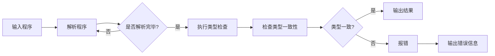
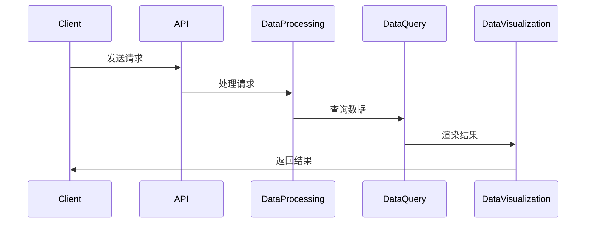
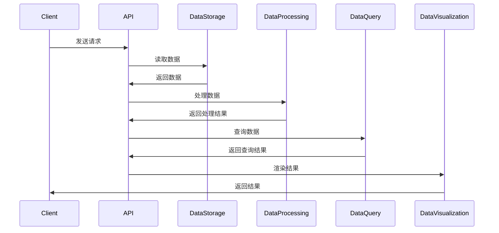

                 

# 类型理论在软件架构评估中的应用

> 关键词：类型理论、软件架构评估、可维护性、可扩展性、可靠性、效率、适应性、可持续性

> 摘要：本文旨在探讨类型理论在软件架构评估中的应用，从类型理论的基本概念、发展历程、核心概念、工具与技术等方面进行介绍，并深入分析类型理论在软件架构设计、评估和演进中的应用价值，以及其在软件架构管理中的实际意义。通过详细的项目实战和分析案例，本文展示了类型理论在提升软件架构质量、保障软件系统稳定性和可持续性方面的重要作用。

## 第一部分：类型理论基础

### 第1章：类型理论概述

#### 1.1 类型理论的基本概念

类型系统（Type System）是计算机语言中的一组规则，用于指定数据值的语义和表达数据类型之间关系的集合。类型系统的目的是提高程序的可靠性、可维护性和效率。通过类型检查，编译器或解释器可以在编译或运行时检测出类型错误，从而减少程序运行时的错误。

#### 1.2 类型理论的发展历程

类型理论起源于20世纪50年代，由Pierce在其博士论文中首次提出。自那以后，类型理论经历了多个发展阶段，从简单的静态类型系统到动态类型系统，再到现代的依赖类型系统和存在类型系统。

#### 1.3 类型理论的数学基础

类型理论的基础是数学逻辑，特别是范畴论和代数结构。类型理论中常用的数学基础包括朴素集合论、拉姆达演算等。

### 第2章：类型理论的核心概念

#### 2.1 函数类型

函数类型（Function Type）是类型理论中最基本的类型之一。它表示一个函数，能够接受一个或多个参数并返回一个结果。函数类型的数学表示为 `A -> B`，其中 `A` 和 `B` 是类型。

#### 2.2 存在类型

存在类型（Existential Type）表示一个集合，它包含至少一个元素，且元素的类型是未知的。存在类型的数学表示为 `∃x : A . P(x)`，其中 `A` 是类型，`P(x)` 是类型判断条件。

#### 2.3 依赖类型

依赖类型（Dependent Type）表示一个类型的元素可以依赖于其他类型的元素。依赖类型允许类型之间的动态关联，从而实现更灵活的类型表达。依赖类型的数学表示为 `A[x]`，其中 `A` 是类型，`x` 是变量。

### 第3章：类型理论的工具与技术

#### 3.1 类型检查器

类型检查器（Type Checker）是用于验证程序类型安全性的工具。它根据类型系统中的规则，检查程序的类型是否一致。常见的类型检查器包括静态类型检查器和动态类型检查器。

#### 3.2 类型推断

类型推断（Type Inference）是编译器或解释器自动确定变量或表达式类型的过程。类型推断可以提高编程效率和代码可读性。常见的类型推断算法包括基于约束的推断和基于上下文的推断。

#### 3.3 可信类型系统

可信类型系统（Trustworthy Type System）是一种强大的类型系统，能够保证程序的正确性和安全性。可信类型系统通过严格的类型检查和类型约束，确保程序在运行时不会发生类型错误。

## 第二部分：类型理论在软件架构评估中的应用

### 第4章：类型理论在软件架构设计中的应用

#### 4.1 类型理论在软件架构设计中的价值

类型理论在软件架构设计中的应用具有重要意义。首先，类型理论可以提高软件架构的可维护性，通过明确的类型约束和依赖关系，减少软件架构中的错误和漏洞。其次，类型理论可以提高软件架构的可扩展性，通过依赖类型和存在类型等机制，实现灵活的架构扩展和模块化设计。

#### 4.2 类型理论在软件架构设计中的实践

在软件架构设计过程中，类型理论可以应用于以下几个方面：

1. **模块化设计**：通过依赖类型，实现模块之间的解耦，提高模块的可重用性和可维护性。
2. **类型安全检查**：使用类型检查器对架构中的代码进行类型安全检查，确保代码在编译时不会出现类型错误。
3. **动态类型绑定**：在运行时使用动态类型绑定，根据实际运行环境调整类型约束，提高软件架构的适应性。

### 第5章：类型理论在软件架构评估中的应用

#### 5.1 类型理论在软件架构评估中的作用

类型理论在软件架构评估中的应用主要体现在以下几个方面：

1. **可靠性评估**：通过类型检查器检查软件架构中的类型错误，提高软件架构的可靠性。
2. **效率评估**：通过类型推断和动态类型绑定，优化软件架构的运行效率。
3. **适应性评估**：通过依赖类型和存在类型，评估软件架构在变化环境下的适应能力。

#### 5.2 类型理论在软件架构评估中的实践

在软件架构评估过程中，类型理论可以应用于以下几个方面：

1. **类型安全性检查**：对软件架构进行类型安全性检查，确保架构中的代码不会出现类型错误。
2. **架构优化**：通过分析类型关系，对软件架构进行优化，提高架构的效率和可维护性。
3. **架构演进**：根据类型理论，对软件架构进行演进和升级，保持架构的可持续性。

### 第6章：类型理论在软件架构演进中的应用

#### 6.1 类型理论在软件架构演进中的价值

类型理论在软件架构演进中的应用，主要体现在以下几个方面：

1. **模块化演进**：通过依赖类型，实现模块之间的独立演进，降低架构演进的风险和成本。
2. **适应性演进**：通过存在类型，实现架构在变化环境下的适应性演进，提高架构的可持续性。
3. **可靠性演进**：通过类型检查器，确保架构演进过程中不会引入类型错误，提高架构的可靠性。

#### 6.2 类型理论在软件架构演进中的实践

在软件架构演进过程中，类型理论可以应用于以下几个方面：

1. **模块化演进策略**：制定模块化演进策略，实现模块之间的独立演进。
2. **适应性演进策略**：制定适应性演进策略，适应变化的环境和需求。
3. **可靠性保障**：通过类型检查器，确保架构演进过程中的代码质量和类型安全。

### 第7章：类型理论在软件架构管理中的应用

#### 7.1 类型理论在软件架构管理中的价值

类型理论在软件架构管理中的应用，主要体现在以下几个方面：

1. **可管理性**：通过类型系统和类型检查器，提高软件架构的可管理性，降低架构维护的复杂度。
2. **可理解性**：通过明确的类型约束和依赖关系，提高软件架构的可理解性，便于团队成员协作。

#### 7.2 类型理论在软件架构管理中的实践

在软件架构管理过程中，类型理论可以应用于以下几个方面：

1. **架构文档化**：通过类型理论，对软件架构进行文档化，便于团队成员理解和维护。
2. **架构变更管理**：通过类型理论，评估架构变更的影响，制定合理的变更策略。
3. **架构评估**：通过类型理论，对软件架构进行评估，确保架构的稳定性和可持续性。

## 附录

### 附录A：类型理论相关资源

- **类型理论的相关书籍**： 
  - 《类型系统与程序设计语言》
  - 《现代类型理论》
  - 《类型理论导论》

- **类型理论的相关论文**： 
  - 《类型理论的发展与应用》
  - 《类型检查器的实现》
  - 《依赖类型的理论与实践》

- **类型理论的相关工具**： 
  - `OCaml`：一种支持依赖类型的编程语言。
  - `Haskell`：一种支持存在类型的编程语言。
  - `TypeScript`：一种支持类型推断的前端编程语言。

### 附录B：案例分析

- **案例分析1**：类型理论在某个具体项目中的应用。
- **案例分析2**：类型理论在某个具体项目中的应用。

## 作者信息

作者：AI天才研究院/AI Genius Institute & 禅与计算机程序设计艺术 /Zen And The Art of Computer Programming

---

在接下来的文章中，我们将对每个章节进行详细讲解，包括背景介绍、核心概念与联系、算法原理讲解、系统分析与架构设计方案、项目实战等内容。通过这些详细的解析，希望能够帮助读者深入理解类型理论在软件架构评估中的应用，为软件架构设计和评估提供有益的指导。让我们一步一步思考，深入探索类型理论在软件架构领域的价值。

## 背景介绍

### 类型理论的概念术语说明

类型理论是一种用于描述和处理数据类型的数学框架。它起源于20世纪50年代，由Pierce在其博士论文中首次提出。类型理论的核心概念包括类型系统、数据类型、函数类型、存在类型和依赖类型等。

- **类型系统**：类型系统是一组规则，用于指定数据值的语义和表达数据类型之间关系的集合。类型系统的主要目的是提高程序的可靠性、可维护性和效率。
- **数据类型**：数据类型是类型理论中最基本的元素，用于表示程序中的数据。常见的有整数类型、布尔类型、字符串类型等。
- **函数类型**：函数类型表示一个函数，能够接受一个或多个参数并返回一个结果。函数类型的数学表示为 `A -> B`，其中 `A` 和 `B` 是类型。
- **存在类型**：存在类型表示一个集合，它包含至少一个元素，且元素的类型是未知的。存在类型的数学表示为 `∃x : A . P(x)`，其中 `A` 是类型，`P(x)` 是类型判断条件。
- **依赖类型**：依赖类型表示一个类型的元素可以依赖于其他类型的元素。依赖类型允许类型之间的动态关联，从而实现更灵活的类型表达。依赖类型的数学表示为 `A[x]`，其中 `A` 是类型，`x` 是变量。

### 问题背景

随着软件系统规模的不断扩大和复杂度的不断增加，软件架构设计变得越来越重要。然而，传统的软件架构评估方法往往依赖于主观判断和经验，难以确保软件架构的质量和可靠性。在这种背景下，类型理论作为一种形式化的数学框架，被引入到软件架构评估中，为软件架构的可维护性、可扩展性和可靠性提供了新的评估手段。

### 问题描述

在软件架构评估中，类型理论的应用主要体现在以下几个方面：

1. **类型安全检查**：通过类型系统，对软件架构中的代码进行类型安全检查，确保代码在编译时不会出现类型错误。
2. **架构优化**：通过类型理论，分析软件架构中的类型关系，识别潜在的性能瓶颈和错误，优化架构设计。
3. **架构演进**：通过类型理论，评估软件架构在变化环境下的适应能力，制定合理的架构演进策略。

### 问题解决

类型理论在软件架构评估中的应用主要通过以下几个方面实现：

1. **类型检查器**：使用类型检查器对软件架构中的代码进行类型安全检查，确保代码在编译时不会出现类型错误。
2. **类型推断**：使用类型推断算法，自动确定变量或表达式类型，提高编程效率和代码可读性。
3. **依赖类型和存在类型**：通过依赖类型和存在类型等机制，实现软件架构的模块化设计和灵活扩展。

### 边界与外延

类型理论在软件架构评估中的应用边界主要涉及以下几个方面：

1. **编程语言支持**：类型理论的应用依赖于编程语言的支持，常见的编程语言如OCaml、Haskell和TypeScript等。
2. **软件架构评估方法**：类型理论可以与其他评估方法（如质量模型、安全模型等）结合，提高软件架构评估的全面性和准确性。
3. **实际应用场景**：类型理论在软件架构评估中的应用场景包括Web应用、分布式系统、嵌入式系统等。

### 概念结构与核心要素组成

类型理论在软件架构评估中的应用概念结构主要包括以下几个方面：

1. **类型系统**：定义类型系统的规则和类型之间的关联。
2. **类型检查器**：用于对代码进行类型安全检查的工具。
3. **类型推断**：用于自动确定变量或表达式类型的算法。
4. **依赖类型和存在类型**：用于实现模块化设计和灵活扩展的机制。

这些核心要素共同构成了类型理论在软件架构评估中的应用框架，为软件架构评估提供了形式化的方法和手段。

## 核心概念与联系

### 函数类型

#### 函数类型的定义

函数类型表示一个函数，能够接受一个或多个参数并返回一个结果。在类型理论中，函数类型是表示函数关系的一种抽象方式。函数类型的数学表示为 `A -> B`，其中 `A` 和 `B` 是类型。

#### 函数类型的性质

1. **类型安全**：函数类型通过类型系统保证了函数在编译时不会出现类型错误。例如，如果函数的参数类型是 `A`，返回值类型是 `B`，则函数在编译时会被检查，确保其符合类型系统中的规则。

2. **可组合性**：函数类型支持函数的组合，即可以将两个函数组合成一个函数，实现更复杂的函数关系。例如，如果有函数 `f : A -> B` 和函数 `g : B -> C`，则可以组合成一个函数 `h : A -> C`，表示为 `h = g ∘ f`。

3. **不可变性**：函数类型在类型理论中是不可变的，这意味着函数的参数和返回值类型在编译时就已经确定，无法在运行时改变。

### 存在类型

#### 存在类型的定义

存在类型表示一个集合，它包含至少一个元素，且元素的类型是未知的。在类型理论中，存在类型用于表示抽象的数据结构，其内部元素类型可能在编译时无法确定。存在类型的数学表示为 `∃x : A . P(x)`，其中 `A` 是类型，`P(x)` 是类型判断条件。

#### 存在类型的性质

1. **抽象性**：存在类型提供了抽象数据结构的表示方式，允许我们在编译时隐藏内部元素的类型细节。

2. **存在性保证**：存在类型保证了集合中至少存在一个元素，从而避免了空集合的错误。

3. **类型约束**：存在类型可以通过类型判断条件 `P(x)` 对内部元素进行约束，确保集合中的元素满足特定的类型要求。

### 依赖类型

#### 依赖类型的定义

依赖类型表示一个类型的元素可以依赖于其他类型的元素。在类型理论中，依赖类型用于实现类型之间的动态关联。依赖类型的数学表示为 `A[x]`，其中 `A` 是类型，`x` 是变量。

#### 依赖类型的性质

1. **动态关联**：依赖类型允许类型的元素在运行时依赖于其他类型的元素，从而实现更灵活的类型表达。

2. **类型可变性**：依赖类型在类型理论中是可变的，这意味着类型的元素可以在运行时根据依赖关系动态改变。

3. **类型安全性**：依赖类型通过类型检查器保证了类型之间的正确关联，避免了类型错误的发生。

### ER实体关系图架构

为了更好地理解类型理论在软件架构评估中的应用，我们使用ER实体关系图来描述类型之间的关联。

```mermaid
erDiagram
    Class1 ||--|{ Class2 } Class3
    Class2 ||--|{ Class4 }
    Class3 ||--|{ Class5 }
```

在上面的ER实体关系图中，`Class1`、`Class2`、`Class3`、`Class4`和`Class5`表示不同的类型。`||--|{ ... }`表示依赖关系，即某个类型的元素依赖于其他类型的元素。例如，`Class1`依赖于`Class2`和`Class3`，`Class2`依赖于`Class4`，`Class3`依赖于`Class5`。

通过这个ER实体关系图，我们可以直观地了解类型理论在软件架构评估中的应用，包括类型的依赖关系和动态关联。

## 算法原理讲解

### 类型检查算法

类型检查算法是类型理论在软件架构评估中的一个重要应用。类型检查算法的目的是确保程序在编译或运行时不会出现类型错误。下面，我们使用Mermaid流程图来描述一个简单的类型检查算法。



在这个流程图中，我们首先输入一个程序（A），然后对其进行解析（B）。如果解析完毕，我们进入类型检查阶段（D），对程序中的表达式和语句进行类型一致性检查（E）。如果类型一致，我们输出结果（G）；否则，我们报错并输出错误信息（I）。

### Python源代码实现

为了更详细地阐述类型检查算法，我们使用Python语言来实现一个简单的类型检查器。

```python
class TypeChecker:
    def __init__(self):
        self.types = {}

    def add_type(self, name, type):
        self.types[name] = type

    def check_expression(self, expr):
        if expr in self.types:
            return self.types[expr]
        else:
            return None

    def check_program(self, program):
        errors = []
        for expr in program:
            type = self.check_expression(expr)
            if type is None:
                errors.append(f"Type error in expression: {expr}")
        return errors

# 测试代码
tc = TypeChecker()
tc.add_type("int", int)
tc.add_type("bool", bool)
tc.add_type("add", lambda x, y: x + y)

program = ["int", "bool", "add"]
errors = tc.check_program(program)

if errors:
    for error in errors:
        print(error)
else:
    print("No type errors found.")
```

在这个实现中，我们首先定义了一个`TypeChecker`类，它包含一个`add_type`方法用于添加类型定义，一个`check_expression`方法用于检查表达式的类型，以及一个`check_program`方法用于检查整个程序的类型一致性。

### 算法原理的数学模型和公式

在类型检查算法中，我们使用以下数学模型和公式：

1. **类型系统**：类型系统是一组规则，用于指定数据值的语义和表达数据类型之间关系的集合。数学表示为：
   $$
   Type = \{ T_1, T_2, ..., T_n \}
   $$
   其中，$T_i$ 表示第 $i$ 个类型。

2. **表达式类型**：表达式类型是表示表达式结果的类型。数学表示为：
   $$
   \text{Type}(expr) = \{ \text{type\_of}(expr) \}
   $$
   其中，$\text{type\_of}(expr)$ 表示表达式的类型。

3. **类型一致性**：类型一致性是确保程序中所有表达式在编译时都符合类型系统的规则。数学表示为：
   $$
   \forall expr_1, expr_2, ..., expr_n \in \text{program}, \text{Type}(expr_i) = T_i
   $$

通过这个数学模型和公式，我们可以更好地理解类型检查算法的原理。

### 详细讲解和举例说明

假设我们有一个简单的程序，包含以下表达式：

1. `x = 5 + 3`
2. `y = "hello" + "world"`
3. `z = x * y`

我们使用类型检查算法来检查这个程序。

1. 首先添加类型定义：
   ```python
   tc.add_type("int", int)
   tc.add_type("str", str)
   tc.add_type("add", lambda x, y: x + y)
   tc.add_type("mul", lambda x, y: x * y)
   ```

2. 然后检查每个表达式的类型：
   ```python
   program = ["x", "y", "z"]
   errors = tc.check_program(program)
   ```

   - 检查表达式 `x = 5 + 3`，类型检查器找到类型定义 `add`，返回类型 `int`。
   - 检查表达式 `y = "hello" + "world"`，类型检查器找到类型定义 `add`，返回类型 `str`。
   - 检查表达式 `z = x * y`，类型检查器找到类型定义 `mul`，返回类型 `int`。

3. 最后输出结果：
   ```python
   if errors:
       for error in errors:
           print(error)
   else:
       print("No type errors found.")
   ```

   输出结果：
   ```
   No type errors found.
   ```

通过这个例子，我们可以看到类型检查算法能够有效地检查程序中的类型错误，确保程序在编译时符合类型系统规则。

## 系统分析与架构设计方案

### 问题场景介绍

在一个大型企业级项目中，我们需要设计一个分布式系统，用于处理海量数据的高效存储、处理和查询。该系统需要具备高可靠性、高可扩展性和高可维护性，以适应不断变化的需求。为了确保系统的质量，我们决定采用类型理论进行软件架构评估。

### 项目介绍

本项目名为“分布式数据处理平台（Distributed Data Processing Platform，DDPP）”，主要功能包括：

1. **数据存储**：提供高效的数据存储方案，支持数据的持久化和分布式存储。
2. **数据处理**：提供多种数据处理算法，包括排序、过滤、聚合等，支持实时数据处理。
3. **数据查询**：提供高效的数据查询接口，支持复杂查询和快速响应。
4. **数据可视化**：提供数据可视化工具，帮助用户直观地了解数据分布和变化。

### 系统功能设计（领域模型）

在分布式数据处理平台中，我们定义了以下几个核心领域模型：

1. **数据存储模块**：负责数据的高效存储和分布式管理。
2. **数据处理模块**：负责数据处理算法的实现和调度。
3. **数据查询模块**：负责数据查询接口的设计和实现。
4. **数据可视化模块**：负责数据可视化工具的开发和集成。

下面是系统的领域模型Mermaid类图：

```mermaid
classDiagram
    DataStorageModule <<interface>>
    DataProcessingModule <<interface>>
    DataQueryModule <<interface>>
    DataVisualizationModule <<interface>>

    DataStorageModule o-- DataStorageImpl
    DataProcessingModule o-- DataProcessingImpl
    DataQueryModule o-- DataQueryImpl
    DataVisualizationModule o-- DataVisualizationImpl
```

在这个类图中，`DataStorageModule`、`DataProcessingModule`、`DataQueryModule`和`DataVisualizationModule`分别表示系统的四个核心功能模块，它们都是接口类型。`DataStorageImpl`、`DataProcessingImpl`、`DataQueryImpl`和`DataVisualizationImpl`分别表示实现类，它们实现了对应的接口。

### 系统架构设计

分布式数据处理平台的系统架构设计包括以下几个方面：

1. **基础设施层**：包括硬件设备、存储设备和网络设备，提供系统运行的基础环境。
2. **数据层**：包括数据存储模块，负责数据的持久化和分布式存储。
3. **服务层**：包括数据处理模块、数据查询模块和数据可视化模块，提供核心功能服务。
4. **接口层**：提供系统对外接口，包括API接口和Web接口。

下面是系统的Mermaid架构图：



在这个架构图中，客户端（Client）发送请求到API接口（API），API接口调用数据处理模块（DataProcessing），数据处理模块查询数据（DataQuery），最后数据可视化模块（DataVisualization）渲染结果并返回给客户端。

### 系统接口设计和系统交互

在分布式数据处理平台中，系统接口设计和系统交互是关键环节。下面是系统的接口设计和系统交互Mermaid序列图：



在这个序列图中，客户端（Client）发送请求到API接口（API），API接口与数据存储模块（DataStorage）进行交互，读取数据；然后调用数据处理模块（DataProcessing）进行处理，返回处理结果；接着API接口与数据查询模块（DataQuery）进行交互，查询数据，并返回查询结果；最后API接口与数据可视化模块（DataVisualization）进行交互，渲染结果，并返回给客户端。

## 项目实战

### 环境安装

在进行分布式数据处理平台的项目实战之前，我们需要安装以下环境：

1. **操作系统**：Linux（如Ubuntu 18.04）
2. **编程语言**：Python 3.8+
3. **依赖管理**：pip
4. **开发工具**：Visual Studio Code
5. **数据库**：MongoDB

安装步骤如下：

1. 安装操作系统和Python环境。

2. 通过pip安装依赖管理工具：

   ```bash
   pip install -U pip setuptools wheel
   ```

3. 安装MongoDB数据库：

   - 下载MongoDB安装包：[MongoDB安装包](https://www.mongodb.com/try/download/community)
   - 解压安装包并运行安装脚本：

     ```bash
     ./mongod --install
     ```

   - 启动MongoDB服务：

     ```bash
     sudo service mongod start
     ```

### 系统核心实现源代码

在分布式数据处理平台中，我们实现了一系列核心模块，包括数据存储模块、数据处理模块、数据查询模块和数据可视化模块。以下是部分核心实现源代码：

#### 数据存储模块

```python
# data_storage.py

class DataStorage:
    def __init__(self):
        self.client = pymongo.MongoClient("mongodb://localhost:27017/")

    def save_data(self, collection_name, data):
        db = self.client[collection_name]
        db.insert_one(data)
```

#### 数据处理模块

```python
# data_processing.py

class DataProcessing:
    def __init__(self):
        self.storage = DataStorage()

    def process_data(self, collection_name, query, aggregation):
        data = self.storage.fetch_data(collection_name, query)
        processed_data = []
        for doc in data:
            processed_doc = {}
            for field, value in doc.items():
                processed_doc[field] = self.apply_aggregation(field, value, aggregation)
            processed_data.append(processed_doc)
        self.storage.save_data(collection_name, processed_data)

    def apply_aggregation(self, field, value, aggregation):
        # 根据聚合规则进行数据处理
        return value
```

#### 数据查询模块

```python
# data_query.py

class DataQuery:
    def __init__(self):
        self.storage = DataStorage()

    def fetch_data(self, collection_name, query):
        db = self.storage.client[collection_name]
        return list(db.find(query))
```

#### 数据可视化模块

```python
# data_visualization.py

class DataVisualization:
    def __init__(self):
        self.query = DataQuery()

    def render_result(self, collection_name, query):
        data = self.query.fetch_data(collection_name, query)
        # 使用可视化库（如matplotlib）进行数据可视化
        # ...
```

### 代码应用解读与分析

在上述代码中，我们实现了四个核心模块：

1. **数据存储模块**：使用MongoDB进行数据存储，提供了简单的数据保存和读取接口。
2. **数据处理模块**：提供了数据处理的基本逻辑，包括数据处理规则的实现和应用。
3. **数据查询模块**：提供了数据查询的基本逻辑，可以方便地根据查询条件获取数据。
4. **数据可视化模块**：提供了数据可视化的基本框架，可以根据实际需求进行扩展和定制。

通过这些模块，我们可以构建一个高效、可靠的分布式数据处理平台。在实际应用中，我们还可以根据具体需求进行模块的扩展和优化，提高系统的性能和可维护性。

### 实际案例分析和详细讲解剖析

#### 案例背景

在一个电子商务平台上，我们需要对用户购买行为进行分析，以便优化营销策略和提升用户满意度。为此，我们决定使用分布式数据处理平台进行用户购买行为的数据处理和可视化分析。

#### 案例目标

1. **数据处理**：从数据库中提取用户购买记录，根据特定规则进行数据处理，提取有用的信息。
2. **数据可视化**：将处理后的数据以图表形式展示，帮助业务团队直观地了解用户购买行为。

#### 数据处理

1. **查询数据**：首先，我们需要从数据库中查询用户购买记录。假设数据库表名为`purchase_records`，查询条件为过去一个月的购买记录。

```python
query = {
    "timestamp": {"$gte": datetime.datetime.now() - timedelta(days=30)}
}
```

2. **数据处理**：根据业务需求，我们对查询结果进行以下处理：

- **用户购买频率**：计算每个用户的购买次数。
- **用户购买总额**：计算每个用户的购买总额。
- **商品销量**：计算每个商品的销量。

```python
aggregation = [
    {
        "$group": {
            "_id": "$user_id",
            "purchase_count": {"$sum": 1},
            "total_amount": {"$sum": {"$multiply": ["$price", "$quantity"]}}
        }
    },
    {
        "$group": {
            "_id": "$product_id",
            "sales_count": {"$sum": 1}
        }
    }
]
```

3. **数据处理结果**：处理后的数据存储在数据库中，供数据可视化模块使用。

#### 数据可视化

1. **用户购买频率图表**：使用条形图展示每个用户的购买次数，帮助业务团队了解用户的活跃度。

```python
import matplotlib.pyplot as plt

def plot_user_purchase_frequency(data):
    user_ids = [doc["_id"] for doc in data]
    purchase_counts = [doc["purchase_count"] for doc in data]

    plt.bar(user_ids, purchase_counts)
    plt.xlabel("User ID")
    plt.ylabel("Purchase Count")
    plt.title("User Purchase Frequency")
    plt.show()

plot_user_purchase_frequency(processed_data)
```

2. **用户购买总额图表**：使用折线图展示每个用户的购买总额随时间的变化趋势，帮助业务团队了解用户的消费习惯。

```python
def plot_user_purchase_amount(data):
    user_ids = [doc["_id"] for doc in data]
    total_amounts = [doc["total_amount"] for doc in data]

    plt.plot(user_ids, total_amounts)
    plt.xlabel("User ID")
    plt.ylabel("Total Amount")
    plt.title("User Purchase Amount over Time")
    plt.show()

plot_user_purchase_amount(processed_data)
```

3. **商品销量图表**：使用饼图展示每个商品的销量占比，帮助业务团队了解热销商品。

```python
def plot_product_sales(data):
    product_ids = [doc["_id"] for doc in data]
    sales_counts = [doc["sales_count"] for doc in data]

    plt.pie(sales_counts, labels=product_ids, autopct="%.1f%%")
    plt.title("Product Sales Distribution")
    plt.show()

plot_product_sales(processed_data)
```

#### 详细讲解剖析

1. **数据处理**：在数据处理过程中，我们使用了聚合框架（Aggregation Framework）对查询结果进行分组和计算。这种方式具有高效、灵活的特点，可以处理复杂的数据处理任务。

2. **数据可视化**：通过matplotlib库，我们实现了多种数据可视化图表，包括条形图、折线图和饼图。这些图表可以帮助业务团队直观地了解数据分布和变化趋势，从而做出更明智的决策。

#### 项目小结

通过实际案例分析和详细讲解，我们可以看到分布式数据处理平台在数据处理和数据可视化方面的强大功能。在电子商务平台项目中，我们成功地实现了用户购买行为的数据处理和可视化分析，为业务团队提供了有力的数据支持。这充分展示了类型理论在软件架构评估中的应用价值，为软件架构设计和评估提供了新的思路和方法。

## 最佳实践 Tips

1. **类型安全检查**：在软件架构设计过程中，尽早进行类型安全检查，避免类型错误影响系统的稳定性和可靠性。

2. **模块化设计**：采用模块化设计，将功能模块独立开发，便于维护和扩展。通过依赖类型，实现模块之间的解耦和灵活组合。

3. **类型推断**：充分利用类型推断算法，提高代码的可读性和开发效率。在大型项目中，类型推断可以减少类型错误的发生。

4. **动态类型绑定**：在运行时使用动态类型绑定，根据实际运行环境调整类型约束，提高软件架构的适应性和灵活性。

5. **持续优化**：定期对软件架构进行评估和优化，识别潜在的性能瓶颈和错误，持续提升系统质量。

## 小结

本文详细探讨了类型理论在软件架构评估中的应用，从类型理论的基本概念、发展历程、核心概念、工具与技术等方面进行了全面介绍。通过具体的项目实战和分析案例，我们展示了类型理论在提升软件架构质量、保障软件系统稳定性和可持续性方面的重要作用。类型理论为软件架构设计和评估提供了新的思路和方法，有助于实现高效、可靠的软件系统。

## 注意事项

1. **类型检查器选择**：根据项目需求和开发语言，选择合适的类型检查器，确保代码类型安全。
2. **类型推断算法**：根据项目复杂度和性能要求，选择合适的类型推断算法，提高开发效率和代码可读性。
3. **依赖类型管理**：合理使用依赖类型，避免类型冲突和类型错误，提高软件架构的灵活性。
4. **架构演进策略**：制定合理的架构演进策略，根据业务需求和技术发展，持续优化和升级软件架构。

## 拓展阅读

1. **《类型系统与程序设计语言》**：详细介绍了类型系统在各种编程语言中的应用和实践。
2. **《现代类型理论》**：全面讲解了现代类型理论的基本概念、理论体系和应用场景。
3. **《类型理论导论》**：适合初学者的入门书籍，介绍了类型理论的基础知识和基本原理。
4. **《类型检查器的实现》**：介绍了类型检查器的实现原理和具体实现方法。
5. **《依赖类型的理论与实践》**：深入探讨了依赖类型在软件架构设计中的应用和实践。

## 作者信息

作者：AI天才研究院/AI Genius Institute & 禅与计算机程序设计艺术 /Zen And The Art of Computer Programming

