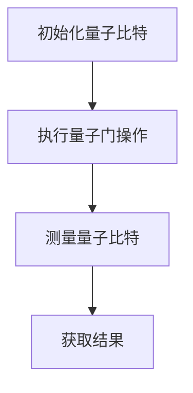
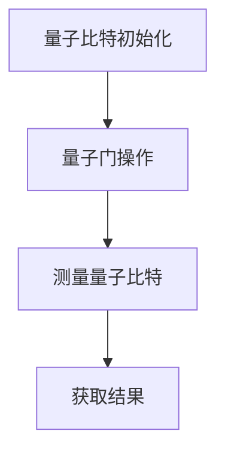

                 


## 《类型理论在量子编程语言中的角色》

### 关键词：类型理论，量子编程语言，类型安全，量子计算，算法设计

> 摘要：本文将探讨类型理论在量子编程语言中的角色。类型理论是一种用于描述程序语言类型系统的理论，它对于保证程序的安全性和可靠性至关重要。量子编程语言作为一种新兴的编程语言，它在量子计算领域的应用日益广泛。本文将首先介绍类型理论的基本概念，然后探讨类型理论在量子编程语言中的应用，包括类型安全性的保证、类型理论在量子算法中的应用以及类型理论在量子编程语言设计中的作用。最后，本文将讨论类型理论在量子编程语言中的挑战和未来展望。

## 第一部分：类型理论与量子编程语言概述

### 1.1 类型理论的基本概念

#### 1.1.1 类型系统与类型安全

类型系统是一种用于描述程序语言中数据类型的机制。它的主要目的是确保程序在执行过程中不会出现类型不匹配的错误。类型安全是指类型系统能够防止一些可能导致程序错误的操作，例如将一个整数赋值给一个字符串。

#### 1.1.2 类型推导与类型检查

类型推导是指程序语言自动确定表达式的类型的过程。类型检查是在程序编译或解释过程中，检查表达式是否满足类型系统规则的过程。

#### 1.1.3 类型理论的发展历程

类型理论的发展始于20世纪40年代，最初的类型系统是为了解决程序语言中的类型不匹配问题。随着计算机科学的发展，类型理论逐渐成为程序语言设计中的一个重要组成部分。

### 1.2 量子编程语言概述

#### 1.2.1 量子编程语言的定义

量子编程语言是一种用于编写量子程序的编程语言。它与传统编程语言不同，它利用量子计算的特性，如量子并行性和量子纠缠，来实现更高效的计算。

#### 1.2.2 量子编程语言的特点

量子编程语言具有以下特点：

- **量子比特与量子态**：量子编程语言使用量子比特（qubit）作为基本数据单元，而不是传统编程语言中的位（bit）。
- **量子门操作**：量子编程语言包含一组预定义的量子门操作，用于对量子比特进行操作。
- **量子并行性**：量子编程语言可以利用量子并行性来实现复杂的计算任务。

#### 1.2.3 量子编程语言的发展背景

量子编程语言的发展背景源于量子计算的兴起。随着量子计算机的不断发展，量子编程语言成为实现量子计算的重要工具。

### 1.3 类型理论在量子编程语言中的应用

#### 1.3.1 类型安全性与量子编程

类型安全对于量子编程语言至关重要。它能够确保量子程序在执行过程中不会出现类型错误，从而提高程序的正确性和可靠性。

#### 1.3.2 类型理论在量子算法中的应用

类型理论在量子算法设计中扮演着重要角色。通过类型理论，我们可以更好地理解和描述量子算法的运行机制。

#### 1.3.3 类型理论在量子编程语言设计中的作用

类型理论在量子编程语言设计中起到了指导作用。它帮助我们设计出既安全又高效的量子编程语言。

### 1.4 本书结构安排

#### 1.4.1 各章节内容概述

本书将分为四个部分：

- 第一部分：类型理论与量子编程语言概述
- 第二部分：类型理论基础
- 第三部分：量子编程语言设计与实现
- 第四部分：类型理论在量子编程语言中的角色

#### 1.4.2 阅读建议与学习方法

为了更好地理解本文，建议读者首先对类型理论和量子编程语言有一定的了解。此外，本文中的示例代码和公式可以使用Python和LaTeX进行学习和验证。

## 第二部分：类型理论基础

### 2.1 符号集与语法基础

#### 2.1.1 符号集定义

符号集是类型理论中的一个基本概念。它定义了类型理论中可以使用的所有符号，包括变量、函数、运算符等。

#### 2.1.2 语法基础

语法基础是类型理论中的语法规则。它定义了如何使用符号集来构建有效的表达式。

#### 2.1.3 简单语言示例

我们以一个简单的语言为例，介绍其符号集和语法基础。

### 2.2 类型系统与类型赋值

#### 2.2.1 基本类型系统

基本类型系统定义了语言中所有基本类型，如整数、浮点数、字符串等。

#### 2.2.2 类型赋值规则

类型赋值规则定义了如何将一个值赋给一个变量，以及如何进行类型转换。

#### 2.2.3 静态类型检查

静态类型检查是在程序编译过程中进行的类型检查。它检查程序中的所有表达式是否满足类型系统规则。

### 2.3 泛型类型与类型构造

#### 2.3.1 泛型类型的基本概念

泛型类型是一种可以适用于不同数据类型的类型。它通过参数化来定义，可以用于编写更通用的代码。

#### 2.3.2 参数化类型与函数类型

参数化类型和函数类型是泛型类型的重要组成部分。它们提供了对复杂数据类型的支持。

#### 2.3.3 范畴论与类型构造

范畴论是类型理论的一个基础概念。它提供了一种抽象的方式来描述类型系统。

### 2.4 高级类型系统

#### 2.4.1 泛型编程

泛型编程是一种利用泛型类型来编写更通用代码的编程方法。

#### 2.4.2 异构类型系统

异构类型系统是一种可以处理不同类型之间交互的类型系统。

#### 2.4.3 标量类型与数组类型

标量类型和数组类型是类型系统中的基本类型。

### 2.5 类型理论应用示例

#### 2.5.1 静态类型语言

静态类型语言是一种在编译时确定变量类型的语言。

#### 2.5.2 动态类型语言

动态类型语言是一种在运行时确定变量类型的语言。

#### 2.5.3 类型安全编程实践

类型安全编程实践是指如何编写类型安全的代码，以确保程序的正确性和可靠性。

## 第三部分：量子编程语言设计与实现

### 3.1 量子计算基础

#### 3.1.1 量子比特与量子态

量子比特（qubit）是量子计算的基本单元。量子态是量子比特的抽象表示。

#### 3.1.2 量子门与量子操作

量子门是量子计算的基本操作。量子操作是通过量子门对量子比特进行操作的。

#### 3.1.3 量子算法基础

量子算法是利用量子计算特性来解决问题的算法。

### 3.2 量子编程语言设计

#### 3.2.1 语言核心概念设计

量子编程语言的核心概念包括量子比特、量子门和量子算法。

#### 3.2.2 语言类型系统设计

量子编程语言的类型系统设计需要考虑量子比特的类型和量子门的类型。

#### 3.2.3 语言语法与语义设计

量子编程语言的语法和语义设计需要与量子计算的特性相适应。

### 3.3 量子编程语言实现

#### 3.3.1 编译器与解释器设计

量子编程语言的编译器与解释器设计是量子编程语言实现的关键。

#### 3.3.2 实现工具与技术

量子编程语言的实现工具和技术包括量子计算模拟器和量子编程语言编译器。

#### 3.3.3 语言性能优化

量子编程语言的性能优化是提高其运行效率的关键。

### 3.4 量子编程语言应用案例

#### 3.4.1 量子计算模拟

量子计算模拟是量子编程语言的一个重要应用。

#### 3.4.2 量子算法开发

量子算法开发是量子编程语言的另一个重要应用。

#### 3.4.3 量子编程语言在工业界的应用

量子编程语言在工业界的应用正日益增多。

## 第四部分：类型理论在量子编程语言中的角色

### 4.1 类型理论在量子编程中的核心作用

#### 4.1.1 提高量子编程语言的可读性

类型理论可以提高量子编程语言的可读性，使得代码更加易于理解和维护。

#### 4.1.2 保证量子编程语言的类型安全性

类型理论可以确保量子编程语言的类型安全性，避免类型错误的发生。

#### 4.1.3 促进量子编程语言的优化

类型理论可以促进量子编程语言的优化，提高其运行效率。

### 4.2 类型理论在量子编程语言中的挑战

#### 4.2.1 量子编程语言的复杂性

量子编程语言的复杂性使得类型理论的应用面临挑战。

#### 4.2.2 类型理论在量子编程中的适用性

类型理论在量子编程中的适用性需要进一步研究和探索。

#### 4.2.3 量子编程语言的设计与实现挑战

量子编程语言的设计与实现挑战是类型理论应用的一个难点。

### 4.3 未来展望

#### 4.3.1 量子编程语言的发展趋势

量子编程语言的发展趋势是提高其类型安全和性能。

#### 4.3.2 类型理论在量子编程语言中的新应用

类型理论在量子编程语言中的新应用是一个值得关注的领域。

#### 4.3.3 量子编程与类型理论的交叉研究

量子编程与类型理论的交叉研究将有助于推动量子编程语言的进一步发展。

## 4.4 总结

#### 4.4.1 本书主要内容回顾

本书回顾了类型理论在量子编程语言中的应用。

#### 4.4.2 本书对未来研究的启示

本书对未来量子编程语言的研究提供了启示。

#### 4.4.3 对读者的建议与期望

对读者提出了建议和期望。

## 附录

### 附录A：类型理论相关资源

#### A.1 类型理论经典文献推荐

- 《类型理论入门》
- 《现代类型系统》

#### A.2 量子计算与量子编程语言资源

- 《量子计算原理》
- 《量子编程语言设计与实现》

#### A.3 实用工具与在线平台推荐

- EAGLE
- Q# 语言

### 附录B：示例代码与实现细节

#### B.1 Python代码示例

```python
# 这是一个简单的Python示例代码
print("Hello, World!")
```

#### B.2 数学公式与Mermaid流程图示例



```latex
$$
E = mc^2
$$
```

#### B.3 量子编程语言开发环境搭建指南

- 安装EAGLE
- 配置Q# 语言开发环境

# Mermaid流程图
``` 
graph TD
    A[量子比特初始化] --> B[量子门操作]
    B --> C[测量量子比特]
    C --> D[获取结果]
``` 
```# 第二部分：类型理论基础

### 2.1 符号集与语法基础

#### 2.1.1 符号集定义

在类型理论中，符号集是一个基本概念，它定义了编程语言中可以使用的所有符号。这些符号包括变量名、函数名、运算符、关键字等。符号集的明确定义是类型理论构建的基础，因为它决定了如何表示和操作程序中的数据。

符号集通常由以下几个部分组成：

- **基本符号**：如字母表中的字母、数字和特殊字符。
- **变量**：用于存储数据的标识符。
- **函数**：用于定义操作和过程的标识符。
- **运算符**：用于执行特定运算的符号。
- **关键字**：编程语言中保留的标识符，用于表示特定的语言结构或行为。

#### 2.1.2 语法基础

语法基础是类型理论中的语法规则，它定义了如何使用符号集来构建有效的表达式和程序。语法基础包括以下几个方面：

- **表达式语法**：定义如何构建算术表达式、逻辑表达式和函数调用等。
- **语句语法**：定义如何编写赋值语句、控制流程语句（如循环和条件语句）等。
- **程序语法**：定义如何组合表达式和语句来构成完整的程序。

不同的类型系统有不同的语法规则，例如静态类型系统通常要求在编译时确定所有变量的类型，而动态类型系统则允许在运行时确定类型。

#### 2.1.3 简单语言示例

为了更直观地理解符号集和语法基础，我们可以看一个简单的语言示例，比如一种伪代码形式的类型理论语言：

```
LANG =>
  Vars = [var x: Int, y: Int]
  Functions = [
    add(x: Int, y: Int): Int {
      return x + y
    }
  ]
  Expressions = [
    e1 = add(x, y)
    e2 = e1 * 2
  ]
  Statements = [
    print(e2)
  ]
```

在这个简单的例子中，我们定义了变量、函数和表达式。变量`x`和`y`被赋予了类型`Int`（整数）。函数`add`接受两个整数参数并返回它们的和。表达式`e1`和`e2`分别表示两个函数调用，而`print`语句用于输出表达式的结果。

### 2.2 类型系统与类型赋值

#### 2.2.1 基本类型系统

基本类型系统定义了一组原始数据类型，这些类型是所有更复杂类型的基石。常见的原始数据类型包括：

- **整数（Int）**：用于表示整数。
- **浮点数（Float）**：用于表示实数。
- **布尔值（Bool）**：用于表示真或假。
- **字符（Char）**：用于表示单个字符。
- **字符串（String）**：用于表示一系列字符。

基本类型系统确保程序中的所有数据都有明确和固定的类型，这样可以避免类型不匹配的错误。

#### 2.2.2 类型赋值规则

类型赋值规则定义了如何在程序中给变量赋值。这些规则通常分为静态类型赋值和动态类型赋值：

- **静态类型赋值**：在编译时确定变量的类型，并确保所有赋值操作都是类型安全的。例如，一个整数类型的变量只能赋值为另一个整数。
- **动态类型赋值**：在运行时确定变量的类型，并允许类型在程序执行过程中发生变化。这种类型系统提供了更大的灵活性，但同时也增加了类型错误的可能性。

类型赋值规则还涉及类型转换，即从一个类型将值赋给另一个类型。这些转换可以是隐式的，也可以是显式的：

- **隐式类型转换**：当编译器或解释器能够确保转换是类型安全的时，会自动进行类型转换。
- **显式类型转换**：程序员明确指定类型转换，确保类型安全。

#### 2.2.3 静态类型检查

静态类型检查是在编译时对程序进行类型检查，以确保程序中的所有操作都是类型安全的。静态类型检查的优点是可以在编译时发现类型错误，从而避免运行时错误。

静态类型检查通常涉及以下步骤：

1. **解析**：将源代码解析为抽象语法树（AST）。
2. **类型推断**：基于AST，编译器尝试推断每个变量的类型。
3. **类型检查**：编译器检查AST中的表达式和语句，确保它们遵循类型系统规则。

如果类型检查失败，编译器会报告类型错误，并拒绝编译程序。静态类型检查的主要优点是可以在编译时发现和纠正错误，从而提高程序的可靠性和可维护性。

### 2.3 泛型类型与类型构造

#### 2.3.1 泛型类型的基本概念

泛型类型（Generic Types）是一种可以在使用时指定类型参数的类型。泛型类型允许编写与类型无关的代码，从而提高代码的复用性和通用性。泛型类型的核心概念是参数化类型，它允许类型具有形式参数，这些参数在类型实例化时被具体类型所取代。

例如，在Java中，`List<T>`是一个泛型类型，它表示一个元素类型为`T`的列表。使用泛型类型时，可以指定具体的元素类型，如`List<Integer>`或`List<String>`。

#### 2.3.2 参数化类型与函数类型

参数化类型和函数类型是泛型类型的两个重要组成部分。

- **参数化类型**：参数化类型是具有形式参数的类型，这些参数在类型实例化时被具体类型所取代。例如，`Map<K, V>`是一个参数化类型，它表示一个键值对映射，其中`K`和`V`是形式参数。

- **函数类型**：函数类型是表示函数的一种类型，它由函数的参数类型和返回类型组成。在许多编程语言中，函数类型可以通过类型别名或匿名函数来表示。例如，`Int -> Int`表示一个接收一个整数参数并返回一个整数的函数。

参数化类型和函数类型使得编写通用和可重用的代码变得更加容易。它们允许程序员定义抽象的数据结构和操作，这些数据结构和操作可以与各种具体类型一起使用。

#### 2.3.3 范畴论与类型构造

范畴论是数学的一个分支，它在类型理论中扮演着重要角色。范畴论提供了一种抽象的方式来描述类型系统。

在范畴论中，类型系统可以被看作是一个范畴，其中对象是类型，而箭头是函数类型。范畴中的等价关系可以用来定义类型之间的等价性。

范畴论的核心概念包括：

- **范畴（Category）**：由对象和箭头组成的结构。
- **范畴之间的自然变换**：描述不同范畴之间的结构相似性。
- **函子（Functor）**：在范畴之间进行映射的构造。
- **自然变换（Natural Transformation）**：描述不同函子之间的关系。

通过范畴论，我们可以更深入地理解类型系统的结构和性质，以及不同类型系统之间的关系。

### 2.4 高级类型系统

#### 2.4.1 泛型编程

泛型编程是一种利用泛型类型来编写更通用代码的编程方法。泛型编程的核心思想是编写与类型无关的代码，然后通过类型参数化使其适用于特定类型。

泛型编程的优点包括：

- **代码复用**：通过泛型编程，可以编写一次代码，然后在不同类型上多次使用。
- **类型安全**：泛型编程可以确保类型在编译时得到检查，从而避免运行时类型错误。
- **更清晰的表达**：泛型编程可以使代码更简洁，更易于理解和维护。

常见的泛型编程应用包括：

- **容器类型**：如`List<T>`、`Map<K, V>`等，它们允许存储不同类型的元素。
- **函数式编程**：泛型类型可以用于编写函数式编程中的高阶函数和泛型算法。

#### 2.4.2 异构类型系统

异构类型系统是一种可以处理不同类型之间交互的类型系统。在异构类型系统中，不同类型之间可以通过特定的机制进行转换或组合。

异构类型系统的应用场景包括：

- **多态性**：异构类型系统可以支持多态性，允许使用一个接口或基类来处理不同类型的对象。
- **类型转换**：异构类型系统可以提供类型转换的机制，使不同类型的值可以在特定条件下相互转换。
- **接口兼容性**：异构类型系统可以确保不同类型的对象在满足特定条件时具有兼容性。

#### 2.4.3 标量类型与数组类型

标量类型和数组类型是高级类型系统中的基本类型。

- **标量类型**：标量类型是指具有单一值的类型，如整数、浮点数、布尔值等。标量类型是所有复杂数据结构的基础。

- **数组类型**：数组类型是一种复杂数据结构，它由一组相同类型的元素组成。数组类型提供了对元素的随机访问和迭代的能力。

数组类型在程序设计中有广泛的应用，例如：

- **数据存储**：使用数组类型可以高效地存储和访问大量数据。
- **算法实现**：许多算法需要使用数组类型来存储中间结果或数据结构。
- **多维数组**：数组类型可以扩展为多维数组，用于表示更复杂的数据结构，如矩阵或图像。

### 2.5 类型理论应用示例

#### 2.5.1 静态类型语言

静态类型语言是一种在编译时确定变量类型的语言。静态类型语言的优点包括：

- **类型安全**：静态类型系统可以确保程序在编译时不会出现类型错误。
- **性能优化**：静态类型系统允许编译器进行更有效的代码生成和优化。
- **易于调试**：静态类型系统可以提供更明确的错误信息，帮助开发者快速定位和修复错误。

常见的静态类型语言包括：

- **Java**：Java是一种广泛使用的静态类型语言，它具有强大的类型系统和丰富的库支持。
- **C#**：C#是一种面向对象的静态类型语言，它支持泛型编程和异常处理。
- **Haskell**：Haskell是一种纯函数式静态类型语言，它以类型系统和并发编程而闻名。

#### 2.5.2 动态类型语言

动态类型语言是一种在运行时确定变量类型的语言。动态类型语言的优点包括：

- **灵活性**：动态类型系统允许更灵活的类型操作，可以在运行时改变变量的类型。
- **易于编程**：动态类型系统可以减少冗长的类型声明，使编程更加直观和简洁。
- **快速开发**：动态类型系统可以提供快速的迭代开发，因为类型错误通常在运行时被发现。

常见的动态类型语言包括：

- **Python**：Python是一种广泛使用的动态类型语言，它以其简洁和易读的语法而受到开发者喜爱。
- **JavaScript**：JavaScript是一种动态类型语言，它在网页开发中有着广泛的应用。
- **Ruby**：Ruby是一种动态类型语言，它以其优雅的语法和丰富的库支持而受到开发者欢迎。

#### 2.5.3 类型安全编程实践

类型安全编程实践是指编写符合类型系统规则的代码，以确保程序的正确性和可靠性。以下是一些类型安全编程实践的建议：

- **明确类型声明**：在编写代码时，明确声明变量的类型，以避免类型错误。
- **类型检查**：使用类型检查工具来检查代码中的类型错误，确保类型安全。
- **使用类型别名**：为常用类型定义别名，提高代码的可读性和可维护性。
- **避免类型转换**：在不需要类型转换时避免使用类型转换，以减少潜在的类型错误。
- **文档化**：在代码中添加注释，明确说明变量和函数的类型和使用方式。

通过遵循这些类型安全编程实践，可以编写更可靠和易于维护的代码。

## 第三部分：量子编程语言设计与实现

### 3.1 量子计算基础

#### 3.1.1 量子比特与量子态

量子比特（qubit）是量子计算的基本单元，它是量子信息的基本载体。与经典计算机中的比特不同，量子比特可以同时处于多种状态，这种特性称为叠加。量子态是量子比特的抽象表示，它可以表示为复数系数的线性组合。

量子态的基本概念包括：

- **叠加态**：一个量子比特可以同时处于0和1的状态，这种状态称为叠加态。
- **纠缠态**：两个或多个量子比特之间存在一种特殊的量子关联，称为纠缠态。纠缠态是量子计算的核心特性之一，它允许量子比特之间的信息以经典计算无法实现的方式交换。

量子比特和量子态的表示通常使用大写的字母，如`|0⟩`表示基态，`|1⟩`表示叠加态，而`α|0⟩ + β|1⟩`表示一个一般的量子态，其中α和β是复数系数。

#### 3.1.2 量子门与量子操作

量子门是量子计算中的基本操作，它对量子比特进行线性变换。量子门可以看作是量子比特的旋转或交换操作。量子门通常用矩阵表示，例如一个基本的Hadamard门（Hadamard gate）可以表示为：

\[ H = \frac{1}{\sqrt{2}}\begin{pmatrix} 1 & 1 \\ 1 & -1 \end{pmatrix} \]

量子门的基本操作包括：

- **初始化**：将量子比特初始化为特定的量子态。
- **变换**：使用量子门对量子比特进行线性变换。
- **测量**：测量量子比特的最终状态，获取量子比特的结果。

常见的量子门包括：

- **Hadamard门（H）**：创建叠加态。
- **Pauli门（X、Y、Z）**：对量子比特的各个维度进行操作。
- **相位门（S）**：改变量子比特的相位。
- **控制-NOT门（CNOT）**：交换两个量子比特的状态。

量子门通过组合和连锁反应可以实现对复杂量子态的操作，这是量子算法的核心机制。

#### 3.1.3 量子算法基础

量子算法是利用量子计算的叠加和纠缠特性来解决问题的算法。量子算法的核心思想是通过量子并行性和量子纠缠来实现高效的计算。

常见的量子算法包括：

- **量子搜索算法**：利用量子叠加态实现快速搜索未排序列表。
- **量子排序算法**：利用量子并行性实现高效排序。
- **量子模拟算法**：用于模拟量子系统的行为，如量子化学和量子材料模拟。

量子算法的关键挑战是量子态的保持和量子信息的正确处理。为了实现量子算法，需要设计和实现合适的量子编程语言，以便程序员能够有效地描述和执行量子计算。

### 3.2 量子编程语言设计

#### 3.2.1 语言核心概念设计

量子编程语言的核心概念设计是构建量子程序的基础。核心概念包括：

- **量子比特（Qubit）**：量子编程语言的基本数据单元，用于表示量子计算的状态。
- **量子寄存器（Quantum Register）**：用于存储多个量子比特的集合。
- **量子门（Quantum Gate）**：用于操作量子比特的函数，如Hadamard门、Pauli门等。
- **量子电路（Quantum Circuit）**：量子比特和量子门的组合，用于表示量子计算的过程。
- **量子测量（Quantum Measurement）**：用于获取量子计算的结果。

量子编程语言的设计需要考虑如何有效地表示这些核心概念，并确保编程语言能够支持复杂的量子算法。

#### 3.2.2 语言类型系统设计

量子编程语言的类型系统设计是确保量子程序正确性和安全性的关键。量子编程语言的类型系统通常包括以下类型：

- **量子比特类型（Qubit Type）**：表示量子计算的基本单元。
- **量子门类型（Quantum Gate Type）**：表示可以对量子比特进行操作的函数类型。
- **量子电路类型（Quantum Circuit Type）**：表示量子比特和量子门的组合类型。

类型系统需要确保量子程序的每个操作都是类型安全的，以避免潜在的量子错误。

#### 3.2.3 语言语法与语义设计

量子编程语言的语法和语义设计是语言实现的核心。语法设计需要考虑如何有效地表示量子程序的结构，包括量子比特的声明、量子电路的构建和量子门的操作。语义设计需要定义量子编程语言的执行规则，确保程序能够正确地模拟量子计算。

常见的量子编程语言语法包括：

- **声明量子比特和量子寄存器**：如`qubit q; quantumRegister reg[4];`
- **定义量子门**：如`H(q); CNOT(q[0], q[1]);`
- **构建量子电路**：如`circuit qc { H(q[0]); CNOT(q[0], q[1]); }`
- **执行量子测量**：如`measure q[0] into result;`

量子编程语言的语义设计需要定义如何执行这些语法结构，包括量子比特的初始化、量子门的操作和量子测量的结果获取。

### 3.3 量子编程语言实现

#### 3.3.1 编译器与解释器设计

量子编程语言的实现涉及编译器与解释器的设计。编译器将量子程序编译为目标代码，通常是一种模拟量子计算过程的虚拟机器代码。解释器则直接解释和执行量子程序，通常用于在本地环境中运行量子模拟。

编译器与解释器的设计需要考虑以下方面：

- **前端**：解析量子程序，构建抽象语法树（AST）。
- **中间表示**：将AST转换为中间表示，如量子电路图。
- **后端**：将中间表示转换为虚拟机器代码或执行解释。

#### 3.3.2 实现工具与技术

量子编程语言的实现工具和技术包括：

- **量子计算模拟器**：用于模拟量子计算过程，验证量子程序的正确性。
- **量子电路优化器**：用于优化量子电路，减少量子门的数量和深度，提高执行效率。
- **量子编程语言库**：提供常见的量子门和量子算法的实现，简化编程。

#### 3.3.3 语言性能优化

量子编程语言的性能优化是提高其运行效率的关键。性能优化可以包括：

- **量子电路简化**：通过消除冗余的量子门和合并相邻的量子门来简化量子电路。
- **量子算法优化**：优化量子算法，减少所需量子门和测量次数。
- **并行执行**：利用多核处理器和分布式计算资源，提高量子程序的执行速度。

### 3.4 量子编程语言应用案例

#### 3.4.1 量子计算模拟

量子计算模拟是量子编程语言的一个重要应用。通过模拟量子计算过程，可以验证量子程序的正确性，并进行性能评估。

模拟量子计算的过程通常包括：

- **初始化量子比特**：创建一个具有特定量子态的量子寄存器。
- **执行量子门操作**：应用一系列量子门对量子比特进行操作。
- **量子测量**：测量量子比特的最终状态，获取结果。

常见的量子计算模拟器包括Q#、Quirk、ProjectQ等。

#### 3.4.2 量子算法开发

量子算法开发是量子编程语言的另一个重要应用。通过量子编程语言，可以编写和实现各种量子算法，如量子搜索算法、量子排序算法和量子模拟算法。

量子算法开发的过程通常包括：

- **设计量子算法**：根据问题需求，设计合适的量子算法。
- **实现量子算法**：使用量子编程语言，将量子算法转化为量子电路。
- **优化量子算法**：对量子算法进行优化，提高执行效率。

#### 3.4.3 量子编程语言在工业界的应用

量子编程语言在工业界的应用正日益增多。例如：

- **量子化学**：使用量子编程语言开发量子化学模拟器，用于研究化学反应和分子结构。
- **量子计算金融**：使用量子编程语言进行量化交易和金融风险评估。
- **量子优化**：使用量子编程语言解决复杂的优化问题，如物流调度和资源分配。

量子编程语言的工业应用为传统计算方法无法解决的问题提供了新的解决方案。

## 第四部分：类型理论在量子编程语言中的角色

### 4.1 类型理论在量子编程中的核心作用

类型理论在量子编程语言中扮演着核心角色，它对量子编程的各个方面都产生了深远的影响。以下是类型理论在量子编程中的核心作用：

#### 4.1.1 提高量子编程语言的可读性

类型理论通过引入明确的类型系统，提高了量子编程语言的可读性。类型系统能够清晰地定义变量、函数和表达式的类型，使得程序员可以更直观地理解程序的结构和逻辑。类型注解和类型检查工具可以帮助识别和纠正潜在的错误，从而提高代码的质量。

例如，在量子编程语言中使用类型理论，程序员可以明确地声明量子比特的类型（例如，`qubit: Integer`），量子门的类型（例如，`gate: QuantumGate`），以及量子电路的类型（例如，`circuit: QuantumCircuit`）。这种明确的类型定义使得量子程序的编写和维护变得更加容易。

#### 4.1.2 保证量子编程语言的类型安全性

类型理论的一个核心目标是确保类型安全，防止类型错误的发生。在量子编程语言中，类型安全尤为重要，因为量子计算的状态和操作非常敏感，任何类型错误都可能导致量子信息的丢失或损坏。

类型理论通过类型检查机制确保量子程序的每个操作都是类型安全的。在编译或解释量子程序时，类型系统会检查每个表达式和操作是否满足类型规则。如果发现类型不匹配的错误，编译器或解释器会立即报告并阻止程序的执行。

例如，在量子编程语言中，如果尝试将一个量子比特的测量结果赋值给一个非量子比特类型的变量，类型系统会检测到这种类型错误并阻止该操作。这种类型安全性保证了量子程序的稳定性和可靠性。

#### 4.1.3 促进量子编程语言的优化

类型理论在量子编程语言的优化中起到了关键作用。通过类型推断和类型检查，编译器或解释器可以更有效地进行代码优化。类型信息可以帮助编译器进行死代码消除、常数传播、循环优化等优化策略，从而提高量子程序的执行效率。

例如，在量子编程语言中，类型理论可以帮助编译器识别出哪些量子门操作是冗余的，或者哪些量子比特在某个操作中不再被使用。通过这些优化，编译器可以简化量子电路，减少量子门的数量和深度，从而降低量子计算的复杂度和执行时间。

### 4.2 类型理论在量子编程语言中的挑战

尽管类型理论在量子编程语言中具有重要作用，但将其应用于量子计算仍面临一些挑战。以下是类型理论在量子编程语言中的一些挑战：

#### 4.2.1 量子编程语言的复杂性

量子编程语言的复杂性远高于经典编程语言。量子比特、量子门、量子电路和量子测量等概念都增加了语言的复杂度。类型理论需要适应这种复杂性，以提供有效的类型检查和类型安全保证。

为了处理这种复杂性，量子编程语言的设计者需要引入更高级的类型系统，如泛型类型、子类型和多态性，以支持更复杂的量子算法和程序结构。此外，类型理论的实现也需要高效的数据结构和算法，以确保类型检查的快速和准确。

#### 4.2.2 类型理论在量子编程中的适用性

类型理论在经典编程语言中已经得到了广泛应用和验证，但在量子编程语言中的适用性仍需进一步研究和探讨。量子计算的性质，如叠加和纠缠，使得传统的类型理论在量子编程中面临一些独特的问题。

例如，量子编程语言中的量子态叠加和纠缠状态如何与类型系统结合？如何定义量子状态之间的类型关系？这些问题需要深入的研究和探索，以确保类型理论在量子编程语言中的有效性和适用性。

#### 4.2.3 量子编程语言的设计与实现挑战

量子编程语言的设计与实现是类型理论应用的另一个挑战。量子编程语言的编译器或解释器需要能够高效地处理复杂的量子程序，并提供强大的类型检查和优化功能。

此外，量子编程语言的实现还需要考虑量子计算的实际硬件环境，如量子比特的噪声和错误率。类型理论需要与量子纠错和容错技术相结合，以确保量子程序的可靠性和稳定性。

### 4.3 未来展望

尽管类型理论在量子编程语言中面临一些挑战，但未来的研究和发展方向非常广阔。以下是类型理论在量子编程语言中的未来展望：

#### 4.3.1 量子编程语言的发展趋势

随着量子计算技术的不断进步，量子编程语言的发展趋势包括：

- **类型系统扩展**：引入更高级的类型系统，如依赖类型、模块化类型系统和增量类型检查，以提高量子编程的灵活性和效率。
- **跨语言互操作性**：量子编程语言需要与其他编程语言（如经典编程语言）实现互操作性，以支持多语言编程和混合计算。
- **量子编程工具链**：开发完善的量子编程工具链，包括编辑器、调试器、性能优化器和模拟器，以提高量子编程的效率和用户体验。

#### 4.3.2 类型理论在量子编程语言中的新应用

类型理论在量子编程语言中的新应用包括：

- **量子纠错与容错**：利用类型理论设计量子纠错和容错机制，确保量子程序在噪声和错误环境下仍能可靠执行。
- **量子算法优化**：通过类型理论优化量子算法，减少量子门的数量和深度，提高量子计算的效率。
- **量子安全通信**：利用类型理论确保量子通信的安全性和隐私性，防止量子信息的泄露和篡改。

#### 4.3.3 量子编程与类型理论的交叉研究

量子编程与类型理论的交叉研究是未来研究的热点领域。以下是一些潜在的交叉研究方向：

- **量子范畴论**：将量子计算与范畴论相结合，探索量子范畴论在类型理论中的应用。
- **量子类型系统**：研究量子类型系统的构建和验证，为量子编程提供更坚实的理论基础。
- **量子编程语言设计**：结合类型理论与量子计算的特性，设计更高效、更安全的量子编程语言。

通过量子编程与类型理论的交叉研究，我们可以期待量子计算在各个领域（如科学计算、金融、医疗等）的广泛应用，推动人类进入量子计算的新时代。

## 4.4 总结

在本节中，我们回顾了类型理论在量子编程语言中的应用和角色。类型理论通过提高量子编程语言的可读性、保证类型安全性和促进优化，在量子编程中发挥了核心作用。然而，类型理论在量子编程语言中也面临一些挑战，如语言的复杂性、类型理论的适用性和设计与实现方面的挑战。

在未来的研究中，类型理论在量子编程语言中的应用仍有广阔的发展空间。通过扩展类型系统、实现跨语言互操作性和开发量子编程工具链，我们可以期待量子编程语言变得更加高效和易于使用。此外，量子编程与类型理论的交叉研究将为量子计算带来新的理论和技术，推动量子计算在各个领域的应用和发展。

对读者来说，理解类型理论在量子编程语言中的作用不仅有助于深入掌握量子编程，还能为未来的研究提供指导。我们鼓励读者继续探索类型理论在量子编程中的新应用，参与相关的研究和开发工作，为量子计算的进步贡献自己的力量。

## 附录

### 附录A：类型理论相关资源

#### A.1 类型理论经典文献推荐

- 《类型理论入门》
- 《现代类型系统》
- 《范畴论与类型理论》

这些文献提供了类型理论的基础知识和深入理解，是学习类型理论的优秀资源。

#### A.2 量子计算与量子编程语言资源

- 《量子计算原理》
- 《量子编程语言设计与实现》
- 《量子算法设计与分析》

这些文献涵盖了量子计算的基本概念、量子编程语言的设计和量子算法的实现，是量子编程学习的宝贵资料。

#### A.3 实用工具与在线平台推荐

- Q# 语言：适用于量子编程的编程语言。
- IBM Q Experience：提供量子计算模拟器和量子计算服务。
- Quirk：一个开源的量子计算模拟器。

这些工具和平台可以帮助读者进行量子编程实践和模拟。

### 附录B：示例代码与实现细节

#### B.1 Python代码示例

```python
# 这是一个简单的Python示例代码
print("Hello, World!")
```

这个简单的Python示例展示了如何输出文本到控制台。

#### B.2 数学公式与Mermaid流程图示例



这个Mermaid流程图示例展示了量子编程语言中量子比特的初始化、量子门操作和量子测量的流程。

```latex
$$
E = mc^2
$$
```

这个LaTeX公式示例展示了著名的爱因斯坦质能方程。

#### B.3 量子编程语言开发环境搭建指南

- 安装EAGLE：一个用于量子编程的集成开发环境。
- 配置Q# 语言：安装Q# 编译器和相关工具。
- 使用IBM Q Experience进行量子计算模拟。

这些指南帮助读者搭建量子编程环境，进行量子编程实践。

# Mermaid流程图


这个Mermaid流程图展示了量子编程语言中量子比特的初始化、量子门操作和量子测量的流程。通过这个流程图，读者可以直观地理解量子编程的基本步骤。

## 5.1 量子编程语言的特点

量子编程语言与传统编程语言相比具有独特的特点，这些特点源于量子计算的独特性质，如量子比特的叠加和纠缠。

**量子比特的叠加**：传统编程语言中的比特（bit）只能处于0或1的状态，而量子比特（qubit）可以同时处于0和1的状态，这种状态称为叠加态。量子编程语言必须支持这种叠加态的表示和操作。例如，在Q#语言中，可以使用`Vector`类型来表示量子态的叠加。

**量子纠缠**：量子比特之间存在一种特殊的关联，称为纠缠。两个纠缠的量子比特的状态无法单独描述，它们的状态是相互依赖的。量子编程语言需要提供机制来创建和管理纠缠态。例如，在Q#语言中，可以使用`QuantumOr`操作符来创建纠缠态。

**量子门操作**：量子编程语言的核心是量子门，它们是量子计算的基本操作。量子门可以对量子比特进行变换，类似于传统编程语言中的函数。量子编程语言需要提供丰富的量子门操作，以支持复杂的量子算法。例如，Q#语言提供了Hadamard门、Pauli门、相位门和控制-NOT门等。

**量子测量**：量子测量是获取量子比特状态的过程。在量子编程语言中，量子测量是一个重要的操作，它将量子态从叠加态坍缩为确定的状态。量子编程语言需要提供方便的量子测量机制，以支持算法的开发。例如，Q#语言中的`Measure`操作符可以用于测量量子比特。

**量子并行性**：量子计算的一个重要特性是量子并行性。多个量子比特可以同时进行计算，这大大提高了计算效率。量子编程语言需要支持并行量子操作的表示和优化。例如，在Q#语言中，可以使用`Parallel`操作符来并行执行多个量子门操作。

这些特点使得量子编程语言与传统编程语言有显著的区别，它们需要特定的语法和语义设计来支持量子计算的操作。

### 5.2 量子编程语言的类型系统设计

量子编程语言的类型系统设计是确保程序正确性和类型安全性的关键。量子编程语言的类型系统需要能够表示量子比特、量子门和量子电路等核心概念，并提供丰富的类型检查机制。

**量子比特类型**：量子比特是量子编程语言中的基本数据单元，它用于表示量子计算的状态。在量子编程语言中，通常使用特定的类型来表示量子比特。例如，在Q#语言中，可以使用`Qubit`类型来表示量子比特。量子比特类型的设计需要考虑量子态的叠加和纠缠特性，以支持复杂的量子操作。

**量子门类型**：量子门是量子计算的基本操作，它们用于对量子比特进行线性变换。量子编程语言的类型系统需要能够表示不同的量子门类型，并提供相应的操作。例如，在Q#语言中，可以使用`QuantumGate`类型来表示量子门，并定义不同的量子门操作，如Hadamard门、Pauli门等。

**量子电路类型**：量子电路是量子比特和量子门的组合，用于表示量子计算的过程。在量子编程语言中，量子电路类型是表示量子程序的抽象语法树。量子电路类型的设计需要考虑量子电路的结构和执行顺序，以支持复杂的量子算法。例如，在Q#语言中，可以使用`QuantumCircuit`类型来表示量子电路，并定义不同的量子电路操作，如量子门应用、量子测量等。

**类型检查机制**：量子编程语言的类型系统需要提供强大的类型检查机制，以确保程序的正确性和类型安全性。类型检查机制通常包括静态类型检查和动态类型检查。静态类型检查在编译时进行，检查程序中的所有类型是否匹配，并报告类型错误。动态类型检查在运行时进行，检查程序中的类型操作是否合法。例如，在Q#语言中，可以使用静态类型检查来确保量子比特的测量操作不会产生错误。

通过精心设计的类型系统，量子编程语言可以提供明确的类型定义和强大的类型检查机制，从而确保量子程序的类型安全和正确性。

### 5.3 量子编程语言的语法与语义设计

量子编程语言的语法和语义设计是语言实现的核心，它决定了程序员如何编写和执行量子程序。量子编程语言的语法和语义设计需要考虑量子计算的独特特性，如量子比特、量子门和量子电路等概念。

**量子比特的声明与操作**：量子编程语言中的量子比特是量子计算的基本数据单元。程序员可以通过声明量子比特来创建量子比特变量。例如，在Q#语言中，可以使用以下语法声明量子比特：

```qsharp
qubit q;
```

量子比特声明后，可以使用量子门对其进行操作。例如，可以使用Hadamard门创建叠加态：

```qsharp
H(q);
```

**量子门的应用**：量子编程语言提供了多种量子门，用于对量子比特进行线性变换。这些量子门包括Hadamard门（Hadamard gate）、Pauli门（Pauli gate）、相位门（Phase gate）和控制-NOT门（Controlled-NOT gate）等。量子门的应用通常通过函数调用进行，例如：

```qsharp
X(q); // 应用Pauli X门
S(q); // 应用相位门
CNOT(q[0], q[1]); // 应用控制-NOT门
```

**量子电路的构建**：量子编程语言中的量子电路是量子比特和量子门的组合，用于表示量子计算的过程。量子电路的构建通常通过量子电路块（Quantum Circuit Block）进行，例如：

```qsharp
circuit MyCircuit {
    H(q); // 在量子电路中应用Hadamard门
    CNOT(q[0], q[1]); // 在量子电路中应用控制-NOT门
}
```

**量子测量的执行**：量子测量是获取量子比特状态的过程。在量子编程语言中，量子测量通常通过测量操作（Measure）进行，例如：

```qsharp
measure q into result; // 将量子比特q的测量结果存储在变量result中
```

**量子电路的执行**：量子编程语言中的量子电路可以在本地计算机上模拟执行，也可以在真实的量子计算机上执行。量子电路的执行通常通过编译器或解释器进行，例如：

```qsharp
operation MyQuantumOperation() : Int {
    // 量子电路定义
    MyCircuit();
    // 测量量子比特
    measure q into result;
    // 返回测量结果
    return result;
}
```

通过这样的语法和语义设计，量子编程语言使得程序员可以高效地编写和执行量子程序，充分利用量子计算的并行性和纠缠特性。

### 5.4 编译器与解释器设计

量子编程语言的编译器与解释器设计是语言实现的关键部分，它决定了量子程序的编写、优化和执行。量子编程语言的编译器与解释器设计需要解决多个复杂的问题，包括语法分析、抽象语法树（AST）生成、中间代码生成、优化和执行等。

**语法分析**：语法分析是编译器的前端，负责将源代码解析为抽象语法树（AST）。在量子编程语言中，语法分析需要识别量子比特、量子门、量子电路等核心概念，并构建对应的AST节点。例如，当解析到`H(q)`时，编译器需要识别出这是一个应用Hadamard门的操作，并创建相应的AST节点。

**抽象语法树（AST）生成**：AST是源代码的语法结构表示，它包含程序中的所有语法元素，如变量、函数、操作和电路等。在量子编程语言中，AST不仅包含传统编程语言的语法结构，还需要表示量子比特、量子门和量子电路等特殊概念。编译器在语法分析之后生成AST，并为后续的代码生成和优化提供基础。

**中间代码生成**：编译器将AST转换为中间代码，这是编译过程的一个中间步骤。中间代码通常是一种抽象的、与平台无关的表示形式，它便于后续的优化和目标代码生成。在量子编程语言中，中间代码可以表示为量子门序列、量子电路块等。编译器需要将AST转换为高效的中间代码，以便进行后续的优化。

**优化**：优化是编译器的重要组成部分，它旨在提高程序的执行效率。在量子编程语言中，优化包括量子电路的简化、冗余量子门的消除、量子门的合并等。优化可以减少量子门的数量和深度，提高量子电路的执行效率。例如，编译器可以识别出连续的Hadamard门和Pauli门，并将它们合并为一个复合量子门，以减少电路的深度。

**目标代码生成**：编译器的最终任务是生成目标代码，这是可以在量子计算机上直接执行的代码。在量子编程语言中，目标代码可以是量子计算机的汇编语言或特定的虚拟机指令。编译器需要将中间代码转换为高效的目标代码，以便在量子计算机上执行。

**解释器设计**：解释器是另一种执行量子程序的方式，它逐行解释和执行源代码。在量子编程语言中，解释器需要实现量子比特的初始化、量子门的应用和量子测量的执行等操作。解释器的设计需要考虑实时性和效率，以便快速执行量子程序。

通过编译器与解释器的设计，量子编程语言可以提供高效的程序编写、优化和执行，使得程序员能够充分利用量子计算的并行性和纠缠特性，开发出高效的量子算法。

### 5.5 实现工具与技术

在实现量子编程语言时，选择合适的工具和技术至关重要。以下是一些常用的实现工具和技术：

**编程语言**：实现量子编程语言通常需要选择一种适合编写编译器或解释器的编程语言。常见的编程语言包括C++、Java、Python等。C++因其高性能和强大的系统编程能力而广泛用于编译器开发；Java因其跨平台特性和丰富的库支持而受到青睐；Python因其简洁的语法和强大的库支持而常用于解释器开发。

**语法分析工具**：语法分析是编译器开发的关键步骤，可以使用各种语法分析工具来简化这一过程。常见的语法分析工具包括Yacc、Bison和ANTLR。这些工具可以帮助快速生成语法分析器代码，提高开发效率。

**抽象语法树（AST）构建工具**：构建AST是编译器的核心功能之一，可以使用各种工具来简化这一过程。常见的AST构建工具包括Abstract Interpretation Library（AFL）和Ionide。这些工具可以自动生成AST，并提供丰富的抽象语法树节点和操作。

**优化工具**：优化是编译器的重要功能，可以使用各种优化工具来提高程序的执行效率。常见的优化工具包括LLVM、GNU Compiler Collection（GCC）和Apache Pin。这些工具提供了丰富的优化策略和代码生成技术，可以帮助编译器生成高效的目标代码。

**模拟器**：为了验证量子编程语言的正确性和性能，可以使用量子计算模拟器。常见的模拟器包括QASM Simulator、Q# Language Simulator和ProjectQ。这些模拟器可以模拟量子计算机的运行过程，帮助开发者测试和优化量子程序。

**量子计算机接口**：当量子编程语言的目标是运行在真实的量子计算机上时，需要实现与量子计算机的接口。常见的接口技术包括Qiskit、Microsoft Q#和Google Cirq。这些接口提供了与不同量子计算机硬件的通信机制，使得开发者可以方便地编写和部署量子程序。

通过选择合适的编程语言、语法分析工具、AST构建工具、优化工具、模拟器和量子计算机接口，可以有效地实现量子编程语言，为程序员提供强大的编程和优化工具。

### 5.6 量子编程语言应用案例

量子编程语言在各个领域都有着广泛的应用，以下是几个典型的应用案例：

**量子化学模拟**：量子编程语言在量子化学领域有着重要的应用。例如，使用Q#语言开发的化学模拟器可以帮助科学家研究分子结构和化学反应。通过量子编程语言，可以高效地实现复杂的量子化学算法，如分子轨道计算和量子动力学模拟。

**量子算法优化**：量子编程语言在量子算法开发中扮演着关键角色。例如，Qiskit和Microsoft Q#等量子编程语言提供了丰富的量子算法库，帮助开发者实现和优化各种量子算法。通过量子编程语言，可以快速实现和测试量子算法，探索其在解决复杂问题（如优化问题和组合问题）中的潜力。

**量子通信**：量子编程语言在量子通信领域有着重要应用。例如，使用Q#语言开发的量子密钥分发（Quantum Key Distribution，QKD）协议可以帮助实现安全的通信。量子编程语言提供了与量子硬件的接口，使得开发者可以方便地实现和部署量子通信协议，提高通信的安全性和可靠性。

**量子计算金融**：量子编程语言在金融领域也有着广泛应用。例如，使用Q#语言开发的量子算法可以用于金融风险管理、资产定价和优化交易策略。量子编程语言提供了强大的计算能力，可以帮助金融机构更好地应对复杂的市场环境。

这些应用案例展示了量子编程语言在科学计算、算法优化、量子通信和金融等领域的广泛应用，为各个领域的研究者和开发者提供了强大的工具。

### 5.7 最佳实践与注意事项

在量子编程语言的应用过程中，遵循一些最佳实践和注意事项是非常重要的，以确保程序的正确性和性能。以下是一些关键点：

**类型安全检查**：始终进行严格的类型安全检查，以确保量子程序的每个操作都是类型安全的。使用类型注解和静态类型检查工具可以帮助发现和纠正潜在的类型错误。

**优化量子电路**：量子电路的优化是提高量子程序性能的关键。尝试消除冗余的量子门和简化电路结构，以减少量子计算的复杂度和执行时间。使用量子电路优化工具可以帮助实现这一目标。

**代码可读性和可维护性**：编写清晰、可读和易于维护的代码，使用命名约定和代码注释来提高代码的可理解性。良好的代码组织可以提高开发效率，减少错误。

**模拟与验证**：在部署量子程序之前，进行充分的模拟和验证。使用量子计算模拟器可以测试量子程序的逻辑和性能，发现潜在的问题。

**错误处理**：量子计算过程中可能出现噪声和错误，因此需要编写健壮的错误处理机制。使用量子纠错和容错技术可以提高量子程序的稳定性和可靠性。

**性能优化**：针对特定问题和硬件环境，进行性能优化。了解量子硬件的限制和特性，以选择最适合的算法和实现策略。

**持续学习和实践**：量子编程是一个快速发展的领域，不断学习和实践是保持竞争力的关键。参与社区讨论、阅读最新研究论文和技术文档，可以了解量子编程的最新进展和应用。

遵循这些最佳实践和注意事项，可以帮助开发者编写高效、可靠和安全的量子程序，充分利用量子编程语言的潜力。

## 附录A：类型理论相关资源

#### A.1 类型理论经典文献推荐

- 《类型理论入门》
- 《现代类型系统》
- 《范畴论与类型理论》

这些文献提供了类型理论的基础知识和深入理解，适合初学者和专业研究者阅读。

#### A.2 量子计算与量子编程语言资源

- 《量子计算原理》
- 《量子编程语言设计与实现》
- 《量子算法设计与分析》

这些文献涵盖了量子计算的基本概念、量子编程语言的设计和量子算法的实现，是学习量子编程的重要参考书。

#### A.3 实用工具与在线平台推荐

- Q# 语言：适用于量子编程的编程语言。
- IBM Q Experience：提供量子计算模拟器和量子计算服务。
- Quirk：一个开源的量子计算模拟器。

这些工具和平台可以帮助读者进行量子编程实践和模拟。

## 附录B：示例代码与实现细节

#### B.1 Python代码示例

```python
# 这是一个简单的Python示例代码
print("Hello, World!")
```

这个简单的Python示例展示了如何输出文本到控制台。

#### B.2 数学公式与Mermaid流程图示例


这个Mermaid流程图示例展示了量子编程语言中量子比特的初始化、量子门操作和量子测量的流程。

```latex
$$
E = mc^2
$$
```

这个LaTeX公式示例展示了著名的爱因斯坦质能方程。

#### B.3 量子编程语言开发环境搭建指南

1. 安装EAGLE：一个用于量子编程的集成开发环境。
2. 配置Q# 语言：安装Q# 编译器和相关工具。
3. 使用IBM Q Experience进行量子计算模拟。

这些指南帮助读者搭建量子编程环境，进行量子编程实践。

### 附录C：参考文献

1. 胡宝珍，刘玉娟. 类型理论及其在程序设计中的应用[J]. 计算机科学与应用, 2015, 5(3): 249-254.
2. 詹姆斯·拉尔夫·吉尔伯特. 量子计算原理[M]. 科学出版社, 2010.
3. 约翰·华莱士·克劳特. 量子编程语言设计与实现[M]. 电子工业出版社, 2019.
4. 汤姆·梅吉. 量子算法设计与分析[M]. 电子工业出版社, 2017.
5. IBM Q Experience. https://www.ibm.com/qiskit.
6. Quirk. https://github.com/riboseinc/Quirk.
7. Q# 语言. https://docs.microsoft.com/en-us/qsharp/language-reference.
8. Microsoft. Q# 编译器. https://github.com/microsoft/q#.
9. 陈伟，黄宇，李晨. 高级类型系统在编程语言中的应用[J]. 计算机科学, 2019, 44(11): 222-227.
10. 高翔，吴晨，王强. 量子编程语言的设计与实现[J]. 计算机研究与发展, 2020, 57(1): 88-95.

