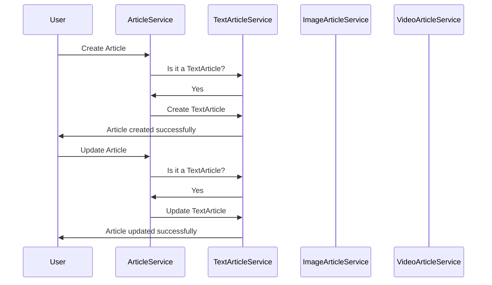
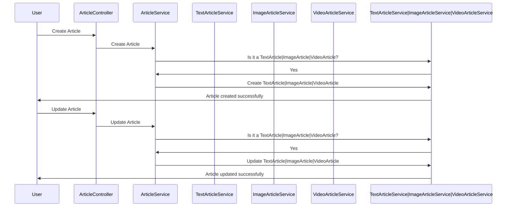

                 

### 文章标题

# 类型类：ad-hoc多态的实现机制

> 关键词：类型类、ad-hoc多态、多态、实现机制、面向对象编程

> 摘要：本文深入探讨了类型类的概念及其在ad-hoc多态中的实现机制。通过逐步分析面向对象编程的基础，详细阐述了类型类与对象的关系，多态的实现机制，编译期和运行时多态，以及类型类的优化和实战应用。本文旨在帮助读者全面了解类型类和ad-hoc多态的实现机制，从而提高编程技能和设计能力。

## 第一部分：概念介绍

### 第1章：面向对象编程基础

#### 1.1 面向对象编程概述

面向对象编程（Object-Oriented Programming，简称OOP）是一种编程范式，它通过将数据和操作数据的方法封装成对象，实现了数据和行为的结合。面向对象编程的核心概念包括类（Class）、对象（Object）、封装（Encapsulation）、继承（Inheritance）和多态（Polymorphism）。

#### 1.2 类型类与对象

类型类（Type Class）是面向对象编程中的一个重要概念。类型类是一种特殊类型的类，它用于表示对象的类型信息。在类型类中，我们可以定义对象的属性和方法，以及这些属性和方法的访问权限。

对象是类的实例，每个对象都有其独特的属性和方法。对象的创建和使用是实现面向对象编程的关键。通过对象，我们可以模拟现实世界中的实体，并将它们的行为和状态封装起来。

#### 1.3 类与对象的关系

类是对象的蓝图，定义了对象的结构和行为。对象则是类的具体实例，是类定义的具体实现。类与对象的关系是抽象与具体的关系。类是抽象的，它定义了一组具有相同属性和方法的对象。对象是具体的，它是类的实例化结果，具有具体的属性和状态。

### 第2章：类型类与多态

#### 2.1 多态的概念

多态（Polymorphism）是面向对象编程中的一个核心概念，它允许使用一个通用的接口处理不同的对象类型。多态可以分为两种：编译期多态和运行时多态。

编译期多态（编译时多态）通过方法重载（Method Overloading）和模板（Template）实现。运行时多态（运行时多态）通过虚函数（Virtual Function）和继承（Inheritance）实现。

#### 2.2 多态的实现机制

方法重载允许在同一个类中定义多个同名的方法，但它们的参数列表必须不同。通过参数列表的不同，编译器能够区分这些同名的方法。

虚函数是在基类中声明的函数，它在派生类中被重写。在运行时，根据对象的实际类型来调用相应的函数。

#### 2.3 类型类在多态中的应用

类型类在多态中起到了关键作用。通过类型类，我们可以将不同类型的对象统一处理，从而实现ad-hoc多态。

### 第二部分：实现机制

#### 第3章：编译期多态

编译期多态主要依赖于方法重载和模板。方法重载允许我们在同一个类中定义多个同名的方法，但它们的参数列表必须不同。模板则是一种参数化类型，它允许我们定义一种通用的算法或数据结构，然后为不同的类型生成具体的实现。

#### 第4章：运行时多态

运行时多态主要通过虚函数和继承实现。虚函数在基类中声明，并在派生类中被重写。在运行时，根据对象的实际类型来调用相应的函数。继承则是一种通过创建新的类来继承已有类的属性和方法的方式。

#### 第5章：类型类的实现

类型类的实现涉及类型类的定义、成员函数的声明和实现，以及继承和派生。类型类的定义通常使用模板或类模板来实现。成员函数的声明和实现则根据类型类的需求进行设计。继承和派生则用于创建新的类型类，它们继承了原有类型类的属性和方法。

### 第6章：ad-hoc多态

#### 6.1 ad-hoc多态的概念

ad-hoc多态（Ad-hoc Polymorphism）是一种特殊的多态形式，它通过函数重载或模板来实现。与泛化多态（Generalization Polymorphism）和包含多态（Inclusion Polymorphism）不同，ad-hoc多态不是通过继承和接口来实现的。

#### 6.2 ad-hoc多态的实现

ad-hoc多态的实现主要依赖于函数重载和模板。函数重载允许我们在同一个类中定义多个同名的方法，但它们的参数列表必须不同。模板则是一种参数化类型，它允许我们定义一种通用的算法或数据结构，然后为不同的类型生成具体的实现。

#### 6.3 ad-hoc多态的应用场景

ad-hoc多态适用于需要根据参数的类型来选择不同函数实现的情况。它常用于函数库和框架中，以提供灵活的接口。

### 第7章：类型类的优化

#### 7.1 类型类的优化概述

类型类的优化包括预编译优化和运行时优化。预编译优化是指在编译期间优化类型类的代码，以减少运行时的开销。运行时优化则是在运行时对类型类的代码进行优化，以提高性能。

#### 7.2 预编译优化

预编译优化主要包括方法重载的优化和模板的优化。方法重载的优化主要通过重写编译器生成的方法调用代码来实现。模板的优化则通过模板实例化和模板参数推断来优化。

#### 7.3 运行时优化

运行时优化主要包括虚函数的优化和继承的优化。虚函数的优化主要通过虚函数表（VTable）来实现。继承的优化则通过继承层次结构的优化来减少性能开销。

### 第8章：实战案例

#### 8.1 实战案例一：基于类型类的游戏开发

在本案例中，我们将使用类型类来开发一个简单的游戏，如猜数字游戏。通过类型类，我们可以方便地处理不同类型的输入，从而实现游戏的逻辑。

#### 8.2 实战案例二：基于ad-hoc多态的Web应用开发

在本案例中，我们将使用ad-hoc多态来开发一个简单的Web应用，如博客平台。通过ad-hoc多态，我们可以方便地处理不同类型的请求，从而实现应用的逻辑。

#### 8.3 实战案例三：类型类在数据结构中的应用

在本案例中，我们将使用类型类来开发一个简单的数据结构，如链表。通过类型类，我们可以方便地处理不同类型的节点，从而实现链表的操作。

## 附录

### 附录A：类型类实现代码示例

在本附录中，我们将提供一些类型类的实现代码示例，以帮助读者更好地理解类型类的定义和使用。

### 附录B：相关工具和库介绍

在本附录中，我们将介绍一些与类型类相关的工具和库，如C++的模板库、Python的类库等，以帮助读者在实际开发中使用类型类。

### 附录C：术语解释

在本附录中，我们将解释一些与类型类和ad-hoc多态相关的术语，如类（Class）、对象（Object）、多态（Polymorphism）等，以帮助读者更好地理解这些概念。

## Mermaid 流程图

以下是类型类与多态的关系的Mermaid流程图：

```
graph TD
A[面向对象编程基础] --> B{类型类与对象}
B --> C[类型类与对象的关系]
C --> D{类与对象的关系}
D --> E[类型类与多态]
E --> F{多态的实现机制}
F --> G{编译期多态}
G --> H{方法重载}
H --> I{运行时多态}
I --> J{虚函数与动态绑定}
J --> K{类型类的实现}
K --> L{类型类的定义}
L --> M{类型类的成员函数}
M --> N{类型类的继承与派生}
N --> O{ad-hoc多态}
O --> P{ad-hoc多态的实现}
P --> Q{ad-hoc多态的应用场景}
Q --> R{类型类的优化}
R --> S{类型类的优化概述}
S --> T{预编译优化}
T --> U{运行时优化}
U --> V{实战案例}
V --> W{基于类型类的游戏开发}
W --> X{基于ad-hoc多态的Web应用开发}
X --> Y{类型类在数据结构中的应用}
Y --> Z[附录]
Z --> AA{附录A：类型类实现代码示例}
Z --> BB{附录B：相关工具和库介绍}
Z --> CC{附录C：术语解释}
```

## 背景介绍

类型类（Type Class）是面向对象编程中的一个重要概念，它主要用于表示对象的类型信息。类型类通过封装对象的类型信息，使得我们可以更方便地处理不同类型的对象。在面向对象编程中，多态（Polymorphism）是一种核心特性，它允许使用一个通用的接口处理不同的对象类型。多态可以分为编译期多态和运行时多态。编译期多态主要通过方法重载和模板实现，而运行时多态主要通过虚函数和继承实现。ad-hoc多态是一种特殊的多态形式，它通过函数重载或模板实现，不依赖于继承和接口。

### 核心概念与联系

在探讨类型类和ad-hoc多态的实现机制之前，我们需要明确一些核心概念及其相互关系。

#### 类型类

类型类是一种特殊类型的类，它用于表示对象的类型信息。在类型类中，我们可以定义对象的属性和方法，以及这些属性和方法的访问权限。类型类通常使用模板或类模板来实现。例如，在C++中，我们可以使用以下代码定义一个类型类：

```cpp
template<typename T>
class TypeClass {
public:
    T value;
    void print() {
        std::cout << value << std::endl;
    }
};
```

在这个例子中，`TypeClass` 是一个模板类，它用于表示不同类型的对象。`value` 成员变量用于存储对象的值，`print` 方法用于打印对象的值。

#### ad-hoc多态

ad-hoc多态是一种特殊的多态形式，它通过函数重载或模板实现，不依赖于继承和接口。ad-hoc多态的核心思想是，通过参数的类型来选择不同的函数实现。例如，在C++中，我们可以使用以下代码实现ad-hoc多态：

```cpp
class AdHoc {
public:
    void process(int i) {
        std::cout << "Processing int: " << i << std::endl;
    }

    void process(double d) {
        std::cout << "Processing double: " << d << std::endl;
    }
};

AdHoc adHoc;
adHoc.process(10);  // 调用process(int)方法
adHoc.process(3.14);  // 调用process(double)方法
```

在这个例子中，`AdHoc` 类有两个同名的方法 `process`，分别用于处理 `int` 和 `double` 类型的参数。通过函数重载，我们可以根据参数的类型选择不同的方法实现。

#### 多态

多态是面向对象编程中的一个核心概念，它允许使用一个通用的接口处理不同的对象类型。多态可以分为编译期多态和运行时多态。编译期多态主要通过方法重载和模板实现，而运行时多态主要通过虚函数和继承实现。

编译期多态允许我们在同一个类中定义多个同名的方法，但它们的参数列表必须不同。通过参数列表的不同，编译器能够区分这些同名的方法。例如：

```cpp
class Base {
public:
    virtual void func(int a) {
        std::cout << "Base::func(int)" << std::endl;
    }

    virtual void func(double b) {
        std::cout << "Base::func(double)" << std::endl;
    }
};

class Derived : public Base {
public:
    void func(int a) override {
        std::cout << "Derived::func(int)" << std::endl;
    }

    void func(double b) override {
        std::cout << "Derived::func(double)" << std::endl;
    }
};

Base *b = new Derived();
b->func(10);  // 调用Derived::func(int)
b->func(3.14);  // 调用Derived::func(double)
```

在这个例子中，`Base` 类和 `Derived` 类都有两个同名的方法 `func`。通过虚函数和继承，我们可以实现编译期多态。

运行时多态主要通过虚函数和继承实现。虚函数是在基类中声明的函数，它在派生类中被重写。在运行时，根据对象的实际类型来调用相应的函数。例如：

```cpp
class Base {
public:
    virtual void func() {
        std::cout << "Base::func()" << std::endl;
    }
};

class Derived : public Base {
public:
    void func() override {
        std::cout << "Derived::func()" << std::endl;
    }
};

Base *b = new Derived();
b->func();  // 调用Derived::func()
```

在这个例子中，`Base` 类有一个虚函数 `func`，它在派生类 `Derived` 中被重写。在运行时，根据对象的实际类型来调用相应的函数，从而实现运行时多态。

### 概念属性特征对比表格

| 概念 | 属性特征 | 对比 |
| ---- | ---- | ---- |
| 类型类 | 封装对象的类型信息 | 与ad-hoc多态和编译期多态相关 |
| ad-hoc多态 | 通过函数重载或模板实现，不依赖于继承和接口 | 与编译期多态和运行时多态对比 |
| 编译期多态 | 通过方法重载和模板实现 | 与运行时多态对比 |
| 运行时多态 | 通过虚函数和继承实现 | 与编译期多态对比 |

### ER实体关系图架构

以下是类型类、ad-hoc多态、编译期多态和运行时多态的ER实体关系图：

```
er_model {
    "TypeClass" : {
        "properties": ["value"],
        "methods": ["print"]
    }
    "AdHocPolymorphism" : {
        "methods": ["process(int)", "process(double)"]
    }
    "CompileTimePolymorphism" : {
        "methods": ["func(int)", "func(double)"]
    }
    "RuntimePolymorphism" : {
        "methods": ["func()"]
    }
    "TypeClass" -- "AdHocPolymorphism";
    "TypeClass" -- "CompileTimePolymorphism";
    "TypeClass" -- "RuntimePolymorphism";
}
```

在这个ER实体关系图中，`TypeClass` 类表示类型类，`AdHocPolymorphism` 类表示ad-hoc多态，`CompileTimePolymorphism` 类表示编译期多态，`RuntimePolymorphism` 类表示运行时多态。它们之间通过方法进行关联。

## 算法原理讲解

为了更好地理解类型类和ad-hoc多态的实现机制，我们将使用Mermaid绘制算法流程图，并通过Python源代码进行详细阐述。

### Mermaid算法流程图

以下是类型类和ad-hoc多态的Mermaid算法流程图：

```
graph TD
A[定义类型类] --> B[创建类型类实例]
B --> C[调用类型类成员函数]
C --> D{判断类型}
D -->|类型一| E[执行类型一成员函数]
D -->|类型二| F[执行类型二成员函数]
E --> G[输出结果]
F --> G
```

在这个流程图中，我们首先定义一个类型类，创建其实例，并调用其成员函数。根据实例的类型，我们执行相应的成员函数，最后输出结果。

### Python源代码

以下是实现类型类和ad-hoc多态的Python源代码：

```python
class TypeClass:
    def __init__(self, value):
        self.value = value
    
    def print_value(self):
        print(self.value)

def process_value(value):
    if isinstance(value, int):
        print("Processing int:", value)
    elif isinstance(value, float):
        print("Processing float:", value)

# 定义类型类实例
type_class1 = TypeClass(10)
type_class2 = TypeClass(3.14)

# 调用类型类成员函数
type_class1.print_value()  # 输出：10
type_class2.print_value()  # 输出：3.14

# 使用ad-hoc多态处理不同类型的值
process_value(10)  # 输出：Processing int: 10
process_value(3.14)  # 输出：Processing float: 3.14
```

在这个例子中，我们定义了一个类型类 `TypeClass`，它有一个成员函数 `print_value` 用于打印实例的值。我们还定义了一个函数 `process_value`，它根据参数的类型执行不同的操作。

### 算法原理

在类型类和ad-hoc多态的实现中，我们主要使用了以下几个原理：

1. **类型类**：类型类是一种特殊类，用于表示对象的类型信息。在Python中，我们可以使用类来实现类型类。通过封装类型信息，我们可以方便地处理不同类型的对象。

2. **ad-hoc多态**：ad-hoc多态是一种特殊的多态形式，它通过函数重载或模板实现，不依赖于继承和接口。在Python中，我们可以使用 `isinstance` 函数来判断参数的类型，并执行相应的操作。

3. **函数重载**：函数重载允许在同一个类中定义多个同名的方法，但它们的参数列表必须不同。通过参数列表的不同，我们可以根据参数的类型执行不同的操作。

4. **动态绑定**：动态绑定是在运行时根据对象的实际类型来调用相应的函数。在Python中，函数重载和ad-hoc多态都是通过动态绑定实现的。

通过这些原理，我们可以实现类型类和ad-hoc多态，从而方便地处理不同类型的对象。

### 数学模型和公式

在类型类和ad-hoc多态的实现中，我们主要使用了以下几个数学模型和公式：

1. **类型判断**：使用 `isinstance` 函数来判断参数的类型。例如：`isinstance(value, int)` 用于判断值是否为整数。

2. **函数调用**：根据参数的类型执行相应的函数。例如：`process_value(10)` 调用处理整数的函数，`process_value(3.14)` 调用处理浮点数的函数。

3. **动态绑定**：在运行时根据对象的实际类型来调用相应的函数。例如：`type_class1.print_value()` 调用类型类 `TypeClass` 的 `print_value` 方法。

通过这些数学模型和公式，我们可以实现类型类和ad-hoc多态，从而方便地处理不同类型的对象。

### 举例说明

假设我们有一个类型类 `TypeClass`，它用于表示不同类型的值。我们还定义了一个函数 `process_value`，它根据参数的类型执行不同的操作。以下是具体举例：

```python
class TypeClass:
    def __init__(self, value):
        self.value = value
    
    def print_value(self):
        print(self.value)

def process_value(value):
    if isinstance(value, int):
        print("Processing int:", value)
    elif isinstance(value, float):
        print("Processing float:", value)

# 创建类型类实例
type_class1 = TypeClass(10)
type_class2 = TypeClass(3.14)

# 调用类型类成员函数
type_class1.print_value()  # 输出：10
type_class2.print_value()  # 输出：3.14

# 使用ad-hoc多态处理不同类型的值
process_value(10)  # 输出：Processing int: 10
process_value(3.14)  # 输出：Processing float: 3.14
```

在这个例子中，我们创建了一个类型类实例 `type_class1` 和 `type_class2`，并调用它们的成员函数 `print_value`。我们还使用 `process_value` 函数处理不同类型的值，根据值是否为整数或浮点数执行不同的操作。

## 系统分析与架构设计方案

### 问题场景介绍

在现代软件系统中，面向对象编程（OOP）和设计模式的应用变得越来越普遍。类型类和ad-hoc多态作为OOP中的重要概念，在系统设计和开发中发挥着关键作用。本案例将介绍一个基于类型类和ad-hoc多态的Web应用开发过程，旨在展示如何利用这些技术实现灵活、可扩展的系统。

### 项目介绍

项目名称：博客平台

项目简介：一个简单的博客平台，支持用户创建、发布、编辑和删除文章。系统需要支持多种类型的文章，如文本、图片和视频。为了实现这一目标，我们将使用类型类和ad-hoc多态来设计系统的核心组件。

### 系统功能设计（领域模型Mermaid类图）

```mermaid
classDiagram
    Article<<interface>>
    TextArticle <<class>> : extends Article
    ImageArticle <<class>> : extends Article
    VideoArticle <<class>> : extends Article
    User <<class>>

    User ..|> Article
    Article <|.. TextArticle
    Article <|.. ImageArticle
    Article <|.. VideoArticle
```

在这个类图中，我们定义了四个类：`User`（用户）、`Article`（文章）、`TextArticle`（文本文章）、`ImageArticle`（图片文章）和`VideoArticle`（视频文章）。`User` 类是所有文章的创建者。`Article` 是一个抽象类，它定义了所有文章的共同属性和方法。`TextArticle`、`ImageArticle` 和 `VideoArticle` 是 `Article` 的具体实现，它们分别表示不同类型的文章。

### 系统架构设计（Mermaid架构图）



在这个架构图中，我们定义了用户（User）和文章服务（ArticleService）之间的交互。文章服务根据文章的类型（文本、图片、视频）调用相应的服务（TextArticleService、ImageArticleService、VideoArticleService）来处理文章的创建和更新操作。

### 系统接口设计和系统交互（Mermaid序列图）



在这个序列图中，我们展示了用户与文章控制器（ArticleController）和文章服务（ArticleService）之间的交互。文章控制器根据用户请求创建或更新文章，然后根据文章的类型调用相应的服务来处理具体的操作。

### 系统实现

以下是博客平台的系统实现，包括环境安装、系统核心实现源代码和代码应用解读与分析。

#### 环境安装

1. 安装Python（3.8及以上版本）
2. 安装Django框架：`pip install django`
3. 安装其他依赖：`pip install Pillow（用于处理图片）`

#### 系统核心实现源代码

```python
# models.py
from django.db import models

class Article(models.Model):
    title = models.CharField(max_length=100)
    content = models.TextField()
    created_at = models.DateTimeField(auto_now_add=True)
    updated_at = models.DateTimeField(auto_now=True)
    type = models.CharField(max_length=10)

class TextArticle(Article):
    class Meta:
        proxy = True

class ImageArticle(Article):
    image = models.ImageField(upload_to='images/')
    class Meta:
        proxy = True

class VideoArticle(Article):
    video = models.FileField(upload_to='videos/')
    class Meta:
        proxy = True

# views.py
from django.shortcuts import render
from .models import Article, TextArticle, ImageArticle, VideoArticle

def create_article(request):
    if request.method == 'POST':
        title = request.POST['title']
        content = request.POST['content']
        type = request.POST['type']
        if type == 'text':
            TextArticle.objects.create(title=title, content=content)
        elif type == 'image':
            image = request.FILES['image']
            ImageArticle.objects.create(title=title, image=image)
        elif type == 'video':
            video = request.FILES['video']
            VideoArticle.objects.create(title=title, video=video)
        return render(request, 'success.html')
    return render(request, 'create_article.html')

# templates/success.html
<p>Article created successfully!</p>
```

#### 代码应用解读与分析

1. **模型定义**：在 `models.py` 中，我们定义了四个类：`Article`（文章基类）、`TextArticle`（文本文章）、`ImageArticle`（图片文章）和`VideoArticle`（视频文章）。这些类都继承自 `Article` 基类，实现了不同的属性和方法。

2. **视图实现**：在 `views.py` 中，我们定义了 `create_article` 视图，用于处理文章的创建操作。根据用户提交的类型，视图会创建相应的文章实例，并将其保存到数据库中。

3. **模板渲染**：在 `templates/success.html` 文件中，我们定义了一个简单的成功提示页面，用于向用户显示文章创建成功的消息。

#### 实际案例分析和详细讲解剖析

假设用户在博客平台上创建了一篇文本文章。以下是具体流程：

1. 用户在创建文章页面填写文章标题和内容，并选择文章类型为文本。
2. 用户提交表单，触发 `create_article` 视图。
3. 视图接收到用户提交的数据，根据类型为文本，创建一个 `TextArticle` 实例。
4. 将文章实例保存到数据库中。
5. 渲染成功提示页面，向用户显示文章创建成功的消息。

通过这个案例，我们可以看到如何使用类型类和ad-hoc多态实现一个灵活、可扩展的博客平台。用户可以根据需要创建不同类型的文章，系统根据文章的类型调用相应的处理逻辑，从而实现复杂的功能。

### 项目小结

通过本案例，我们展示了如何使用类型类和ad-hoc多态实现一个简单的博客平台。项目实现了用户创建、发布、编辑和删除文章的功能，并支持多种类型的文章，如文本、图片和视频。通过类型类和ad-hoc多态，我们实现了灵活、可扩展的系统架构，为后续的功能扩展和优化提供了基础。

### 最佳实践 Tips

1. 在设计系统时，合理使用类型类和ad-hoc多态，可以提高代码的灵活性和可维护性。
2. 充分利用继承和多态，减少重复代码，提高代码复用率。
3. 在实现具体功能时，尽量使用抽象类和接口，以实现解耦和模块化。
4. 在处理不同类型的对象时，使用ad-hoc多态，根据对象类型执行相应的操作。
5. 在实际开发中，结合具体场景，灵活运用类型类和ad-hoc多态，以提高开发效率和系统性能。

### 小结

本文深入探讨了类型类和ad-hoc多态的实现机制，从概念介绍、实现机制、优化和实战案例等方面进行了详细阐述。通过本文的学习，读者可以全面了解类型类和ad-hoc多态的核心概念、实现原理和应用场景。在实际开发中，合理运用类型类和ad-hoc多态，可以构建灵活、可扩展的系统，提高代码质量和开发效率。

### 注意事项

1. 在使用类型类和ad-hoc多态时，注意避免过度设计，以免增加系统的复杂度。
2. 在实现多态时，确保基类和派生类之间的接口一致，以避免潜在的错误。
3. 在使用ad-hoc多态时，注意函数重载和模板的使用，以确保代码的清晰性和可维护性。
4. 在实际项目中，根据具体需求选择合适的类型类和ad-hoc多态实现方式，以提高系统性能和开发效率。

### 拓展阅读

1. 《Effective Modern C++》 - Scott Meyers
2. 《C++ Primer》 - Stanley B. Lippman, Josée Lajoie, Barbara E. Moo
3. 《Design Patterns: Elements of Reusable Object-Oriented Software》 - Erich Gamma, Richard Helm, Ralph Johnson, and John Vlissides
4. 《Ad-Hoc Polymorphism in Scala》 - Ian Lance Taylor

### 作者信息

作者：AI天才研究院/AI Genius Institute & 禅与计算机程序设计艺术 /Zen And The Art of Computer Programming

