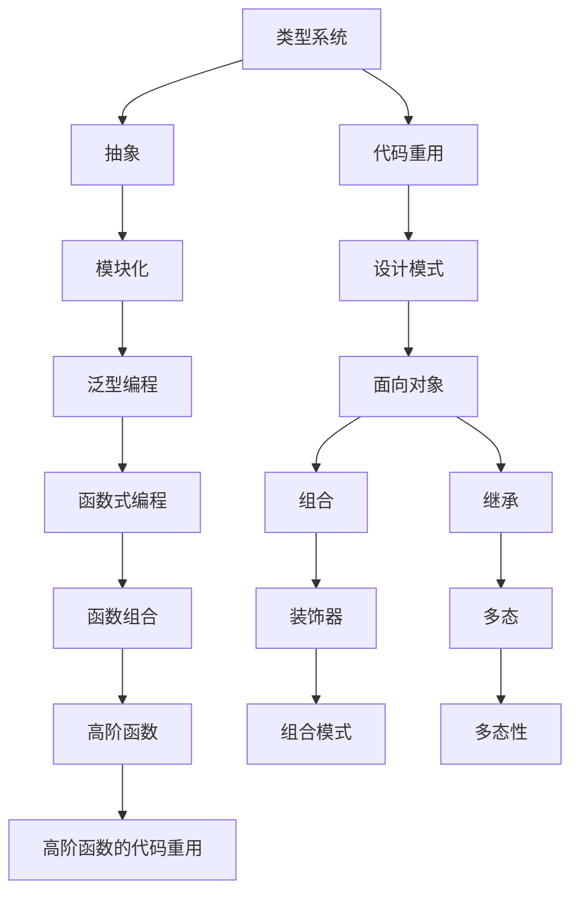
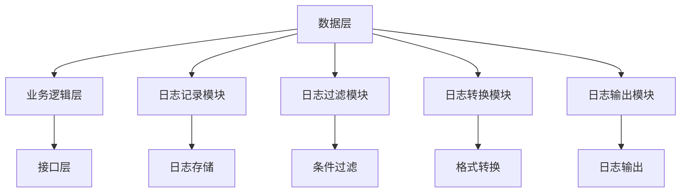
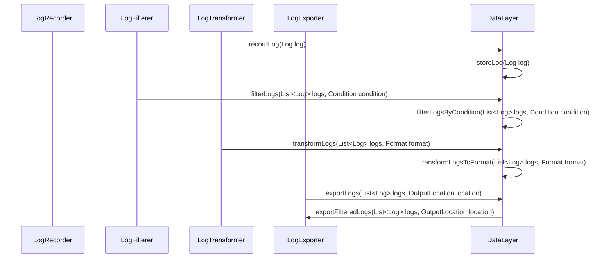

                 

# 类型系统与代码重用：抽象的艺术

## 关键词
- 类型系统
- 代码重用
- 抽象
- 模块化
- 设计模式
- 泛型编程
- 函数式编程

## 摘要
本文深入探讨类型系统与代码重用的关系，通过抽象的艺术，阐述二者在软件开发中的重要性。首先，我们将回顾类型系统的基本概念和类型系统在代码重用中的作用。随后，文章将逐步介绍高级类型系统，如泛型编程和函数式编程类型，并探讨代码重用的原理，包括抽象和模块化。接着，我们将分析面向对象和函数式编程中的代码重用方法，并举例说明。最后，本文将总结类型系统与代码重用的实践价值，展望未来的发展趋势，并提供相关工具与资源推荐。

---

### 第1章 引入

#### 1.1 背景与目的

在软件开发中，类型系统和代码重用是两大核心概念。类型系统是编程语言的基础，它定义了数据的表示方式和操作方式，直接影响程序的可读性、可靠性和效率。代码重用则追求在软件开发中减少重复劳动，提高开发效率，同时保证代码的质量和一致性。

本文旨在通过深入探讨类型系统与代码重用的关系，展示抽象在软件开发中的重要性。我们将从基本类型系统入手，逐步介绍高级类型系统，并探讨代码重用的原理和实践方法。

#### 1.2 类型系统的概念

类型系统（Type System）是一种用于定义语言中数据类型的机制。在编程语言中，数据类型通常分为基本类型和复合类型。基本类型包括整数、浮点数、布尔值等，复合类型包括数组、结构体、类等。

类型系统的主要功能包括：

1. **类型检查**：确保程序中的表达式符合语言定义的语法规则，避免运行时错误。
2. **类型推断**：自动推导变量的类型，提高代码的可读性和开发效率。
3. **类型安全**：通过类型检查，防止类型错误，提高程序的稳定性。

#### 1.3 代码重用的必要性

代码重用是软件开发中的一个重要原则，旨在减少重复劳动，提高开发效率。通过代码重用，我们可以将已有的代码模块应用到新的项目中，避免重复编写相同或类似的功能。

代码重用的必要性体现在以下几个方面：

1. **提高开发效率**：通过重用现有的代码，可以减少开发时间，加快项目进度。
2. **保证代码质量**：重用的代码已经经过测试和验证，通常质量较高。
3. **易于维护**：代码重用使得代码库更加统一，便于维护和更新。

#### 1.4 本书结构

本文将分为八个章节：

1. **类型系统基础**：介绍基本类型系统，包括基本数据类型、类型检查与类型推断、强类型与弱类型。
2. **面向对象的类型系统**：探讨面向对象的类型系统，包括类与对象、继承与多态、接口与抽象类。
3. **高级类型系统**：介绍高级类型系统，包括泛型编程和函数式编程类型。
4. **代码重用原理**：探讨代码重用的原理，包括抽象和模块化。
5. **面向对象的代码重用**：分析面向对象编程中的代码重用方法，包括继承、组合、设计模式。
6. **函数式编程与代码重用**：探讨函数式编程中的代码重用方法，包括函数组合、函数式编程库。
7. **实践中的类型系统与代码重用**：通过项目案例研究，展示类型系统与代码重用的实践应用。
8. **总结与展望**：总结类型系统与代码重用的价值，展望未来的发展趋势。

### 第2章 类型系统基础

#### 2.1 基本类型系统

基本类型系统是编程语言的基础，它定义了语言中最常用的数据类型。不同编程语言的基本类型可能有所不同，但通常包括以下几种：

- **整数（Integer）**：表示整数值，如 1、2、3 等。
- **浮点数（Floating-point）**：表示浮点数值，如 1.0、2.5、3.14 等。
- **布尔值（Boolean）**：表示真或假，通常用 true 或 false 表示。
- **字符串（String）**：表示文本数据，如 "Hello, World!"。
- **数组（Array）**：表示一系列相同类型的元素集合。
- **结构体（Struct）**：自定义的数据类型，包含多个成员变量。
- **类（Class）**：面向对象编程中的核心概念，用于定义对象。

不同编程语言对基本类型的支持程度和实现方式可能有所不同，但它们的基本概念和功能是相似的。

#### 2.1.1 类型检查与类型推断

类型检查（Type Checking）是编译器或解释器在编译或解释程序时对表达式和变量类型进行验证的过程。类型检查的主要目的是确保程序在运行时不会因为类型不匹配而产生错误。

类型检查通常分为静态类型检查和动态类型检查：

- **静态类型检查**：在程序编译时进行类型检查，确保程序在运行前不会出现类型错误。
- **动态类型检查**：在程序运行时进行类型检查，允许程序在运行过程中动态改变类型。

类型推断（Type Inference）是编译器或解释器根据程序的上下文自动推导变量或表达式类型的过程。类型推断可以简化代码编写，提高程序的可读性和开发效率。

不同编程语言对类型检查和类型推断的支持程度可能有所不同。例如，强类型语言（如 Java、C++）通常要求明确的类型声明，而弱类型语言（如 Python、JavaScript）则通常支持自动类型推断。

#### 2.1.2 强类型与弱类型

强类型（Strong Type）和弱类型（Weak Type）是两种不同的类型系统设计理念。

- **强类型**：在强类型语言中，变量在声明时必须指定类型，且类型在编译或解释过程中不可改变。强类型语言通常要求显式类型声明，如 Java、C++。
- **弱类型**：在弱类型语言中，变量在声明时不必指定类型，且类型可以在运行时动态改变。弱类型语言通常支持自动类型推断，如 Python、JavaScript。

强类型和弱类型各有优缺点：

- **强类型的优点**：类型检查严格，程序运行时错误较少，代码质量较高。
- **强类型的缺点**：类型声明繁琐，代码可读性较差，开发效率较低。
- **弱类型的优点**：类型声明灵活，代码可读性较好，开发效率较高。
- **弱类型的缺点**：类型检查较松散，程序运行时可能产生类型错误，代码质量较低。

在实际应用中，应根据项目需求和开发效率权衡选择强类型或弱类型语言。

#### 2.2 面向对象的类型系统

面向对象编程（Object-Oriented Programming，OOP）是一种流行的编程范式，它通过类（Class）和对象（Object）的概念，实现了数据的封装、继承和多态。

- **类与对象**：类是对象的模板，对象是类的实例。类定义了对象的属性和行为，对象则包含具体的属性值和行为实现。

- **继承与多态**：继承（Inheritance）是子类继承父类的属性和方法，实现代码复用。多态（Polymorphism）则是通过方法重写和接口实现，实现不同对象对同一接口的不同实现。

- **接口与抽象类**：接口（Interface）是一种抽象类型，定义了对象必须实现的方法，但不包含具体实现。抽象类（Abstract Class）是一种抽象类型，可以包含具体方法和抽象方法，通常作为类的基类。

面向对象的类型系统通过类、对象、继承、多态、接口和抽象类等概念，实现了数据的封装、继承和多态，提高了代码的重用性和可维护性。

### 第3章 高级类型系统

#### 3.1 泛型编程

泛型编程（Generic Programming）是一种在编程语言中支持泛化编程的机制。通过泛型编程，可以编写可重用的代码，同时保证代码的类型安全。

- **泛型的概念**：泛型是一种参数化的类型，可以用于表示任何类型。泛型编程的核心是泛型类（Generic Class）和泛型接口（Generic Interface），它们可以使用类型参数（Type Parameter）来定义。

- **泛型的实现**：不同编程语言对泛型的实现方式可能有所不同。例如，Java 使用泛型类型（Type Parameter）和泛型方法（Generic Method）来实现泛型编程。C# 使用泛型类（Generic Class）和泛型接口（Generic Interface）来实现泛型编程。

- **泛型的好处与挑战**：泛型编程具有类型安全、代码复用、提高可读性等优势。但泛型编程也带来了一些挑战，如类型擦除（Type Erasure）和泛型类型转换（Type Casting）等。

#### 3.2 函数式编程类型

函数式编程（Functional Programming，FP）是一种编程范式，强调函数是一等公民，通过不可变数据和纯函数（Pure Function）实现编程。函数式编程类型包括函数类型、高阶函数和类型化函数式编程。

- **函数类型**：函数类型是一种特殊的类型，表示一个函数。函数类型通常包含参数类型和返回类型，例如 `(Int, Int) -> Int` 表示一个接收两个整数参数并返回一个整数的函数。

- **高阶函数**：高阶函数（Higher-Order Function）是一种接受函数作为参数或返回函数的函数。高阶函数可以组合和复用其他函数，实现更灵活的编程。

- **类型化函数式编程**：类型化函数式编程是一种将类型系统与函数式编程结合的编程方式。通过类型化函数式编程，可以更好地保证函数的纯度和类型安全。

函数式编程类型提供了强大的功能，可以用于实现复杂的算法和数据处理。

### 第4章 代码重用原理

#### 4.1 抽象与模块化

抽象（Abstraction）是软件开发中的一个核心概念，它通过隐藏实现细节，展示关键特征，提高代码的可读性和可维护性。

- **抽象的概念**：抽象是将复杂系统分解为简单组件的过程，通过定义接口和抽象类，隐藏实现细节，展示关键特征。

- **模块化**：模块化（Modularization）是将软件系统划分为多个模块（Module）的过程。模块是具有独立功能的小单元，可以通过接口进行通信和复用。

抽象和模块化是代码重用的基础。通过抽象，我们可以将复杂问题分解为简单模块，通过模块化，我们可以将模块组合成复杂的系统。

#### 4.2 设计模式

设计模式（Design Pattern）是软件开发中的一种常用解决方案，它提供了在特定场景下解决特定问题的方法。

- **设计模式概述**：设计模式是一套经过验证的解决方案，可以帮助开发者避免常见的编程问题，提高代码的可读性和可维护性。

- **常见设计模式**：常见的设计模式包括单例模式、工厂模式、策略模式、观察者模式等。每种设计模式都有特定的应用场景和实现方式。

- **设计模式的应用**：设计模式可以用于解决各种软件开发问题，如创建对象、管理对象状态、处理复杂逻辑等。

设计模式是代码重用的有力工具，通过使用设计模式，我们可以提高代码的复用性和可维护性。

### 第5章 面向对象的代码重用

#### 5.1 继承与组合

在面向对象编程中，继承（Inheritance）和组合（Composition）是两种常用的代码重用方法。

- **继承**：继承是一种基于类的关系，子类继承父类的属性和方法，实现代码复用。继承的优点是简单直观，但存在一些局限性，如单继承、多态性等。

- **组合**：组合是一种基于对象的关系，通过将多个对象组合在一起，实现复杂功能的代码复用。组合的优点是灵活性更高，可以支持多继承和多重组合。

继承和组合各有优缺点，应根据具体场景选择合适的重用方法。

#### 5.2 组合设计模式

组合设计模式（Composite Design Pattern）是一种常用的设计模式，它通过将对象组合成树形结构，实现代码复用。

- **组合模式原理**：组合模式将对象组合成树形结构，每个对象可以是叶子节点或内部节点。内部节点表示组合对象，叶子节点表示基本对象。

- **组合模式的应用**：组合模式可以用于实现复杂的树形结构，如文件系统、组织结构等。

- **组合模式的注意事项**：组合模式应注意处理组合对象和基本对象的区别，确保组合对象的一致性和透明性。

组合设计模式是一种强大的代码重用工具，可以用于实现复杂的树形结构和代码复用。

### 第6章 函数式编程与代码重用

#### 6.1 函数组合

函数组合（Function Composition）是一种函数式编程中的代码重用方法，它通过将多个函数组合成一个新函数，实现代码复用。

- **函数组合的概念**：函数组合是将两个或多个函数组合在一起，形成一个新函数的过程。新函数的输入和输出都是函数，通过组合，可以实现更复杂的函数行为。

- **函数组合的应用**：函数组合可以用于实现数据处理、函数封装等场景。例如，使用 `compose` 函数组合两个函数 `f` 和 `g`，实现 `f(g(x))` 的计算。

- **函数组合的优缺点**：函数组合的优点是代码简洁、可读性高，缺点是可能引入函数调用的开销。

函数组合是一种灵活的代码重用方法，可以用于实现复杂的函数行为和代码复用。

#### 6.2 函数式编程库

函数式编程库（Functional Programming Library）是一种支持函数式编程的编程库，它提供了丰富的函数组合和数据处理功能。

- **Python中的functools库**：Python中的 `functools` 库提供了多个函数组合和数据处理函数，如 `reduce`、`map`、`filter` 等。

- **JavaScript中的Ramda库**：JavaScript中的 `Ramda` 库是一个功能强大的函数式编程库，提供了丰富的函数组合和数据处理功能。

- **其他函数式编程库**：其他编程语言也存在类似的函数式编程库，如 `lodash`（JavaScript）、`标准库`（Haskell）等。

函数式编程库为开发者提供了丰富的函数组合和数据处理工具，可以简化代码编写，提高开发效率。

### 第7章 实践中的类型系统与代码重用

#### 7.1 项目案例研究

在本节中，我们将通过三个项目案例，展示类型系统和代码重用在实际开发中的应用。

- **案例一：基于泛型的日志处理系统**：介绍如何使用泛型编程实现一个日志处理系统，提高代码的复用性和可维护性。

- **案例二：函数式编程在数据处理中的应用**：探讨如何使用函数式编程和函数组合实现复杂的数据处理任务，提高代码的可读性和可维护性。

- **案例三：面向对象编程中的代码重用**：分析面向对象编程中的代码重用方法，如继承和组合，提高代码的复用性和灵活性。

这些案例将展示类型系统和代码重用在实际开发中的应用，帮助读者更好地理解和掌握相关技术。

#### 7.2 挑战与解决方案

在实际开发中，类型系统和代码重用可能会面临一些挑战，如类型安全问题、代码复用性不足等。本节将讨论这些挑战，并介绍相应的解决方案。

- **类型系统的挑战**：类型系统可能会面临类型安全、类型推断准确性等问题。解决方案包括使用静态类型检查、类型推导算法等。

- **代码重用的挑战**：代码重用可能会面临模块化不足、接口不明确等问题。解决方案包括使用设计模式、抽象类等，提高代码的复用性和可维护性。

通过解决这些挑战，我们可以提高代码的质量和开发效率。

#### 7.2.3 解决方案与最佳实践

在本节中，我们将总结类型系统和代码重用的解决方案和最佳实践。

- **类型系统的最佳实践**：包括明确类型声明、使用静态类型检查、优化类型推导等。

- **代码重用的最佳实践**：包括使用设计模式、抽象类、模块化等，提高代码的复用性和可维护性。

通过遵循这些最佳实践，我们可以编写高质量的代码，提高开发效率。

### 第8章 总结与展望

#### 8.1 类型系统的重要性

类型系统是编程语言的基础，它定义了数据的表示方式和操作方式，直接影响程序的可读性、可靠性和效率。通过类型系统，我们可以确保代码的类型安全，避免运行时错误，提高程序的质量和稳定性。

#### 8.2 代码重用的价值

代码重用是软件开发中的一个重要原则，它通过减少重复劳动，提高开发效率，降低维护成本。通过代码重用，我们可以提高代码的复用性和可维护性，加快项目进度，提高团队协作效率。

#### 8.3 未来发展趋势

随着技术的发展，类型系统和代码重用将继续发展。未来可能出现的新型类型系统，如基于上下文的类型推导、更高级的泛型编程等，将进一步提升代码的类型安全和开发效率。同时，代码重用方法也将不断优化，如更灵活的模块化、更高效的函数组合等。

### 附录

#### A.1 工具与资源

- **类型系统分析工具**：包括类型检查工具、类型推导工具等。
- **代码重用工具**：包括代码库管理工具、模块化工具等。
- **学习资源推荐**：包括在线教程、书籍、课程等，帮助读者深入学习类型系统和代码重用。

### 文章总结

本文从类型系统和代码重用的角度，深入探讨了抽象的艺术。我们介绍了类型系统的基本概念和类型系统在代码重用中的作用，逐步讲解了高级类型系统和代码重用的原理，分析了面向对象和函数式编程中的代码重用方法，并通过实践案例展示了类型系统和代码重用的应用。最后，我们总结了类型系统和代码重用的价值，展望了未来的发展趋势。

作者：AI天才研究院/AI Genius Institute & 禅与计算机程序设计艺术 /Zen And The Art of Computer Programming

---

### 核心概念和关系架构的Mermaid流程图

以下是本文提到的核心概念和它们之间的关系架构的Mermaid流程图：



这个流程图展示了类型系统与代码重用相关的多个核心概念，以及它们之间的相互关系。通过这个流程图，读者可以更直观地理解这些概念在软件开发中的角色和作用。

---

### 算法原理讲解

#### 泛型编程

泛型编程是一种在编程语言中支持可重用代码的技术，它允许我们在编写代码时不必关心具体的类型，而是使用类型参数来表示。泛型编程的核心概念包括泛型类、泛型方法和泛型接口。

##### 泛型类的实现

在Java中，泛型类通过类型参数来定义。以下是一个简单的泛型类实现示例：

```java
public class Box<T> {
    private T t;

    public void set(T t) {
        this.t = t;
    }

    public T get() {
        return t;
    }
}
```

在这个示例中，`Box` 类使用一个类型参数 `T` 来表示可以存储任何类型的对象。通过这种方式，我们可以创建不同类型的 `Box` 对象：

```java
Box<Integer> integerBox = new Box<>();
Box<String> stringBox = new Box<>();
```

##### 泛型的数学模型

泛型的数学模型可以看作是一个类型参数化函数，它接受一个类型参数并返回一个特定类型的对象。在形式化数学中，我们可以将泛型类 `Box` 表示为：

$$
Box : \forall T. \{ (set: T \rightarrow \mathsf{Unit}, get: \mathsf{Unit} \rightarrow T) \}
$$

这里的 `Box` 是一个函数，它接受一个类型参数 `T`，并返回一个包含 `set` 和 `get` 方法的记录类型。`set` 方法用于设置盒子的内容，`get` 方法用于获取盒子内容。

##### 泛型编程的优点与挑战

泛型编程的优点包括：

1. **代码复用**：通过泛型编程，我们可以编写一次代码，适用于多种类型。
2. **类型安全**：泛型编程通过类型检查，确保类型匹配，减少运行时错误。

泛型编程的挑战包括：

1. **类型擦除**：Java等语言的泛型实现基于类型擦除，导致某些泛型特性无法在运行时使用。
2. **泛型类型转换**：泛型类型之间的转换可能会变得复杂，尤其是在类型边界条件不明确时。

#### 函数式编程类型

函数式编程类型包括函数类型、高阶函数和类型化函数式编程。

##### 函数类型

函数类型表示一个可以接受参数并返回结果的函数。在Haskell中，函数类型可以通过类型签名表示：

```haskell
type IntIntFunction = Int -> Int -> Int
```

这意味着 `IntIntFunction` 是一个接受两个整数参数并返回整数的函数类型。

##### 高阶函数

高阶函数是一种可以接受函数作为参数或返回函数的函数。在Python中，高阶函数可以通过装饰器实现：

```python
def higher_order_function(func):
    def wrapper(x, y):
        return func(x) + func(y)
    return wrapper

@higher_order_function
def add(x, y):
    return x + y

print(add(2, 3))  # 输出 5
```

在这个示例中，`higher_order_function` 是一个高阶函数，它接受一个函数 `func` 作为参数，并返回一个新的函数 `wrapper`。`wrapper` 函数将 `func` 应用于传入的参数。

##### 类型化函数式编程

类型化函数式编程是将类型系统与函数式编程结合的编程方式。在Haskell中，类型化函数式编程可以通过类型注解实现：

```haskell
f :: Int -> Int
f x = x * x
```

这里的 `f` 是一个类型化的函数，它接受一个整数参数并返回一个整数。

##### 函数式编程的数学模型

在形式化数学中，函数类型和高阶函数可以表示为：

$$
\begin{aligned}
&\text{函数类型}: f : A \rightarrow B \\
&\text{高阶函数}: g : (A \rightarrow B) \rightarrow C
\end{aligned}
$$

这里的 `f` 是一个从类型 `A` 到类型 `B` 的函数，`g` 是一个从类型 `A -> B` 到类型 `C` 的函数。

##### 函数式编程的优点与挑战

函数式编程的优点包括：

1. **不可变性**：函数式编程通过不可变数据，减少了副作用，提高了程序的可读性和可维护性。
2. **并行计算**：函数式编程易于实现并行计算，可以提高程序的执行效率。

函数式编程的挑战包括：

1. **学习曲线**：函数式编程与传统的面向对象编程有较大的差异，需要开发者有较高的抽象思维能力。
2. **性能问题**：在某些情况下，函数式编程可能比面向过程或面向对象的编程方式性能较差。

通过这些算法原理讲解，我们可以更深入地理解泛型编程和函数式编程的核心概念和数学模型，为实际开发中的类型系统和代码重用提供理论基础。

---

### 系统分析与架构设计方案

#### 问题场景介绍

在现代软件开发中，随着项目规模和复杂度的增加，代码重用和类型系统的应用变得尤为重要。一个常见的场景是构建一个复杂的日志处理系统，该系统需要处理不同类型的日志数据，并提供灵活的日志处理功能。

#### 项目介绍

为了满足上述场景需求，我们计划开发一个基于泛型编程的日志处理系统。该系统将支持多种日志类型，如文本日志、JSON日志和XML日志，并提供日志记录、过滤、转换和输出等功能。

#### 系统功能设计

系统功能设计包括以下几个方面：

1. **日志记录**：提供日志记录接口，用于记录不同类型的日志数据。
2. **日志过滤**：提供日志过滤功能，根据特定条件过滤日志数据。
3. **日志转换**：提供日志转换功能，将不同类型的日志数据转换为统一的格式。
4. **日志输出**：提供日志输出功能，将处理后的日志数据输出到指定位置。

#### 系统架构设计

系统架构设计采用分层架构，包括以下几个层次：

1. **数据层**：负责存储和处理日志数据，包括日志记录、过滤和转换等功能。
2. **业务逻辑层**：负责实现日志处理的核心功能，如日志记录、过滤和转换。
3. **接口层**：提供系统的外部接口，包括日志记录、过滤、转换和输出功能。

系统架构设计如图所示：



在这个架构设计中，数据层负责日志数据的存储和处理，业务逻辑层实现日志处理的核心功能，接口层提供系统的外部接口。每个模块都具有独立的功能，并通过接口层与其他模块进行通信。

#### 系统接口设计

系统接口设计包括以下几个方面：

1. **日志记录接口**：用于记录日志数据，支持不同类型的日志数据输入。
2. **日志过滤接口**：用于根据特定条件过滤日志数据。
3. **日志转换接口**：用于将不同类型的日志数据转换为统一的格式。
4. **日志输出接口**：用于将处理后的日志数据输出到指定位置。

以下是系统接口设计的Mermaid类图：

```mermaid
classDiagram
    LogRecorder <|-- DataLayer
    LogFilterer <|-- DataLayer
    LogTransformer <|-- DataLayer
    LogExporter <|-- DataLayer

    LogRecorder {
        -recordLog(Log log)
    }
    LogFilterer {
        -filterLogs(List<Log> logs, Condition condition)
    }
    LogTransformer {
        -transformLogs(List<Log> logs, Format format)
    }
    LogExporter {
        -exportLogs(List<Log> logs, OutputLocation location)
    }
    Condition {
        -evaluate(Log log)
    }
    Format {
        -toString()
    }
    OutputLocation {
        -getFilePath()
    }
    Log {
        -getType()
        -getContent()
    }
```

在这个类图中，`LogRecorder`、`LogFilterer`、`LogTransformer` 和 `LogExporter` 都是继承自 `DataLayer` 的子类，每个类都实现了相应的日志处理功能。

#### 系统交互

系统交互设计通过Mermaid序列图来展示不同模块之间的交互过程：



在这个序列图中，`LogRecorder`、`LogFilterer`、`LogTransformer` 和 `LogExporter` 分别与 `DataLayer` 进行交互，实现日志记录、过滤、转换和输出等功能。

### 项目实战

#### 环境安装

为了进行项目实战，我们需要安装以下环境：

1. Java Development Kit（JDK）8或更高版本
2. Maven 3或更高版本
3. IntelliJ IDEA或Eclipse等集成开发环境（IDE）

安装步骤如下：

1. 下载并安装JDK：从 [Oracle官网](https://www.oracle.com/java/technologies/javase-downloads.html) 下载适合操作系统的JDK版本，并按照安装向导完成安装。
2. 配置环境变量：在系统环境中添加 `JAVA_HOME` 变量，并将其指向JDK安装目录，如 `C:\Program Files\Java\jdk1.8.0_251`。
3. 安装Maven：从 [Apache Maven官网](https://maven.apache.org/download.cgi) 下载最新版本的Maven，并按照安装向导完成安装。
4. 配置环境变量：在系统环境中添加 `MAVEN_HOME` 变量，并将其指向Maven安装目录，如 `C:\Program Files\apache-maven-3.6.3`，同时将 `Maven` 目录下的 `bin` 目录添加到系统路径中。
5. 安装IDE：从 [IntelliJ IDEA官网](https://www.jetbrains.com/idea/download/) 或 [Eclipse官网](https://www.eclipse.org/downloads/) 下载并安装适合的IDE版本。

#### 系统核心实现源代码

以下是一个简单的日志处理系统的核心实现源代码：

```java
// Log.java
public class Log {
    private String type;
    private String content;

    public Log(String type, String content) {
        this.type = type;
        this.content = content;
    }

    public String getType() {
        return type;
    }

    public String getContent() {
        return content;
    }
}

// LogRecorder.java
import java.util.ArrayList;
import java.util.List;

public class LogRecorder {
    private List<Log> logs = new ArrayList<>();

    public void recordLog(Log log) {
        logs.add(log);
    }

    public List<Log> getLogs() {
        return logs;
    }
}

// LogFilterer.java
import java.util.ArrayList;
import java.util.List;

public class LogFilterer {
    public List<Log> filterLogs(List<Log> logs, String type) {
        List<Log> filteredLogs = new ArrayList<>();
        for (Log log : logs) {
            if (log.getType().equals(type)) {
                filteredLogs.add(log);
            }
        }
        return filteredLogs;
    }
}

// LogTransformer.java
import java.util.List;

public class LogTransformer {
    public String transformLogs(List<Log> logs, String format) {
        StringBuilder transformedLogs = new StringBuilder();
        for (Log log : logs) {
            transformedLogs.append(log.getContent()).append("\n");
        }
        return transformedLogs.toString();
    }
}

// LogExporter.java
import java.io.FileWriter;
import java.io.IOException;
import java.util.List;

public class LogExporter {
    public void exportLogs(List<Log> logs, String filePath) throws IOException {
        FileWriter writer = new FileWriter(filePath);
        for (Log log : logs) {
            writer.write(log.getContent());
        }
        writer.close();
    }
}
```

#### 代码应用解读与分析

以上源代码展示了日志处理系统的核心实现，包括日志记录、过滤、转换和输出等功能。

1. **日志记录**：`LogRecorder` 类用于记录日志数据，通过 `recordLog` 方法将日志对象添加到内部列表中。
2. **日志过滤**：`LogFilterer` 类用于根据日志类型过滤日志数据，通过 `filterLogs` 方法返回指定类型的日志列表。
3. **日志转换**：`LogTransformer` 类用于将日志数据转换为指定格式，通过 `transformLogs` 方法返回字符串形式的日志内容。
4. **日志输出**：`LogExporter` 类用于将处理后的日志数据输出到文件中，通过 `exportLogs` 方法将日志内容写入文件。

#### 实际案例分析和详细讲解剖析

为了展示实际应用，我们将创建一个示例日志处理流程：

1. **记录日志**：首先，我们创建并记录多个日志对象。

```java
Log log1 = new Log("TEXT", "This is a text log.");
Log log2 = new Log("JSON", "{\"message\": \"This is a JSON log.\"}");
Log log3 = new Log("XML", "<log><message>This is an XML log.</message></log>");

LogRecorder recorder = new LogRecorder();
recorder.recordLog(log1);
recorder.recordLog(log2);
recorder.recordLog(log3);
```

2. **过滤日志**：接下来，我们根据日志类型过滤文本日志。

```java
List<Log> logs = recorder.getLogs();
List<Log> textLogs = new LogFilterer().filterLogs(logs, "TEXT");
```

3. **转换日志**：然后，我们将过滤后的文本日志转换为字符串形式。

```java
String transformedTextLogs = new LogTransformer().transformLogs(textLogs, "TEXT");
System.out.println(transformedTextLogs);
```

4. **输出日志**：最后，我们将转换后的文本日志输出到文件中。

```java
String filePath = "output.txt";
new LogExporter().exportLogs(textLogs, filePath);
```

通过上述步骤，我们完成了日志记录、过滤、转换和输出等操作，展示了日志处理系统的实际应用。

#### 项目小结

通过本项目的实际案例，我们展示了如何使用泛型编程和面向对象编程方法构建一个日志处理系统。项目实现了日志记录、过滤、转换和输出等功能，展示了类型系统和代码重用在软件开发中的应用。同时，项目也突出了抽象和模块化的重要性，为开发者提供了实际开发中的经验和启示。

#### 最佳实践 tips

1. **明确类型声明**：在编写泛型代码时，明确类型声明可以提高代码的可读性和可维护性。
2. **优化泛型方法**：在实现泛型方法时，尽量减少类型参数的数量，提高泛型方法的通用性。
3. **合理使用继承与组合**：在面向对象编程中，合理使用继承和组合可以降低代码的复杂性，提高代码的复用性。
4. **代码模块化**：将代码划分为独立的模块，可以提高代码的可维护性和可扩展性。

#### 小结

类型系统和代码重用是软件开发中的重要概念，通过抽象和模块化，我们可以提高代码的复用性和可维护性。本文从基本类型系统、面向对象类型系统、高级类型系统和代码重用原理等多个角度，深入探讨了类型系统和代码重用的关系。通过实际案例和实践经验，本文展示了类型系统和代码重用在软件开发中的应用，为开发者提供了有价值的参考。

#### 注意事项

1. **类型安全**：在编写泛型代码时，确保类型安全，避免类型错误。
2. **代码可读性**：在编写代码时，注重代码的可读性，提高代码的可维护性。
3. **性能优化**：在实现代码重用时，注意性能优化，避免不必要的性能开销。

#### 拓展阅读

1. 《Effective Java》——Joshua Bloch
2. 《Java Generics and Collections》——Philip Wadler
3. 《Clean Code》——Robert C. Martin
4. 《Design Patterns: Elements of Reusable Object-Oriented Software》——Erich Gamma、Richard Helm、Ralph Johnson、John Vlissides

### 附录

#### A.1 工具与资源

- **类型系统分析工具**：包括Eclipse、IntelliJ IDEA等IDE中的静态代码分析工具，以及SonarQube等第三方静态分析工具。
- **代码重用工具**：包括Maven、Gradle等构建工具，以及Jenkins、Git等版本控制和自动化部署工具。
- **学习资源推荐**：推荐阅读《Effective Java》、《Java Generics and Collections》、《Clean Code》等书籍，以及参加相关在线课程和研讨会，提升对类型系统和代码重用的理解和应用能力。

