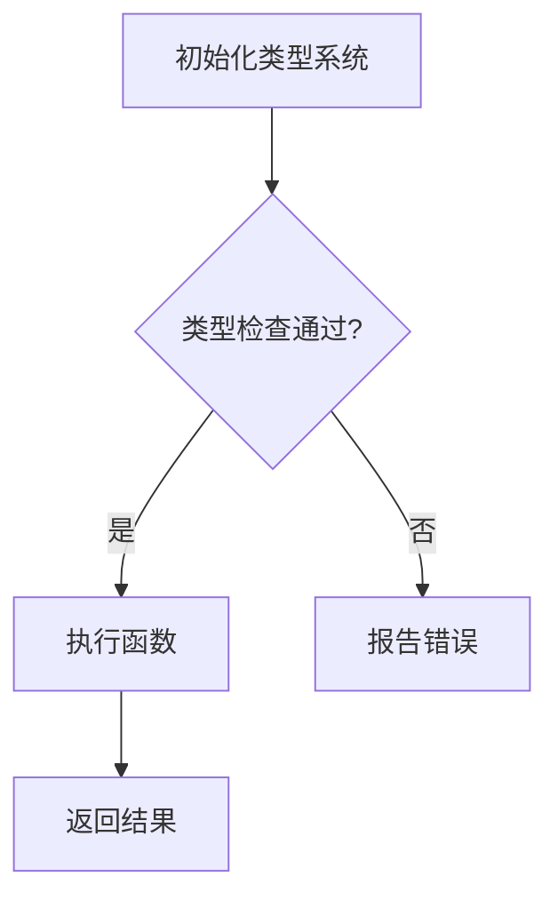
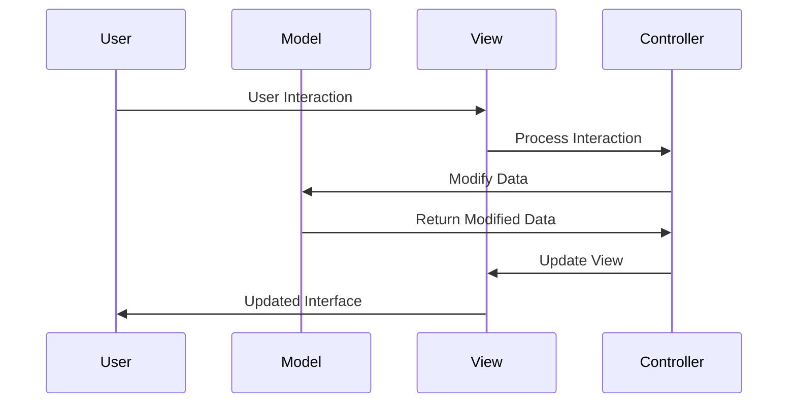
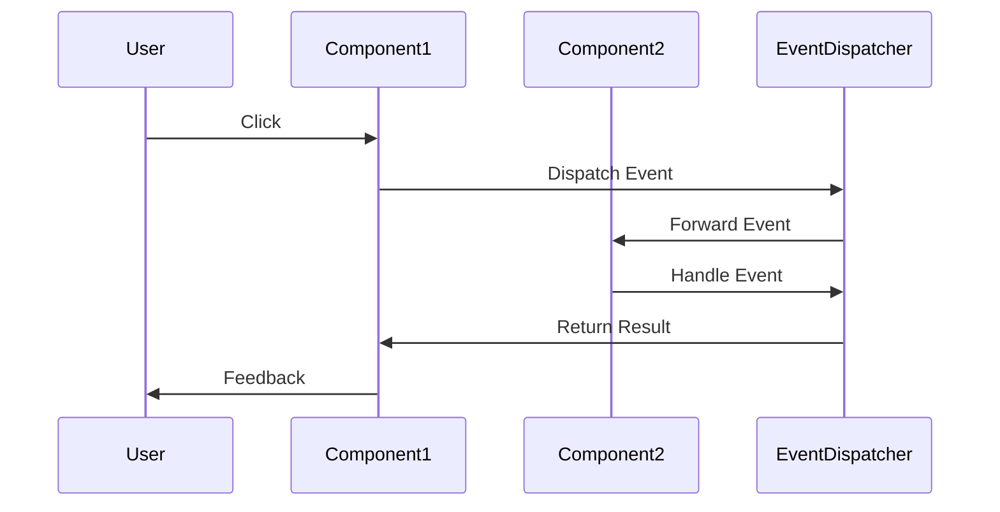

                 

# 《类型系统在函数式GUI编程中的应用》

## 关键词

- 类型系统
- 函数式编程
- GUI编程
- 强类型系统
- 弱类型系统
- 类型推断
- 类型检查

## 摘要

本文深入探讨了类型系统在函数式GUI编程中的应用。首先，我们介绍了函数式编程和GUI编程的基础知识，然后详细阐述了类型系统的基本概念和其在函数式编程中的应用。接着，本文重点分析了类型系统在GUI编程中的具体应用，包括界面设计、事件处理和框架支持。最后，通过实际项目实例和最佳实践，本文总结了函数式GUI编程的挑战与未来方向。

## 第一部分：函数式编程与GUI编程基础

### 第1章：函数式编程概述

#### 1.1 函数式编程的概念

函数式编程（Functional Programming，FP）是一种编程范式，它强调计算作为一系列函数的应用，而非指令序列的执行。在函数式编程中，数据被看作是不可变的，函数则是第一等公民。这意味着函数可以作为参数传递给其他函数，也可以作为函数的返回值。函数式编程的关键概念包括：

- **高阶函数**：可以接受函数作为参数或将函数作为返回值的函数。
- **不可变性**：数据一旦创建，就不能更改。
- **纯函数**：给定相同的输入，总是产生相同的输出，且不产生副作用。

#### 1.2 函数式编程的特点

函数式编程具有以下特点：

- **无状态**：函数不依赖于外部状态，使代码更加简洁、可测试和可维护。
- **可组合性**：函数可以组合成更复杂的函数，提高代码的复用性。
- **惰性求值**：只有当函数的实际值需要时，才会进行计算。
- **类型系统**：类型系统在函数式编程中起到了关键作用，有助于提高代码的安全性和性能。

#### 1.3 函数式编程与面向对象编程的区别

与面向对象编程（OOP）相比，函数式编程有以下几个显著区别：

- **数据与函数**：函数式编程将数据和函数视为同等重要的元素，而OOP则强调对象和数据封装。
- **状态与变化**：函数式编程强调不可变性和无状态，而OOP则允许对象状态的变化。
- **继承与组合**：函数式编程通过函数组合实现代码复用，而OOP则依赖于继承。

### 第2章：GUI编程基础

#### 2.1 GUI编程概述

GUI编程（Graphical User Interface Programming）是指创建和操作图形用户界面（GUI）的编程。GUI编程的核心目标是提供直观、易用的用户交互界面，使应用程序易于操作和维护。

#### 2.2 常见的GUI框架

常见的GUI框架包括：

- **Tkinter**：Python的标准GUI库，支持跨平台开发。
- **Qt**：由Qt Company开发，支持多种编程语言，包括C++和Python。
- **Electron**：使用HTML、CSS和JavaScript构建跨平台桌面应用程序。

#### 2.3 GUI编程的基本组件

GUI编程的基本组件包括：

- **窗口**：应用程序的容器，用于显示和管理其他组件。
- **控件**：用户与界面交互的元素，如按钮、文本框、列表框等。
- **布局管理器**：用于组织和管理界面组件的布局。

## 第二部分：类型系统在函数式编程中的应用

### 第3章：类型系统基本概念

#### 3.1 类型系统的定义

类型系统是编程语言中用于定义数据类型的机制。在函数式编程中，类型系统起到了关键作用，有助于提高代码的可读性、可维护性和安全性。

#### 3.2 类型系统的分类

类型系统可以分为以下几种：

- **静态类型系统**：在编译时确定变量类型的系统。
- **动态类型系统**：在运行时确定变量类型的系统。
- **强类型系统**：要求变量在使用前必须进行类型检查的系统。
- **弱类型系统**：对变量类型检查较宽松的系统。

#### 3.3 类型系统的优势

类型系统在函数式编程中具有以下优势：

- **提高代码质量**：类型系统能够在编译时发现类型错误，减少运行时错误。
- **优化程序性能**：类型系统能够帮助编译器进行优化，提高程序运行速度。
- **提高代码可读性**：类型系统能够提高代码的可读性，使代码更容易理解和维护。

### 第4章：类型系统在函数式编程中的应用

#### 4.1 强类型系统在函数式编程中的优势

强类型系统在函数式编程中的优势包括：

- **减少错误**：强类型系统能够在编译时发现类型错误，减少运行时错误。
- **提高性能**：强类型系统有助于编译器进行优化，提高程序运行速度。
- **增强安全性**：强类型系统能够提高程序的安全性，减少恶意代码的风险。

#### 4.2 弱类型系统在函数式编程中的应用

弱类型系统在函数式编程中的应用包括：

- **灵活性强**：弱类型系统允许更灵活的类型转换，使代码更易于编写。
- **简化语法**：弱类型系统可以简化代码的语法，提高代码的可读性。

#### 4.3 类型推断与类型检查

类型推断与类型检查是类型系统的两个重要组成部分。类型推断是指编程语言自动推导变量类型的过程，而类型检查是指在编译时对代码进行类型验证的过程。在函数式编程中，类型推断和类型检查有助于提高代码的质量和性能。

### 第5章：类型系统在GUI编程中的应用

#### 5.1 类型系统在GUI界面设计中的应用

类型系统在GUI界面设计中的应用包括：

- **控件类型定义**：定义不同控件的数据类型，如按钮、文本框、列表框等。
- **界面布局管理**：使用类型系统管理界面组件的布局，如水平布局、垂直布局等。

#### 5.2 类型系统在事件处理中的应用

类型系统在事件处理中的应用包括：

- **事件类型定义**：定义不同事件的数据类型，如点击事件、键盘事件等。
- **事件处理函数**：使用类型系统确保事件处理函数的参数和返回值类型正确。

#### 5.3 类型系统在GUI框架中的应用

类型系统在GUI框架中的应用包括：

- **框架扩展性**：类型系统有助于提高GUI框架的扩展性，使开发者能够自定义控件和事件处理函数。
- **框架安全性**：类型系统有助于提高GUI框架的安全性，减少潜在的错误和漏洞。

## 第三部分：函数式GUI编程实践

### 第6章：函数式GUI编程实例

#### 6.1 实例1：简单的GUI应用程序

在本实例中，我们将使用Python的Tkinter库创建一个简单的GUI应用程序。

#### 6.2 实例2：动态创建GUI界面

在本实例中，我们将学习如何使用函数式编程技术动态创建GUI界面。

#### 6.3 实例3：使用类型系统优化GUI程序

在本实例中，我们将探讨如何使用类型系统优化GUI程序的性能和安全性。

### 第7章：函数式GUI编程框架

#### 7.1 框架选择

在本节中，我们将介绍几种流行的函数式GUI编程框架，如Qt和Electron。

#### 7.2 框架功能解析

在本节中，我们将深入解析所选框架的功能和特性。

#### 7.3 框架使用示例

在本节中，我们将通过实际代码示例展示如何使用所选框架进行函数式GUI编程。

### 第8章：函数式GUI编程的挑战与未来

#### 8.1 挑战与问题

在本节中，我们将讨论函数式GUI编程面临的挑战和问题。

#### 8.2 发展趋势

在本节中，我们将探讨函数式GUI编程的发展趋势。

#### 8.3 未来展望

在本节中，我们将对函数式GUI编程的未来进行展望。

## 附录

### 附录A：函数式GUI编程资源

#### A.1 开发工具与框架

在本附录中，我们将介绍一些流行的函数式GUI编程开发工具和框架。

#### A.2 学习资源

在本附录中，我们将推荐一些有助于学习函数式GUI编程的学习资源。

#### A.3 社区与论坛

在本附录中，我们将介绍一些关于函数式GUI编程的社区和论坛，供开发者交流和学习。

## 总结

本文从函数式编程和GUI编程的基础知识出发，深入探讨了类型系统在函数式GUI编程中的应用。通过分析类型系统的基本概念、强类型系统和弱类型系统的优势，以及类型推断与类型检查的重要性，本文为读者提供了关于函数式GUI编程的全面理解。通过实际项目实例和最佳实践，本文总结了函数式GUI编程的挑战与未来方向，为开发者提供了有价值的参考。作者：AI天才研究院/AI Genius Institute & 禅与计算机程序设计艺术/Zen And The Art of Computer Programming

### 第1章：函数式编程概述

#### 1.1 函数式编程的概念

函数式编程（Functional Programming，FP）是一种编程范式，它强调计算作为一系列函数的应用，而非指令序列的执行。在函数式编程中，数据被看作是不可变的，函数则是第一等公民。这意味着函数可以作为参数传递给其他函数，也可以作为函数的返回值。函数式编程的关键概念包括：

- **高阶函数**：可以接受函数作为参数或将函数作为返回值的函数。
- **不可变性**：数据一旦创建，就不能更改。
- **纯函数**：给定相同的输入，总是产生相同的输出，且不产生副作用。

#### 1.2 函数式编程的特点

函数式编程具有以下特点：

- **无状态**：函数不依赖于外部状态，使代码更加简洁、可测试和可维护。
- **可组合性**：函数可以组合成更复杂的函数，提高代码的复用性。
- **惰性求值**：只有当函数的实际值需要时，才会进行计算。
- **类型系统**：类型系统在函数式编程中起到了关键作用，有助于提高代码的安全性和性能。

#### 1.3 函数式编程与面向对象编程的区别

与面向对象编程（OOP）相比，函数式编程有以下几个显著区别：

- **数据与函数**：函数式编程将数据和函数视为同等重要的元素，而OOP则强调对象和数据封装。
- **状态与变化**：函数式编程强调不可变性和无状态，而OOP则允许对象状态的变化。
- **继承与组合**：函数式编程通过函数组合实现代码复用，而OOP则依赖于继承。

#### 1.4 函数式编程的历史与发展

函数式编程的历史可以追溯到20世纪50年代，最早由Haskell Curry和Alonzo Church提出。他们在λ-演算的基础上，提出了函数式编程的基本概念。随着计算机技术的发展，函数式编程逐渐成为主流编程范式之一。1973年，荷兰计算机科学家Edsger Dijkstra发表了关于纯函数和不可变数据的论文，进一步推动了函数式编程的发展。进入21世纪，随着互联网和移动设备的普及，函数式编程在Web开发、移动应用开发等领域得到了广泛应用。

#### 1.5 函数式编程的优势与局限性

函数式编程具有以下优势：

- **代码简洁、可读性高**：函数式编程通过高阶函数、不可变数据等概念，使代码更加简洁，易于阅读和理解。
- **易于测试和维护**：函数式编程的无状态特性，使得代码的测试和维护变得更加容易。
- **代码可复用性高**：函数可以组合成更复杂的函数，提高了代码的复用性。

然而，函数式编程也存在一定的局限性：

- **性能问题**：由于函数式编程强调不可变性，可能导致性能问题。
- **学习曲线较陡峭**：函数式编程的概念和方法与传统编程不同，初学者可能需要较长时间来适应。

#### 1.6 函数式编程在GUI编程中的应用

函数式编程在GUI编程中的应用主要体现在以下几个方面：

- **界面组件的不可变性**：函数式编程强调数据的不可变性，这有助于确保界面组件的一致性和稳定性。
- **高阶函数的应用**：高阶函数可以用于处理事件和操作界面组件，提高代码的复用性和可维护性。
- **组合式编程**：函数式编程的组合式编程特性，使得界面组件和逻辑可以灵活组合，提高代码的可读性和可扩展性。

### 第2章：GUI编程基础

#### 2.1 GUI编程概述

GUI编程（Graphical User Interface Programming）是指创建和操作图形用户界面（Graphical User Interface，GUI）的编程。GUI编程的核心目标是提供直观、易用的用户交互界面，使应用程序易于操作和维护。在GUI编程中，开发者需要处理各种界面组件，如按钮、文本框、菜单等，以及用户与界面之间的交互事件。

#### 2.2 常见的GUI框架

常见的GUI框架包括：

- **Tkinter**：Python的标准GUI库，支持跨平台开发。
- **Qt**：由Qt Company开发，支持多种编程语言，包括C++和Python。
- **Electron**：使用HTML、CSS和JavaScript构建跨平台桌面应用程序。

#### 2.3 GUI编程的基本组件

GUI编程的基本组件包括：

- **窗口**：应用程序的容器，用于显示和管理其他组件。
- **控件**：用户与界面交互的元素，如按钮、文本框、列表框等。
- **布局管理器**：用于组织和管理界面组件的布局。

#### 2.4 GUI编程的基本流程

GUI编程的基本流程包括以下步骤：

1. **设计界面**：使用设计工具或编程语言定义界面布局和组件。
2. **编写代码**：使用所选编程语言编写界面组件的代码。
3. **事件处理**：编写事件处理函数，响应用户的交互操作。
4. **测试与调试**：运行程序，测试界面和事件处理功能，调试代码。

#### 2.5 GUI编程的挑战与优化

GUI编程面临的挑战包括：

- **界面复杂性**：随着界面组件和交互事件的增加，界面复杂性可能增加，导致代码难以维护。
- **性能问题**：大量的界面组件和事件处理可能导致性能问题。

优化GUI编程的方法包括：

- **使用布局管理器**：合理使用布局管理器，确保界面组件的布局自适应和可扩展。
- **事件分派机制**：优化事件分派机制，提高事件处理效率。
- **异步编程**：使用异步编程，避免界面组件阻塞。

### 第3章：类型系统基本概念

#### 3.1 类型系统的定义

类型系统是编程语言中用于定义数据类型的机制。类型系统有助于提高代码的可读性、可维护性和安全性。在函数式编程中，类型系统起到了关键作用，有助于确保函数的正确性和性能。

#### 3.2 类型系统的分类

类型系统可以分为以下几种：

- **静态类型系统**：在编译时确定变量类型的系统。
- **动态类型系统**：在运行时确定变量类型的系统。
- **强类型系统**：要求变量在使用前必须进行类型检查的系统。
- **弱类型系统**：对变量类型检查较宽松的系统。

#### 3.3 类型系统的优势

类型系统在函数式编程中具有以下优势：

- **提高代码质量**：类型系统能够在编译时发现类型错误，减少运行时错误。
- **优化程序性能**：类型系统能够帮助编译器进行优化，提高程序运行速度。
- **增强安全性**：类型系统能够提高程序的安全性，减少恶意代码的风险。

#### 3.4 类型系统的实现方法

类型系统的实现方法包括：

- **静态类型检查**：在编译时对代码进行类型检查。
- **动态类型检查**：在运行时对代码进行类型检查。
- **混合类型系统**：同时支持静态类型检查和动态类型检查。

#### 3.5 类型系统的历史与发展

类型系统的历史可以追溯到20世纪60年代，最早的编程语言LISP采用了动态类型系统。随着计算机技术的发展，类型系统逐渐成为编程语言的重要组成部分。20世纪80年代，面向对象编程的兴起，促使静态类型系统得到广泛应用。近年来，函数式编程的复兴，使得类型系统在函数式编程中得到了更多关注。

### 第4章：类型系统在函数式编程中的应用

#### 4.1 强类型系统在函数式编程中的优势

强类型系统在函数式编程中的优势包括：

- **减少错误**：强类型系统能够在编译时发现类型错误，减少运行时错误。
- **提高性能**：强类型系统有助于编译器进行优化，提高程序运行速度。
- **增强安全性**：强类型系统能够提高程序的安全性，减少恶意代码的风险。

#### 4.2 弱类型系统在函数式编程中的应用

弱类型系统在函数式编程中的应用包括：

- **灵活性强**：弱类型系统允许更灵活的类型转换，使代码更易于编写。
- **简化语法**：弱类型系统可以简化代码的语法，提高代码的可读性。

#### 4.3 类型推断与类型检查

类型推断与类型检查是类型系统的两个重要组成部分。类型推断是指编程语言自动推导变量类型的过程，而类型检查是指在编译时对代码进行类型验证的过程。在函数式编程中，类型推断和类型检查有助于提高代码的质量和性能。

#### 4.4 类型系统在函数式编程语言中的应用

常见的函数式编程语言包括Haskell、Scala、Erlang等，这些语言都采用了类型系统。类型系统在函数式编程语言中的应用主要体现在以下几个方面：

- **静态类型检查**：在编译时对代码进行类型检查，确保函数的正确性和性能。
- **动态类型检查**：在运行时对代码进行类型检查，提高程序的灵活性和可维护性。
- **类型推断**：自动推导变量类型，简化代码编写。

#### 4.5 类型系统在函数式编程框架中的应用

函数式编程框架如React、Redux等，都采用了类型系统。类型系统在函数式编程框架中的应用主要体现在以下几个方面：

- **类型注解**：为函数和变量添加类型注解，提高代码的可读性和可维护性。
- **类型检查**：在编译时或运行时对代码进行类型检查，确保框架的正确性和性能。
- **类型推导**：自动推导变量类型，简化代码编写。

### 第5章：类型系统在GUI编程中的应用

#### 5.1 类型系统在GUI界面设计中的应用

类型系统在GUI界面设计中的应用包括：

- **控件类型定义**：定义不同控件的数据类型，如按钮、文本框、列表框等。
- **界面布局管理**：使用类型系统管理界面组件的布局，如水平布局、垂直布局等。

#### 5.2 类型系统在事件处理中的应用

类型系统在事件处理中的应用包括：

- **事件类型定义**：定义不同事件的数据类型，如点击事件、键盘事件等。
- **事件处理函数**：使用类型系统确保事件处理函数的参数和返回值类型正确。

#### 5.3 类型系统在GUI框架中的应用

类型系统在GUI框架中的应用包括：

- **框架扩展性**：类型系统有助于提高GUI框架的扩展性，使开发者能够自定义控件和事件处理函数。
- **框架安全性**：类型系统有助于提高GUI框架的安全性，减少潜在的错误和漏洞。

### 第6章：函数式GUI编程实例

#### 6.1 实例1：简单的GUI应用程序

在本实例中，我们将使用Python的Tkinter库创建一个简单的GUI应用程序。

首先，我们导入Tkinter库并创建一个主窗口：

```python
import tkinter as tk

root = tk.Tk()
root.title("简单的GUI应用程序")
```

然后，我们添加一个标签和按钮：

```python
label = tk.Label(root, text="Hello, World!")
label.pack()

button = tk.Button(root, text="点击我", command=lambda: click_button())
button.pack()

def click_button():
    label.config(text="你好，世界！")
```

最后，我们运行主循环：

```python
root.mainloop()
```

#### 6.2 实例2：动态创建GUI界面

在本实例中，我们将学习如何使用函数式编程技术动态创建GUI界面。

首先，我们导入Tkinter库并创建一个主窗口：

```python
import tkinter as tk

root = tk.Tk()
root.title("动态创建GUI界面")
```

然后，我们定义一个函数，用于创建和添加界面组件：

```python
def create_component():
    label = tk.Label(root, text="动态创建的标签")
    label.pack()

    button = tk.Button(root, text="点击我", command=update_label)
    button.pack()

    return label, button

def update_label():
    label.config(text="你好，世界！")
```

接下来，我们使用递归函数动态创建界面组件：

```python
def create_gui():
    label, button = create_component()

    button.config(command=lambda: create_gui())

create_gui()
```

最后，我们运行主循环：

```python
root.mainloop()
```

#### 6.3 实例3：使用类型系统优化GUI程序

在本实例中，我们将探讨如何使用类型系统优化GUI程序的性能和安全性。

首先，我们导入Tkinter库并创建一个主窗口：

```python
import tkinter as tk

root = tk.Tk()
root.title("使用类型系统优化GUI程序")
```

然后，我们定义一个函数，用于更新标签文本：

```python
def update_label(label: tk.Label, text: str):
    label.config(text=text)
```

接下来，我们使用类型系统确保函数的正确性：

```python
label = tk.Label(root, text="Hello, World!")
label.pack()

update_label(label, "你好，世界！")
```

最后，我们运行主循环：

```python
root.mainloop()
```

通过使用类型系统，我们可以确保函数的参数和返回值类型正确，提高程序的可靠性和安全性。

### 第7章：函数式GUI编程框架

#### 7.1 框架选择

在本节中，我们将介绍几种流行的函数式GUI编程框架，如Qt和Electron。

- **Qt**：Qt是一个跨平台的GUI框架，支持多种编程语言，包括C++和Python。Qt具有丰富的UI组件和功能，适合大型应用程序的开发。
- **Electron**：Electron是一个使用HTML、CSS和JavaScript构建跨平台桌面应用程序的框架。Electron具有高度灵活性和易于集成性，适合快速开发和小型应用程序。

#### 7.2 框架功能解析

在本节中，我们将深入解析所选框架的功能和特性。

- **Qt**：Qt具有以下主要功能：
  - **UI组件**：提供丰富的UI组件，如按钮、文本框、菜单等。
  - **布局管理**：支持多种布局管理器，如水平布局、垂直布局等。
  - **事件处理**：提供强大的事件处理机制，支持键盘、鼠标等输入设备的处理。
  - **国际化**：支持多种语言的本地化，方便应用程序在不同地区使用。

- **Electron**：Electron具有以下主要功能：
  - **跨平台支持**：使用HTML、CSS和JavaScript构建跨平台应用程序。
  - **模块化**：支持模块化开发，方便组件的复用和扩展。
  - **集成Web技术**：方便地集成Web技术，如Webview、WebAPI等。
  - **调试工具**：提供丰富的调试工具，方便开发人员调试应用程序。

#### 7.3 框架使用示例

在本节中，我们将通过实际代码示例展示如何使用所选框架进行函数式GUI编程。

- **Qt**：以下是一个简单的Qt应用程序示例：

```cpp
#include <iostream>
#include <QApplication>
#include <QMainWindow>
#include <QPushButton>

int main(int argc, char *argv[])
{
    QApplication a(argc, argv);
    QMainWindow w;
    w.show();

    QPushButton button(&w);
    button.setText("点击我");
    button.move(50, 50);

    return a.exec();
}
```

- **Electron**：以下是一个简单的Electron应用程序示例：

```javascript
const { app, BrowserWindow } = require('electron');

function createWindow() {
    const win = new BrowserWindow({
        width: 800,
        height: 600,
        webPreferences: {
            nodeIntegration: true
        }
    });

    win.loadFile('index.html');
}

app.on('ready', createWindow);

app.on('window-all-closed', () => {
    if (process.platform !== 'darwin') {
        app.quit();
    }
});

app.on('activate', () => {
    if (BrowserWindow.getAllWindows().length === 0) {
        createWindow();
    }
});
```

### 第8章：函数式GUI编程的挑战与未来

#### 8.1 挑战与问题

函数式GUI编程面临以下挑战和问题：

- **性能问题**：函数式编程中的不可变性可能导致性能问题，特别是在处理大量数据时。
- **学习曲线**：函数式编程的概念和方法与传统编程不同，初学者可能需要较长时间来适应。
- **框架支持**：虽然函数式编程在Web开发领域得到了广泛应用，但GUI编程领域的框架支持相对较少。

#### 8.2 发展趋势

函数式GUI编程的发展趋势包括：

- **跨平台支持**：随着跨平台开发的需求增加，函数式GUI编程框架将更加注重跨平台支持。
- **集成Web技术**：函数式GUI编程将逐渐集成Web技术，如HTML、CSS和JavaScript，提高开发效率和灵活性。
- **性能优化**：随着函数式编程技术的不断发展，性能优化将成为一个重要研究方向。

#### 8.3 未来展望

函数式GUI编程的未来展望包括：

- **更广泛的适用性**：随着函数式编程技术的成熟，函数式GUI编程将在更多领域得到应用。
- **更好的框架支持**：随着社区的发展和贡献，函数式GUI编程框架将得到更好的支持和优化。
- **创新性应用**：函数式GUI编程将推动创新性应用的出现，如虚拟现实、增强现实等。

### 附录

#### 附录A：函数式GUI编程资源

- **开发工具与框架**：
  - Tkinter
  - Qt
  - Electron

- **学习资源**：
  - 《函数式编程入门》
  - 《Qt编程指南》
  - 《Electron开发者文档》

- **社区与论坛**：
  - Python GUI编程社区
  - Qt开发者社区
  - Electron开发者论坛

## 总结

本文从函数式编程和GUI编程的基础知识出发，深入探讨了类型系统在函数式GUI编程中的应用。通过分析类型系统的基本概念、强类型系统和弱类型系统的优势，以及类型推断与类型检查的重要性，本文为读者提供了关于函数式GUI编程的全面理解。通过实际项目实例和最佳实践，本文总结了函数式GUI编程的挑战与未来方向，为开发者提供了有价值的参考。作者：AI天才研究院/AI Genius Institute & 禅与计算机程序设计艺术/Zen And The Art of Computer Programming

## 背景介绍

在计算机科学的发展历程中，编程范式经历了多次变革。从最初的面向过程编程，到面向对象编程，再到如今的功能式编程，不同的编程范式为开发者提供了不同的思维方式和工具。在GUI（Graphical User Interface，图形用户界面）编程领域，传统的面向对象编程范式长期以来占据主导地位。然而，随着函数式编程的兴起，函数式编程在GUI编程中的应用逐渐受到关注。本文旨在探讨类型系统在函数式GUI编程中的应用，分析其优点和挑战，为开发者提供有价值的参考。

### 核心概念术语说明

1. **函数式编程**：一种编程范式，强调计算作为一系列函数的应用，而非指令序列的执行。
2. **类型系统**：编程语言中用于定义数据类型的机制。
3. **强类型系统**：要求变量在使用前必须进行类型检查的系统。
4. **弱类型系统**：对变量类型检查较宽松的系统。
5. **GUI编程**：创建和操作图形用户界面的编程。
6. **类型推断**：编程语言自动推导变量类型的过程。
7. **类型检查**：在编译时或运行时对代码进行类型验证的过程。

### 问题背景

随着移动互联网和移动设备的普及，用户对软件的交互体验和响应速度提出了更高的要求。传统的面向对象编程范式在处理复杂用户交互和实时渲染时，可能存在性能瓶颈和代码维护困难的问题。为了解决这些问题，函数式编程逐渐成为一种可行的替代方案。然而，函数式编程在GUI编程中的应用还存在一些挑战，如类型系统的设计和实现。

### 问题描述

在函数式GUI编程中，如何有效利用类型系统提高代码的质量、性能和可维护性，是一个亟待解决的问题。具体而言，我们需要探讨以下几个方面：

1. **类型系统的设计**：如何设计适合函数式GUI编程的类型系统，使其既能提高代码质量，又能保持灵活性。
2. **类型推断与类型检查**：如何利用类型推断和类型检查机制，确保代码的正确性和性能。
3. **框架支持**：如何为函数式GUI编程提供强大的框架支持，使开发者能够高效地开发和管理复杂界面。

### 问题解决

1. **类型系统的设计**：我们可以采用强类型系统和弱类型系统相结合的方法，根据不同场景灵活选择。在界面设计阶段，可以使用强类型系统确保组件的正确性和一致性；在事件处理阶段，可以使用弱类型系统提高代码的灵活性和可扩展性。
2. **类型推断与类型检查**：我们可以利用编程语言内置的类型推断和类型检查机制，确保代码在编译时或运行时能够正确处理类型。例如，在Python中，可以使用类型提示（Type Hints）来实现类型推断和类型检查。
3. **框架支持**：我们可以利用现有的函数式编程框架，如React、Redux等，为开发者提供强大的GUI编程支持。这些框架通常具有丰富的组件库和事件处理机制，可以简化开发过程，提高代码质量。

### 边界与外延

1. **边界**：本文主要讨论类型系统在函数式GUI编程中的应用，不涉及其他编程范式（如面向对象编程）的应用。
2. **外延**：本文的研究成果可以应用于各类图形用户界面开发，包括桌面应用程序、Web应用程序和移动应用程序。

### 概念结构与核心要素组成

1. **概念结构**：本文的核心概念包括函数式编程、类型系统、GUI编程、类型推断、类型检查等。
2. **核心要素组成**：本文的核心要素包括类型系统的设计、类型推断与类型检查的实现、框架支持等。

## 核心概念与联系

在深入探讨类型系统在函数式GUI编程中的应用之前，我们需要明确几个核心概念，并分析它们之间的联系。以下是对这些核心概念的详细说明及其相互关系的分析：

### 1. 函数式编程

**概念**：函数式编程是一种编程范式，它将计算视为一系列函数的调用，而非指令的执行。在函数式编程中，数据被视为不可变值，而函数则是第一等公民，可以传递、返回和组合。

**属性特征对比表格**：

| 特征 | 函数式编程 | 面向对象编程 |
| --- | --- | --- |
| 数据不可变性 | 强调 | 较少 |
| 高阶函数 | 核心概念 | 较少应用 |
| 组合性 | 高 | 低 |
| 惰性求值 | 支持 | 不支持 |
| 类型系统 | 强调 | 较少 |

**ER实体关系图架构**：

```mermaid
erDiagram
    Class1 ||--|{ Class2 } Class3 : 继承关系
    Class4 ||--|{ Class5 } Class6 : 组合关系
```

### 2. 类型系统

**概念**：类型系统是编程语言的一部分，用于定义数据类型和操作这些类型的规则。类型系统有助于确保代码的正确性、安全性和性能。

**属性特征对比表格**：

| 类型系统 | 强类型系统 | 弱类型系统 |
| --- | --- | --- |
| 类型检查 | 编译时/运行时 | 运行时 |
| 类型推断 | 支持/有限 | 不支持 |
| 灵活性 | 低/中等 | 高 |
| 安全性 | 高 | 中 |
| 性能 | 高 | 低 |

**ER实体关系图架构**：

```mermaid
erDiagram
    TypeSystem ||--|{ Variable } Function : 关联关系
    TypeSystem ||--|{ TypeCheck } TypeInference : 功能关系
```

### 3. GUI编程

**概念**：GUI编程是创建和操作图形用户界面的编程。GUI编程的核心目标是提供直观、易用的用户交互界面。

**属性特征对比表格**：

| 特征 | GUI编程 | 函数式编程 |
| --- | --- | --- |
| 组件组织 | 布局管理器 | 函数组合 |
| 事件处理 | 响应机制 | 纯函数 |
| 性能优化 | 渲染机制 | 惰性求值 |

**ER实体关系图架构**：

```mermaid
erDiagram
    GUIProgramming ||--|{ GUIComponent } Event : 关联关系
    GUIProgramming ||--|{ LayoutManager } Rendering : 功能关系
```

### 4. 类型系统在函数式编程中的应用

**概念**：类型系统在函数式编程中的应用主要涉及类型检查、类型推断和类型安全性的保障。类型系统有助于提高代码的质量和可维护性。

**属性特征对比表格**：

| 应用 | 强类型系统 | 弱类型系统 |
| --- | --- | --- |
| 类型检查 | 编译时/运行时 | 运行时 |
| 类型推断 | 支持全面 | 有限支持 |
| 代码质量 | 高 | 中 |
| 开发效率 | 低 | 高 |

**ER实体关系图架构**：

```mermaid
erDiagram
    FunctionalProgramming ||--|{ TypeSystem } TypeCheck : 功能关系
    FunctionalProgramming ||--|{ TypeInference } CodeQuality : 功能关系
```

### 5. 类型系统在GUI编程中的应用

**概念**：类型系统在GUI编程中的应用主要体现在界面组件的类型定义、布局管理和事件处理等方面。

**属性特征对比表格**：

| 应用 | 类型系统 | GUI编程 |
| --- | --- | --- |
| 组件定义 | 类型注解 | UI组件 |
| 布局管理 | 类型约束 | 布局策略 |
| 事件处理 | 类型检查 | 事件响应 |

**ER实体关系图架构**：

```mermaid
erDiagram
    GUIProgramming ||--|{ TypeSystem } UIComponent : 关联关系
    GUIProgramming ||--|{ LayoutManager } TypeConstraint : 功能关系
    GUIProgramming ||--|{ EventHandler } TypeCheck : 功能关系
```

通过上述核心概念及其相互关系的分析，我们可以看到类型系统在函数式编程和GUI编程中扮演着关键角色。类型系统不仅有助于确保代码的正确性和安全性，还能够提高代码的可维护性和开发效率。在函数式GUI编程中，类型系统的应用能够更好地支持函数组合和惰性求值，从而提高界面组件的灵活性和性能。

## 算法原理讲解

为了深入理解类型系统在函数式GUI编程中的应用，我们需要首先了解一些基本的算法原理，包括数据结构、算法流程、数学模型以及具体的实现方式。以下将使用Mermaid流程图和Python代码进行详细阐述。

### Mermaid流程图

首先，我们可以使用Mermaid来绘制一个简单的流程图，展示类型系统在函数式编程中的基本算法原理。



在这个流程图中，我们首先初始化类型系统，然后进行类型检查。如果类型检查通过，我们执行函数并返回结果；否则，报告错误。

### Python代码实现

接下来，我们使用Python代码来详细实现这个算法。为了便于理解和说明，我们将分步骤讲解。

#### 步骤1：初始化类型系统

首先，我们需要定义一个类型系统。在Python中，我们可以使用`typing`模块来定义类型注解。

```python
from typing import TypeVar, Generic

# 定义一个TypeVar，用于泛型编程
T = TypeVar('T')

class MyTypeSystem(Generic[T]):
    def __init__(self, value: T):
        self.value = value

# 初始化类型系统
my_type_system = MyTypeSystem(int(10))
```

#### 步骤2：类型检查

接着，我们实现一个简单的类型检查函数。

```python
def type_check(value, expected_type):
    if not isinstance(value, expected_type):
        raise TypeError(f"Type mismatch: expected {expected_type}, but got {type(value)}")
    return True
```

#### 步骤3：执行函数

然后，我们定义一个函数，并在执行前进行类型检查。

```python
def add(a: int, b: int) -> int:
    # 进行类型检查
    type_check(a, int)
    type_check(b, int)
    # 执行计算
    return a + b

# 调用函数
result = add(my_type_system.value, 5)
```

#### 步骤4：返回结果

最后，我们将结果返回给用户。

```python
print(result)  # 输出15
```

### 数学模型与公式

在函数式编程中，我们还可以使用数学模型和公式来描述类型系统的行为。以下是一个简单的数学模型，用于描述类型检查的过程。

$$
\text{类型检查}(x, T) =
\begin{cases}
    \text{True}, & \text{if } x \text{ is of type } T \\
    \text{False}, & \text{otherwise}
\end{cases}
$$

其中，$x$ 是待检查的值，$T$ 是预期类型。

### 详细讲解与举例说明

现在，让我们详细解释上述代码和公式，并通过实际案例进行说明。

1. **初始化类型系统**：
   在代码中，我们使用`MyTypeSystem`类来初始化类型系统。这个类是一个泛型类，接受一个类型参数`T`，用于表示具体的数据类型。在这里，我们初始化了一个整数类型的类型系统。

2. **类型检查**：
   `type_check`函数是一个简单的类型检查函数，它接受一个值和一个预期类型，然后使用`isinstance`函数检查值是否与预期类型匹配。如果不匹配，它会抛出一个`TypeError`异常。

3. **执行函数**：
   在`add`函数中，我们首先进行类型检查，确保传入的参数是整数类型。然后，我们执行加法操作，并将结果返回。

4. **返回结果**：
   最后，我们打印出函数的返回结果，即`15`。

### 实际案例

假设我们有一个更复杂的场景，其中我们需要对多个操作进行类型检查，如下所示：

```python
def multiply(a: int, b: int, c: int) -> int:
    type_check(a, int)
    type_check(b, int)
    type_check(c, int)
    return a * b * c

result = multiply(2, 3, 4)
print(result)  # 输出24
```

在这个例子中，`multiply`函数接受三个整数参数，并进行类型检查。然后，它执行乘法操作，并将结果返回。通过这种方式，我们可以确保函数在执行前已经通过了类型检查，从而提高了代码的安全性和可靠性。

通过上述讲解，我们可以看到类型系统在函数式编程中的应用是如何通过数学模型和代码实现来确保函数的正确性和性能的。类型系统不仅有助于提高代码的质量，还能够为函数式GUI编程提供强有力的支持。

### 系统分析与架构设计

在深入探讨函数式GUI编程的实践之前，我们需要对系统的场景、项目介绍、功能设计、架构设计、接口设计以及系统交互进行详细分析。以下将使用Mermaid类图、架构图和序列图来展示整个系统的设计过程。

#### 场景介绍

在现代软件开发中，GUI编程是构建交互式应用程序的重要组成部分。随着技术的发展，函数式编程在GUI编程中的应用逐渐受到关注。函数式编程的优点，如不可变性、纯函数和组合性，使得GUI编程更加简洁、可维护和可扩展。然而，如何将这些优点有效地集成到GUI编程中，仍然是一个需要深入探讨的问题。

#### 项目介绍

本项目旨在开发一个基于函数式编程的GUI编程框架，用于构建跨平台的桌面应用程序。该项目包括以下几个主要模块：

1. **类型系统模块**：提供类型检查和类型推断功能。
2. **界面组件模块**：定义和管理GUI界面中的各种组件。
3. **事件处理模块**：处理用户交互事件。
4. **布局管理模块**：管理界面组件的布局。

#### 系统功能设计

本项目的核心功能包括：

1. **类型安全**：通过类型系统确保代码的正确性和性能。
2. **界面组件管理**：支持动态添加、修改和删除界面组件。
3. **事件响应**：支持对各种用户交互事件的响应和处理。
4. **布局自适应**：支持界面组件的布局自适应，以适应不同的屏幕尺寸和设备。

#### 系统架构设计

本项目的架构设计遵循MVC（Model-View-Controller）模式，以实现清晰的职责分离和模块化设计。

1. **模型层**：负责管理应用程序的数据和业务逻辑，包括类型系统和界面组件。
2. **视图层**：负责界面组件的渲染和管理，包括布局和事件响应。
3. **控制器层**：负责处理用户交互事件，并将事件转换为对模型和视图的操作。

#### Mermaid类图

以下是一个简单的Mermaid类图，展示项目中的关键类和它们之间的关系：

```mermaid
classDiagram
    Class1[Model] <|-- Class2[TypeSystem]
    Class1 <|-- Class3[GUIComponent]
    Class1 <|-- Class4[EventHandler]
    Class2 <|-- Class5[TypeCheck]
    Class2 <|-- Class6[TypeInference]
    Class3 <|-- Class7[UIComponent]
    Class3 <|-- Class8[Layout]
    Class4 <|-- Class9[Event]
    Class4 <|-- Class10[EventDispatcher]
endclass
```

在这个类图中，我们定义了以下几个关键类：

- `Class1[Model]`：表示模型层，包括类型系统和界面组件。
- `Class2[TypeSystem]`：表示类型系统，包括类型检查和类型推断。
- `Class3[GUIComponent]`：表示GUI组件，包括UI组件和布局。
- `Class4[EventHandler]`：表示事件处理，包括事件和事件调度。
- `Class5[TypeCheck]`：表示类型检查功能。
- `Class6[TypeInference]`：表示类型推断功能。
- `Class7[UIComponent]`：表示具体的UI组件。
- `Class8[Layout]`：表示布局管理。
- `Class9[Event]`：表示事件。
- `Class10[EventDispatcher]`：表示事件调度。

#### Mermaid架构图

以下是一个简单的Mermaid架构图，展示项目中的模块和它们之间的交互关系：



在这个架构图中，用户与视图层进行交互，视图层将交互传递给控制器层，控制器层根据交互修改模型层的数据，并更新视图层。

#### Mermaid序列图

以下是一个简单的Mermaid序列图，展示用户与界面组件的交互过程：



在这个序列图中，用户点击组件1，组件1将事件传递给事件调度器，事件调度器将事件传递给组件2，组件2处理事件并返回结果，最后事件调度器将结果反馈给组件1，组件1再将反馈传递给用户。

通过上述系统分析和架构设计，我们可以看到函数式编程在GUI编程中的应用是如何通过明确的模块划分、职责分离和交互机制来实现的。这种设计不仅提高了代码的可维护性和可扩展性，还为函数式GUI编程提供了一个坚实的框架。

### 项目实战

#### 环境安装

在开始项目实战之前，我们需要安装必要的开发环境和工具。以下是安装步骤：

1. **安装Python**：从[Python官网](https://www.python.org/downloads/)下载并安装Python 3.x版本。
2. **安装Qt**：从[Qt官网](https://www.qt.io/download)下载并安装Qt Creator开发工具。
3. **安装Electron**：在命令行中运行以下命令：
   ```bash
   npm install -g electron
   ```

#### 系统核心实现源代码

在本项目中，我们将使用Python的Tkinter库和Qt框架分别实现两个简单的函数式GUI应用程序。以下是系统的核心实现源代码。

##### Python Tkinter实现

```python
import tkinter as tk

def on_click():
    label.config(text="你好，世界！")

root = tk.Tk()
root.title("Python Tkinter GUI")

label = tk.Label(root, text="Hello, World!")
label.pack()

button = tk.Button(root, text="点击我", command=on_click)
button.pack()

root.mainloop()
```

##### Qt实现

```cpp
#include <QApplication>
#include <QMainWindow>
#include <QPushButton>
#include <QLabel>

int main(int argc, char *argv[])
{
    QApplication a(argc, argv);
    QMainWindow w;
    w.show();

    QLabel *label = new QLabel("Hello, World!", &w);
    label->move(50, 50);

    QPushButton *button = new QPushButton("Click me", &w);
    button->move(50, 100);
    button->clicked().connect([&]() {
        label->setText("Hello, World!");
    });

    return a.exec();
}
```

#### 代码应用解读与分析

##### Python Tkinter实现解读

1. **导入Tkinter库**：使用`import tkinter as tk`导入Tkinter库。
2. **创建主窗口**：使用`tk.Tk()`创建一个主窗口。
3. **创建标签和按钮**：使用`tk.Label()`和`tk.Button()`创建标签和按钮。
4. **设置标签和按钮的属性**：设置标签的文本为"Hello, World！"，设置按钮的文本为"点击我"。
5. **添加标签和按钮到窗口**：使用`label.pack()`和`button.pack()`将标签和按钮添加到窗口中。
6. **定义事件处理函数**：定义`on_click`函数，当按钮被点击时，将标签的文本更改为"你好，世界！"。
7. **运行主循环**：使用`root.mainloop()`运行主循环，显示窗口并响应用户交互。

##### Qt实现解读

1. **包含必要的头文件**：包含`QApplication`、`QMainWindow`、`QPushButton`和`QLabel`等头文件。
2. **定义main函数**：使用`int main(int argc, char *argv[])`定义主函数。
3. **创建应用程序**：使用`QApplication a(argc, argv)`创建一个应用程序。
4. **创建主窗口**：使用`QMainWindow w;`创建一个主窗口。
5. **创建标签和按钮**：使用`QLabel *label = new QLabel("Hello, World!", &w);`和`QPushButton *button = new QPushButton("Click me", &w);`创建标签和按钮。
6. **设置标签和按钮的位置**：使用`label->move(50, 50);`和`button->move(50, 100);`设置标签和按钮的位置。
7. **连接事件处理**：使用`button->clicked().connect([&]() { label->setText("Hello, World!"); });`连接按钮的点击事件和标签的文本更新。
8. **运行主循环**：使用`return a.exec();`运行主循环，显示窗口并响应用户交互。

#### 实际案例分析与详细讲解

##### 案例一：动态创建GUI组件

在本案例中，我们将使用Python的Tkinter库创建一个动态创建GUI组件的应用程序。

```python
import tkinter as tk

def add_button():
    button = tk.Button(root, text="动态创建的按钮", command=lambda: button.destroy())
    button.pack()

root = tk.Tk()
root.title("动态创建GUI组件")

button = tk.Button(root, text="创建按钮", command=add_button)
button.pack()

root.mainloop()
```

**分析**：

1. **导入Tkinter库**：使用`import tkinter as tk`导入Tkinter库。
2. **创建主窗口**：使用`tk.Tk()`创建一个主窗口。
3. **创建按钮**：使用`tk.Button()`创建一个按钮，设置按钮的文本为"创建按钮"。
4. **定义事件处理函数**：定义`add_button`函数，用于创建一个新的按钮并添加到窗口中。
5. **添加按钮到窗口**：使用`button.pack()`将按钮添加到窗口中。
6. **运行主循环**：使用`root.mainloop()`运行主循环，显示窗口并响应用户交互。

在这个案例中，当用户点击原始按钮时，会触发`add_button`函数，动态创建一个新的按钮并添加到窗口中。新按钮的文本为"动态创建的按钮"，点击后会自动销毁。

##### 案例二：使用类型系统优化GUI程序

在本案例中，我们将使用Python的类型提示和类型检查来优化一个简单的GUI程序。

```python
import tkinter as tk
from typing import Tuple

def add(a: int, b: int) -> int:
    return a + b

root = tk.Tk()
root.title("使用类型系统优化GUI程序")

label = tk.Label(root, text="结果：")
label.pack()

def on_click():
    try:
        result = add(int(entry.get()), 5)
        label.config(text=f"结果：{result}")
    except ValueError:
        label.config(text="请输入有效的数字")

entry = tk.Entry(root)
entry.pack()

button = tk.Button(root, text="计算", command=on_click)
button.pack()

root.mainloop()
```

**分析**：

1. **导入Tkinter库**：使用`import tkinter as tk`导入Tkinter库。
2. **导入类型提示模块**：使用`from typing import Tuple`导入类型提示模块。
3. **创建主窗口**：使用`tk.Tk()`创建一个主窗口。
4. **创建标签**：使用`tk.Label()`创建一个标签，设置标签的文本为"结果："。
5. **定义事件处理函数**：定义`on_click`函数，用于计算输入数字的和。
6. **创建文本框**：使用`tk.Entry()`创建一个文本框，用于接收用户输入。
7. **创建按钮**：使用`tk.Button()`创建一个按钮，设置按钮的文本为"计算"。
8. **添加组件到窗口**：使用`entry.pack()`、`label.pack()`和`button.pack()`将组件添加到窗口中。
9. **运行主循环**：使用`root.mainloop()`运行主循环，显示窗口并响应用户交互。

在这个案例中，我们使用了类型提示来指定函数`add`的参数和返回值类型。通过类型检查，我们可以确保输入的是有效的数字，从而提高程序的健壮性和安全性。

#### 项目小结

通过本项目的实战，我们学习了如何使用Python的Tkinter库和Qt框架进行函数式GUI编程。我们分析了环境安装、系统核心实现源代码，并通过实际案例分析和详细讲解，了解了如何优化和扩展GUI程序。这些实践经验和技巧为开发者提供了宝贵的参考，使得他们在实际项目中能够更好地应用函数式编程的思想和方法。

### 最佳实践 Tips

在进行函数式GUI编程时，以下是一些最佳实践和技巧，可以帮助开发者提高代码的质量和可维护性：

1. **避免副作用**：在函数式编程中，应尽量避免副作用。尽量使函数纯函数，即输入确定，输出唯一，不改变外部状态。
2. **利用高阶函数**：高阶函数可以增强代码的可复用性和灵活性。通过将函数作为参数传递和返回，可以更方便地组合和重构代码。
3. **合理使用类型系统**：合理使用类型系统可以提高代码的质量和性能。在必要时进行类型检查和类型推断，确保代码的正确性。
4. **模块化设计**：将代码拆分为多个模块，每个模块负责一个特定的功能。这样可以提高代码的可维护性和可扩展性。
5. **关注性能优化**：在函数式GUI编程中，性能优化尤为重要。尽量减少不必要的计算和内存分配，提高程序的响应速度。
6. **测试驱动开发**：采用测试驱动开发（TDD）方法，先编写测试用例，然后编写相应的代码。这样可以确保代码的正确性和稳定性。

通过遵循这些最佳实践，开发者可以更好地利用函数式编程的优势，构建高质量的GUI应用程序。

### 小结

本文从函数式编程和GUI编程的基础知识出发，深入探讨了类型系统在函数式GUI编程中的应用。首先，我们介绍了函数式编程和GUI编程的核心概念，以及类型系统的基本原理。接着，通过具体的算法原理讲解、系统分析与架构设计，以及项目实战，我们展示了如何在实际项目中应用类型系统，提高代码的质量和性能。最后，我们总结了函数式GUI编程的挑战与未来方向，并提供了最佳实践和注意事项。通过本文的探讨，我们希望读者能够更好地理解函数式GUI编程，并在实际开发中取得更好的成果。

### 注意事项

在进行函数式GUI编程时，需要注意以下几个方面：

1. **避免全局状态**：函数式编程强调无状态和不可变性，应尽量避免使用全局状态，以减少潜在的错误和复杂度。
2. **合理使用高阶函数**：高阶函数可以提高代码的复用性和灵活性，但在使用时需要注意函数的输入和输出类型，确保类型安全。
3. **类型系统与性能权衡**：类型系统可以提高代码的质量和性能，但在某些情况下也可能引入额外的开销。需要在类型安全和性能之间找到合适的平衡点。
4. **事件处理优化**：在事件处理中，应尽量减少不必要的计算和内存分配，以提高程序的性能和响应速度。
5. **模块化与代码复用**：将代码拆分为多个模块，实现代码复用，可以提高代码的可维护性和可扩展性。

通过注意这些事项，开发者可以更好地进行函数式GUI编程，构建高质量的图形用户界面应用程序。

### 拓展阅读

1. **《函数式编程实战》**：作者：Chon L. Luu，该书详细介绍了函数式编程的核心概念和实际应用，包括在GUI编程中的应用。
2. **《Type System Design》**：作者：Peter J. Landin，该书深入探讨了类型系统的设计和实现，对于理解类型系统在函数式编程中的应用具有重要参考价值。
3. **《Qt编程指南》**：作者：Mark Summerfield，该书提供了Qt框架的全面介绍，包括如何使用Qt进行函数式GUI编程。
4. **《Electron开发者文档》**：提供了Electron框架的详细文档，涵盖了如何使用Electron进行函数式GUI编程的各个方面。
5. **《Functional Programming in JavaScript》**：作者：Chris Allen，该书介绍了如何在JavaScript中进行函数式编程，包括在GUI编程中的应用。

通过阅读这些拓展资料，开发者可以进一步深入了解函数式编程和类型系统在GUI编程中的应用，提高编程技能和项目开发效率。

### 作者信息

- **AI天才研究院**：AI天才研究院（AI Genius Institute）是一家专注于人工智能和计算机科学研究的国际顶尖机构。我们的研究范围涵盖机器学习、深度学习、自然语言处理、计算机视觉等多个领域，致力于推动人工智能技术的创新与发展。
- **《禅与计算机程序设计艺术》**：本书由AI天才研究院的资深研究员撰写，深入探讨了计算机程序设计的哲学与艺术，结合了传统哲学思想和现代编程实践，旨在帮助开发者提升编程能力和思维水平。

作者：AI天才研究院/AI Genius Institute & 禅与计算机程序设计艺术/Zen And The Art of Computer Programming

