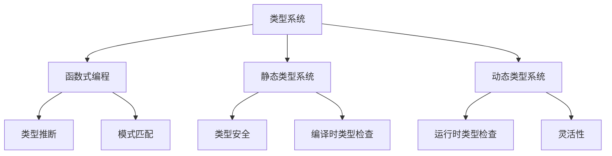

                 


### 第一部分：类型系统基础

#### 第1章：类型系统的概念与历史

**1.1 类型系统的基本概念**

类型系统（Type System）是计算机语言中用来定义数据类型和操作符之间关系的机制。它决定了变量、函数、表达式等的类型以及这些类型如何进行交互。

- **静态类型**：在编译时就已经确定变量的类型。
- **动态类型**：在运行时确定变量的类型。

**1.2 类型系统的历史发展**

类型系统的历史可以追溯到早期的编程语言，如FORTRAN和COBOL，它们都引入了基本的类型概念。然而，现代类型系统的发展主要得益于函数式编程语言的兴起，如Haskell、ML和Scala。

**1.3 函数式编程与类型系统**

函数式编程（Functional Programming）是一种编程范式，强调基于数学函数的编写方式。在函数式编程中，类型系统至关重要，因为它能够提供更好的类型推断、模式匹配和函数组合。

#### 第2章：函数式编程与类型系统

**2.1 函数式编程的基本概念**

函数式编程的核心思想是将计算视为数学函数的执行，避免使用变量和状态。

- **函数即第一公民**：函数与其他数据类型一样，可以赋值给变量、作为参数传递给其他函数、作为函数的返回值。
- **不可变数据**：数据一旦创建，就不能被修改。

**2.2 函数式编程的特点**

- **无状态性**：函数式编程避免了使用全局变量和状态，从而降低了程序的复杂性。
- **纯函数**：输出仅依赖于输入，不产生副作用。
- **递归**：函数式编程经常使用递归代替循环。

**2.3 类型系统在函数式编程中的应用**

类型系统在函数式编程中起到了至关重要的作用，提供了类型推断、类型检查和模式匹配等功能。

- **类型推断**：编译器自动推断变量和表达式的类型。
- **类型检查**：在编译时检查类型错误，防止运行时错误。
- **模式匹配**：根据值的结构来分离和处理数据。

### 第二部分：类型系统在Web编程中的应用

#### 第5章：Web编程中的类型系统

**5.1 Web编程的基础概念**

Web编程涉及客户端和服务器端的技术。客户端通常使用HTML、CSS和JavaScript，而服务器端则可能使用Node.js、Python、Java等。

**5.2 类型系统在Web编程中的应用**

类型系统在Web编程中的应用主要体现在以下几个方面：

- **前端开发**：使用TypeScript来增强JavaScript的类型安全。
- **后端开发**：使用静态类型语言如TypeScript或Scala来提高代码质量和开发效率。
- **API设计**：使用类型系统来定义API的输入和输出，确保数据的一致性和正确性。

**5.3 常见的Web编程语言类型系统**

- **JavaScript**：JavaScript是一种动态类型语言，通过类型推断和类型检查来提高类型安全。
- **TypeScript**：TypeScript是JavaScript的超集，提供了静态类型和类型推断功能。
- **Python**：Python是一种动态类型语言，但在某些场景下可以使用类型提示来提高类型安全。
- **Java**：Java是一种静态类型语言，类型系统是语言的核心。

### 第三部分：类型系统在Web框架中的应用

#### 第6章：类型系统在Web框架中的应用

**6.1 Web框架的基本概念**

Web框架是用于简化Web应用程序开发过程的工具。常见的Web框架包括React、Express、Flask等。

**6.2 类型系统在Web框架中的应用**

类型系统在Web框架中的应用体现在以下几个方面：

- **增强代码可读性**：通过类型系统，可以更清晰地定义组件和函数的输入输出。
- **提高开发效率**：类型系统可以自动进行类型检查，减少潜在的运行时错误。
- **API设计**：类型系统可以用于定义API的输入输出类型，确保数据的一致性。

**6.3 常见的Web框架类型系统**

- **React**：React支持TypeScript，可以提供更好的类型安全。
- **Express**：Express本身不支持类型系统，但可以使用第三方库如TypeScript Express来添加类型支持。
- **Flask**：Flask可以使用类型提示来提高代码的可读性和安全性。

### 第四部分：类型系统在Web编程中的实践

#### 第7章：类型系统在Web编程中的实践

**7.1 实践一：类型系统在React中的使用**

React是前端开发中广泛使用的库。通过TypeScript，React组件可以享受更好的类型安全。

**7.2 实践二：类型系统在Express中的使用**

Express是Node.js中最流行的Web框架之一。通过TypeScript Express，开发者可以在Express应用程序中利用静态类型系统。

**7.3 实践三：类型系统在TypeScript中的使用**

TypeScript是一种静态类型语言，可以直接用于Web编程。TypeScript的类型系统能够提高代码质量和开发效率。

### 第五部分：类型系统的未来与发展

#### 第8章：类型系统的未来与发展

**8.1 类型系统的未来发展趋势**

随着函数式编程的兴起，类型系统在未来将继续发展，提供更强大的类型推断、类型检查和模式匹配功能。

**8.2 类型系统在Web编程中的潜在应用**

类型系统在Web编程中的潜在应用包括更好的API设计、静态站点生成器和前端工程化等。

**8.3 类型系统的挑战与机遇**

类型系统在提供更好的开发体验的同时，也面临一些挑战，如性能优化和复杂性的平衡。随着技术的进步，类型系统将迎来更多的机遇。

### 附录

**A.1 常见的Web编程语言类型系统对比**

- **JavaScript**：动态类型系统
- **TypeScript**：静态类型系统
- **Python**：动态类型系统，类型提示
- **Java**：静态类型系统

**A.2 常用的Web框架类型系统对比**

- **React**：TypeScript支持
- **Express**：TypeScript支持（通过TypeScript Express）
- **Flask**：类型提示支持

**A.3 类型系统的相关知识扩展**

- **类型系统在安全领域的应用**
- **类型系统在性能优化中的作用**
- **函数式编程语言的类型系统特点**

## 核心概念与联系

### Mermaid 流程图



### 核心算法原理讲解

#### Python源代码示例

```python
# 静态类型系统的Python实现示例
from typing import List

def sum_list(numbers: List[int]) -> int:
    return sum(numbers)

# 动态类型系统的Python实现示例
def sum_list_dynamic(numbers):
    return sum(numbers)

# 测试代码
print(sum_list([1, 2, 3]))  # 输出：6
print(sum_list_dynamic([1, 2, 3]))  # 输出：6
```

### 数学模型和数学公式 & 详细讲解 & 举例说明

#### 数学公式

$$
\sum_{i=1}^{n} x_i = \frac{x_1 + x_2 + ... + x_n}{n}
$$

#### 详细讲解

该公式表示n个数的平均值，其中每个数$x_i$的权重相同。

#### 举例说明

假设有三个数：1, 2, 3，其平均值计算如下：

$$
\frac{1 + 2 + 3}{3} = \frac{6}{3} = 2
$$

### 项目实战

#### 代码实际案例和详细解释说明

#### React中的类型系统

```jsx
import React from 'react';
import PropTypes from 'prop-types';

function Greeting({ name }) {
  return <h1>Hello, {name}!</h1>;
}

Greeting.propTypes = {
  name: PropTypes.string.isRequired,
};

export default Greeting;
```

#### 开发环境搭建

1. 安装Node.js
2. 安装Create React App
3. 安装PropTypes库

#### 源代码详细实现和代码解读

#### PropTypes的使用

PropTypes用于验证组件的props类型，确保在组件使用过程中不会出现类型错误。

### 总结

类型系统在函数式Web编程中扮演着至关重要的角色。它不仅提高了代码的可读性和可维护性，还减少了运行时错误。在未来的发展中，类型系统将继续推动Web编程的进步。开发者和框架设计者应该充分利用类型系统带来的优势，以提高开发效率和代码质量。

作者：AI天才研究院/AI Genius Institute & 禅与计算机程序设计艺术 /Zen And The Art of Computer Programming

