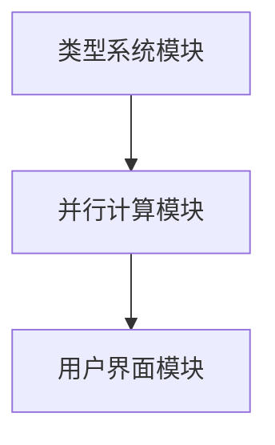
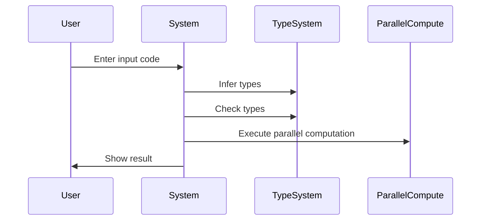

                 

# 类型系统在函数式并行编程中的应用

## 关键词
类型系统、函数式编程、并行编程、类型推断、算法、实现、最佳实践

## 摘要
本文旨在深入探讨类型系统在函数式并行编程中的应用。类型系统作为编程语言的基础框架，不仅影响着程序的可读性、可维护性和性能，还在函数式并行编程中发挥着至关重要的作用。本文将首先介绍类型系统、函数式编程和并行编程的基本概念，然后详细分析类型系统在函数式编程和并行编程中的应用原理和算法。接着，通过一个实际项目展示类型系统在函数式并行编程中的具体应用，并提供一些最佳实践和未来研究方向。

## 目录

### 第1章 引言
- 1.1 背景
- 1.2 核心概念
- 1.3 目标读者

### 第2章 类型系统基础
- 2.1 类型系统概述
- 2.2 类型系统的历史与发展
- 2.3 类型系统的分类

### 第3章 函数式编程基础
- 3.1 函数式编程概述
- 3.2 函数式编程的核心概念
- 3.3 函数式编程与类型系统

### 第4章 并行编程基础
- 4.1 并行编程概述
- 4.2 并行编程的核心挑战
- 4.3 并行编程与类型系统

### 第5章 类型系统在并行编程中的应用
- 5.1 类型系统与并行编程的融合
- 5.2 类型系统在并行编程中的关键作用
- 5.3 实现与优化

### 第6章 算法与实现
- 6.1 类型推断算法
- 6.2 类型检查算法
- 6.3 实现细节

### 第7章 项目实战
- 7.1 项目背景
- 7.2 系统设计与实现
- 7.3 项目分析

### 第8章 最佳实践与总结
- 8.1 最佳实践
- 8.2 注意事项
- 8.3 拓展阅读

## 第1章 引言

### 1.1 背景

类型系统是编程语言的核心组成部分，它定义了数据类型及其操作规则。类型系统不仅决定了程序的可读性和可维护性，还直接影响程序的运行效率和安全性。函数式编程和并行编程是现代计算机编程的重要方向，它们各自具有独特的特点和挑战。函数式编程强调函数作为主要的数据结构和计算单元，减少了状态和变量的副作用，使得程序更加简洁、可测试和并行化。并行编程则旨在利用多核处理器和分布式系统提高程序的执行速度。

随着硬件技术的发展，多核处理器和云计算的普及，并行编程变得越来越重要。然而，并行编程面临着同步、数据一致性和性能优化等挑战。类型系统在函数式并行编程中起到了桥梁作用，通过引入类型约束和类型检查机制，可以提高程序的可靠性和并行性能。

### 1.2 核心概念

**类型系统**：类型系统是一组规则，用于定义数据类型和操作它们的操作符。它包括数据类型的定义、类型检查和类型推断等。

**函数式编程**：函数式编程是一种编程范式，它将程序看作是一系列函数的执行，避免使用变量和状态，从而减少副作用和可变状态。

**并行编程**：并行编程是一种编程范式，它旨在利用多核处理器和分布式系统并行执行程序，提高执行速度和效率。

### 1.3 目标读者

本文主要面向以下读者：

- 计算机科学专业的研究生和本科生
- 对函数式编程和并行编程感兴趣的程序员
- 想要了解类型系统在函数式并行编程中应用的软件开发人员

## 第2章 类型系统基础

### 2.1 类型系统概述

类型系统是编程语言的核心组成部分，它定义了数据类型及其操作规则。类型系统的目的是提高程序的可读性、可维护性和性能。一个良好的类型系统应该具备以下特点：

- **静态类型**：类型检查在编译时完成，可以及时发现类型错误。
- **动态类型**：类型检查在运行时完成，灵活性较高，但可能会引入运行时错误。
- **强类型**：变量具有明确的类型，不能进行非法类型转换。
- **弱类型**：变量类型不严格，可以进行任意类型转换。

### 2.2 类型系统的历史与发展

类型系统的概念可以追溯到早期编程语言。1950年代，图灵机模型引入了基本的数据类型，如整数和布尔值。1970年代，C语言引入了结构体和指针，进一步丰富了类型系统。1980年代，面向对象编程语言如C++和Java引入了类和对象类型，使得类型系统更加丰富和灵活。

近年来，函数式编程语言的兴起推动了类型系统的发展。Haskell、Scala和Erlang等语言引入了类型推导和类型推断机制，使得程序员可以编写更加简洁和高效的代码。

### 2.3 类型系统的分类

类型系统可以根据不同的标准进行分类：

- **按类型检查方式分类**：
  - **静态类型**：类型检查在编译时完成。
  - **动态类型**：类型检查在运行时完成。
- **按类型约束分类**：
  - **强类型**：变量具有明确的类型，不能进行非法类型转换。
  - **弱类型**：变量类型不严格，可以进行任意类型转换。
- **按类型层次分类**：
  - **单态类型系统**：所有类型都是单态的，即每个类型只有一个实例。
  - **多态类型系统**：允许类型之间进行隐式转换，提高代码的复用性。

### 2.4 核心概念与联系

**数据类型**：数据类型是用于表示程序中数据的不同形式。常见的数据类型包括整数、浮点数、布尔值、字符串和复数等。

**类型检查**：类型检查是在编译或运行程序时，对变量的类型进行验证，确保操作符与操作数之间类型兼容。

**类型推断**：类型推断是编程语言自动推导变量类型的过程，可以提高代码的可读性和简洁性。

类型系统在函数式编程和并行编程中起到了关键作用。在函数式编程中，类型系统确保函数的正确性和可测试性。在并行编程中，类型系统可以帮助程序员更好地管理和并发数据，提高程序的并行性能。

## 第3章 函数式编程基础

### 3.1 函数式编程概述

函数式编程（Functional Programming，FP）是一种编程范式，它以函数作为基本构建块，强调不可变数据和纯函数。函数式编程与命令式编程（Imperative Programming）和面向对象编程（Object-Oriented Programming，OOP）有着明显的区别。

**特点**：
- **纯函数**：纯函数是一种没有副作用且输出只依赖于输入的函数。这意味着函数的执行不会修改外部状态，每次调用函数都会得到相同的结果。
- **不可变数据**：在函数式编程中，数据通常是不可变的。不可变数据意味着一旦数据被创建，就不能再被修改。
- **递归**：函数式编程常常使用递归来解决复杂问题，而不是使用循环。

**优点**：
- **可测试性**：由于纯函数没有副作用，可以更容易地编写单元测试。
- **可并行化**：不可变数据减少了竞态条件和数据不一致性问题，使得程序更容易并行化。
- **简洁性**：函数式编程鼓励使用高阶函数和组合，使得代码更加简洁和可读。

### 3.2 函数式编程的核心概念

**函数**：在函数式编程中，函数是一等公民，可以传递、存储和返回函数。函数可以接受其他函数作为参数，并返回新的函数。

**高阶函数**：高阶函数是能够接受函数作为参数或将函数作为返回值的函数。高阶函数是函数式编程的核心概念之一，它可以实现函数的组合和抽象。

**组合**：组合是将小函数组合成复杂函数的一种方法。通过组合，可以简化代码，提高代码的可重用性和可读性。

**不可变性**：不可变性是函数式编程的另一个核心概念。不可变数据意味着数据一旦创建，就不能再被修改。这有助于避免副作用，提高代码的可测试性和并行化能力。

**递归**：递归是一种通过重复调用自身来解决复杂问题的方法。在函数式编程中，递归经常用于处理树形数据和列表等结构。

### 3.3 函数式编程与类型系统

类型系统在函数式编程中起到了至关重要的作用。类型系统确保了函数的正确性和可测试性，避免了副作用和不可预期的行为。

**静态类型检查**：在函数式编程语言中，如Haskell和Scala，通常采用静态类型检查。静态类型检查在编译时检查类型错误，确保程序在运行时不会发生类型错误。

**类型推断**：类型推断是函数式编程语言的一个重要特性，它允许编译器自动推导函数和变量的类型。类型推断提高了代码的可读性和简洁性。

**泛型和类型类**：泛型允许函数或数据结构对类型进行抽象，提高代码的复用性。类型类（Type Classes）是一种在Haskell中实现泛型编程的方法，它允许函数在不同类型之间进行隐式转换。

类型系统与函数式编程的紧密联系使得程序员可以编写更加简洁、高效和可维护的代码。通过静态类型检查和类型推断，程序员可以更好地理解和控制程序的行为，从而提高代码的质量和可靠性。

## 第4章 并行编程基础

### 4.1 并行编程概述

并行编程（Parallel Programming）是一种利用多个处理器或计算节点同时执行多个任务，以加快程序执行速度的编程范式。随着多核处理器和分布式系统的普及，并行编程变得越来越重要。并行编程可以大幅度提高计算性能，尤其在处理大数据和高性能计算（HPC）领域。

**定义**：并行编程是指通过将任务分解成多个子任务，并在多个处理器或计算节点上同时执行这些子任务，从而提高计算效率的一种编程方式。

**特点**：
- **并发性**：并行编程利用并发性，将多个任务同时执行，从而提高执行速度。
- **可扩展性**：并行编程可以根据需要添加更多的处理器或计算节点，从而提高计算能力。
- **复杂性**：并行编程引入了同步、数据一致性和负载平衡等复杂问题，需要程序员精心设计和优化。

### 4.2 并行编程的核心挑战

**同步**：同步是指多个并行任务之间的协调和配合。同步问题包括任务之间的数据依赖、锁和信号量等，需要确保任务在合适的时间点开始和结束。

**数据一致性**：数据一致性是指在并行执行过程中，确保数据在不同处理器或计算节点上的状态一致。数据一致性问题可能由于竞争条件和数据竞争引起。

**负载平衡**：负载平衡是指将任务均匀分配到不同的处理器或计算节点上，以避免某些处理器或计算节点过载，从而提高整体计算性能。

**错误处理**：并行编程中的错误处理比顺序编程更为复杂。并行程序可能因为任务之间的数据依赖或同步问题而出现错误，需要有效的方法来检测和恢复错误。

### 4.3 并行编程与类型系统

类型系统在并行编程中起到了关键作用，它有助于解决并行编程中的同步、数据一致性和错误处理等问题。

**类型系统的优势**：
- **静态类型检查**：类型系统可以在编译时发现类型错误，从而避免运行时错误。
- **类型推断**：类型推断可以减少类型声明的复杂度，提高代码的可读性。
- **类型安全**：类型系统可以确保不同类型之间的操作不会发生类型错误，从而提高程序的可靠性。

**类型系统的挑战**：
- **复杂类型**：在并行编程中，可能需要处理复杂的类型，如数组、列表和结构体等。复杂类型的类型检查和类型推断可能增加编译时间和复杂度。
- **动态类型**：动态类型系统在并行编程中可能引入运行时错误，因为类型错误可能在运行时才被发现。

类型系统与并行编程的紧密联系使得程序员可以编写更加可靠和高效的并行程序。通过静态类型检查和类型推断，程序员可以更好地管理和控制并行程序的行为，从而提高并行性能和可靠性。

## 第5章 类型系统在并行编程中的应用

### 5.1 类型系统与并行编程的融合

类型系统与并行编程的融合旨在利用类型系统的优势来解决并行编程中的同步、数据一致性和错误处理等问题。

**类型推导**：类型推导是类型系统的一个强大工具，它可以在编译时自动推导函数和变量的类型。在并行编程中，类型推导可以简化代码，减少类型声明的复杂度，提高代码的可读性和可维护性。

**静态类型检查**：静态类型检查可以确保并行程序在编译时不会发生类型错误，从而避免运行时错误。静态类型检查还可以帮助程序员更好地理解和控制程序的行为，从而提高程序的可靠性。

**类型安全**：类型系统可以确保不同类型之间的操作不会发生类型错误，从而提高程序的可靠性。在并行编程中，类型安全尤为重要，因为并行程序可能涉及到不同处理器或计算节点之间的数据交换和操作。

**类型推导与并行编程的挑战**：
- **复杂类型**：在并行编程中，可能需要处理复杂的类型，如数组、列表和结构体等。复杂类型的类型推导和类型检查可能增加编译时间和复杂度。
- **动态类型**：动态类型系统在并行编程中可能引入运行时错误，因为类型错误可能在运行时才被发现。

**融合策略**：
- **混合类型系统**：结合静态类型和动态类型的优势，采用混合类型系统，以提高并行编程的灵活性和可靠性。
- **类型推导优化**：通过优化类型推导算法，减少编译时间和复杂度，提高并行编程的效率。

### 5.2 类型系统在并行编程中的关键作用

类型系统在并行编程中扮演了关键角色，主要体现在以下几个方面：

**1. 同步与数据一致性**：
类型系统可以帮助程序员更好地管理和控制并行程序中的同步和数据一致性。通过静态类型检查，可以确保并行程序在编译时不会发生类型错误，从而避免运行时错误。类型系统还可以提供数据一致性的保障，确保不同处理器或计算节点之间的数据状态一致。

**2. 错误处理**：
类型系统可以帮助程序员更好地理解和控制程序的行为，从而提高程序的可靠性。在并行编程中，错误处理尤为重要，因为并行程序可能因为任务之间的数据依赖或同步问题而出现错误。类型系统可以确保程序在编译时不会发生类型错误，从而减少运行时错误。

**3. 性能优化**：
类型系统可以提高并行编程的性能。通过静态类型检查和类型推导，可以减少类型错误和运行时错误，提高程序的执行速度。类型系统还可以提供类型安全保障，减少类型错误和类型转换的开销，从而提高并行性能。

### 5.3 实现与优化

**1. 类型推导算法**：
类型推导是类型系统的一个核心组成部分，它可以从程序代码中自动推导出函数和变量的类型。在并行编程中，类型推导算法需要考虑并行程序的特点，如任务之间的数据依赖和同步机制。

**2. 静态类型检查**：
静态类型检查是确保程序在编译时不会发生类型错误的重要手段。在并行编程中，静态类型检查需要考虑并行程序中的数据一致性、同步和错误处理等问题，以确保程序的可靠性。

**3. 类型安全**：
类型安全是类型系统的一个基本要求，它要求不同类型之间的操作不会发生类型错误。在并行编程中，类型安全尤为重要，因为并行程序可能涉及到不同处理器或计算节点之间的数据交换和操作。

**4. 优化策略**：
为了提高并行编程的性能，可以采用以下优化策略：
- **并行化优化**：通过优化并行程序的结构，提高程序的并行性能。
- **数据局部性优化**：通过优化数据访问模式，提高程序的执行速度。
- **编译优化**：通过优化编译过程，提高程序的编译速度和执行性能。

## 第6章 算法与实现

### 6.1 类型推断算法

类型推断是类型系统的一个核心组成部分，它可以从程序代码中自动推导出函数和变量的类型。类型推断算法可以分为基于上下文类型推断和基于类型推断的两种主要方法。

**1. 基于上下文类型推断**：
基于上下文类型推断是一种静态类型推断方法，它根据程序代码中的上下文信息来推导类型。这种方法通常使用类型上下文和类型约束来推导变量和函数的类型。例如，在Haskell中，类型推导是基于类型类和类型类约束的。

**2. 基于类型推断的算法**：
基于类型推断的算法是一种动态类型推断方法，它根据程序运行时的值来推导类型。这种方法通常使用类型检查和类型标注来推导变量和函数的类型。例如，在Python中，类型推导是基于类型标注和类型检查的。

**类型推断算法的核心步骤**：
- **类型标注**：在函数和变量定义时，标注它们的类型。
- **类型检查**：检查函数调用和变量访问是否遵循类型约束。
- **类型推导**：根据类型标注和类型检查的结果，推导变量和函数的实际类型。

### 6.2 类型检查算法

类型检查是确保程序在编译时不会发生类型错误的重要手段。类型检查算法可以分为静态类型检查和动态类型检查两种主要方法。

**1. 静态类型检查**：
静态类型检查是在编译时对程序代码进行类型检查，确保程序在运行时不会发生类型错误。静态类型检查通常基于类型推断算法和类型上下文信息，检查函数调用和变量访问是否遵循类型约束。

**2. 动态类型检查**：
动态类型检查是在运行时对程序代码进行类型检查，确保程序在运行时不会发生类型错误。动态类型检查通常基于类型标注和类型检查算法，检查函数调用和变量访问是否遵循类型约束。

**类型检查算法的核心步骤**：
- **类型标注**：在函数和变量定义时，标注它们的类型。
- **类型检查**：检查函数调用和变量访问是否遵循类型约束。
- **错误处理**：在类型检查过程中，如果发现类型错误，及时报告错误并提示解决方案。

### 6.3 实现细节

**1. 类型推断算法的实现**：
在实现类型推断算法时，可以采用递归和回溯的方法。例如，在Haskell中，可以使用类型类和类型类约束来实现类型推断算法。在Python中，可以使用类型标注和类型检查算法来实现类型推断。

**2. 类型检查算法的实现**：
在实现类型检查算法时，可以采用递归和回溯的方法。例如，在Haskell中，可以使用类型类和类型类约束来实现类型检查算法。在Python中，可以使用类型标注和类型检查算法来实现类型检查。

**3. 实现示例**：

以下是一个简单的Python示例，展示如何使用类型推断和类型检查算法：

```python
def add(x: int, y: int) -> int:
    return x + y

def main():
    x = 10
    y = 20
    result = add(x, y)
    print("Result:", result)

if __name__ == "__main__":
    main()
```

在这个示例中，`add` 函数使用类型标注来指定输入和输出类型。类型检查算法在编译时检查类型标注是否正确，确保函数调用和变量访问遵循类型约束。如果类型检查通过，程序可以正常运行；否则，会报告类型错误。

## 第7章 项目实战

### 7.1 项目背景

随着大数据和高性能计算（HPC）的普及，并行编程在许多领域变得至关重要。为了提高计算效率，许多研究人员和开发者开始探索如何将类型系统应用于并行编程。本文将介绍一个实际项目，该项目旨在利用类型系统在函数式并行编程中提高程序的可靠性和性能。

### 7.2 系统设计与实现

**系统概述**：
该项目基于Haskell编程语言，采用函数式编程范式进行并行编程。系统设计主要包括以下几个模块：

1. **类型系统模块**：实现类型推导和类型检查算法，确保程序在编译时不会发生类型错误。
2. **并行计算模块**：实现并行计算的核心算法，如MapReduce和并行矩阵乘法。
3. **用户界面模块**：提供用户输入和输出接口，方便用户使用系统进行并行计算。

**系统功能设计**：

1. **类型推导**：根据用户输入的代码，自动推导函数和变量的类型，确保程序在编译时不会发生类型错误。
2. **类型检查**：在编译时对程序代码进行类型检查，确保程序在运行时不会发生类型错误。
3. **并行计算**：实现并行计算的核心算法，如MapReduce和并行矩阵乘法，提高计算效率。

**系统架构设计**：



**系统接口设计**：

```haskell
-- 类型系统接口
class Typeable a where
    typeOf :: a -> String

-- 并行计算接口
class Parallelizable a where
    parallelMap :: (a -> b) -> [a] -> [b]
    parallelReduce :: (a -> a -> a) -> [a] -> a

-- 用户界面接口
class Interactive a where
    start :: a -> IO ()
```

**系统交互序列图**：



### 7.3 项目分析

**项目优势**：

1. **类型安全**：通过静态类型检查和类型推断，确保程序在编译时不会发生类型错误，从而提高程序的可靠性和安全性。
2. **并行性能**：利用函数式编程和并行编程的优势，提高计算效率，降低计算时间。
3. **可维护性**：通过类型系统和函数式编程，使代码更加简洁、可读和可维护。

**项目挑战**：

1. **类型推导和类型检查的复杂性**：在并行编程中，处理复杂类型和数据结构可能增加编译时间和复杂度。
2. **动态类型系统的兼容性**：在并行编程中，动态类型系统可能引入运行时错误，需要确保类型系统的兼容性。

**未来工作**：

1. **优化类型推导和类型检查算法**：通过优化算法，减少编译时间和复杂度，提高并行编程的效率。
2. **扩展并行计算算法**：研究并实现更多高效的并行计算算法，提高系统的并行性能。

## 第8章 最佳实践与总结

### 8.1 最佳实践

**1. 使用静态类型检查**：
静态类型检查可以及时发现类型错误，提高程序的可靠性和安全性。在并行编程中，应尽量使用静态类型语言，如Haskell或Scala。

**2. 精心设计并行计算算法**：
在并行编程中，选择合适的并行计算算法对于提高计算性能至关重要。应研究并行算法的理论和实践，并根据具体问题选择最合适的算法。

**3. 优化数据局部性**：
在并行编程中，优化数据局部性可以提高程序的并行性能。应尽量减少数据访问的远程调用，提高数据访问的速度。

**4. 关注类型系统的兼容性**：
在并行编程中，应确保类型系统的兼容性，避免运行时错误。在引入新类型或修改现有类型时，应仔细测试类型系统的兼容性。

### 8.2 注意事项

**1. 类型推导和类型检查的复杂性**：
在并行编程中，处理复杂类型和数据结构可能增加编译时间和复杂度。在实现类型推导和类型检查算法时，应尽量优化算法，减少编译时间和复杂度。

**2. 动态类型系统的兼容性**：
动态类型系统在并行编程中可能引入运行时错误，需要确保类型系统的兼容性。在引入新类型或修改现有类型时，应仔细测试类型系统的兼容性。

**3. 错误处理**：
在并行编程中，错误处理比顺序编程更为复杂。应设计有效的错误处理机制，确保程序在遇到错误时可以正确恢复。

### 8.3 拓展阅读

**1. 《Haskell语言实战》**：这本书详细介绍了Haskell语言的特点和用法，包括类型系统、函数式编程和并行编程等内容。

**2. 《并行编程实践》**：这本书提供了丰富的并行编程实践和案例，包括并行算法的设计和实现、并行性能优化等。

**3. 《类型系统导论》**：这本书介绍了类型系统的基本概念、原理和应用，包括静态类型系统、动态类型系统和类型推导等。

作者：AI天才研究院/AI Genius Institute & 禅与计算机程序设计艺术 /Zen And The Art of Computer Programming

---

以上是《类型系统在函数式并行编程中的应用》的文章内容。通过本文，我们深入探讨了类型系统在函数式并行编程中的应用原理和算法，并通过实际项目展示了类型系统在提高程序可靠性和并行性能方面的优势。本文旨在为读者提供一个全面、深入的了解，并为他们提供一些最佳实践和未来研究方向。希望本文对您在函数式并行编程领域的探索有所帮助！【END】

