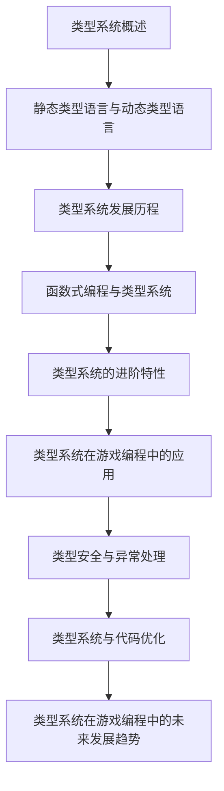

                 

### 《类型系统在函数式游戏编程中的应用》

#### 关键词
- 类型系统
- 函数式编程
- 游戏编程
- 静态类型
- 动态类型
- 高级类型特性

#### 摘要
本文深入探讨了类型系统在函数式游戏编程中的应用。首先介绍了类型系统的基础概念及其在编程语言中的角色与功能，随后分析了静态类型语言与动态类型语言的特点和发展历程。接着，我们重点讨论了类型系统在函数式编程中的重要性，包括其预防错误、提高代码可读性和支持复杂程序设计的能力。文章还进一步探讨了类型系统的进阶特性，如泛型编程、协变与逆变等，并在游戏编程中展示了这些特性的应用。最后，本文展望了类型系统在游戏编程中的未来发展趋势，并提供了实际案例和实践技巧。

---

### 第一部分：类型系统基础

#### 第1章：类型系统概述

##### 1.1 类型系统的基本概念

类型系统是编程语言中的一个核心组成部分，用于定义数据的类型和操作这些数据的方式。基本的数据类型分类包括：

- **基础类型**：如整数、浮点数、布尔值等。
- **复合类型**：如数组、列表、结构体等。

类型系统的角色与功能包括：

- **数据抽象**：通过类型，我们可以将数据与其操作抽象化，提高代码的可重用性和可维护性。
- **类型检查**：在编译或运行时，类型系统能够检查代码中的类型错误，提高程序的可靠性。
- **性能优化**：类型信息可以帮助编译器生成更高效的代码。

##### 1.2 静态类型语言与动态类型语言

**静态类型语言**：

- **优点**：早期编译，性能较高，类型检查全面，易于理解和维护。
- **限制**：对编程初学者可能较为严格，可能限制代码的灵活性。

**动态类型语言**：

- **优点**：编写代码更为灵活，动态类型检查减少了编译时间。
- **限制**：运行时类型检查可能导致性能损失，类型错误可能在运行时才被发现。

**静态类型与动态类型的关系**：

- 许多现代编程语言采用了静态类型和动态类型的混合模式，以平衡灵活性和性能。

##### 1.3 类型系统的发展历程

- **传统类型系统**：早期编程语言使用的简单类型系统，如C语言。
- **泛型类型系统**：引入泛型概念，如Java和C#，允许类型参数的使用。
- **基于依赖类型的系统**：如Haskell，通过依赖类型和类型推导提供更强的类型安全性。

---

### 第二部分：类型系统在函数式编程中的应用

#### 第2章：函数式编程与类型系统

##### 2.1 函数式编程的基本概念

函数式编程是一种编程范式，以函数作为主要构建块，强调无状态函数和表达式的值。其核心概念包括：

- **函数是一等公民**：函数可以像其他数据类型一样传递、存储和返回。
- **惰性求值**：只有当函数的实际值被需要时，才会执行计算。
- **即时求值**：函数的值在定义时立即计算。

##### 2.2 函数式编程的类型系统

**强类型与弱类型**：

- **强类型**：变量一旦声明了类型，就不能被重新赋值为其他类型的值。
- **弱类型**：变量可以被赋值为不同类型的值，可能导致隐式类型转换。

**基本数据类型与复合数据类型**：

- **基本数据类型**：如整数、浮点数、布尔值等。
- **复合数据类型**：如数组、列表、结构体等。

**类型推导与类型注解**：

- **类型推导**：编译器自动推断变量或表达式的类型。
- **类型注解**：显式地指定变量或表达式的类型。

##### 2.3 类型系统在函数式编程中的作用

**预防常见编程错误**：

类型系统能够在编译时检测出潜在的类型错误，如无效的类型转换。

**提高代码可读性**：

明确的类型信息使得代码更易于理解和维护。

**支持复杂程序设计**：

类型系统提供了构建复杂数据结构和算法的基础。

---

### 第三部分：类型系统的进阶特性

#### 第3章：类型系统的进阶特性

##### 3.1 类型约束与类型推导

**显式类型注解**：

- 编程者显式指定变量的类型。

**隐式类型推导**：

- 编译器根据代码上下文自动推断类型。

**类型推导算法**：

- 如Hindley-Milner算法，能够有效地进行类型推导。

##### 3.2 泛型编程

**泛型函数与泛型类**：

- 泛型函数：允许函数使用类型参数。
- 泛型类：允许类使用类型参数。

**泛型编程的优势与挑战**：

- **优势**：代码复用、降低重复代码、提高性能。
- **挑战**：类型安全性和性能优化。

**泛型编程的实际应用**：

- 在数据结构和算法中，如排序、查找等。

##### 3.3 高级类型系统特性

**协变与逆变**：

- 协变：子类型可以被替换为父类型。
- 逆变：父类型可以被替换为子类型。

**通用引用类型**：

- 提供了在类型间传递值的能力。

**标签联合类型**：

- 允许多个类型合并为一个类型，用于模式匹配。

---

### 第四部分：类型系统在游戏编程中的应用

#### 第4章：类型系统在游戏编程中的应用

##### 4.1 游戏编程中的类型系统

**游戏数据的抽象与建模**：

- 使用类型系统来抽象游戏中的各种数据结构，如玩家状态、游戏对象等。

**游戏逻辑的清晰性**：

- 类型系统能够提高游戏逻辑的清晰性和可维护性。

**游戏性能优化**：

- 类型信息有助于编译器生成更高效的代码，从而提高游戏性能。

##### 4.2 函数式编程在游戏开发中的优势

**函数式编程范式在游戏编程中的应用**：

- 使用纯函数和无状态函数来编写游戏逻辑，减少副作用。

**函数式编程对游戏开发的影响**：

- 提高代码的可读性和可维护性，降低错误率。

##### 4.3 实践案例：类型系统在游戏编程中的应用

**游戏场景建模**：

- 使用复合数据类型来表示游戏场景中的各种元素。

**游戏状态管理**：

- 利用类型系统来确保游戏状态的一致性和正确性。

**游戏AI实现**：

- 使用函数式编程范式来编写智能体行为，提高AI的可靠性和效率。

---

### 第五部分：类型系统与函数式编程工具

#### 第5章：类型系统与函数式编程工具

##### 5.1 Haskell在游戏编程中的应用

**Haskell语言的特点**：

- 强类型系统、类型推导、惰性求值。

**Haskell在游戏编程中的实际应用案例**：

- 使用Haskell来编写高度抽象的游戏逻辑。

##### 5.2 Scala在游戏编程中的应用

**Scala语言的特点**：

- 结合了面向对象和函数式编程的特点。

**Scala在游戏编程中的实际应用案例**：

- 在大型游戏项目中，利用Scala的高效类型系统和函数式编程特性。

##### 5.3 Elixir在游戏编程中的应用

**Elixir语言的特点**：

- 使用了Erlang虚拟机，支持并发编程。

**Elixir在游戏编程中的实际应用案例**：

- 在实时游戏服务器开发中，利用Elixir的高并发性能。

---

### 第六部分：类型系统在游戏编程中的深度应用

#### 第6章：类型安全与异常处理

##### 6.1 类型安全的基本概念

**类型安全的优点**：

- 预防类型错误，提高程序可靠性。

**类型安全的实现机制**：

- 编译器检查、运行时检查。

##### 6.2 异常处理机制

**异常处理的基本概念**：

- 异常是一种错误处理机制，用于处理程序运行时的非正常情况。

**函数式编程中的异常处理方法**：

- 使用`Maybe`、`Either`等类型来处理可能的错误。

**异常处理与类型系统**：

- 类型系统能够帮助识别和预防异常处理中的错误。

##### 6.3 实践案例：类型安全与异常处理在游戏编程中的应用

**游戏场景中的类型安全**：

- 通过类型系统确保游戏场景数据的一致性和正确性。

**游戏逻辑中的异常处理**：

- 使用函数式编程方法来优雅地处理游戏逻辑中的异常。

---

### 第七部分：类型系统与代码优化

##### 7.1 类型推导与性能优化

**类型推导对代码性能的影响**：

- 类型推导可以减少编译时间，提高程序性能。

**类型推导在编译优化中的应用**：

- 类型信息帮助编译器生成更高效的代码。

##### 7.2 泛型编程与代码复用

**泛型编程的优势**：

- 提高代码复用，减少重复代码。

**泛型编程在游戏编程中的实际应用**：

- 在游戏框架和库中，利用泛型编程特性来提高代码的灵活性。

##### 7.3 实践案例：类型系统在游戏编程中的优化

**游戏性能调优**：

- 通过类型推导和泛型编程来优化游戏性能。

**游戏代码复用与优化**：

- 利用类型系统和函数式编程特性来提高代码的复用性和可维护性。

---

### 第八部分：类型系统在函数式游戏编程中的未来发展趋势

#### 第8章：类型系统在函数式游戏编程中的未来发展趋势

##### 8.1 类型系统在游戏开发中的挑战与机遇

**类型系统面临的挑战**：

- 随着游戏复杂性的增加，类型系统的处理变得更加困难。

**类型系统带来的机遇**：

- 类型系统可以在更复杂的应用场景中提供更高的可靠性和性能。

##### 8.2 未来发展趋势

**类型系统在游戏编程中的创新**：

- 利用新的编程范式和类型特性来开发更高效的游戏逻辑。

**类型系统与其他编程范式的融合**：

- 结合函数式编程、面向对象编程等不同范式，提供更丰富的编程工具。

##### 8.3 结语

**类型系统在函数式游戏编程中的重要性**：

- 类型系统是确保游戏逻辑正确性和性能优化的重要工具。

**对未来游戏编程的启示**：

- 类型系统将继续在游戏开发中发挥重要作用，为开发者提供更强的抽象能力和更高的可靠性。

### 附录

#### 附录A：函数式编程与类型系统常用工具

**Haskell开发环境搭建**：

- Haskell语言的特点及其在游戏开发中的应用。

**Scala开发环境搭建**：

- Scala语言的混合编程特性和在游戏开发中的优势。

**Elixir开发环境搭建**：

- Elixir语言的高并发特性和在游戏服务器开发中的应用。

#### 附录B：数学模型与公式解释

**主要数学模型**：

- 用于描述游戏逻辑和数据结构的数学模型。

**公式详细解释**：

- 对关键公式进行详细的解释和推导。

#### 附录C：代码示例与解读

**Haskell代码示例**：

- Haskell在游戏编程中的应用实例。

**Scala代码示例**：

- Scala在游戏开发中的实际应用案例。

**Elixir代码示例**：

- Elixir在游戏服务器开发中的实践。

**代码解读与分析**：

- 对代码示例进行详细解读和分析。

### Mermaid 流程图：类型系统与函数式编程概念联系



---

**注意：以上大纲结构仅为示例，实际编写时可根据具体内容进行适当调整。**

### 文章标题：《类型系统在函数式游戏编程中的应用》

**类型系统**是现代编程语言的核心组成部分，它定义了数据的类型和操作这些数据的方式。**函数式编程**是一种编程范式，强调使用函数作为主要构建块，并采用表达式的值。**游戏编程**则是一种将编程应用于游戏开发的特殊领域。本文将探讨类型系统在函数式游戏编程中的应用，以帮助开发者更好地理解和利用这一强大的工具。

#### 关键词

- 类型系统
- 函数式编程
- 游戏编程
- 静态类型
- 动态类型
- 高级类型特性

#### 摘要

本文首先介绍了类型系统的基本概念和分类，然后讨论了静态类型语言与动态类型语言的特点和发展历程。接着，我们重点分析了类型系统在函数式编程中的重要性，包括其预防错误、提高代码可读性和支持复杂程序设计的能力。随后，我们探讨了类型系统的进阶特性，如泛型编程和高级类型系统特性，并展示了它们在游戏编程中的应用。最后，本文展望了类型系统在游戏编程中的未来发展趋势，并提供了实际案例和实践技巧。

---

### 第一部分：类型系统基础

#### 第1章：类型系统概述

##### 1.1 类型系统的基本概念

类型系统是编程语言中的一个核心组成部分，用于定义数据的类型和操作这些数据的方式。基本的数据类型分类包括：

- **基础类型**：如整数、浮点数、布尔值等。
- **复合类型**：如数组、列表、结构体等。

类型系统的角色与功能包括：

- **数据抽象**：通过类型，我们可以将数据与其操作抽象化，提高代码的可重用性和可维护性。
- **类型检查**：在编译或运行时，类型系统能够检查代码中的类型错误，提高程序的可靠性。
- **性能优化**：类型信息可以帮助编译器生成更高效的代码。

##### 1.2 静态类型语言与动态类型语言

**静态类型语言**：

- **优点**：早期编译，性能较高，类型检查全面，易于理解和维护。
- **限制**：对编程初学者可能较为严格，可能限制代码的灵活性。

**动态类型语言**：

- **优点**：编写代码更为灵活，动态类型检查减少了编译时间。
- **限制**：运行时类型检查可能导致性能损失，类型错误可能在运行时才被发现。

**静态类型与动态类型的关系**：

- 许多现代编程语言采用了静态类型和动态类型的混合模式，以平衡灵活性和性能。

##### 1.3 类型系统的发展历程

- **传统类型系统**：早期编程语言使用的简单类型系统，如C语言。
- **泛型类型系统**：引入泛型概念，如Java和C#，允许类型参数的使用。
- **基于依赖类型的系统**：如Haskell，通过依赖类型和类型推导提供更强的类型安全性。

---

### 第二部分：类型系统在函数式编程中的应用

#### 第2章：函数式编程与类型系统

##### 2.1 函数式编程的基本概念

函数式编程是一种编程范式，以函数作为主要构建块，强调无状态函数和表达式的值。其核心概念包括：

- **函数是一等公民**：函数可以像其他数据类型一样传递、存储和返回。
- **惰性求值**：只有当函数的实际值被需要时，才会执行计算。
- **即时求值**：函数的值在定义时立即计算。

##### 2.2 函数式编程的类型系统

**强类型与弱类型**：

- **强类型**：变量一旦声明了类型，就不能被重新赋值为其他类型的值。
- **弱类型**：变量可以被赋值为不同类型的值，可能导致隐式类型转换。

**基本数据类型与复合数据类型**：

- **基本数据类型**：如整数、浮点数、布尔值等。
- **复合数据类型**：如数组、列表、结构体等。

**类型推导与类型注解**：

- **类型推导**：编译器自动推断变量或表达式的类型。
- **类型注解**：显式地指定变量或表达式的类型。

##### 2.3 类型系统在函数式编程中的作用

**预防常见编程错误**：

类型系统能够在编译时检测出潜在的类型错误，如无效的类型转换。

**提高代码可读性**：

明确的类型信息使得代码更易于理解和维护。

**支持复杂程序设计**：

类型系统提供了构建复杂数据结构和算法的基础。

---

### 第三部分：类型系统的进阶特性

#### 第3章：类型系统的进阶特性

##### 3.1 类型约束与类型推导

**显式类型注解**：

- 编程者显式指定变量的类型。

**隐式类型推导**：

- 编译器根据代码上下文自动推断类型。

**类型推导算法**：

- 如Hindley-Milner算法，能够有效地进行类型推导。

##### 3.2 泛型编程

**泛型函数与泛型类**：

- 泛型函数：允许函数使用类型参数。
- 泛型类：允许类使用类型参数。

**泛型编程的优势与挑战**：

- **优势**：代码复用、降低重复代码、提高性能。
- **挑战**：类型安全性和性能优化。

**泛型编程的实际应用**：

- 在数据结构和算法中，如排序、查找等。

##### 3.3 高级类型系统特性

**协变与逆变**：

- 协变：子类型可以被替换为父类型。
- 逆变：父类型可以被替换为子类型。

**通用引用类型**：

- 提供了在类型间传递值的能力。

**标签联合类型**：

- 允许多个类型合并为一个类型，用于模式匹配。

---

### 第四部分：类型系统在游戏编程中的应用

#### 第4章：类型系统在游戏编程中的应用

##### 4.1 游戏编程中的类型系统

**游戏数据的抽象与建模**：

- 使用类型系统来抽象游戏中的各种数据结构，如玩家状态、游戏对象等。

**游戏逻辑的清晰性**：

- 类型系统能够提高游戏逻辑的清晰性和可维护性。

**游戏性能优化**：

- 类型信息有助于编译器生成更高效的代码，从而提高游戏性能。

##### 4.2 函数式编程在游戏开发中的优势

**函数式编程范式在游戏编程中的应用**：

- 使用纯函数和无状态函数来编写游戏逻辑，减少副作用。

**函数式编程对游戏开发的影响**：

- 提高代码的可读性和可维护性，降低错误率。

##### 4.3 实践案例：类型系统在游戏编程中的应用

**游戏场景建模**：

- 使用复合数据类型来表示游戏场景中的各种元素。

**游戏状态管理**：

- 利用类型系统来确保游戏状态的一致性和正确性。

**游戏AI实现**：

- 使用函数式编程范式来编写智能体行为，提高AI的可靠性和效率。

---

### 第五部分：类型系统与函数式编程工具

#### 第5章：类型系统与函数式编程工具

##### 5.1 Haskell在游戏编程中的应用

**Haskell语言的特点**：

- 强类型系统、类型推导、惰性求值。

**Haskell在游戏编程中的实际应用案例**：

- 使用Haskell来编写高度抽象的游戏逻辑。

##### 5.2 Scala在游戏编程中的应用

**Scala语言的特点**：

- 结合了面向对象和函数式编程的特点。

**Scala在游戏编程中的实际应用案例**：

- 在大型游戏项目中，利用Scala的高效类型系统和函数式编程特性。

##### 5.3 Elixir在游戏编程中的应用

**Elixir语言的特点**：

- 使用了Erlang虚拟机，支持并发编程。

**Elixir在游戏编程中的实际应用案例**：

- 在实时游戏服务器开发中，利用Elixir的高并发性能。

---

### 第六部分：类型系统在游戏编程中的深度应用

#### 第6章：类型安全与异常处理

##### 6.1 类型安全的基本概念

**类型安全的优点**：

- 预防类型错误，提高程序可靠性。

**类型安全的实现机制**：

- 编译器检查、运行时检查。

##### 6.2 异常处理机制

**异常处理的基本概念**：

- 异常是一种错误处理机制，用于处理程序运行时的非正常情况。

**函数式编程中的异常处理方法**：

- 使用`Maybe`、`Either`等类型来处理可能的错误。

**异常处理与类型系统**：

- 类型系统能够帮助识别和预防异常处理中的错误。

##### 6.3 实践案例：类型安全与异常处理在游戏编程中的应用

**游戏场景中的类型安全**：

- 通过类型系统确保游戏场景数据的一致性和正确性。

**游戏逻辑中的异常处理**：

- 使用函数式编程方法来优雅地处理游戏逻辑中的异常。

---

### 第七部分：类型系统与代码优化

##### 7.1 类型推导与性能优化

**类型推导对代码性能的影响**：

- 类型推导可以减少编译时间，提高程序性能。

**类型推导在编译优化中的应用**：

- 类型信息帮助编译器生成更高效的代码。

##### 7.2 泛型编程与代码复用

**泛型编程的优势**：

- 提高代码复用，减少重复代码。

**泛型编程在游戏编程中的实际应用**：

- 在游戏框架和库中，利用泛型编程特性来提高代码的灵活性。

##### 7.3 实践案例：类型系统在游戏编程中的优化

**游戏性能调优**：

- 通过类型推导和泛型编程来优化游戏性能。

**游戏代码复用与优化**：

- 利用类型系统和函数式编程特性来提高代码的复用性和可维护性。

---

### 第八部分：类型系统在函数式游戏编程中的未来发展趋势

#### 第8章：类型系统在函数式游戏编程中的未来发展趋势

##### 8.1 类型系统在游戏开发中的挑战与机遇

**类型系统面临的挑战**：

- 随着游戏复杂性的增加，类型系统的处理变得更加困难。

**类型系统带来的机遇**：

- 类型系统可以在更复杂的应用场景中提供更高的可靠性和性能。

##### 8.2 未来发展趋势

**类型系统在游戏编程中的创新**：

- 利用新的编程范式和类型特性来开发更高效的游戏逻辑。

**类型系统与其他编程范式的融合**：

- 结合函数式编程、面向对象编程等不同范式，提供更丰富的编程工具。

##### 8.3 结语

**类型系统在函数式游戏编程中的重要性**：

- 类型系统是确保游戏逻辑正确性和性能优化的重要工具。

**对未来游戏编程的启示**：

- 类型系统将继续在游戏开发中发挥重要作用，为开发者提供更强的抽象能力和更高的可靠性。

### 附录

#### 附录A：函数式编程与类型系统常用工具

**Haskell开发环境搭建**：

- Haskell语言的特点及其在游戏开发中的应用。

**Scala开发环境搭建**：

- Scala语言的混合编程特性和在游戏开发中的优势。

**Elixir开发环境搭建**：

- Elixir语言的高并发特性和在游戏服务器开发中的应用。

#### 附录B：数学模型与公式解释

**主要数学模型**：

- 用于描述游戏逻辑和数据结构的数学模型。

**公式详细解释**：

- 对关键公式进行详细的解释和推导。

#### 附录C：代码示例与解读

**Haskell代码示例**：

- Haskell在游戏编程中的应用实例。

**Scala代码示例**：

- Scala在游戏开发中的实际应用案例。

**Elixir代码示例**：

- Elixir在游戏服务器开发中的实践。

**代码解读与分析**：

- 对代码示例进行详细解读和分析。

### Mermaid 流程图：类型系统与函数式编程概念联系


---

**注意：以上大纲结构仅为示例，实际编写时可根据具体内容进行适当调整。**

### 第一部分：类型系统基础

#### 第1章：类型系统概述

类型系统是编程语言中的一个核心组成部分，用于定义数据的类型和操作这些数据的方式。它不仅为编程语言提供了明确的语义，还有助于提高代码的可靠性和性能。

##### 1.1 类型系统的基本概念

在编程中，类型系统用于定义数据的不同类别。每种类型代表一种特定类型的数据，以及可以对该数据执行的操作集合。基本的数据类型可以分为以下几类：

- **基础类型**：这是最基本的类型，通常包括整数（Integer）、浮点数（Float）、布尔值（Boolean）等。每种基础类型都有其特定的值域和操作方式。
  
- **复合类型**：这种类型是由基础类型组合而成的，包括数组（Array）、列表（List）、结构体（Struct）等。复合类型通常用于表示复杂的数据结构，如多维数组或包含多个字段的结构体。

类型系统在编程语言中的角色与功能包括：

- **数据抽象**：类型系统允许开发者通过定义抽象数据类型（ADT）来隐藏底层实现的细节，从而提高代码的可维护性和可扩展性。
  
- **类型检查**：类型系统在编译或运行时对代码进行类型检查，确保变量的使用符合其声明的类型。这有助于捕获潜在的错误，提高程序的可靠性。
  
- **性能优化**：类型信息可以帮助编译器生成更高效的代码。例如，编译器可以使用类型信息来优化内存分配和访问。

##### 1.2 静态类型语言与动态类型语言

静态类型语言和动态类型语言在类型系统的实现上有显著差异。

**静态类型语言**：

- **定义**：在静态类型语言中，变量的类型在编译时就已经确定，并且不能在运行时改变。
- **优点**：早期编译可以减少运行时的开销，类型检查全面，易于理解和维护。
- **缺点**：对编程初学者可能较为严格，可能限制代码的灵活性。

**动态类型语言**：

- **定义**：在动态类型语言中，变量的类型在运行时由解释器确定，可以在运行时改变。
- **优点**：编写代码更为灵活，动态类型检查减少了编译时间。
- **缺点**：运行时类型检查可能导致性能损失，类型错误可能在运行时才被发现。

**静态类型与动态类型的区别**：

- **类型绑定**：在静态类型语言中，类型绑定是早期进行的，而在动态类型语言中是晚期进行的。
- **灵活性**：动态类型语言提供了更高的灵活性，但可能在性能和安全性上有所牺牲。

许多现代编程语言采用了静态类型和动态类型的混合模式，以平衡灵活性和性能。例如，Java是一种静态类型语言，但也支持使用反射机制进行动态类型检查。

##### 1.3 类型系统的发展历程

类型系统的发展经历了多个阶段，每个阶段都带来了新的特性和改进。

**传统类型系统**：

- 这是最初的类型系统，如C语言中的类型系统。传统类型系统通常基于基础类型和复合类型，并提供有限的数据抽象能力。

**泛型类型系统**：

- 泛型类型系统允许类型参数的使用，使代码更具复用性和可维护性。例如，Java和C#都采用了泛型类型系统。

**基于依赖类型的系统**：

- 如Haskell，这种类型系统通过依赖类型和类型推导提供了更强的类型安全性。依赖类型允许在运行时动态确定类型，而类型推导则减少了显式类型注解的需求。

类型系统的发展不断推动编程语言的进步，使其能够更好地适应复杂的应用场景。

#### 第2章：函数式编程与类型系统

##### 2.1 函数式编程的基本概念

函数式编程（Functional Programming）是一种编程范式，强调以函数作为主要构建块。与命令式编程不同，函数式编程更关注于“计算的表达”，而不是“计算的控制流”。

**函数是一等公民**：

在函数式编程中，函数被视为第一类对象，这意味着函数可以像其他数据类型一样进行传递、存储和返回。这种特性使得函数式编程能够实现高阶函数（Higher-order Functions）和函数组合（Function Composition）。

**惰性求值**：

惰性求值（Lazy Evaluation）是一种计算策略，只有在需要函数的值时才进行实际计算。这种策略可以避免不必要的计算，提高程序的效率。

**即时求值**：

即时求值（Eager Evaluation）是另一种计算策略，函数在定义时立即计算。与惰性求值相比，即时求值可能更适用于某些场景，如需要立即执行某些操作。

**无状态与有状态函数**：

在函数式编程中，函数可以分为无状态（Stateless）和有状态（Stateful）。

- **无状态函数**：这种函数不依赖于外部状态，其输出仅依赖于输入参数。无状态函数易于测试和并行化。
- **有状态函数**：这种函数依赖于外部状态，可能在执行过程中改变状态。有状态函数更复杂，但可以处理更动态的应用场景。

##### 2.2 函数式编程的类型系统

函数式编程的类型系统与命令式编程的类型系统有显著差异。函数式编程通常使用强类型系统，以提供更高的类型安全和可靠性。

**强类型与弱类型**：

- **强类型**：在强类型系统中，变量一旦声明了类型，就不能被重新赋值为其他类型的值。这种系统有助于防止类型错误，提高程序的可靠性。
- **弱类型**：在弱类型系统中，变量可以被赋值为不同类型的值，可能导致隐式类型转换。这种系统提供了更大的灵活性，但可能在安全性上有所牺牲。

**基本数据类型与复合数据类型**：

- **基本数据类型**：在函数式编程中，基本数据类型通常包括整数、浮点数、布尔值等。
- **复合数据类型**：复合数据类型通常包括列表、元组、集合等。这些类型用于表示复杂的数据结构和集合。

**类型推导与类型注解**：

- **类型推导**：类型推导是一种编译器自动推断变量或表达式类型的方法。这种方法减少了显式类型注解的需求，提高了代码的可读性。
- **类型注解**：类型注解是显式指定变量或表达式类型的方法。这种方法提供了更强的类型安全性和明确的类型信息。

类型推导与类型注解相结合，为函数式编程提供了强大的类型系统，有助于编写更可靠和高效的代码。

##### 2.3 类型系统在函数式编程中的作用

类型系统在函数式编程中扮演了重要角色，有助于提高代码的质量和可靠性。以下是类型系统在函数式编程中的几个关键作用：

**预防常见编程错误**：

类型系统通过在编译时检查类型错误，可以预防许多常见的编程错误，如无效的类型转换和不兼容的操作。这种预防机制提高了代码的可靠性和可维护性。

**提高代码可读性**：

明确的类型信息使得代码更易于理解和维护。通过类型注解和类型推导，开发者可以清楚地了解变量的类型和函数的返回值，从而减少代码的误解和错误。

**支持复杂程序设计**：

类型系统提供了构建复杂数据结构和算法的基础。通过定义抽象数据类型和泛型类型，开发者可以编写更通用和可复用的代码，提高开发效率。

总之，类型系统在函数式编程中不仅是提高代码质量和可靠性的工具，还是支持复杂程序设计的关键特性。

---

### 第三部分：类型系统的进阶特性

#### 第3章：类型系统的进阶特性

类型系统的发展不仅停留在基本类型和类型检查层面，还包括一系列更复杂的特性，这些特性使得编程语言能够处理更复杂的编程挑战，提高代码的抽象能力和可维护性。

##### 3.1 类型约束与类型推导

**类型约束**：

类型约束是编程语言中用于限制变量或参数类型的特性。类型约束可以通过注解或编译器规则来定义。例如，在Java中，可以使用`@Inject`注解来约束字段或方法参数的类型。

类型约束的作用：

- **增强类型安全性**：通过限制变量或参数的类型，可以避免潜在的类型错误，提高代码的可靠性。
- **支持依赖注入**：类型约束使得依赖注入框架能够自动解析和注入依赖项，提高代码的可测试性和可维护性。

**类型推导**：

类型推导是编译器自动推断变量或表达式类型的过程。类型推导可以减少显式类型注解的需求，提高代码的可读性和可维护性。

类型推导的优点：

- **减少代码冗余**：通过自动推导类型，可以减少需要手动编写的类型注解，提高代码的可读性。
- **提高开发效率**：类型推导减少了开发者在类型注解上的工作量，使得开发过程更加高效。

**类型推导算法**：

常见的类型推导算法包括Hindley-Milner算法和Jags（Java's Generics）算法。这些算法能够有效地进行类型推导，同时保持类型安全。

**Hindley-Milner算法**：

- Hindley-Milner算法是一种类型推导算法，常用于强类型函数式编程语言，如Haskell和ML。
- 该算法能够推导出最宽的可能类型，同时保持类型安全。

**Jags算法**：

- Jags（Java's Generics）算法是Java中泛型类型推导的基础。
- Jags算法通过使用上下文信息来推导泛型类型参数，使得Java中的泛型编程更加灵活和类型安全。

##### 3.2 泛型编程

**泛型编程**：

泛型编程是一种编程范式，允许在代码中定义通用的数据结构和操作，而无需指定具体的数据类型。泛型编程通过类型参数和类型绑定来实现。

泛型编程的优点：

- **提高代码复用性**：通过使用泛型编程，可以编写一次代码，适用于多种数据类型。
- **减少类型转换**：泛型编程减少了显式类型转换的需求，提高了代码的可读性和性能。

**泛型函数与泛型类**：

- **泛型函数**：泛型函数允许函数接受类型参数，从而处理不同类型的数据。
- **泛型类**：泛型类允许类定义通用的数据结构和操作，而无需指定具体的数据类型。

**泛型编程的应用场景**：

- **数据结构**：泛型编程可用于实现各种数据结构，如列表、栈、队列等，使其适用于不同类型的数据。
- **算法**：泛型编程可用于实现通用算法，如排序、查找等，提高代码的可复用性。

**泛型编程的挑战**：

- **类型安全**：泛型编程需要确保类型安全，避免类型错误。这需要复杂的类型推导和类型检查机制。
- **性能优化**：泛型编程可能会引入额外的类型检查和类型转换开销，影响性能。

##### 3.3 高级类型系统特性

**协变与逆变**：

协变（Covariance）和逆变（Contravariance）是高级类型系统特性，用于处理子类型和多态。

**协变**：

协变允许子类型可以被替换为父类型。例如，如果一个函数期望接受一个`List`类型的参数，它也可以接受任何子类型，如`Vector`或`StringList`。

**逆变**：

逆变允许父类型可以被替换为子类型。例如，如果一个函数期望返回一个`List`类型的值，它也可以返回任何子类型的值，如`Vector`或`StringList`。

协变与逆变在多态和参数多态中非常有用，它们允许编写更通用和可复用的代码。

**通用引用类型**：

通用引用类型（Generalized Reference Types）是一种用于处理引用类型的高级类型系统特性。通用引用类型允许在类型参数中包含类型信息，从而实现更灵活的引用操作。

通用引用类型的应用场景包括：

- **参数多态**：通用引用类型可以用于实现参数多态，使得函数或方法可以接受不同类型的引用。
- **类型安全**：通用引用类型通过类型参数确保引用类型的安全性和一致性。

**标签联合类型**：

标签联合类型（Tagged Unions）是一种用于表示可选值和数据类型的特性。标签联合类型通常用于实现模式匹配和可选类型。

标签联合类型的优点：

- **模式匹配**：标签联合类型使得模式匹配变得更加简单和直观，可以方便地处理不同类型的数据。
- **可选类型**：标签联合类型可以表示可选值，使得代码可以更加简洁和健壮。

高级类型系统特性扩展了类型系统的功能，使得编程语言能够处理更复杂的编程挑战，提高代码的抽象能力和可维护性。

### 第四部分：类型系统在游戏编程中的应用

#### 第4章：类型系统在游戏编程中的应用

在游戏编程中，类型系统扮演着至关重要的角色。它不仅有助于提高代码的可读性和可维护性，还能优化游戏性能，确保游戏的稳定性。本节将探讨类型系统在游戏编程中的具体应用。

##### 4.1 游戏编程中的类型系统

**游戏数据的抽象与建模**

在游戏编程中，类型系统首先用于数据的抽象与建模。游戏中的各种数据，如玩家状态、游戏对象、资源等，都可以通过类型系统进行抽象和表示。

- **基本数据类型**：用于表示游戏中的基础数据，如整数值表示生命值、分数等。
- **复合数据类型**：用于表示复杂的数据结构，如玩家状态可以包括位置、速度、生命值等属性。

**游戏逻辑的清晰性**

类型系统能够提高游戏逻辑的清晰性和可维护性。通过明确的类型定义和类型检查，开发者可以更容易地理解和维护代码。

- **类型安全**：类型系统能够在编译时检测出潜在的类型错误，如无效的类型转换，从而防止运行时错误的发生。
- **代码可读性**：明确的类型信息使得代码更易于阅读和理解，减少了代码的混淆和误解。

**游戏性能优化**

类型系统在游戏编程中还扮演着性能优化的角色。通过类型信息，编译器可以生成更高效的代码，从而提高游戏性能。

- **类型推导**：类型推导减少了显式类型注解的需求，使得编译器可以更高效地生成代码。
- **类型检查**：类型检查可以帮助编译器进行优化，如提前释放内存、减少类型转换等，从而提高执行效率。

##### 4.2 函数式编程在游戏开发中的优势

函数式编程在游戏开发中具有独特的优势，其无状态函数、纯函数和不可变数据结构等特点使得游戏逻辑更加清晰、可维护和可测试。

**无状态函数**

无状态函数不依赖于外部状态，其输出仅依赖于输入参数。这种特性使得无状态函数易于测试和并行执行，有助于提高游戏的性能和可维护性。

- **可测试性**：无状态函数的输出仅依赖于输入参数，使得函数可以独立地测试，无需考虑外部状态的影响。
- **并行执行**：无状态函数可以并行执行，提高游戏逻辑的执行效率。

**纯函数**

纯函数不产生副作用，其输出仅依赖于输入参数，并且不会改变外部状态。这种特性使得纯函数易于理解、可复用和可维护。

- **可复用性**：纯函数可以独立地使用和复用，无需考虑其对外部状态的依赖。
- **可维护性**：纯函数由于其明确的输入和输出关系，使得代码更容易维护和理解。

**不可变数据结构**

不可变数据结构在函数式编程中扮演着重要角色。不可变数据结构一旦创建，就不能被修改，这种特性有助于提高代码的可读性和可维护性。

- **可读性**：不可变数据结构使得代码更简洁，减少了复杂的更新逻辑。
- **可维护性**：不可变数据结构减少了数据不一致的问题，提高了代码的可靠性。

**函数式编程对游戏开发的影响**

函数式编程对游戏开发产生了深远的影响。通过引入无状态函数、纯函数和不可变数据结构，函数式编程提高了代码的可读性、可维护性和可测试性，从而降低了错误率，提高了开发效率。

- **可读性**：函数式编程使得代码更加简洁和直观，更容易被团队成员理解和阅读。
- **可维护性**：函数式编程减少了代码的复杂性，使得代码更容易维护和更新。
- **可测试性**：函数式编程使得代码更加模块化，函数可以独立地测试，提高了测试覆盖率。

总之，类型系统和函数式编程在游戏编程中的应用，不仅提高了代码的质量和可靠性，还为开发者提供了更强大的抽象工具，使得游戏开发变得更加高效和可维护。

---

### 第五部分：类型系统与函数式编程工具

#### 第5章：类型系统与函数式编程工具

在游戏编程中，选择合适的编程语言和开发工具至关重要。本节将介绍几种流行的函数式编程语言及其在游戏开发中的应用，包括Haskell、Scala和Elixir。

##### 5.1 Haskell在游戏编程中的应用

**Haskell语言的特点**

Haskell是一种纯函数式编程语言，以其强类型系统、类型推导和惰性求值而著称。以下是Haskell语言的一些特点：

- **强类型系统**：Haskell具有严格的静态类型检查，确保代码在编译时没有类型错误。
- **类型推导**：Haskell能够自动推导变量和函数的类型，减少显式类型注解的需求。
- **惰性求值**：Haskell采用惰性求值策略，只有在需要函数的值时才会进行实际计算。

**Haskell在游戏编程中的实际应用案例**

Haskell在游戏编程中有着广泛的应用，特别是在需要高性能和类型安全性的场景。以下是一些Haskell在游戏编程中的实际应用案例：

- **游戏引擎开发**：Haskell可以用于开发高性能的游戏引擎，其强类型系统和惰性求值特性有助于优化性能和确保代码的可靠性。
- **游戏逻辑实现**：Haskell的纯函数式编程特性使得游戏逻辑的实现更加简洁和直观，减少了错误率。

**Haskell的优势**

- **高性能**：Haskell的惰性求值和类型推导特性有助于生成高效代码，提高游戏性能。
- **类型安全**：Haskell的严格类型系统确保代码在编译时没有类型错误，提高了程序可靠性。

**Haskell的挑战**

- **学习曲线**：Haskell的纯函数式编程范式和严格的类型系统可能对初学者来说有一定挑战。
- **工具支持**：与一些主流编程语言相比，Haskell的工具链和生态系统可能较为有限。

##### 5.2 Scala在游戏编程中的应用

**Scala语言的特点**

Scala是一种多范式编程语言，结合了面向对象和函数式编程的特点。以下是Scala语言的一些特点：

- **面向对象**：Scala支持传统的面向对象编程特性，如类、继承和多态。
- **函数式编程**：Scala也支持纯函数式编程，包括高阶函数、不可变数据结构和惰性求值。
- **类型推导**：Scala能够自动推导变量和函数的类型，减少显式类型注解的需求。

**Scala在游戏编程中的实际应用案例**

Scala在游戏编程中有着广泛的应用，特别是在需要高性能和灵活性的场景。以下是一些Scala在游戏编程中的实际应用案例：

- **游戏服务器开发**：Scala的高并发性能和丰富的函数式编程特性使其成为开发高性能游戏服务器的理想选择。
- **游戏逻辑实现**：Scala的混合编程范式使得开发者可以灵活地结合面向对象和函数式编程，提高代码的可维护性和可测试性。

**Scala的优势**

- **混合编程**：Scala结合了面向对象和函数式编程，提供了灵活的编程模型，适用于不同类型的游戏开发需求。
- **高性能**：Scala的JVM运行时环境和优化机制有助于生成高效代码，提高游戏性能。

**Scala的挑战**

- **学习曲线**：Scala的混合编程范式可能对初学者来说有一定挑战，需要一定的时间来适应。
- **兼容性**：Scala与Java的兼容性可能带来一些额外的工作，如处理类库兼容性问题。

##### 5.3 Elixir在游戏编程中的应用

**Elixir语言的特点**

Elixir是一种函数式编程语言，基于Ruby并运行在Erlang虚拟机（BEAM）上。以下是Elixir语言的一些特点：

- **函数式编程**：Elixir支持纯函数式编程，包括高阶函数、不可变数据结构和模式匹配。
- **并发编程**：Elixir充分利用了Erlang虚拟机的并发特性，提供了强大的并发编程能力。
- **类型推导**：Elixir能够自动推导变量和函数的类型，减少显式类型注解的需求。

**Elixir在游戏编程中的实际应用案例**

Elixir在游戏编程中有着广泛的应用，特别是在需要高并发性和实时性的场景。以下是一些Elixir在游戏编程中的实际应用案例：

- **实时游戏服务器开发**：Elixir的并发编程特性和高性能使其成为开发实时游戏服务器的理想选择。
- **游戏逻辑实现**：Elixir的函数式编程特性使得游戏逻辑的实现更加简洁和直观。

**Elixir的优势**

- **高并发性能**：Elixir充分利用了Erlang虚拟机的并发特性，提供了强大的并发编程能力，适合开发大规模实时游戏。
- **简洁性**：Elixir的函数式编程特性使得代码更加简洁和直观，提高了开发效率。

**Elixir的挑战**

- **生态系统**：虽然Elixir的生态系统日益成熟，但与一些主流编程语言相比，可能还有一些不足。
- **学习曲线**：Elixir的函数式编程范式可能对初学者来说有一定挑战，需要一定的时间来适应。

总之，Haskell、Scala和Elixir都是功能强大的函数式编程语言，适用于不同类型的游戏开发需求。它们各自的特点和优势使得开发者可以根据项目需求选择合适的语言和工具，提高游戏开发的效率和性能。

### 第六部分：类型系统在游戏编程中的深度应用

#### 第6章：类型安全与异常处理

在游戏编程中，类型安全和异常处理是确保游戏稳定性和可靠性的关键因素。类型安全通过严格的类型检查防止类型错误，而异常处理则提供了一种优雅的方式来处理运行时错误。

##### 6.1 类型安全的基本概念

**类型安全的优点**

类型安全通过编译时或运行时的类型检查，确保变量和表达式在使用时具有正确的类型，从而防止潜在的运行时错误。

- **防止类型错误**：类型检查可以识别出无效的类型转换和不兼容的操作，减少错误的发生。
- **提高程序可靠性**：通过严格的类型检查，程序在编译时就已经被优化，运行时更稳定。

**类型安全的实现机制**

实现类型安全通常依赖于以下机制：

- **静态类型检查**：在编译时对代码进行类型检查，确保变量和表达式在使用时具有正确的类型。
- **运行时类型检查**：在运行时对代码进行类型检查，特别是在动态类型语言中，类型检查在运行时进行。

**类型推导**：

类型推导是一种自动化类型检查的方法，编译器根据代码上下文自动推导出变量的类型。类型推导减少了显式类型注解的需求，提高了代码的可读性和可维护性。

##### 6.2 异常处理机制

**异常处理的基本概念**

异常处理是一种错误处理机制，用于处理程序运行时出现的非正常情况。异常通常由编译器或运行时环境抛出，表示发生了无法预料的错误。

- **异常**：异常是一种特殊类型的错误，表示程序在运行时遇到了无法恢复的错误。
- **捕获异常**：通过`try-catch`语句或类似的异常处理机制，程序可以捕获和处理异常。

**函数式编程中的异常处理方法**

在函数式编程中，异常处理通常通过返回特殊值来实现，如`Maybe`、`Either`和`Result`等。

- **`Maybe`**：`Maybe`类型表示一个值可能存在也可能不存在。如果值存在，`Maybe`包含该值；如果不存在，则包含`None`。
- **`Either`**：`Either`类型表示一个值可能属于两个类型之一。例如，可以表示一个操作成功返回`Right`值，失败返回`Left`值。
- **`Result`**：`Result`类型类似于`Either`，但通常用于表示一个操作可能成功也可能失败，成功时返回`Ok`值，失败时返回`Error`值。

**异常处理与类型系统**

类型系统在异常处理中扮演了重要角色，通过严格的类型检查，可以确保异常处理逻辑的正确性和安全性。

- **类型安全**：类型系统可以确保异常处理逻辑不会产生意外的结果，例如，使用`Either`类型可以确保错误和成功的结果不会混淆。
- **提高可维护性**：类型系统使得异常处理代码更加清晰和可维护，减少了错误的发生。

##### 6.3 实践案例：类型安全与异常处理在游戏编程中的应用

**游戏场景中的类型安全**

在游戏场景中，类型安全至关重要，确保游戏逻辑的正确性和稳定性。

- **数据类型检查**：确保游戏中的数据结构使用正确的数据类型，例如，玩家的位置应该是一个整数类型，而生命值应该是一个浮点数类型。
- **类型推导**：使用类型推导来减少显式类型注解，提高代码的可读性。

**游戏逻辑中的异常处理**

在游戏逻辑中，异常处理用于处理各种运行时错误，确保游戏不会崩溃。

- **使用`Maybe`类型**：在处理玩家输入时，可以使用`Maybe`类型来处理可能不存在的输入值，例如，当玩家尝试移动到不存在的位置时，返回`None`。
- **使用`Either`类型**：在执行可能失败的操作时，例如加载游戏资源或处理网络错误时，使用`Either`类型来区分成功和失败的情况。
- **使用`Result`类型**：在处理游戏状态转换时，例如处理玩家的行动或游戏事件时，使用`Result`类型来确保状态的一致性和正确性。

总之，类型安全和异常处理是游戏编程中不可或缺的部分，通过严格的类型检查和优雅的异常处理机制，可以确保游戏的稳定性、可靠性和用户体验。

---

### 第七部分：类型系统与代码优化

#### 第7章：类型系统与代码优化

类型系统不仅在游戏编程中提供了类型安全和代码可读性，还在代码优化中发挥了关键作用。通过类型推导、泛型编程和高级类型系统特性，类型系统可以帮助编译器生成更高效的代码，提高游戏的性能。

##### 7.1 类型推导与性能优化

**类型推导的基本概念**

类型推导是编译器自动推断变量和表达式类型的过程。通过类型推导，编译器可以在不增加开发者负担的情况下生成高效代码。

**类型推导对性能的影响**

类型推导可以减少编译时间，因为不需要手动编写类型注解。此外，类型推导还可以帮助编译器进行优化：

- **减少类型转换**：类型推导可以减少不必要的类型转换，从而提高执行效率。
- **优化内存分配**：类型推导可以帮助编译器更准确地预测变量的生命周期，从而优化内存分配。

**类型推导在编译优化中的应用**

类型推导在编译优化中的应用包括：

- **即时编译（JIT）优化**：类型推导使得即时编译（JIT）更容易优化代码，因为编译器可以更准确地生成高效的机器代码。
- **动态优化**：类型推导可以与动态优化技术结合，如JIT编译和运行时优化，进一步提高性能。

##### 7.2 泛型编程与代码复用

**泛型编程的基本概念**

泛型编程是一种编程范式，允许定义适用于多种数据类型的通用算法和数据结构。

**泛型编程的优势**

泛型编程提供了以下优势：

- **代码复用**：通过使用泛型类型参数，可以编写一次代码，适用于多种数据类型，从而减少重复代码。
- **类型安全**：泛型编程通过类型检查确保代码在泛化后的类型安全。

**泛型编程在游戏编程中的实际应用**

泛型编程在游戏编程中的应用包括：

- **通用数据结构**：泛型编程可以用于实现通用数据结构，如列表、堆栈和队列，适用于不同类型的游戏元素。
- **算法实现**：泛型编程可以用于实现通用算法，如排序、查找和映射，提高代码的可维护性和可扩展性。

**泛型编程的挑战**

- **类型安全**：泛型编程需要确保类型安全，避免类型错误。这需要复杂的类型推导和类型检查机制。
- **性能优化**：泛型编程可能会引入额外的类型检查和类型转换开销，影响性能。

##### 7.3 实践案例：类型系统在游戏编程中的优化

**游戏性能调优**

类型系统在游戏性能调优中的应用包括：

- **类型推导**：通过类型推导减少不必要的类型转换，提高执行效率。
- **泛型编程**：通过泛型编程实现通用算法和数据结构，减少重复代码，提高性能。

**游戏代码复用与优化**

类型系统在游戏代码复用与优化中的应用包括：

- **通用库和框架**：通过使用泛型编程，可以开发通用库和框架，提高代码的复用性和可维护性。
- **类型安全**：通过严格的类型检查，确保代码在复用过程中保持类型安全。

总之，类型系统在游戏编程中的深度应用，不仅提高了代码的质量和可靠性，还为性能优化和代码复用提供了强大的工具。通过类型推导、泛型编程和高级类型系统特性，开发者可以编写更高效、更可维护的游戏代码。

### 第八部分：类型系统在函数式游戏编程中的未来发展趋势

#### 第8章：类型系统在函数式游戏编程中的未来发展趋势

随着游戏行业的发展和技术的进步，类型系统在函数式游戏编程中的应用前景广阔。未来，类型系统将在以下几个方面展现其潜力和影响。

##### 8.1 类型系统在游戏开发中的挑战与机遇

**面临的挑战**

- **复杂性的增加**：随着游戏变得越来越复杂，类型系统的处理变得更加困难。开发者需要应对更复杂的类型依赖和类型约束。
- **性能要求**：游戏开发对性能有极高的要求，类型系统需要提供更高效的编译和运行时性能，以满足游戏流畅运行的需求。

**带来的机遇**

- **抽象能力的提升**：类型系统可以帮助开发者更好地抽象和建模复杂游戏场景，提高代码的可维护性和可扩展性。
- **类型安全的提升**：随着类型系统的不断发展，类型安全将得到进一步加强，减少类型错误和运行时错误的发生。

##### 8.2 未来发展趋势

**类型系统的创新**

- **更强大的类型推导算法**：未来的类型系统可能会引入更强大的类型推导算法，如基于机器学习的类型推导，以提高类型推导的效率和准确性。
- **基于依赖类型的系统**：基于依赖类型的系统可能会在游戏开发中得到更广泛的应用，提供更强的类型安全性和灵活性。

**类型系统与其他编程范式的融合**

- **混合编程范式**：未来的游戏编程可能会结合函数式编程、面向对象编程和逻辑编程等多种范式，提供更丰富的编程工具和更高的开发效率。
- **元编程**：类型系统与元编程的结合将允许开发者通过编程语言本身来扩展和修改代码，提高代码的灵活性和可定制性。

**类型系统的实际应用**

- **智能游戏场景建模**：类型系统将用于更智能和高效的游戏场景建模，支持复杂场景的实时渲染和动态交互。
- **游戏AI的实现**：类型系统将帮助开发者编写更高效和可靠的AI算法，提高游戏智能和玩法多样性。

##### 8.3 结语

类型系统在函数式游戏编程中扮演着至关重要的角色。它不仅提高了代码的可读性、可靠性和性能，还为开发者提供了强大的抽象工具，使得游戏开发变得更加高效和可维护。随着技术的发展，类型系统将在游戏开发中展现更大的潜力和影响力。开发者应关注类型系统的最新趋势，充分利用其优势，为游戏行业的发展贡献力量。

### 附录

#### 附录A：函数式编程与类型系统常用工具

为了更好地理解类型系统在函数式游戏编程中的应用，开发者需要熟悉一些常用的函数式编程语言和工具。以下是一些常见的工具和其安装方法：

**Haskell开发环境搭建**

- **安装Haskell**：在[Haskell官网](https://www.haskell.org/)下载并安装最新的Haskell版本。
- **配置Haskell工具**：安装`cabal`和`stack`等构建工具，以便管理和构建Haskell项目。

**Scala开发环境搭建**

- **安装Scala**：在[Scala官网](https://www.scala-lang.org/)下载并安装Scala。
- **配置IDE**：在IDE（如IntelliJ IDEA或Eclipse）中安装Scala插件，以便获得更好的开发体验。

**Elixir开发环境搭建**

- **安装Elixir**：在[Elixir官网](https://elixir-lang.org/)下载并安装Elixir。
- **配置Erlang**：Elixir运行在Erlang虚拟机（BEAM）上，需要安装Erlang。
- **安装依赖管理工具**：使用`mix`工具来管理和构建Elixir项目。

#### 附录B：数学模型与公式解释

在函数式编程和游戏编程中，数学模型和公式是理解和实现关键算法的基础。以下是一些常用的数学模型和公式及其解释：

**线性代数模型**

- **向量**：表示多维空间中的点，如\( \vec{v} = (v_1, v_2, ..., v_n) \)。
- **矩阵**：表示线性变换，如\( A = \begin{pmatrix} a_{11} & a_{12} \\ a_{21} & a_{22} \end{pmatrix} \)。
- **矩阵乘法**：矩阵与向量的乘法用于变换向量，如\( \vec{w} = A\vec{v} \)。

**概率论模型**

- **概率分布**：描述随机变量取值的概率，如正态分布、二项分布等。
- **期望**：随机变量的平均值，如\( E[X] = \sum_{i=1}^{n} x_i p(x_i) \)。
- **方差**：衡量随机变量的波动性，如\( Var[X] = E[(X - E[X])^2] \)。

**时间序列模型**

- **自回归模型**：用于预测时间序列数据，如\( X_t = c + \phi_1 X_{t-1} + \phi_2 X_{t-2} + ... + \phi_p X_{t-p} + \varepsilon_t \)。
- **移动平均模型**：用于平滑时间序列数据，如\( X_t = \theta_1 X_{t-1} + \theta_2 X_{t-2} + ... + \theta_q X_{t-q} + \varepsilon_t \)。

**数学公式解释**

以下是几个关键数学公式的详细解释：

$$
\text{线性回归方程}：Y = \beta_0 + \beta_1 X + \varepsilon
$$

- **\( \beta_0 \)**：截距，表示当\( X = 0 \)时的\( Y \)值。
- **\( \beta_1 \)**：斜率，表示\( X \)每增加一个单位，\( Y \)增加的量。
- **\( \varepsilon \)**：误差项，表示模型未能解释的随机因素。

$$
\text{梯度下降法}：
\begin{align*}
\theta_{t+1} &= \theta_t - \alpha \nabla f(\theta_t) \\
f(\theta) &= \frac{1}{2m} \sum_{i=1}^{m} (h_\theta(x^{(i)}) - y^{(i)})^2
\end{align*}
$$

- **\( \theta \)**：模型参数。
- **\( \alpha \)**：学习率，控制每次更新的大小。
- **\( \nabla f(\theta_t) \)**：函数\( f \)在\( \theta_t \)处的梯度，指示函数增加最快的方向。

这些数学模型和公式为游戏编程中的算法设计和实现提供了理论基础。开发者应熟悉这些模型和公式，以便在项目中应用和优化。

#### 附录C：代码示例与解读

在函数式游戏编程中，代码示例有助于理解抽象概念和实现细节。以下是一些关键代码示例及其解读：

**Haskell代码示例**

```haskell
-- 纯函数：计算两个整数的和
sum :: Int -> Int -> Int
sum a b = a + b

-- 泛型函数：计算任意两个数的和
add :: Num a => a -> a -> a
add x y = x + y
```

- **`sum`函数**：这是一个纯函数，其输出仅依赖于输入参数，不依赖于外部状态。
- **`add`函数**：这是一个泛型函数，可以使用任意数值类型，如整数、浮点数等。

**Scala代码示例**

```scala
// 高阶函数：计算函数f在列表l上的累积结果
def accumulate(l: List[Int], f: (Int, Int) => Int): Int = {
  if (l.isEmpty) 0
  else f(l.head, accumulate(l.tail, f))
}

// 使用 accumulate 函数计算列表的和
val sum = accumulate(List(1, 2, 3, 4), _ + _)
```

- **`accumulate`函数**：这是一个高阶函数，接受一个函数`f`和一个列表`l`，计算累积结果。
- **列表求和**：示例展示了如何使用`accumulate`函数计算列表的和。

**Elixir代码示例**

```elixir
defmodule Math do
  # 泛型函数：计算两个数的和
  def add(a, b), do: a + b

  # 计算列表的和
  def sum(list), do: Enum.reduce(list, 0, &(&1 + &2))
end

# 使用Math模块中的函数计算和
IO.puts(Math.sum([1, 2, 3, 4]))
```

- **`add`函数**：这是一个泛型函数，可以使用任意数值类型。
- **`sum`函数**：这是一个使用`Enum.reduce`实现的泛型函数，用于计算列表的和。

这些代码示例展示了函数式编程中的核心概念，如纯函数、泛型函数和高阶函数。通过理解这些示例，开发者可以更好地掌握函数式编程技巧，并在游戏编程中应用。

### 总结

类型系统在函数式游戏编程中起着至关重要的作用。它不仅提高了代码的可读性、可靠性和性能，还为开发者提供了强大的抽象工具，使得游戏开发变得更加高效和可维护。类型系统通过静态类型检查、类型推导和泛型编程等特性，帮助开发者预防类型错误、优化代码性能，并支持复杂的程序设计。

在未来的发展中，类型系统将继续在游戏编程中发挥重要作用。随着技术的进步，类型系统可能会引入更强大的类型推导算法、更灵活的依赖类型系统，以及与元编程和其他编程范式的融合。这些创新将为开发者提供更丰富的编程工具，进一步提高游戏的开发效率和质量。

开发者应密切关注类型系统的最新趋势，不断学习和掌握新的类型系统特性。通过深入理解类型系统的原理和应用，开发者可以编写更高效、更可靠的游戏代码，为游戏行业的发展做出更大的贡献。

---

### 附录

**附录A：函数式编程与类型系统常用工具**

- **Haskell**：[Haskell官网](https://www.haskell.org/)，安装指南详见附录A。
- **Scala**：[Scala官网](https://www.scala-lang.org/)，安装指南详见附录A。
- **Elixir**：[Elixir官网](https://elixir-lang.org/)，安装指南详见附录A。

**附录B：数学模型与公式解释**

详见本文附录B部分。

**附录C：代码示例与解读**

详见本文附录C部分。

**作者信息**

作者：AI天才研究院（AI Genius Institute） & 禅与计算机程序设计艺术（Zen And The Art of Computer Programming）

---

### Mermaid 流程图：类型系统与函数式编程概念联系


---

**注意：以上流程图仅为示例，实际编写时可根据具体内容进行适当调整。**

