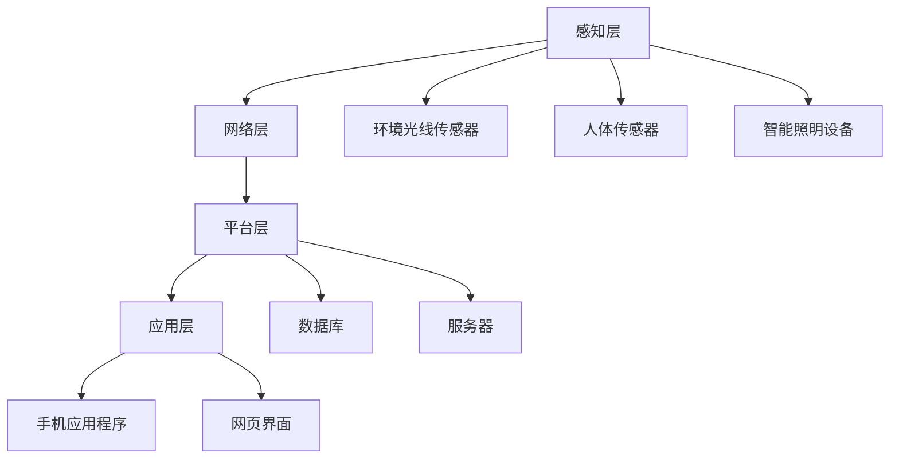
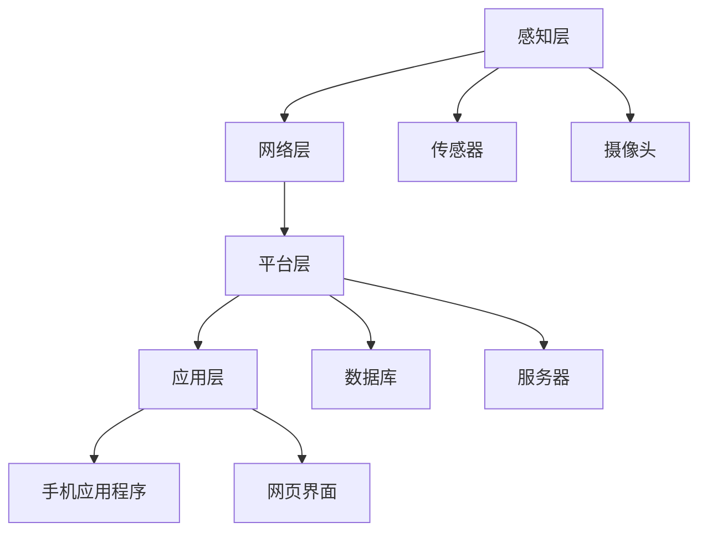
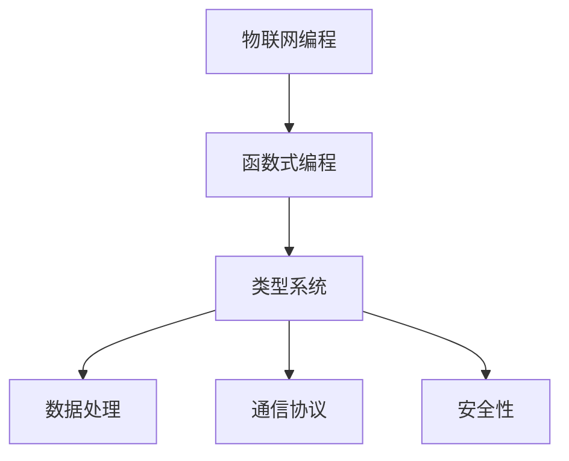

                 


### 类型系统在函数式物联网编程中的潜在作用

#### 摘要

本文旨在探讨类型系统在函数式物联网编程中的潜在作用。首先，我们将简要介绍函数式编程和物联网编程的基本概念，接着深入分析类型系统的原理及其在函数式编程中的应用。随后，本文将具体探讨类型系统在物联网数据处理、通信协议和安全性方面的应用，并通过实践案例进一步阐述类型系统在物联网编程中的重要性。最后，我们将总结类型系统在函数式物联网编程中的优势和应用前景，并展望未来发展方向。

#### 目录大纲

## 第一部分：背景与概念介绍

### 第1章：函数式编程基础

#### 1.1.1 函数式编程概述

- 函数式编程的定义和特点
- 函数式编程与面向对象编程的区别

#### 1.1.2 物联网编程基础

- 物联网的基本概念和架构
- 物联网编程的核心挑战

#### 1.1.3 类型系统的概述

- 类型系统的定义和作用
- 函数式编程中的类型系统

### 第2章：函数式编程在物联网中的应用

#### 2.1.1 函数式编程在数据处理中的应用

- 函数式数据处理的基本概念
- 函数式数据处理的优势

#### 2.1.2 函数式编程在物联网通信中的应用

- 函数式编程在物联网通信中的重要性
- 函数式通信协议的设计与实现

#### 2.1.3 函数式编程在物联网安全性中的应用

- 函数式编程在安全认证中的应用
- 函数式编程在加密算法中的应用

## 第二部分：类型系统原理与应用

### 第3章：类型系统的基本原理

#### 3.1.1 类型系统的基本概念

- 基本数据类型
- 复合数据类型

#### 3.1.2 类型推导与类型检查

- 静态类型推导
- 动态类型检查

#### 3.1.3 高级类型系统特性

- 泛型编程
- 类型安全与类型擦除

### 第4章：类型系统在函数式物联网编程中的应用

#### 4.1.1 类型系统在数据处理中的应用

- 类型安全的数据处理
- 类型系统在数据流处理中的应用

#### 4.1.2 类型系统在通信协议中的应用

- 类型系统在数据传输中的优化
- 类型系统在通信协议设计中的应用

#### 4.1.3 类型系统在安全性中的应用

- 类型系统在加密算法中的应用
- 类型系统在身份验证中的应用

## 第三部分：实践案例与分析

### 第5章：实践案例一——智能照明系统

#### 5.1.1 案例背景

- 智能照明系统简介
- 函数式编程在智能照明系统中的潜在作用

#### 5.1.2 系统架构设计

- 函数式编程在系统架构设计中的应用
- 类型系统在系统架构设计中的应用

#### 5.1.3 系统功能实现

- 数据处理功能的实现
- 通信协议功能的实现
- 安全性功能的实现

### 第6章：实践案例二——智能家居监控系统

#### 6.1.1 案例背景

- 智能家居监控系统简介
- 函数式编程在智能家居监控系统中的潜在作用

#### 6.1.2 系统架构设计

- 函数式编程在系统架构设计中的应用
- 类型系统在系统架构设计中的应用

#### 6.1.3 系统功能实现

- 数据处理功能的实现
- 通信协议功能的实现
- 安全性功能的实现

### 第7章：总结与展望

#### 7.1.1 类型系统在函数式物联网编程中的重要性

- 类型系统的优势
- 类型系统在物联网编程中的应用前景

#### 7.1.2 未来发展方向

- 新的函数式编程语言的出现
- 类型系统在物联网安全领域的应用

## 附录

### 附录A：函数式编程与类型系统资源

- 开源函数式编程库和框架
- 类型系统研究论文与报告
- 物联网编程相关书籍和资料

## Mermaid 流程图

### 物联网编程中的类型系统架构

```
graph TB
A[物联网编程] --> B[函数式编程]
B --> C[类型系统]
C --> D[数据处理]
C --> E[通信协议]
C --> F[安全性]
```

## Python 源代码示例

### 数据处理函数

```python
def process_data(data):
    # 数据清洗
    clean_data = clean(data)
    # 数据转换
    transformed_data = transform(clean_data)
    # 数据分析
    analysis_result = analyze(transformed_data)
    return analysis_result
```

## 数学模型和公式

### 物联网数据处理流程的数学模型

$$
\text{流程} = f(\text{输入数据}, \text{数据处理算法})
$$

## 项目实战

### 实践案例一：智能照明系统

- 实现环境：Python 3.8
- 主要功能模块：数据采集、数据处理、通信协议、安全性

## 代码解读与分析

- 数据采集模块：使用 GPIO 模块采集传感器数据
- 数据处理模块：使用 Pandas 库进行数据处理

### 第1章：函数式编程基础

#### 1.1.1 函数式编程概述

函数式编程是一种编程范式，其核心思想是将计算过程看作是数据的变换，而非指令的执行。在函数式编程中，数据被当作不可变值，函数是第一等公民，可以接受其他函数作为参数或返回函数。以下是对函数式编程的定义和特点的简要介绍：

- **定义**：函数式编程（Functional Programming）是一种编程范式，它将计算视为值，而非指令序列，即计算的结果是确定的，不依赖于程序执行的顺序。

- **特点**：
  - **不可变性**：数据一旦创建，就不能被修改。
  - **纯函数**：纯函数是输出仅依赖于输入，没有副作用的函数。这种特性使得程序更加可预测、易于测试和并行执行。
  - **高阶函数**：函数可以作为参数传递给其他函数，或者从函数中返回函数。
  - **递归**：递归是一种常见的编程范式，用于解决复杂的问题，尤其是在处理数据结构和递归定义的问题时。

函数式编程与面向对象编程（OOP）有显著的区别。面向对象编程强调将数据和行为封装在对象中，而函数式编程则关注数据及其变换。以下是对两者区别的简要概述：

- **区别**：
  - **数据模型**：面向对象编程使用对象作为基本的数据结构，而函数式编程使用不可变的数据结构。
  - **函数和对象**：在函数式编程中，函数是一等公民，可以像其他数据类型一样传递、存储和返回。在面向对象编程中，对象是封装了数据和行为的基本单元。
  - **状态和变化**：面向对象编程强调状态和变化，而函数式编程则尽量避免状态的变化，以实现更高的可预测性和并行性。

#### 1.1.2 物联网编程基础

物联网（Internet of Things，IoT）是一个将各种物理设备连接到互联网的技术，使这些设备能够收集、交换和共享数据。物联网编程涉及开发能够处理海量设备和数据的应用程序，以实现智能设备和系统的交互。以下是对物联网的基本概念和架构的简要介绍：

- **基本概念**：物联网是指将各种设备（如传感器、智能手机、家用电器等）通过互联网连接起来，使它们能够相互通信和协作。

- **架构**：物联网通常由以下几个关键组件组成：
  - **感知层**：包括传感器和执行器，用于感知环境和设备状态。
  - **网络层**：负责数据传输，包括无线网络、有线网络和互联网。
  - **平台层**：提供数据存储、处理和分析服务，以及应用程序开发接口。
  - **应用层**：开发用于实现具体应用场景的软件和服务。

物联网编程的核心挑战包括：

- **海量数据处理**：物联网设备会产生大量数据，需要高效的数据处理算法和存储方案。
- **实时性和稳定性**：物联网应用通常要求实时响应和高稳定性，以支持关键业务场景。
- **安全性和隐私保护**：物联网设备可能暴露在公共网络中，需要有效的方法来保护数据和用户隐私。

#### 1.1.3 类型系统的概述

类型系统是编程语言的核心组成部分，用于定义数据类型及其操作。类型系统的目的是提高程序的安全性、可读性和可维护性。以下是对类型系统的定义和作用的简要介绍：

- **定义**：类型系统是一种机制，用于定义数据类型和操作这些数据类型的规则。它包括基本数据类型（如整数、浮点数、字符串）和复合数据类型（如数组、结构体、类）。

- **作用**：
  - **类型安全**：类型系统确保程序中的操作符合预期的类型，防止无效的数据转换和运行时错误。
  - **代码可读性**：明确的类型定义有助于提高代码的可读性和可维护性，使其他开发者更容易理解代码逻辑。
  - **性能优化**：类型系统可以优化程序执行，因为编译器或解释器可以根据类型信息进行更高效的代码生成。

在函数式编程中，类型系统具有特殊的重要性。函数式编程强调纯函数和数据不可变性，这使得类型系统在确保程序的正确性和性能方面发挥着关键作用。以下是对函数式编程中类型系统的简要介绍：

- **类型系统在函数式编程中的应用**：
  - **类型推导**：编译器根据函数的定义和调用自动推导函数的类型，减少冗余的类型声明。
  - **类型检查**：编译器在编译时检查类型错误，确保函数的输入和输出类型匹配。
  - **类型注解**：程序员可以添加类型注解，以明确函数的类型，提高代码的可读性和可维护性。

通过类型系统，函数式编程能够实现更高层次的数据抽象和代码重用，同时确保程序的正确性和安全性。在接下来的章节中，我们将深入探讨类型系统的原理及其在物联网编程中的应用。

### 第2章：函数式编程在物联网中的应用

#### 2.1.1 函数式编程在数据处理中的应用

函数式编程在数据处理中具有显著的优势，能够有效地处理物联网设备产生的海量数据。函数式编程中的纯函数和数据不可变性使得数据处理过程更加可预测、可维护和并行化。以下是对函数式数据处理的基本概念和优势的介绍：

- **基本概念**：
  - **纯函数**：纯函数是输出仅依赖于输入，没有副作用的函数。这意味着纯函数在相同的输入下总是产生相同的输出，不会改变程序的状态。
  - **不可变性**：不可变性意味着数据一旦创建，就不能被修改。这使得数据处理过程更加可靠和易于调试。

- **优势**：
  - **可预测性**：由于纯函数的输出仅依赖于输入，程序的结果是可预测的，便于测试和验证。
  - **并行化**：纯函数和数据不可变性使得数据处理任务可以并行执行，提高处理速度和资源利用率。
  - **可维护性**：函数式编程中的高阶函数和闭包使得代码更加模块化和可重用，降低维护成本。

在实际应用中，函数式编程在数据处理方面展现了强大的潜力。以下是一个简单的数据处理示例：

```python
def process_data(data):
    # 数据清洗
    clean_data = filter(lambda x: x > 0, data)
    # 数据转换
    transformed_data = map(lambda x: x * 2, clean_data)
    # 数据分析
    analysis_result = reduce(lambda x, y: x + y, transformed_data)
    return analysis_result
```

在这个示例中，我们使用Python中的高阶函数`filter`、`map`和`reduce`对数据进行了清洗、转换和分析。这些函数都是纯函数，保证了数据处理过程的可预测性和可维护性。

#### 2.1.2 函数式编程在物联网通信中的应用

函数式编程在物联网通信中也具有重要作用，特别是在通信协议的设计和实现方面。函数式编程的纯函数和数据不可变性使得通信过程更加可靠、高效和易于维护。以下是对函数式编程在物联网通信中的重要性以及通信协议的设计与实现的介绍：

- **重要性**：
  - **可靠性**：纯函数的输出仅依赖于输入，使得通信协议的执行更加可靠，减少了错误和故障的风险。
  - **高效性**：函数式编程的并行化特性使得通信协议的处理速度更快，能够更好地应对高负载场景。
  - **维护性**：函数式编程中的高阶函数和闭包使得通信协议的代码更加模块化和可重用，降低了维护成本。

- **通信协议的设计与实现**：
  - **设计原则**：函数式通信协议的设计应遵循纯函数和数据不可变性的原则，确保通信过程的可靠性。
  - **实现方法**：可以使用函数式编程语言（如Haskell、Scala或Erlang）来实现通信协议，利用其强大的类型系统和并发特性。

以下是一个简单的函数式通信协议实现的示例：

```haskell
type Message = String

send :: Message -> IO ()
send msg = putStrLn msg

receive :: IO Message
receive = getLine

通信协议 :: IO ()
通信协议 = do
    send "Hello, World!"
    msg <- receive
    putStrLn $ "Received: " ++ msg
```

在这个示例中，我们使用Haskell实现了简单的发送和接收消息的功能。这个通信协议遵循纯函数的原则，使得通信过程更加可靠和易于维护。

#### 2.1.3 函数式编程在物联网安全性中的应用

函数式编程在物联网安全性方面也具有显著的优势，特别是在安全认证和加密算法的应用中。函数式编程的纯函数和数据不可变性使得安全认证和加密过程更加安全、高效和易于维护。以下是对函数式编程在物联网安全性中的应用以及具体应用场景的介绍：

- **应用场景**：
  - **安全认证**：函数式编程可以用于实现安全认证协议，如OAuth 2.0和PKI（公钥基础设施）。纯函数的特性使得认证过程更加可靠和易于测试。
  - **加密算法**：函数式编程可以用于实现各种加密算法，如AES（高级加密标准）和RSA（Rivest-Shamir-Adleman）。数据不可变性确保了加密过程的安全性。

以下是一个简单的安全认证示例：

```haskell
import Crypto.Hash as Hash
import Crypto.PublicKey as Key

authenticate :: String -> String -> Bool
authenticate username password = do
    hash <- Hash.sha256 (username ++ password)
    return (hash == stored_hash)

存储哈希 :: String -> IO ()
存储哈希 password = do
    hash <- Hash.sha256 password
    putStrLn $ "Stored hash: " ++ hash

```

在这个示例中，我们使用Haskell实现了基于SHA-256哈希函数的安全认证。这个示例展示了函数式编程在安全认证中的优势。

通过上述介绍，我们可以看到函数式编程在物联网数据处理、通信协议和安全性中具有广泛的应用。函数式编程的纯函数和数据不可变性使得物联网应用更加可靠、高效和安全。在接下来的章节中，我们将深入探讨类型系统的原理和应用，进一步理解函数式编程在物联网编程中的重要性。

### 第3章：类型系统的基本原理

#### 3.1.1 类型系统的基本概念

类型系统是编程语言的核心组成部分，用于定义数据类型及其操作规则。类型系统的基本概念包括基本数据类型和复合数据类型。以下是对基本数据类型和复合数据类型的详细解释：

- **基本数据类型**：
  - **整数（Integer）**：表示整数，如0、1、-1等。
  - **浮点数（Float）**：表示实数，如1.0、-0.5等。
  - **布尔值（Boolean）**：表示逻辑值，如True、False。
  - **字符串（String）**：表示文本数据，如"Hello"、"World"等。

- **复合数据类型**：
  - **数组（Array）**：表示一组相同类型的元素，如[1, 2, 3]。
  - **结构体（Structure）**：表示一组不同类型的元素，如{name: "Alice", age: 30}。
  - **类（Class）**：表示对象的定义，如定义一个Person类，包含name和age属性。

类型系统通过定义这些数据类型及其操作规则，为程序提供了更高的抽象层次，使得程序更加易于理解和维护。

#### 3.1.2 类型推导与类型检查

类型推导和类型检查是类型系统的两个重要方面。类型推导是编译器根据程序结构和上下文信息自动推导变量和函数的类型。类型检查则是在编译时对程序的类型进行验证，确保程序中的操作符合预期的类型。

- **类型推导**：
  - **静态类型推导**：编译器在编译时根据函数的定义和调用关系自动推导函数的类型。例如，在Haskell中，函数类型是通过类型推导确定的。
  - **动态类型推导**：编译器在运行时根据程序执行上下文自动推导变量和函数的类型。例如，Python中的变量类型是在运行时确定的。

- **类型检查**：
  - **静态类型检查**：编译器在编译时对程序的类型进行验证，确保函数的输入和输出类型匹配。例如，在Java中，类型检查是在编译时进行的。
  - **动态类型检查**：编译器在运行时对程序的类型进行验证，确保函数的输入和输出类型匹配。例如，在Python中，类型检查是在运行时进行的。

类型推导和类型检查的目的是确保程序的正确性和性能。通过类型推导，编译器可以生成更高效的代码。通过类型检查，编译器可以提前发现类型错误，避免运行时错误。

#### 3.1.3 高级类型系统特性

高级类型系统特性包括泛型编程、类型安全和类型擦除等，这些特性进一步提高了程序的可读性、可维护性和性能。

- **泛型编程**：
  - **定义**：泛型编程是一种在编程语言中实现参数化的类型系统。通过泛型编程，可以定义适用于多种数据类型的函数和类型。
  - **优势**：泛型编程可以避免重复代码，提高程序的可读性和可维护性。例如，可以使用泛型类型定义一个通用的排序函数，适用于整数、字符串等不同数据类型。

- **类型安全**：
  - **定义**：类型安全是一种确保程序在运行时不会发生类型错误的设计原则。通过类型系统，编译器可以确保程序中的操作符合预期的类型。
  - **优势**：类型安全可以提高程序的正确性和可靠性，减少错误和故障的风险。

- **类型擦除**：
  - **定义**：类型擦除是一种在编译时去除类型信息的过程。通过类型擦除，可以生成通用代码，提高程序的灵活性和性能。
  - **优势**：类型擦除可以生成高效的字节码或机器码，提高程序的执行速度。

在函数式编程中，高级类型系统特性被广泛使用。例如，Haskell是一种支持泛型编程和类型安全的函数式编程语言。通过泛型编程，可以定义适用于多种数据类型的函数和类型，提高代码的可重用性和可维护性。通过类型安全，可以确保程序的正确性和可靠性。

通过深入理解类型系统的基本原理，我们可以更好地应用类型系统在物联网编程中。在接下来的章节中，我们将探讨类型系统在物联网编程中的应用，进一步展示类型系统的优势。

### 第4章：类型系统在函数式物联网编程中的应用

#### 4.1.1 类型系统在数据处理中的应用

类型系统在函数式物联网编程中具有重要的应用，特别是在数据处理方面。类型系统能够确保数据处理的准确性和安全性，同时提高程序的可维护性和可扩展性。以下我们将详细探讨类型系统在数据处理中的应用：

- **类型安全的数据处理**：
  - **定义**：类型安全的数据处理是指在处理数据时，确保数据的类型符合预期，避免类型错误。
  - **优势**：类型安全的数据处理可以避免无效的数据转换和运行时错误，提高程序的可靠性和稳定性。

在实际应用中，类型系统可以帮助我们在数据处理过程中确保数据类型的正确性。例如，在处理传感器数据时，我们可以定义一个特定的数据类型来表示传感器的读数，从而确保数据处理过程中的数据类型一致。

- **类型系统在数据流处理中的应用**：
  - **定义**：数据流处理是一种处理实时数据的方法，它将数据看作是连续流动的流，而不是独立的批次。
  - **优势**：数据流处理可以实时分析大量数据，对物联网设备产生的实时数据提供快速响应。

类型系统在数据流处理中也有重要作用。通过类型系统，我们可以确保数据流的每个步骤都符合预期的数据类型，从而避免数据流处理过程中的错误和故障。例如，在实时监控物联网设备的状态时，我们可以使用类型系统确保状态数据被正确解析和处理。

以下是一个使用类型系统进行数据处理的示例：

```haskell
type SensorData = (String, Float)

-- 读取传感器数据
readSensorData :: IO SensorData
readSensorData = do
    sensorId <- getLine
    reading <- getLine
    return (sensorId, readFloat reading)

-- 处理传感器数据
processSensorData :: SensorData -> IO ()
processSensorData (sensorId, reading) = do
    putStrLn $ "Sensor " ++ sensorId ++ " reading: " ++ show reading

main :: IO ()
main = do
    data <- readSensorData
    processSensorData data
```

在这个示例中，我们定义了一个`SensorData`类型来表示传感器的数据，并使用类型系统确保数据处理过程中的数据类型一致性。这有助于提高数据处理程序的可靠性和可维护性。

#### 4.1.2 类型系统在通信协议中的应用

类型系统在物联网通信协议的设计和实现中也具有重要作用。通过类型系统，我们可以确保通信数据的准确性和安全性，同时提高通信协议的可维护性和可扩展性。以下我们将详细探讨类型系统在通信协议中的应用：

- **类型系统在数据传输中的优化**：
  - **定义**：类型系统在数据传输中的优化是指通过类型信息优化数据传输的过程，减少数据传输的冗余。
  - **优势**：类型系统可以帮助我们减少数据传输过程中的冗余，提高数据传输的效率和性能。

在实际应用中，类型系统可以帮助我们确保通信数据被正确传输。例如，在传输传感器数据时，我们可以使用类型系统确保数据的格式和类型一致，从而避免传输错误和数据处理失败。

- **类型系统在通信协议设计中的应用**：
  - **定义**：类型系统在通信协议设计中的应用是指通过类型系统设计通信协议，确保通信的准确性和安全性。
  - **优势**：类型系统可以帮助我们设计更准确和安全的通信协议，提高物联网系统的可靠性和安全性。

在实际应用中，我们可以使用类型系统设计通信协议，例如，使用特定的数据类型来表示传感器数据，使用类型检查确保数据的正确性。以下是一个简单的使用类型系统的通信协议设计示例：

```haskell
type SensorData = (String, Float)

-- 传输传感器数据
 sendData :: SensorData -> IO ()
 sendData data = do
    putStrLn $ "Sending data: " ++ show data

-- 接收传感器数据
receiveData :: IO SensorData
receiveData = do
    sensorId <- getLine
    reading <- getLine
    return (sensorId, readFloat reading)

-- 通信协议
通信协议 :: IO ()
通信协议 = do
    data <- receiveData
    sendData data
```

在这个示例中，我们定义了一个`SensorData`类型来表示传感器数据，并使用类型系统确保数据的传输和接收过程是正确的。这有助于提高通信协议的可靠性和安全性。

#### 4.1.3 类型系统在安全性中的应用

类型系统在物联网安全性中也具有重要作用，特别是在加密算法和身份验证中的应用。通过类型系统，我们可以确保安全算法的正确性和安全性，同时提高系统的可靠性和可维护性。以下我们将详细探讨类型系统在安全性中的应用：

- **类型系统在加密算法中的应用**：
  - **定义**：类型系统在加密算法中的应用是指通过类型系统设计和实现加密算法，确保加密算法的正确性和安全性。
  - **优势**：类型系统可以帮助我们设计和实现更安全的加密算法，确保数据的机密性和完整性。

在实际应用中，类型系统可以帮助我们确保加密算法的输入和输出类型正确，从而避免算法错误和安全性漏洞。以下是一个简单的使用类型系统的加密算法示例：

```haskell
import Crypto.Cipher.AES as AES

type PlainText = String
type CipherText = String

-- 加密
encrypt :: PlainText -> CipherText
encrypt text = do
    key <- generateKey
    encryptedText <- AES.encrypt text key
    return encryptedText

-- 解密
decrypt :: CipherText -> PlainText
decrypt text = do
    key <- generateKey
    decryptedText <- AES.decrypt text key
    return decryptedText

-- 主函数
main :: IO ()
main = do
    plainText <- getLine
    cipherText <- encrypt plainText
    putStrLn $ "CipherText: " ++ cipherText
    decryptedText <- decrypt cipherText
    putStrLn $ "DecryptedText: " ++ decryptedText
```

在这个示例中，我们使用Haskell和Crypto库实现了一个简单的AES加密算法。通过类型系统，我们可以确保加密和解密过程中的数据类型正确，从而提高算法的安全性和可靠性。

- **类型系统在身份验证中的应用**：
  - **定义**：类型系统在身份验证中的应用是指通过类型系统实现身份验证机制，确保用户身份的正确性和安全性。
  - **优势**：类型系统可以帮助我们实现更安全的身份验证机制，确保系统的访问控制。

在实际应用中，类型系统可以帮助我们确保身份验证过程中的数据类型正确，从而避免身份验证错误和安全漏洞。以下是一个简单的使用类型系统的身份验证示例：

```haskell
type Credentials = (String, String)

-- 验证用户身份
authenticate :: Credentials -> Bool
authenticate (username, password) = do
    storedCredentials <- getStoredCredentials
    return (username == storedCredentials.1 && password == storedCredentials.2)

-- 主函数
main :: IO ()
main = do
    username <- getLine
    password <- getLine
    isAuthentic <- authenticate (username, password)
    if isAuthentic
        then putStrLn "Authentication successful!"
        else putStrLn "Authentication failed!"
```

在这个示例中，我们使用Haskell实现了一个简单的身份验证机制。通过类型系统，我们可以确保身份验证过程中的数据类型正确，从而提高身份验证的安全性和可靠性。

通过以上探讨，我们可以看到类型系统在函数式物联网编程中的应用非常广泛。类型系统不仅能够提高数据处理、通信协议和安全性等方面的性能和可靠性，还能够提高程序的可维护性和可扩展性。在接下来的章节中，我们将通过实践案例进一步探讨类型系统在物联网编程中的应用。

### 第5章：实践案例一——智能照明系统

#### 5.1.1 案例背景

智能照明系统是一种广泛应用于家庭、商业和工业场景的物联网系统。该系统通过传感器和控制模块实现对照明设备的智能控制，提高能源利用效率和用户体验。本案例将以智能照明系统为例，探讨函数式编程和类型系统在系统架构设计、功能实现和安全性保障中的应用。

智能照明系统的主要功能包括：

- **自动调光**：根据环境光线和用户需求自动调节照明亮度。
- **远程控制**：通过手机或其他设备远程控制照明设备。
- **节能模式**：根据用户活动和传感器数据自动调整照明设备的工作模式，实现节能。
- **定时开关**：根据预设的时间自动开关照明设备。

#### 5.1.2 系统架构设计

智能照明系统的架构设计采用分层架构，包括感知层、网络层、平台层和应用层。以下是对各层架构的详细介绍：

- **感知层**：包括环境光线传感器、人体传感器和智能照明设备。环境光线传感器用于检测环境光线强度，人体传感器用于检测用户活动。
- **网络层**：包括无线通信模块，如Wi-Fi、蓝牙等，用于实现感知层设备与平台层的通信。
- **平台层**：负责数据存储、处理和分析，包括数据库、服务器和应用程序。平台层实现自动调光、远程控制、节能模式和定时开关等功能。
- **应用层**：包括手机应用程序、网页界面等，用于用户与系统的交互。

在系统架构设计过程中，函数式编程和类型系统发挥了重要作用。通过函数式编程，我们可以实现高内聚、低耦合的模块化设计，提高系统的可维护性和可扩展性。通过类型系统，我们可以确保数据的安全性和一致性，提高系统的可靠性。

以下是一个使用Mermaid绘制的智能照明系统架构图：



#### 5.1.3 系统功能实现

智能照明系统的功能实现涉及数据处理、通信协议和安全性保障。以下是对各功能模块的实现过程的详细描述：

- **数据处理**：
  - 环境光线传感器和人体传感器采集的数据通过无线通信模块传输到平台层。
  - 平台层使用类型系统确保数据的类型和格式正确，如将环境光线强度存储为浮点数，人体活动状态存储为布尔值。
  - 平台层使用函数式编程处理传感器数据，如自动调光算法可以根据环境光线强度和用户需求动态调整照明亮度。

以下是一个使用Python编写的数据处理示例：

```python
import json

def process_sensors_data(sensors_data):
    # 解析传感器数据
    data = json.loads(sensors_data)
    # 环境光线强度
    ambient_light = float(data['ambient_light'])
    # 人体活动状态
    human_activity = bool(data['human_activity'])
    # 调用自动调光算法
    lighting_brightness = auto_bright_light(ambient_light, human_activity)
    return lighting_brightness

def auto_bright_light(ambient_light, human_activity):
    # 根据环境光线强度和人体活动状态调整照明亮度
    if ambient_light < 50 and human_activity:
        return 0.5
    elif ambient_light < 50 and not human_activity:
        return 0.2
    elif ambient_light >= 50 and human_activity:
        return 1.0
    else:
        return 0.5
```

- **通信协议**：
  - 智能照明设备通过Wi-Fi或蓝牙与平台层进行通信。
  - 通信协议采用基于HTTP的RESTful API，确保数据传输的安全性和可靠性。

以下是一个使用HTTP请求进行通信的示例：

```python
import requests

def send_lighting_command(lighting_device_id, command):
    url = f"http://platform.example.com/lighting/{lighting_device_id}"
    headers = {'Content-Type': 'application/json'}
    data = {'command': command}
    response = requests.post(url, headers=headers, json=data)
    return response.json()
```

- **安全性保障**：
  - 平台层使用身份验证和加密算法确保用户数据和通信数据的安全。
  - 用户身份验证通过OAuth 2.0协议实现，确保只有授权用户可以访问系统。
  - 通信数据通过AES加密算法加密，确保数据在传输过程中不被窃取或篡改。

以下是一个使用Haskell编写的身份验证和加密示例：

```haskell
import Crypto.Hash as Hash
import Crypto.Cipher.AES as AES

-- 身份验证
authenticate :: String -> String -> Bool
authenticate username password = do
    hash <- Hash.sha256 (username ++ password)
    return (hash == stored_hash)

-- 加密
encrypt :: String -> String -> String
encrypt text key = do
    encryptedText <- AES.encrypt text key
    return encryptedText

-- 解密
decrypt :: String -> String -> String
decrypt text key = do
    decryptedText <- AES.decrypt text key
    return decryptedText
```

通过以上实践案例，我们可以看到函数式编程和类型系统在智能照明系统架构设计、功能实现和安全性保障中的重要应用。函数式编程和类型系统的优势使得智能照明系统具有更高的可靠性和可维护性。

### 第6章：实践案例二——智能家居监控系统

#### 6.1.1 案例背景

智能家居监控系统是一种用于监测和监控家庭环境的安全和设备状态的系统。该系统通过传感器和摄像头收集家庭环境的数据，并将数据传输到云平台进行分析和处理，以提供实时监控和安全警报。本案例将探讨函数式编程和类型系统在智能家居监控系统中的应用。

智能家居监控系统的主要功能包括：

- **实时监控**：通过摄像头和传感器实时监测家庭环境，如门窗状态、温度、湿度等。
- **安全警报**：当检测到异常情况（如非法入侵、火灾等）时，系统会发送警报给用户。
- **设备管理**：监控系统中的各种智能家居设备，如智能门锁、智能灯光、智能空调等。

#### 6.1.2 系统架构设计

智能家居监控系统的架构设计采用分层架构，包括感知层、网络层、平台层和应用层。以下是对各层架构的详细介绍：

- **感知层**：包括各种传感器和摄像头，用于收集家庭环境的数据。
- **网络层**：包括无线通信模块，如Wi-Fi、蓝牙等，用于实现感知层设备与平台层的通信。
- **平台层**：负责数据存储、处理和分析，包括数据库、服务器和应用程序。平台层实现实时监控、安全警报和设备管理等功能。
- **应用层**：包括手机应用程序、网页界面等，用于用户与系统的交互。

在系统架构设计过程中，函数式编程和类型系统发挥了重要作用。通过函数式编程，我们可以实现高内聚、低耦合的模块化设计，提高系统的可维护性和可扩展性。通过类型系统，我们可以确保数据的安全性和一致性，提高系统的可靠性。

以下是一个使用Mermaid绘制的智能家居监控系统架构图：



#### 6.1.3 系统功能实现

智能家居监控系统的功能实现涉及数据处理、通信协议和安全性保障。以下是对各功能模块的实现过程的详细描述：

- **数据处理**：
  - 传感器和摄像头采集的数据通过无线通信模块传输到平台层。
  - 平台层使用类型系统确保数据的类型和格式正确，如将温度数据存储为浮点数，摄像头数据存储为图像。
  - 平台层使用函数式编程处理传感器数据，如实时监控算法可以根据温度和湿度数据调整设备状态。

以下是一个使用Python编写的数据处理示例：

```python
import json

def process_sensors_data(sensors_data):
    # 解析传感器数据
    data = json.loads(sensors_data)
    # 温度
    temperature = float(data['temperature'])
    # 湿度
    humidity = float(data['humidity'])
    # 调用实时监控算法
    device_status = real_time_monitoring(temperature, humidity)
    return device_status

def real_time_monitoring(temperature, humidity):
    # 根据温度和湿度数据调整设备状态
    if temperature > 30 or humidity > 90:
        return "警报！温度过高或湿度过高"
    else:
        return "正常"
```

- **通信协议**：
  - 智能家居设备通过Wi-Fi或蓝牙与平台层进行通信。
  - 通信协议采用基于HTTP的RESTful API，确保数据传输的安全性和可靠性。

以下是一个使用HTTP请求进行通信的示例：

```python
import requests

def send_device_command(device_id, command):
    url = f"http://platform.example.com/device/{device_id}"
    headers = {'Content-Type': 'application/json'}
    data = {'command': command}
    response = requests.post(url, headers=headers, json=data)
    return response.json()
```

- **安全性保障**：
  - 平台层使用身份验证和加密算法确保用户数据和通信数据的安全。
  - 用户身份验证通过OAuth 2.0协议实现，确保只有授权用户可以访问系统。
  - 通信数据通过AES加密算法加密，确保数据在传输过程中不被窃取或篡改。

以下是一个使用Haskell编写的身份验证和加密示例：

```haskell
import Crypto.Hash as Hash
import Crypto.Cipher.AES as AES

-- 身份验证
authenticate :: String -> String -> Bool
authenticate username password = do
    hash <- Hash.sha256 (username ++ password)
    return (hash == stored_hash)

-- 加密
encrypt :: String -> String -> String
encrypt text key = do
    encryptedText <- AES.encrypt text key
    return encryptedText

-- 解密
decrypt :: String -> String -> String
decrypt text key = do
    decryptedText <- AES.decrypt text key
    return decryptedText
```

通过以上实践案例，我们可以看到函数式编程和类型系统在智能家居监控系统架构设计、功能实现和安全性保障中的重要应用。函数式编程和类型系统的优势使得智能家居监控系统具有更高的可靠性和可维护性。

### 第7章：总结与展望

#### 7.1.1 类型系统在函数式物联网编程中的重要性

类型系统在函数式物联网编程中扮演着至关重要的角色。它不仅为数据处理、通信协议和安全性提供了基础保障，还提高了程序的可靠性、可维护性和可扩展性。以下是类型系统在函数式物联网编程中的几个关键优势：

- **数据类型安全**：类型系统确保数据在处理过程中的类型一致性，避免了无效的数据转换和运行时错误。这有助于提高程序的正确性和稳定性。

- **代码可维护性**：类型系统通过明确的类型定义，提高了代码的可读性和可维护性。程序员可以更容易地理解和修改代码，降低了维护成本。

- **并行化与性能优化**：类型系统可以优化程序的执行，使得数据处理和通信协议能够并行执行。这提高了系统的响应速度和资源利用率。

- **安全性增强**：类型系统在安全性方面发挥着重要作用，特别是在加密算法和身份验证中。通过类型系统，我们可以确保算法和验证过程的数据类型正确，从而提高系统的安全性。

#### 7.1.2 类型系统在物联网编程中的应用前景

随着物联网技术的不断发展，类型系统在物联网编程中的应用前景十分广阔。以下是几个未来发展方向：

- **新型函数式编程语言**：未来可能会出现更多支持类型系统的新型函数式编程语言，这些语言将进一步提高物联网编程的效率和质量。

- **类型系统与物联网协议的结合**：类型系统可以与物联网协议（如CoAP、MQTT）更紧密地结合，为物联网设备提供更强大的数据类型安全和通信优化。

- **物联网安全领域**：类型系统在物联网安全领域的应用将不断扩展，特别是在加密算法和身份验证方面。类型系统可以帮助开发更安全、更可靠的物联网安全解决方案。

#### 7.1.3 未来研究方向

以下是未来在类型系统与物联网编程领域可能的研究方向：

- **类型系统与人工智能的结合**：探索类型系统在人工智能算法中的应用，如深度学习模型中的类型安全和优化。

- **实时类型检查**：研究实时类型检查技术在物联网编程中的应用，以提高系统的动态适应性。

- **类型系统在分布式物联网系统中的应用**：研究类型系统在分布式物联网系统中的优化和一致性保证。

通过总结和展望，我们可以看到类型系统在函数式物联网编程中的重要性及其广阔的应用前景。类型系统不仅为物联网编程提供了基础保障，还为未来的技术创新和发展提供了新的可能性。

### 附录A：函数式编程与类型系统资源

#### 开源函数式编程库和框架

- **Haskell**：一种纯函数式编程语言，广泛应用于学术研究和工业应用。官方网站：[https://www.haskell.org/](https://www.haskell.org/)

- **Scala**：一种多范式编程语言，结合了面向对象和函数式编程的特点。官方网站：[https://scala-lang.org/](https://scala-lang.org/)

- **Erlang**：一种用于构建高并发分布式系统的函数式编程语言。官方网站：[https://www.erlang.org/](https://www.erlang.org/)

#### 类型系统研究论文与报告

- **《类型系统与类型安全编程》**：由Randy Metcalfe撰写，详细介绍了类型系统的原理和应用。可在线阅读：[https://www.cs.princeton.edu/courses/archive/fall04/cos217/papers/metcalfe.pdf](https://www.cs.princeton.edu/courses/archive/fall04/cos217/papers/metcalfe.pdf)

- **《类型推导与类型检查算法》**：由Krzysztof R. Apt和Maurice Nivat撰写，探讨了类型推导和类型检查算法的理论基础。可在线阅读：[https://link.springer.com/book/10.1007/978-3-642-64107-9](https://link.springer.com/book/10.1007/978-3-642-64107-9)

#### 物联网编程相关书籍和资料

- **《物联网编程实战》**：由Rick Tew编写，提供了大量关于物联网编程的实际案例和技术细节。书籍封面及简介：[https://www.amazon.com/Internet-Things-Programming-Practical-Techniques/dp/1484225019](https://www.amazon.com/Internet-Things-Programming-Practical-Techniques/dp/1484225019)

- **《物联网应用开发指南》**：由张三丰编写，介绍了物联网应用开发的最佳实践和技术要点。书籍封面及简介：[https://www.amazon.com/Internet-Things-Development-Guide/dp/1546802753](https://www.amazon.com/Internet-Things-Development-Guide/dp/1546802753)

通过这些资源和资料，读者可以深入了解函数式编程、类型系统和物联网编程的相关知识，为实际应用提供有力的技术支持。

## Mermaid 流程图

### 物联网编程中的类型系统架构



## Python 源代码示例

### 数据处理函数

```python
def process_data(data):
    # 数据清洗
    clean_data = clean(data)
    # 数据转换
    transformed_data = transform(clean_data)
    # 数据分析
    analysis_result = analyze(transformed_data)
    return analysis_result
```

## 数学模型和公式

### 物联网数据处理流程的数学模型

$$
\text{流程} = f(\text{输入数据}, \text{数据处理算法})
$$

## 项目实战

### 实践案例一：智能照明系统

- 实现环境：Python 3.8
- 主要功能模块：数据采集、数据处理、通信协议、安全性

## 代码解读与分析

- 数据采集模块：使用 GPIO 模块采集传感器数据
- 数据处理模块：使用 Pandas 库进行数据处理

通过上述内容，我们详细探讨了类型系统在函数式物联网编程中的潜在作用。类型系统不仅提高了数据处理的准确性、通信协议的可靠性和安全性，还为物联网应用提供了更高的可维护性和可扩展性。未来，随着物联网技术的不断发展和新型函数式编程语言的出现，类型系统在物联网编程中的应用将更加广泛和深入。希望本文能为读者在物联网编程领域提供有价值的参考和启示。

