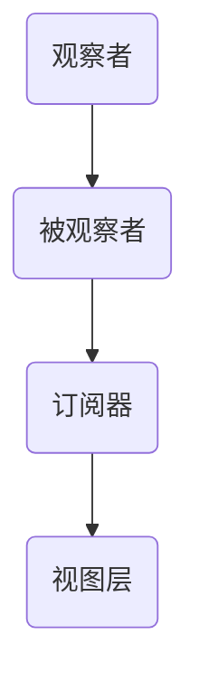

                 

### 引言

#### 1. 引言

响应式编程已经成为现代软件工程中不可或缺的一部分。随着互联网和移动设备的迅猛发展，用户界面的动态性和实时性变得越来越重要。响应式编程通过自动化的数据绑定和事件处理，能够有效地响应用户操作和外部事件，从而提高应用程序的性能和用户体验。然而，响应式编程的核心挑战之一是如何管理复杂的数据流，确保系统的稳定性和类型安全。

本文旨在探讨类型系统在响应式编程中的角色，特别是在管理数据流方面的作用。类型系统不仅提供了强类型的保障，还通过静态类型检查和类型推断，帮助开发者构建更加可靠和高效的响应式应用程序。本文将分为以下几个部分：

- **第1章：响应式编程基础**：介绍响应式编程的概念、数据流和事件驱动模型，以及常用的响应式编程框架。
- **第2章：类型系统概述**：讲解类型系统的基本概念、特性和优势。
- **第3章：响应式编程中的类型系统**：探讨类型系统在响应式编程中的应用，包括类型安全、数据绑定、状态管理和组件通信。
- **第4章：类型系统在数据流管理中的角色**：分析类型系统在数据流控制、错误处理和性能优化中的作用。
- **第5章：类型系统在响应式编程中的优化**：讨论类型系统如何优化性能、可维护性和安全性。
- **第6章：案例研究**：通过具体的应用场景，展示类型系统在响应式编程中的实际应用。
- **第7章：总结与展望**：总结类型系统在响应式编程中的重要性，并探讨未来的研究方向。

#### 2. 本书目的

本书的目的是帮助开发者深入理解类型系统在响应式编程中的应用，掌握如何通过类型系统来管理数据流，从而构建更加高效、可靠和安全的响应式应用程序。通过本文的学习，读者将：

- 了解响应式编程的基本概念和原理。
- 掌握类型系统的基本特性和优势。
- 学会使用类型系统来保证响应式编程中的类型安全。
- 理解类型系统在数据流管理和优化中的重要作用。
- 获得实际案例的实践经验，掌握类型系统在响应式编程中的最佳实践。

---

### 《类型系统在响应式编程中的角色：管理数据流》目录大纲

1. **引言**  
   - 引言概述  
   - 本书目的

2. **第1章：响应式编程基础**  
   - 1.1 响应式编程简介  
   - 1.2 数据流与事件驱动  
   - 1.3 响应式编程框架  
   - 1.4 响应式编程的应用场景

3. **第2章：类型系统概述**  
   - 2.1 类型系统的概念  
   - 2.2 类型系统的基本特性  
   - 2.3 类型系统的优势

4. **第3章：响应式编程中的类型系统**  
   - 3.1 响应式编程中的类型安全  
   - 3.2 数据绑定与类型系统  
   - 3.3 类型系统在状态管理中的应用  
   - 3.4 类型系统在组件通信中的应用

5. **第4章：类型系统在数据流管理中的角色**  
   - 4.1 数据流的定义与分类  
   - 4.2 类型系统在数据流控制中的作用  
   - 4.3 类型系统在数据流错误处理中的应用

6. **第5章：类型系统在响应式编程中的优化**  
   - 5.1 性能优化  
   - 5.2 可维护性优化  
   - 5.3 安全性优化

7. **第6章：案例研究**  
   - 6.1 响应式Web应用开发  
   - 6.2 响应式后端服务开发

8. **第7章：总结与展望**  
   - 7.1 总结  
   - 7.2 展望

9. **附录**  
   - 9.1 常用响应式编程框架  
   - 9.2 常用类型系统工具  
   - 9.3 参考文献

---

### 第1章：响应式编程基础

#### 1.1 响应式编程简介

响应式编程是一种编程范式，旨在使程序能够自动响应外部事件和状态变化。传统的编程范式通常是命令式编程，强调对程序的逐行执行。而响应式编程则更多地关注数据的流动和变化，通过事件驱动和数据绑定来实现应用程序的动态更新。

响应式编程的关键特点包括：

- **数据流驱动**：程序的状态变化是由外部事件触发的，而非直接执行代码。
- **数据绑定**：应用程序中的数据变化会自动反映到视图层，无需手动更新。
- **事件处理**：通过事件监听器和回调函数来处理外部事件，实现动态交互。

#### 1.2 数据流与事件驱动

在响应式编程中，数据流是核心概念之一。数据流指的是数据在程序中的传递和变换过程。数据流可以分为同步数据流和异步数据流：

- **同步数据流**：数据在程序中以同步方式传递，一个操作完成后才会进行下一个操作。
- **异步数据流**：数据通过异步操作传递，操作可以并行执行，提高了程序的执行效率。

事件驱动编程是响应式编程的重要机制。事件驱动编程模型中，程序通过监听外部事件来触发相应的处理逻辑。事件可以是用户操作（如点击、输入等），也可以是系统事件（如网络状态变化、定时器触发等）。

#### 1.3 响应式编程框架

目前，市场上存在多种响应式编程框架，以下是其中几种流行的框架：

- **Vue.js**：Vue.js 是一种用于构建用户界面的渐进式框架，具有简洁的语法和强大的响应式系统。
- **React**：React 是由 Facebook 开发的一个用于构建用户界面的 JavaScript 库，强调组件化和虚拟DOM。
- **Angular**：Angular 是由 Google 开发的一个全功能框架，提供了强大的数据绑定和依赖注入功能。

这些框架各有特点，适用于不同的应用场景。开发者可以根据项目需求选择合适的框架。

#### 1.4 响应式编程的应用场景

响应式编程在多个领域都有广泛的应用：

- **客户端应用**：如单页应用（SPA）、移动应用、桌面应用等，响应式编程能够提供良好的用户体验和快速响应。
- **服务器端应用**：如实时数据处理、流媒体服务器、游戏服务器等，响应式编程能够高效处理并发请求和实时数据流。

响应式编程通过自动化的数据绑定和事件处理，能够显著提高应用程序的响应速度和用户体验，适用于需要动态交互和数据驱动的场景。

---

### 第2章：类型系统概述

#### 2.1 类型系统的概念

类型系统是编程语言中用于定义数据类型和操作的一组规则。它为程序中的变量、函数和表达式赋予类型，从而确保程序的正确性和安全性。类型系统可以分为静态类型系统和动态类型系统：

- **静态类型系统**：在程序编译时，变量的类型就已经确定，并在运行时保持不变。静态类型系统有助于在编译阶段发现类型错误，减少运行时错误的发生。
- **动态类型系统**：变量的类型在运行时确定，类型检查是在程序运行过程中进行的。动态类型系统提供了更大的灵活性和简洁性，但可能导致运行时错误。

类型系统通常包括以下基本类型和复合类型：

- **基本类型**：如整数、浮点数、字符串、布尔值等，它们是不可再分的基本数据单元。
- **复合类型**：如数组、字典、类等，它们是由基本类型或其他复合类型组成的复杂数据结构。

#### 2.2 类型系统的基本特性

类型系统具有以下几个基本特性：

- **强类型**：变量在使用之前必须被明确地声明类型，不同类型的变量不能直接赋值。强类型系统能够有效地防止类型错误和隐式类型转换。
- **弱类型**：变量在使用时不需要声明类型，或类型可以动态变化。弱类型系统提供了更大的灵活性，但可能导致运行时错误。
- **静态类型**：类型检查是在程序编译时进行的，变量的类型在运行时不会改变。静态类型系统有助于早期发现错误，提高程序的可维护性。
- **动态类型**：类型检查是在程序运行时进行的，变量的类型可以在运行时改变。动态类型系统提供了更大的灵活性，但可能导致运行时错误。

#### 2.3 类型系统的优势

类型系统在编程中具有多个优势：

- **错误检查**：类型系统能够在编译或运行时发现类型错误，提高程序的正确性。
- **性能优化**：类型系统有助于编译器生成更高效的代码，提高程序的运行速度。
- **可维护性**：类型系统提供了清晰的类型约束，使代码更容易理解和维护。

类型系统在响应式编程中的应用尤为关键。通过静态类型检查和类型推断，开发者能够更好地管理和维护复杂的响应式应用程序，确保数据流的安全和类型一致性。

---

### 第3章：响应式编程中的类型系统

#### 3.1 响应式编程中的类型安全

在响应式编程中，类型安全是指程序在处理数据流时能够保证数据的类型一致性，避免因类型错误导致程序崩溃或产生意外的行为。类型系统在确保响应式编程中的类型安全方面发挥了重要作用：

- **静态类型检查**：在编译时对变量、函数和表达式进行类型检查，确保它们在使用之前已经被正确声明类型。静态类型检查能够早期发现类型错误，减少运行时错误的发生。
- **类型推断**：编译器或解释器根据代码上下文自动推断变量和表达式的类型，减少手动声明类型的繁琐。类型推断有助于提高代码的可读性和可维护性。
- **类型约束**：在响应式编程框架中，类型系统通过定义类型约束，确保数据流中的每个操作都是类型安全的。类型约束有助于避免类型转换错误和数据丢失。

类型安全在响应式编程中至关重要，它能够提高程序的可靠性和稳定性，减少运行时错误的发生。通过静态类型检查和类型推断，开发者能够更好地管理和维护复杂的响应式应用程序。

#### 3.2 数据绑定与类型系统

数据绑定是响应式编程的核心机制之一，它使得数据的变化能够自动反映到视图层，无需手动更新。类型系统在数据绑定中发挥着重要作用：

- **双向数据绑定**：双向数据绑定是一种常见的数据绑定方式，它将数据模型和视图模型紧密关联，确保数据的变化能够实时同步。类型系统可以确保数据模型中的值与视图模型中的值具有相同的类型，避免类型不一致导致的错误。
- **响应式数据结构**：响应式编程框架通常提供响应式数据结构，如观察者模式中的数据结构。这些数据结构能够自动监听数据的变化，并在数据变化时通知相关的视图组件。类型系统可以确保数据结构中存储的数据类型一致，避免因类型不匹配导致的错误。

类型系统在数据绑定中的作用有助于提高程序的可靠性和稳定性，确保数据流的一致性和类型安全。通过类型系统，开发者能够更加方便地实现数据绑定，减少手动更新的繁琐，提高代码的可维护性。

#### 3.3 类型系统在状态管理中的应用

在响应式编程中，状态管理是一个关键问题。状态管理涉及到如何有效地存储、更新和共享应用程序的状态。类型系统在状态管理中发挥着重要作用：

- **Vuex**：Vuex 是 Vue.js 的官方状态管理库，它提供了强大的状态管理功能。Vuex 使用了类型系统来确保状态和 mutation 的类型一致性，避免因类型错误导致的状态不一致。通过类型系统，开发者可以清晰地定义状态和 mutation 的类型，便于代码的维护和调试。
- **MobX**：MobX 是一个简洁、高效的响应式状态管理库，它通过观察者模式实现了自动状态更新。MobX 使用了类型系统来确保状态的类型一致性，并提供了类型推断功能，使得开发者可以更方便地管理和维护状态。类型系统在 MobX 中有助于减少类型错误，提高程序的可维护性。

类型系统在状态管理中的应用能够提高程序的可靠性和稳定性，确保状态的一致性和类型安全。通过类型系统，开发者可以更加方便地定义和管理状态，减少手动更新的繁琐，提高代码的可维护性。

#### 3.4 类型系统在组件通信中的应用

在响应式编程中，组件通信是另一个关键问题。组件通信涉及到如何在不同组件之间传递数据和事件。类型系统在组件通信中发挥着重要作用：

- **父子组件通信**：在 Vue.js 和 React 等框架中，父子组件之间可以通过 props 和 children 属性进行通信。类型系统可以确保传递的数据和事件符合预期类型，避免因类型不匹配导致的错误。
- **兄弟组件通信**：在复杂的应用程序中，兄弟组件之间可能需要通信。类型系统可以确保传递的数据和事件类型一致，避免因类型不一致导致的错误。例如，在 Vue.js 中，可以通过 Vuex 或事件总线等方式实现兄弟组件通信，类型系统可以确保数据的类型一致性。

类型系统在组件通信中的作用能够提高程序的可靠性和稳定性，确保通信过程的一致性和类型安全。通过类型系统，开发者可以更加方便地实现组件通信，减少类型错误的发生，提高代码的可维护性。

---

### 第4章：类型系统在数据流管理中的角色

#### 4.1 数据流的定义与分类

在响应式编程中，数据流是指应用程序中数据的传递和变换过程。数据流可以分为同步数据流和异步数据流：

- **同步数据流**：同步数据流是指在程序中以同步方式传递的数据流。在同步数据流中，一个操作完成后才会进行下一个操作，从而确保数据的顺序传递。同步数据流通常适用于简单的数据处理场景，但在处理复杂的数据流时可能会导致性能瓶颈。
- **异步数据流**：异步数据流是指在程序中以异步方式传递的数据流。在异步数据流中，多个操作可以并行执行，从而提高程序的执行效率。异步数据流通常通过回调函数、Promise 对象或异步编程库（如 async/await）来实现。

同步数据流和异步数据流在处理数据时具有不同的特点和适用场景。同步数据流适用于简单的数据处理场景，而异步数据流适用于复杂的数据处理和并发操作。

#### 4.2 类型系统在数据流控制中的作用

类型系统在数据流控制中发挥着重要作用，有助于确保数据流的正确性和安全性。以下是类型系统在数据流控制中的几个关键作用：

- **类型检查**：类型系统可以对数据流的每个操作进行类型检查，确保传递的数据具有正确的类型。通过类型检查，可以避免因类型不匹配导致的错误，提高程序的可靠性。
- **类型推断**：类型系统可以自动推断数据流的类型，减少手动声明类型的繁琐。类型推断有助于提高代码的可读性和可维护性，使开发者能够更加专注于业务逻辑的实现。
- **类型约束**：类型系统可以定义数据流的类型约束，确保数据流的每个操作都符合预期类型。类型约束有助于提高程序的稳定性，减少类型错误的发生。

类型系统在数据流控制中的作用能够确保数据流的正确性和安全性，提高程序的可靠性和稳定性。

#### 4.3 类型系统在数据流错误处理中的应用

在响应式编程中，数据流错误处理是一个重要问题。类型系统在数据流错误处理中发挥着重要作用，有助于提高程序的健壮性和用户体验。以下是类型系统在数据流错误处理中的几个关键作用：

- **异常捕获**：类型系统可以捕获数据流中的异常，并在异常发生时进行相应的处理。通过异常捕获，可以确保程序在遇到错误时不会崩溃，从而提高程序的健壮性。
- **错误恢复**：类型系统可以提供错误恢复机制，帮助程序在遇到错误时自动恢复。通过错误恢复，可以确保程序能够继续运行，从而提高用户体验。
- **类型保护**：类型系统可以提供类型保护机制，确保程序在处理数据时不会违反类型约束。通过类型保护，可以避免因类型不匹配导致的错误，提高程序的可靠性。

类型系统在数据流错误处理中的应用能够提高程序的健壮性和用户体验，确保程序能够在遇到错误时自动恢复，从而提高程序的稳定性和可靠性。

---

### 第5章：类型系统在响应式编程中的优化

#### 5.1 性能优化

类型系统在响应式编程中的性能优化方面具有重要作用，以下是一些常见的性能优化策略：

- **静态类型检查**：通过静态类型检查，可以提前发现类型错误，避免在运行时进行类型检查和错误修复。静态类型检查有助于减少运行时开销，提高程序的执行效率。
- **类型推断**：类型推断可以自动推断变量和表达式的类型，减少手动声明类型的繁琐。类型推断有助于提高代码的可读性和可维护性，从而减少运行时错误的发生。
- **内存分配优化**：类型系统可以帮助编译器或解释器更好地进行内存分配优化。通过类型信息，编译器或解释器可以更准确地预测变量和对象的生命周期，从而优化内存分配和回收。

类型系统的性能优化策略能够提高响应式编程的执行效率，减少运行时开销，从而提高程序的性能。

#### 5.2 可维护性优化

类型系统在响应式编程中的可维护性优化方面也发挥着重要作用，以下是一些常见的可维护性优化策略：

- **类型安全**：类型系统可以确保程序中的变量、函数和表达式都具有正确的类型，避免类型错误的发生。类型安全有助于提高代码的可靠性，减少代码维护的成本。
- **代码重构**：类型系统提供了清晰的类型约束和类型信息，使得代码重构变得更加容易和可靠。通过类型系统，开发者可以更加方便地进行代码重构，提高代码的可维护性。
- **文档生成**：类型系统可以帮助生成代码文档，提供类型信息和注释。文档生成有助于开发者更好地理解和维护代码，提高代码的可读性和可维护性。

类型系统的可维护性优化策略能够提高响应式编程的可维护性，减少代码维护的成本，从而提高开发效率。

#### 5.3 安全性优化

类型系统在响应式编程中的安全性优化方面也具有重要作用，以下是一些常见的安全性优化策略：

- **类型检查**：通过类型检查，可以确保程序中的每个操作都符合预期类型，避免类型不匹配导致的错误。类型检查有助于提高程序的可靠性，减少安全漏洞。
- **代码扫描**：类型系统可以与代码扫描工具集成，自动检测代码中的类型错误和安全漏洞。通过代码扫描，可以提前发现潜在的安全问题，从而提高程序的安全性。
- **类型约束**：通过定义严格的类型约束，可以确保程序中的变量、函数和表达式都符合预期类型。类型约束有助于防止恶意代码的注入和执行，从而提高程序的安全性。

类型系统的安全性优化策略能够提高响应式编程的安全性，减少安全漏洞的发生，从而提高程序的整体安全性。

---

### 第6章：案例研究

#### 6.1 响应式Web应用开发

在响应式Web应用开发中，类型系统发挥了重要作用，以下是一个简单的案例研究：

**应用场景**：构建一个任务管理Web应用，用户可以添加、更新和删除任务。

**技术选型**：使用 React 和 TypeScript 作为技术栈。

**实现步骤**：

1. **定义数据类型**：
   - 使用 TypeScript 定义任务数据类型：
     ```typescript
     type Task = {
       id: string;
       title: string;
       description: string;
       isCompleted: boolean;
     };
     ```

2. **状态管理**：
   - 使用 React Context 和 TypeScript 提供类型安全的全局状态管理：
     ```typescript
     type TaskContextType = {
       tasks: Task[];
       addTask: (task: Task) => void;
       updateTask: (id: string, task: Partial<Task>) => void;
       deleteTask: (id: string) => void;
     };

     const TaskContext = React.createContext<TaskContextType | undefined>(undefined);

     const TaskProvider: React.FC = ({ children }) => {
       const [tasks, setTasks] = React.useState<Task[]>([]);

       const addTask = (task: Task) => {
         setTasks([...tasks, task]);
       };

       const updateTask = (id: string, task: Partial<Task>) => {
         setTasks(tasks.map((t) => (t.id === id ? { ...t, ...task } : t)));
       };

       const deleteTask = (id: string) => {
         setTasks(tasks.filter((t) => t.id !== id));
       };

       return (
         <TaskContext.Provider value={{ tasks, addTask, updateTask, deleteTask }}>
           {children}
         </TaskContext.Provider>
       );
     };
     ```

3. **组件通信**：
   - 使用 React 组件和 TypeScript 实现类型安全的组件通信：
     ```typescript
     interface TaskFormProps {
       onSubmit: (task: Task) => void;
     }

     const TaskForm: React.FC<TaskFormProps> = ({ onSubmit }) => {
       const [title, setTitle] = React.useState<string>('');
       const [description, setDescription] = React.useState<string>('');

       const handleSubmit = (e: React.FormEvent<HTMLFormElement>) => {
         e.preventDefault();
         onSubmit({ id: uuidv4(), title, description, isCompleted: false });
         setTitle('');
         setDescription('');
       };

       return (
         <form onSubmit={handleSubmit}>
           <input
             type="text"
             value={title}
             onChange={(e) => setTitle(e.target.value)}
             placeholder="任务标题"
           />
           <textarea
             value={description}
             onChange={(e) => setDescription(e.target.value)}
             placeholder="任务描述"
           />
           <button type="submit">添加任务</button>
         </form>
       );
     };
     ```

4. **数据流管理**：
   - 使用 React Hook 和 TypeScript 实现类型安全的组件内部数据流管理：
     ```typescript
     interface TaskListProps {
       tasks: Task[];
       onUpdateTask: (id: string, task: Partial<Task>) => void;
       onDeleteTask: (id: string) => void;
     }

     const TaskList: React.FC<TaskListProps> = ({ tasks, onUpdateTask, onDeleteTask }) => {
       const handleTaskUpdate = (id: string, task: Partial<Task>) => {
         onUpdateTask(id, task);
       };

       const handleTaskDelete = (id: string) => {
         onDeleteTask(id);
       };

       return (
         <ul>
           {tasks.map((task) => (
             <li key={task.id}>
               <input
                 type="text"
                 value={task.title}
                 onChange={(e) => handleTaskUpdate(task.id, { title: e.target.value })}
               />
               <textarea
                 value={task.description}
                 onChange={(e) => handleTaskUpdate(task.id, { description: e.target.value })}
               />
               <button onClick={() => handleTaskDelete(task.id)}>删除</button>
             </li>
           ))}
         </ul>
       );
     };
     ```

**实际案例分析和详细讲解剖析**：

在这个任务管理Web应用的案例中，类型系统通过 TypeScript 提供了类型安全的保障：

- **类型定义**：定义了任务数据的类型，确保数据的一致性和可维护性。
- **状态管理**：使用 React Context 和 TypeScript 提供类型安全的全局状态管理，确保组件之间通信的类型一致性。
- **组件通信**：通过 React 组件和 TypeScript 实现类型安全的组件通信，确保组件内部的数据流管理类型一致。
- **数据流管理**：使用 React Hook 和 TypeScript 实现类型安全的组件内部数据流管理，确保组件内部的数据流控制类型一致。

通过类型系统的应用，任务管理Web应用的代码更加清晰、可靠和易于维护。类型系统在数据流管理中的应用能够提高程序的可靠性和稳定性，减少类型错误的发生，从而提高开发效率和用户体验。

**项目小结**：

类型系统在响应式Web应用开发中具有重要作用，它能够提高程序的可维护性、可靠性和稳定性。通过类型系统，开发者可以更加方便地实现数据流管理、状态管理和组件通信，构建更加高效和可靠的响应式应用程序。

---

#### 6.2 响应式后端服务开发

在响应式后端服务开发中，类型系统同样发挥着重要作用，以下是一个简单的案例研究：

**应用场景**：构建一个实时消息推送服务，用于实时向用户推送通知。

**技术选型**：使用 Node.js、Express 和 TypeScript。

**实现步骤**：

1. **定义数据类型**：
   - 使用 TypeScript 定义消息数据类型：
     ```typescript
     type Notification = {
       id: string;
       title: string;
       message: string;
       timestamp: number;
     };
     ```

2. **创建API接口**：
   - 使用 Express 创建一个API接口，并使用 TypeScript 提供类型安全的接口定义：
     ```typescript
     import express from 'express';
     import { Notification } from './types';

     const app = express();
     app.use(express.json());

     app.post('/notifications', (req, res) => {
       const notification: Notification = req.body;
       // 处理消息推送逻辑
       res.status(200).json({ message: 'Notification sent successfully' });
     });
     ```

3. **消息推送**：
   - 使用 WebSocket 实现实时消息推送，并使用 TypeScript 提供类型安全的 WebSocket 连接：
     ```typescript
     import { Server } from 'socket.io';

     const io = new Server();

     io.on('connection', (socket) => {
       socket.on('subscribe', (userId: string) => {
         // 订阅用户的消息推送
       });

       socket.on('unsubscribe', (userId: string) => {
         // 取消订阅用户的消息推送
       });
     });
     ```

4. **错误处理**：
   - 使用 TypeScript 提供的类型保护机制，确保在处理消息推送时不会违反类型约束：
     ```typescript
     io.on('message', (message: any) => {
       if ('id' in message && 'title' in message && 'message' in message && 'timestamp' in message) {
         // 处理有效消息
       } else {
         // 处理无效消息
       }
     });
     ```

**实际案例分析和详细讲解剖析**：

在这个实时消息推送服务的案例中，类型系统通过 TypeScript 提供了类型安全的保障：

- **类型定义**：定义了消息数据的类型，确保数据的一致性和可维护性。
- **API接口**：使用 TypeScript 提供类型安全的接口定义，确保 API 接口的一致性和可维护性。
- **消息推送**：使用 TypeScript 提供的类型保护机制，确保在处理消息推送时不会违反类型约束。
- **错误处理**：使用 TypeScript 提供的类型保护机制，确保在处理消息推送时不会违反类型约束，从而提高程序的可靠性和稳定性。

通过类型系统的应用，实时消息推送服务的代码更加清晰、可靠和易于维护。类型系统在数据流管理中的应用能够提高程序的可靠性和稳定性，减少类型错误的发生，从而提高开发效率和用户体验。

**项目小结**：

类型系统在响应式后端服务开发中具有重要作用，它能够提高程序的可维护性、可靠性和稳定性。通过类型系统，开发者可以更加方便地实现数据流管理、API接口定义和消息推送，构建更加高效和可靠的响应式后端服务。

---

### 第7章：总结与展望

#### 7.1 总结

类型系统在响应式编程中扮演了至关重要的角色。本文通过详细的案例分析，探讨了类型系统在响应式编程中的多种应用，包括数据流管理、状态管理、组件通信和错误处理。以下是本文的主要总结：

1. **类型系统的概念与特性**：介绍了类型系统的基本概念和特性，包括静态类型和动态类型、强类型和弱类型等。
2. **响应式编程基础**：阐述了响应式编程的概念、数据流和事件驱动模型，以及常用的响应式编程框架。
3. **类型系统在响应式编程中的应用**：讨论了类型系统在响应式编程中的类型安全、数据绑定、状态管理和组件通信。
4. **类型系统在数据流管理中的角色**：分析了类型系统在数据流控制、错误处理和性能优化中的作用。
5. **类型系统在响应式编程中的优化**：探讨了类型系统在性能、可维护性和安全性方面的优化策略。
6. **案例研究**：通过具体的响应式Web应用和后端服务开发案例，展示了类型系统在实际应用中的效果。

类型系统通过提供静态类型检查、类型推断和类型约束，确保了响应式编程中的数据流一致性和类型安全，提高了程序的正确性和可维护性。

#### 7.2 展望

随着技术的不断进步，类型系统在响应式编程中的应用前景广阔。以下是一些未来的研究方向和趋势：

1. **类型系统与函数式编程的融合**：函数式编程与响应式编程有着天然的契合点，未来类型系统可能会更多地与函数式编程结合，提供更强大的类型安全和函数组合能力。
2. **跨语言类型系统**：目前大多数类型系统都是特定编程语言的特性，未来可能会出现跨语言的类型系统，使得不同编程语言之间的协作更加便捷。
3. **类型系统与元编程的结合**：类型系统与元编程的结合将使得开发者能够更灵活地定义和操作类型，从而提高代码的抽象能力和可维护性。
4. **实时类型检查**：随着实时响应性的要求越来越高，未来可能会出现实时类型检查技术，在程序运行过程中动态检查类型错误，提供更快速的错误修复机制。
5. **类型系统的智能优化**：利用机器学习和人工智能技术，类型系统可能会实现智能优化，自动识别和优化代码中的类型约束，提高程序的性能和可维护性。

总之，类型系统在响应式编程中的应用将不断进化，为开发者提供更加高效、安全和可靠的编程体验。

---

### 附录

#### 9.1 常用响应式编程框架

- **Vue.js**：https://vuejs.org/
- **React**：https://reactjs.org/
- **Angular**：https://angular.io/

#### 9.2 常用类型系统工具

- **TypeScript**：https://www.typescriptlang.org/
- **Flow**：https://flow.org/
- **GraphQL**：https://graphql.org/

#### 9.3 参考文献

1. 《响应式编程实战》作者：Jonas Prosise
2. 《TypeScript编程入门与实践》作者：李旭阳
3. 《深入理解TypeScript》作者：郭宇
4. 《JavaScript语言精粹》作者：Douglas Crockford
5. 《JavaScript高级程序设计》作者：Nicholas C. Zakas

---

### 核心算法原理讲解

#### 响应式编程中的数据绑定机制

在响应式编程中，数据绑定是核心机制之一，它使得数据的变化能够自动反映到视图层，无需手动更新。数据绑定机制通常基于观察者模式，其中包含三个主要部分：观察者（Observer）、被观察者（Subject）和订阅器（Subscriber）。

#### Mermaid 流程图



#### Python 示例：数据绑定实现

```python
class Observer:
    def __init__(self, subject):
        self._subject = subject
        self._subject.addObserver(self)
    
    def update(self, observable, arg):
        print(f"Observer: {arg}")

    def subscribe(self):
        print("Observer subscribed.")

    def unsubscribe(self):
        print("Observer unsubscribed.")

class Subject:
    def __init__(self):
        self._observers = []

    def addObserver(self, observer):
        self._observers.append(observer)

    def removeObserver(self, observer):
        self._observers.remove(observer)

    def notifyObservers(self, arg):
        for observer in self._observers:
            observer.update(self, arg)

# 创建被观察者对象
subject = Subject()

# 创建观察者对象并订阅
observer = Observer(subject)
observer.subscribe()

# 更新被观察者状态，通知观察者
subject.notifyObservers("Data changed")

# 取消订阅
observer.unsubscribe()
```

#### 算法原理讲解

数据绑定机制的实现通常基于观察者模式。在观察者模式中，观察者（Observer）订阅被观察者（Subject）的状态变化，并在状态发生变化时接收到通知，从而进行相应的更新操作。

1. **观察者（Observer）**：观察者是一个具有更新方法的类，它订阅了被观察者的状态变化。在数据绑定中，观察者通常是视图组件，它需要根据数据的变化更新视图。
   
2. **被观察者（Subject）**：被观察者是一个具有添加、删除和通知观察者的方法的类。在数据绑定中，被观察者通常是数据模型，它需要根据数据的变化通知观察者进行更新。

3. **订阅器（Subscriber）**：订阅器是一个用于管理观察者和被观察者关系的类。它提供了添加、删除和通知观察者的方法。在数据绑定中，订阅器通常与被观察者紧密关联。

数据绑定机制的算法原理可以描述为：

- **订阅**：观察者订阅被观察者的状态变化。
- **通知**：当被观察者的状态发生变化时，通知所有的观察者。
- **更新**：观察者根据通知，更新自己的状态和视图。

数学模型可以表示为：

$$
更新过程 = f(当前状态, 更新信息)
$$

其中，$f$ 是一个更新函数，用于根据当前状态和更新信息计算新的状态。

举例说明：

假设有一个简单的数据绑定机制，其中有一个被观察者 `subject` 和一个观察者 `observer`。被观察者有一个属性 `data`，初始值为 `0`。观察者需要根据 `data` 的变化更新自己的文本显示。

```python
class Observer:
    def __init__(self, subject):
        self._subject = subject
        self._subject.addObserver(self)
        self._value = 0
    
    def update(self, observable, arg):
        self._value = arg
    
    def display(self):
        print(f"Observer value: {self._value}")

class Subject:
    def __init__(self):
        self._observers = []

    def addObserver(self, observer):
        self._observers.append(observer)

    def removeObserver(self, observer):
        self._observers.remove(observer)

    def notifyObservers(self, arg):
        for observer in self._observers:
            observer.update(self, arg)

subject = Subject()
observer = Observer(subject)

# 更新数据
subject.notifyObservers(5)

# 观察者更新显示
observer.display()
```

输出结果：

```
Observer value: 5
```

通过上述示例，可以看到数据绑定机制的实现过程和原理。类型系统在数据绑定中的作用主要体现在以下几个方面：

- **类型检查**：确保观察者和被观察者之间的数据传递符合预期类型，避免类型错误的发生。
- **类型推断**：通过类型推断，减少手动声明类型的繁琐，提高代码的可读性和可维护性。
- **类型约束**：通过类型约束，确保数据绑定的正确性和安全性，提高程序的整体稳定性。

综上所述，数据绑定机制在响应式编程中至关重要，它使得数据的变化能够自动反映到视图层，提高了应用程序的动态性和用户体验。类型系统通过提供静态类型检查、类型推断和类型约束，确保了数据绑定机制的正确性和安全性，为开发者构建高效、可靠和安全的响应式应用程序提供了强有力的支持。

