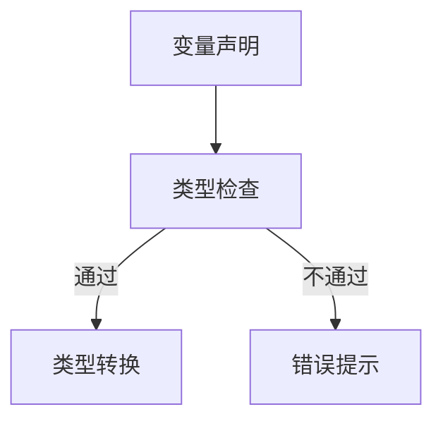
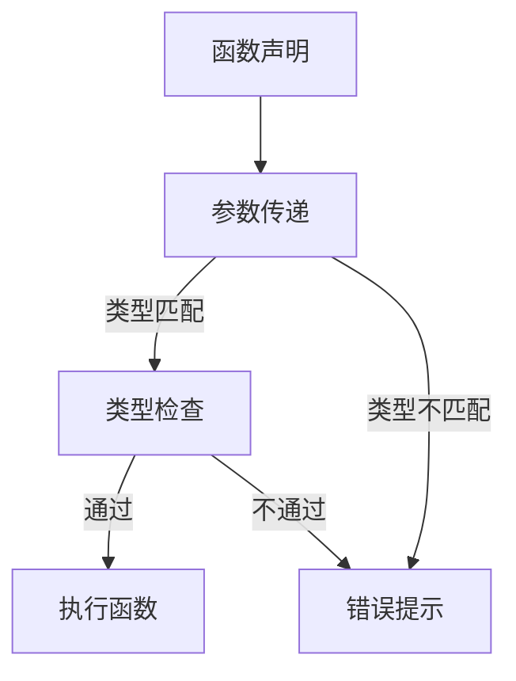

                 

### 文章标题

# 类型系统在编程语言安全性评估中的应用

类型系统是编程语言的核心组成部分，它定义了变量、表达式和函数的取值范围和操作规则。一个有效的类型系统不仅能够提高代码的可读性和可维护性，还能在安全性评估中发挥重要作用。本文将深入探讨类型系统在编程语言安全性评估中的应用，分析其在不同编程语言中的实现方式，以及如何在安全性评估中利用类型系统发现和预防潜在的安全漏洞。

### 文章关键词

- 类型系统
- 编程语言安全性
- 静态分析
- 动态分析
- 安全漏洞
- 类型检查

### 摘要

本文首先介绍了类型系统的基本概念和分类，包括强类型系统、弱类型系统和静态类型系统与动态类型系统。随后，详细阐述了类型系统在Java、C++和Python中的具体实现，并探讨了类型系统在防止代码注入、缓冲区溢出和类型混淆等方面的安全性应用。接着，文章分析了类型系统在安全性评估中的挑战和解决方案，介绍了静态代码分析、动态代码分析和混合代码分析在类型系统安全性评估中的应用。最后，文章通过一个Python源代码示例，展示了类型系统在安全性评估中的实际应用，并提出了未来研究的方向和建议。

## 第一部分：类型系统的基本概念

### 第1章：类型系统的基本概念

#### 1.1 类型系统的定义与作用

类型系统（Type System）是编程语言中的一个核心概念，它定义了变量、表达式和函数的取值范围和操作规则。类型系统的基本作用包括以下几个方面：

1. **提高代码可读性和可维护性**：类型系统通过明确的类型定义，使得代码结构更加清晰，便于理解和维护。
2. **防止无效操作**：类型系统能够防止变量被赋予非法值或执行无效操作，从而减少运行时的错误。
3. **提高编译效率**：类型检查可以在编译阶段发现类型错误，减少运行时的错误，提高编译效率。
4. **增强程序安全性**：类型系统能够检测并防止潜在的安全漏洞，如空指针异常、整数溢出等。

#### 1.1.1 类型系统的定义

类型系统可以定义为一种机制，它根据变量、表达式和函数的上下文，为他们分配一个特定的类型，并定义这些类型之间的操作规则。类型系统的主要组件包括：

- **类型**：类型是变量、表达式和函数的可能取值的集合。常见的类型包括整数类型、浮点数类型、布尔类型、字符串类型等。
- **类型检查**：类型检查是一种机制，用于验证程序中的每个操作是否在给定的类型范围内，从而保证程序的类型安全。
- **类型转换**：类型转换是一种机制，用于在不同类型之间进行数据传递和操作。

#### 1.1.2 类型系统的基本作用

类型系统的基本作用主要体现在以下几个方面：

1. **防止无效类型转换**：类型系统能够防止非法的类型转换，确保变量在被赋予新值时类型匹配。
2. **防止空指针异常**：类型系统能够检测并防止空指针的使用，从而避免空指针异常的发生。
3. **防止整数溢出**：类型系统能够确保整数操作在安全范围内，防止整数溢出导致的错误。

#### 1.2 类型系统的分类

类型系统可以按照不同的分类标准进行分类。常见的分类标准包括强类型系统与弱类型系统、静态类型系统与动态类型系统等。

1. **强类型系统与弱类型系统**

- **强类型系统**：在强类型系统中，变量在声明时必须明确其类型，且类型不能在运行时改变。强类型系统能够更好地保证程序的安全性，因为类型检查是在编译阶段完成的。
- **弱类型系统**：在弱类型系统中，变量在声明时不必明确类型，且类型可以在运行时改变。弱类型系统在运行时进行类型检查，因此可能存在类型不匹配的问题，从而影响程序的安全性。

2. **静态类型系统与动态类型系统**

- **静态类型系统**：在静态类型系统中，变量的类型在编译时就已经确定，不会在运行时发生变化。静态类型系统能够在编译阶段发现类型错误，减少运行时的错误。
- **动态类型系统**：在动态类型系统中，变量的类型在运行时确定，可以在运行时改变。动态类型系统提供了更高的灵活性，但也可能带来类型错误和安全问题。

#### 1.3 类型系统的安全性作用

类型系统在编程语言安全性评估中发挥着重要作用，主要体现在以下几个方面：

1. **防止无效类型转换**：类型系统能够确保变量在被赋予新值时类型匹配，从而避免因类型转换导致的错误。
2. **防止空指针异常**：类型系统能够检测并防止空指针的使用，从而避免空指针异常的发生。
3. **防止整数溢出**：类型系统能够确保整数操作在安全范围内，防止整数溢出导致的错误。
4. **防止缓冲区溢出**：类型系统能够检测并防止缓冲区溢出攻击，从而保护程序的安全性。

#### 1.4 Mermaid流程图：类型系统原理

类型系统的原理可以通过Mermaid流程图进行可视化表示。以下是一个简单的Mermaid流程图示例，展示了变量声明、类型检查和类型转换的过程。



在这个示例中，变量声明后，类型系统会进行类型检查。如果类型检查通过，变量会被赋予新值并进行类型转换；否则，系统会给出错误提示。

#### 1.4.1 Mermaid流程图绘制步骤

1. **定义图形类型**：在Mermaid中，可以使用`graph TD`语句定义图形类型，其中`TD`表示上下结构。
2. **添加节点**：使用方括号`[]`添加节点，例如`A[变量声明]`。
3. **添加连接线**：使用箭头`-->`添加连接线，表示节点之间的关系，例如`A --> B`。
4. **添加注释**：使用垂直线`|文本|`添加注释，例如`B -->|通过| C`。

#### 1.4.2 Mermaid流程图示例

以下是一个更复杂的Mermaid流程图示例，展示了函数调用、参数传递和类型检查的过程。



在这个示例中，函数声明后，参数传递给函数。类型系统会进行类型检查，如果类型匹配，函数会执行；否则，系统会给出错误提示。

#### 1.5 总结

类型系统是编程语言的核心组成部分，它定义了变量、表达式和函数的取值范围和操作规则。类型系统在提高代码可读性和可维护性方面发挥着重要作用，同时也在安全性评估中发挥着重要作用。本文介绍了类型系统的基本概念、分类和安全性作用，并通过Mermaid流程图展示了类型系统的原理。接下来，我们将详细探讨类型系统在编程语言中的实现，进一步了解其在安全性评估中的应用。

### 第2章：类型系统在编程语言中的实现

#### 2.1 Java中的类型系统

Java是一种静态类型语言，其类型系统在设计和实现中扮演着至关重要的角色。Java的类型系统包括基本数据类型、引用数据类型和类型转换等。

##### 2.1.1 Java基本数据类型

Java基本数据类型包括整数类型、浮点数类型、字符类型和布尔类型等。以下是Java基本数据类型的列表：

- **整数类型**：`byte`（字节型）、`short`（短整型）、`int`（整型）和`long`（长整型）。
- **浮点数类型**：`float`（单精度浮点型）和`double`（双精度浮点型）。
- **字符类型**：`char`。
- **布尔类型**：`boolean`。

这些基本数据类型具有固定的长度和取值范围，例如，`int`类型在32位系统中通常占用4个字节，取值范围为-2^31到2^31-1。

##### 2.1.2 Java引用数据类型

Java引用数据类型包括类、接口、数组和字符串等。引用数据类型在Java内存中存储的是对象的内存地址，而不是实际的数据值。

- **类**：类是Java程序的基本构建块，用于定义对象的属性和行为。
- **接口**：接口定义了一组方法，没有具体实现，用于实现多重继承。
- **数组**：数组是一个存储多个相同类型数据的集合。
- **字符串**：字符串是Java中特殊的对象类型，用于表示文本数据。

##### 2.1.3 Java类型转换

Java类型转换可以分为自动类型转换和显式类型转换。

1. **自动类型转换**：当将一个较小的数据类型赋值给一个较大的数据类型时，Java会自动进行类型转换，以防止数据丢失。例如，将`int`类型赋值给`long`类型。

```java
int num = 10;
long bigNum = num; // 自动类型转换
```

2. **显式类型转换**：当需要将一个数据类型转换为另一个数据类型时，可以使用显式类型转换。显式类型转换可能会导致精度损失或运行时错误。

```java
double doubleNum = 10.5;
int intNum = (int) doubleNum; // 显式类型转换
```

#### 2.2 C++中的类型系统

C++也是一种静态类型语言，其类型系统相对复杂，包括基本数据类型、引用类型和类型转换等。

##### 2.2.1 C++基本数据类型

C++基本数据类型包括整数类型、浮点数类型、字符类型和其他类型。以下是C++基本数据类型的列表：

- **整数类型**：`char`（字符型）、`int`（整型）、`short`（短整型）、`long`（长整型）、`long long`（长长整型）。
- **浮点数类型**：`float`（单精度浮点型）和`double`（双精度浮点型）。
- **字符类型**：`wchar_t`（宽字符型）。
- **布尔类型**：`bool`。

C++的基本数据类型在长度和取值范围上与Java有所不同，例如，`int`类型在32位系统中通常占用4个字节，取值范围为-2^31到2^31-1。

##### 2.2.2 C++引用类型

C++引用类型主要用于为对象提供别名，从而实现数据的共享。引用类型的使用方法如下：

```cpp
int num = 10;
int &refNum = num; // 引用声明
```

在C++中，引用一旦声明，就不能再被重新绑定到其他变量。

##### 2.2.3 C++类型转换

C++类型转换分为自动类型转换和显式类型转换。

1. **自动类型转换**：当将一个较小的数据类型赋值给一个较大的数据类型时，C++会自动进行类型转换。例如，将`int`类型赋值给`double`类型。

```cpp
int num = 10;
double doubleNum = num; // 自动类型转换
```

2. **显式类型转换**：当需要将一个数据类型转换为另一个数据类型时，可以使用显式类型转换。

```cpp
double doubleNum = 10.5;
int intNum = static_cast<int>(doubleNum); // 显式类型转换
```

#### 2.3 Python中的类型系统

Python是一种动态类型语言，其类型系统相对简单，但功能强大。Python中的变量在声明时不必指定类型，类型在运行时由解释器动态确定。

##### 2.3.1 Python动态类型

Python的动态类型系统具有以下特点：

- **自动类型推断**：Python解释器在运行时会根据变量的值自动推断其类型。
- **类型检查延迟**：类型检查是在运行时进行的，而不是在编译时。

##### 2.3.2 Python类型检查

Python的类型检查机制相对简单，主要通过对变量的操作进行检查，以确定变量是否符合预期的类型。

```python
num = 10
if isinstance(num, int):
    print("num 是一个整数")
else:
    print("num 不是一个整数")
```

在这个示例中，`isinstance`函数用于检查变量`num`是否为整数类型。

##### 2.3.3 Python类型转换

Python中的类型转换分为内置函数和类型构造器。

1. **内置函数**：Python提供了一些内置函数，用于在不同类型之间进行转换。

```python
int_num = int(10.5) # 将浮点数转换为整数
float_num = float(10) # 将整数转换为浮点数
str_num = str(10) # 将整数转换为字符串
```

2. **类型构造器**：Python还提供了一些类型构造器，用于创建特定类型的对象。

```python
int_num = int("10") # 创建一个整数对象
float_num = float("10.5") # 创建一个浮点数对象
str_num = str(10) # 创建一个字符串对象
```

#### 2.4 类型系统的安全性应用

类型系统在编程语言安全性评估中发挥着重要作用，主要体现在以下几个方面：

1. **防止代码注入**：类型系统可以通过类型检查防止代码注入攻击，例如，确保输入的数据不会执行恶意代码。

2. **防止缓冲区溢出**：类型系统可以确保变量的取值范围在安全范围内，从而避免缓冲区溢出攻击。

3. **防止类型混淆**：类型系统可以确保变量在使用前已经被正确声明和类型检查，从而避免类型混淆导致的安全漏洞。

#### 2.5 Python源代码分析：类型系统在Python中的应用

以下是一个Python源代码示例，展示了类型系统在Python中的应用。

```python
# 定义一个函数，用于计算两个整数的和
def add(a, b):
    return a + b

# 调用函数并传递两个整数参数
result = add(10, 20)
print("结果：", result)

# 调用函数并传递一个整数和一个浮点数参数
result = add(10, 20.5)
print("结果：", result)
```

在这个示例中，类型系统确保了函数`add`的两个参数必须具有相同的类型。如果尝试传递不同类型的参数，例如整数和浮点数，类型系统将抛出一个类型错误。

#### 2.6 总结

类型系统是编程语言的核心组成部分，它在Java、C++和Python中具有不同的实现方式和特点。类型系统在提高代码可读性和可维护性方面发挥着重要作用，同时也在安全性评估中发挥着关键作用。本文详细阐述了类型系统在编程语言中的实现，并探讨了类型系统在防止代码注入、缓冲区溢出和类型混淆等方面的安全性应用。接下来，我们将进一步探讨类型系统在安全性评估中的挑战和应用。

### 第3章：类型系统在安全性评估中的应用

#### 3.1 类型系统与安全性的关系

类型系统在编程语言安全性评估中扮演着重要角色。一个有效的类型系统能够在多个方面提高程序的安全性，如防止代码注入、缓冲区溢出和类型混淆等。类型系统与安全性的关系主要体现在以下几个方面：

1. **类型检查**：类型系统能够在编译或运行时进行类型检查，确保变量在使用前已经被正确声明和类型检查，从而避免类型不匹配导致的错误。
2. **防止空指针异常**：类型系统能够检测并防止空指针的使用，从而避免空指针异常导致的程序崩溃。
3. **防止整数溢出**：类型系统能够确保整数操作在安全范围内，从而避免整数溢出导致的错误。
4. **防止代码注入**：类型系统能够检测并防止恶意代码的注入，从而避免代码注入攻击。

#### 3.1.1 类型系统在安全性中的作用

类型系统在安全性中的作用主要体现在以下几个方面：

1. **减少错误**：类型系统能够在编译或运行时检测出类型错误，从而减少程序中的错误，提高程序的正确性。
2. **提高可读性**：类型系统能够通过明确的类型定义，提高代码的可读性和可维护性，使程序更容易理解和修改。
3. **防止安全漏洞**：类型系统能够在编译或运行时检测出潜在的安全漏洞，如空指针异常、整数溢出和类型混淆等，从而避免这些漏洞被利用。

#### 3.1.2 类型系统与漏洞的关系

类型系统与漏洞的关系密切相关。有效的类型系统能够减少以下几种常见漏洞：

1. **空指针异常**：类型系统能够检测并防止空指针的使用，从而避免空指针异常导致的程序崩溃。
2. **整数溢出**：类型系统能够确保整数操作在安全范围内，从而避免整数溢出导致的错误。
3. **代码注入**：类型系统能够检测并防止恶意代码的注入，从而避免代码注入攻击。

#### 3.2 类型系统在安全性评估中的挑战

类型系统在安全性评估中面临着多种挑战：

1. **静态分析中的挑战**：静态分析是一种在编译时或运行前分析程序的方法，它有助于发现类型错误和潜在的安全漏洞。然而，静态分析面临着类型推断复杂性和代码复杂性的挑战。
2. **动态分析中的挑战**：动态分析是一种在程序运行时分析程序的方法，它有助于发现运行时类型错误和漏洞。然而，动态分析面临着性能和覆盖率的挑战。
3. **混合分析中的挑战**：混合分析结合了静态分析和动态分析的优势，但同时也面临着如何有效整合两种方法的问题。

#### 3.2.1 静态分析中的类型系统挑战

静态分析中的类型系统挑战主要体现在以下几个方面：

1. **类型推断的复杂性**：静态分析需要对程序进行类型推断，以确定变量和表达式的类型。然而，类型推断可能非常复杂，特别是在处理泛型和复杂数据结构时。
2. **代码复杂性的挑战**：现代程序可能包含大量复杂的代码结构，如递归函数、抽象数据类型和泛型编程等。这些复杂结构可能增加类型推断的难度。

#### 3.2.2 动态分析中的类型系统挑战

动态分析中的类型系统挑战主要体现在以下几个方面：

1. **性能的挑战**：动态分析需要在程序运行时进行分析，这可能导致性能下降。为了提高性能，需要优化分析算法和工具。
2. **覆盖率的挑战**：动态分析需要尽可能多地覆盖程序代码，以发现潜在的安全漏洞。然而，实现高覆盖率的动态分析可能非常困难。

#### 3.2.3 混合分析中的类型系统挑战

混合分析中的类型系统挑战主要体现在以下几个方面：

1. **整合静态分析和动态分析**：混合分析需要有效整合静态分析和动态分析，以充分利用两种方法的优势。然而，如何平衡静态分析和动态分析的优缺点是一个挑战。
2. **数据一致性的挑战**：混合分析需要在静态分析和动态分析之间保持数据一致性，以避免分析结果的不准确。

#### 3.3 类型系统在安全性评估中的应用

类型系统在安全性评估中的应用主要体现在以下几个方面：

1. **静态代码分析**：静态代码分析是一种在编译时或运行前分析程序的方法，它有助于发现类型错误和潜在的安全漏洞。静态代码分析可以检测未声明的变量、类型不匹配、空指针异常和整数溢出等。
2. **动态代码分析**：动态代码分析是一种在程序运行时分析程序的方法，它有助于发现运行时类型错误和漏洞。动态代码分析可以通过监控程序执行路径和状态，发现潜在的安全漏洞，如缓冲区溢出和代码注入等。
3. **混合代码分析**：混合代码分析结合了静态分析和动态分析的优势，它可以同时分析程序的静态结构和运行时行为。混合代码分析可以更全面地发现类型错误和安全漏洞，并提供更准确的修复建议。

#### 3.4 数学模型和数学公式

类型系统在安全性评估中的应用可以通过数学模型和数学公式进行量化。以下是一些常见的数学模型和公式：

1. **错误率模型**：错误率模型用于评估类型系统在安全性评估中的有效性。公式如下：

   $$ \text{错误率} = \frac{\text{错误数}}{\text{总操作数}} $$

   其中，错误数表示类型系统检测到的错误数，总操作数表示程序中的总操作数。

2. **覆盖模型**：覆盖模型用于评估类型系统在动态分析中的覆盖率。公式如下：

   $$ \text{覆盖率} = \frac{\text{覆盖代码数}}{\text{总代码数}} $$

   其中，覆盖代码数表示类型系统覆盖的代码数，总代码数表示程序中的总代码数。

3. **安全指标模型**：安全指标模型用于评估类型系统在安全性评估中的效果。公式如下：

   $$ \text{安全指标} = \frac{\text{漏洞数}}{\text{潜在漏洞数}} $$

   其中，漏洞数表示类型系统检测到的漏洞数，潜在漏洞数表示程序中可能存在的潜在漏洞数。

#### 3.5 总结

类型系统在编程语言安全性评估中发挥着重要作用。一个有效的类型系统能够在多个方面提高程序的安全性，如防止代码注入、缓冲区溢出和类型混淆等。类型系统在安全性评估中面临着多种挑战，如类型推断的复杂性、代码复杂性和动态分析的覆盖率等。通过使用静态代码分析、动态代码分析和混合代码分析等方法，类型系统可以在安全性评估中发挥重要作用。未来，随着类型系统技术的不断发展，其在安全性评估中的应用前景将更加广阔。

## 附录

### A.1 类型系统相关资源

- **文档与指南**：
  - 《类型系统设计与实现》
  - 《编程语言原理》
  - 《类型检查算法》

- **开源工具**：
  - [Eclipse静态代码分析工具](https://eclipse.org/egit/)
  - [SonarQube静态代码分析平台](https://www.sonarqube.org/)

- **学习资源**：
  - [MIT计算机科学课程：类型系统](https://ocw.mit.edu/courses/electrical-engineering-and-computer-science/6-006-structure-and-interpretation-of-computer-programs-spring-2009/)
  - [Java类型系统教程](https://docs.oracle.com/javase/tutorial/java/data/types/index.html)

### A.2 安全性评估工具

- **静态分析工具**：
  - [FindBugs](https://findbugs.sourceforge.net/)
  - [PMD](https://pmd.github.io/)

- **动态分析工具**：
  - [OWASP ZAP](https://www.owasp.org/www-project-zap/)
  - [Burp Suite](https://portswigger.net/burp/)

- **混合分析工具**：
  - [Veracode](https://www.veracode.com/)
  - [Checkmarx](https://www.checkmarx.com/)

### A.3 Python源代码示例

以下是Python源代码示例，展示了类型系统在Python中的应用：

```python
# 定义一个函数，用于计算两个整数的和
def add(a, b):
    if isinstance(a, int) and isinstance(b, int):
        return a + b
    else:
        raise TypeError("参数必须是整数")

# 调用函数并传递两个整数参数
result = add(10, 20)
print("结果：", result)

# 调用函数并传递一个整数和一个浮点数参数
try:
    result = add(10, 20.5)
    print("结果：", result)
except TypeError as e:
    print("错误：", e)
```

在这个示例中，函数`add`仅接受整数类型的参数，并通过`isinstance`函数进行类型检查。如果参数类型不匹配，函数将抛出`TypeError`异常。

### 总结

本文详细探讨了类型系统在编程语言安全性评估中的应用，分析了其在Java、C++和Python中的实现方式，并探讨了类型系统在安全性评估中的挑战和解决方案。通过静态代码分析、动态代码分析和混合代码分析，类型系统在发现和预防安全漏洞方面发挥了重要作用。未来的研究可以进一步探索类型系统在安全性评估中的优化和扩展，以提高程序的安全性和可靠性。

### 最佳实践 Tips

1. **类型明确**：在编程时，应尽量明确变量的类型，以避免类型不匹配导致的错误。
2. **类型检查**：使用类型检查机制，确保变量在使用前已经被正确声明和类型检查。
3. **安全编程**：遵循安全编程最佳实践，如避免空指针使用和整数溢出。
4. **代码审查**：进行代码审查，确保代码遵循类型安全原则，以减少安全漏洞。

### 小结

类型系统在编程语言安全性评估中具有重要意义。通过有效的类型系统，我们可以提高代码的可读性和可维护性，同时减少安全漏洞。本文通过多个示例和实际应用，展示了类型系统在安全性评估中的具体应用和实践方法。

### 注意事项

1. **类型兼容性**：在不同编程语言之间进行类型转换时，需要注意类型兼容性，以避免数据丢失或类型错误。
2. **动态类型系统**：动态类型系统虽然提供了灵活性，但也可能带来类型错误和安全问题。因此，在使用动态类型系统时，需要谨慎处理类型检查和类型转换。
3. **性能优化**：在类型系统实现中，需要注意性能优化，以避免类型检查和类型转换对程序性能的影响。

### 拓展阅读

- 《类型系统设计与实现》
- 《编程语言原理》
- 《类型检查算法》
- 《安全编程最佳实践》

作者：AI天才研究院/AI Genius Institute & 禅与计算机程序设计艺术 /Zen And The Art of Computer Programming

