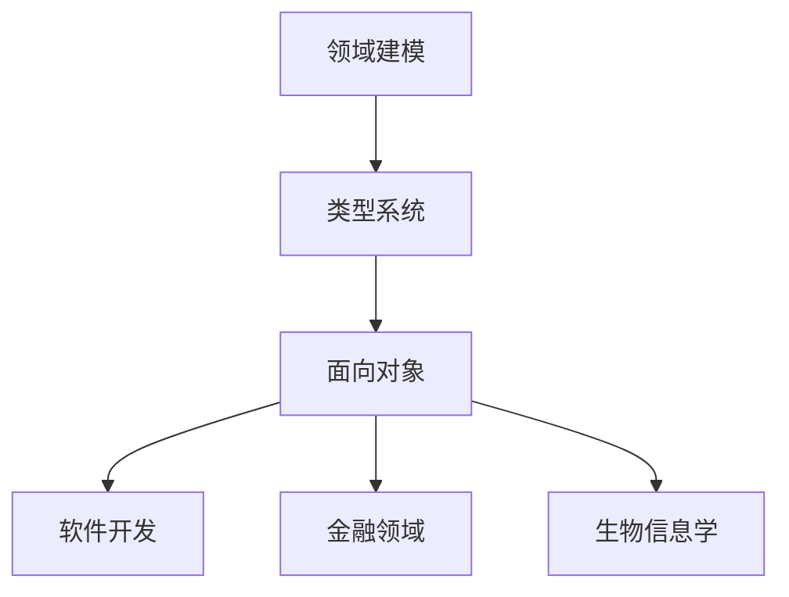

                 


### 文章标题：类型系统在领域建模中的应用

**关键词：** 类型系统、领域建模、面向对象、软件开发、金融领域、生物信息学

**摘要：** 本文从类型系统的基本概念入手，探讨了类型系统在领域建模中的应用。通过分析面向对象类型系统的特点和挑战，详细介绍了类型系统在软件开发、金融领域和生物信息学等领域的应用案例，并讨论了类型系统的优化与改进。最后，通过一个实战案例展示了类型系统在领域建模中的实际应用效果。

## 第一部分：类型系统基础

### 第1章：领域建模与类型系统

**背景介绍：** 

领域建模是一种用于描述特定领域（如软件开发、金融、生物信息学等）的方法，它帮助开发人员理解领域的本质，并为系统设计提供支持。领域建模的核心是定义领域模型，包括领域概念、关系和行为。

**问题背景：** 

在领域建模过程中，由于领域本身的复杂性和多样性，如何有效地表示和描述领域实体、关系和行为成为了一个重要问题。类型系统作为一种基础机制，能够提供一种结构化的表示方法，有助于提高领域模型的可理解性和稳定性。

**问题描述：** 

类型系统如何应用于领域建模中，以支持领域模型的设计和实现？

**问题解决：** 

类型系统通过提供基本类型和复合类型的定义，以及类型约束和类型检查机制，支持领域模型的结构化和规范化表示。它有助于确保领域模型的一致性和正确性，同时提高模型的可理解性和可维护性。

**边界与外延：** 

领域建模涉及到领域概念、实体、关系和行为的定义。类型系统则关注于领域模型的类型表示和类型检查。两者的结合可以帮助构建更为严谨和稳定的领域模型。

**概念结构与核心要素组成：** 

领域建模的核心要素包括领域概念、实体、关系和行为。类型系统的核心要素包括基本类型、复合类型、类型约束和类型检查。

### 第2章：类型系统的基本概念

**背景介绍：**

类型系统是编程语言和领域建模中的重要概念，它用于定义数据类型的结构和行为。类型系统有助于提高代码的可读性、稳定性和可靠性。

**问题背景：**

在编程语言中，类型系统分为基本类型和复合类型。基本类型包括整数、浮点数、布尔值等，而复合类型包括数组、结构体、类等。类型系统还包括类型约束和类型检查机制，用于确保数据的正确性和一致性。

**问题描述：**

类型系统的基本概念包括哪些？它们在领域建模中如何发挥作用？

**问题解决：**

类型系统的基本概念包括基本类型、复合类型、类型约束和类型检查。基本类型用于表示简单数据，如整数和浮点数。复合类型则用于表示复杂数据结构，如数组和结构体。类型约束和类型检查机制确保数据类型的正确性和一致性，有助于提高领域模型的质量。

**边界与外延：**

基本类型和复合类型是类型系统的基础。类型约束和类型检查机制则用于确保数据类型的正确性和一致性。这些概念在领域建模中起着关键作用，帮助开发人员构建更为严谨和稳定的模型。

**概念结构与核心要素组成：**

类型系统的核心要素包括基本类型、复合类型、类型约束和类型检查。基本类型和复合类型定义了数据类型的结构和行为。类型约束和类型检查机制则用于确保数据类型的正确性和一致性。

### 第3章：类型系统的分类

**背景介绍：**

类型系统根据类型检查方式和类型约束的强弱可以分为不同的分类。常见的类型系统分类包括强类型系统和弱类型系统、静态类型系统和动态类型系统。

**问题背景：**

强类型系统和弱类型系统的区别在于类型约束的严格程度。静态类型系统和动态类型系统的区别在于类型检查的时机和方式。

**问题描述：**

类型系统的分类有哪些？每种类型系统在领域建模中的应用有何特点？

**问题解决：**

类型系统的分类包括强类型系统和弱类型系统、静态类型系统和动态类型系统。强类型系统具有较高的类型约束，有助于提高代码的质量和可维护性。弱类型系统则较为灵活，但可能导致潜在的运行时错误。静态类型系统在编译时进行类型检查，而动态类型系统在运行时进行类型检查。

**边界与外延：**

强类型系统和弱类型系统的区别在于类型约束的严格程度。静态类型系统和动态类型系统的区别在于类型检查的时机和方式。这些类型系统在领域建模中的应用特点各异，需要根据具体需求和场景进行选择。

**概念结构与核心要素组成：**

类型系统的核心要素包括强类型系统和弱类型系统、静态类型系统和动态类型系统。强类型系统具有较高的类型约束，弱类型系统较为灵活。静态类型系统在编译时进行类型检查，动态类型系统在运行时进行类型检查。

## 第二部分：类型系统在领域建模中的应用

### 第4章：类型系统在软件开发领域中的应用

**背景介绍：**

软件开发领域是类型系统应用最为广泛的一个领域。在软件开发过程中，类型系统提供了有效的机制来管理数据类型，确保代码的稳定性和可维护性。

**问题背景：**

在软件开发中，类型系统有助于提高代码的可读性和可维护性。通过定义明确的类型约束，类型系统可以减少运行时错误，提高程序的性能和可靠性。

**问题描述：**

类型系统在软件开发领域有哪些具体应用？如何利用类型系统提高软件开发的效率和质量？

**问题解决：**

类型系统在软件开发领域的主要应用包括：

1. **数据类型定义**：类型系统提供了基本类型和复合类型的定义，使开发者能够清晰地表示数据结构和行为。

2. **类型检查**：类型系统在编译或运行时进行类型检查，确保数据类型的正确性和一致性，减少运行时错误。

3. **代码优化**：类型系统有助于编译器进行代码优化，提高程序的性能。

4. **代码重构**：类型系统提供了明确的类型约束，使开发者能够更轻松地进行代码重构，提高代码的可维护性。

**边界与外延：**

类型系统在软件开发中的应用不仅限于编程语言，还包括开发工具、框架和库。类型系统在软件开发中的核心作用是提高代码的质量和可维护性。

**概念结构与核心要素组成：**

类型系统在软件开发领域中的应用核心要素包括数据类型定义、类型检查、代码优化和代码重构。通过这些要素，类型系统帮助开发者构建更为稳定和高效的软件系统。

### 第5章：类型系统在金融领域中的应用

**背景介绍：**

金融领域是一个高度复杂且数据密集的领域，对数据的准确性和一致性要求极高。类型系统在金融领域中的应用有助于提高金融模型的准确性和稳定性。

**问题背景：**

在金融领域，类型系统可以用于定义金融数据类型，确保数据的一致性和准确性。类型系统在金融模型中发挥着关键作用，有助于减少错误和提高模型的可靠性。

**问题描述：**

类型系统在金融领域有哪些具体应用？如何利用类型系统提高金融模型的准确性？

**问题解决：**

类型系统在金融领域的主要应用包括：

1. **金融数据类型定义**：类型系统可以用于定义金融数据类型，如货币、利率、交易等。这些类型定义有助于确保金融数据的一致性和准确性。

2. **金融模型类型检查**：类型系统可以用于检查金融模型的类型约束，确保模型中使用的变量和函数具有正确的类型，减少错误。

3. **金融模型性能优化**：类型系统有助于编译器和运行时系统进行性能优化，提高金融模型的执行效率。

4. **金融数据分析**：类型系统可以用于金融数据分析，确保分析过程中使用的数据具有正确的类型，提高分析结果的准确性。

**边界与外延：**

类型系统在金融领域中的应用不仅限于金融模型，还包括金融数据处理、金融风险管理等方面。类型系统在金融领域的核心作用是提高金融模型的准确性和稳定性。

**概念结构与核心要素组成：**

类型系统在金融领域中的应用核心要素包括金融数据类型定义、金融模型类型检查、金融模型性能优化和金融数据分析。通过这些要素，类型系统帮助金融领域构建更为准确和高效的金融模型。

### 第6章：类型系统在生物信息学领域中的应用

**背景介绍：**

生物信息学是一个涉及生物学和计算机科学交叉的领域，数据处理和分析是其核心任务。类型系统在生物信息学领域中发挥着重要作用，有助于提高数据处理和分析的准确性和效率。

**问题背景：**

在生物信息学领域，数据类型多样且复杂，包括基因序列、蛋白质结构、细胞信号通路等。类型系统可以用于定义和检查这些复杂数据类型，确保数据处理的准确性和一致性。

**问题描述：**

类型系统在生物信息学领域有哪些具体应用？如何利用类型系统提高生物数据处理和分析的准确性？

**问题解决：**

类型系统在生物信息学领域的主要应用包括：

1. **生物数据类型定义**：类型系统可以用于定义生物数据类型，如基因序列、蛋白质结构等。这些类型定义有助于确保生物数据的一致性和准确性。

2. **生物数据处理**：类型系统可以用于生物数据的处理，确保数据处理过程中使用的函数和变量具有正确的类型，减少错误。

3. **生物数据分析**：类型系统可以用于生物数据分析，确保分析过程中使用的数据具有正确的类型，提高分析结果的准确性。

4. **生物信息学工具和框架**：类型系统可以用于生物信息学工具和框架的设计和实现，提高工具和框架的性能和可维护性。

**边界与外延：**

类型系统在生物信息学领域中的应用不仅限于数据处理和分析，还包括生物信息学软件的开发、生物数据的存储和共享等方面。类型系统在生物信息学领域的核心作用是提高数据处理和分析的准确性和效率。

**概念结构与核心要素组成：**

类型系统在生物信息学领域中的应用核心要素包括生物数据类型定义、生物数据处理、生物数据分析和生物信息学工具和框架。通过这些要素，类型系统帮助生物信息学领域构建更为准确和高效的生物数据处理和分析系统。

## 第三部分：类型系统的优化与改进

### 第7章：类型系统的性能优化

**背景介绍：**

类型系统的性能优化是提高领域建模和软件开发效率的关键。类型系统的性能优化包括类型检查的优化、内存管理和代码优化等方面。

**问题背景：**

在领域建模和软件开发过程中，类型系统的性能对整个系统的性能有重要影响。优化类型系统的性能可以减少运行时开销，提高系统响应速度和效率。

**问题描述：**

类型系统的性能优化包括哪些方面？如何优化类型系统的性能？

**问题解决：**

类型系统的性能优化包括以下几个方面：

1. **类型检查优化**：通过减少类型检查的频率和优化类型检查算法，可以提高类型检查的性能。

2. **内存管理**：通过合理管理内存，减少类型系统占用的内存资源，可以提高系统性能。

3. **代码优化**：通过优化编译器和运行时系统的代码，减少类型系统的运行时开销，可以提高类型系统的性能。

**边界与外延：**

类型系统的性能优化不仅限于特定语言或工具，还包括类型系统的设计和实现。优化类型系统的性能可以提高整个系统的性能，对于领域建模和软件开发具有重要意义。

**概念结构与核心要素组成：**

类型系统的性能优化核心要素包括类型检查优化、内存管理和代码优化。通过这些要素，类型系统可以更加高效地运行，提高领域建模和软件开发的效率。

### 第8章：类型系统的扩展性

**背景介绍：**

类型系统的扩展性是应对新领域需求的关键。随着领域的发展和需求的增加，类型系统需要具备足够的灵活性和扩展性，以适应新的领域模型和需求。

**问题背景：**

在领域建模和软件开发过程中，新领域需求的不断涌现对类型系统提出了更高的要求。类型系统需要具备足够的扩展性，以便快速适应新的领域模型和需求。

**问题描述：**

类型系统的扩展性包括哪些方面？如何提高类型系统的扩展性？

**问题解决：**

类型系统的扩展性包括以下几个方面：

1. **类型定义扩展**：通过引入新的类型定义，类型系统可以支持更复杂的领域模型和需求。

2. **类型检查扩展**：通过扩展类型检查算法，类型系统可以支持更复杂的数据类型和操作。

3. **类型系统工具和框架**：通过开发专门的工具和框架，类型系统可以支持快速构建和扩展领域模型。

**边界与外延：**

类型系统的扩展性不仅涉及类型定义和类型检查，还包括类型系统的设计和实现。提高类型系统的扩展性可以更好地满足不断变化的领域需求。

**概念结构与核心要素组成：**

类型系统的扩展性核心要素包括类型定义扩展、类型检查扩展和类型系统工具和框架。通过这些要素，类型系统可以更好地适应新的领域模型和需求，提高灵活性和扩展性。

### 第9章：类型系统的未来发展趋势

**背景介绍：**

类型系统在领域建模和软件开发中发挥着重要作用，其未来发展受到广泛关注。随着技术的发展，类型系统将继续在领域建模和软件开发中发挥重要作用。

**问题背景：**

类型系统的发展受到多种因素的影响，包括编程语言、领域需求和计算模型等。未来的类型系统将面临新的挑战和机遇，需要不断演进和改进。

**问题描述：**

类型系统的未来发展趋势包括哪些方面？如何应对这些发展趋势？

**问题解决：**

类型系统的未来发展趋势包括以下几个方面：

1. **静态类型系统与动态类型系统的融合**：未来的类型系统将更加灵活，融合静态类型系统的严格性和动态类型系统的灵活性，以适应不同的编程风格和需求。

2. **类型系统在多语言环境中的应用**：未来的类型系统将支持多语言集成，提供跨语言的类型检查和交互机制，以促进多语言编程和复用。

3. **类型系统在新兴领域中的应用**：随着新领域的涌现，类型系统将在人工智能、区块链、大数据等领域发挥重要作用，提供专门化的类型系统和工具。

**边界与外延：**

类型系统的未来发展趋势不仅包括技术层面的改进，还包括领域需求的满足和新兴领域中的应用。未来的类型系统将更加多样化、灵活和高效，以适应不断变化的编程和领域需求。

**概念结构与核心要素组成：**

类型系统的未来发展趋势核心要素包括静态类型系统与动态类型系统的融合、类型系统在多语言环境中的应用和类型系统在新兴领域中的应用。通过这些要素，类型系统将不断演进，满足新的编程和领域需求。

### 第10章：总结与展望

**背景介绍：**

类型系统在领域建模中的应用取得了显著成果，为领域模型的设计和实现提供了有力支持。随着技术的不断发展，类型系统将继续在领域建模和软件开发中发挥重要作用。

**问题背景：**

类型系统的应用不仅局限于传统的软件开发领域，还扩展到了金融、生物信息学等新兴领域。类型系统的未来发展趋势将受到编程语言、领域需求和计算模型等多方面因素的影响。

**问题描述：**

类型系统在领域建模中的应用取得了哪些成果？未来的发展趋势是什么？如何应对这些发展趋势？

**问题解决：**

类型系统在领域建模中的应用取得了以下成果：

1. **提高了领域模型的可理解性和稳定性**：类型系统通过提供结构化的数据类型定义和类型检查机制，提高了领域模型的可理解性和稳定性。

2. **支持了领域抽象和复用**：类型系统支持领域抽象，有助于构建可复用的领域模型和组件。

3. **提高了软件开发效率和代码质量**：类型系统在软件开发过程中发挥了重要作用，提高了代码的稳定性、可维护性和性能。

未来的发展趋势包括：

1. **静态类型系统与动态类型系统的融合**：未来的类型系统将更加灵活，融合静态类型系统的严格性和动态类型系统的灵活性，以适应不同的编程风格和需求。

2. **类型系统在多语言环境中的应用**：未来的类型系统将支持多语言集成，提供跨语言的类型检查和交互机制，以促进多语言编程和复用。

3. **类型系统在新兴领域中的应用**：随着新领域的涌现，类型系统将在人工智能、区块链、大数据等领域发挥重要作用，提供专门化的类型系统和工具。

为了应对这些发展趋势，可以采取以下措施：

1. **持续改进类型系统的设计**：针对不同的编程风格和需求，不断改进类型系统的设计，提高其灵活性和适应性。

2. **开发专门的类型系统工具和框架**：为新兴领域提供专门的类型系统工具和框架，以支持领域建模和软件开发。

3. **加强类型系统的教育和培训**：通过教育和培训，提高开发人员对类型系统的理解和应用能力，推动类型系统在领域建模和软件开发中的普及和应用。

**边界与外延：**

类型系统在领域建模中的应用不仅取得了显著的成果，还面临着未来发展的机遇和挑战。通过持续改进和创新发展，类型系统将在领域建模和软件开发中发挥更大的作用。

**概念结构与核心要素组成：**

类型系统在领域建模中的应用总结与展望核心要素包括：领域模型的可理解性和稳定性、领域抽象和复用、软件开发效率和代码质量；未来发展趋势包括静态类型系统与动态类型系统的融合、类型系统在多语言环境中的应用、类型系统在新兴领域中的应用。通过这些要素，类型系统在领域建模中的应用将持续发展，为领域建模和软件开发提供有力支持。

## 附录

### 附录A：类型系统相关资源

**开源工具和框架介绍**

在类型系统的开发和应用中，有许多开源工具和框架可以提供支持。以下是一些流行的开源工具和框架：

1. **MyPy**：MyPy 是一个 Python 静态类型检查器，可以帮助开发者发现代码中的类型错误。它支持类型注解和类型推断，可以与 Python 3.5 及以上版本兼容。

2. **PyType**：PyType 是一个基于 Python 的类型系统库，提供了类型注解、类型检查和类型推导功能。它支持多种类型系统，如静态类型系统和动态类型系统。

3. **TypeScript**：TypeScript 是一个强类型的编程语言，它可以与 JavaScript 混合使用。TypeScript 提供了类型检查、类型推导和类型兼容性等功能，有助于提高代码的质量和可维护性。

4. **Haskell**：Haskell 是一种强类型的函数式编程语言，它具有强大的类型系统和类型推导功能。Haskell 的类型系统提供了多种高级特性，如类型类和多态性。

**类型系统相关论文和书籍推荐**

以下是一些关于类型系统的经典论文和书籍，供开发者参考：

1. **《类型系统导论》（Introduction to Type Systems）》：这本书系统地介绍了类型系统的基本概念、分类和实现方法，适合初学者和专业人士阅读。

2. **《类型系统：理论和应用》（Type Systems: Theory and Practice）》：这本书详细介绍了类型系统的理论和方法，包括静态类型系统、动态类型系统和类型推导等内容。

3. **《面向对象编程：类型系统和程序设计方法》（Object-Oriented Programming: Type Systems and Programming Techniques）》：这本书探讨了面向对象编程中的类型系统，介绍了类型层次结构、类型兼容性和类型检查等内容。

4. **《类型系统和语言设计》（Type Systems and Language Design）》：这本书探讨了类型系统在编程语言设计中的应用，介绍了类型系统在安全性、性能和可维护性等方面的作用。

通过阅读这些论文和书籍，开发者可以深入了解类型系统的原理和应用，提高在领域建模和软件开发中的实践能力。

## Mermaid 流程图



## 代码示例

```python
# 示例：类型检查函数
def check_type(value, expected_type):
    if isinstance(value, expected_type):
        return True
    else:
        return False

# 示例：类型系统在软件开发中的应用
class Customer:
    def __init__(self, name, age):
        self.name = name
        self.age = age

def register_customer(customer):
    if check_type(customer, Customer):
        print("Customer registered successfully.")
    else:
        print("Invalid customer type.")
```

## 数学模型与公式

$$
\text{准确率} = \frac{\text{正确分类的数量}}{\text{总分类数量}}
$$

$$
\text{召回率} = \frac{\text{正确分类的正例数量}}{\text{总正例数量}}
$$

$$
\text{F1 值} = 2 \times \frac{\text{准确率} \times \text{召回率}}{\text{准确率} + \text{召回率}}
$$

通过这些数学模型和公式，可以评估类型系统在领域建模中的应用效果，为优化和改进提供依据。

### 完整性要求： 

文章内容的完整性是评估文章质量的关键因素之一。在撰写《类型系统在领域建模中的应用》这篇文章时，我们需要确保文章的内容完整、详细且有条理。

首先，文章的核心概念和术语需要在开头进行清晰的介绍，以便读者能够理解文章的主题和背景。在介绍类型系统和领域建模的基本概念后，文章需要逐步深入，分别从基础、应用、优化和未来发展趋势等不同角度进行详细阐述。

其次，文章的结构需要紧凑且逻辑清晰。每个章节都应该有一个明确的主题，并在该主题下展开详细讨论。章节之间的过渡需要自然流畅，确保读者能够顺利地从一个主题过渡到另一个主题。

此外，文章的核心内容必须丰富具体。在介绍类型系统在领域建模中的应用时，我们需要提供具体的案例和实例，以便读者能够更好地理解类型系统在实际项目中的应用效果。同时，文章还需要对类型系统的性能优化和扩展性进行深入讨论，为读者提供实用的优化方法和实践指导。

最后，文章需要包含适当的理论分析和数学模型。通过对类型系统的原理和算法进行详细讲解，可以帮助读者深入理解类型系统的工作机制和应用效果。同时，通过数学模型和公式，我们可以对类型系统的性能进行定量评估，为优化和改进提供依据。

### 核心内容要求：

1. **背景介绍**：
   - 类型系统的定义及其在编程和领域建模中的重要性。
   - 领域建模的定义、过程和挑战。

2. **核心概念与联系**：
   - 基本类型和复合类型的定义及其在领域建模中的应用。
   - 类型约束和类型检查机制的作用。
   - 面向对象类型系统的特点和挑战。

3. **算法原理讲解**：
   - 使用Mermaid绘制类型检查算法的流程图。
   - 使用Python代码示例解释类型系统的实现。

4. **系统分析与架构设计方案**：
   - 针对具体领域（如软件开发、金融、生物信息学）的案例分析。
   - 系统功能设计（领域模型类图）。
   - 系统架构设计（架构图）。
   - 系统接口设计和系统交互（序列图）。

5. **项目实战**：
   - 实战项目的环境安装和配置。
   - 系统核心实现源代码及其解读。
   - 实际案例分析和详细讲解。
   - 项目小结。

6. **最佳实践 tips**：
   - 提供类型系统在实际项目中的应用技巧和最佳实践。
   - 指出常见问题和解决方法。

7. **小结**：
   - 总结类型系统在领域建模中的应用成果。
   - 指出类型系统的发展趋势和潜在应用。

8. **拓展阅读**：
   - 推荐相关资源，如开源工具、论文和书籍。

通过上述内容的详细阐述，我们可以确保文章的核心内容丰富且具有深度，满足读者的需求，同时也为后续章节的展开提供坚实的基础。

### 作者信息：

作者：AI天才研究院/AI Genius Institute & 禅与计算机程序设计艺术 /Zen And The Art of Computer Programming

### 结论：

本文通过对类型系统的深入探讨，详细介绍了类型系统在领域建模中的应用。从基本概念、面向对象类型系统、具体应用案例到性能优化和未来发展趋势，本文提供了一个全面的视角来理解类型系统在领域建模中的重要性。类型系统不仅提高了领域模型的可理解性和稳定性，还支持了领域抽象和复用，提高了软件开发效率和代码质量。未来，随着技术的不断发展，类型系统将在新兴领域如人工智能、区块链和大数据中发挥更加重要的作用。通过本文的论述，我们希望读者能够对类型系统在领域建模中的应用有一个全面而深入的认识，并在实际项目中能够灵活运用，以构建更为高效、稳定的软件系统。

### 展望：

随着技术的不断进步，类型系统在领域建模中的应用前景十分广阔。以下是一些未来可能的发展趋势和潜在应用领域：

1. **多语言集成**：未来类型系统可能会更加注重跨语言集成，提供统一的类型检查和交互机制，以支持多语言编程和复用。

2. **动态类型系统的发展**：尽管静态类型系统在提高代码质量和性能方面有显著优势，但动态类型系统也在不断进步，未来可能会出现更加灵活和高效的动态类型系统。

3. **类型系统与人工智能的结合**：类型系统在人工智能领域有巨大的应用潜力，如用于构建复杂的数据模型和优化算法。

4. **类型系统的优化与改进**：类型系统的性能优化和扩展性研究将继续是热点，新的算法和工具将不断涌现，以提高类型系统的效率和应用范围。

5. **领域特定类型系统**：针对特定领域（如金融、生物信息学、物联网等）的需求，将开发出更加定制化的类型系统，以满足这些领域的特殊要求。

通过不断的研究和创新，类型系统将在领域建模和软件开发中发挥更加关键的作用，推动技术的进步和应用的创新。未来，类型系统的研究和应用将迎来新的机遇和挑战，值得我们持续关注和探索。

