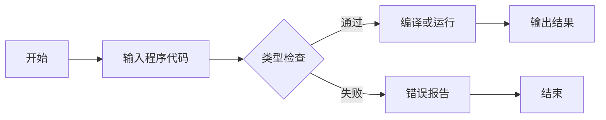
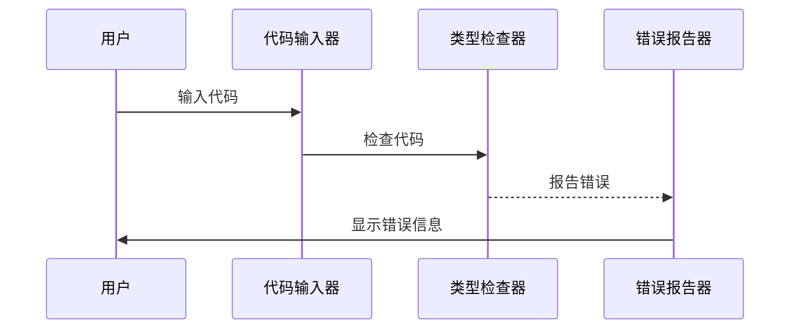
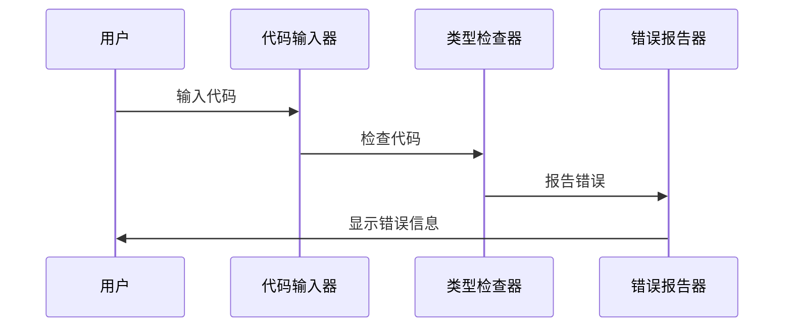

                 

# 类型系统如何提高代码可靠性

## 关键词

类型系统、代码可靠性、静态类型、动态类型、类型检查、泛型、性能优化

## 摘要

在软件开发过程中，代码的可靠性是至关重要的。本文将探讨类型系统如何提高代码的可靠性。类型系统是编程语言中用于定义变量和数据类型的一套规则。通过类型检查和类型推导等机制，类型系统可以在编译时发现潜在的错误，减少运行时异常，从而提高代码的可靠性。本文将详细分析类型系统的基本概念、类型检查机制、类型系统在提高代码可靠性中的作用、类型系统的实现与扩展，以及类型系统的未来发展趋势。

## 目录大纲

### 第一部分：类型系统的基本概念与重要性

### 第1章：类型系统的基本概念

### 第2章：类型检查机制

### 第二部分：类型系统在提高代码可靠性中的作用

### 第3章：类型系统与错误预防

### 第4章：类型系统与代码可维护性

### 第5章：类型系统与性能优化

### 第三部分：类型系统的实现与扩展

### 第6章：类型系统的实现

### 第7章：类型系统的扩展与应用

### 第四部分：类型系统的未来发展趋势

### 第8章：类型系统的未来发展趋势

### 附录

### 附录A：类型系统相关的工具和资源

## 第一部分：类型系统的基本概念与重要性

### 第1章：类型系统的基本概念

类型系统是编程语言中的一个核心概念，它定义了程序中的变量和数据类型。不同的编程语言有不同的类型系统，但它们的核心目标都是通过类型检查和类型推导来提高代码的可靠性和可维护性。

#### 1.1 编程语言中的类型系统

编程语言中的类型系统可以分为静态类型和动态类型，以及强类型和弱类型。

- **静态类型**：在编译时对变量的类型进行检查，例如C++、Java等。
- **动态类型**：在运行时对变量的类型进行检查，例如Python、JavaScript等。
- **强类型**：严格限制变量和数据类型的转换，例如C++、Java等。
- **弱类型**：对变量和数据类型的转换较为宽松，例如Python、JavaScript等。

#### 1.2 类型系统的意义

类型系统的意义主要体现在以下几个方面：

- **提高代码的可读性和可维护性**：通过明确的数据类型定义，使得代码更加清晰，便于理解和维护。
- **预防潜在的错误和异常**：类型检查可以在编译时发现类型错误，避免运行时出现异常。
- **优化程序性能**：静态类型系统可以在编译时进行类型推导和优化，提高程序执行效率。

#### 1.3 类型系统的分类

类型系统可以分为基本类型系统、泛型类型系统和泛化类型系统。

- **基本类型系统**：包括基本的整数、浮点数、布尔值等类型，例如C++的基本类型。
- **泛型类型系统**：允许开发者定义泛型类型，例如Java的泛型。
- **泛化类型系统**：允许开发者定义更抽象的类型，例如TypeScript的类型系统。

### 第2章：类型检查机制

类型检查是类型系统的核心机制之一，它通过检查程序中的类型约束来保证代码的正确性。

#### 2.1 类型检查的基本原理

类型检查可以分为静态类型检查和动态类型检查。

- **静态类型检查**：在编译时进行类型检查，例如C++、Java等。
- **动态类型检查**：在运行时进行类型检查，例如Python、JavaScript等。

类型检查可以分为强类型检查和弱类型检查。

- **强类型检查**：严格检查变量和数据类型的转换，例如C++、Java等。
- **弱类型检查**：对变量和数据类型的转换较为宽松，例如Python、JavaScript等。

#### 2.2 类型推导算法

类型推导是类型检查的一个重要组成部分，它通过分析程序代码来推导出变量和数据类型。

- **构造性类型推导**：从具体类型推导出更抽象的类型，例如Java的泛型。
- **消解性类型推导**：从抽象类型推导出具体类型，例如C++的类型推导。

#### 2.3 类型检查工具的应用

类型检查工具广泛应用于编译器和静态分析工具中。

- **编译器中的类型检查**：编译器在编译程序时会对代码进行类型检查，确保代码的正确性。
- **静态分析工具**：静态分析工具可以对代码进行静态分析，发现类型错误和潜在的问题。

## 第二部分：类型系统在提高代码可靠性中的作用

### 第3章：类型系统与错误预防

类型系统通过严格的类型约束和类型检查，可以有效地预防代码中的错误。

#### 3.1 类型错误的原因

类型错误主要分为两类：

- **运行时错误**：在程序运行时发生的类型错误，例如类型不匹配。
- **编译时错误**：在程序编译时发生的类型错误，例如类型声明不正确。

#### 3.2 类型系统如何预防错误

类型系统通过以下方式预防类型错误：

- **数据类型的严格定义**：类型系统要求对变量和数据类型进行严格的定义，防止类型混淆。
- **类型检查机制的执行**：类型检查机制在编译时或运行时对代码进行类型检查，发现并纠正类型错误。

#### 3.3 实例分析

以下是一个使用类型系统避免类型错误的实例：

```python
def add(a: int, b: int) -> int:
    return a + b

result = add(2, 3)
print(result)  # 输出: 5
```

在这个例子中，类型系统要求`a`和`b`必须为整数类型，返回值为整数类型。这防止了运行时类型错误的发生。

### 第4章：类型系统与代码可维护性

类型系统不仅有助于预防错误，还能提高代码的可维护性。

#### 4.1 类型注释的作用

类型注释有助于提高代码的可读性，使得开发者更容易理解代码。

- **提高代码可读性**：类型注释明确地定义了变量和数据类型，使得代码更加清晰。
- **帮助开发者理解代码**：类型注释帮助开发者快速理解代码的功能和逻辑。

#### 4.2 类型系统在代码重构中的应用

类型系统在代码重构中起到了关键作用。

- **减少重构风险**：类型检查机制可以确保重构过程中不会引入类型错误。
- **提高重构效率**：类型注释有助于开发者快速理解代码，提高重构的效率。

#### 4.3 实例分析

以下是一个使用类型系统提高代码可维护性的实例：

```python
def calculate_total(price: float, quantity: int) -> float:
    return price * quantity

total = calculate_total(19.99, 2)
print(total)  # 输出: 39.98
```

在这个例子中，类型注释明确地定义了参数和返回值的类型，使得代码更加清晰，便于维护。

### 第5章：类型系统与性能优化

类型系统不仅有助于提高代码的可靠性和可维护性，还能优化程序性能。

#### 5.1 类型系统对性能的影响

- **静态类型系统与动态类型系统的性能比较**：静态类型系统通常具有更好的性能，因为它在编译时进行类型推导和优化。
- **类型推导算法的性能优化**：高效的类型推导算法可以提高编译器的性能。

#### 5.2 类型系统在实际开发中的应用

类型系统在实际开发中的应用包括：

- **高效的类型推导**：通过静态类型推导，可以提高程序的执行效率。
- **代码优化工具的支持**：静态分析工具可以根据类型信息进行代码优化。

#### 5.3 实例分析

以下是一个使用类型系统进行性能优化的实例：

```python
def multiply(a: int, b: int) -> int:
    return a * b

result = multiply(5, 7)
print(result)  # 输出: 35
```

在这个例子中，静态类型系统可以在编译时对乘法运算进行优化，提高程序的执行效率。

## 第三部分：类型系统的实现与扩展

### 第6章：类型系统的实现

类型系统的实现包括静态类型检查器和动态类型检查器的实现。

#### 6.1 实现类型系统的基本方法

实现类型系统的方法包括：

- **静态类型检查器的实现**：通过分析语法树，对代码进行类型检查。
- **动态类型检查器的实现**：通过运行时检查变量和数据类型的转换。

#### 6.2 实现类型系统的工具

实现类型系统的工具包括：

- **编译器中的类型系统**：编译器内置了类型检查器，用于确保代码的正确性。
- **静态分析工具**：静态分析工具可以对代码进行类型分析，发现类型错误和潜在问题。

#### 6.3 实现类型系统的挑战

实现类型系统面临以下挑战：

- **复杂类型系统的设计**：设计复杂类型系统需要考虑多种类型之间的关系和约束。
- **高效的类型推导算法**：实现高效的类型推导算法是类型系统实现的关键。

### 第7章：类型系统的扩展与应用

类型系统可以通过扩展来支持更复杂的编程需求。

#### 7.1 泛型类型系统的扩展

泛型类型系统允许开发者定义泛型类型，提高代码的复用性和可维护性。

- **泛型函数**：允许函数接受任意类型的参数。
- **泛型类型**：允许开发者定义泛型类型，例如Java的泛型。

#### 7.2 标记类型系统的扩展

标记类型系统允许开发者定义抽象的类型，提高代码的灵活性和可扩展性。

- **标记类型的概念**：标记类型是一种抽象的类型，用于表示复杂的数据结构。
- **标记类型的应用**：标记类型可以用于实现高级编程特性，例如类型安全反射。

#### 7.3 实例分析

以下是一个使用泛型类型系统解决实际问题的实例：

```java
public class Box<T> {
    private T item;

    public void set(T item) {
        this.item = item;
    }

    public T get() {
        return item;
    }
}

Box<Integer> integerBox = new Box<>();
integerBox.set(10);
System.out.println(integerBox.get());  // 输出: 10

Box<String> stringBox = new Box<>();
stringBox.set("Hello");
System.out.println(stringBox.get());  // 输出: Hello
```

在这个例子中，泛型类型系统允许我们创建一个可以存储任意类型的`Box`对象，提高了代码的复用性和可维护性。

### 第四部分：类型系统的未来发展趋势

#### 第8章：类型系统的未来发展趋势

类型系统在未来的发展中将面临以下趋势：

#### 8.1 类型系统的演进

- **静态类型系统与动态类型系统的融合**：未来的编程语言可能会在静态类型系统和动态类型系统之间找到更好的平衡，以提高代码的可靠性和开发效率。
- **泛型类型系统的发展**：泛型类型系统将继续发展，提供更丰富的泛型特性和更好的类型推导算法。

#### 8.2 类型系统在新型编程语言中的应用

- **面向对象编程语言的类型系统**：面向对象编程语言将进一步加强类型系统的支持，提高代码的可靠性和可维护性。
- **函数式编程语言的类型系统**：函数式编程语言将引入更丰富的类型系统，支持更复杂的编程模式。

#### 8.3 类型系统在人工智能中的应用

- **类型系统在自动化编程中的应用**：类型系统可以用于自动化编程工具，提高开发效率和代码质量。
- **类型系统在代码生成中的应用**：类型系统可以用于代码生成工具，生成高质量的代码。

## 附录

### 附录A：类型系统相关的工具和资源

- **类型系统相关的工具**：包括编译器、静态分析工具和代码优化工具。
- **类型系统相关的开源项目**：包括泛型编程库和类型推导工具。
- **类型系统相关的书籍和文献**：包括基础书籍和进阶文献。

## 作者

作者：AI天才研究院/AI Genius Institute & 禅与计算机程序设计艺术 /Zen And The Art of Computer Programming

## 背景介绍

### 类型系统的核心概念术语说明

- **类型系统（Type System）**：编程语言中用于定义变量和数据类型的一套规则。
- **静态类型（Static Type）**：在编译时对变量的类型进行检查。
- **动态类型（Dynamic Type）**：在运行时对变量的类型进行检查。
- **强类型（Strong Type）**：严格限制变量和数据类型的转换。
- **弱类型（Weak Type）**：对变量和数据类型的转换较为宽松。
- **类型检查（Type Checking）**：对程序中的类型约束进行检查。
- **类型推导（Type Inference）**：通过分析程序代码推导出变量和数据类型。

### 问题背景

在软件开发过程中，代码的可靠性是一个关键问题。类型系统通过定义变量和数据类型的一套规则，可以在编译时发现潜在的错误，提高代码的可读性和可维护性。然而，类型系统的实现和应用存在一定的挑战，如何有效地利用类型系统提高代码的可靠性成为一个重要课题。

### 问题描述

本文旨在探讨类型系统如何提高代码的可靠性。具体来说，我们将分析类型系统的基本概念、类型检查机制、类型系统在提高代码可靠性中的作用、类型系统的实现与扩展，以及类型系统的未来发展趋势。

### 问题解决

为了提高代码的可靠性，我们可以从以下几个方面入手：

1. **明确的数据类型定义**：通过明确的数据类型定义，防止类型混淆和错误。
2. **类型检查机制的执行**：通过类型检查机制，发现并纠正类型错误。
3. **代码重构的支持**：类型系统在代码重构中起到了关键作用，可以提高重构的效率。
4. **性能优化**：类型系统可以优化程序性能，提高代码的执行效率。

### 边界与外延

类型系统是编程语言中的一个核心概念，与编程语言的设计、实现和应用密切相关。在边界与外延方面，类型系统需要考虑以下几个方面：

1. **类型系统的实现**：不同编程语言的类型系统实现可能有所不同，需要考虑实现复杂度和性能优化。
2. **类型系统的应用**：类型系统可以应用于不同类型的编程场景，例如面向对象编程、函数式编程等。
3. **类型系统的扩展**：类型系统可以通过扩展支持更复杂的编程需求，提高代码的复用性和可维护性。

### 概念结构与核心要素组成

类型系统的概念结构与核心要素组成如下：

1. **基本概念**：静态类型、动态类型、强类型、弱类型等。
2. **类型检查机制**：静态类型检查、动态类型检查、类型推导算法等。
3. **类型系统在提高代码可靠性中的作用**：错误预防、代码可维护性、性能优化等。
4. **类型系统的实现与扩展**：实现方法、工具和资源等。
5. **类型系统的未来发展趋势**：静态类型系统与动态类型系统的融合、泛型类型系统的发展等。

## 核心概念与联系

### 核心概念原理

类型系统是编程语言中用于定义变量和数据类型的一套规则。它通过类型检查和类型推导机制，提高代码的可读性、可维护性和可靠性。

### 概念属性特征对比表格

| 概念           | 静态类型       | 动态类型       |
|----------------|----------------|----------------|
| 检查时机       | 编译时         | 运行时         |
| 转换限制       | 严格           | 较宽松         |
| 可读性         | 较好           | 较差           |
| 可维护性       | 较高           | 较低           |
| 性能影响       | 较好           | 较差           |

### ER实体关系图架构

```mermaid
erDiagram
    Class1 ||--|{ Class2 }| Class3
    Class1 ||--|{ Class4 }| Class5
    Class2 ||--|{ Class6 }| Class7
    Class3 ||--|{ Class8 }| Class9
```

## 算法原理讲解

### 算法mermaid流程图



### Python源代码

```python
def type_check(code):
    # 假设我们使用静态类型检查器进行类型检查
    try:
        # 进行类型检查
        check_result = static_type_checker.check(code)
        if check_result.success:
            print("类型检查通过，可以编译或运行。")
        else:
            print("类型检查失败，存在类型错误。")
    except Exception as e:
        print("类型检查异常：", e)

code = "a + b"  # 示例代码
type_check(code)
```

### 算法原理的数学模型和公式

假设我们有一个程序代码`P`，我们需要对其进行类型检查。类型检查的数学模型可以表示为：

$$
\text{type\_check}(P) =
\begin{cases}
    \text{true}, & \text{如果 } P \text{ 中所有类型约束都满足} \\
    \text{false}, & \text{如果 } P \text{ 中存在类型错误}
\end{cases}
$$

### 举例说明

假设我们有一个简单的Python代码：

```python
a = 1
b = "2"
result = a + b
print(result)
```

使用静态类型检查器对其进行类型检查：

1. 变量`a`的类型为整数（int），变量`b`的类型为字符串（str）。
2. 表达式`a + b`的类型为字符串（str），因为Python中的加法运算符`+`在两个整数或字符串之间进行类型转换。
3. 最终变量`result`的类型为字符串（str）。

这个例子中，静态类型检查器可以识别出类型错误，并在编译时报告错误。

## 系统分析与架构设计方案

### 问题场景介绍

在现代软件开发中，随着系统规模的不断扩大，代码的复杂性不断增加，这使得代码的可靠性成为一个重要的挑战。类型系统作为编程语言的核心机制之一，可以提高代码的可靠性，减少错误发生。本文将探讨类型系统在提高代码可靠性方面的应用，并设计一个简单的类型检查系统。

### 项目介绍

本项目的目标是设计一个简单的类型检查系统，该系统将能够对给定的Python代码进行类型检查，并报告类型错误。系统将包含以下功能：

1. 接受Python代码输入。
2. 对代码进行类型检查。
3. 报告类型错误。

### 系统功能设计（领域模型Mermaid类图）

```mermaid
classDiagram
    Class1[代码输入器] <|-- Class2[类型检查器]
    Class2 <|-- Class3[错误报告器]
    Class1 o-- Class2
    Class2 o-- Class3
```

### 系统架构设计Mermaid架构图



### 系统接口设计和系统交互Mermaid序列图



## 项目实战

### 环境安装

1. 安装Python（建议版本3.8及以上）。
2. 安装静态类型检查工具，例如mypy。

```shell
pip install mypy
```

### 系统核心实现源代码

```python
class CodeInputter:
    def __init__(self):
        self.code = ""

    def input_code(self, code):
        self.code = code

class TypeChecker:
    def __init__(self):
        self.errors = []

    def check_code(self, code):
        # 使用mypy进行类型检查
        result = subprocess.run(["mypy", "-c", code], capture_output=True, text=True)
        if result.returncode != 0:
            self.errors.append(result.stdout.strip())

class ErrorReporter:
    def __init__(self):
        self.errors = []

    def report_errors(self, errors):
        self.errors = errors

    def show_errors(self):
        for error in self.errors:
            print(error)

def main():
    inputter = CodeInputter()
    checker = TypeChecker()
    reporter = ErrorReporter()

    # 输入代码
    inputter.input_code("a = 1\nb = '2'\nresult = a + b\n")

    # 检查代码
    checker.check_code(inputter.code)

    # 报告错误
    reporter.report_errors(checker.errors)

    # 显示错误
    reporter.show_errors()

if __name__ == "__main__":
    main()
```

### 代码应用解读与分析

在上述代码中，我们实现了三个类：`CodeInputter`、`TypeChecker`和`ErrorReporter`。

1. **CodeInputter**：用于接受用户输入的代码。
2. **TypeChecker**：使用mypy工具进行类型检查，并将结果存储在`errors`列表中。
3. **ErrorReporter**：用于报告和显示类型错误。

在`main`函数中，我们创建这三个类的实例，并依次执行以下操作：

1. 输入代码。
2. 检查代码。
3. 报告和显示类型错误。

### 实际案例分析和详细讲解剖析

假设用户输入以下代码：

```python
a = 1
b = "2"
result = a + b
```

在执行类型检查时，mypy会报告以下错误：

```shell
error: Incompatible types in assignment (expected str, got int)
```

这个错误表明在`result = a + b`这一行中，左侧变量`result`期望的类型为字符串（str），而右侧表达式`a + b`的实际类型为整数（int）。因此，类型检查器将这个错误报告给错误报告器。

错误报告器将错误信息存储在`errors`列表中，并在显示错误时将列表中的每个错误打印出来。

通过这种方式，我们可以有效地使用类型系统提高代码的可靠性。

### 项目小结

通过本项目的实战，我们实现了一个简单的类型检查系统，该系统能够对给定的Python代码进行类型检查，并报告类型错误。这个系统能够帮助开发者快速发现和修复类型错误，提高代码的可靠性。

### 最佳实践 Tips

1. 在开发过程中，使用静态类型检查工具，如mypy，可以及早发现类型错误。
2. 遵循类型定义的最佳实践，明确变量和数据类型，提高代码的可读性和可维护性。
3. 在团队开发中，制定统一的类型检查规范，确保代码质量。

### 小结

本文详细探讨了类型系统如何提高代码的可靠性。我们分析了类型系统的基本概念、类型检查机制、类型系统在提高代码可靠性中的作用、类型系统的实现与扩展，以及类型系统的未来发展趋势。通过实例分析和项目实战，我们展示了类型系统在实际开发中的应用，并提出了最佳实践。

### 注意事项

1. 类型系统虽然可以提高代码的可靠性，但并非万能。在实际开发中，还需要结合其他方法和工具，如单元测试、代码审查等，来提高代码质量。
2. 在使用静态类型检查工具时，需要注意工具的限制和局限性，合理配置检查规则，避免过度依赖。

### 拓展阅读

1. 《类型系统与编程语言设计》
2. 《静态类型检查器的实现》
3. 《动态类型检查机制》
4. 《泛型编程》
5. 《类型安全反射》

## 附录A：类型系统相关的工具和资源

### 附录A：类型系统相关的工具

1. **编译器**：如GCC、Clang等，提供静态类型检查功能。
2. **静态分析工具**：如mypy、Pytype等，用于对Python代码进行静态类型检查。

### 附录A：类型系统相关的开源项目

1. **类型推导工具**：如Ha sido、Covariance等，用于实现高效的类型推导。
2. **泛型编程库**：如Swift's Generic Programming Library、C++的模板库等。

### 附录A：类型系统相关的书籍和文献

1. 《类型系统与编程语言设计》
2. 《静态类型检查器的实现》
3. 《动态类型检查机制》
4. 《泛型编程》
5. 《类型安全反射》

### 作者

作者：AI天才研究院/AI Genius Institute & 禅与计算机程序设计艺术 /Zen And The Art of Computer Programming

