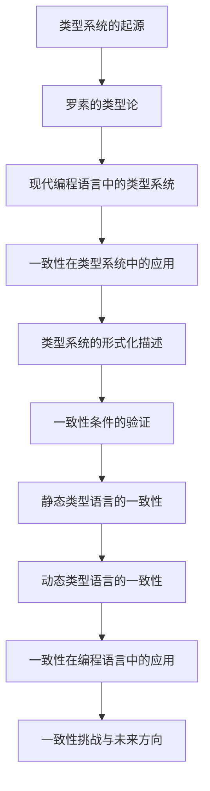

                 

### 《类型系统的一致性：从罗素到现代编程语言》

> 关键词：类型论、编程语言、类型系统、一致性、静态类型、动态类型

> 摘要：本文旨在探讨类型系统的一致性，从历史视角的罗素类型论出发，深入分析现代编程语言中类型系统的一致性原理和应用。通过逐步分析，本文揭示了类型系统在编程语言设计和软件开发中的重要性，并探讨了未来类型系统的发展方向。

### 引言

#### 1.1 研究背景与意义

**历史视角：** 罗素与类型论的起源

类型论（Type Theory）作为形式逻辑和数学基础理论的重要组成部分，其起源可以追溯到20世纪初期，罗素（Bertrand Russell）是该领域的奠基人之一。罗素在研究数学基础的过程中，为了解决“集合论悖论”，提出了类型论。罗素认为，通过定义个体与类型之间的关系，可以避免逻辑悖论的发生。

**现代视角：** 编程语言中的类型系统

在现代编程语言中，类型系统（Type System）扮演着至关重要的角色。类型系统负责确保程序的正确性和安全性。静态类型语言如Haskell和Rust，通过严格的类型检查，能够在编译时发现类型错误；而动态类型语言如JavaScript和Python，虽然类型检查是在运行时进行的，但仍然依赖于类型一致性来保证程序的正确性。

#### 1.1.2 研究意义

**类型系统的一致性在编程语言中的应用**

类型系统的一致性是保证编程语言可靠性和安全性的关键。通过一致性验证，编程语言可以确保代码在不同场景下不会产生意外的行为。一致性在静态类型语言和动态类型语言中均有广泛应用，如Haskell的类型等价性和Rust的所有权与借用机制。

**类型系统在软件工程中的作用**

类型系统不仅在编程语言中发挥作用，还在软件工程中具有重要应用。通过类型系统，开发者可以更好地理解程序的抽象结构，进行模块化和代码重用。此外，类型系统还提高了软件的可维护性和可扩展性。

#### 1.2 本书结构概述

**章节安排与主要内容**

本文分为六章，旨在逐步深入探讨类型系统的一致性。第一章介绍研究背景与意义；第二章回顾罗素与类型论的基础概念；第三章分析类型系统从罗素到现代编程语言的演变；第四章探讨类型系统的一致性；第五章分析不同编程语言的一致性实现；第六章讨论类型系统的一致性挑战与未来方向。

**目标读者与预期收益**

本文面向对编程语言和类型论有一定了解的读者，旨在为读者提供一个从历史到现代、从理论到实践的全面视角，帮助读者深入理解类型系统的一致性。读者通过本文的学习，可以：

- 掌握类型论的基本概念和原理
- 理解现代编程语言中类型系统的应用和实现
- 了解类型系统的一致性在编程语言设计和软件工程中的重要性

### 罗素与类型论基础

#### 2.1 罗素与类型论的基本概念

**类型论的基本原理**

类型论的基本原理是区分个体与类型。在类型论中，个体是指具体的对象，如数字、字符串等；类型是指个体的集合，如整数类型、字符串类型等。类型论通过定义个体与类型之间的关系，确保了逻辑推导的一致性和数学基础的安全。

**逻辑原子主义**

罗素的类型论基于逻辑原子主义（Logical Atomism），认为所有个体都可以分解为最基本的逻辑原子。逻辑原子是不可分割的，它们是构成复杂逻辑结构的基础。通过逻辑原子主义，类型论能够确保逻辑推导的严密性和一致性。

#### 2.1.2 罗素的类型论观点

**等级类型系统**

罗素提出了等级类型系统（Hierarchical Type System），将类型分为不同的等级，每个等级表示不同复杂度的类型。等级类型系统的核心思想是限制类型之间的转换，以确保类型安全。

**类型判别与类型矛盾**

罗素还强调了类型判别（Type Distinction）的重要性。类型判别是指通过区分不同类型的个体，避免类型矛盾（Type Conflict）的发生。类型矛盾可能导致逻辑悖论，因此类型判别是类型论中至关重要的一环。

#### 2.2 罗素类型论的影响

**形式逻辑与类型论**

罗素的类型论对形式逻辑的发展产生了深远影响。通过类型论，形式逻辑得以在数学和计算机科学中得到广泛应用。类型论的形式化方法为形式逻辑提供了坚实的理论基础。

**类型论对编程语言的影响**

罗素的类型论为现代编程语言中的类型系统奠定了基础。许多现代编程语言，如Haskell和Rust，都借鉴了罗素的类型论思想，设计了严格的类型系统，确保程序的正确性和安全性。

### 2.3 静态类型与动态类型

**静态类型**

静态类型（Static Type）是指在编译时就能确定变量和函数的类型。静态类型语言如Haskell和Rust，通过严格的类型检查，能够在编译时发现类型错误，提高了程序的可靠性。静态类型语言的优势在于类型安全性高，但可能牺牲一定的灵活性。

**动态类型**

动态类型（Dynamic Type）是指在运行时才能确定变量和函数的类型。动态类型语言如JavaScript和Python，类型检查是在运行时进行的。动态类型语言的优势在于灵活性高，但可能引入类型错误，降低程序的可靠性。

### 从罗素到现代编程语言的类型系统

#### 3.1 类型系统的演变

**经典类型系统**

经典类型系统（Classic Type System）是类型系统的最早形式。经典类型系统主要包括基本类型（如整数、浮点数）和复合类型（如数组、结构体）。经典类型系统的优点在于简单易懂，但可能无法满足复杂程序设计的需求。

**面向对象编程语言中的类型系统**

面向对象编程语言（如Java和C++）中的类型系统引入了类与对象的概念。类定义了对象的属性和方法，对象是类的实例。面向对象编程语言中的类型系统支持继承、多态和封装，提高了程序的可维护性和可扩展性。

**函数式编程语言中的类型系统**

函数式编程语言（如Haskell和Scala）中的类型系统强调纯函数和类型推断。函数式编程语言中的类型系统可以确保函数的引用透明性，提高程序的可靠性和可测试性。类型推断使得编程更加直观和简洁。

**面向并发编程中的类型系统**

面向并发编程（如Go和Erlang）中的类型系统关注并发安全和类型检查。并发编程中的类型系统通过确保线程之间的数据一致性，防止数据竞争和死锁。类型检查在并发编程中尤为重要，因为它可以在编译时发现潜在的并发问题。

### 3.2 静态类型语言与动态类型语言

**静态类型语言**

静态类型语言在编译时进行类型检查，确保程序的正确性和安全性。静态类型语言的优势在于类型安全性和性能，但可能牺牲一定的灵活性。

**动态类型语言**

动态类型语言在运行时进行类型检查，灵活性高，但可能引入类型错误。动态类型语言的优势在于开发效率和灵活性，但需要更严格的测试和调试。

### 3.3 现代编程语言中的类型系统

**函数式编程语言中的类型系统**

函数式编程语言中的类型系统强调纯函数和类型推断。纯函数使得程序更易于理解和测试，类型推断提高了编程效率。

**面向并发编程中的类型系统**

面向并发编程中的类型系统确保并发安全和类型检查。类型检查在并发编程中尤为重要，因为它可以在编译时发现潜在的并发问题。

### 类型系统的一致性

#### 4.1 一致性的基本概念

**类型系统的完整性**

类型系统的完整性（Type System Completeness）是指类型系统能够表达所有可能的程序结构和数据类型。一个完整的类型系统应该能够处理基本的数值类型、复合类型、函数类型等。

**类型安全**

类型安全（Type Safety）是指类型系统能够防止类型错误的发生。类型安全确保了程序在运行时不会因为类型不匹配而产生错误。

**类型正确性**

类型正确性（Type Correctness）是指类型系统能够保证程序的语义正确性。类型正确性确保了程序在编译时或运行时不会产生意外的行为。

#### 4.2 一致性在类型系统中的应用

**类型等价**

类型等价（Type Equivalence）是指两个类型在语义上是等价的。类型等价允许类型之间的转换和比较，提高了程序的可读性和可维护性。

**类型转换**

类型转换（Type Conversion）是指将一个类型的值转换为另一个类型的值。类型转换分为隐式转换和显式转换。隐式转换是由类型系统自动完成的，而显式转换需要开发者明确指定。

### 类型系统的形式化描述

#### 4.2.1 类型系统语义

**静态语义**

静态语义（Static Semantics）是指在编译时确定的语义。静态语义包括类型检查、作用域解析和表达式求值等。

**动态语义**

动态语义（Dynamic Semantics）是指在运行时确定的语义。动态语义包括变量的绑定、函数的调用和程序的执行等。

#### 4.2.2 一致性条件的验证

**类型检查算法**

类型检查算法（Type Checking Algorithm）是指用于验证程序类型一致性的算法。类型检查算法可以确保程序在编译时或运行时满足类型要求。

**一致性证明方法**

一致性证明方法（Consistency Proof Method）是指用于证明类型系统一致性的方法。一致性证明方法可以确保类型系统在所有情况下都能保持一致性。

### 一致性在编程语言中的应用

#### 5.1 静态类型语言的一致性

**Haskell**

Haskell是一种纯函数式编程语言，以其强大的类型系统和类型推导而闻名。Haskell的类型系统确保了程序的引用透明性和类型正确性。Haskell的类型检查算法基于依赖类型（Dependent Types），可以自动推导出类型等价关系，提高了程序的可读性和可维护性。

**Rust**

Rust是一种系统级编程语言，以其强类型系统和所有权模型而著称。Rust的类型系统确保了内存安全和并发安全。Rust的所有权模型（Ownership Model）通过确保对变量的唯一访问权限，防止了内存泄漏和数据竞争。Rust的类型检查算法在编译时对程序进行严格的类型检查，确保了程序的正确性和安全性。

#### 5.2 动态类型语言的一致性

**JavaScript**

JavaScript是一种动态类型语言，广泛应用于前端和后端开发。JavaScript的类型系统是在运行时进行类型检查的，通过类型转换（Type Conversion）和类型检查（Type Checking）来确保程序的一致性。JavaScript的类型检查算法较为灵活，可以在运行时根据上下文自动推导出类型等价关系。

**Python**

Python是一种动态类型语言，以其简洁的语法和强大的标准库而受到开发者喜爱。Python的类型系统是在运行时进行类型检查的，通过类型注释（Type Annotations）和类型推导（Type Inference）来确保程序的一致性。Python的类型检查算法基于静态类型检查，可以提前发现潜在的类型错误。

### 类型系统的一致性挑战与未来方向

#### 6.1 类型系统的挑战

**多范式编程语言的类型系统**

多范式编程语言（如C++和Java）结合了不同的编程范式，如面向对象、函数式和过程式编程。这种多范式的类型系统带来了类型兼容性问题，增加了类型系统的复杂性。

**并发编程中的类型系统**

并发编程中的类型系统面临类型安全与并发性能的平衡挑战。类型检查需要在保证并发性能的同时，确保程序的正确性和安全性。

#### 6.2 未来方向

**自动类型推导与检查**

自动类型推导与检查（Automatic Type Inference and Checking）是未来类型系统发展的一个重要方向。通过机器学习和人工智能技术，可以开发出更智能的类型检查算法，提高类型系统的自动化程度。

**类型系统的融合与扩展**

类型系统的融合与扩展（Type System Fusion and Extension）是另一个未来方向。通过融合不同类型系统的优点，可以开发出更强大的类型系统，支持更复杂的程序结构和编程范式。

### 附录：编程语言类型系统参考资料

#### A.1 类型系统相关的经典文献

- 罗素，《数学原理》
- Hoare，《类型理论》

#### A.2 现代编程语言类型系统实现

- Haskell，《Haskell编译器实现》
- Rust，《Rust编程语言》

#### A.3 类型系统研究工具

- 类型推断与验证工具，《类型推断与验证算法》
- 类型系统可视化工具，《类型系统可视化工具》

### B.1 缩略词与术语解释

- 类型论（Type Theory）
- 静态类型（Static Type）
- 动态类型（Dynamic Type）
- 类型安全（Type Safety）
- 类型正确性（Type Correctness）
- 类型检查（Type Checking）
- 类型推断（Type Inference）

## 图1：类型系统的一致性关系架构

### 结论

类型系统的一致性是现代编程语言设计和软件开发中至关重要的概念。从罗素的类型论到现代编程语言的类型系统，类型系统的一致性在保障程序的正确性和安全性方面发挥了重要作用。本文通过逐步分析，揭示了类型系统的一致性原理和实现，探讨了类型系统在编程语言设计和软件工程中的应用。未来，随着自动类型推导与检查和类型系统融合与扩展的发展，类型系统的一致性将进一步提升，为编程语言和软件工程带来更多可能性。让我们继续关注类型系统的一致性，共同探索其在编程语言和软件开发中的无限潜力。

