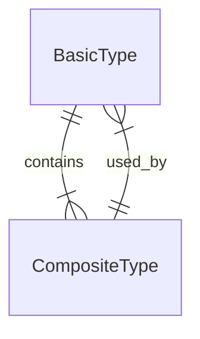
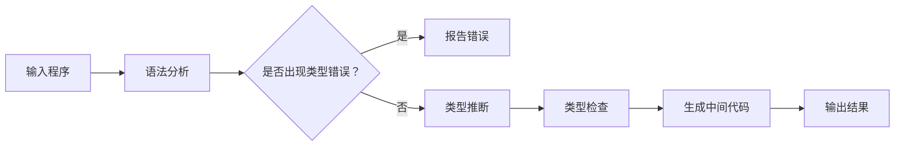
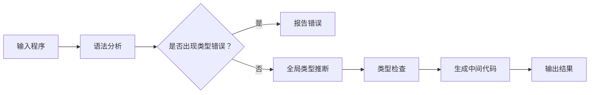

                 

### 文章标题

《类型系统的演化：从罗素到现代编程范式》

### 关键词

类型系统、罗素、编程范式、静态类型、动态类型、类型推断、算法原理

### 摘要

本文旨在探讨类型系统在编程语言和理论中的演变过程。从罗素提出类型理论开始，到现代编程范式的形成，类型系统经历了数次重大的变革。本文将逐步分析这些变革，探讨类型系统的核心概念，以及其在不同编程范式中的应用和影响。

## 目录大纲设计思路

在设计《类型系统的演化：从罗素到现代编程范式》的目录大纲时，我们首先需要明确书籍的主题和目标读者群体。该书旨在探讨类型系统在编程语言和理论中的演变过程，从历史角度分析类型系统的发展，并探讨其对现代编程范式的影响。

**目录大纲设计思路如下：**

1. **背景介绍**：首先介绍类型系统的基础知识，包括问题的背景、类型系统的定义及其重要性。
2. **核心概念与联系**：分析类型系统的核心概念，如类型、类型检查、类型推断等，并通过表格和实体关系图展示概念之间的联系。
3. **算法原理讲解**：讲解类型系统的关键算法，如类型推断算法，并使用Mermaid流程图和Python代码示例进行详细阐述。
4. **数学模型和数学公式**：介绍类型系统的数学基础，包括类型系统的公理、规则和公式，并使用LaTeX格式进行展示。
5. **系统分析与架构设计方案**：介绍类型系统在实际编程语言中的应用，包括领域模型、系统架构和接口设计。
6. **项目实战**：通过具体项目实例展示类型系统的应用，包括环境安装、系统核心实现和代码分析。
7. **最佳实践与小结**：总结类型系统的最佳实践，并给出相关注意事项和拓展阅读建议。

### 第一部分：类型系统的起源

### 第1章：类型系统的概念与历史背景

**1.1 问题的提出**

在计算机编程的早期，程序的设计和实现过程相对简单，编程语言的功能也相对有限。然而，随着计算机技术的不断发展，编程语言的复杂性和应用程序的规模也不断增加。这引发了一系列问题，其中最核心的问题之一便是类型问题。

**1.1.1 编程中的类型问题**

在编程中，类型问题主要表现在以下几个方面：

- **变量类型不明确**：在没有类型系统的早期编程语言中，变量可以随意赋值，导致程序难以理解和管理。
- **类型错误**：在函数调用和变量赋值时，如果没有正确的类型检查，可能会导致运行时错误。
- **代码可读性**：没有明确的类型系统会使代码难以阅读和维护。

**1.1.2 类型系统的定义**

类型系统是一种机制，用于在编程语言中定义变量、函数和其他数据结构的类型。类型系统的目的是提高代码的可读性、稳定性和可靠性。

**1.1.3 类型系统的重要性**

类型系统的重要性体现在以下几个方面：

- **提高代码可读性**：明确的类型定义有助于提高代码的可读性，使得代码更容易理解和维护。
- **减少错误**：类型检查可以提前发现潜在的类型错误，从而减少运行时错误。
- **优化性能**：某些类型系统可以通过静态分析来优化程序性能。

### 1.2 类型系统的历史背景

**1.2.1 罗素与类型理论**

类型理论的奠基人之一是伯特兰·罗素。他在20世纪初提出了类型理论，以解决数学基础中的悖论问题。罗素提出，每个数学对象都应该属于一个类型，不同类型的对象不能相互比较。

**1.2.2 类型系统的发展历程**

- **早期类型系统**：早期的编程语言，如ALGOL和PL/I，引入了基本的数据类型和类型检查机制。
- **静态类型系统**：在20世纪60年代，面向对象的编程语言如Simula和Smalltalk引入了静态类型系统，强调在编译时进行类型检查。
- **动态类型系统**：随着脚本语言和解释型语言的兴起，动态类型系统逐渐得到广泛应用。动态类型系统在运行时进行类型检查，提供了更大的灵活性。

**1.2.3 类型系统在现代编程语言中的重要性**

现代编程语言，无论是静态类型的如Java和C#，还是动态类型的如Python和JavaScript，都包含了类型系统。类型系统的重要性体现在以下几个方面：

- **代码可靠性**：类型系统可以提前发现类型错误，减少运行时错误。
- **代码维护性**：明确的类型定义有助于代码的维护和扩展。
- **性能优化**：类型系统可以用于编译时的优化，提高程序性能。

### 1.3 核心概念与联系

**1.3.1 基本类型**

基本类型是编程语言中最基础的类型，如整数、浮点数、字符和布尔值。不同编程语言的基本类型可能有所不同，但基本类型通常是类型系统的基石。

**1.3.2 复合类型**

复合类型是由基本类型组合而成的类型，如数组、列表、结构体和类。复合类型提供了更丰富的数据结构和操作方式。

**1.3.3 类型系统中的基本概念关系图**

为了更清晰地展示类型系统中的基本概念，我们可以使用Mermaid绘制一个实体关系图（ER图）：



这个ER图展示了基本类型和复合类型之间的包含和被使用关系。基本类型是复合类型的基础，而复合类型则使用基本类型来构建更复杂的数据结构。

### 1.4 本章小结

本章介绍了类型系统的基本概念和历史背景。从编程中的类型问题出发，我们探讨了类型系统的定义和重要性。接着，我们回顾了类型系统的发展历程，从罗素的类型理论到现代编程语言中的类型系统。最后，我们分析了类型系统中的基本概念，并通过实体关系图展示了基本类型和复合类型之间的关系。通过本章的学习，读者可以更好地理解类型系统的基本概念和发展历程。

### 第二部分：类型系统的演化

### 第2章：类型推断算法

**2.1 类型推断的基本概念**

类型推断是指编程语言自动确定变量或表达式类型的机制。类型推断可以减少代码中类型声明的数量，提高代码的可读性和灵活性。

**2.1.1 类型推断的定义**

类型推断是编译器或解释器在解析程序时，自动确定变量、表达式和函数返回值的类型的过程。

**2.1.2 类型推断的目标**

类型推断的主要目标是：

- 减少显式类型声明，提高代码的可读性。
- 提前发现类型错误，提高程序的可靠性。
- 优化程序性能，减少类型检查的开销。

**2.1.3 类型推断的分类**

根据类型推断的范围，可以分为局部类型推断和全局类型推断。

- **局部类型推断**：仅在函数或块的作用域内进行类型推断，不考虑外部作用域的类型信息。
- **全局类型推断**：在整个程序范围内进行类型推断，考虑所有作用域的类型信息。

### 2.2 常见类型推断算法

**2.2.1 局部类型推断**

局部类型推断算法主要基于上下文和语法结构来推断类型。常见的局部类型推断算法有：

- **静态类型推断**：在编译时基于语法分析和上下文信息进行类型推断。
- **动态类型推断**：在运行时基于变量和表达式的值进行类型推断。

**2.2.2 全局类型推断**

全局类型推断算法通常需要更强的静态分析能力，以确保类型推断的准确性。常见的全局类型推断算法有：

- **类型推理算法**：通过一系列推理规则，从表达式的语法结构和上下文信息推导出类型。
- **约束求解算法**：通过建立类型约束，求解约束满足问题，从而确定变量和表达式的类型。

**2.2.3 类型推断算法的复杂性分析**

类型推断算法的复杂性取决于算法的实现方式和类型系统的复杂度。通常，全局类型推断算法的复杂性要高于局部类型推断算法。此外，类型推断算法的时间复杂性和空间复杂性也是需要考虑的重要因素。

### 2.3 类型推断算法的Mermaid流程图

为了更直观地展示类型推断算法的流程，我们可以使用Mermaid绘制流程图。

**2.3.1 局部类型推断流程图**



**2.3.2 全局类型推断流程图**



### 2.4 Python代码示例

为了更具体地展示类型推断算法的应用，我们可以使用Python编写示例代码。

**2.4.1 局部类型推断Python代码**

```python
def add(a, b):
    return a + b

result = add(5, 3)
print("Result:", result)
```

**2.4.2 全局类型推断Python代码**

```python
from typing import List

def find_max(numbers: List[int]) -> int:
    max_value = numbers[0]
    for number in numbers:
        if number > max_value:
            max_value = number
    return max_value

max_value = find_max([1, 2, 3, 4, 5])
print("Max Value:", max_value)
```

### 2.5 本章小结

本章介绍了类型推断的基本概念和常见算法。我们首先定义了类型推断，并明确了其目标和分类。接着，我们讨论了局部和全局类型推断算法，并使用Mermaid流程图展示了算法的流程。最后，我们通过Python代码示例展示了类型推断的实际应用。通过本章的学习，读者可以理解类型推断的基本原理和实现方法。

### 第3章：静态类型系统

**3.1 静态类型系统的概念**

静态类型系统是一种在编译时确定变量和表达式类型的类型系统。与动态类型系统不同，静态类型系统在程序运行之前就已经确定了所有变量的类型。

**3.1.1 静态类型系统的定义**

静态类型系统要求在程序编写时明确每个变量和表达式的类型。编译器在编译过程中会对代码进行类型检查，确保代码中的类型使用符合定义。

**3.1.2 静态类型系统的优点**

静态类型系统具有以下优点：

- **代码可读性**：明确的类型定义使得代码更容易理解和维护。
- **类型安全**：类型检查可以提前发现潜在的类型错误，减少运行时错误。
- **性能优化**：静态类型系统允许编译器进行更多的优化，提高程序性能。

**3.1.3 静态类型系统的局限性**

静态类型系统也存在一些局限性：

- **代码冗长**：需要显式声明所有变量的类型，可能导致代码冗长。
- **灵活性不足**：在编译时确定类型可能导致程序不够灵活，难以适应变化。

**3.2 静态类型系统的实现**

**3.2.1 类型检查**

类型检查是静态类型系统中的核心部分。编译器在编译过程中会对代码进行类型检查，确保所有操作都符合类型定义。

**3.2.2 类型推断**

某些静态类型系统还支持类型推断，通过分析语法结构和上下文信息，自动推导出变量的类型。

**3.2.3 静态类型系统的应用**

静态类型系统广泛应用于多种编程语言，如Java、C#、C++和Rust等。这些语言都采用了静态类型系统，以提高代码的可读性和可靠性。

**3.3 静态类型系统的Mermaid类图**

为了更直观地展示静态类型系统的概念和实现，我们可以使用Mermaid绘制类图。

```mermaid
classDiagram
    Class1[编译器] <|-- Class2[类型检查器]
    Class2 <|-- Class3[类型推断器]
    Class1 <|-- Class4[程序代码]
    Class4 <|-- Class5[变量]
    Class4 <|-- Class6[表达式]
```

在这个类图中，编译器包含了类型检查器和类型推断器，用于处理程序代码中的变量和表达式。类型检查器负责确保代码中的类型使用符合定义，而类型推断器则通过分析语法结构和上下文信息，自动推导出变量的类型。

**3.4 Python代码示例**

以下是一个使用Python实现的静态类型系统的示例：

```python
from typing import List

def add(a: int, b: int) -> int:
    return a + b

def find_max(numbers: List[int]) -> int:
    max_value = numbers[0]
    for number in numbers:
        if number > max_value:
            max_value = number
    return max_value

result = add(5, 3)
max_value = find_max([1, 2, 3, 4, 5])
print("Result:", result)
print("Max Value:", max_value)
```

在这个示例中，我们使用了类型推断来声明函数的参数和返回值类型。这使得代码更加清晰，同时也提高了代码的可读性和可靠性。

**3.5 本章小结**

本章介绍了静态类型系统的概念、实现和应用。我们首先定义了静态类型系统，并讨论了其优点和局限性。接着，我们介绍了静态类型系统的实现，包括类型检查和类型推断。最后，我们通过Python代码示例展示了静态类型系统的实际应用。通过本章的学习，读者可以更好地理解静态类型系统的基本概念和实现方法。

### 第4章：动态类型系统

**4.1 动态类型系统的概念**

动态类型系统是一种在程序运行时确定变量和表达式类型的类型系统。与静态类型系统不同，动态类型系统在程序运行之前不进行类型检查，而是在运行时根据变量的实际值和操作来确定类型。

**4.1.1 动态类型系统的定义**

动态类型系统要求在程序运行时动态地确定变量和表达式的类型。这种类型系统通常在解释型语言中使用，如Python、JavaScript和Ruby等。

**4.1.2 动态类型系统的优点**

动态类型系统具有以下优点：

- **代码简洁**：无需显式声明变量类型，代码更加简洁。
- **灵活性高**：动态类型系统允许在运行时改变变量的类型，使得程序更加灵活。
- **开发效率**：动态类型系统可以减少类型声明的数量，提高开发效率。

**4.1.3 动态类型系统的局限性**

动态类型系统也存在一些局限性：

- **类型不安全**：由于类型检查是在运行时进行的，可能导致类型错误和运行时错误。
- **性能影响**：动态类型系统可能需要额外的运行时检查，影响程序性能。

**4.2 动态类型系统的实现**

**4.2.1 类型检查**

在动态类型系统中，类型检查通常在运行时进行。解释器或运行时环境会根据变量和表达式的实际值进行类型检查，确保操作符合类型定义。

**4.2.2 类型推断**

某些动态类型系统也支持类型推断，通过分析语法结构和上下文信息，自动推导出变量的类型。

**4.2.3 动态类型系统的应用**

动态类型系统广泛应用于多种编程语言，如Python、JavaScript、Ruby和PHP等。这些语言都采用了动态类型系统，以提高代码的简洁性和灵活性。

**4.3 动态类型系统的Mermaid类图**

为了更直观地展示动态类型系统的概念和实现，我们可以使用Mermaid绘制类图。

```mermaid
classDiagram
    Class1[解释器] <|-- Class2[运行时环境]
    Class2 <|-- Class3[变量]
    Class2 <|-- Class4[表达式]
    Class4 <|-- Class5[类型检查器]
```

在这个类图中，解释器和运行时环境负责处理变量和表达式，并在运行时进行类型检查。类型检查器用于确保变量和表达式的操作符合类型定义。

**4.4 Python代码示例**

以下是一个使用Python实现的动态类型系统的示例：

```python
def add(a, b):
    return a + b

def find_max(numbers):
    max_value = numbers[0]
    for number in numbers:
        if number > max_value:
            max_value = number
    return max_value

result = add(5, 3)
max_value = find_max([1, 2, 3, 4, 5])
print("Result:", result)
print("Max Value:", max_value)
```

在这个示例中，我们使用了动态类型系统，无需显式声明变量类型。这使得代码更加简洁，同时也提高了代码的灵活性。

**4.5 本章小结**

本章介绍了动态类型系统的概念、实现和应用。我们首先定义了动态类型系统，并讨论了其优点和局限性。接着，我们介绍了动态类型系统的实现，包括类型检查和类型推断。最后，我们通过Python代码示例展示了动态类型系统的实际应用。通过本章的学习，读者可以更好地理解动态类型系统的基本概念和实现方法。

