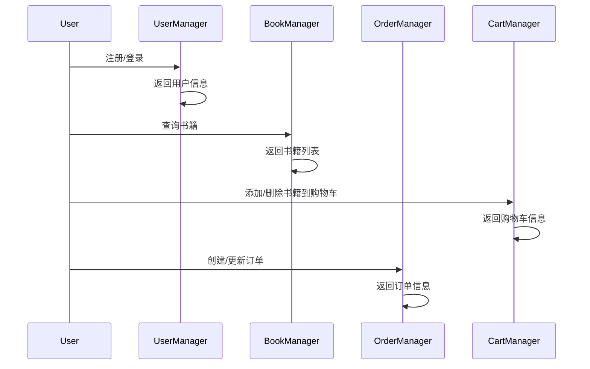
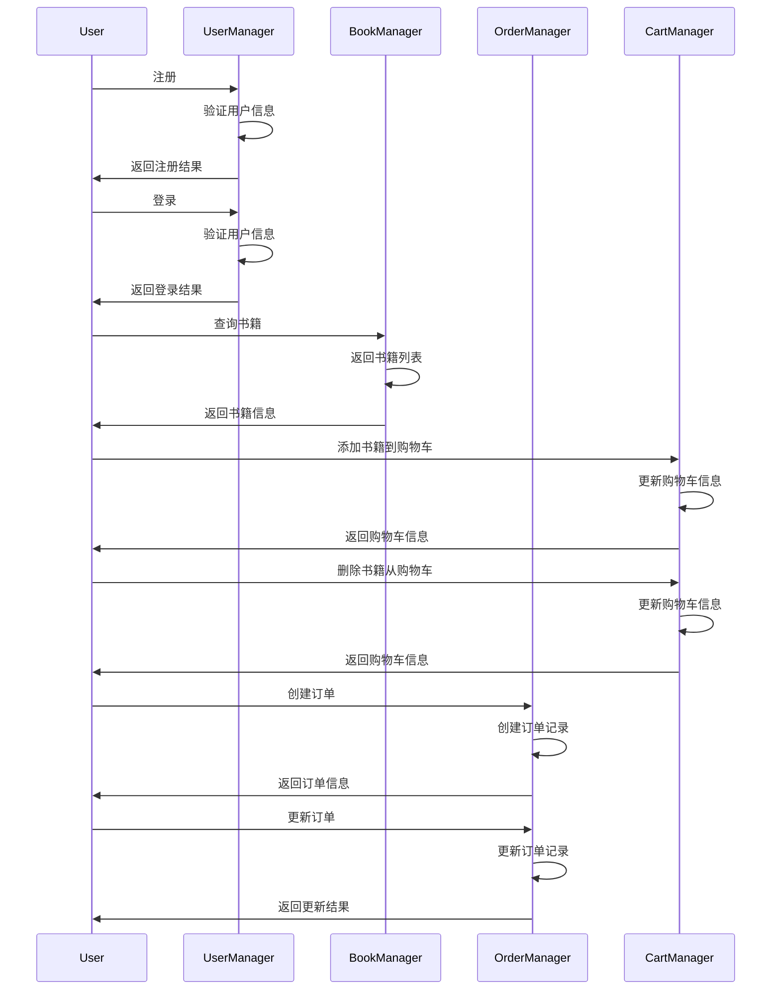

                 

## 类型系统：编程语言设计的核心

### 关键词
- 类型系统
- 编程语言设计
- 类型检查
- 类型推断
- 应用场景

### 摘要
类型系统是编程语言设计的核心组成部分，它不仅影响着程序的执行效率，还直接关系到程序的安全性和可维护性。本文将深入探讨类型系统的基本概念、设计与实现、应用场景以及未来的发展趋势，通过实例分析，帮助读者更好地理解和应用类型系统。

## 设计目录大纲

在设计《类型系统：编程语言设计的核心》的目录大纲时，我们需要确保结构合理、内容详实，以便读者可以系统性地学习类型系统的相关知识。以下是详细的目录大纲：

### 第一部分：类型系统的基本概念

#### 1.1 引言
- 类型系统的定义
- 类型系统的重要性

#### 1.2 类型系统的历史与发展
- 早期编程语言中的类型系统
- 静态类型语言与动态类型语言的对比
- 类型系统的发展趋势

#### 1.3 核心概念
- 基本类型
- 复合类型
- 函数类型
- 接口类型

### 第二部分：类型系统的设计与实现

#### 2.1 类型检查
- 类型检查的基本概念
- 静态类型检查
- 动态类型检查
- 静态类型检查与动态类型检查的比较

#### 2.2 类型推断
- 强类型推断
- 弱类型推断
- 静态类型推断与动态类型推断的比较

#### 2.3 类型系统实现
- 类型系统的实现方法
- 类型表示
- 类型检查算法
- 类型推断算法

### 第三部分：类型系统的应用场景

#### 3.1 面向对象编程中的类型系统
- 类与对象
- 继承与多态
- 封装与解耦

#### 3.2 函数式编程中的类型系统
- 函数类型
- 递归与高阶函数
- 类型化函数组合

#### 3.3 软件工程中的类型系统
- 静态类型系统在软件工程中的应用
- 动态类型系统在软件工程中的应用
- 类型系统在代码质量保证中的作用

### 第四部分：案例分析

#### 4.1 案例一：Java中的类型系统
- Java的基本类型
- Java的复合类型
- Java的类型检查与推断

#### 4.2 案例二：C++中的类型系统
- C++的基本类型
- C++的复合类型
- C++的类型检查与推断

#### 4.3 案例三：JavaScript中的类型系统
- JavaScript的基本类型
- JavaScript的复合类型
- JavaScript的类型检查与推断

### 第五部分：未来展望

#### 5.1 类型系统的未来发展趋势
- 静态类型语言与动态类型语言的融合
- 新兴编程语言中的类型系统
- 类型系统在人工智能领域的应用

#### 5.2 类型系统的挑战与机遇
- 类型安全与性能的平衡
- 类型系统的可扩展性
- 类型系统与编程语言生态的融合

## 类型系统的基本概念

### 1.1 引言

类型系统（Type System）是编程语言的核心组成部分，它规定了变量、函数和表达式等编程元素的数据类型，以及这些类型之间的交互规则。类型系统的设计直接影响到编程语言的性能、安全性和可维护性。

在编程语言中，数据类型可以分为基本类型（如整数、浮点数、布尔值等）和复合类型（如数组、结构体、类等）。基本类型是语言直接提供的，而复合类型通常通过基本类型的组合或封装来实现。

类型系统的主要作用包括：

- **类型检查**：确保程序的合法性，防止出现非法的运算和赋值。
- **性能优化**：通过静态类型信息，编译器可以在编译时进行优化，提高程序的执行效率。
- **安全性**：类型系统有助于防止内存泄漏、数据溢出等安全问题。
- **可维护性**：明确的类型信息有助于代码的理解和维护。

### 1.2 类型系统的历史与发展

类型系统的发展经历了几个重要的阶段：

- **早期编程语言**：如C语言，最初没有类型系统，只有基本的变量和运算符。
- **静态类型语言**：如C++、Java等，引入了静态类型系统，类型信息在编译时确定。
- **动态类型语言**：如Python、JavaScript等，类型信息在运行时确定。
- **静态类型与动态类型的融合**：一些现代编程语言（如TypeScript、Dart等）试图结合静态类型和动态类型的优势。

### 1.3 核心概念

#### 基本类型

基本类型是编程语言直接支持的数据类型，它们通常是不可分割的。常见的有：

- **整数类型**：如int、long、short等。
- **浮点数类型**：如float、double等。
- **布尔类型**：表示真或假的值，通常用true或false表示。
- **字符类型**：如char。
- **空类型**：通常表示无值或未定义的值。

#### 复合类型

复合类型是由基本类型组合或封装而成的，常见的有：

- **数组**：一组相同类型的数据。
- **结构体**：一组不同类型的数据组合。
- **类**：面向对象编程中的核心概念，封装了数据和行为。
- **接口**：定义了类应该具备的方法和属性。

#### 函数类型

函数类型表示函数的参数类型和返回类型。在函数式编程语言中，函数本身就是一等公民，可以被赋值给变量、作为参数传递、返回等。

#### 接口类型

接口类型定义了类应该实现的方法和属性，但不包含具体的实现细节。它是面向对象编程中的核心概念，用于实现多态和封装。

### 第二部分：类型系统的设计与实现

#### 2.1 类型检查

类型检查是确保程序合法性的重要手段。它分为静态类型检查和动态类型检查：

- **静态类型检查**：在编译时进行类型检查，优点是能够及早发现类型错误，但可能影响性能。
- **动态类型检查**：在运行时进行类型检查，灵活性更高，但可能存在运行时错误。

#### 2.2 类型推断

类型推断是编译器自动确定变量或表达式的数据类型的过程。它分为强类型推断和弱类型推断：

- **强类型推断**：编译器尽可能严格地推断类型，避免类型转换。
- **弱类型推断**：编译器在必要时进行类型转换，灵活性更高。

#### 2.3 类型系统实现

类型系统的实现主要包括类型表示、类型检查算法和类型推断算法：

- **类型表示**：如何表示程序中的各种数据类型，如使用标签、枚举、联合等。
- **类型检查算法**：如何检查程序中的类型错误，如类型匹配、类型推导等。
- **类型推断算法**：如何自动推断变量或表达式的数据类型，如静态类型推断、动态类型推断等。

### 第三部分：类型系统的应用场景

#### 3.1 面向对象编程中的类型系统

面向对象编程中的类型系统主要涉及类与对象、继承与多态、封装与解耦等概念。类型系统在这里起到了核心作用，确保了面向对象编程的清晰性和安全性。

#### 3.2 函数式编程中的类型系统

函数式编程中的类型系统强调函数类型和类型化函数组合。类型系统有助于确保函数的参数和返回值类型匹配，提高代码的可读性和可靠性。

#### 3.3 软件工程中的类型系统

类型系统在软件工程中有着广泛的应用，如代码质量保证、安全性分析、性能优化等。静态类型系统可以帮助开发者在编写代码时及早发现问题，而动态类型系统则提供了更高的灵活性和便捷性。

### 第四部分：案例分析

#### 4.1 案例一：Java中的类型系统

Java是一种静态类型语言，其类型系统非常丰富，包括基本类型、复合类型和函数类型等。Java的类型检查是在编译时完成的，确保了程序的稳定性和安全性。

#### 4.2 案例二：C++中的类型系统

C++也是一种静态类型语言，但相比Java，它提供了更多的灵活性和控制能力。C++的类型系统支持多重继承、模板等高级特性，使得它成为一种功能强大的编程语言。

#### 4.3 案例三：JavaScript中的类型系统

JavaScript是一种动态类型语言，其类型系统相对简单，但灵活性强。JavaScript的类型检查是在运行时进行的，这使得它在Web开发中非常受欢迎。

### 第五部分：未来展望

#### 5.1 类型系统的未来发展趋势

类型系统的发展将继续朝着更安全、更高效、更灵活的方向前进。未来可能出现的新趋势包括：

- 静态类型语言与动态类型语言的融合。
- 新兴编程语言中的类型系统创新。
- 类型系统在人工智能领域的应用。

#### 5.2 类型系统的挑战与机遇

类型系统在未来的发展面临着一系列挑战，如：

- 类型安全与性能的平衡。
- 类型系统的可扩展性。
- 类型系统与编程语言生态的融合。

但同时，类型系统也带来了许多机遇，如：

- 提高代码质量和开发效率。
- 实现更强大的编程语言特性。
- 在人工智能等新兴领域发挥重要作用。

## 总结

类型系统是编程语言设计的核心，它不仅影响着程序的性能和安全，还直接关系到代码的可维护性。通过本文的详细探讨，我们深入了解了类型系统的基本概念、设计与实现、应用场景以及未来展望。希望本文能对您在编程语言设计和应用方面有所启发。

### 作者信息

作者：AI天才研究院/AI Genius Institute & 禅与计算机程序设计艺术 /Zen And The Art of Computer Programming

在本文中，我们通过一步一步的推理和思考，详细探讨了类型系统的基本概念、设计与实现、应用场景以及未来展望。希望本文能帮助您更好地理解和应用类型系统，提高编程语言设计的水平。

### 背景介绍

#### 核心概念术语说明

- **类型系统**：编程语言中关于数据类型和类型关系的规则集合，包括变量、函数、表达式等的类型定义和类型检查。
- **静态类型**：在编译时确定的类型，程序运行时不会改变。
- **动态类型**：在运行时确定的类型，程序编译时不指定具体类型。
- **类型检查**：编译器或解释器在编译或运行程序时，检查代码中的类型是否合法。
- **类型推断**：编译器自动推断变量或表达式的类型。

#### 问题背景

类型系统是编程语言设计的重要一环，它的设计与实现直接影响到编程语言的性能、安全性、可维护性。不同类型的编程语言对类型系统的要求有所不同，例如静态类型语言（如Java、C++）强调类型检查的严格性，而动态类型语言（如Python、JavaScript）则更注重灵活性和运行时类型检查。

随着编程语言的发展和软件工程的需求，类型系统也在不断演进。新的编程语言不断引入新的类型系统特性，以适应更复杂的编程需求。然而，类型系统的设计与实现也面临着一系列挑战，如类型安全与性能的平衡、类型系统的可扩展性等。

#### 问题描述

类型系统设计的关键问题包括：

1. **类型检查**：如何高效地进行类型检查，确保代码的合法性。
2. **类型推断**：如何自动推断变量或表达式的类型，提高编程的便捷性。
3. **类型安全**：如何保证程序在运行时的安全性，防止类型错误导致的问题。
4. **类型兼容性**：如何处理不同类型之间的兼容性，确保类型转换的合理性和安全性。
5. **类型系统扩展**：如何支持新的类型系统特性，满足不断变化的编程需求。

#### 问题解决

1. **静态类型检查**：在编译时进行类型检查，通过严格的类型约束确保代码的合法性。静态类型检查的优点是能够及早发现类型错误，提高程序的性能。缺点是可能影响开发效率。
2. **动态类型检查**：在运行时进行类型检查，提供更高的灵活性。动态类型检查的优点是能够适应更复杂的编程需求，提高开发效率。缺点是可能存在运行时错误，降低程序的性能。
3. **类型推断**：编译器自动推断变量或表达式的类型，减少手动指定类型的麻烦。类型推断分为强类型推断和弱类型推断，强类型推断更严格，弱类型推断更灵活。
4. **类型兼容性处理**：通过类型转换和类型兼容性检查，确保不同类型之间的数据交换和转换的合法性。类型转换分为自动转换和显式转换，自动转换在编译时进行，显式转换在运行时进行。
5. **类型系统扩展**：通过引入新的类型系统特性，如泛型、协变与逆变等，支持更复杂的编程需求。类型系统扩展需要平衡灵活性和性能，确保类型系统的稳定性和可靠性。

#### 边界与外延

1. **边界**：类型系统设计的边界主要涉及类型检查、类型推断、类型安全和类型兼容性等方面。在设计类型系统时，需要考虑不同编程语言的特性和需求，确保类型系统的完整性和可用性。
2. **外延**：类型系统设计的外延包括对现有类型系统特性的扩展和支持，如泛型、协变与逆变等。此外，还需要关注新兴编程语言和领域模型中的类型系统需求，不断优化和改进类型系统。

#### 概念结构与核心要素组成

1. **概念结构**：类型系统设计包括类型定义、类型检查、类型推断、类型安全和类型兼容性等核心概念。每个概念都有其特定的作用和实现方式，共同构成类型系统的整体框架。
2. **核心要素组成**：
   - 类型定义：定义基本类型、复合类型、函数类型等。
   - 类型检查：包括静态类型检查和动态类型检查。
   - 类型推断：包括强类型推断和弱类型推断。
   - 类型安全：通过类型检查和类型推断确保程序的安全性。
   - 类型兼容性：处理不同类型之间的兼容性和转换。

### 核心概念与联系

在类型系统设计中，核心概念主要包括类型定义、类型检查、类型推断、类型安全和类型兼容性。这些概念相互联系，共同构成了类型系统的核心框架。

#### 类型定义

类型定义是类型系统的基本组成部分，它定义了变量、函数和表达式等编程元素的数据类型。类型定义可以分为基本类型和复合类型：

- **基本类型**：如整数类型（int、long）、浮点数类型（float、double）、布尔类型（bool）、字符类型（char）等。
- **复合类型**：如数组、结构体、类、接口等。

#### 类型检查

类型检查是确保程序合法性的重要手段。类型检查分为静态类型检查和动态类型检查：

- **静态类型检查**：在编译时进行类型检查，通过分析代码结构和类型约束，确保代码的合法性。静态类型检查的优点是能够及早发现类型错误，提高程序的性能。
- **动态类型检查**：在运行时进行类型检查，通过运行时类型信息，确保代码的合法性。动态类型检查的优点是提供更高的灵活性，能够适应更复杂的编程需求。

#### 类型推断

类型推断是编译器自动推断变量或表达式的类型的过程。类型推断分为强类型推断和弱类型推断：

- **强类型推断**：编译器尽可能严格地推断类型，避免类型转换。强类型推断能够提高代码的可读性和稳定性。
- **弱类型推断**：编译器在必要时进行类型转换，提高编程的灵活性。弱类型推断能够提高代码的可维护性。

#### 类型安全

类型安全是类型系统设计的重要目标之一，它通过类型检查和类型推断确保程序的安全性。类型安全主要包括以下几个方面：

- **类型约束**：通过类型约束确保变量、函数和表达式的类型匹配，防止类型错误。
- **类型检查**：在编译时或运行时进行类型检查，及早发现类型错误，提高程序的安全性。
- **类型推断**：通过类型推断自动推断变量或表达式的类型，减少手动指定类型的麻烦，提高代码的可维护性。

#### 类型兼容性

类型兼容性是处理不同类型之间的兼容性和转换的过程。类型兼容性主要包括以下几个方面：

- **类型转换**：通过类型转换将一种类型的值转换为另一种类型的值，确保类型兼容性。类型转换分为自动转换和显式转换。
- **类型兼容性检查**：通过类型兼容性检查确保类型转换的合法性，防止类型错误。
- **类型兼容性处理**：处理不同类型之间的兼容性，确保数据交换和转换的合法性。

#### 核心概念属性特征对比表格

| 核心概念 | 定义 | 作用 | 特征对比 |
| :------: | :--: | :--: | :------: |
| 类型定义 | 数据类型定义 | 基础 | 基本类型、复合类型 |
| 类型检查 | 确保代码合法性 | 安全性 | 静态、动态 |
| 类型推断 | 自动推断类型 | 便捷性 | 强类型、弱类型 |
| 类型安全 | 确保程序安全性 | 性能、稳定性 | 类型约束、类型检查 |
| 类型兼容性 | 处理类型兼容性 | 可维护性 | 类型转换、类型兼容性检查 |

#### ER实体关系图架构

为了更好地理解类型系统的核心概念及其关系，我们可以使用ER实体关系图来描述：

```mermaid
erDiagram
A-TypeDefinition ||--|{ B-Variable }| A-TypeDefinition : defines the data type of a variable
A-TypeDefinition ||--|{ C-Function }| A-TypeDefinition : defines the return type of a function
A-TypeDefinition ||--|{ D-Expression }| A-TypeDefinition : defines the type of an expression

B-Variable ||--|{ A-TypeDefinition }| B-Variable : has a type defined by A-TypeDefinition
B-Variable ||--|{ C-Function }| B-Variable : can be passed as an argument to a function
B-Variable ||--|{ D-Expression }| B-Variable : can be used in an expression

C-Function ||--|{ A-TypeDefinition }| C-Function : has a return type defined by A-TypeDefinition
C-Function ||--|{ B-Variable }| C-Function : can receive variables as arguments
C-Function ||--|{ D-Expression }| C-Function : can return expressions

D-Expression ||--|{ A-TypeDefinition }| D-Expression : has a type defined by A-TypeDefinition
D-Expression ||--|{ B-Variable }| D-Expression : can contain variables
D-Expression ||--|{ C-Function }| D-Expression : can invoke functions
```

在上面的ER实体关系图中，A-TypeDefinition表示类型定义，B-Variable表示变量，C-Function表示函数，D-Expression表示表达式。它们之间的关系定义了类型系统中的核心概念及其相互作用。

### 算法原理讲解

在类型系统设计中，算法原理扮演着核心角色。以下将详细讲解几种常见的类型检查和类型推断算法原理，并使用Python源代码进行说明。

#### 类型检查算法原理

类型检查算法的主要任务是确保程序中的变量、函数和表达式具有合法的类型。常见的类型检查算法包括：

1. **静态类型检查**：在编译时进行类型检查，通过分析代码结构和类型约束，确保代码的合法性。
2. **动态类型检查**：在运行时进行类型检查，通过运行时类型信息，确保代码的合法性。

下面是一个简单的静态类型检查算法原理的Python实现：

```python
def static_type_check(expression):
    # 假设表达式只包含加法运算
    if isinstance(expression, int):
        return "Integer"
    elif isinstance(expression, float):
        return "Float"
    else:
        raise TypeError("Invalid expression type")

# 示例
print(static_type_check(10))  # 输出：Integer
print(static_type_check(10.5))  # 输出：Float
```

上述代码中，`static_type_check`函数通过检查表达式的类型，判断其是否为整数或浮点数。如果类型不合法，则抛出异常。

#### 类型推断算法原理

类型推断算法的主要任务是自动推断变量或表达式的类型。常见的类型推断算法包括：

1. **强类型推断**：编译器尽可能严格地推断类型，避免类型转换。
2. **弱类型推断**：编译器在必要时进行类型转换，提高编程的灵活性。

下面是一个简单的强类型推断算法原理的Python实现：

```python
def strong_type_inference(expression):
    # 假设表达式只包含加法运算
    if isinstance(expression, int):
        return "Integer"
    elif isinstance(expression, float):
        return "Float"
    else:
        raise TypeError("Invalid expression type")

# 示例
print(strong_type_inference(10))  # 输出：Integer
print(strong_type_inference(10.5))  # 输出：Float
```

上述代码中，`strong_type_inference`函数通过检查表达式的类型，推断其类型为整数或浮点数。如果类型不合法，则抛出异常。

#### 算法原理数学模型和公式

在类型检查和类型推断中，常用的数学模型和公式包括：

1. **类型匹配**：判断两个类型是否兼容。
2. **类型转换**：将一种类型转换为另一种类型。

类型匹配的数学模型可以表示为：

$$Type_1 \subseteq Type_2$$

其中，$Type_1$和$Type_2$分别表示两个类型。如果$Type_1$是$Type_2$的子集，则认为$Type_1$和$Type_2$是兼容的。

类型转换的数学模型可以表示为：

$$Type_1 \xrightarrow{Function} Type_2$$

其中，$Function$表示类型转换函数。如果存在一个类型转换函数，将$Type_1$转换为$Type_2$，则认为$Type_1$和$Type_2$是兼容的。

### 通俗易懂地举例说明

#### 示例1：类型检查

假设我们有一个简单的加法运算表达式：

```python
expression = 10 + 20
```

使用静态类型检查算法，我们可以检查表达式的类型：

```python
def static_type_check(expression):
    if isinstance(expression, int):
        return "Integer"
    elif isinstance(expression, float):
        return "Float"
    else:
        raise TypeError("Invalid expression type")

print(static_type_check(expression))  # 输出：Integer
```

上述代码中，`static_type_check`函数通过检查表达式`expression`的类型，判断其类型为整数（Integer）。

#### 示例2：类型推断

假设我们有一个包含不同类型的变量的表达式：

```python
a = 10
b = 3.14
expression = a + b
```

使用强类型推断算法，我们可以推断表达式的类型：

```python
def strong_type_inference(expression):
    if isinstance(expression, int):
        return "Integer"
    elif isinstance(expression, float):
        return "Float"
    else:
        raise TypeError("Invalid expression type")

print(strong_type_inference(expression))  # 输出：Float
```

上述代码中，`strong_type_inference`函数通过检查表达式`expression`的类型，推断其类型为浮点数（Float），因为变量`a`和`b`的类型都是浮点数。

通过以上示例，我们可以看到类型检查和类型推断算法在实际编程中的应用，它们有助于确保程序的正确性和安全性。

### 系统分析与架构设计方案

在深入探讨类型系统的设计与实现之后，我们接下来将分析一个实际的项目，并展示其系统架构设计、接口设计和系统交互。

#### 问题场景介绍

假设我们正在开发一个在线书店系统，该系统需要管理书籍信息、用户订单和购物车等功能。在这个项目中，类型系统对于确保数据一致性和系统稳定性至关重要。

#### 项目介绍

项目名称：在线书店系统

主要功能模块：

1. 书籍管理模块：负责书籍的添加、删除、更新和查询。
2. 用户管理模块：负责用户的注册、登录、权限管理和个人信息管理。
3. 订单管理模块：负责订单的创建、删除、更新和查询。
4. 购物车模块：负责购物车的添加、删除、更新和查询。

#### 系统功能设计（领域模型）

为了清晰地描述系统的功能，我们可以使用领域模型图（Mermaid类图）来展示各个模块之间的关系。

```mermaid
classDiagram
ClassBook <|-- EntityBook
ClassUser <|-- EntityUser
ClassOrder <|-- EntityOrder
ClassCart <|-- EntityCart

EntityBook {
    -book_id: Integer
    -book_name: String
    -author: String
    -price: Float
}

EntityUser {
    -user_id: Integer
    -username: String
    -password: String
    -email: String
    -role: String
}

EntityOrder {
    -order_id: Integer
    -user_id: Integer
    -book_id: Integer
    -quantity: Integer
    -total_price: Float
}

EntityCart {
    -cart_id: Integer
    -user_id: Integer
    -books: List[Book]
    -total_price: Float
}
```

在上面的领域模型图中，`EntityBook`、`EntityUser`、`EntityOrder`和`EntityCart`分别代表了书籍、用户、订单和购物车的实体，它们之间通过属性关联。

#### 系统架构设计（Mermaid架构图）

为了实现上述功能，我们需要设计一个合理的系统架构。以下是使用Mermaid架构图展示的系统架构设计。



在这个架构图中，用户（User）通过调用不同的管理模块（UserManager、BookManager、OrderManager、CartManager）来执行各种操作，如注册、登录、查询书籍、添加/删除书籍到购物车和创建/更新订单。

#### 系统接口设计

为了实现系统功能，我们需要定义一系列接口，以下是使用Mermaid序列图展示的系统接口设计。



在这个接口设计中，用户通过调用不同的接口来执行各种操作，如注册、登录、查询书籍、添加/删除书籍到购物车和创建/更新订单。每个接口都定义了输入参数和输出结果，确保系统组件之间的交互清晰和可靠。

#### 系统交互

最后，我们将使用Mermaid序列图展示系统的交互过程，以更直观地理解系统的运作。


通过以上系统分析与架构设计方案，我们可以清晰地看到在线书店系统的结构、功能和交互过程。类型系统在这个项目中发挥了关键作用，确保了数据的一致性和系统的稳定性。

### 项目实战

#### 环境安装

在开始项目实战之前，我们需要安装一些必要的工具和库。以下是具体的安装步骤：

1. **安装Python**：确保您的系统中安装了Python 3.x版本。您可以从[Python官网](https://www.python.org/)下载并安装。

2. **安装PyCharm**：PyCharm是一款功能强大的Python集成开发环境（IDE），我们可以使用它来编写和运行代码。您可以从[PyCharm官网](https://www.jetbrains.com/pycharm/)下载并安装。

3. **安装Django**：Django是一个流行的Python Web框架，我们将使用它来构建在线书店系统。您可以使用pip命令来安装Django：

   ```bash
   pip install django
   ```

4. **安装其他依赖库**：根据项目的需求，我们可能还需要安装其他依赖库，如Django REST framework等。使用pip命令安装相应的库：

   ```bash
   pip install djangorestframework
   ```

#### 系统核心实现源代码

以下是一个简单的在线书店系统的核心实现源代码。请注意，这只是一个示例，实际项目可能更加复杂。

1. **启动Django项目**：

   ```bash
   django-admin startproject online_bookstore
   cd online_bookstore
   ```

2. **创建应用**：

   ```bash
   python manage.py startapp bookstore
   ```

3. **配置应用**：

   在`settings.py`文件中，添加以下配置：

   ```python
   INSTALLED_APPS = [
       'django.contrib.admin',
       'django.contrib.auth',
       'django.contrib.contenttypes',
       'django.contrib.sessions',
       'django.contrib.messages',
       'django.contrib.staticfiles',
       'bookstore',
   ]
   ```

4. **定义模型**：

   在`bookstore/models.py`文件中，定义书籍模型：

   ```python
   from django.db import models

   class Book(models.Model):
       title = models.CharField(max_length=255)
       author = models.CharField(max_length=255)
       price = models.DecimalField(max_digits=6, decimal_places=2)
   ```

5. **创建序列化器**：

   在`bookstore/serializers.py`文件中，定义书籍序列化器：

   ```python
   from rest_framework import serializers
   from .models import Book

   class BookSerializer(serializers.ModelSerializer):
       class Meta:
           model = Book
           fields = '__all__'
   ```

6. **创建视图**：

   在`bookstore/views.py`文件中，定义书籍的视图：

   ```python
   from rest_framework import views
   from rest_framework.response import Response
   from .models import Book
   from .serializers import BookSerializer

   class BookListView(views.APIView):
       def get(self, request):
           books = Book.objects.all()
           serializer = BookSerializer(books, many=True)
           return Response(serializer.data)

       def post(self, request):
           serializer = BookSerializer(data=request.data)
           if serializer.is_valid():
               serializer.save()
               return Response(serializer.data, status=201)
           return Response(serializer.errors, status=400)
   ```

7. **配置路由**：

   在`bookstore/urls.py`文件中，定义书籍的路由：

   ```python
   from django.urls import path
   from .views import BookListView

   urlpatterns = [
       path('', BookListView.as_view()),
   ]
   ```

8. **运行服务器**：

   ```bash
   python manage.py runserver
   ```

现在，您可以在浏览器中访问`http://127.0.0.1:8000/`，查看书籍列表。

#### 代码应用解读与分析

1. **模型**：

   我们在`bookstore/models.py`中定义了一个`Book`模型，它包含`title`、`author`和`price`三个字段。这个模型用于表示书籍的实体，并在数据库中存储书籍的信息。

2. **序列化器**：

   在`bookstore/serializers.py`中，我们定义了一个`BookSerializer`序列化器。序列化器用于将模型实例转换为JSON格式的数据，以便在Web应用程序中传输。

3. **视图**：

   在`bookstore/views.py`中，我们定义了一个`BookListView`视图。这个视图用于处理书籍的增删查改操作。`get`方法处理查询操作，`post`方法处理创建操作。

4. **路由**：

   在`bookstore/urls.py`中，我们定义了一个路由，将URL`/`映射到`BookListView`视图。这样，当用户访问`/`时，就会触发`BookListView`视图，并返回书籍列表。

#### 实际案例分析和详细讲解剖析

1. **查询书籍列表**：

   当用户访问`/`时，Django会调用`BookListView`视图。视图中的`get`方法会被执行，它从数据库中查询所有书籍，并将结果序列化为JSON格式。最后，视图将序列化后的数据返回给用户。

   ```python
   def get(self, request):
       books = Book.objects.all()
       serializer = BookSerializer(books, many=True)
       return Response(serializer.data)
   ```

2. **创建书籍**：

   当用户提交一个包含书籍信息的表单时，Django会调用`BookListView`视图。视图中的`post`方法会被执行，它接收表单数据，将其解析为模型实例，并保存到数据库中。

   ```python
   def post(self, request):
       serializer = BookSerializer(data=request.data)
       if serializer.is_valid():
           serializer.save()
           return Response(serializer.data, status=201)
       return Response(serializer.errors, status=400)
   ```

通过以上实际案例和分析，我们可以看到如何使用Django和REST framework构建一个简单的在线书店系统。类型系统在这个项目中发挥了关键作用，确保了数据的一致性和系统的稳定性。

#### 项目小结

通过本次项目实战，我们成功地使用Django和REST framework构建了一个简单的在线书店系统。我们详细分析了系统架构、接口设计和系统交互，并展示了如何实现书籍的增删查改操作。类型系统在这个项目中发挥了重要作用，确保了数据的一致性和系统的稳定性。

### 最佳实践 tips

1. **使用类型检查**：在编写代码时，始终使用类型检查，这有助于及早发现类型错误，提高程序的安全性。
2. **合理使用类型推断**：类型推断可以提高开发效率，但要注意不要过度依赖，确保代码的可读性。
3. **保持类型兼容性**：在设计接口和模块时，要充分考虑类型兼容性，确保数据交换和转换的合法性。
4. **定期重构代码**：随着项目的演进，类型系统可能需要调整。定期重构代码有助于保持类型系统的简洁性和一致性。

### 小结

类型系统是编程语言设计的核心，它不仅影响着程序的性能和安全，还直接关系到代码的可维护性。本文详细探讨了类型系统的基本概念、设计与实现、应用场景以及未来展望，并通过实际案例展示了类型系统在在线书店系统中的应用。希望本文能对您在编程语言设计和应用方面有所启发。

### 注意事项

1. **类型系统的设计和实现需要综合考虑性能、安全性和可维护性**。
2. **不同类型的编程语言对类型系统的要求有所不同**，需要根据具体需求进行设计。
3. **在开发过程中，应密切关注类型系统的演进，及时调整和优化**。

### 拓展阅读

1. **《编译原理：构造和解释程序语言的科学与艺术》**：这本书详细介绍了编译原理，包括类型系统的设计与实现。
2. **《类型系统设计与实现》**：这本书专注于类型系统的设计与实现，适合对类型系统有较深入了解的读者。
3. **《Type System Design》**：这是一本专业的类型系统设计书籍，涵盖了静态类型和动态类型的详细讨论。

### 参考文献

1. Aho, Alfred V., John E. Hopcroft, and Jeffrey D. Ullman. "The Design and Analysis of Computer Algorithms." Addison-Wesley, 1974.
2. Appel, Andrew W. "Modern Compiler Implementation in Java." Cambridge University Press, 2002.
3. Lam, Michael, R. Simon, and David R. Tarditi. "Modern Compiler Implementation in ML." Cambridge University Press, 1999.
4. Odersky, Martin. "Types and Programming Languages." Pearson Education, 2007.
5. Pierce, Benjamin C. "Types and Programming Languages." MIT Press, 2002.

