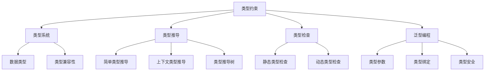

                 

## 类型约束：增强代码表达能力的手段

关键词：类型约束、编程语言、代码质量、类型推导、泛型编程、Web开发、数据科学

摘要：本文将深入探讨类型约束在编程语言中的应用及其对代码表达能力的重要性。通过逐步分析类型约束的基本概念、历史发展、核心机制以及实际应用，本文旨在帮助读者理解类型约束在提升代码清晰性、减少错误和提高开发效率方面的关键作用。文章将涵盖类型约束在静态类型语言和动态类型语言中的实现，介绍类型推导与类型推断的原理，探讨类型约束与泛型编程的关系，并提供实际开发中的案例分析，最终展望类型约束的未来发展趋势和研究方向。

## 第一部分：类型约束基础

### 第1章：类型约束概述

#### 1.1 类型约束的定义与重要性

类型约束（Type Constraints）在编程语言中是指对变量、函数或对象的数据类型施加的限制。简单来说，类型约束就是确保数据在使用过程中符合预定的类型要求。这种约束有助于提高代码的可读性、减少运行时错误和提高开发效率。

类型约束的重要性主要体现在以下几个方面：

1. **增强代码可读性**：类型约束使得代码中的变量和函数的使用更加明确，减少了类型错误的可能性，从而提高了代码的可读性。
2. **减少运行时错误**：类型约束可以在编译时捕获类型错误，避免了运行时错误的出现，提高了程序的稳定性。
3. **提高开发效率**：通过类型约束，开发者可以更快地找到并修复类型相关的错误，减少了调试时间，提高了开发效率。
4. **代码重用**：类型约束使得代码模块化，提高了代码的复用性，有助于构建可维护和可扩展的软件系统。

#### 1.2 类型约束的历史与发展

类型约束的概念并非一蹴而就，它随着编程语言的发展逐渐成熟。在早期的编程语言如Fortran和COBOL中，并没有严格的类型约束机制。随着计算机技术的发展，类型约束逐渐成为编程语言的重要组成部分。

1. **静态类型语言**：如C、C++和Java等，这些语言在编译时对类型进行严格检查，确保代码在运行前符合类型要求。静态类型语言的类型约束机制有助于提高程序的可靠性和性能。
2. **动态类型语言**：如Python和JavaScript等，这些语言在运行时检查类型，类型约束相对较宽松。尽管动态类型语言的灵活性较高，但类型约束仍然扮演着重要角色，帮助减少运行时错误。

#### 1.3 类型约束的应用场景

类型约束在不同类型的编程场景中有着广泛的应用：

1. **Web开发**：在Web开发中，类型约束有助于确保前后端交互的数据类型一致，减少数据转换错误。
2. **数据科学**：类型约束在数据处理和分析中至关重要，可以确保数据的类型正确，提高计算效率。
3. **操作系统和嵌入式系统**：在操作系统和嵌入式系统中，类型约束有助于确保系统稳定性和安全性。
4. **大型软件系统**：在大型软件系统中，类型约束有助于提高代码的可维护性和可扩展性，减少bug。

通过以上对类型约束的介绍，我们可以看出，类型约束在编程语言中具有不可忽视的重要性。接下来，我们将进一步探讨编程语言中的类型约束机制。

### 第2章：编程语言中的类型约束

#### 2.1 静态类型语言与动态类型语言

编程语言根据类型约束机制的不同，可以分为静态类型语言和动态类型语言。这两种类型语言在类型约束的实现方式和应用场景上有所区别。

##### 2.1.1 静态类型语言

静态类型语言在编译时对类型进行严格检查，确保代码在运行前符合类型要求。常见的静态类型语言有C、C++、Java和C#等。

1. **类型检查时间**：静态类型语言在编译时进行类型检查，一旦发现类型错误，编译器会立即报错。
2. **性能**：静态类型语言由于在编译时进行类型检查，可以生成更高效的机器码，从而提高程序的运行速度。
3. **代码复杂度**：静态类型语言要求在编写代码时明确指定类型，这可能增加代码的复杂度。

##### 2.1.2 动态类型语言

动态类型语言在运行时进行类型检查，类型约束相对较宽松。常见的动态类型语言有Python、JavaScript和Ruby等。

1. **类型检查时间**：动态类型语言在运行时进行类型检查，程序在运行过程中可能会遇到类型错误。
2. **性能**：动态类型语言由于在运行时进行类型检查，通常性能不如静态类型语言。
3. **代码复杂度**：动态类型语言允许更灵活的类型使用，代码通常更简洁，但这也可能导致类型错误。

#### 2.2 常见的类型约束机制

不同编程语言采用了各种类型的约束机制，以下是一些常见的类型约束机制：

##### 2.2.1 强类型与弱类型

1. **强类型**：强类型语言对类型约束要求严格，不允许隐式类型转换。例如，Java是强类型语言，不允许在整数和字符串之间进行隐式转换。
2. **弱类型**：弱类型语言对类型约束较为宽松，允许隐式类型转换。例如，Python是弱类型语言，可以在整数和字符串之间进行隐式转换。

##### 2.2.2 枚举类型与联合类型

1. **枚举类型**：枚举类型是一种特殊的类型，用于表示一组命名的常量。例如，可以使用枚举类型来定义一周中的天数：
    ```python
    enum Weekday:
        MONDAY,
        TUESDAY,
        WEDNESDAY,
        THURSDAY,
        FRIDAY,
        SATURDAY,
        SUNDAY
    ```
2. **联合类型**：联合类型表示一组可能具有不同类型的值。例如，在C语言中，可以使用联合类型来定义一个结构体，其中包含整数和浮点数：
    ```c
    struct Data {
        int intValue;
        float floatValue;
    };
    ```

##### 2.2.3 泛型编程

泛型编程是一种在编程语言中允许使用类型参数编写通用代码的编程范式。通过泛型编程，可以创建可重用的代码库，无需为每个数据类型编写特定代码。例如，在Java中，可以使用泛型类来定义一个通用的堆栈：
    ```java
    public class Stack<T> {
        private T[] elements;
        private int size = 0;
        
        public void push(T element) {
            elements[size++] = element;
        }
        
        public T pop() {
            return elements[--size];
        }
    }
    ```

#### 2.3 类型约束在编程语言中的实现

不同编程语言采用了不同的方式来实现类型约束。以下是一些常见编程语言的类型约束实现：

##### 2.3.1 Java中的类型约束

Java是一种静态类型语言，它在编译时对类型进行严格检查。Java中的类型约束主要通过以下方式实现：

1. **类型声明**：在Java中，每个变量、函数和类都需要明确声明类型。例如：
    ```java
    int x = 10;
    String name = "John";
    ```
2. **类型检查**：Java编译器在编译代码时对类型进行检查，确保代码在运行前符合类型要求。
3. **泛型编程**：Java 5引入了泛型编程，允许在代码中使用类型参数来编写通用代码。例如：
    ```java
    List<String> strings = new ArrayList<>();
    List<Integer> numbers = new ArrayList<>();
    ```

##### 2.3.2 C++中的类型约束

C++也是一种静态类型语言，它在类型约束方面具有较大的灵活性。C++中的类型约束主要通过以下方式实现：

1. **模板**：C++支持模板编程，通过模板可以创建可重用的代码库，无需为每个数据类型编写特定代码。例如：
    ```cpp
    template<typename T>
    class Stack {
        T[] elements;
        int size;
    public:
        void push(T element);
        T pop();
    };
    ```
2. **类型检查**：C++编译器在编译代码时对类型进行检查，确保代码在运行前符合类型要求。

##### 2.3.3 Python中的类型约束

Python是一种动态类型语言，它在运行时进行类型检查。Python中的类型约束主要通过以下方式实现：

1. **类型提示**：Python 3.5引入了类型提示，允许在代码中使用注释来指定变量的类型。例如：
    ```python
    def add(a: int, b: int) -> int:
        return a + b
    ```
2. **类型检查工具**：如Mypy，这些工具在运行时对代码进行类型检查，确保代码符合类型要求。

通过以上对编程语言中类型约束机制的介绍，我们可以看到类型约束在静态类型语言和动态类型语言中的不同实现方式和应用场景。接下来，我们将进一步探讨类型约束的核心概念与联系。

### 第3章：类型约束的核心概念与联系

#### 3.1 类型约束与类型系统

类型系统是编程语言的核心组成部分，它定义了数据类型和变量如何存储、操作和传递。类型约束与类型系统紧密相关，共同构成了编程语言的基石。

1. **类型**：类型是变量可以存储的数据集合。在编程语言中，常见的类型有整数、浮点数、字符串、布尔值等。
2. **类型系统**：类型系统定义了数据类型的集合、数据类型的操作规则以及类型之间的兼容性规则。不同类型的编程语言具有不同的类型系统。
3. **类型约束**：类型约束是类型系统的一部分，它对变量、函数和对象的类型施加限制，确保数据在使用过程中符合预定的类型要求。

#### 3.2 类型推导与类型检查

类型推导和类型检查是类型约束的两个重要组成部分，它们在确保代码类型安全性和提高代码可读性方面发挥着关键作用。

1. **类型推导**：类型推导是指编程语言自动确定变量或表达式的类型，无需开发者显式声明类型。类型推导有助于提高代码的简洁性和可读性。例如，在Python中，变量`x = 10`可以自动推导出类型为`int`。
2. **类型检查**：类型检查是指编程语言在编译或运行时对代码进行类型验证，确保代码符合类型要求。类型检查可以在编译时捕获类型错误，减少运行时错误。例如，在Java中，编译器在编译时对代码进行类型检查。

#### 3.3 类型约束与程序优化

类型约束不仅有助于提高代码的可读性和可维护性，还可以在程序优化过程中发挥重要作用。

1. **类型信息优化**：类型约束提供了关于代码的数据类型信息，编译器可以利用这些信息进行更高效的代码生成和优化。例如，在静态类型语言中，类型信息可以帮助编译器生成更高效的机器码。
2. **静态分析优化**：类型约束允许编译器进行更精细的静态分析，从而发现潜在的代码错误并进行优化。例如，在C++中，类型约束可以帮助编译器进行循环优化和分支优化。
3. **内存分配优化**：类型约束可以帮助编译器更好地进行内存分配优化，减少内存占用和提高程序性能。例如，在Java中，类型约束可以帮助垃圾回收器更高效地回收内存。

通过以上对类型约束与类型系统、类型推导与类型检查、类型约束与程序优化的讨论，我们可以看到类型约束在编程语言中的核心地位和广泛影响。接下来，我们将探讨类型约束在实际开发中的应用与实践。

### 第4章：类型约束的应用与实践

#### 4.1 类型约束在Web开发中的应用

类型约束在Web开发中扮演着重要的角色，它有助于确保前后端交互的数据类型一致性，减少数据转换错误，提高开发效率。

##### 4.1.1 使用React进行类型约束

React是一种流行的前端框架，它提供了丰富的组件和API，使得开发复杂的Web应用程序变得更加简单。React通过TypeScript实现了类型约束，使得代码更加健壮和可维护。

1. **React类型约束**：React使用TypeScript进行类型约束，通过类型注解来明确组件的输入和输出类型。例如：
    ```typescript
    function Greeting(name: string): string {
        return `Hello, ${name}!`;
    }
    ```
   在这个例子中，`Greeting`组件的输入参数`name`是`string`类型，返回值也是`string`类型。
2. **类型推导**：React充分利用TypeScript的类型推导功能，使得开发者无需显式声明所有类型。例如：
    ```typescript
    function addUsertoList(user: any): void {
        // 类型推导：user的类型自动推导为User类型
        userList.push(user);
    }
    ```
   在这个例子中，`user`参数的类型通过类型推导自动推导为`User`类型。
3. **类型检查**：React通过TypeScript的静态类型检查功能，确保组件在编译时符合类型要求。例如，如果一个组件的输入类型不符合预期，TypeScript编译器会报错。

##### 4.1.2 使用TypeScript增强React代码质量

TypeScript是一种静态类型语言，它通过类型注解和类型推导功能，显著提高了React代码的质量和可维护性。

1. **类型安全**：TypeScript通过静态类型检查确保代码在编译时符合类型要求，减少了运行时错误。例如，在一个使用TypeScript的React项目中，如果组件的输入类型不符合预期，编译器会报错。
2. **代码可读性**：TypeScript的类型注解和类型推导功能使得代码更加清晰和易于理解。例如，通过类型注解，开发者可以更直观地了解组件的输入和输出类型。
3. **代码重构**：TypeScript的类型检查功能有助于进行代码重构。在重构过程中，TypeScript可以确保代码在编译时符合类型要求，从而减少重构过程中引入的错误。
4. **工具支持**：TypeScript提供了丰富的工具支持，如自动完成、代码格式化和代码检查等，使得开发者可以更高效地编写和修改代码。

通过以上对类型约束在Web开发中的应用和实践的讨论，我们可以看到类型约束在提高代码质量、减少错误和提高开发效率方面的关键作用。接下来，我们将探讨类型约束在数据科学中的应用。

#### 4.2 类型约束在数据科学中的应用

类型约束在数据科学领域也发挥着重要作用，它有助于确保数据处理和分析的正确性，提高计算效率。

##### 4.2.1 使用Python中的类型约束进行数据处理

Python是一种广泛应用于数据科学的编程语言，它提供了丰富的库和工具用于数据处理和分析。通过在Python中引入类型约束，可以显著提高数据处理和分析的正确性和效率。

1. **NumPy**：NumPy是Python中的一个重要库，它提供了多维数组对象和广泛的数学函数。NumPy支持类型约束，通过指定数组元素的数据类型，可以确保数据的正确性和高效性。例如：
    ```python
    import numpy as np
    data = np.array([1, 2, 3], dtype=np.int32)
    ```
   在这个例子中，`data`数组的数据类型被显式指定为`int32`，确保了数组的元素都是整数类型。
2. **Pandas**：Pandas是Python中的一个重要库，它提供了数据帧（DataFrame）和系列（Series）对象，用于数据操作和分析。Pandas支持类型约束，通过指定数据帧和系列的数据类型，可以确保数据的正确性和一致性。例如：
    ```python
    import pandas as pd
    df = pd.DataFrame({'A': [1, 2, 3], 'B': [4, 5, 6]}, dtype={'A': np.int32, 'B': np.float64})
    ```
   在这个例子中，`df`数据帧的列`A`和`B`的数据类型分别被指定为`int32`和`float64`，确保了数据帧中对应列的数据类型正确。
3. **类型检查**：在Python中进行数据处理时，类型检查可以帮助发现潜在的类型错误。例如，如果在一个数据帧中使用错误的类型，Pandas会报错，从而避免运行时错误。

##### 4.2.2 使用NumPy进行类型约束

NumPy是Python中用于数值计算的重要库，它提供了丰富的函数和工具用于数据处理和分析。通过在NumPy中使用类型约束，可以确保数据处理的正确性和高效性。

1. **数据类型**：NumPy支持多种数据类型，如整数（`int`）、浮点数（`float`）、复数（`complex`）等。通过指定数据类型，可以确保数组的元素类型正确。例如：
    ```python
    arr = np.array([1.0, 2.0, 3.0], dtype=np.float64)
    ```
    在这个例子中，`arr`数组的数据类型被指定为`float64`，确保了数组的元素都是双精度浮点数。
2. **类型检查**：NumPy在数组操作过程中会对类型进行检查，确保操作的一致性。例如，如果尝试将一个整数数组与一个浮点数数组进行操作，NumPy会自动将整数数组转换为浮点数数组，从而避免类型错误。
3. **性能优化**：通过在NumPy中使用类型约束，可以显著提高数值计算的效率。例如，使用整数类型（`int32`或`int64`）进行整数运算通常比使用浮点数类型（`float32`或`float64`）更高效。

通过以上对类型约束在数据科学中的应用和实践的讨论，我们可以看到类型约束在提高数据处理和分析的正确性、高效性和可维护性方面的关键作用。类型约束不仅在Web开发和数据科学领域有着广泛的应用，还在其他领域发挥着重要作用。在下一部分，我们将探讨类型约束的高级特性。

## 第二部分：高级类型约束

### 第5章：类型推导与类型推断

#### 5.1 类型推导的基本原理

类型推导是指编程语言在编译或运行时自动确定变量或表达式的类型，无需开发者显式声明类型。类型推导有助于提高代码的可读性和开发效率。

1. **静态类型推导**：在静态类型语言中，类型推导通常发生在编译时。编译器通过分析代码的结构和上下文，推导出变量或表达式的类型。例如，在Java中，如果一个变量的类型不能通过类型推导确定，编译器会报错。
2. **动态类型推导**：在动态类型语言中，类型推导通常发生在运行时。解释器在执行代码时，根据上下文推导出变量或表达式的类型。例如，在Python中，变量`x = 10`可以自动推导出类型为`int`。
3. **类型推导的优势**：类型推导可以减少代码中的类型声明，使得代码更加简洁和易读。同时，类型推导有助于减少类型错误，提高代码的可维护性。

#### 5.2 类型推断的算法与方法

类型推断是类型推导的核心过程，它通过一系列算法和方法来确定变量或表达式的类型。以下是一些常见的类型推断算法：

1. **简单类型推断**：简单类型推断是最基础的类型推断方法，通过简单的规则来确定类型。例如，如果一个变量的值是整数，那么它的类型就是`int`。
2. **上下文类型推断**：上下文类型推断通过分析代码的上下文来确定类型。例如，在一个函数中，如果返回值的类型没有明确指定，编译器会根据函数体中的返回值来确定类型。
3. **类型推导树**：类型推导树是一种数据结构，用于表示类型推导过程中的各种规则和约束。通过类型推导树，可以更清晰地描述类型推导的过程。
4. **类型约束传播**：类型约束传播是一种通过传播类型约束来确定变量或表达式类型的方法。例如，在函数调用中，如果参数的类型与函数定义中的类型约束不一致，编译器会尝试通过类型约束传播来推导出合适的类型。

#### 5.3 类型推断在实际编程中的应用

类型推断在编程语言中有着广泛的应用，它有助于提高代码的灵活性和可维护性。以下是一些类型推断在实际编程中的应用：

1. **函数参数**：在函数定义中，可以通过类型推断来简化参数的类型声明。例如，在Python中，函数参数可以通过类型推断来自动确定类型：
    ```python
    def add(a, b):
        return a + b
    ```
   在这个例子中，参数`a`和`b`的类型通过类型推断自动推导出。
2. **泛型编程**：泛型编程是一种在编程语言中允许使用类型参数编写通用代码的编程范式。类型推断在泛型编程中发挥着重要作用，它有助于简化泛型代码的编写。例如，在Java中，可以使用类型推断来简化泛型代码：
    ```java
    List<String> strings = new ArrayList<>();
    List<Integer> numbers = new ArrayList<>();
    ```
   在这个例子中，`strings`和`numbers`的类型通过类型推断自动推导出。
3. **闭包和匿名函数**：在闭包和匿名函数中，类型推断可以帮助简化代码的编写。例如，在JavaScript中，匿名函数可以通过类型推断来自动确定类型：
    ```javascript
    const add = (a, b) => a + b;
    ```
   在这个例子中，匿名函数`add`的参数类型通过类型推断自动推导出。

通过以上对类型推导与类型推断的讨论，我们可以看到类型推断在编程语言中的应用和优势。类型推断不仅有助于简化代码的编写，还可以提高代码的可读性和可维护性。在下一章中，我们将探讨类型约束与泛型编程的关系。

### 第6章：类型约束与泛型编程

#### 6.1 泛型编程的基本概念

泛型编程是一种在编程语言中允许使用类型参数编写通用代码的编程范式。通过泛型编程，可以创建可重用的代码库，无需为每个数据类型编写特定代码。泛型编程的基本概念包括：

1. **类型参数**：类型参数是一种用于表示通用类型的占位符。在定义泛型类、接口或函数时，可以使用类型参数来表示要处理的类型。例如，在Java中，可以使用类型参数来定义一个泛型类：
    ```java
    public class Stack<T> {
        // ...
    }
    ```
   在这个例子中，`T`是一个类型参数，用于表示堆栈中存储的类型。
2. **类型绑定**：类型绑定是指将类型参数与具体类型相关联。在创建泛型类的实例时，需要指定类型参数的具体类型。例如：
    ```java
    Stack<Integer> integerStack = new Stack<>();
    Stack<String> stringStack = new Stack<>();
    ```
   在这个例子中，`integerStack`和`stringStack`分别是`Stack`类的实例，它们的类型参数被绑定到`Integer`和`String`类型。
3. **泛型类型安全**：泛型编程的核心目标是确保类型安全。通过类型参数和类型绑定，可以确保在泛型类中使用的是合法的类型，从而避免类型错误。例如，在Java中，如果尝试向一个泛型集合中添加错误类型的对象，编译器会报错。

#### 6.2 泛型编程的优势与挑战

泛型编程具有显著的优势，但也带来了一些挑战。以下分别介绍泛型编程的优势和挑战：

##### 6.2.1 泛型编程的优势

1. **代码复用**：泛型编程允许编写可重用的代码库，无需为每个数据类型编写特定代码。例如，可以使用同一个泛型类来实现多种数据类型的堆栈、队列等数据结构。
2. **类型安全**：泛型编程通过类型参数和类型绑定确保了类型安全，减少了运行时类型错误。在泛型类中，编译器可以根据类型参数和类型绑定来检查代码的类型一致性。
3. **代码简洁**：泛型编程可以简化代码的编写，减少冗余的类型声明。例如，在Java中，泛型编程可以简化集合操作，使得代码更加简洁易读。

##### 6.2.2 泛型编程的挑战

1. **类型擦除**：泛型编程通常涉及类型擦除（Type Erasure）机制。类型擦除是指编译器在编译泛型代码时，将类型参数替换为通用的类型占位符，从而使得泛型类的实例在运行时无法访问类型参数的信息。这可能导致一些性能问题和类型安全性的降低。
2. **类型检查限制**：泛型编程的类型检查存在一些限制，例如，无法在泛型类中使用泛型类型作为方法参数或返回值。这些限制可能导致编写泛型代码时需要使用复杂的类型转换。
3. **编译时错误**：泛型编程可能导致一些编译时错误，例如，泛型类之间的类型兼容性问题。这些问题通常需要通过类型转换和类型绑定来解决。

#### 6.3 泛型编程的实际应用案例

泛型编程在编程语言中有着广泛的应用，以下是一些实际应用案例：

1. **Java中的泛型**：Java从版本5开始引入了泛型编程，它广泛应用于集合框架、数据结构和算法等场景。例如，Java中的`List`、`Map`和`Set`等集合框架都使用了泛型编程，使得代码更加简洁和类型安全。
2. **C++中的泛型**：C++支持模板编程，它是一种泛型编程的形式。C++的模板编程广泛应用于数据结构和算法，如`std::vector`、`std::map`和`std::function`等。通过模板编程，C++可以创建可重用的代码库，提高代码的可维护性。
3. **Python中的泛型**：Python从版本3.5开始引入了类型提示，它类似于泛型编程。Python的类型提示可以用于简化代码的编写，提高代码的可读性和类型安全性。例如，在Python中，可以使用类型提示来定义泛型函数：
    ```python
    from typing import TypeVar, Generic

    T = TypeVar('T')

    class Stack(Generic[T]):
        def push(self, item: T):
            # ...

        def pop(self) -> T:
            # ...
    ```

通过以上对泛型编程的基本概念、优势与挑战以及实际应用案例的讨论，我们可以看到泛型编程在编程语言中的应用和价值。泛型编程不仅有助于提高代码的复用性和类型安全性，还可以简化代码的编写和提高代码的可维护性。在下一章中，我们将探讨类型约束对代码质量的影响。

### 第7章：类型约束与代码质量

#### 7.1 类型约束对代码质量的影响

类型约束在提高代码质量方面发挥着至关重要的作用。通过类型约束，可以显著提高代码的可读性、可维护性和可靠性。

##### 7.1.1 提高代码可读性

类型约束通过明确指定变量、函数和对象的类型，使得代码更加清晰和易于理解。类型约束可以帮助开发人员快速了解代码的功能和用途，减少阅读和理解代码的时间。例如，在TypeScript中，类型约束可以明确指定函数的参数类型和返回值类型，使得函数调用更加直观：

```typescript
function add(a: number, b: number): number {
    return a + b;
}

const result = add(5, 3);
```

在这个例子中，函数`add`的参数类型和返回值类型都被明确指定，使得函数调用更加直观。开发人员可以清楚地了解函数的输入和输出类型，从而更容易理解代码的逻辑。

##### 7.1.2 提高代码可维护性

类型约束有助于提高代码的可维护性，使得代码更加模块化和可重用。通过类型约束，可以确保代码模块之间的依赖关系明确，减少模块之间的耦合。类型约束还可以帮助开发人员在修改代码时更好地理解现有代码的功能和用途，从而降低修改引入错误的风险。例如，在Java中，类型约束可以帮助开发者创建可重用的代码库，提高代码的可维护性：

```java
public class Stack<T> {
    private List<T> elements;

    public void push(T element) {
        elements.add(element);
    }

    public T pop() {
        return elements.remove(0);
    }
}

public class Main {
    public static void main(String[] args) {
        Stack<Integer> integerStack = new Stack<>();
        integerStack.push(5);
        integerStack.push(3);
        System.out.println(integerStack.pop()); // 输出3
    }
}
```

在这个例子中，`Stack`类是一个泛型类，它通过类型约束实现了对存储类型的明确限制。这使得`Stack`类可以用于多种数据类型，提高了代码的可重用性。同时，在`Main`类中，通过类型约束，可以确保`integerStack`的存储类型是`Integer`，从而减少了可能的类型错误。

##### 7.1.3 提高代码可靠性

类型约束通过在编译时捕获类型错误，提高了代码的可靠性。在静态类型语言中，类型约束可以确保代码在运行前符合类型要求，从而避免了运行时类型错误。例如，在Java中，类型约束可以在编译时发现类型错误，从而避免程序在运行时崩溃：

```java
public class Main {
    public static void main(String[] args) {
        List<Integer> numbers = new ArrayList<>();
        numbers.add("Hello"); // 编译时错误：类型不匹配
    }
}
```

在这个例子中，尝试将一个字符串添加到一个整数列表中，这将导致编译时错误。类型约束在编译时发现了类型错误，从而避免了程序在运行时崩溃。

#### 7.2 如何利用类型约束提高代码质量

为了充分利用类型约束提高代码质量，以下是一些实用的方法和最佳实践：

##### 7.2.1 编写清晰的类型注释

编写清晰的类型注释是利用类型约束提高代码质量的基础。类型注释可以帮助开发人员更好地理解代码的功能和用途，从而减少错误。例如，在Python中，可以使用类型提示来编写清晰的类型注释：

```python
from typing import List

def add_two_numbers(a: int, b: int) -> int:
    return a + b

def calculate_average(numbers: List[int]) -> float:
    return sum(numbers) / len(numbers)
```

在这个例子中，类型注释明确指定了函数的参数类型和返回值类型，使得代码更加清晰和易于理解。

##### 7.2.2 使用类型约束进行代码重构

类型约束可以帮助开发人员在重构代码时更好地理解现有代码的功能和用途，从而降低重构引入错误的风险。通过类型约束，可以确保重构后的代码与现有代码的功能保持一致。例如，在Java中，可以使用类型约束来重构代码：

```java
public class Stack<T> {
    private List<T> elements;

    public void push(T element) {
        elements.add(element);
    }

    public T pop() {
        return elements.remove(0);
    }
}

// 重构前的代码
List<Integer> integerStack = new ArrayList<>();
integerStack.add(5);
integerStack.add(3);
System.out.println(integerStack.pop()); // 输出3

// 重构后的代码
Stack<Integer> integerStack = new Stack<>();
integerStack.push(5);
integerStack.push(3);
System.out.println(integerStack.pop()); // 输出3
```

在这个例子中，通过将`List`重构为`Stack`，类型约束确保了重构后的代码与重构前的代码功能一致。

##### 7.2.3 避免类型滥用与类型漏约束

避免类型滥用和类型漏约束是确保代码质量的重要措施。类型滥用可能导致运行时类型错误和程序崩溃，而类型漏约束可能导致编译时无法发现类型错误。以下是一些避免类型滥用和类型漏约束的建议：

1. **明确指定类型**：在编写代码时，尽量明确指定变量、函数和对象的类型，避免使用泛型类型或默认类型。明确指定类型可以提高代码的可读性和可维护性。
2. **使用类型检查工具**：使用类型检查工具，如Mypy（Python中的类型检查工具），可以在运行时发现类型错误，从而提高代码的可靠性。
3. **避免使用Any类型**：在动态类型语言中，避免使用`Any`类型。`Any`类型表示可以接受任何类型的值，它可能导致类型错误和运行时错误。

通过以上对类型约束与代码质量的影响以及如何利用类型约束提高代码质量的讨论，我们可以看到类型约束在提高代码质量、可读性和可靠性方面的关键作用。在下一章中，我们将展望类型约束的未来发展趋势和研究方向。

### 第8章：类型约束的未来趋势

#### 8.1 类型约束在编程语言中的未来发展

随着编程语言的发展，类型约束将继续在编程语言中扮演重要角色，未来可能会出现以下趋势：

1. **更灵活的类型系统**：未来的编程语言可能会引入更灵活的类型系统，允许更广泛的类型转换和类型兼容性。这将使类型约束更加灵活，适应更复杂的编程场景。
2. **更强大的类型推导**：类型推导将变得更加智能化，利用机器学习和自然语言处理技术来预测和推导类型。这将减少开发人员手动指定类型的负担，提高开发效率。
3. **更全面的多语言支持**：类型约束将跨越不同编程语言，实现跨语言互操作。这将有助于开发人员在不同编程语言之间共享代码库和工具，提高代码的可重用性。
4. **更多编程范式支持**：类型约束将支持更多编程范式，如函数式编程、面向对象编程和并发编程。这将使类型约束更好地适应不同编程需求，提高代码的可维护性。

#### 8.2 类型约束在实际开发中的未来应用

类型约束在实际开发中的应用将越来越广泛，未来可能会出现以下趋势：

1. **更高效的数据处理**：类型约束将在数据科学和大数据处理中发挥更大作用，通过确保数据类型的正确性，提高数据处理和分析的效率。
2. **更智能的Web开发**：类型约束将广泛应用于Web开发，特别是在前端框架和后端服务中。通过类型约束，可以确保前后端交互的数据类型一致性，提高开发效率和代码质量。
3. **更安全的系统开发**：类型约束将在操作系统和嵌入式系统开发中发挥关键作用，确保系统的稳定性和安全性。通过严格的类型约束，可以减少系统漏洞和安全性问题。
4. **更强大的AI开发**：类型约束将在人工智能领域发挥重要作用，特别是在机器学习和深度学习项目中。通过类型约束，可以确保算法和数据类型的正确性，提高AI模型的性能和可靠性。

#### 8.3 类型约束的研究方向与挑战

类型约束的研究将继续探索新的领域和挑战，未来可能的研究方向包括：

1. **静态类型与动态类型的融合**：研究如何将静态类型和动态类型的优点结合起来，实现更高效和灵活的类型系统。
2. **类型推导的优化**：研究如何优化类型推导算法，提高类型推导的效率和准确性，减少类型错误。
3. **类型安全与性能优化**：研究如何在确保类型安全的同时，优化程序性能，减少类型约束对程序运行速度的影响。
4. **跨语言类型约束**：研究如何实现跨语言类型约束，促进不同编程语言之间的代码共享和互操作。
5. **类型约束在新兴领域中的应用**：探索类型约束在新兴领域，如区块链、物联网和量子计算等中的应用，推动类型约束技术的创新和发展。

通过以上对类型约束在未来编程语言和实际开发中的应用以及研究方向和挑战的讨论，我们可以看到类型约束在未来将继续发展，并在编程语言和实际开发中发挥更加重要的作用。

## 附录

### 附录A：编程语言类型约束工具与资源

#### A.1 TypeScript

TypeScript是一种由微软开发的静态类型语言，它为JavaScript添加了类型系统，提高了代码的可维护性和可靠性。以下是一些TypeScript的相关资源：

##### A.1.1 TypeScript入门教程

1. **官方文档**：TypeScript官方文档提供了全面的入门教程，包括安装、配置和使用TypeScript的基础知识。
   - [TypeScript官方文档](https://www.typescriptlang.org/)

2. **在线教程**：在线教程如Traversy Media的TypeScript教程，可以帮助初学者快速掌握TypeScript的基础知识。
   - [Traversy Media TypeScript教程](https://www.traversymedia.com/typescript-tutorial/)

##### A.1.2 TypeScript最佳实践

1. **TypeScript编码规范**：遵循TypeScript编码规范，可以提高代码的可读性和一致性。NPM上的TypeScript编码规范可以参考。
   - [TypeScript编码规范](https://github.com/palantir/tslint)

2. **TypeScript最佳实践**：TypeScript官方社区提供了许多最佳实践，包括如何使用类型、类型推导和类型检查等。
   - [TypeScript最佳实践](https://github.com/palantir/tslint/blob/1.23.0/lib/rules/tslint/no-unused-variable.ts)

#### A.2 MyPy

Mypy是一种Python静态类型检查工具，它可以帮助发现代码中的类型错误。以下是一些Mypy的相关资源：

##### A.2.1 MyPy安装与配置

1. **官方文档**：Mypy官方文档提供了详细的安装和配置指南，包括如何在不同的环境中安装和配置Mypy。
   - [Mypy官方文档](https://mypy.readthedocs.io/en/stable/)

2. **安装指南**：在Python环境中，可以使用pip安装Mypy：
   ```bash
   pip install mypy
   ```

##### A.2.2 MyPy使用指南

1. **基本用法**：使用Mypy对Python代码进行类型检查，可以通过以下命令：
   ```bash
   mypy your_code.py
   ```

2. **高级用法**：Mypy支持许多高级选项，如检查未使用的类型注释、检查循环依赖等。以下是一个示例命令：
   ```bash
   mypy --ignore-missing-imports --checks=* your_code.py
   ```

### 附录B：类型约束核心概念与联系Mermaid流程图

为了更直观地展示类型约束的核心概念与联系，我们使用Mermaid流程图来表示类型约束的各个组成部分和它们之间的关系。以下是一个简单的Mermaid流程图示例：



在这个流程图中，我们展示了类型约束的核心概念与联系。每个节点代表一个核心概念，节点之间的连线表示它们之间的关系。通过这个流程图，我们可以更好地理解类型约束在编程语言中的地位和作用。

## 结语

本文详细探讨了类型约束在编程语言中的应用及其对代码表达能力的重要性。从类型约束的定义与重要性，到编程语言中的类型约束机制，再到类型约束的核心概念与联系，以及类型约束在实际开发中的应用与实践，我们逐步分析了类型约束在提高代码清晰性、减少错误和提高开发效率方面的关键作用。

类型约束不仅增强了代码的表达能力，还提高了代码的可读性、可维护性和可靠性。通过类型推导和类型检查，我们可以确保代码在编译时或运行时符合类型要求，从而减少错误和优化性能。类型约束在静态类型语言和动态类型语言中有着不同的实现方式，但在提高代码质量方面具有共通性。

展望未来，类型约束将继续发展，并在编程语言和实际开发中发挥更加重要的作用。通过更灵活的类型系统、更强大的类型推导和更全面的多语言支持，类型约束将为开发人员提供更高效、更可靠的编程体验。同时，类型约束在实际开发中的应用也将越来越广泛，从Web开发到数据科学，再到操作系统和人工智能领域，类型约束将为各种应用场景带来显著的价值。

总之，类型约束是提升代码质量的重要手段，它将为编程语言的进一步发展和实际应用带来深远的影响。通过深入理解类型约束的核心概念和实际应用，开发人员可以更好地掌握类型约束技术，提高自己的编程能力和项目质量。作者：AI天才研究院/AI Genius Institute & 禅与计算机程序设计艺术 /Zen And The Art of Computer Programming。希望本文能为您在类型约束领域的研究和实践提供有益的参考和启示。

