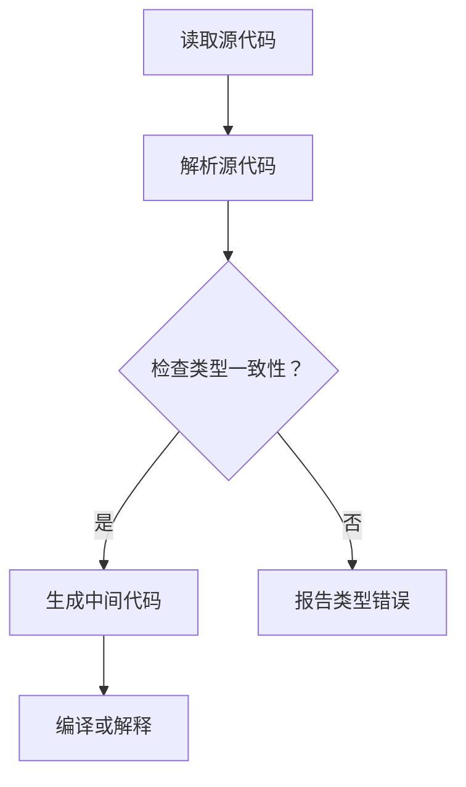
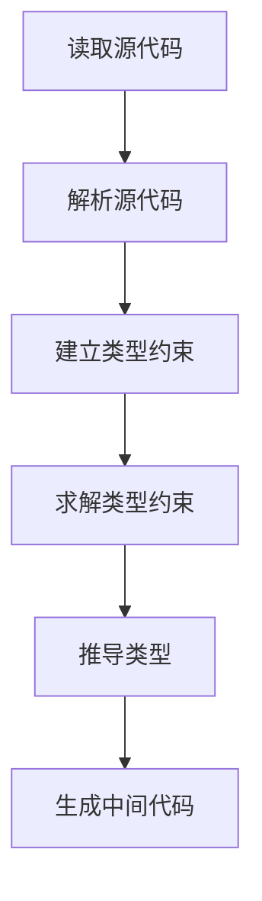
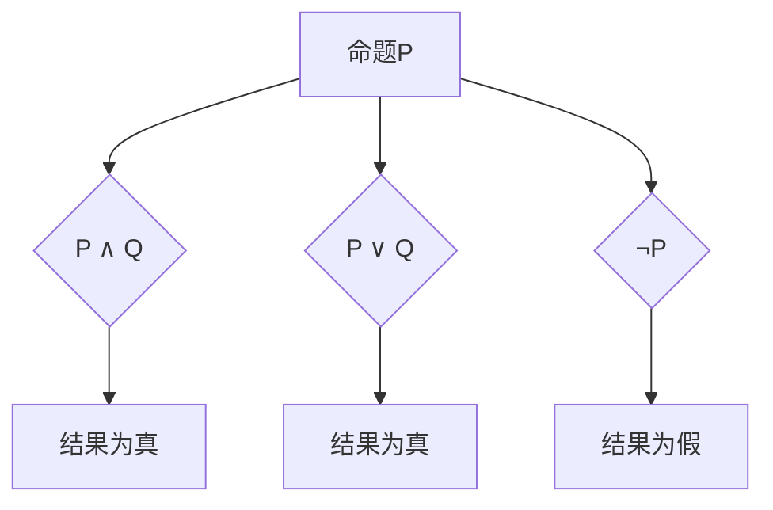
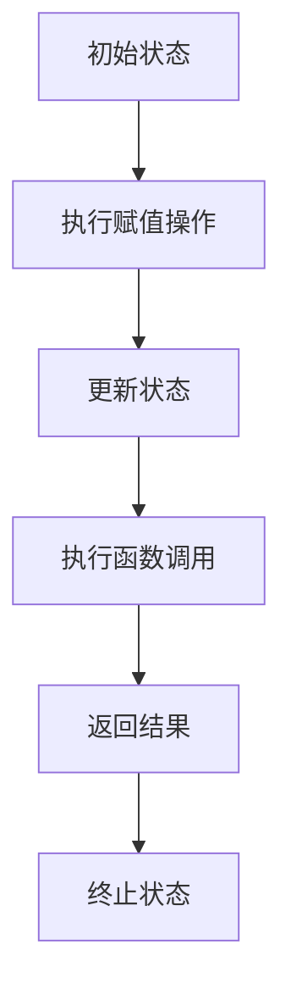
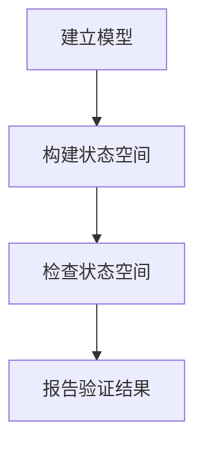

                 

### 文章标题

《类型论与形式化方法：软件工程的新趋势》

---

关键词：类型论、形式化方法、软件工程、类型检查、类型推断

---

摘要：本文深入探讨了类型论与形式化方法在软件工程中的应用及其重要性。首先，介绍了类型论的基础概念，并分析了其在软件工程中的具体应用。接着，详细解析了形式化方法的定义及其在类型论中的应用。随后，文章围绕类型检查与类型推断的核心算法原理进行讲解，并引用了实际的数学模型与公式。在此基础上，文章通过项目实战展示了类型论与形式化方法在实际软件开发中的具体应用，最终总结了这两大方法在软件工程领域的发展趋势与未来展望。

---

在接下来的章节中，我们将一步一步地分析类型论与形式化方法在软件工程中的核心概念、算法原理、数学模型及实际应用，以期为您展现这两大方法在当前软件工程领域中的重要作用和未来发展方向。

---

### 第一部分 核心概念与联系

在本部分，我们将深入探讨类型论与形式化方法的基本概念，以及它们在软件工程中的相互联系。通过分析这些核心概念，我们将为理解它们在软件开发中的应用奠定坚实的基础。

#### 1.1 类型论基础

类型论是一种研究变量、值和表达式的类型的数学理论。它起源于逻辑学和数学领域，并在计算机科学中得到了广泛应用。类型论的核心思想是通过定义类型来保证程序的可靠性和安全性。

##### 1.1.1 类型系统的基本概念

类型系统是一组规则，用于定义变量、值和表达式的类型，以及它们之间的合法操作。根据类型的静态性和动态性，类型系统可以分为静态类型系统和动态类型系统。

- **静态类型系统**：在程序编译时检查类型，程序运行时不进行类型检查。
- **动态类型系统**：在程序运行时检查类型，允许类型检查延迟到程序执行时。

##### 1.1.2 类型论的发展历史

类型论的历史可以追溯到20世纪40年代，当时为了解决形式化数学和逻辑中的问题，学者们开始研究类型系统。随着计算机科学的兴起，类型论在编程语言设计和软件工程中得到了广泛应用。

- **阿尔贝特·罗塞尔（Alonzo Church）**：提出了λ-演算，为类型论奠定了基础。
- **皮埃特·德布鲁因（Pierre Deligne）**：提出了类型检查的概念，推动了静态类型编程语言的发展。
- **皮埃尔·西蒙（Pierre-Simon Laplace）**：在概率论中引入了类型论，为形式化方法的应用提供了理论支持。

##### 1.1.3 类型论的核心原则

类型论的核心原则包括类型安全性、类型抽象和类型推断。

- **类型安全性**：通过类型系统保证程序的正确性和安全性，防止类型错误的发生。
- **类型抽象**：将复杂的程序结构抽象为简单的类型，提高程序的可读性和可维护性。
- **类型推断**：自动推导变量和表达式的类型，减轻开发者的负担。

#### 1.2 类型论与软件工程

类型论在软件工程中具有重要作用，它不仅提高了程序的正确性和安全性，还改善了程序的可维护性和可扩展性。

##### 1.2.1 类型论在软件工程中的应用

类型论在软件工程中的应用主要体现在以下几个方面：

- **编程语言设计**：类型系统是编程语言的核心组成部分，类型论为编程语言的设计提供了理论支持。
- **程序分析**：类型论可以用于静态分析程序，识别潜在的类型错误和安全漏洞。
- **形式化验证**：类型论可以用于形式化验证程序的正确性，确保程序满足预期的性质。

##### 1.2.2 类型论的优势与挑战

类型论的优势包括：

- **提高程序的正确性**：类型系统可以检测出许多运行时错误，提高程序的质量。
- **提高程序的可靠性**：类型系统可以确保程序在运行时不会出现类型错误，提高程序的稳定性。
- **提高程序的可维护性**：类型系统可以简化程序的修改和扩展，提高程序的可维护性。

类型论的挑战包括：

- **性能开销**：类型检查和类型推断可能增加程序的运行时间。
- **开发难度**：静态类型系统可能增加开发者的学习成本。
- **类型不匹配问题**：类型系统的类型限制可能导致类型不匹配问题，影响程序的可扩展性。

##### 1.2.3 类型论的核心概念实体关系架构

类型论的核心概念包括类型、类型构造器、类型转换和类型系统。

- **类型**：类型是变量、值和表达式的抽象，用于描述它们的性质。
- **类型构造器**：类型构造器用于创建新的类型，如数组、函数和结构体。
- **类型转换**：类型转换用于将一个类型的值转换为另一个类型的值。
- **类型系统**：类型系统是一组规则，用于定义类型和类型之间的关系。

为了更好地理解类型论的核心概念，我们可以使用ER实体关系图来描述这些概念之间的关系：

```mermaid
erDiagram
    类型 ||--|{ 类型构造器 }
    类型 ||--|{ 类型转换 }
    类型 ||--|{ 类型系统 }
```

#### 1.3 形式化方法

形式化方法是一种用于数学建模、验证和分析的方法，通过数学和逻辑工具对系统进行建模和分析。形式化方法在软件工程中具有重要作用，可以提高程序的正确性和可靠性。

##### 1.3.1 形式化方法的定义

形式化方法是一种基于数学和逻辑的方法，用于对系统进行建模、验证和分析。形式化方法包括以下基本组成部分：

- **数学模型**：用于描述系统的数学结构。
- **逻辑推理**：用于推理和分析系统的性质。
- **形式化验证**：用于证明系统满足预期的性质。

##### 1.3.2 形式化方法在类型论中的应用

形式化方法在类型论中的应用主要体现在以下几个方面：

- **类型推断**：形式化方法可以用于自动推导类型，减少开发者的负担。
- **类型检查**：形式化方法可以用于静态检查类型，提高程序的正确性。
- **形式化验证**：形式化方法可以用于证明类型系统的正确性，确保程序满足预期的性质。

##### 1.3.3 形式化方法的优势与挑战

形式化方法的优势包括：

- **提高程序的正确性**：形式化方法可以用于验证程序的正确性，确保程序满足预期的性质。
- **提高程序的可靠性**：形式化方法可以用于检测和修复程序中的错误，提高程序的稳定性。
- **提高程序的可维护性**：形式化方法可以用于简化程序的修改和扩展，提高程序的可维护性。

形式化方法的挑战包括：

- **开发难度**：形式化方法可能增加开发者的学习成本。
- **性能开销**：形式化方法的验证和分析可能增加程序的运行时间。
- **工具支持**：形式化方法需要强大的工具支持，如数学模型库和逻辑推理工具。

##### 1.3.4 形式化方法与类型论的关系

形式化方法与类型论之间存在着密切的关系。类型论可以看作是形式化方法在编程语言中的应用，而形式化方法可以看作是类型论的扩展。具体来说：

- **类型论为形式化方法提供了理论基础**：类型论提供了描述变量、值和表达式的类型的方法，形式化方法可以在此基础上进行推理和分析。
- **形式化方法为类型论提供了验证工具**：形式化方法可以用于验证类型系统的正确性，确保类型论的应用不会引入错误。

#### 1.4 形式化方法与软件工程

形式化方法在软件工程中具有重要作用，可以提高程序的正确性和可靠性，减少错误和缺陷。

##### 1.4.1 形式化方法在软件工程中的作用

形式化方法在软件工程中的作用包括：

- **需求分析**：形式化方法可以用于精确描述需求，确保需求满足客户的期望。
- **设计验证**：形式化方法可以用于验证设计是否符合需求和规格，确保设计的正确性。
- **代码验证**：形式化方法可以用于验证代码的正确性，确保程序满足预期的性质。

##### 1.4.2 形式化方法的适用场景

形式化方法适用于以下场景：

- **安全关键系统**：如航空、航天和医疗设备，要求程序具有高可靠性和高安全性。
- **嵌入式系统**：如物联网设备和自动驾驶汽车，需要保证程序的正确性和实时性。
- **大型复杂系统**：如金融系统和电信系统，需要确保程序的正确性和可维护性。

##### 1.4.3 形式化方法的挑战与发展趋势

形式化方法的挑战包括：

- **开发成本**：形式化方法可能增加开发成本，需要投入更多的时间和资源。
- **工具支持**：形式化方法需要强大的工具支持，如数学模型库和逻辑推理工具。
- **适用性**：形式化方法可能不适合所有类型的软件开发，需要根据具体场景选择合适的方法。

形式化方法的发展趋势包括：

- **自动化**：通过自动化工具提高形式化方法的效率，降低开发成本。
- **可视化**：通过可视化工具提高形式化方法的可理解性，降低学习成本。
- **跨领域应用**：形式化方法将逐步应用于更多领域，如人工智能、机器学习和生物信息学。

在本章中，我们介绍了类型论与形式化方法的基本概念，分析了它们在软件工程中的重要性。接下来，我们将进一步探讨类型检查与类型推断的核心算法原理，以及它们在实际软件开发中的应用。

### 2. 类型检查与类型推断

类型检查和类型推断是类型论中两个关键概念，它们在保证程序的正确性和安全性方面起着至关重要的作用。在本节中，我们将深入探讨类型检查与类型推断的基本原理，并通过具体的算法和流程来展示它们在实际应用中的工作方式。

#### 2.1 类型检查原理

类型检查是编译器或解释器在程序编译或运行过程中，对变量的类型和操作进行验证的过程。类型检查分为静态类型检查和动态类型检查。

##### 2.1.1 静态类型检查

静态类型检查是在程序编译时进行的，它确保程序中的每个操作都在正确的类型之间进行。静态类型检查的主要特点如下：

- **早期错误检测**：在程序编译时发现类型错误，避免运行时错误。
- **代码优化**：静态类型系统可以支持代码优化，提高程序的性能。
- **强类型约束**：静态类型系统对变量的类型有严格的约束，降低类型错误的可能性。

##### 2.1.2 动态类型检查

动态类型检查是在程序运行时进行的，它允许在程序执行过程中检查类型。动态类型检查的主要特点如下：

- **灵活性**：动态类型系统允许在运行时改变变量的类型，提高程序的灵活性。
- **性能开销**：动态类型检查在运行时进行，可能增加程序的运行时间。
- **类型安全**：尽管动态类型检查允许类型转换，但类型错误仍然可能导致运行时错误。

##### 2.1.3 类型检查算法

类型检查算法是编译器或解释器中用于检查程序类型一致性的算法。常见的类型检查算法包括：

- **递归类型检查**：递归地检查每个表达式的类型，确保类型一致性。
- **类型约束求解**：使用约束求解器来处理类型约束，确保类型一致性。
- **类型推断**：自动推导变量和表达式的类型，减少开发者的负担。

为了更好地理解类型检查算法，我们可以使用Mermaid流程图来描述类型检查的基本流程：



#### 2.2 类型推断原理

类型推断是编译器或解释器自动推导变量和表达式的类型的过程。类型推断可以分为基于上下文的类型推断和基于约束的类型推断。

##### 2.2.1 基于上下文的类型推断

基于上下文的类型推断是根据程序上下文信息自动推导变量和表达式的类型。这种类型推断方法的主要特点如下：

- **上下文敏感性**：类型推断依赖于程序中的上下文信息，如变量声明、函数调用等。
- **灵活性**：基于上下文的类型推断可以根据不同上下文推导出不同的类型。
- **可读性**：基于上下文的类型推断可以生成更易读的类型表达式。

##### 2.2.2 基于约束的类型推断

基于约束的类型推断是基于类型约束条件自动推导变量和表达式的类型。这种类型推断方法的主要特点如下：

- **约束求解**：基于约束的类型推断使用约束求解器来处理类型约束条件。
- **精确性**：基于约束的类型推断可以更精确地推导出变量的类型。
- **可扩展性**：基于约束的类型推断可以适应不同类型的约束条件。

为了更好地理解类型推断原理，我们可以使用Mermaid流程图来描述类型推断的基本流程：



#### 2.3 类型系统设计

类型系统设计是编程语言设计中的一个关键环节，它决定了程序的类型约束和类型检查机制。类型系统可以分为静态类型系统和动态类型系统，它们的设计各有特点。

##### 2.3.1 静态类型系统设计

静态类型系统设计关注如何在程序编译时确定变量的类型，并在运行时保证类型一致性。静态类型系统设计的主要特点如下：

- **强类型约束**：静态类型系统对变量的类型有严格的约束，减少类型错误。
- **优化性能**：静态类型系统可以支持代码优化，提高程序的性能。
- **编译时间错误检测**：静态类型系统可以在编译时发现类型错误，减少运行时错误。

##### 2.3.2 动态类型系统设计

动态类型系统设计关注如何在程序运行时检查变量的类型，并允许类型在运行时改变。动态类型系统设计的主要特点如下：

- **灵活性**：动态类型系统允许在运行时改变变量的类型，提高程序的灵活性。
- **运行时错误检测**：动态类型系统可以在运行时发现类型错误，提供更灵活的错误处理机制。
- **性能开销**：动态类型系统可能在运行时增加性能开销，因为它需要在运行时检查类型。

##### 2.3.3 复合类型系统设计

复合类型系统设计是结合静态类型系统和动态类型系统的特点，设计出一种既能提供类型安全，又能保持运行时灵活性的类型系统。复合类型系统设计的主要特点如下：

- **静态类型基础**：复合类型系统以静态类型为基础，确保程序的基本正确性。
- **动态类型扩展**：复合类型系统允许在特定场景下使用动态类型，提高程序的灵活性。
- **类型约束**：复合类型系统可以同时使用静态类型约束和动态类型约束，提高程序的可靠性。

在本章中，我们详细介绍了类型检查和类型推断的基本原理，并探讨了类型系统的设计方法。接下来，我们将进一步探讨形式化方法中的数学模型和数学公式，以及它们在软件工程中的应用。

### 3. 形式化方法中的数学模型

形式化方法在软件工程中的应用离不开数学模型的支持。数学模型为形式化方法提供了严格的描述工具，使得我们可以更精确地分析和验证软件系统的性质。在本节中，我们将介绍形式化方法中的基本数学模型，包括形式逻辑、形式语义学和形式化验证。

#### 3.1 形式逻辑基础

形式逻辑是一种用于逻辑推理和证明的数学工具，它在形式化方法中起到了基础性的作用。形式逻辑的基本概念包括命题、谓词、逻辑运算符和推理规则。

##### 3.1.1 基本逻辑运算符

逻辑运算符是形式逻辑中的核心概念，用于表示逻辑关系。常见的逻辑运算符包括：

- **合取（AND）**：表示逻辑与运算，记作`∧`或`&&`。
- **析取（OR）**：表示逻辑或运算，记作`∨`或`||`。
- **非（NOT）**：表示逻辑非运算，记作`¬`或`!`。
- **蕴含（IMPLIES）**：表示逻辑蕴含，记作`→`或`→`。
- **等价（EQUIVALENCE）**：表示逻辑等价，记作`↔`或`==`。

为了更好地理解这些逻辑运算符，我们可以使用Mermaid流程图来展示它们的工作方式：



##### 3.1.2 范畴理论

范畴理论是形式逻辑的一个扩展，它将逻辑运算视为范畴中的映射。范畴理论的核心概念包括范畴、对象、态射和函子。

- **范畴**：范畴是一个集合，其中每个元素称为对象，对象之间的关系称为态射。
- **对象**：范畴中的元素，表示逻辑中的命题或谓词。
- **态射**：范畴中的映射，表示逻辑运算。
- **函子**：范畴之间的映射，表示逻辑系统之间的转换。

范畴理论为形式逻辑提供了一种更抽象和通用的描述方法，使得我们可以更灵活地处理复杂的逻辑推理问题。

##### 3.1.3 逻辑推理规则

逻辑推理规则是形式逻辑中的关键工具，用于从已知命题推导出新命题。常见的逻辑推理规则包括：

- **假言推理**：如果P蕴含Q，且P为真，则Q也为真。
- **析取三段论**：如果P或Q为真，且P为假，则Q为真。
- **逆否推理**：如果P蕴含Q，则Q蕴含P。
- **等价推理**：如果P等价于Q，则Q等价于P。

逻辑推理规则为形式化验证提供了逻辑基础，使得我们可以系统地验证软件系统的性质。

#### 3.2 形式语义学

形式语义学是形式化方法中的一个重要组成部分，它通过数学和逻辑工具为程序提供语义描述。形式语义学可以分为指称语义学和操作语义学。

##### 3.2.1 指称语义学

指称语义学是一种形式化描述程序语义的方法，它通过指称函数来描述变量和表达式的值。指称语义学的核心概念包括：

- **指称函数**：指称函数是一种映射，将变量或表达式映射到其值。
- **类型**：类型用于描述变量或表达式的语义属性。
- **状态**：状态描述了程序在某一时刻的内存和变量值。

指称语义学的基本原理是通过指称函数来解释程序的行为，从而验证程序的正确性。

##### 3.2.2 操作语义学

操作语义学是一种通过描述程序执行过程中的操作来解释程序语义的方法。操作语义学的核心概念包括：

- **操作**：操作是程序执行的基本单位，如赋值、函数调用等。
- **状态转换**：状态转换描述了程序执行过程中状态的改变。
- **环境**：环境描述了程序执行时的变量绑定。

操作语义学的基本原理是通过描述程序执行过程中的状态转换来验证程序的正确性。

为了更好地理解形式语义学，我们可以使用Mermaid流程图来展示一个简单的程序执行过程：



#### 3.3 形式化验证

形式化验证是形式化方法的一个重要应用，它通过数学和逻辑工具验证软件系统的性质。形式化验证可以分为模型检查和定理证明。

##### 3.3.1 形式化验证方法

形式化验证方法包括以下几种：

- **模型检查**：模型检查是一种基于状态空间的验证方法，通过检查状态空间中的所有路径来验证系统性质。
- **定理证明**：定理证明是一种基于逻辑推理的验证方法，通过证明系统性质的正确性来验证系统。
- **形式化测试**：形式化测试是一种结合模型检查和定理证明的验证方法，通过测试和证明相结合来验证系统。

为了更好地理解形式化验证方法，我们可以使用Mermaid流程图来展示一个简单的模型检查过程：



##### 3.3.2 形式化验证工具

形式化验证工具是实现形式化验证的关键，常见的工具包括：

- **形式化验证器**：如ProVerif、SPIN等，用于自动进行形式化验证。
- **定理证明器**：如Coq、Isabelle等，用于自动进行定理证明。
- **模型检查器**：如Model Checker、NuSMV等，用于自动进行模型检查。

这些工具为形式化验证提供了强大的支持，使得我们可以更高效地进行软件系统的验证。

##### 3.3.3 形式化验证案例分析

形式化验证在软件工程中有着广泛的应用。以下是一个简单的案例分析：

- **场景**：验证一个简单的银行转账程序的正确性。
- **方法**：使用模型检查器进行形式化验证。
- **过程**：

  1. 建立程序模型：将程序转化为形式化模型。
  2. 构建状态空间：根据模型构建状态空间。
  3. 检查状态空间：检查状态空间中的所有路径，确保程序的正确性。
  4. 报告验证结果：根据检查结果报告验证结果。

通过形式化验证，我们可以确保银行转账程序在所有可能的输入和操作下都能正确执行，从而提高程序的安全性和可靠性。

在本章中，我们介绍了形式化方法中的基本数学模型，包括形式逻辑、形式语义学和形式化验证。这些数学模型为形式化方法提供了坚实的理论基础，使得我们可以更精确地分析和验证软件系统的性质。在下一章中，我们将通过项目实战来展示类型论与形式化方法在实际软件开发中的应用。

### 4. 软件工程中的类型论与形式化方法应用

在前文中，我们深入探讨了类型论与形式化方法的基本概念、算法原理及其数学模型。在本节中，我们将通过具体的案例分析，展示类型论与形式化方法在实际软件开发中的应用，并分析其在提高软件质量和安全性方面的具体作用。

#### 4.1 软件开发中的类型论应用

类型论在软件开发中的应用主要体现在编程语言的设计和程序的静态分析中。

##### 4.1.1 静态类型编程语言

静态类型编程语言通过在编译时检查类型，确保程序的正确性和安全性。例如，Java、C#和Haskell等编程语言都是静态类型语言。静态类型编程语言的优势在于：

- **早期错误检测**：类型检查在编译时进行，可以及时发现类型错误，避免运行时错误。
- **优化性能**：静态类型系统可以支持代码优化，提高程序的运行效率。
- **强类型约束**：静态类型系统对变量的类型有严格的约束，降低类型错误的可能性。

然而，静态类型编程语言也存在一些挑战，如可能增加代码的复杂性和开发难度。

##### 4.1.2 动态类型编程语言

动态类型编程语言通过在运行时检查类型，提供更高的灵活性。例如，Python、JavaScript和Ruby等编程语言都是动态类型语言。动态类型编程语言的优势在于：

- **灵活性**：动态类型系统允许在运行时改变变量的类型，提高程序的灵活性。
- **易于学习**：动态类型系统通常更简单，更容易上手。
- **快速开发**：动态类型系统可以减少类型检查的时间，加快开发速度。

动态类型编程语言的挑战在于可能增加运行时错误的风险。

##### 4.1.3 类型系统在实际项目中的应用

在实际项目中，类型论的应用可以帮助提高软件质量和安全性。以下是一个具体案例：

- **项目背景**：某银行开发了一个在线支付系统，处理大量的金融交易。
- **应用**：采用静态类型编程语言（如Java）进行开发，确保程序的类型安全性和正确性。
- **效果**：

  1. **错误减少**：类型检查在编译时发现了很多潜在的类型错误，避免了运行时错误。
  2. **性能优化**：静态类型系统支持代码优化，提高了程序的运行效率。
  3. **代码可维护性**：类型约束提高了代码的可维护性和可扩展性。

#### 4.2 软件工程中的形式化方法应用

形式化方法在软件工程中的应用主要体现在需求分析、设计验证和代码验证中。

##### 4.2.1 形式化需求分析

形式化需求分析通过数学和逻辑工具对需求进行精确描述，确保需求满足客户的期望。形式化需求分析的应用案例包括：

- **项目背景**：某公司开发一款新的人力资源管理系统。
- **应用**：采用形式化方法进行需求分析，使用数学和逻辑工具对需求进行精确描述。
- **效果**：

  1. **需求明确**：形式化需求分析确保了需求文档的准确性和完整性。
  2. **需求变更管理**：形式化方法可以更有效地管理需求变更，降低需求变更带来的风险。

##### 4.2.2 形式化设计

形式化设计通过数学和逻辑工具对软件设计进行验证，确保设计满足需求和规格。形式化设计的应用案例包括：

- **项目背景**：某公司开发一款新的移动支付应用。
- **应用**：采用形式化方法进行软件设计，使用数学和逻辑工具对设计进行验证。
- **效果**：

  1. **设计正确性**：形式化设计验证确保了设计的正确性和一致性。
  2. **设计优化**：形式化方法可以帮助发现和修复设计中的潜在问题。

##### 4.2.3 形式化验证与测试

形式化验证与测试通过数学和逻辑工具对软件进行验证和测试，确保软件满足预期的性质。形式化验证与测试的应用案例包括：

- **项目背景**：某公司开发一款新的自动驾驶系统。
- **应用**：采用形式化方法进行验证和测试，使用数学和逻辑工具对系统进行验证。
- **效果**：

  1. **正确性验证**：形式化验证确保了系统的正确性和安全性。
  2. **高效测试**：形式化方法可以自动化生成测试用例，提高测试效率。

#### 4.3 实战案例解析

在本节中，我们将通过具体案例来解析类型论与形式化方法在软件开发中的应用。

##### 案例一：基于类型论的安全软件开发

- **项目背景**：某金融公司开发一款在线银行系统，处理用户的金融交易。
- **应用**：

  1. **静态类型编程语言**：采用Haskell语言进行开发，利用静态类型系统确保程序的安全性和正确性。
  2. **形式化验证**：使用Coq定理证明器对关键模块进行形式化验证，确保模块满足预期性质。
- **效果**：

  1. **安全提高**：类型系统和形式化验证确保了系统的安全性和可靠性。
  2. **错误减少**：静态类型系统和形式化验证减少了运行时错误和安全隐患。

##### 案例二：形式化方法在嵌入式系统设计中的应用

- **项目背景**：某汽车制造商开发一款自动驾驶系统。
- **应用**：

  1. **形式化需求分析**：使用Z语言进行需求分析，确保需求文档的精确性和完整性。
  2. **形式化设计**：使用B方法进行软件设计，确保设计满足需求和规格。
  3. **形式化验证与测试**：使用模型检查器对系统进行验证和测试，确保系统的正确性和安全性。
- **效果**：

  1. **正确性验证**：形式化方法确保了系统的正确性和一致性。
  2. **效率提升**：形式化方法提高了设计效率和测试效率，缩短了开发周期。

##### 案例三：形式化方法在人工智能系统开发中的应用

- **项目背景**：某科技公司开发一款基于深度学习的推荐系统。
- **应用**：

  1. **形式化验证**：使用形式化验证工具对关键算法进行验证，确保算法的正确性和性能。
  2. **形式化测试**：生成形式化测试用例，对系统进行自动化测试。
- **效果**：

  1. **算法优化**：形式化验证和测试帮助优化算法，提高系统的性能和稳定性。
  2. **错误检测**：形式化测试发现并修复了多个潜在的错误，提高了系统的可靠性。

#### 4.4 项目小结

通过以上案例，我们可以看到类型论与形式化方法在软件开发中的应用价值。类型论通过类型系统和类型检查确保程序的正确性和安全性，而形式化方法通过数学和逻辑工具对软件系统进行精确描述和验证，提高了软件的质量和可靠性。

在未来，随着软件系统变得越来越复杂，类型论与形式化方法将继续发挥重要作用。通过引入更多的自动化工具和可视化技术，我们可以进一步提高形式化方法的效率，使其在更广泛的领域中得到应用。

#### 4.5 最佳实践 Tips

- **类型论**：
  1. 在选择编程语言时，优先考虑静态类型编程语言，如Haskell、Java和C#。
  2. 在编写代码时，遵循类型安全性原则，避免类型错误。
  3. 使用类型推断工具，如类型检查器和类型推断器，提高代码质量和开发效率。

- **形式化方法**：
  1. 在需求分析和设计阶段，使用形式化工具进行精确描述和验证。
  2. 在代码验证和测试阶段，使用形式化验证工具和自动化测试工具，确保系统的正确性和安全性。
  3. 鼓励团队学习和掌握形式化方法的原理和工具，提高整体开发能力。

通过遵循这些最佳实践，我们可以更好地利用类型论与形式化方法，提高软件开发的效率和质量。

### 5. 总结与展望

#### 5.1 类型论与形式化方法的发展趋势

类型论与形式化方法在软件工程中的应用正日益广泛，其发展趋势呈现出以下几个方向：

1. **自动化**：随着自动化工具和技术的不断发展，类型论与形式化方法的自动化程度将进一步提高。自动化工具可以帮助开发者更高效地进行类型检查、类型推断和形式化验证，减少人工工作量。

2. **可视化**：可视化技术在形式化方法中的应用将变得更加普及。通过图形化的方式展示程序结构、类型关系和验证结果，可以提高开发者的理解和沟通效率，降低学习难度。

3. **跨领域应用**：类型论与形式化方法将在更多领域得到应用，如人工智能、物联网、自动驾驶和生物信息学等。这些领域对软件系统的正确性和可靠性要求极高，形式化方法提供了有效的保障。

4. **集成**：类型论与形式化方法将与其他软件工程技术（如测试驱动开发、敏捷开发等）进行集成，形成更完整的软件开发流程，提高软件质量。

#### 5.2 软件工程新趋势展望

未来，软件工程领域将面临以下新挑战和新机遇：

1. **新编程范式**：随着计算机科学的发展，新的编程范式（如函数式编程、逻辑编程等）将不断涌现，类型论与形式化方法将在这些新范式中发挥重要作用。

2. **安全性**：随着网络安全问题的日益严重，软件工程将更加关注安全性。类型论与形式化方法在提高软件安全性和可靠性方面具有独特的优势。

3. **智能化**：随着人工智能技术的发展，软件工程将变得更加智能化。形式化方法将帮助开发者构建更智能的软件系统，如自动化测试、智能优化和自适应系统。

4. **协作与共享**：软件开发将更加注重团队协作和知识共享。形式化方法将为团队提供共同的语言和工具，促进开发者的交流和合作。

#### 5.3 软件工程师的技能要求与培养

为了适应未来软件工程的发展，软件工程师需要具备以下技能：

1. **基础知识**：掌握计算机科学的基本原理，如数据结构、算法、操作系统和网络。

2. **编程语言**：熟练掌握至少一种静态类型编程语言和一种动态类型编程语言，如Java、C++、Python、JavaScript等。

3. **形式化方法**：了解形式化方法的基本原理和应用，掌握形式化验证工具和自动化测试工具。

4. **软件工程实践**：熟悉软件工程的基本流程和方法，如需求分析、设计、编码、测试和维护。

5. **持续学习**：随着技术的不断发展，软件工程师需要具备持续学习的能力，不断更新知识和技能。

通过培养具备以上技能的软件工程师，我们可以更好地应对未来软件工程领域的挑战，推动软件工程的发展和创新。

### 6. 结语

类型论与形式化方法作为软件工程中的重要工具，正日益受到关注。它们在提高程序的正确性、安全性和可维护性方面具有显著优势。本文通过详细的分析和具体案例，展示了类型论与形式化方法在软件开发中的应用和价值。

未来，随着技术的不断进步和软件系统的日益复杂，类型论与形式化方法将在软件工程中发挥更加重要的作用。我们鼓励读者深入学习这些方法，将其应用于实际项目中，为软件开发带来更多创新和突破。

---

**作者：AI天才研究院/AI Genius Institute & 禅与计算机程序设计艺术 /Zen And The Art of Computer Programming**

---

通过本文的探讨，我们期望能够帮助读者更好地理解类型论与形式化方法的核心概念和应用，为未来的软件开发提供有益的启示。让我们共同探索这些方法在软件工程中的更多可能性。**

