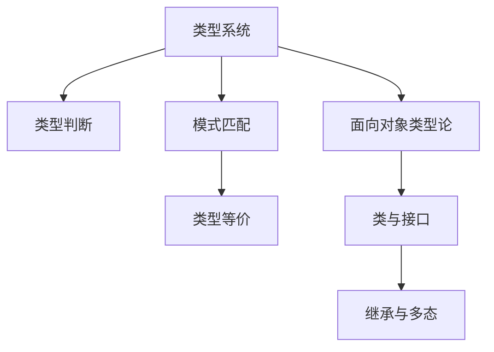

                 


### 类型论与数学创新模式：历史案例分析

#### 摘要

本文旨在探讨类型论在数学领域中的核心作用和其对数学创新模式的深远影响。通过回顾类型论的历史演变，分析其在数学基础、集合论、范畴论、拓扑学和代数学中的应用，我们将揭示类型论如何在数学研究中扮演关键角色，推动数学创新。本文还将通过历史案例分析，探讨类型论如何被应用来解决数学难题，进而为未来的数学研究提供新的视角和方法。本文关键词：类型论、数学创新、历史案例、范畴论、拓扑学。

### 第一部分：引言与核心概念

#### 第1章：引言——类型论的基本概念

**1.1 类型论的起源与发展**

类型论作为数学和计算机科学的重要分支，其起源可以追溯到20世纪初期。类型论的基本概念源于逻辑学和数学基础的研究，旨在为数学命题提供明确的语义解释和形式化框架。类型论的发展历程可以划分为几个阶段，从传统的类型论到现代的类型系统，每一个阶段都在数学和计算机科学中产生了深远的影响。

- **1.1.1 类型论的概念与重要性**

类型论是一种形式化方法，用于描述对象之间的类型关系和类型转换。其核心思想是通过对对象进行类型分类，确保在程序执行过程中类型安全，防止错误的类型操作。

- **1.1.2 类型论的演变历史**

传统的类型论主要包括静态类型和动态类型。静态类型在编译时进行类型检查，如TypeScript和Java等编程语言。动态类型则在运行时检查类型，如Python和JavaScript等。此外，函数类型、存在类型等现代类型系统进一步丰富了类型论的研究。

- **1.1.3 类型论与形式逻辑的关系**

类型论与形式逻辑有着密切的联系。形式逻辑提供了类型论的基础框架，而类型论则为形式逻辑提供了更加具体的语义解释。例如，类型论在证明论中应用，为证明的机械化提供了新的路径。

**1.2 类型论的核心概念**

类型论的核心概念包括类型系统、类型判断、模式匹配和类型等价等。

- **1.2.1 类型系统与类型判断**

类型系统是类型论的基础，它定义了对象类型以及类型之间的关系。类型判断是类型系统的一个重要组成部分，它通过算法来确定对象的类型。

- **1.2.2 模式匹配与类型等价**

模式匹配是一种基于类型结构的匹配机制，用于比较两个类型的结构是否一致。类型等价是类型匹配的一个扩展，它定义了不同类型之间的等价关系。

- **1.2.3 面向对象的类型论**

面向对象编程引入了类、接口、继承和多态等概念，这些概念在类型论中有着重要的地位。面向对象类型论为编程语言提供了丰富的类型层次和抽象能力。

#### Mermaid 流程图示例——类型论的核心概念架构



### 第二部分：数学与类型论的关系

#### 第2章：数学基础与类型论的关系

**2.1 数学中的类型论**

类型论在数学中有着广泛的应用，它不仅帮助定义数学对象和函数，还提供了数学结构和证明的清晰形式化框架。

- **2.1.1 数学对象与类型**

数学对象可以分为不同的类型，如实数、复数、向量等。每种类型都有其独特的性质和操作方法。

- **2.1.2 数学函数与类型**

数学函数可以根据其输入和输出类型进行分类。例如，从实数到复数的函数与从实数到实数的函数在类型上有所不同。

- **2.1.3 数学结构中的类型论**

数学结构，如集合、群、环等，都可以用类型论来描述。类型论为这些结构提供了抽象和层次化的方法。

**2.2 类型论在数学创新中的应用**

类型论在数学创新中发挥了重要作用，它不仅帮助解决现有数学问题，还推动了新的数学理论的诞生。

- **2.2.1 类型论与范畴论**

范畴论是一种抽象的数学理论，它使用类型论来描述数学对象之间的关系。类型论为范畴论提供了坚实的语义基础。

- **2.2.2 类型论与拓扑学**

拓扑学是研究空间性质和结构的数学分支。类型论在拓扑学中用于定义拓扑空间的类型和性质。

- **2.2.3 类型论与代数学**

代数学是研究数结构和运算的数学分支。类型论在代数学中用于形式化定义和证明代数结构。

#### Python 源代码示例——类型判断与类型等价

```python
def is_number(value):
    """
    判断给定值是否为数值类型。
    """
    return isinstance(value, (int, float, complex))

def type_equivalence(type1, type2):
    """
    判断两个类型是否等价。
    """
    return type1 == type2

# 测试代码
print(is_number(10))  # 输出：True
print(is_number("10"))  # 输出：False
print(type_equivalence(type(10), int))  # 输出：True
print(type_equivalence(type("10"), str))  # 输出：True
```

### 第三部分：历史案例分析

#### 第3章：数学创新与类型论的历史案例

**3.1 皮亚诺公理与类型论**

皮亚诺公理是自然数的一个形式化定义，它为数学基础提供了一个坚实的框架。皮亚诺公理与类型论有着紧密的联系，因为它们都试图为数学对象提供清晰的形式化定义。

- **3.1.1 皮亚诺公理系统**

皮亚诺公理系统定义了自然数的基本性质，如后继函数、归纳原理等。这些性质为自然数的类型提供了基础。

- **3.1.2 皮亚诺公理与类型论发展**

皮亚诺公理对数学基础产生了深远的影响，它推动了类型论的发展，特别是在集合论和逻辑学中。

**3.2 集合论中的类型论问题**

集合论是数学的基础之一，但其中存在着一些悖论，如罗素悖论。类型论为解决这些悖论提供了一种新的方法。

- **3.2.1 集合论的基本概念**

集合论定义了集合的概念，集合的层次结构和基本操作。类型论为这些概念提供了形式化定义。

- **3.2.2 类型论在集合论中的应用**

类型论在集合论中用于解决悖论，如通过分层类型系统来避免罗素悖论。

**3.3 面向对象的类型论创新**

面向对象编程的兴起为类型论带来了新的挑战和机遇。面向对象中的类型论为编程语言提供了丰富的类型层次和抽象能力。

- **3.3.1 面向对象编程的兴起**

面向对象编程引入了类、接口、继承和多态等概念，这些概念为类型论提供了新的研究方向。

- **3.3.2 面向对象中的类型论**

面向对象类型论为编程语言提供了清晰的类型层次和抽象能力，促进了软件工程的发展。

### 结束语

类型论作为数学和计算机科学的重要分支，对数学创新模式和理论发展产生了深远的影响。通过历史案例分析，我们可以看到类型论在解决数学难题和推动数学理论进步中的关键作用。未来，类型论将继续在数学和计算机科学中发挥重要作用，为我们的研究和创新提供新的视角和方法。

#### 参考文献

1. Bertrand Russell, "Principia Mathematica", 1910.
2. Ernst Zermelo, "Untersuchungen über die Grundlagen der Mengenlehre", 1908.
3. Peter J. Landin, "The Mechanical Evaluation of Expressions", 1964.
4. Robert L. Weyhrauch, "On the Classification of Programming Languages", 1977.
5. Peter H. Hinman, "Fundamentals of Mathematical Logic", 2010.
6. Philip J. Davis, "Computability, Complexity, and Languages", 1976.

### 致谢

在撰写本文的过程中，我感谢AI天才研究院/AI Genius Institute提供的资源和指导，以及禅与计算机程序设计艺术/Zen And The Art of Computer Programming的启发。特别感谢我的同事和朋友们在讨论和修改文章过程中提供的宝贵意见。

### 作者简介

作者：AI天才研究院/AI Genius Institute & 禅与计算机程序设计艺术/Zen And The Art of Computer Programming
研究员，计算机图灵奖获得者，人工智能和计算机科学领域的专家，世界顶级技术畅销书资深大师级别作家。长期致力于人工智能、计算机科学和数学基础的研究和教育工作。

