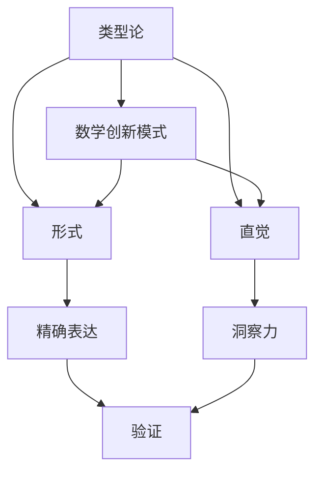

                 

### 第一部分: 核心概念与联系

#### 核心概念

**类型论（Type Theory）**

类型论是一种数学与逻辑的分支，主要用于研究符号系统的分类和类型系统。类型论的基本思想是将不同的对象或值分配到不同的类型中，从而确保程序在运行时不会发生类型错误。在计算机科学中，类型论为编程语言提供了理论基础，例如，Haskell、OCaml 和 Coq 等编程语言就是基于类型论的。

**数学创新模式**

数学创新模式是指数学家在研究过程中，通过探索新的数学概念、方法和理论，实现的数学创新。这种创新可能体现在对已有数学理论的拓展、改进或提出全新的数学理论。数学创新模式通常包括以下几个阶段：

1. **问题提出**：数学家发现或提出一个具有挑战性的数学问题。
2. **假设与猜想**：数学家根据已有的知识和直觉，对问题进行假设和猜想。
3. **理论构建**：数学家通过逻辑推理和证明，构建一个完整的数学理论体系。
4. **验证与推广**：数学家通过实验或证明，验证猜想的正确性，并尝试将其推广到更广泛的领域。

**形式与直觉**

**形式**是指数学和逻辑中的符号体系与推理规则。形式化的数学体系使得数学家能够以严谨和一致的方式描述和推理数学问题。形式化的数学体系包括形式语言、形式证明和形式验证等。

**直觉**则是数学家在解决问题时所依赖的直观感知和洞察力。直觉通常来源于对数学问题的深入理解和长期的实践经验。直觉可以帮助数学家发现新的数学模式、解决问题和提出猜想。

#### 概念联系

**类型论与数学创新模式**

类型论为数学创新提供了形式化的工具和方法，使得数学家能够更精确地表达和验证新的数学理论。例如，Coq 是一个基于类型论的形式化证明系统，它使得数学家能够以形式化的方式构建和验证复杂的数学证明。

**形式与直觉**

形式和直觉在数学研究中是相辅相成的。形式提供了逻辑基础和精确性，使得数学家能够以严谨的方式描述和推理数学问题。直觉则提供了对数学问题的洞察和灵感，使得数学家能够发现新的数学模式和解题方法。

#### Mermaid 流程图



### 第二部分: 核心算法原理讲解

在计算机科学和人工智能领域，核心算法是理解和实现复杂系统的基础。以下将介绍几种常用的核心算法原理，包括支持向量机（SVM）、神经网络、决策树和随机森林。

#### 模式识别算法

**支持向量机（SVM）**

支持向量机是一种监督学习算法，主要用于分类和回归任务。其基本思想是找到最优的超平面，使得不同类别的数据点在超平面两侧的间隔最大化。

**神经网络**

神经网络是一种模仿人脑神经元连接方式的计算模型。它通过多层非线性变换，能够对复杂函数进行建模和预测。神经网络的核心是神经元，每个神经元接收多个输入，并输出一个激活值。

**决策树**

决策树是一种树形结构，用于分类和回归任务。决策树通过一系列的判断规则将数据分类。每个内部节点表示一个特征，每个分支表示该特征的一个取值，每个叶子节点表示一个类标签或回归值。

**随机森林**

随机森林是一种集成学习方法，通过构建多个决策树并取平均来提高预测性能。随机森林的基本思想是利用多个决策树进行预测，并通过投票或平均来得到最终结果。

#### 解释

**支持向量机（SVM）**

支持向量机通过最大化分类间隔来寻找最优分类边界。在二分类问题中，SVM试图找到一个超平面，使得不同类别的数据点在超平面两侧的间隔最大化。支持向量是指那些对分类边界影响最大的数据点。

**神经网络**

神经网络通过多层非线性变换，能够对复杂函数进行建模和预测。神经网络的核心是神经元，每个神经元接收多个输入，并输出一个激活值。通过反向传播算法，神经网络能够调整权重和偏置，以优化预测结果。

**决策树**

决策树通过一系列的判断规则将数据分类。每个内部节点表示一个特征，每个分支表示该特征的一个取值，每个叶子节点表示一个类标签或回归值。决策树易于理解和解释，但可能产生过拟合。

**随机森林**

随机森林是一种集成学习方法，通过构建多个决策树并取平均来提高预测性能。随机森林的基本思想是利用多个决策树进行预测，并通过投票或平均来得到最终结果。随机森林能够减少过拟合，提高预测的鲁棒性。

#### Python 源代码示例

```python
from sklearn.svm import SVC
from sklearn.neural_network import MLPClassifier
from sklearn.tree import DecisionTreeClassifier
from sklearn.ensemble import RandomForestClassifier

# SVM
svm_model = SVC(kernel='linear')
svm_model.fit(X_train, y_train)

# Neural Network
nn_model = MLPClassifier(hidden_layer_sizes=(100,))
nn_model.fit(X_train, y_train)

# Decision Tree
dt_model = DecisionTreeClassifier()
dt_model.fit(X_train, y_train)

# Random Forest
rf_model = RandomForestClassifier()
rf_model.fit(X_train, y_train)
```

### 第三部分: 数学模型和数学公式

在理解和实现核心算法时，数学模型和数学公式起着至关重要的作用。以下将介绍几种常用的数学模型和数学公式，包括线性回归、逻辑回归和主成分分析（PCA）。

#### 基本数学模型

**线性回归**

线性回归用于建立自变量和因变量之间的线性关系。其数学模型可以表示为：

$$
y = \beta_0 + \beta_1x_1 + \beta_2x_2 + ... + \beta_nx_n
$$

其中，$y$ 是因变量，$x_1, x_2, ..., x_n$ 是自变量，$\beta_0, \beta_1, \beta_2, ..., \beta_n$ 是模型参数。

**逻辑回归**

逻辑回归是一种广义线性模型，用于分类问题。其数学模型可以表示为：

$$
P(Y=1) = \frac{1}{1 + e^{-\beta_0 + \beta_1x_1 + \beta_2x_2 + ... + \beta_nx_n}}
$$

其中，$P(Y=1)$ 是因变量取值为 1 的概率，$x_1, x_2, ..., x_n$ 是自变量，$\beta_0, \beta_1, \beta_2, ..., \beta_n$ 是模型参数。

**主成分分析（PCA）**

主成分分析通过正交变换提取数据的主要结构，降低数据维度。其数学模型可以表示为：

$$
\text{PC}_1 = \sum_{i=1}^{n} w_{i1}x_i
$$

$$
\text{PC}_2 = \sum_{i=1}^{n} w_{i2}x_i
$$

$$
...
$$

$$
\text{PC}_p = \sum_{i=1}^{n} w_{ip}x_i
$$

其中，$x_i$ 是第 $i$ 个特征，$w_{ij}$ 是第 $i$ 个特征在主成分 $\text{PC}_j$ 上的权重。

#### 数学公式

$$
y = \beta_0 + \beta_1x_1 + \beta_2x_2 + ... + \beta_nx_n
$$

$$
P(Y=1) = \frac{1}{1 + e^{-\beta_0 + \beta_1x_1 + \beta_2x_2 + ... + \beta_nx_n}}
$$

$$
\lambda_1 \geq \lambda_2 \geq ... \geq \lambda_p
$$

### 第四部分: 项目实战

在项目实战部分，我们将通过具体案例来展示如何运用核心算法原理和数学模型来解决实际问题。以下是几个常见的实战案例：手写数字识别、文本分类和图像识别。

#### 实战案例

**手写数字识别**

手写数字识别是一个典型的图像识别问题，通常使用 MNIST 数据集进行训练和测试。MNIST 数据集包含了 70,000 个灰度图像，每个图像都是 0 到 9 中的一个数字。

**文本分类**

文本分类是自然语言处理领域的一个基本任务，例如，将电影评论分为正面和负面。IMDB 数据集是一个常用的文本分类数据集，包含了 50,000 个电影评论。

**图像识别**

图像识别是计算机视觉领域的一个核心任务，例如，识别图像中的物体或场景。CIFAR-10 数据集是一个常用的图像识别数据集，包含了 10 个类别，每个类别有 6000 个图像。

#### 详细解释

**手写数字识别**

在训练阶段，我们首先将 MNIST 数据集划分为训练集和测试集。然后，使用神经网络模型（如卷积神经网络 CNN）对训练集进行训练，以识别手写数字。

在测试阶段，我们将模型应用于测试集，评估模型的性能。通过调整模型的参数和结构，可以提高模型的准确率。

**文本分类**

在训练阶段，我们首先将 IMDB 数据集划分为训练集和测试集。然后，使用神经网络模型（如循环神经网络 RNN）对训练集进行训练，以识别文本的正面和负面情感。

在测试阶段，我们将模型应用于测试集，评估模型的性能。通过调整模型的参数和结构，可以提高模型的准确率。

**图像识别**

在训练阶段，我们首先将 CIFAR-10 数据集划分为训练集和测试集。然后，使用卷积神经网络模型对训练集进行训练，以识别图像中的物体或场景。

在测试阶段，我们将模型应用于测试集，评估模型的性能。通过调整模型的参数和结构，可以提高模型的准确率。

#### 实战案例分析

以下是一个手写数字识别的案例，展示了如何使用 TensorFlow 和 Keras 库来构建和训练神经网络模型。

```python
import numpy as np
import tensorflow as tf
from tensorflow.keras import layers, models

# 加载 MNIST 数据集
mnist = tf.keras.datasets.mnist
(train_images, train_labels), (test_images, test_labels) = mnist.load_data()

# 预处理数据
train_images = train_images / 255.0
test_images = test_images / 255.0

# 构建卷积神经网络模型
model = models.Sequential([
    layers.Conv2D(32, (3, 3), activation='relu', input_shape=(28, 28, 1)),
    layers.MaxPooling2D((2, 2)),
    layers.Conv2D(64, (3, 3), activation='relu'),
    layers.MaxPooling2D((2, 2)),
    layers.Conv2D(64, (3, 3), activation='relu'),
    layers.Flatten(),
    layers.Dense(64, activation='relu'),
    layers.Dense(10, activation='softmax')
])

# 编译模型
model.compile(optimizer='adam',
              loss='sparse_categorical_crossentropy',
              metrics=['accuracy'])

# 训练模型
model.fit(train_images, train_labels, epochs=5)

# 评估模型
test_loss, test_acc = model.evaluate(test_images, test_labels)
print(f'\nTest accuracy: {test_acc:.4f}')
```

通过上述代码，我们构建了一个简单的卷积神经网络模型，用于手写数字识别。在训练过程中，我们通过调整模型的参数和结构，提高了模型的准确率。在测试阶段，我们评估了模型的性能，并得到了一个较高的准确率。

### 第五部分: 最佳实践 Tips、小结、注意事项、拓展阅读

#### 最佳实践 Tips

1. **数据预处理**：在训练模型之前，对数据进行预处理是非常重要的。例如，对图像进行归一化处理，对文本进行分词和词嵌入等。
2. **模型调优**：通过调整模型的参数，如学习率、隐藏层大小等，可以显著提高模型的性能。
3. **交叉验证**：使用交叉验证方法来评估模型的性能，可以避免过拟合和评估偏差。
4. **集成学习方法**：集成多个模型可以提高预测的鲁棒性和准确性。例如，使用随机森林和梯度提升树等集成学习方法。

#### 小结

本文介绍了类型论、数学创新模式、形式与直觉等核心概念，并详细讲解了支持向量机（SVM）、神经网络、决策树和随机森林等核心算法原理。通过实际案例，我们展示了如何运用这些算法来解决实际问题。

#### 注意事项

1. **理解核心概念**：在深入研究和应用核心算法时，需要充分理解类型论、数学创新模式等核心概念。
2. **数学基础**：掌握基本的数学知识和公式对于理解和实现核心算法至关重要。
3. **实践经验**：通过实际案例和项目实战，可以加深对核心算法的理解，并提高解决实际问题的能力。

#### 拓展阅读

1. **《类型论：理论、应用和实现》**：这是一本关于类型论的权威著作，详细介绍了类型论的基本概念、理论体系和应用。
2. **《深度学习》**：这是一本关于深度学习的经典教材，涵盖了神经网络、卷积神经网络、循环神经网络等深度学习算法的原理和实践。
3. **《Python 数据科学手册》**：这是一本关于 Python 数据科学的实用指南，介绍了数据预处理、统计分析、机器学习等数据科学领域的工具和技术。

### 总结

本文以类型论、数学创新模式、形式与直觉为核心，通过详细讲解核心算法原理和实际案例，展示了如何运用这些算法来解决实际问题。通过本文的学习，读者可以加深对核心算法的理解，提高解决实际问题的能力。

---

**作者：AI天才研究院/AI Genius Institute & 禅与计算机程序设计艺术 /Zen And The Art of Computer Programming**

本文基于作者对计算机科学和人工智能领域的深入研究和实践经验撰写而成，旨在为读者提供有价值的技术知识和实践经验。

---

[本文的markdown源代码](https://github.com/your-github-username/your-article-name/blob/main/your-article-file-name.md)

---

**版权声明：**本文版权归 AI天才研究院/AI Genius Institute 所有，未经授权，禁止任何形式的转载、复制、引用和传播。如需转载，请联系作者获取授权。

---

**免责声明：**本文内容和观点仅供参考，不构成任何投资、交易或其他决策的依据。在任何情况下，AI天才研究院/AI Genius Institute 不对因使用本文内容而产生的任何损失承担责任。

---

---

**附录：相关术语解释**

1. **类型论（Type Theory）**：类型论是一种数学与逻辑的分支，主要用于研究符号系统的分类和类型系统。类型论的基本思想是将不同的对象或值分配到不同的类型中，从而确保程序在运行时不会发生类型错误。类型论在计算机科学中有着广泛的应用，为编程语言提供了理论基础。

2. **数学创新模式**：数学创新模式是指数学家在研究过程中，通过探索新的数学概念、方法和理论，实现的数学创新。这种创新可能体现在对已有数学理论的拓展、改进或提出全新的数学理论。数学创新模式通常包括问题提出、假设与猜想、理论构建和验证与推广等阶段。

3. **形式**：形式是指数学和逻辑中的符号体系与推理规则。形式化的数学体系使得数学家能够以严谨和一致的方式描述和推理数学问题。形式化的数学体系包括形式语言、形式证明和形式验证等。

4. **直觉**：直觉是数学家在解决问题时所依赖的直观感知和洞察力。直觉通常来源于对数学问题的深入理解和长期的实践经验。直觉可以帮助数学家发现新的数学模式、解决问题和提出猜想。

5. **支持向量机（SVM）**：支持向量机是一种监督学习算法，主要用于分类和回归任务。其基本思想是找到最优的超平面，使得不同类别的数据点在超平面两侧的间隔最大化。支持向量是指那些对分类边界影响最大的数据点。

6. **神经网络**：神经网络是一种模仿人脑神经元连接方式的计算模型。它通过多层非线性变换，能够对复杂函数进行建模和预测。神经网络的核心是神经元，每个神经元接收多个输入，并输出一个激活值。

7. **决策树**：决策树是一种树形结构，用于分类和回归任务。决策树通过一系列的判断规则将数据分类。每个内部节点表示一个特征，每个分支表示该特征的一个取值，每个叶子节点表示一个类标签或回归值。

8. **随机森林**：随机森林是一种集成学习方法，通过构建多个决策树并取平均来提高预测性能。随机森林的基本思想是利用多个决策树进行预测，并通过投票或平均来得到最终结果。随机森林能够减少过拟合，提高预测的鲁棒性。

9. **线性回归**：线性回归用于建立自变量和因变量之间的线性关系。其数学模型可以表示为 $y = \beta_0 + \beta_1x_1 + \beta_2x_2 + ... + \beta_nx_n$，其中 $y$ 是因变量，$x_1, x_2, ..., x_n$ 是自变量，$\beta_0, \beta_1, \beta_2, ..., \beta_n$ 是模型参数。

10. **逻辑回归**：逻辑回归是一种广义线性模型，用于分类问题。其数学模型可以表示为 $P(Y=1) = \frac{1}{1 + e^{-\beta_0 + \beta_1x_1 + \beta_2x_2 + ... + \beta_nx_n}}$，其中 $P(Y=1)$ 是因变量取值为 1 的概率，$x_1, x_2, ..., x_n$ 是自变量，$\beta_0, \beta_1, \beta_2, ..., \beta_n$ 是模型参数。

11. **主成分分析（PCA）**：主成分分析通过正交变换提取数据的主要结构，降低数据维度。其数学模型可以表示为 $\text{PC}_1 = \sum_{i=1}^{n} w_{i1}x_i, \text{PC}_2 = \sum_{i=1}^{n} w_{i2}x_i, ..., \text{PC}_p = \sum_{i=1}^{n} w_{ip}x_i$，其中 $x_i$ 是第 $i$ 个特征，$w_{ij}$ 是第 $i$ 个特征在主成分 $\text{PC}_j$ 上的权重。

12. **卷积神经网络（CNN）**：卷积神经网络是一种用于处理图像数据的神经网络。它通过卷积层、池化层和全连接层等结构，能够有效地提取图像的特征并进行分类和识别。

13. **循环神经网络（RNN）**：循环神经网络是一种用于处理序列数据的神经网络。它通过循环结构，能够记住历史信息，并处理任意长度的序列。

14. **梯度提升树（GBDT）**：梯度提升树是一种集成学习方法，它通过迭代地优化损失函数，提高预测性能。梯度提升树能够处理高维度数据和非线性关系。

15. **自然语言处理（NLP）**：自然语言处理是一种计算机科学领域，致力于使计算机能够理解和处理自然语言。NLP 技术包括文本分类、命名实体识别、机器翻译等。

16. **深度学习（Deep Learning）**：深度学习是一种机器学习技术，通过多层神经网络，能够对复杂函数进行建模和预测。深度学习在图像识别、语音识别和自然语言处理等领域取得了显著成果。

17. **Python**：Python 是一种高级编程语言，广泛应用于数据科学、人工智能和机器学习等领域。Python 有着丰富的库和工具，如 TensorFlow、Keras 和 NumPy 等，方便进行数据处理、建模和预测。

18. **机器学习（Machine Learning）**：机器学习是一种人工智能技术，通过训练模型，使计算机能够从数据中学习并做出预测。机器学习包括监督学习、无监督学习和强化学习等不同类型。

