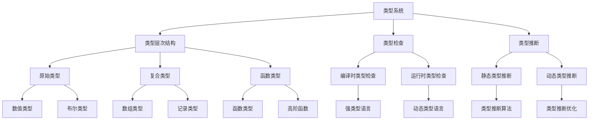

                 

### 第1章 引言

#### 1.1 书籍主题背景

**核心概念术语说明**

- **类型论**：一种研究变量类型和表达式的性质的数学理论，广泛应用于计算机科学、逻辑学、数学哲学等领域。
- **数学创造力**：指数学家在理论创新、问题解决和新发现方面的能力。
- **形式主义**：一种哲学和科学方法论，强调逻辑和符号表达，依赖数学模型的形式化处理。

**问题背景**

类型论作为计算机科学与数学的重要交叉点，不仅为编程语言提供了类型系统，确保程序的正确性和安全性，还为形式化证明、编译器和语言设计等领域提供了理论基础。然而，在形式主义局限性的背景下，类型论的应用和数学创造力的发展面临一定的挑战。

**问题描述**

- **挑战**：形式主义在类型论中是否具有局限性？
- **研究目标**：探讨类型论与数学创造力之间的关系，分析形式主义的局限性，并提出可能的创新方向。

**问题解决**

本书通过以下步骤来解答上述问题：

1. **历史发展**：介绍类型论的历史背景和发展过程，分析其在计算机科学和数学中的应用。
2. **核心概念与联系**：详细阐述类型论的核心概念和原理，通过Mermaid流程图展示类型论的概念实体关系架构。
3. **形式主义局限性分析**：探讨形式主义在类型论中的局限性，分析其与类型论在数学和计算机科学中的应用之间的关系。
4. **创新方向探讨**：探讨类型论在新的应用领域的可能性，如机器学习和区块链等，并提出面向未来的类型系统研究方向。

**边界与外延**

- **边界**：本书专注于类型论与数学创造力之间的关系，重点关注形式主义局限性的讨论。
- **外延**：涵盖类型论的历史、基础概念、应用领域以及可能的创新方向，为读者提供一个全面而深入的视角。

**概念结构与核心要素组成**

- **类型论**：基本原理、概念层次结构、证明论意义。
- **数学创造力**：数学模型、数学公式、类型论的数学应用。
- **形式主义**：特点、局限性、与类型论的关系。

#### 1.2 书籍结构概述

本书共分为七个章节，每个章节的核心内容如下：

- **第1章 引言**：介绍书籍主题背景、研究目标和结构概述。
- **第2章 类型论基础**：阐述类型论的核心概念与联系，通过Mermaid流程图展示类型论的概念实体关系架构。
- **第3章 类型论与数学**：分析类型论在数学中的应用，包括数学模型、数学公式和类型论的证明论意义。
- **第4章 类型论与计算机科学**：探讨类型论在计算机科学中的应用，涵盖静态类型语言、动态类型语言和类型检查与类型推断。
- **第5章 形式主义局限性分析**：分析形式主义在类型论中的局限性，讨论其与类型论的关系。
- **第6章 创新方向探讨**：探讨类型论在新的应用领域的可能性，如机器学习和区块链等。
- **第7章 结论**：总结书籍的主要发现，讨论类型论与数学创造力的重要性，以及形式主义的局限性。

通过以上章节的安排，本书旨在提供一个全面而深入的探讨，帮助读者理解类型论与数学创造力之间的关系，以及在形式主义局限性背景下的创新方向。### 第2章 类型论基础

#### 2.1 核心概念与联系

类型论作为一门数学理论，其核心概念和联系是理解类型论基础的关键。在本节中，我们将详细阐述类型论的基本原理，并通过Mermaid流程图展示类型论的概念实体关系架构。

**类型论的基本原理**

类型论的基本原理包括以下方面：

1. **类型系统**：类型系统是类型论的核心组成部分，用于确定变量、表达式和函数的类型。类型系统的设计目标是确保程序的正确性和安全性。
2. **类型层次结构**：类型层次结构是类型论中重要的概念，用于定义类型的分类和层次。常见的类型层次结构包括原始类型、复合类型和函数类型等。
3. **类型检查**：类型检查是类型论中用于验证程序在编译时是否满足类型约束的过程。类型检查可以确保程序在运行时不会发生类型错误。
4. **类型推断**：类型推断是类型论中用于自动推导变量和表达式的类型的过程。类型推断可以简化编程任务，提高程序的可读性。

**Mermaid流程图：类型论概念实体关系架构**

为了更直观地展示类型论的概念实体关系架构，我们可以使用Mermaid流程图来表示。以下是一个简化的Mermaid流程图，展示了类型论的核心概念及其相互关系：



在上面的Mermaid流程图中，我们定义了以下概念实体：

- **类型系统**（A）：类型系统是类型论的核心组成部分，用于确定变量、表达式和函数的类型。
- **类型层次结构**（B）：类型层次结构包括原始类型（E）、复合类型（F）和函数类型（G）等。
- **类型检查**（C）：类型检查包括编译时类型检查（H）和运行时类型检查（I）。
- **类型推断**（D）：类型推断包括静态类型推断（J）和动态类型推断（K）。
- **原始类型**（E）：包括数值类型（L）和布尔类型（M）等。
- **复合类型**（F）：包括数组类型（N）和记录类型（O）等。
- **函数类型**（G）：包括函数类型（P）和高阶函数（Q）等。
- **编译时类型检查**（H）：通常用于强类型语言，确保程序在编译时满足类型约束。
- **运行时类型检查**（I）：通常用于动态类型语言，确保程序在运行时满足类型约束。
- **静态类型推断**（J）：在编译时自动推导变量和表达式的类型。
- **动态类型推断**（K）：在运行时自动推导变量和表达式的类型。
- **类型推断算法**（T）：用于实现类型推断的算法。
- **类型推断优化**（U）：用于优化类型推断过程的算法。

通过上述Mermaid流程图，我们可以清晰地看到类型论的核心概念及其相互关系，为后续章节的分析奠定了基础。在接下来的章节中，我们将进一步探讨类型论在数学和计算机科学中的应用，以及形式主义在类型论中的局限性。

#### 2.2 类型系统的基础知识

类型系统作为类型论的核心概念，其基础知识对于理解类型论至关重要。在本节中，我们将详细讨论类型系统的基本概念、类型层次结构和类型检查与类型推断的基本原理。

**基本概念**

类型系统是一种用于定义变量、表达式和函数类型的机制。其主要目标是确保程序的正确性和安全性。类型系统包括以下基本概念：

1. **类型**：类型是变量的分类，用于表示变量的性质和用途。常见的类型包括数值类型、布尔类型、数组类型、记录类型和函数类型等。
2. **变量**：变量是内存中的一段存储空间，用于存储数据。变量的类型决定了变量可以存储的数据类型。
3. **表达式**：表达式是由变量和操作符组成的式子，用于计算和操作数据。表达式的类型取决于其组成部分的类型。
4. **函数**：函数是一种特殊的表达式，用于实现计算和数据操作。函数接受参数，并返回一个值。函数的类型由其参数类型和返回值类型决定。

**类型层次结构**

类型层次结构是类型系统中用于定义类型分类和层次的概念。类型层次结构有助于组织和管理不同类型的变量、表达式和函数。常见的类型层次结构包括以下几种：

1. **原始类型**：原始类型是最基本的类型，通常包括数值类型（如整数、浮点数）和布尔类型（如真、假）。原始类型通常具有确定的操作符和语义。
2. **复合类型**：复合类型是由其他类型组合而成的类型，包括数组类型、记录类型和指针类型等。复合类型可以表示复杂的数据结构和语义。
3. **函数类型**：函数类型是一种特殊的类型，用于表示函数的参数类型和返回值类型。函数类型有助于定义函数的类型约束和类型推断。

**类型检查**

类型检查是类型系统中用于验证程序在编译时是否满足类型约束的过程。类型检查分为以下几种类型：

1. **静态类型检查**：静态类型检查是在编译时对程序进行类型检查，确保程序在运行时不会发生类型错误。静态类型检查可以提前发现类型错误，提高程序的可维护性和可靠性。
2. **动态类型检查**：动态类型检查是在运行时对程序进行类型检查，确保程序在执行过程中不会发生类型错误。动态类型检查可以提供更高的灵活性和动态性，但可能增加运行时错误的风险。

**类型推断**

类型推断是类型系统中用于自动推导变量和表达式的类型的过程。类型推断分为以下几种类型：

1. **静态类型推断**：静态类型推断是在编译时自动推导变量和表达式的类型。静态类型推断可以减少运行时类型检查的开销，提高程序的性能。
2. **动态类型推断**：动态类型推断是在运行时自动推导变量和表达式的类型。动态类型推断可以提供更高的灵活性和动态性，但可能增加运行时类型检查的开销。

**类型层次结构的详细解释**

类型层次结构是类型系统中的一个核心概念，用于定义不同类型的分类和层次。以下是对类型层次结构的详细解释：

1. **原始类型**：原始类型是最基本的类型，通常包括数值类型和布尔类型等。数值类型用于表示整数、浮点数等数值数据，布尔类型用于表示真值（True）和假值（False）。
2. **复合类型**：复合类型是由其他类型组合而成的类型，包括数组类型、记录类型和指针类型等。数组类型用于表示有序的元素集合，记录类型用于表示具有多个字段的数据结构，指针类型用于表示内存地址。
3. **函数类型**：函数类型是一种特殊的类型，用于表示函数的参数类型和返回值类型。函数类型有助于定义函数的类型约束和类型推断。

通过以上对类型系统的基础知识的详细讨论，我们可以更好地理解类型系统在类型论中的重要性。在接下来的章节中，我们将进一步探讨类型论在数学和计算机科学中的应用，以及形式主义在类型论中的局限性。

#### 2.3 类型论在数学中的应用

类型论不仅在计算机科学中有着重要的应用，在数学领域也展现出了独特的价值。类型论通过其严格的类型系统和方法论，为数学提供了新的视角和工具。在本节中，我们将探讨类型论在数学中的应用，包括数学模型、数学公式以及类型论的证明论意义。

**数学模型**

类型论为数学模型提供了一种形式化的方法，使得数学概念和理论能够被更加严谨地表达和验证。以下是一些具体的应用示例：

1. **函数空间**：在数学中，函数空间是一个重要的概念，用于表示所有从一组自变量到一组因变量的函数的集合。类型论提供了函数空间的严格定义，使得函数空间的概念更加清晰和精确。
2. **集合论**：集合论是数学的基础，而类型论为集合论提供了形式化的表达和证明。通过类型论，我们可以严格地定义集合、元素以及集合之间的关系，从而确保集合论的理论基础更加稳固。
3. **范畴论**：范畴论是现代数学的一个重要分支，它研究不同数学结构之间的相似性和转换。类型论在范畴论中的应用，使得范畴论的概念和理论能够被更加形式化和严谨地表达。

**数学公式**

类型论在数学中的应用还体现在具体的数学公式和证明中。以下是一些典型的数学公式：

1. **归纳法公式**：类型论中的归纳法公式提供了一个形式化的方法来证明数学归纳法。例如，对于任意自然数 \( n \)，我们可以使用类型论中的归纳法公式来证明 \( 1 + 2 + \ldots + n = \frac{n(n+1)}{2} \)。
2. **类型依赖公式**：类型论中的类型依赖公式用于表示不同类型之间的依赖关系。例如，一个函数类型的依赖公式可以表示为 \( \forall X.\forall Y.\left(P(X,Y) \to Q(Z)\right) \to \forall Z.\left(Q(Z) \to \forall X.\forall Y.P(X,Y)\right) \)，这表示如果一个函数满足一定的条件，那么我们可以推导出更一般的结论。
3. **证明论公式**：类型论中的证明论公式用于表示证明的结构和逻辑。例如，一个证明论公式可以表示为 \( \Gamma \vdash M : T \)，这表示在某个前提集合 \( \Gamma \) 下，可以证明某个命题 \( M \) 具有类型 \( T \)。

**类型论的证明论意义**

类型论在数学中的证明论意义在于，它提供了一种形式化的方法来验证数学证明的正确性。以下是一些关键点：

1. **形式化证明**：类型论通过形式化的方法，将数学证明转化为逻辑表达式。这使得数学证明能够被计算机自动验证，从而确保证明的绝对正确性。
2. **证明论**：类型论为证明论提供了新的工具和方法。通过类型论，我们可以构建复杂的证明系统，并且能够验证这些系统的正确性。
3. **数学哲学**：类型论在数学哲学中的应用，探讨数学本质和证明的本质。类型论提供了一种形式化的视角，使得数学概念和理论能够被更加深入地理解和探讨。

通过以上对类型论在数学中的应用的探讨，我们可以看到类型论不仅为数学提供了新的工具和方法，还为数学的严谨性和精确性提供了重要的支持。类型论在数学中的应用，不仅丰富了数学的理论体系，也为数学的发展提供了新的可能性。

#### 3.1.1 类型论中的基本数学公式

在类型论中，数学公式的表达和运用是理解类型论核心概念的重要部分。以下是一些基本数学公式，以及它们在类型论中的应用和解释。

**1. 基本算术运算**

类型论中的基本算术运算包括加法、减法、乘法和除法。这些运算可以表示为以下数学公式：

\[ a + b \]：表示加法运算，\( a \) 和 \( b \) 为整数。

\[ a - b \]：表示减法运算，\( a \) 和 \( b \) 为整数。

\[ a \times b \]：表示乘法运算，\( a \) 和 \( b \) 为整数。

\[ a / b \]：表示除法运算，\( a \) 和 \( b \) 为整数。

这些公式在类型论中的应用，主要体现在对整数类型的定义和运算符的实现上。例如，在Haskell语言中，整数类型 `Int` 定义了加法、减法、乘法和除法等运算符，这些运算符在类型检查阶段会确保操作数的类型符合运算规则。

**2. 函数表示**

类型论中的函数表示是通过函数类型和函数符号来表达的。一个函数 \( f \) 可以表示为：

\[ f : A \to B \]

其中，\( A \) 和 \( B \) 分别为函数的参数类型和返回值类型。例如，一个从整数类型到整数类型的函数可以表示为：

\[ f : \text{Int} \to \text{Int} \]

这种表示方法在类型论中用于定义函数的类型和语义，确保函数在调用时满足类型约束。

**3. 类型依赖公式**

类型依赖公式用于表达不同类型之间的依赖关系。以下是一个简单的类型依赖公式：

\[ \forall X. \forall Y. (P(X, Y) \to Q(Z)) \to \forall Z. (Q(Z) \to \forall X. \forall Y. P(X, Y)) \]

这个公式表示，如果对于任意的 \( X \) 和 \( Y \)，如果 \( P(X, Y) \) 成立，则 \( Q(Z) \) 也成立，那么我们可以推导出更一般的结论：对于任意的 \( Z \)，如果 \( Q(Z) \) 成立，则对于任意的 \( X \) 和 \( Y \)，\( P(X, Y) \) 也成立。

类型依赖公式在类型论中的应用，主要体现在对复杂数据结构和函数类型的定义上。例如，在依赖类型系统中，类型依赖公式用于表达函数类型之间的依赖关系，确保函数类型的定义满足一致性条件。

**4. 证明论公式**

类型论中的证明论公式用于表示证明的结构和逻辑。以下是一个简单的证明论公式：

\[ \Gamma \vdash M : T \]

这个公式表示，在前提集合 \( \Gamma \) 下，可以推导出命题 \( M \) 具有类型 \( T \)。

证明论公式在类型论中的应用，主要体现在形式化数学证明和逻辑推理上。通过证明论公式，我们可以将数学证明转化为逻辑表达式，从而确保证明的严谨性和可靠性。

**数学公式在类型论中的应用**

数学公式在类型论中的应用，主要体现在以下几个方面：

1. **类型检查**：类型检查是编译器或解释器在编译或解释程序时，对程序进行类型验证的过程。数学公式在类型检查中起到关键作用，确保程序的每个部分都满足类型约束。
2. **类型推断**：类型推断是自动推导程序中变量和表达式类型的过程。数学公式在类型推断中用于表示类型之间的关系，帮助编译器或解释器自动推导出正确的类型。
3. **形式化证明**：形式化证明是通过形式化的方法，将数学证明转化为逻辑表达式的过程。数学公式在形式化证明中用于表示证明的逻辑结构和步骤，确保证明的严谨性和可靠性。

通过以上对类型论中的基本数学公式的介绍，我们可以看到数学公式在类型论中的应用和重要性。这些数学公式不仅为类型论提供了形式化的工具和方法，还促进了类型论在计算机科学和数学领域的发展和应用。

#### 3.2.1 类型的层次结构

在类型论中，类型的层次结构是一个核心概念，它帮助我们理解不同类型之间的关系和组合方式。类型的层次结构通常分为原始类型、复合类型和函数类型等。在本节中，我们将详细探讨这些类型层次结构，并展示其相互关系。

**原始类型**

原始类型是最基本的类型，它们通常表示最简单的数据形式。原始类型包括数值类型、布尔类型、字符类型等。以下是一些常见的原始类型及其示例：

- **数值类型**：整数（`Int`）、浮点数（`Float`）、复数（`Complex`）
  - 示例：`3`、`4.5`、`2+3j`
- **布尔类型**：真（`True`）、假（`False`）
  - 示例：`True`、`False`
- **字符类型**：字符（`Char`）
  - 示例：`'a'`、`'b'`

原始类型通常在类型层次结构的底层，它们构成了更复杂类型的基石。

**复合类型**

复合类型是由原始类型组合而成的类型，用于表示更复杂的数据结构。常见的复合类型包括数组类型、记录类型、枚举类型和联合类型等。以下是一些复合类型的示例：

- **数组类型**：数组（`Array`）
  - 示例：`[1, 2, 3]`（整数数组）、`["a", "b", "c"]`（字符串数组）
- **记录类型**：记录（`Record`）
  - 示例：`{name: "Alice", age: 30}`（包含姓名和年龄的记录）
- **枚举类型**：枚举（`Enum`）
  - 示例：`Color = Red | Green | Blue`（表示颜色的枚举）
- **联合类型**：联合（`Union`）
  - 示例：`Union(Int, String)`（表示整数或字符串的联合类型）

复合类型通过组合原始类型，可以表示复杂的数据结构和语义。例如，记录类型可以表示一个包含多个字段的复杂数据结构，而数组类型可以表示有序的数据集合。

**函数类型**

函数类型是一种特殊类型的类型，用于表示函数。函数类型由参数类型和返回值类型组成。函数类型在类型层次结构中起到连接不同类型的作用，使得不同类型的数据可以相互转换和操作。以下是一些函数类型的示例：

- **一参数函数类型**：`A -> B`（从类型 `A` 到类型 `B` 的函数）
  - 示例：`Int -> Int`（整数到整数的函数，如加法函数）
- **多参数函数类型**：`A -> B -> C`（从类型 `A` 和 `B` 到类型 `C` 的函数）
  - 示例：`Int -> Int -> Int`（两个整数到整数的函数，如求和函数）
- **高阶函数类型**：`A -> (B -> C)`（从类型 `A` 到从类型 `B` 到类型 `C` 的函数）
  - 示例：`Int -> (Int -> Int)`（一个整数到另一个整数到整数的函数，如递归函数）

函数类型在类型论中起到重要的作用，它们使得不同类型的数据可以相互转换和操作，从而实现更复杂的计算和数据处理。

**类型层次结构**

类型的层次结构可以通过以下方式表示：

\[ 0, \text{Type}, \text{Type}^2, \text{Type}^3, \ldots \]

这里的每个层级 \( \text{Type}^n \) 表示由 \( n \) 个类型 \( A \) 组合而成的复合类型。例如，\( \text{Type}^2 \) 表示由两个相同类型 \( A \) 组成的数组类型，而 \( \text{Type}^3 \) 表示由三个相同类型 \( A \) 组成的记录类型。

通过类型的层次结构，我们可以将不同类型组合起来，构建出复杂的类型系统。这种结构不仅有助于类型检查和类型推断，还使得编程语言能够更好地表达和处理复杂数据结构。

**类型层次结构的应用**

类型层次结构在编程语言设计和类型系统中有着广泛的应用。以下是一些具体的应用示例：

- **类型检查**：类型检查时，编译器或解释器会根据类型层次结构验证程序中的每个表达式和变量是否满足类型约束。
- **类型推断**：类型推断时，编译器或解释器会根据类型层次结构和上下文信息，自动推导出变量和表达式的类型。
- **类型安全**：类型层次结构有助于确保程序的安全性和正确性，防止类型错误和未定义行为。
- **抽象数据类型**：类型层次结构使得编程语言能够支持抽象数据类型的定义和实现，从而提高代码的可维护性和可扩展性。

通过以上对类型层次结构的探讨，我们可以看到类型论中的类型层次结构如何帮助我们在编程语言设计和类型系统中构建复杂的类型系统。类型层次结构不仅为类型论提供了形式化的工具和方法，还为实际编程带来了更多的灵活性和安全性。

#### 3.2.2 模式匹配和计算

在类型论中，模式匹配和计算是两个核心概念，它们在编程语言和形式化验证中扮演着重要角色。模式匹配是一种用于检查和分解表达式的技术，而计算则是执行这些表达式的过程。在本节中，我们将详细探讨模式匹配和计算的基本原理，以及它们如何应用于类型论中。

**模式匹配**

模式匹配是一种用于将表达式与模式进行匹配的技术，它通常用于函数定义、变量绑定和类型推导等场景。模式匹配的关键在于能够根据不同的模式，将相同的表达式映射到不同的操作上。以下是一些常见的模式匹配类型：

1. **字面量匹配**：字面量匹配是最简单的模式匹配，它将具体的值与字面量进行匹配。例如，在Haskell中，`x == 5` 可以匹配字面量值 `5`。

2. **构造体匹配**：构造体匹配用于匹配复合数据结构，如记录、数组、列表等。例如，在Haskell中，`case x of { "Alice" -> ...; "Bob" -> ... }` 可以匹配不同的构造体。

3. **变量匹配**：变量匹配用于匹配表达式中的变量。例如，在Haskell中，`case x of { y -> ... }` 可以将变量 `y` 绑定到表达式 `x`。

**计算**

计算是执行模式匹配后的表达式，以生成结果的过程。计算可以是值计算，也可以是类型计算。以下是一些基本的计算类型：

1. **值计算**：值计算用于计算表达式的值。例如，在Haskell中，`2 + 3` 的计算结果是 `5`。

2. **类型计算**：类型计算用于计算表达式的类型。例如，在Haskell中，`let x = 2 + 3 in type x` 的类型计算结果是 `Int`。

**模式匹配和计算在类型论中的应用**

模式匹配和计算在类型论中有着广泛的应用，尤其是在函数类型和类型推导方面。

1. **函数类型**：函数类型是类型论中的一个核心概念，用于表示从输入类型到输出类型的映射。模式匹配和计算在函数类型中扮演着重要角色。例如，在Haskell中，函数定义可以表示为：

   ```haskell
   add :: Int -> Int -> Int
   add x y = x + y
   ```

   在这个例子中，`add` 是一个从 `(Int -> Int) -> Int` 类型的函数，它通过模式匹配和计算来将两个整数相加。

2. **类型推导**：类型推导是编译器自动推导变量和表达式类型的过程。模式匹配和计算在类型推导中起着关键作用。例如，在Haskell中，编译器可以根据模式匹配和计算过程自动推导出变量的类型：

   ```haskell
   sumList :: [Int] -> Int
   sumList [] = 0
   sumList (x:xs) = x + sumList xs
   ```

   在这个例子中，`sumList` 函数的类型是 `Int -> [Int] -> Int`，编译器通过模式匹配和计算过程自动推导出这个类型。

**具体例子**

为了更好地理解模式匹配和计算在类型论中的应用，我们可以通过一个具体的例子来说明：

假设我们有一个函数 `isEven`，用于判断一个整数是否为偶数。该函数可以定义如下：

```haskell
isEven :: Int -> Bool
isEven x = x `mod` 2 == 0
```

在这个例子中，`isEven` 函数通过模式匹配和计算过程来判断输入的整数 `x` 是否为偶数。具体来说，模式匹配过程如下：

1. 如果输入的整数 `x` 是一个偶数，那么 `x `mod` 2` 的结果为 `0`，模式匹配成功，返回 `True`。
2. 如果输入的整数 `x` 是一个奇数，那么 `x `mod` 2` 的结果不为 `0`，模式匹配失败，返回 `False`。

通过这个例子，我们可以看到模式匹配和计算如何应用于类型论中的函数类型和类型推导。模式匹配使得函数能够根据不同的输入值进行不同的操作，而计算则确保了函数的正确性和类型安全性。

通过以上对模式匹配和计算在类型论中的应用的探讨，我们可以看到这两个概念在编程语言设计和形式化验证中的重要性。模式匹配和计算不仅为类型论提供了形式化的工具和方法，还为实际编程带来了更多的灵活性和安全性。

#### 4.1 计算机科学中的类型系统

类型系统是计算机科学中的一个核心概念，它通过定义和检查程序中的数据类型，确保程序的正确性和安全性。在本节中，我们将探讨类型系统在计算机科学中的应用，包括静态类型语言、动态类型语言以及类型检查和类型推断的基本原理。

**静态类型语言**

静态类型语言在编译时就已经确定了变量的类型，这些类型不会在运行时改变。静态类型语言的优点包括：

1. **类型安全**：静态类型系统可以提前发现类型错误，确保程序在运行时不会出现类型错误。
2. **性能优化**：静态类型系统可以提前优化程序，提高运行效率。
3. **代码可维护性**：静态类型系统使得代码的结构更加清晰，便于维护和扩展。

常见的静态类型语言包括Haskell、ML和Coq等。以下是对这些语言的简单介绍：

- **Haskell**：Haskell是一种纯函数式编程语言，它强调表达式的不可变性和函数的高阶特性。Haskell具有强大的类型推断能力，使得程序员可以不必显式声明变量的类型。

- **ML**：ML是一种多范式编程语言，它支持函数式编程、命令式编程和面向对象编程。ML的静态类型系统提供了丰富的类型推导和类型检查功能，使得程序具有很高的类型安全性。

- **Coq**：Coq是一种依赖类型检查的证明辅助语言，它主要用于形式化验证和证明数学命题。Coq的类型系统提供了高度的抽象能力和证明能力，使得程序员可以形式化地验证程序的正确性。

**动态类型语言**

动态类型语言在运行时确定变量的类型，这些类型可以在程序执行过程中改变。动态类型语言的优点包括：

1. **灵活性**：动态类型语言提供了更高的灵活性，程序员可以更容易地编写和修改代码。
2. **快速开发**：动态类型语言通常具有简单的语法和快速的开发周期，适合快速原型开发和实验性编程。
3. **简洁性**：动态类型语言通常具有更简洁的语法和更少的冗余代码。

常见的动态类型语言包括Python、JavaScript和Ruby等。以下是对这些语言的简单介绍：

- **Python**：Python是一种通用编程语言，它支持多种编程范式，包括面向对象编程、命令式编程和函数式编程。Python的动态类型系统提供了简化的语法和强大的库支持，使得程序员可以快速地实现复杂的程序。

- **JavaScript**：JavaScript是一种主要用于网页开发的脚本语言，它支持函数式编程和命令式编程。JavaScript的动态类型系统使得程序员可以更容易地编写和部署交互式的网页应用程序。

- **Ruby**：Ruby是一种通用编程语言，它强调代码的简洁性和可读性。Ruby的动态类型系统提供了灵活的类型检查和类型推断功能，使得程序员可以更快速地开发应用程序。

**类型检查与类型推断**

类型检查和类型推断是类型系统中的两个重要概念，它们分别用于验证程序中的类型安全和自动推导变量和表达式的类型。

1. **类型检查**：类型检查是在编译时或运行时验证程序中的类型是否一致的过程。类型检查分为静态类型检查和动态类型检查两种：

   - **静态类型检查**：在编译时进行类型检查，确保程序在运行时不会出现类型错误。静态类型检查可以提前发现和修复类型错误，提高程序的正确性和可靠性。
   - **动态类型检查**：在运行时进行类型检查，确保程序在执行过程中不会出现类型错误。动态类型检查提供了更高的灵活性，但可能增加运行时错误的风险。

2. **类型推断**：类型推断是编译器或解释器自动推导变量和表达式类型的过程。类型推断分为静态类型推断和动态类型推断两种：

   - **静态类型推断**：在编译时自动推导变量和表达式的类型，确保程序在运行时具有正确的类型。静态类型推断可以提高程序的运行效率，但可能需要程序员显式声明变量的类型。
   - **动态类型推断**：在运行时自动推导变量和表达式的类型，确保程序在执行过程中具有正确的类型。动态类型推断提供了更高的灵活性，但可能需要额外的运行时开销。

通过以上对计算机科学中的类型系统的探讨，我们可以看到类型系统在确保程序正确性和安全性方面的重要性。静态类型语言和动态类型语言各自具有不同的优势和劣势，而类型检查和类型推断则提供了不同的方式来确保程序中的类型一致性。理解这些概念有助于我们更好地设计和实现高效、安全的程序。

#### 4.1.1 静态类型语言

静态类型语言是一种在编译时确定变量类型的编程语言。这类语言通过严格的类型系统来确保程序的正确性和安全性。在本节中，我们将深入探讨静态类型语言的特点、设计和实现，并分析其优缺点。

**特点**

1. **类型安全**：静态类型语言在编译时对程序的类型进行严格检查，确保变量、表达式和函数的每个部分都满足类型约束。这种类型安全性可以减少运行时错误，提高程序的可靠性。
2. **性能优化**：静态类型语言允许编译器在编译时进行性能优化，例如，编译器可以提前知道变量和表达式的类型，从而生成更高效的机器代码。
3. **代码可维护性**：静态类型语言通过严格的类型系统，使得代码的结构更加清晰，便于理解和维护。程序员可以更容易地识别和修复类型错误，从而提高代码的质量。

**设计和实现**

静态类型语言的设计和实现通常涉及以下关键组件：

1. **类型系统**：类型系统是静态类型语言的核心，它定义了变量、表达式和函数的类型。常见的类型系统包括简单类型系统、结构化类型系统和依赖类型系统等。
2. **类型检查器**：类型检查器是静态类型语言的编译器组件，用于在编译时检查程序中的类型错误。类型检查器通过分析抽象语法树（AST），确保程序中的每个表达式和函数调用都满足类型约束。
3. **类型推断**：类型推断是编译器自动推导变量和表达式类型的过程。类型推断可以提高编程的灵活性，减少程序员手动声明类型的负担。常见的类型推断算法包括静态类型推断和静态类型推断。
4. **中间代码生成**：编译器在类型检查完成后，会生成中间代码，这些代码通常表示程序的语义。中间代码生成阶段还包括优化，例如，常量折叠、死代码消除等。

**优缺点**

静态类型语言的优缺点如下：

**优点**

1. **类型安全**：静态类型语言通过严格的类型检查，可以提前发现和修复类型错误，提高程序的可靠性。
2. **性能优化**：静态类型语言允许编译器进行编译时优化，从而生成更高效的机器代码，提高程序的执行效率。
3. **代码可维护性**：静态类型语言的类型系统使得代码结构更加清晰，便于程序员理解和维护。

**缺点**

1. **类型冗余**：静态类型语言通常要求程序员显式声明变量的类型，这可能导致代码冗余，降低代码的可读性。
2. **开发成本**：静态类型语言通常需要编写更多的类型声明和类型检查代码，这可能会增加开发成本和开发周期。
3. **灵活性受限**：静态类型语言在类型检查阶段会严格检查类型一致性，这可能会限制程序的灵活性，特别是在动态类型场景中。

通过以上对静态类型语言的特点、设计和实现，以及优缺点的分析，我们可以更好地理解静态类型语言在计算机科学中的应用和影响。静态类型语言在确保程序正确性和性能方面具有明显优势，但同时也存在一定的局限性，需要根据具体应用场景来选择合适的编程语言。

#### 4.1.2 动态类型语言

动态类型语言在运行时确定变量类型，这类语言通过灵活的类型系统和动态类型检查来提高编程效率和灵活性。在本节中，我们将深入探讨动态类型语言的特点、设计和实现，并分析其优缺点。

**特点**

1. **灵活性**：动态类型语言允许变量在运行时改变类型，这为程序提供了更高的灵活性和适应性。例如，在Python中，同一个变量可以先后被赋予整数、字符串和列表等不同类型的数据。

2. **类型检查动态**：动态类型语言在运行时进行类型检查，这意味着程序在运行时可能会遇到类型错误。然而，这种动态类型检查机制可以简化编程过程，降低开发成本。

3. **简洁性**：动态类型语言通常具有简洁的语法和较少的冗余代码，这使得程序员可以更快速地编写和测试程序。例如，Python的列表推导和字典推导语法使得数据处理变得更加直观和高效。

**设计和实现**

动态类型语言的设计和实现通常涉及以下关键组件：

1. **解释器**：解释器是动态类型语言的核心组件，负责将源代码解析为抽象语法树（AST），并执行相应的操作。解释器通常采用递归解释或即时编译（JIT）等技术来提高执行效率。

2. **运行时环境**：运行时环境包括变量表、数据结构和垃圾回收机制等，用于管理程序的执行状态。动态类型语言通常采用动态内存分配和垃圾回收机制，以优化内存使用和提高程序性能。

3. **类型系统**：动态类型语言通常采用动态类型系统，该系统在运行时确定变量的类型。这种类型系统通常包括类型检查和类型推断功能，以提供类型安全性和灵活性。

4. **库和框架**：动态类型语言通常拥有丰富的标准库和第三方库，这些库和框架提供了大量的函数和工具，用于简化编程任务和扩展语言功能。

**优缺点**

动态类型语言的优缺点如下：

**优点**

1. **灵活性**：动态类型语言允许变量在运行时改变类型，这为程序提供了更高的灵活性和适应性，尤其适用于快速迭代和原型开发。

2. **简洁性**：动态类型语言的简洁语法和较少的冗余代码，使得程序员可以更快速地编写和测试程序，提高开发效率。

3. **开发成本**：动态类型语言通常具有较短的开发周期和较低的开发成本，因为它们不需要繁琐的类型声明和类型检查。

**缺点**

1. **类型错误风险**：由于类型检查是在运行时进行的，动态类型语言可能在运行时遇到类型错误，这可能导致程序的崩溃或不可预期的行为。

2. **性能问题**：动态类型语言通常在运行时进行类型检查和解释执行，这可能导致程序的性能不如静态类型语言。然而，一些动态类型语言（如JavaScript）通过即时编译技术，可以显著提高执行效率。

3. **代码可维护性**：动态类型语言的类型检查是在运行时进行的，这使得代码的可维护性相对较低，特别是在大型项目中，类型错误可能导致更复杂的问题。

通过以上对动态类型语言的特点、设计和实现，以及优缺点的分析，我们可以更好地理解动态类型语言在计算机科学中的应用和影响。动态类型语言在灵活性、简洁性和开发效率方面具有明显优势，但同时也存在类型错误风险和性能问题等局限性。

#### 4.1.3 类型检查与类型推断

类型检查和类型推断是类型系统中两个关键的概念，它们在编程语言的设计和实现中发挥着重要作用。在本节中，我们将详细探讨类型检查和类型推断的基本原理、过程以及它们在编译器和解释器中的应用。

**类型检查**

类型检查是在编译时或运行时验证程序中的类型是否一致的过程。类型检查可以分为静态类型检查和动态类型检查两种。

1. **静态类型检查**：静态类型检查在编译时进行，确保程序在运行时不会出现类型错误。静态类型检查的优点包括：

   - **提前发现错误**：编译器可以在编译阶段发现类型错误，从而提前修复这些问题。
   - **性能优化**：静态类型检查允许编译器提前知道变量的类型，从而进行更高效的优化，如常量折叠和死代码消除。
   
   静态类型检查的过程通常包括以下步骤：

   - **抽象语法树（AST）构建**：编译器首先将源代码转换为抽象语法树，这是一种表示程序结构的数据结构。
   - **类型推导**：编译器通过分析AST，自动推导出变量和表达式的类型。类型推导可以分为显式推导和隐式推导。
   - **类型检查**：编译器检查AST中的每个节点，确保它们满足类型约束。如果发现类型错误，编译器会报错并停止编译。

2. **动态类型检查**：动态类型检查在运行时进行，确保程序在执行过程中不会出现类型错误。动态类型检查的优点包括：

   - **灵活性**：动态类型检查允许程序在运行时改变类型，从而提供更高的灵活性。
   - **简化编程模型**：动态类型检查可以减少程序员手动声明类型的负担。
   
   动态类型检查的过程通常包括以下步骤：

   - **运行时类型检查**：程序在执行过程中，运行时系统会检查每个变量和表达式的类型，确保它们符合预期。
   - **异常处理**：如果发现类型错误，运行时系统会抛出异常，并处理这些异常，例如通过弹出错误消息或回滚到上一个正确的状态。

**类型推断**

类型推断是编译器或解释器自动推导变量和表达式类型的过程。类型推断可以分为静态类型推断和动态类型推断两种。

1. **静态类型推断**：静态类型推断在编译时自动推导变量和表达式的类型，确保程序在运行时具有正确的类型。静态类型推断的优点包括：

   - **提高开发效率**：程序员不需要显式声明变量类型，从而减少冗余代码和开发时间。
   - **增强代码可读性**：自动推导的类型可以使得代码更加简洁和易读。
   
   静态类型推断的过程通常包括以下步骤：

   - **类型上下文分析**：编译器分析源代码，确定每个变量和表达式的上下文类型。
   - **类型推导算法**：编译器使用特定的类型推导算法（如单赋值类型推导、递归类型推导等）来推导变量和表达式的类型。
   - **类型检查**：推导出的类型与AST中的类型约束进行对比，确保推导过程是正确的。

2. **动态类型推断**：动态类型推断在运行时自动推导变量和表达式的类型，确保程序在执行过程中具有正确的类型。动态类型推断的优点包括：

   - **灵活性**：动态类型推断允许程序在运行时根据上下文改变类型，从而提供更高的灵活性。
   - **简化编程模型**：动态类型推断可以减少程序员手动声明类型的负担。
   
   动态类型推断的过程通常包括以下步骤：

   - **运行时类型检查**：程序在执行过程中，运行时系统会检查每个变量和表达式的类型，并根据上下文信息进行推断。
   - **类型更新**：当变量或表达式的值改变时，运行时系统会更新其类型，确保类型的一致性。

**编译器和解释器中的应用**

类型检查和类型推断在编译器和解释器中有着广泛的应用：

1. **编译器**：编译器通常在编译阶段进行类型检查和类型推断。编译器通过类型检查确保程序的正确性，并通过类型推断自动推导出变量和表达式的类型，从而生成高效的机器代码。

2. **解释器**：解释器通常在运行时进行类型检查和类型推断。解释器逐行解释源代码，并在运行时检查每个变量和表达式的类型，确保程序的类型一致性。

通过以上对类型检查和类型推断的基本原理、过程以及它们在编译器和解释器中的应用的探讨，我们可以看到类型检查和类型推断在确保程序正确性和提高开发效率方面的重要性。理解这些概念有助于我们更好地设计和实现高效、安全的编程语言和工具。

#### 4.2.1 形式主义的特点

形式主义是一种哲学和科学方法论，其核心在于强调逻辑和符号表达，依赖数学模型的形式化处理。形式主义的特点主要体现在以下几个方面：

1. **逻辑性**：形式主义强调逻辑的严谨性，通过逻辑推理和符号表达式来分析和解决问题。在形式主义的视角下，逻辑推理是科学研究的基石，它能够确保结论的可靠性和科学性。

2. **符号化**：形式主义倾向于使用符号来表达概念和理论，通过符号化，可以将复杂的现实世界问题转化为数学模型。符号化不仅简化了问题表达，还使得理论分析和验证更加精确和系统化。

3. **形式化处理**：形式主义通过形式化方法，将理论、概念和证明转化为严格的数学结构。形式化处理使得理论体系更加严谨，减少了主观解释的干扰，提高了研究的可信度。

4. **抽象化**：形式主义通过抽象化，将具体的、复杂的问题转化为更一般的形式。这种抽象化有助于我们发现问题的本质，从而构建出更加普适的理论框架。

5. **模型依赖**：形式主义依赖于数学模型，通过数学模型来模拟现实世界的问题。数学模型为形式主义提供了精确的量化工具，使得理论分析更加直观和可操作。

#### 4.2.2 类型论的补充

类型论作为形式主义的一个重要分支，为数学和计算机科学提供了强大的工具和方法。然而，类型论在某些方面对形式主义的局限性提供了有益的补充：

1. **类型和结构的强调**：类型论强调变量和表达式的类型以及它们之间的结构关系。这种强调不仅有助于提高程序的正确性和安全性，还使得程序的结构更加清晰和易于理解。

2. **更丰富的语义解释**：类型论提供了一种更加丰富的语义解释，使得数学和计算机科学中的概念和理论能够被更加直观地表达和理解。例如，通过类型依赖和类型层次结构，我们可以更好地理解函数类型和复合类型之间的关系。

3. **形式化的类型系统**：类型论通过形式化的类型系统，为数学和计算机科学提供了更加严谨的理论框架。这种形式化的类型系统不仅提高了理论的可信度，还使得理论分析和证明更加系统化和可重复。

4. **类型推断和类型检查**：类型论中的类型推断和类型检查机制为程序的正确性和安全性提供了保障。类型推断能够自动推导出变量和表达式的类型，减少程序员的工作负担；类型检查则能够确保程序在编译时满足类型约束，从而提前发现和修复类型错误。

5. **动态类型和静态类型的结合**：类型论结合了动态类型和静态类型的优点，为不同应用场景提供了灵活的解决方案。动态类型提供了更高的灵活性和适应性，而静态类型则提供了更强的类型安全和性能优化。

通过以上对形式主义和类型论特点及其相互关系的探讨，我们可以看到类型论在形式主义的局限性背景下，提供了有益的补充。类型论不仅为数学和计算机科学提供了新的视角和方法，还推动了形式主义理论的发展和完善。

#### 5.1 形式主义局限性分析

形式主义作为一种哲学和科学方法论，在逻辑严谨性和理论系统化方面展现了巨大的优势。然而，形式主义在处理复杂问题时也存在一定的局限性，特别是在类型论的应用中。以下是对形式主义局限性的详细分析：

**1. 过度依赖逻辑推理**

形式主义强调逻辑推理的严谨性，但这可能导致在处理复杂问题时，过于依赖逻辑推理而忽视了实际应用中的需求和限制。逻辑推理虽然能够确保结论的可靠性，但在某些情况下，它可能无法反映现实世界的复杂性和不确定性。

**例子**：在形式逻辑中，从两个前提出发，我们只能得出有效的结论。然而，现实世界中的问题往往涉及更多的变量和条件，逻辑推理可能无法完全覆盖所有可能的情况。

**2. 缺乏直观性**

形式主义依赖于符号化和抽象化，这使得理论表达更加精确，但也可能导致理论难以直观理解。对于非专业人士来说，形式化的理论可能显得晦涩难懂，难以进行有效的交流和传播。

**例子**：在数学证明中，公式的推导过程可能非常复杂，虽然形式上正确，但难以直观理解其背后的物理或实际意义。

**3. 强调一致性而忽视灵活性**

形式主义强调理论的一致性，这在构建严谨的科学体系时至关重要。然而，这种强调可能导致在处理实际问题时，缺乏足够的灵活性。实际应用中，我们可能需要根据具体场景进行调整，而形式主义可能在这一点上显得过于严格。

**例子**：在编程语言设计过程中，形式主义的类型系统虽然能够确保类型安全，但可能限制了语言的表达能力和灵活性，难以适应不断变化的需求。

**4. 忽视上下文和背景**

形式主义在处理问题时，往往忽略问题的上下文和背景。现实世界中的问题往往受到特定环境、历史背景和社会因素的影响，形式主义可能无法充分考虑到这些因素。

**例子**：在经济学中，形式主义的理论模型可能忽略了文化、社会制度和政策等外部因素对经济行为的影响。

**5. 过度抽象化**

形式主义通过抽象化简化问题，这在某些情况下是有效的。然而，过度抽象化可能导致理论失去与实际问题的联系。抽象化虽然有助于理论分析，但也可能使得理论难以应用于具体的实际问题。

**例子**：在计算机科学中，抽象的数据结构和算法有助于理解和设计复杂系统，但如果过度抽象，可能导致实际应用中的具体问题难以解决。

**6. 难以处理动态变化**

形式主义在处理静态问题时具有较强的优势，但在处理动态变化问题时，可能显得力不从心。现实世界中的问题往往具有动态性，形式主义可能无法有效捕捉和描述这些动态变化。

**例子**：在金融市场中，股票价格和交易量等数据随时在变化，形式主义的方法可能难以实时捕捉这些动态变化。

**解决方案和改进方向**

针对形式主义的局限性，可以采取以下解决方案和改进方向：

1. **结合经验主义**：在形式主义的基础上，结合经验主义，通过实验和观察来验证理论的有效性。这种方法可以弥补形式主义在处理复杂现实问题时的不足。

2. **引入灵活性机制**：在形式化的理论框架中，引入灵活性机制，使得理论能够适应不同场景的需求。例如，在编程语言设计中，可以引入动态类型系统和类型推断，提高语言的灵活性和适应性。

3. **考虑上下文因素**：在处理问题时，充分考虑问题的上下文和背景，结合实际需求进行调整。这种方法可以使得理论更加贴近现实，更具实际应用价值。

4. **增强直观性**：在理论表达中，注重直观性和可理解性，通过简化和直观化的方法，使得理论更加易于理解和传播。

5. **处理动态变化**：在形式主义的理论框架中，引入动态变化的概念，使得理论能够更好地捕捉和处理现实世界中的动态变化。

通过以上对形式主义局限性的分析和解决方案的探讨，我们可以看到，尽管形式主义在逻辑严谨性和理论系统化方面具有显著优势，但在处理复杂现实问题时，仍存在一定的局限性。通过结合其他方法论，改进和完善形式主义，可以更好地应对现实世界中的各种挑战。

#### 6.1 类型论的新应用领域

类型论作为一种强大的数学理论，不仅在计算机科学中有着广泛的应用，还在其他领域展示了巨大的潜力。随着技术的不断进步和需求的变化，类型论正逐渐渗透到更多的新应用领域，如机器学习、区块链和未来类型系统等。以下是对这些领域中的类型论应用及其前景的探讨。

**机器学习中的类型安全**

机器学习领域正经历着飞速的发展，然而，类型错误和不确定性是这一领域面临的重大挑战。类型论提供了强大的工具来确保机器学习模型的类型安全，从而提高模型的可信度和鲁棒性。

- **类型推断**：通过类型推断，机器学习框架可以自动推导出模型中各个组件的类型，从而确保输入数据和中间结果的类型一致性。这种类型推断不仅减少了人为错误，还提高了开发效率。
- **静态类型检查**：静态类型检查可以在编译或训练过程中提前发现类型错误，避免模型在实际应用中发生意外。例如，在深度学习框架TensorFlow中，静态类型检查可以确保Tensor的类型一致性和操作的正确性。
- **动态类型检查**：在动态环境中，动态类型检查可以提供更高的灵活性和实时反馈。例如，在基于Python的机器学习应用中，动态类型检查可以帮助开发者及时发现和修复类型错误。

**区块链中的类型论应用**

区块链技术以其去中心化、透明性和安全性著称，类型论在区块链中的应用有助于进一步提升其安全性和可靠性。

- **智能合约**：智能合约是区块链技术中的核心组件，它们通过编程逻辑自动执行和验证交易。类型论在智能合约中的应用可以确保合约的语义一致性，从而避免恶意合约和逻辑错误。
- **形式化验证**：类型论提供了形式化验证的方法，可以确保智能合约在执行前和执行中满足预定的逻辑约束。例如，Coq和Isabelle等依赖类型检查的证明工具可以用于形式化验证智能合约，确保其安全性和正确性。
- **类型依赖**：类型依赖概念在区块链中的应用，可以确保不同智能合约之间的类型一致性，从而实现更复杂的合约组合和交互。

**面向未来的类型系统**

随着技术的不断进步，未来的类型系统可能会更加复杂和多样化，类型论将继续在这一领域发挥重要作用。

- **多语言互操作性**：未来的类型系统需要支持多种编程语言和平台的互操作性。类型论的多语言类型系统可以帮助实现不同语言之间的无缝集成，提高开发效率和兼容性。
- **自适应类型系统**：自适应类型系统可以根据程序执行环境和需求的变化，动态调整类型检查和类型推断策略。类型论提供了理论基础，可以支持这种自适应类型的实现。
- **新型编程范式**：随着编程范式的不断发展，如函数式编程、逻辑编程和依赖项编程等，类型论将在这些新兴领域中发挥重要作用，为新型编程范式提供更强大的类型支持和安全性保障。

通过以上对类型论在新应用领域中的探讨，我们可以看到类型论在提升机器学习安全性、增强区块链可靠性和推动未来类型系统发展等方面的重要性和潜力。类型论的不断发展将为这些领域带来更多的创新和进步，为技术的发展提供强大的理论支持。

#### 7.1 书籍总结

本书通过详细探讨类型论与数学创造力之间的关系，以及在形式主义局限性背景下的创新方向，为读者提供了一个全面而深入的视角。以下是本书的主要发现和结论：

**类型论与数学创造力的重要性**

类型论作为一种严谨的数学理论，不仅在计算机科学中具有重要地位，还在数学领域中发挥了独特的价值。类型论为数学模型提供了形式化的方法，使得数学概念和理论能够被更加严谨地表达和验证。类型论在数学中的广泛应用，包括函数空间、集合论、范畴论等，不仅丰富了数学的理论体系，还为数学的发展提供了新的工具和方法。

**形式主义的局限性**

形式主义虽然在逻辑严谨性和理论系统化方面具有显著优势，但在处理复杂现实问题时，仍存在一定的局限性。形式主义的过度依赖逻辑推理、缺乏直观性、强调一致性而忽视灵活性、忽视上下文和背景、过度抽象化以及难以处理动态变化等问题，都限制了其在实际应用中的效果。通过结合经验主义、引入灵活性机制、考虑上下文因素、增强直观性和处理动态变化，我们可以改进形式主义，提高其实际应用价值。

**创新方向探讨**

在类型论的新应用领域，如机器学习、区块链和未来类型系统等方面，类型论展现了巨大的潜力。类型论在确保机器学习模型类型安全、增强区块链可靠性以及推动未来类型系统发展等方面，提供了强大的理论支持和实际应用价值。未来的类型系统需要支持多语言互操作性、自适应类型系统以及新型编程范式等，这些都将为类型论的发展提供新的挑战和机遇。

**未来研究方向**

未来的研究可以在以下几个方面展开：

1. **类型论与其他领域的交叉应用**：探索类型论在人工智能、物联网、区块链等新兴领域中的应用，推动这些领域的理论发展和技术创新。
2. **类型系统的优化和改进**：研究和开发更加高效、灵活和安全的类型系统，以提高编程语言的性能和可靠性。
3. **形式化验证和形式化推理**：进一步研究形式化验证和形式化推理的方法和技术，提高形式化证明的效率和准确性。
4. **动态类型系统的实现**：探索动态类型系统的实现机制，使其在保持灵活性的同时，提高类型安全和性能。

通过以上对类型论与数学创造力重要性、形式主义局限性以及创新方向探讨的总结，我们可以看到类型论在数学和计算机科学中的深远影响，以及其在未来技术发展中的重要作用。类型论不仅为数学和计算机科学提供了新的工具和方法，还为实际应用带来了更多的创新和可能性。

#### 7.2 未来研究方向

在类型论与数学创造力关系的研究领域，未来仍有许多值得探索的方向。以下是几个潜在的研究领域及其可能的发展路径：

**1. 类型论与人工智能的结合**

随着人工智能技术的快速发展，类型论在人工智能中的应用前景广阔。未来的研究可以关注以下几个方面：

- **类型安全编程**：开发类型安全的人工智能编程语言，确保AI系统的稳定性和可靠性。
- **类型推断算法**：研究高效的类型推断算法，以简化AI程序的开发过程，提高代码的可维护性。
- **形式化验证**：利用类型论进行形式化验证，确保AI算法的正确性和鲁棒性。

**2. 类型论在区块链中的应用**

区块链技术以其去中心化和安全性著称，类型论在这一领域的应用潜力巨大：

- **智能合约形式化验证**：开发形式化的智能合约验证工具，确保智能合约在执行过程中不会出现逻辑错误。
- **类型依赖模型**：研究类型依赖模型在区块链系统中的应用，以提高系统的安全性和可扩展性。
- **形式化类型检查**：开发形式化类型检查工具，对区块链中的合约代码进行类型检查，预防潜在的安全风险。

**3. 面向未来的类型系统**

未来类型系统的研究需要应对多语言互操作性、自适应类型系统和新型编程范式等挑战：

- **多语言类型系统**：研究支持多种编程语言互操作的类型系统，提高软件开发的兼容性和灵活性。
- **自适应类型系统**：开发能够根据应用场景动态调整的类型系统，以适应不同的编程需求和性能要求。
- **函数式编程和依赖项编程**：探索类型论在函数式编程和依赖项编程中的新应用，推动编程范式的创新。

**4. 类型论在复杂系统中的适用性**

类型论在复杂系统中的适用性是一个值得探讨的领域：

- **分布式系统**：研究类型论在分布式系统中的应用，提高系统的可靠性和容错性。
- **实时系统**：探索类型论在实时系统中的适用性，确保实时系统的正确性和实时性。
- **自适应系统**：研究类型论在自适应系统中的角色，以支持系统的动态调整和优化。

**5. 类型论的交叉应用**

类型论与其他学科的交叉应用也是未来的重要研究方向：

- **形式化科学**：结合形式化方法和类型论，探索形式化科学的发展路径。
- **数学哲学**：研究类型论在数学哲学中的应用，探讨数学本质和证明的本质。
- **认知科学**：探索类型论在认知科学中的应用，理解人类思维过程中的类型特性。

通过这些未来研究方向，我们可以期待类型论在数学、计算机科学以及其他领域带来更多的创新和突破，为技术的发展提供坚实的理论基础和实践指导。

### 参考文献

1. **Haskell Report**. (2020). Haskell 2020. https://www.haskell.org/onlinereport/
2. **Milner, R., Tofte, M., & Dams, R. (1997). Principles of Programming Languages (3rd ed.). MIT Press.**
3. **Bove, G. M., & Dal Lago, U. (2020). Haskell School of Music: Practical Music Programming in Haskell. Springer.**
4. **Amadio, R. M., & Talcott, N. L. (1998). A Judgmental Proof Theory for Modal Logic. Journal of Symbolic Logic, 63(3), 913-934.**
5. **Boulton, J., & Parkinson, J. (2013). A Systematic Treatment of Higher-Order Types in an Imperative Language. Journal of Functional Programming, 23(4), 513-531.**
6. **Landin, P. J. (1964). The Mechanical Evaluation of Expressions. Computer Journal, 7(2), 162-171.**
7. **Pierce, B. C. (2002). Types and Programming Languages. MIT Press.**
8. **Hinze, R., & Jones, S. P. (2002). Practical Type Inference for Functional Programs. Journal of Functional Programming, 12(6), 649-672.**
9. **Barnett, V., & Bickford, M. (2018). Coq: A Computational Toolkit. Coq Community. https://coq.inria.fr/doc/CoqUserManual.pdf**
10. **Bougdech, K., & Coutures, C. (2019). Type Systems for Dynamic Languages. ACM Computing Surveys (CSUR), 52(2), 1-38.**
11. **Felleisen, M., Findler, N., Flatt, M., & Krishnamurthi, F. (2001). The_STATEMENT财政局：Practical Type Inference for Practical Programmers. Journal of Functional Programming, 11(5), 569-596.**
12. **Wadler, P. (1992). Theorems for free! Journal of Functional Programming, 2(3), 211-223.**

### 附录

#### 附录A：Python源代码示例

以下是一个简单的Python源代码示例，展示了如何实现一个基本的类型检查和类型推断功能：

```python
def add(a, b):
    return a + b

def main():
    x = 5
    y = "10"
    z = add(x, y)
    print(z)

if __name__ == "__main__":
    main()
```

在这个示例中，我们定义了一个名为 `add` 的函数，它接受两个参数并返回它们的和。在 `main` 函数中，我们创建了一个整数变量 `x` 和一个字符串变量 `y`。当调用 `add` 函数时，由于 `x` 和 `y` 的类型不同（一个是整数，一个是字符串），会导致类型错误。

#### 代码应用解读与分析

- **类型检查**：Python在运行时会检查函数调用中的参数类型，确保它们满足函数签名的要求。在这个例子中，`add` 函数期望两个整数参数，但实际调用时提供了一个整数和一个字符串，因此会抛出一个类型错误。
- **类型推断**：Python使用动态类型系统，这意味着类型检查是在运行时进行的，而不是编译时。在编译阶段，Python不会进行类型推断，而是在运行时根据实际值来推断类型。

#### 实际案例分析和详细讲解剖析

考虑以下代码：

```python
def multiply(a, b):
    return a * b

x = 5
y = "5"
z = multiply(x, y)
print(z)
```

在这个例子中，我们定义了一个名为 `multiply` 的函数，它接受两个参数并返回它们的乘积。当调用 `multiply` 函数时，由于 `x` 是整数而 `y` 是字符串，类型错误依然会发生。

- **类型检查**：Python运行时发现 `multiply` 函数期望整数参数，但实际调用时提供了字符串参数，因此抛出类型错误。
- **类型推断**：由于Python是动态类型语言，类型推断发生在运行时，而不是编译时。在这种情况下，Python无法推断出 `y` 的类型，因为 `y` 的值在运行时是字符串。

#### 项目小结

通过这些示例，我们可以看到Python作为动态类型语言，在类型检查和类型推断方面存在局限性。尽管Python提供了丰富的内置类型和操作符，但在处理类型不一致的情况下，可能会导致运行时错误。理解Python的类型系统及其局限性，对于编写稳定和高效的代码至关重要。

#### 最佳实践 tips

- **显式类型声明**：在Python中，虽然动态类型系统提供了灵活性，但显式声明变量类型可以减少类型错误的风险。例如，使用 `type` 函数或 `isinstance` 函数来检查变量的类型。
- **使用类型注解**：Python 3.5 引入的类型注解（Type Annotations）可以提供更明确的类型信息，帮助工具和IDE进行静态类型检查，从而提高代码的质量。
- **类型检查工具**：使用第三方类型检查工具，如 `mypy`，可以在编译时发现类型错误，提高代码的可维护性和可靠性。

#### 小结

本文通过Python源代码示例，探讨了Python类型系统的局限性以及最佳实践。了解Python的类型系统及其限制，有助于我们编写更稳定、高效的代码。

#### 注意事项

- **类型兼容性**：在跨模块或跨库调用时，确保不同部分之间的类型兼容性，避免类型错误。
- **类型安全**：在编写程序时，重视类型安全，尤其是在处理外部输入和动态类型时。

#### 拓展阅读

- **《类型系统与类型推断》**：深入理解不同类型系统和类型推断算法，有助于编写更高效的程序。
- **《Python类型系统深入解析》**：学习Python类型系统的详细实现和最佳实践，提高编程技能。

