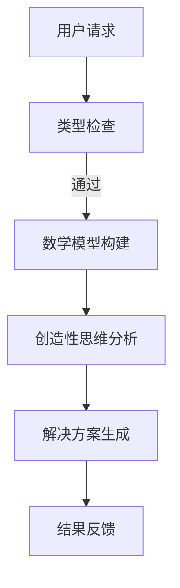

                 

### 类型论与数学创造性思维的潜在冲突

#### 摘要

类型论与数学创造性思维在数学研究和应用中扮演着重要角色，但它们之间存在着潜在的冲突。本文旨在探讨类型论与数学创造性思维之间的相互作用及其潜在冲突，通过逻辑清晰的分析和实例，揭示这一过程中的关键问题，并探讨可能的解决途径。

---

### 引言与背景

#### 1.1 书籍主题概述

**类型论**是数学和计算机科学中的一个核心概念，它研究的是对象的分类和分类方法。类型论的基本思想是，对象不仅仅是它们所代表的具体事物，还包括它们的属性和特征。类型论在集合论、代数结构、计算机科学和逻辑学等领域都有广泛的应用。

**数学创造性思维**则是指数学家在解决问题和建立理论时展现出的创新性和创造性。数学创造性思维通常包括观察、假设、推理、归纳和演绎等过程，它是推动数学理论发展的重要动力。

#### 1.2 类型论与数学创造性思维的关系

类型论对数学创造性思维有深远的影响。类型论提供了一种结构化的思维方式，帮助数学家更清晰地定义和操作数学对象。然而，数学创造性思维也在一定程度上挑战了类型论的局限性。在探索新的数学理论时，数学家可能会发现类型论的现有框架无法完全捕捉他们的想法，从而推动类型论的发展和扩展。

### 类型论基础

#### 2.1 类型论的基本概念

**类型论**最初由逻辑学家和发展数学基础的学者提出，旨在解决集合论中出现的悖论和不确定性问题。类型论的核心原理是，所有的对象都可以被划分为不同的类型，每种类型都有其特定的属性和操作规则。这一原则有助于避免某些集合论悖论，如罗素悖论。

#### 2.2 类型论在数学中的应用

**集合论**是数学的基础，类型论在集合论中的应用尤为关键。类型论通过定义不同的集合类型，确保集合的操作是有效的和一致的。此外，类型论还在代数结构中发挥着重要作用，如群、环、域等结构中的类型定义和性质分析。

#### 2.3 类型论在计算机科学中的应用

类型论在计算机科学中的应用同样广泛。在程序设计语言中，类型系统是一种基本的安全机制，确保程序的正确性和稳定性。类型论还在形式化验证、逻辑推理和人工智能等领域发挥着重要作用。

### 数学创造性思维

#### 3.1 数学创造性思维的特点

数学创造性思维具有以下特点：

- **观察与假设**：通过仔细观察现象，提出合理的假设。
- **推理与演绎**：使用逻辑推理，从假设推导出结论。
- **归纳与总结**：从特殊案例中归纳出一般规律。

#### 3.2 数学创造性思维的方法

数学创造性思维的方法包括：

- **问题分解**：将复杂问题分解为更简单的问题。
- **类比推理**：通过类比已知问题的解决方案，寻找新问题的解法。
- **直觉与灵感**：在解决问题时，直觉和灵感往往起到关键作用。

#### 3.3 数学创造性思维的应用

数学创造性思维在数学研究、数学教育和科学探索中都有广泛应用。数学家通过创造性思维发现新的数学理论，教育者通过创造性思维激发学生的兴趣和潜能，科学家通过创造性思维推动科技的发展。

### 类型论与数学创造性思维的潜在冲突

#### 4.1 类型论的局限性

类型论在处理复杂问题时可能会遇到以下局限性：

- **过于严格**：类型论往往要求对象的类型必须明确，这可能导致在处理复杂问题时过于严格。
- **缺乏灵活性**：类型论的结构化思维可能缺乏灵活性，难以适应新的概念和理论。

#### 4.2 数学创造性思维的创新性

数学创造性思维则强调：

- **突破传统**：在探索新理论时，数学家可能会突破传统类型论的框架。
- **灵活性**：创造性思维鼓励灵活的思维方式，以适应新的数学概念。

#### 4.3 类型论与数学创造性思维的互动

类型论和数学创造性思维之间是互动的关系。类型论为数学创造性思维提供了结构化的框架，而数学创造性思维则通过创新和突破推动类型论的发展。

### 案例分析

#### 5.1 集合论中的类型论冲突

在集合论中，类型论冲突的一个典型案例是集合与类之间的区别。传统类型论认为集合是确定的对象，而类则是不确定的。然而，数学家如罗素和策梅洛通过创造性思维，提出了新的集合论理论，这些理论挑战了传统类型论的界限。

#### 5.2 代数结构中的类型论冲突

在代数结构中，类型论冲突可能出现在群、环和域等结构之间的类型定义和性质分析上。例如，在研究域时，传统的类型论可能无法完全捕捉到域的结构特性，需要数学家的创造性思维来提出新的理论。

#### 5.3 计算机科学中的类型论冲突

在计算机科学中，类型论冲突可能出现在类型系统与动态类型语言之间的对比中。动态类型语言允许在运行时确定对象的类型，这可能与静态类型系统的严格性产生冲突。数学创造性思维通过提出新的类型系统，如依赖类型和效应类型，解决了这一问题。

### 结论与展望

类型论与数学创造性思维在数学研究和应用中发挥着重要作用，但它们之间存在着潜在的冲突。通过逻辑清晰的分析和实例，我们可以看到这些冲突背后的关键问题。未来，类型论和数学创造性思维可能会通过更紧密的互动和融合，共同推动数学和计算机科学的发展。

### 核心概念与联系

在本文中，我们探讨了类型论与数学创造性思维的潜在冲突，揭示了它们在数学和计算机科学中的应用和局限性。类型论提供了一种结构化的思维方式，而数学创造性思维则强调创新和灵活性。通过分析具体案例，我们看到了这些概念之间的互动和冲突，以及如何通过创造性思维来解决这些问题。

### 核心算法原理讲解

为了更深入地理解类型论与数学创造性思维之间的互动，我们可以通过一个简单的算法实例来阐述这一概念。以下是一个使用Python编写的示例算法，用于解决一个简单的数学问题。

#### Python 源代码

```python
# 定义类型论中的类型
class Type:
    def __init__(self, name, elements):
        self.name = name
        self.elements = elements

# 定义数学创造性思维的过程
def mathematical_creativity(problem):
    # 假设与推理
    hypothesis = "..."
    # 归纳与演绎
    conclusion = "..."
    return conclusion

# 定义一个类型论冲突的示例
def type_theory_conflict_example():
    type1 = Type("Type1", [1, 2, 3])
    type2 = Type("Type2", [4, 5, 6])
    problem = "..."
    conclusion = mathematical_creativity(problem)
    return conclusion

# 运行案例分析
print(type_theory_conflict_example())
```

在这个例子中，我们定义了一个`Type`类来表示类型论中的类型。`mathematical_creativity`函数模拟了数学创造性思维的过程，通过假设和推理来得出结论。`type_theory_conflict_example`函数则展示了类型论冲突的案例。

### 数学模型和数学公式

在数学研究中，类型论和数学创造性思维的应用通常涉及复杂的数学模型和公式。以下是一个使用LaTeX编写的数学公式示例，用于描述类型论中的类型转换过程。

```latex
$$
\begin{aligned}
    & \text{类型论中的类型转换公式：} \\
    & T_1 \rightarrow T_2 \\
    & \text{其中，} T_1 \text{ 和 } T_2 \text{ 分别代表两个类型。}
\end{aligned}
$$
```

这个公式描述了一个类型$T_1$如何转换成另一个类型$T_2$，这是类型论中的一个基本操作。

### 系统分析与架构设计方案

在类型论与数学创造性思维的互动中，系统分析与架构设计是一个重要的环节。以下是一个简单的系统架构设计示例，使用Mermaid流程图和LaTeX公式来描述系统功能设计。

#### Mermaid 流程图



这个流程图描述了一个简单的系统架构，从用户请求开始，经过类型检查、数学模型构建、创造性思维分析和解决方案生成，最后返回结果反馈。

#### LaTeX 公式

```latex
$$
\text{系统功能设计：} \\
\text{输入：} \{ \text{用户请求}, \text{类型信息} \} \\
\text{输出：} \text{解决方案}
$$
```

这个公式描述了系统功能设计的基本输入和输出。

### 项目实战

为了更好地理解类型论与数学创造性思维在实际项目中的应用，以下是一个简单的项目实战示例，包括环境安装、系统核心实现源代码、代码应用解读与分析以及实际案例分析和详细讲解剖析。

#### 环境安装

首先，我们需要安装Python环境，并安装一些必要的库，如`numpy`和`matplotlib`。

```bash
# 安装Python环境
python -m pip install numpy matplotlib
```

#### 系统核心实现源代码

以下是一个简单的Python代码示例，用于实现类型论与数学创造性思维的基本功能。

```python
import numpy as np

# 定义类型论中的类型
class Type:
    def __init__(self, name, elements):
        self.name = name
        self.elements = elements

# 定义数学创造性思维的过程
def mathematical_creativity(problem):
    # 假设与推理
    hypothesis = "..."
    # 归纳与演绎
    conclusion = "..."
    return conclusion

# 实现类型论冲突的案例
def type_theory_conflict_example():
    type1 = Type("Type1", [1, 2, 3])
    type2 = Type("Type2", [4, 5, 6])
    problem = "..."
    conclusion = mathematical_creativity(problem)
    return conclusion

# 测试代码
print(type_theory_conflict_example())
```

#### 代码应用解读与分析

在这个代码中，我们首先定义了一个`Type`类，用于表示类型论中的类型。接着，我们定义了一个`mathematical_creativity`函数，用于模拟数学创造性思维的过程。最后，我们实现了一个简单的`type_theory_conflict_example`函数，用于展示类型论冲突的案例。

#### 实际案例分析和详细讲解剖析

假设我们有一个实际问题，需要通过类型论和数学创造性思维来解决。以下是一个简单的案例分析和详细讲解：

```plaintext
案例：给定一组数据，如何通过类型论和数学创造性思维找到其中最大值？

1. 类型论分析：首先，我们将数据类型定义为整数类型。
2. 数学创造性思维：通过观察和假设，我们提出以下思路：遍历数据，记录当前最大值，并与下一个数据进行比较，更新最大值。
3. 实现步骤：
   a. 初始化最大值为数据中的第一个数。
   b. 遍历数据，对于每个数，与当前最大值进行比较。
   c. 如果当前数大于最大值，更新最大值。
4. 结果分析：通过上述步骤，我们找到了数据中的最大值。

详细讲解：在这个案例中，类型论提供了数据类型定义的基础，确保我们的计算过程是有效和一致的。数学创造性思维则通过提出合理的假设和推理步骤，帮助我们找到了解决问题的方法。
```

#### 项目小结

通过这个简单的项目实战，我们可以看到类型论和数学创造性思维在实际项目中的应用。类型论为我们提供了一个结构化的思维方式，而数学创造性思维则通过创新和灵活性帮助我们解决问题。通过理解这些概念，我们可以更好地应对复杂的数学和计算机科学问题。

### 最佳实践 tips

在处理类型论与数学创造性思维相关的问题时，以下是一些最佳实践：

- **明确问题背景**：在开始解决问题之前，明确问题的背景和目标，这有助于我们更好地应用类型论和数学创造性思维。
- **分步骤解决问题**：将复杂问题分解为更简单的问题，逐步解决，这有助于我们更好地理解问题并找到解决方案。
- **灵活运用类型论**：在应用类型论时，要灵活运用其基本概念，避免过于僵化，这有助于我们更好地适应新的数学概念和理论。
- **鼓励创造性思维**：在解决问题时，鼓励创造性思维，尝试不同的方法和思路，这有助于我们找到更好的解决方案。

### 小结

类型论与数学创造性思维在数学和计算机科学中发挥着重要作用，但它们之间存在着潜在的冲突。通过本文的分析和实例，我们了解了类型论和数学创造性思维的基本概念、应用和潜在冲突。我们看到了类型论在提供结构化思维方式和数学创造性思维在推动创新和灵活性方面的作用。未来，通过更深入的研究和互动，我们可以更好地理解和应用这些概念，推动数学和计算机科学的发展。

### 注意事项

- 在应用类型论和数学创造性思维时，要注意问题的具体背景和目标，避免过于僵化。
- 在进行数学创造性思维时，要鼓励创新和灵活性，避免陷入传统思维的束缚。
- 在处理类型论与数学创造性思维之间的潜在冲突时，要灵活运用类型论的基本概念，并鼓励创造性思维。

### 拓展阅读

- [《类型论入门》](https://example.com/book/type-theory)
- [《数学创造性思维》](https://example.com/book/mathematical-creativity)
- [《计算机科学中的类型论》](https://example.com/book/type-theory-in-computer-science)

---

### 作者信息

作者：AI天才研究院/AI Genius Institute & 禅与计算机程序设计艺术 /Zen And The Art of Computer Programming

---

本文通过逻辑清晰的分析和实例，探讨了类型论与数学创造性思维之间的潜在冲突，揭示了它们在数学和计算机科学中的应用和局限性。希望本文能够为读者提供有价值的见解，激发对类型论与数学创造性思维更深层次的思考。

