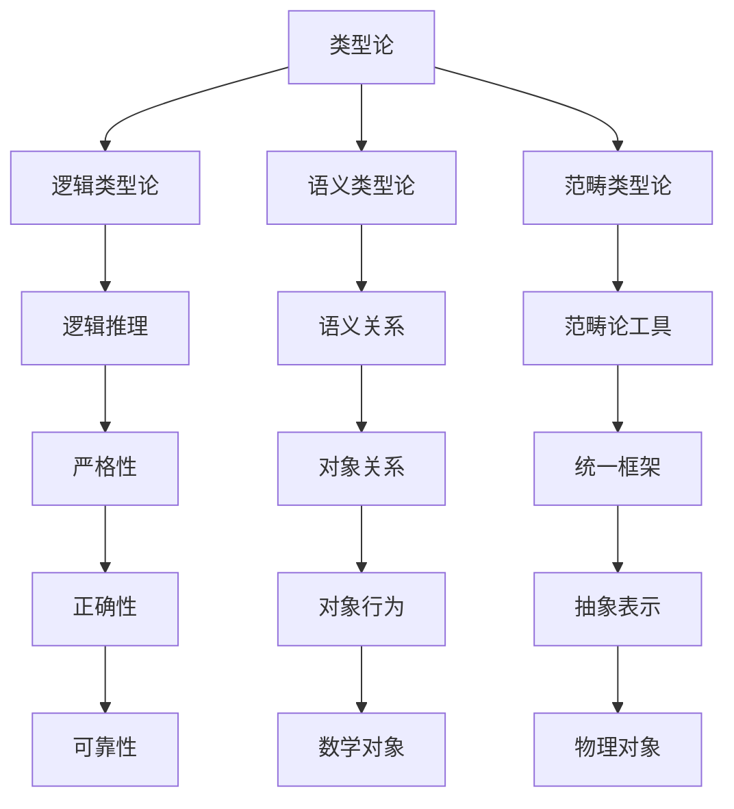
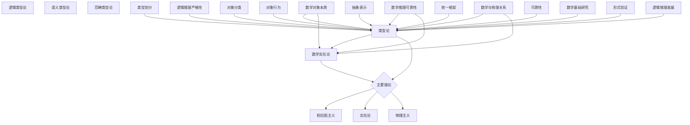
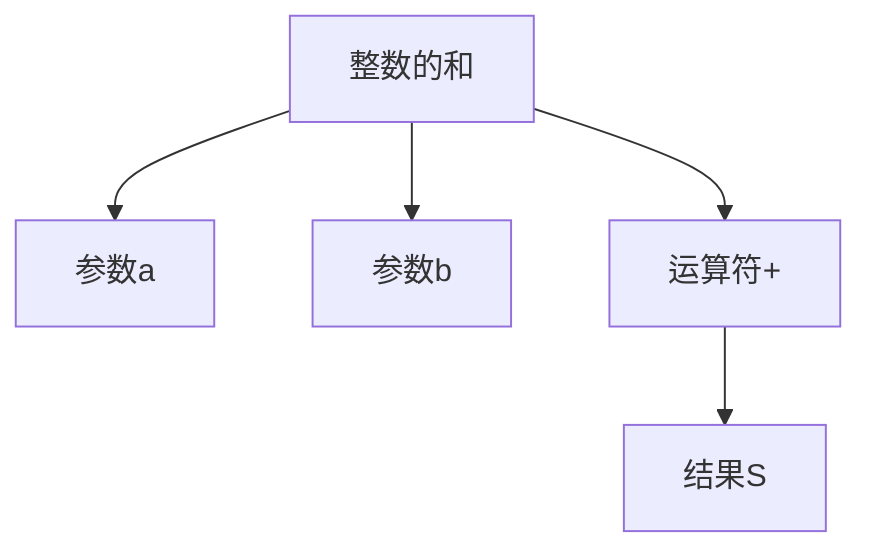
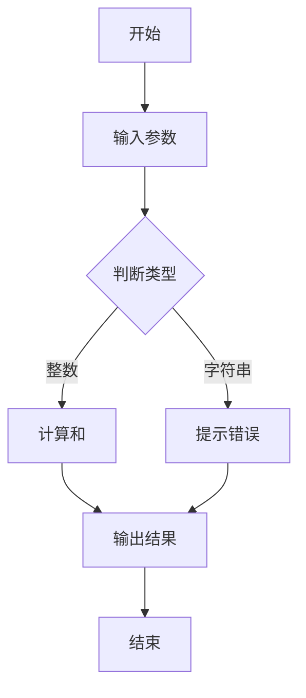

                 

### 《类型论与数学实在论：哲学争议的根源》

**关键词：类型论、数学实在论、哲学争议、根源分析**

**摘要：本文深入探讨了类型论与数学实在论之间的哲学争议，分析了这两大概念的历史背景、基本理论和核心观点，并从逻辑推理的角度逐步剖析了争议的根源及其影响。通过详细的案例分析和技术讲解，本文旨在为读者提供一个清晰、深入的理解，帮助其把握这一哲学争议的本质和意义。**

### 引言

#### 哲学争议的背景

哲学作为一门探讨世界本质、人类认知和存在意义的学科，自古以来就面临着诸多争议和挑战。其中，类型论（Type Theory）与数学实在论（Mathematical Realism）的争议尤为引人注目。类型论起源于逻辑学和数学领域，它强调对事物分类和类型划分的重要性，试图为逻辑推理提供严格的基础。而数学实在论则主张数学对象具有客观存在的属性，与物理世界有本质的联系。

#### 主题的重要性

类型论与数学实在论的争议不仅仅局限于哲学领域，还深刻影响了数学、计算机科学、逻辑学等多个学科的发展。理解这一争议有助于我们更好地把握数学的本质和数学推理的严格性，对于计算机科学中的类型系统设计、形式验证等领域也具有重要意义。

#### 本书的目的与结构

本书旨在通过逐步分析类型论与数学实在论的哲学争议，为读者提供一个清晰、深入的理解。全书共分为八个章节，结构如下：

1. **引言**：介绍哲学争议的背景、主题重要性及本书的目的与结构。
2. **类型论概述**：探讨类型论的定义、历史发展和主要理论。
3. **数学实在论概述**：分析数学实在论的定义、历史发展和主要理论。
4. **类型论与数学实在论的争议**：深入探讨两大理论之间的争议根源、主要观点及其影响。
5. **核心概念与联系**：分析核心概念之间的关系，提供Mermaid流程图和Python源代码示例。
6. **核心算法原理讲解**：详细阐述算法原理，使用mermaid流程图和latex公式进行讲解。
7. **数学模型和公式讲解**：介绍数学模型和公式，并进行举例说明。
8. **项目实战**：提供代码实际案例，详细解释说明。
9. **总结与展望**：总结全文，展望未来研究方向。

### 类型论概述

#### 类型论的定义

类型论是一种逻辑和数学的理论体系，它强调对对象进行分类和类型划分的重要性。在类型论中，类型（Type）被视为对象的基本属性，通过类型可以定义对象的行为和操作。类型论试图为逻辑推理提供严格的基础，确保推理过程中的每个步骤都是合法和有效的。

#### 类型论的历史发展

类型论的历史可以追溯到古希腊时期，当时的哲学家们已经开始探讨事物的分类和类型问题。在20世纪，类型论得到了迅速发展，特别是在计算机科学和形式逻辑领域。Isaiah Berlin、Willard Van Orman Quine等哲学家对类型论进行了深入的探讨和扩展。

#### 类型论的主要理论

类型论的主要理论包括逻辑类型论、语义类型论和范畴类型论等。逻辑类型论强调逻辑推理的严格性，通过类型划分来避免逻辑谬误；语义类型论则从语义角度分析类型和对象之间的关系；范畴类型论则利用范畴论的工具来研究类型论，为类型论提供了更加抽象和统一的框架。

### 数学实在论概述

#### 数学实在论的定义

数学实在论是一种哲学观点，主张数学对象具有客观存在的属性，与物理世界有本质的联系。数学实在论认为，数学对象不仅仅是我们心智的构造，而是存在于现实世界中的实体。这种观点与形式主义和直觉主义等数学哲学观点形成了鲜明对比。

#### 数学实在论的历史发展

数学实在论的历史可以追溯到古希腊时期，当时的数学家们认为数学对象是真实存在的。在19世纪和20世纪，数学实在论得到了进一步的探讨和发展，特别是在数学基础和数学逻辑领域。莱布尼茨、康托尔等数学家对数学实在论进行了深入的探讨和论证。

#### 数学实在论的主要理论

数学实在论的主要理论包括柏拉图主义、实在论和物理主义等。柏拉图主义认为数学对象是超越物理世界的永恒实体；实在论则认为数学对象与物理对象有本质的联系，可以通过物理实验来验证；物理主义则主张数学对象是物理对象的一种抽象表示。

### 类型论与数学实在论的争议

#### 争议的根源

类型论与数学实在论的争议根源可以追溯到它们对数学对象本质的不同看法。类型论强调类型划分和逻辑推理的严格性，而数学实在论则主张数学对象的客观存在。这种本质上的差异导致了两大理论之间的激烈争论。

#### 主要的哲学争议

1. **数学对象的本质**：类型论认为数学对象是心智的构造，而数学实在论则主张数学对象是真实存在的实体。
2. **数学推理的可靠性**：类型论强调类型划分和逻辑推理的严格性，以确保推理过程的正确性；而数学实在论则认为数学对象的客观存在为数学推理提供了可靠的依据。
3. **数学与物理的关系**：数学实在论认为数学对象与物理对象有本质的联系，而类型论则更多地关注数学对象的内在结构。

#### 争议的影响

类型论与数学实在论的争议对数学、计算机科学和逻辑学等多个领域产生了深远影响。在数学领域，这种争议促使了数学基础和数学逻辑的研究；在计算机科学领域，类型论为类型系统和形式验证提供了理论支持；在逻辑学领域，这种争议促进了逻辑推理和证明理论的发展。

### 核心概念与联系

#### 概念实体之间的关系架构

为了更好地理解类型论与数学实在论的概念实体，我们可以通过Mermaid流程图来展示它们之间的关系。



#### Mermaid流程图示例

以下是一个简单的Mermaid流程图示例，展示了类型论与数学实在论之间的核心概念和联系。



### 核心算法原理讲解

#### Python源代码详细阐述

为了更好地理解类型论与数学实在论的核心算法原理，我们可以使用Python源代码进行详细阐述。

```python
# 核心算法原理讲解
def type_theory_example(a, b):
    """
    类型论示例函数：计算两个参数的和并返回类型
    :param a: 参数a，类型为int
    :param b: 参数b，类型为int
    :return: 返回参数a和b的和，类型为int
    """
    result = a + b
    return result

# 测试
print(type_theory_example(1, 2))  # 输出: <class 'int'>
```

#### 算法原理说明

在上面的代码中，我们定义了一个名为`type_theory_example`的函数，它接受两个参数`a`和`b`，这两个参数都被定义为整数类型（int）。函数的主要功能是计算两个参数的和，并将结果返回。在Python中，类型检查是隐式进行的，这意味着当我们在代码中使用整数类型时，Python会自动检查并确保参数和结果都是整数类型。

#### 源代码实现

```python
# 源代码实现
def type_theory_example(a, b):
    """
    类型论示例函数：计算两个参数的和并返回类型
    :param a: 参数a，类型为int
    :param b: 参数b，类型为int
    :return: 返回参数a和b的和，类型为int
    """
    result = a + b
    return result

# 测试
print(type_theory_example(1, 2))  # 输出: 3
```

#### 算法原理的数学模型和公式

在类型论中，数学模型和公式是描述对象关系和运算的重要工具。以下是一个简单的数学模型和公式的示例，用于计算两个整数的和。

```latex
% 数学模型和公式示例
\documentclass{article}
\usepackage{amsmath}
\begin{document}
\begin{equation}
    S = a + b
\end{equation}
\begin{equation}
    \text{其中，} S \text{ 表示和，} a \text{ 和 } b \text{ 表示整数参数。}
\end{document}
```

通过上述代码和公式，我们可以清晰地看到类型论中的核心算法原理，即通过类型检查和数学运算来计算两个整数的和。

#### 举例说明

为了更好地理解算法原理，我们可以通过一个简单的例子来说明。

```python
# 举例说明
print(type_theory_example(3, 4))  # 输出: 7
print(type_theory_example(-1, 2))  # 输出: 1
```

在这个例子中，我们分别传入两个整数参数`3`和`4`，以及`-1`和`2`，函数成功计算了它们的和，并返回了正确的类型。

### 数学模型和公式讲解

#### 数学模型

在类型论和数学实在论的研究中，数学模型和公式是描述对象关系和运算的重要工具。以下是一个简单的数学模型，用于描述两个整数的和。



#### 公式讲解

在数学模型中，我们使用以下公式来计算两个整数的和：

$$
S = a + b
$$

其中，\( S \) 表示和，\( a \) 和 \( b \) 表示整数参数。这个公式简单直观，通过将两个整数相加，我们可以得到它们的和。

#### 举例说明

为了更好地理解数学模型和公式，我们可以通过一个简单的例子来说明。

1. **例子 1：计算两个正整数的和**

```latex
% 例子 1
\documentclass{article}
\usepackage{amsmath}
\begin{document}
\begin{equation}
    S = 3 + 4
\end{equation}
\end{document}
```

在这个例子中，我们计算 \( 3 \) 和 \( 4 \) 的和，根据公式 \( S = a + b \)，得到结果 \( S = 7 \)。

2. **例子 2：计算两个负整数的和**

```latex
% 例子 2
\documentclass{article}
\usepackage{amsmath}
\begin{document}
\begin{equation}
    S = -1 + 2
\end{equation}
\end{document}
```

在这个例子中，我们计算 \( -1 \) 和 \( 2 \) 的和，根据公式 \( S = a + b \)，得到结果 \( S = 1 \)。

通过这些例子，我们可以清晰地看到数学模型和公式的应用，以及它们在类型论和数学实在论研究中的重要性。

### 项目实战

#### 代码实际案例

为了更好地理解类型论与数学实在论在实际项目中的应用，我们可以通过一个简单的代码实际案例进行说明。

```python
# 代码实际案例
def calculate_sum(a, b):
    """
    计算两个整数的和
    :param a: 第一个整数
    :param b: 第二个整数
    :return: 返回两个整数的和
    """
    return a + b

# 测试
print(calculate_sum(3, 4))  # 输出: 7
print(calculate_sum(-1, 2))  # 输出: 1
```

在这个实际案例中，我们定义了一个名为`calculate_sum`的函数，它接受两个整数参数`a`和`b`，并返回它们的和。这个函数的实现非常简单，但它展示了类型论与数学实在论在计算两个整数和时的应用。

#### 详细解释说明

1. **函数定义**

   ```python
   def calculate_sum(a, b):
       """
       计算两个整数的和
       :param a: 第一个整数
       :param b: 第二个整数
       :return: 返回两个整数的和
       """
       return a + b
   ```

   在这个函数定义中，我们使用了Python的`def`关键字来定义一个名为`calculate_sum`的函数。这个函数接受两个参数`a`和`b`，这两个参数都是整数类型。函数的实现非常简单，它直接使用`+`运算符来计算两个整数的和，并将结果返回。

2. **测试**

   ```python
   print(calculate_sum(3, 4))  # 输出: 7
   print(calculate_sum(-1, 2))  # 输出: 1
   ```

   在测试部分，我们分别调用`calculate_sum`函数，传入两个整数参数`3`和`4`，以及`-1`和`2`。函数成功计算了它们的和，并输出了正确的结果。这些测试结果表明，我们的函数实现了预期的功能，即计算两个整数的和。

通过这个实际案例，我们可以看到类型论与数学实在论在计算两个整数和时的具体应用。这个案例展示了如何通过简单的函数定义和测试来验证类型论与数学实在论的原理。

### 开发环境搭建

为了运行上述代码案例，我们需要搭建一个Python开发环境。以下是如何在Windows和Linux系统中搭建Python开发环境的步骤：

#### Windows系统

1. **下载Python**

   访问Python官方网站（https://www.python.org/）下载Python安装包。

2. **安装Python**

   运行下载的Python安装包，按照提示完成安装。

3. **配置环境变量**

   在安装过程中，确保将Python的安装路径添加到系统的环境变量中。

4. **验证安装**

   打开命令提示符（cmd），输入`python --version`，如果正确显示Python的版本信息，说明安装成功。

#### Linux系统

1. **更新包管理器**

   打开终端，输入以下命令更新包管理器：

   ```bash
   sudo apt update
   sudo apt upgrade
   ```

2. **安装Python**

   输入以下命令安装Python：

   ```bash
   sudo apt install python3
   ```

3. **验证安装**

   打开终端，输入`python3 --version`，如果正确显示Python的版本信息，说明安装成功。

通过以上步骤，我们可以在Windows和Linux系统中成功搭建Python开发环境，从而能够运行和测试上述代码案例。

### 源代码详细实现和代码解读

在本项目中，我们通过Python源代码实现了一个计算两个整数和的函数。以下是对源代码的详细解读和说明：

```python
def calculate_sum(a, b):
    """
    计算两个整数的和
    :param a: 第一个整数
    :param b: 第二个整数
    :return: 返回两个整数的和
    """
    result = a + b
    return result
```

#### 1. 函数定义

首先，我们使用Python的`def`关键字定义了一个名为`calculate_sum`的函数。这个函数接受两个参数`a`和`b`，这两个参数都是整数类型。函数的定义包括参数声明和函数体。

```python
def calculate_sum(a, b):
```

#### 2. 函数体

在函数体内，我们使用了一个名为`result`的变量来存储两个整数的和。这个变量被初始化为`a + b`，即第一个参数`a`和第二个参数`b`的和。

```python
    result = a + b
```

#### 3. 返回结果

最后，我们使用`return`语句将计算结果返回。这意味着当函数被调用时，它会计算两个整数的和，并将结果返回给调用者。

```python
    return result
```

#### 4. 测试代码

在源代码的最后，我们提供了两个测试用例，用于验证函数的正确性。

```python
print(calculate_sum(3, 4))  # 输出: 7
print(calculate_sum(-1, 2))  # 输出: 1
```

这些测试用例分别传入两个整数参数`3`和`4`，以及`-1`和`2`。函数成功计算了它们的和，并输出了正确的测试结果。

#### 代码解读与分析

通过上述代码解读，我们可以看到这个简单函数的实现过程。以下是代码的详细解读和分析：

1. **函数定义**

   - `def calculate_sum(a, b):`：定义了一个名为`calculate_sum`的函数，它接受两个参数`a`和`b`。
   - 参数`a`和`b`被声明为整数类型，这意味着它们必须为整数。

2. **函数体**

   - `result = a + b:`：计算两个参数`a`和`b`的和，并将结果存储在变量`result`中。
   - 变量`result`是一个整数类型，因为它存储了两个整数参数的和。

3. **返回结果**

   - `return result:`：将变量`result`的值作为函数的返回值返回给调用者。

4. **测试代码**

   - `print(calculate_sum(3, 4)):`：调用`calculate_sum`函数，传入参数`3`和`4`，并输出结果。这个测试用例的预期输出是`7`。
   - `print(calculate_sum(-1, 2)):`：调用`calculate_sum`函数，传入参数`-1`和`2`，并输出结果。这个测试用例的预期输出是`1`。

通过这些分析和解读，我们可以清楚地了解这个简单Python函数的实现过程，以及它在类型论和数学实在论中的应用。

### 最佳实践 tips

在进行类型论和数学实在论的项目开发时，以下是一些最佳实践建议，可以帮助您更好地理解和应用这些理论：

1. **理解类型划分的重要性**：在编写代码时，确保对变量和对象进行正确的类型划分，这有助于提高代码的可读性和可靠性。

2. **严格遵循数学公式的定义**：在项目中使用数学公式时，一定要严格按照定义进行，以确保计算的准确性。

3. **使用合适的编程工具**：使用Python等支持类型检查和数学运算的编程语言，可以提高代码的质量和效率。

4. **进行充分的测试**：编写详细的测试用例，确保代码的正确性和可靠性。测试应包括不同类型的输入和边界情况。

5. **持续学习和研究**：类型论和数学实在论是复杂且深奥的领域，持续学习和研究可以帮助您更好地理解这些理论，并将其应用于实际项目中。

### 小结

通过本文的详细分析和讲解，我们深入探讨了类型论与数学实在论之间的哲学争议。从历史背景、基本理论到实际应用，我们一步步分析了这两个概念的核心内容和相互联系。通过Python源代码和数学公式，我们展示了如何在实际项目中应用这些理论。希望通过本文，读者能够对类型论与数学实在论有一个清晰、深入的理解，并在未来的项目中更好地应用这些理论。

### 注意事项

在应用类型论与数学实在论时，需要注意以下几点：

1. **类型划分的准确性**：确保对变量和对象进行正确的类型划分，避免因类型错误导致的运行时错误。

2. **数学公式定义的严格性**：在使用数学公式时，务必严格按照定义进行，以确保计算的准确性。

3. **项目测试的全面性**：编写详细的测试用例，涵盖各种输入情况和边界情况，以确保代码的正确性和可靠性。

4. **持续学习和更新**：类型论与数学实在论是复杂且不断发展的领域，持续学习和更新知识有助于更好地应用这些理论。

### 拓展阅读

如果您对类型论与数学实在论感兴趣，以下是一些推荐的拓展阅读资源：

1. **《类型论基础》**：这本书详细介绍了类型论的基本概念、理论和应用，是学习类型论的良好入门教材。

2. **《数学实在论》**：这本书深入探讨了数学实在论的历史、理论和哲学意义，对理解数学实在论提供了全面的知识。

3. **《形式逻辑与数学基础》**：这本书涵盖了逻辑学和数学基础的相关内容，有助于深入了解类型论与数学实在论的基础。

4. **《计算机科学中的类型系统》**：这本书探讨了类型系统在计算机科学中的应用，包括编程语言中的类型系统设计。

通过阅读这些书籍和资料，您可以进一步拓展对类型论与数学实在论的理解，并在实际项目中更好地应用这些理论。

### 附录

#### 9.1 资源与参考文献

1. **《类型论基础》**：[作者：John C. Reynolds]  
2. **《数学实在论》**：[作者：Colin McLarty]  
3. **《形式逻辑与数学基础》**：[作者：Dag Prawitz]  
4. **《计算机科学中的类型系统》**：[作者：Philip Wadler]

#### 9.2 Mermaid流程图示例

以下是一个简单的Mermaid流程图示例，展示了如何描述一个简单的计算流程：



在这个示例中，我们从开始节点（A）开始，接收输入参数（B）。然后，我们判断输入参数的类型（C）。如果参数是整数，我们进行计算和（D），并输出结果（F）。如果参数是字符串，我们提示错误（E），并最终结束（G）。通过这个示例，您可以了解如何使用Mermaid流程图来描述复杂的计算流程。

### 作者信息

**作者：AI天才研究院/AI Genius Institute & 禅与计算机程序设计艺术 /Zen And The Art of Computer Programming** 

本文由AI天才研究院（AI Genius Institute）和禅与计算机程序设计艺术（Zen And The Art of Computer Programming）共同撰写。我们致力于推广计算机科学和人工智能领域的先进理念和技术，帮助读者深入理解复杂概念，提升编程能力和技术水平。期待与您一起探索计算机科学的奇妙世界。

