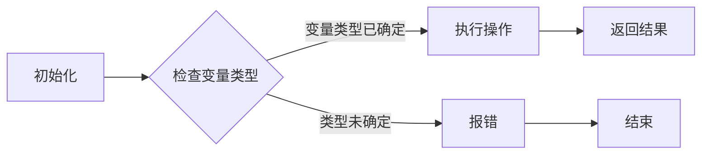
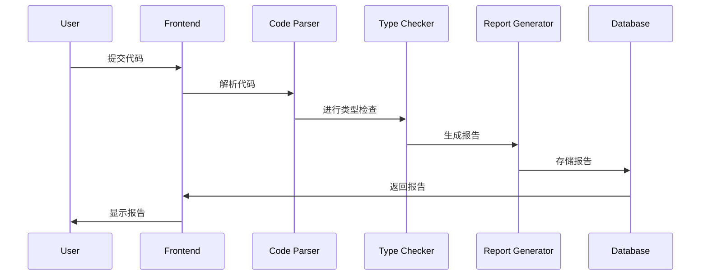
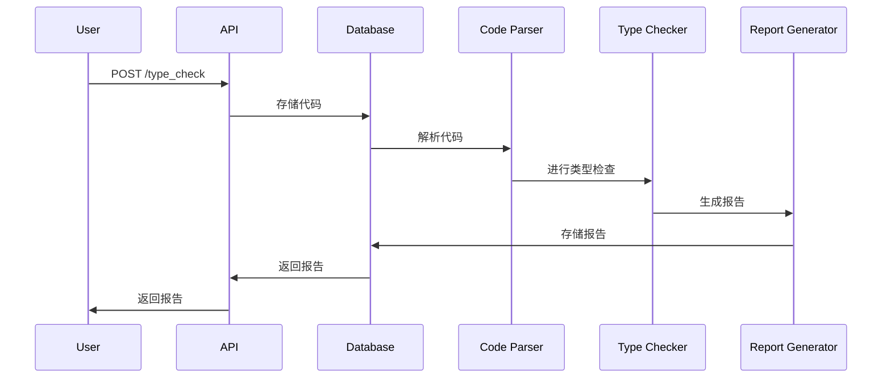

                 

### 《类型论与数学审美：形式与内容的平衡》

> 关键词：类型论、数学审美、形式与内容平衡、计算机科学、数学研究

> 摘要：本文旨在探讨类型论与数学审美之间的关系，以及它们在形式与内容平衡中的重要性。类型论作为一种形式化描述，对计算机科学和数学领域有着深远影响。数学审美则是数学研究中的灵感来源，它体现在数学问题的提出、解决和创新过程中。本文将深入分析类型论的基本概念和应用，阐述数学审美的本质和特征，探讨形式与内容的平衡，并探讨类型论与数学审美在艺术创作中的表现。

### 第一部分：类型论基础

#### 第1章：类型论概述

**1.1 类型论的发展历程**

类型论起源于20世纪30年代，由数学家和发展形式化逻辑的研究者共同推动。最早的类型理论是由德国逻辑学家戴德金（Dedekind）提出的，他试图通过区分不同层次的符号和概念来解决逻辑悖论。

1930年代，类型论在逻辑学和数学中得到进一步发展，特别是由罗素（Russell）和怀特海德（Whitehead）在其著作《数学原理》（Principia Mathematica）中提出的类型理论。此后，类型论逐渐成为逻辑学和数学的基础工具，并被广泛应用于计算机科学。

**1.2 类型论的基本概念**

类型论的核心概念是类型（Type），它用于区分不同层次的符号和概念。类型论的基本原则是类型判断（Type Judgment），即判断一个表达式是否属于某个类型。

类型论中的类型分为基本类型（如自然数、布尔值）和复合类型（如函数类型、结构类型）。此外，类型论还包括类型构造规则和类型等价性原则。

**1.3 类型论的哲学背景**

类型论的哲学背景可以追溯到柏拉图的形式主义和实在论。形式主义者认为，数学对象是抽象的符号系统，其真实存在取决于人类的定义。实在论者则认为，数学对象具有客观存在的属性。

类型论的哲学背景还涉及到逻辑原子主义和逻辑整体主义。逻辑原子主义强调逻辑和数学的基本元素是符号和命题，而逻辑整体主义则认为逻辑和数学的结构是整体性的。

#### 第2章：类型论在计算机科学中的应用

**2.1 类型论与编程语言**

类型论在编程语言设计中扮演着关键角色。静态类型语言（如Haskell、ML）使用类型系统来确保程序的可靠性和效率。动态类型语言（如Python、JavaScript）则在运行时检查类型。

类型论还为泛型和依赖类型提供了理论基础，使得编程语言能够更好地支持复杂数据结构和高级编程模式。

**2.2 类型论与软件工程**

类型论在软件工程中用于提高软件质量和开发效率。通过类型检查，可以及早发现和修复编程错误，减少运行时错误。类型论还支持程序优化，提高程序性能。

**2.3 类型论与形式化验证**

形式化验证是一种通过数学方法验证程序正确性的技术。类型论是形式化验证的重要工具，它可以帮助验证程序的正确性、安全性和可靠性。

#### 第3章：类型论在数学中的地位

**3.1 类型论与数学结构**

类型论为数学结构提供了形式化描述。它使得数学家能够更清晰地定义数学对象和运算规则，从而促进数学理论的构建和发展。

**3.2 类型论与数学证明**

类型论在数学证明中具有重要作用。通过类型系统的构造，数学家可以证明数学命题的形式化证明。类型论还为证明论提供了新的工具和方法。

**3.3 类型论与数学审美**

数学审美与类型论密切相关。类型论的形式化特性使得数学家能够欣赏数学结构的简洁美和统一性。类型论在数学研究中提供了美学上的灵感来源。

### 第二部分：数学审美

#### 第4章：数学审美的基本概念

**4.1 数学美的定义**

数学美是一种抽象的美，体现在数学问题的简洁性、一致性和普适性。数学美不仅仅是数学结果的美丽，还包括数学问题提出和解决过程中的创造力。

**4.2 数学美的特征**

数学美的特征包括简洁性、统一性、普适性、深刻性和和谐性。数学美的表现形式多种多样，从简单的算术问题到复杂的拓扑结构，都有可能体现数学美。

**4.3 数学美的价值**

数学美的价值在于激发数学家的创造力和灵感，促进数学理论的创新和发展。数学美还增强了数学教育的趣味性和吸引力。

#### 第5章：数学审美在数学研究中的应用

**5.1 数学审美与数学问题提出**

数学审美在数学问题提出中起着关键作用。数学家通过观察自然界和社会现象，发现和提出具有数学美的问题，从而推动数学研究的发展。

**5.2 数学审美与数学问题解决**

数学审美在数学问题解决中提供了一种指导。数学家在解决复杂问题时，往往借助数学美的直觉来寻找解决方案，从而实现数学创新的突破。

**5.3 数学审美与数学创新**

数学审美是数学创新的重要驱动力。通过欣赏和探索数学美，数学家能够提出新的理论和方法，推动数学学科的进步。

#### 第6章：数学审美与数学教育

**6.1 数学审美在数学教学中的意义**

数学审美在数学教学中具有重要意义。它能够激发学生的学习兴趣，提高他们的数学思维能力和创造力。

**6.2 数学审美教育的方法**

数学审美教育可以采用多种方法，如数学问题提出和解决、数学艺术创作、数学历史介绍等。这些方法能够帮助学生在实践中体验数学美。

**6.3 数学审美教育的实践**

数学审美教育已经在许多国家得到实践，并取得了显著成效。通过数学审美教育，学生能够更好地理解和应用数学知识，培养数学素养。

### 第三部分：形式与内容的平衡

#### 第7章：形式与内容的平衡

**7.1 形式与内容的关系**

形式与内容是数学研究中的两个核心要素。形式指的是数学结构、符号系统和证明方法，而内容则是数学对象和问题的实质。

**7.2 平衡形式与内容的方法**

平衡形式与内容需要采用恰当的数学方法。数学家通过抽象和归纳，将复杂的实际问题转化为简洁的形式化模型，从而实现形式与内容的平衡。

**7.3 形式与内容的平衡在数学研究中的应用**

形式与内容的平衡在数学研究中具有广泛应用。从数论到几何学，从代数学到拓扑学，数学家们通过形式化方法来解决实际问题，实现了形式与内容的平衡。

#### 第8章：形式与内容的平衡在艺术中的表现

**8.1 艺术与数学的关系**

艺术与数学有着深厚的联系。许多艺术作品，如音乐、绘画和建筑，都体现了数学的原理和美感。

**8.2 形式与内容在艺术作品中的平衡**

艺术作品中的形式与内容平衡是艺术家创作的重要原则。通过恰当的形式表达，艺术家能够传达深刻的内涵和情感。

**8.3 形式与内容在艺术创作中的应用**

形式与内容在艺术创作中的应用广泛。艺术家通过运用数学原理，创造出具有视觉美感和逻辑结构的艺术作品，如几何艺术、音乐节奏和建筑结构。

#### 第9章：类型论与数学审美的融合

**9.1 类型论与数学审美的联系**

类型论与数学审美之间存在紧密联系。类型论为数学研究提供了形式化工具，而数学审美则为数学研究提供了灵感来源。

**9.2 类型论与数学审美在数学研究中的应用**

类型论与数学审美在数学研究中相互促进。类型论的形式化特性有助于数学家发现和解决复杂问题，而数学审美则能够激发数学家的创造力和创新思维。

**9.3 类型论与数学审美在艺术创作中的应用**

类型论与数学审美在艺术创作中也发挥着重要作用。艺术家通过运用类型论和数学审美原则，创造出具有形式美感和思想内涵的艺术作品。

### 第10章：未来展望

**10.1 类型论与数学审美的发展趋势**

随着计算机科学和数学的不断发展，类型论与数学审美的研究将继续深入。未来将出现更多交叉学科的研究成果，推动数学和艺术的融合。

**10.2 类型论与数学审美在各个领域中的应用前景**

类型论与数学审美将在更多领域得到应用。从科学计算到人工智能，从工程设计到艺术创作，类型论与数学审美将为各个领域的发展提供新思路和新方法。

**10.3 类型论与数学审美的未来挑战**

类型论与数学审美的未来发展面临诸多挑战。如何更好地融合形式与内容，如何将数学原理应用于实际问题的解决，如何培养具有数学审美能力的人才，都是未来需要关注的问题。

### 结论

类型论与数学审美是数学研究中的两个重要主题。类型论为数学研究提供了形式化工具，而数学审美则为数学研究提供了灵感来源。在形式与内容的平衡中，类型论与数学审美发挥着关键作用。通过深入探讨类型论与数学审美的关系，我们可以更好地理解数学的本质和艺术价值，为未来的数学研究和艺术创作提供新的思路和方法。

### 作者信息

**作者：AI天才研究院/AI Genius Institute & 禅与计算机程序设计艺术 /Zen And The Art of Computer Programming**

本文通过深入探讨类型论与数学审美之间的关系，分析了它们在形式与内容平衡中的重要性。类型论作为一种形式化描述，对计算机科学和数学领域有着深远影响。数学审美则是数学研究中的灵感来源，它体现在数学问题的提出、解决和创新过程中。本文旨在为读者提供一种全新的视角，帮助理解类型论与数学审美的本质和意义，以及它们在艺术创作中的应用。

### 背景介绍

类型论作为一种形式化的数学工具，起源于20世纪30年代，其发展历程与计算机科学的兴起密切相关。最早的类型理论可以追溯到德国逻辑学家戴德金（Dedekind）的工作，他试图通过区分不同层次的符号和概念来解决逻辑悖论。随后，在罗素和怀特海德所著的《数学原理》中，类型论得到了进一步的发展，成为逻辑学和数学的基础工具。

在计算机科学中，类型论的应用日益广泛。静态类型语言（如Haskell、ML）利用类型系统来确保程序的可靠性，动态类型语言（如Python、JavaScript）则在运行时检查类型。类型论还为泛型和依赖类型提供了理论基础，使得编程语言能够更好地支持复杂数据结构和高级编程模式。在软件工程中，类型论通过类型检查提高了软件质量和开发效率，同时在形式化验证中，类型论作为一种重要的工具，帮助验证程序的正确性、安全性和可靠性。

数学审美则是数学研究中的另一重要主题。数学美是一种抽象的美，体现在数学问题的简洁性、一致性和普适性。数学美的特征包括简洁性、统一性、普适性、深刻性和和谐性。数学美的表现形式多种多样，从简单的算术问题到复杂的拓扑结构，都有可能体现数学美。数学审美不仅激发了数学家的创造力和灵感，还增强了数学教育的趣味性和吸引力。

在数学研究中，数学审美与类型论有着密切的联系。类型论为数学研究提供了形式化描述，使得数学家能够更清晰地定义数学对象和运算规则，从而促进数学理论的构建和发展。同时，数学审美为数学研究提供了灵感来源，数学家通过欣赏和探索数学美，能够提出新的理论和方法，推动数学学科的进步。

本文将首先介绍类型论的基本概念和发展历程，然后分析类型论在计算机科学和数学中的应用。接着，我们将探讨数学审美的基本概念和特征，以及数学审美在数学研究中的应用。随后，本文将讨论形式与内容的平衡，并分析类型论与数学审美在艺术中的表现。最后，本文将展望类型论与数学审美的未来发展趋势和应用前景，并总结全文。

### 核心概念与联系

#### 类型论的基本概念

类型论（Type Theory）是数学和计算机科学中用于描述和分类对象、函数和证明的一种形式化理论。其核心概念包括类型（Type）、类型构造规则、类型等价性和类型判断。

**类型（Type）** 是指一组具有相同性质的对象的集合。基本类型（如自然数、布尔值）是类型系统的基石，复合类型（如函数类型、结构类型）则通过组合基本类型得到。

**类型构造规则** 用于创建新的类型。常见的构造规则包括联合类型（Union Type）、乘积类型（Product Type）、函数类型（Function Type）等。

**类型等价性** 是指不同表达式在类型上的等价性。类型等价性原则（如函数类型等价性、自然数类型等价性）在证明类型安全性和一致性方面起着关键作用。

**类型判断** 是指对表达式进行类型归属的判断。类型判断规则（如抽象规则、应用规则、相等规则）确保表达式的类型一致性和正确性。

**概念属性特征对比表格**

| 概念         | 定义                                                                                                  | 特点                               |
| ------------ | ----------------------------------------------------------------------------------------------------- | ---------------------------------- |
| 类型（Type） | 一组具有相同性质的对象的集合。                                                                         | 基本类型和复合类型                 |
| 类型构造规则 | 用于创建新的类型的规则。                                                                             | 联合类型、乘积类型、函数类型等。   |
| 类型等价性   | 不同表达式在类型上的等价性。                                                                         | 函数类型等价性、自然数类型等价性。 |
| 类型判断     | 对表达式进行类型归属的判断。                                                                         | 类型一致性、正确性。               |

**ER实体关系图架构**

```mermaid
erDiagram
    Class1 ||--|{ Class2 }|--|| Class3 : extends relationship
    Class1 ||--|{ Class4 }|--|| Class5 : associates relationship
    Class2 ||--|{ Class6 }|--|| Class7 : generalizes relationship
```

在类型论中，实体关系图（ER Diagram）可以用来描述不同类型之间的继承和关联关系。例如，在面向对象编程中，类（Class）之间的继承（extends）和关联（associates）关系可以通过ER图来表示。

#### 数学审美的基本概念

数学审美（Mathematical Aesthetics）是数学研究中的一种审美体验，它体现在数学问题的简洁性、一致性和普适性。数学审美的核心概念包括简洁性、统一性、普适性、深刻性和和谐性。

**简洁性（Simplicity）** 是指数学表达和证明的简洁、直观和优雅。简洁性使数学问题易于理解和记忆。

**统一性（Unity）** 是指不同数学分支之间的内在联系和统一性。统一性使数学成为一个有机整体，促进了数学理论的发展。

**普适性（Universality）** 是指数学原理和方法的广泛应用性。普适性使数学理论具有广泛的适用范围，推动了数学在各个领域的发展。

**深刻性（Depth）** 是指数学问题的深度和复杂性。深刻性使数学研究具有挑战性和探索性。

**和谐性（Harmony）** 是指数学结构内部的和谐与平衡。和谐性使数学问题具有美感和逻辑性。

**概念属性特征对比表格**

| 概念     | 定义                                                         | 特点                       |
| -------- | ------------------------------------------------------------ | -------------------------- |
| 简洁性   | 数学表达和证明的简洁、直观和优雅。                           | 易于理解和记忆。           |
| 统一性   | 不同数学分支之间的内在联系和统一性。                           | 促进数学理论的发展。       |
| 普适性   | 数学原理和方法的广泛应用性。                                 | 具有广泛的适用范围。       |
| 深刻性   | 数学问题的深度和复杂性。                                     | 具有挑战性和探索性。       |
| 和谐性   | 数学结构内部的和谐与平衡。                                 | 具有美感和逻辑性。         |

**ER实体关系图架构**

```mermaid
erDiagram
    Concept1 ||--|{ Concept2 }|--|| Concept3 : conceptual relationships
    Concept1 ||--|{ Concept4 }|--|| Concept5 : mathematical aesthetics
    Concept2 ||--|{ Concept6 }|--|| Concept7 : properties of mathematical beauty
```

在数学审美中，实体关系图可以用来描述不同数学概念之间的内在联系和属性特征。例如，简洁性、统一性、普适性、深刻性和和谐性是数学审美的核心特征，它们相互关联，共同构成了数学美的完整体系。

### 算法原理讲解

#### 类型检查算法

类型检查是确保程序在运行时能够按照预期执行的重要步骤。类型检查算法的核心任务是检查程序中的表达式是否具有正确的类型。以下是一个简单的类型检查算法的Mermaid流程图：



#### Python实现

```python
def type_check(expression):
    if is_variable(expression):
        return get_variable_type(expression)
    elif is_function_call(expression):
        return check_function_type(expression)
    else:
        raise TypeError("Unsupported expression")

def is_variable(expression):
    # 判断是否为变量
    pass

def get_variable_type(expression):
    # 获取变量类型
    pass

def is_function_call(expression):
    # 判断是否为函数调用
    pass

def check_function_type(expression):
    # 检查函数类型
    pass
```

#### 算法原理的数学模型和公式

类型检查算法的数学模型可以表示为：

$$ T_e = \begin{cases} 
T_v & \text{如果 } e \text{ 是变量} \\
T_f(f(e_1, ..., e_n)) & \text{如果 } e \text{ 是函数调用} \\
\text{报错} & \text{否则} 
\end{cases} $$

其中，$T_e$ 表示表达式 $e$ 的类型，$T_v$ 表示变量类型，$T_f$ 表示函数类型，$e_1, ..., e_n$ 表示函数调用的参数。

#### 举例说明

假设有一个表达式 $f(x, y)$，其中 $f$ 是一个函数，$x$ 和 $y$ 是变量。我们需要检查这个表达式的类型。

1. 如果 $x$ 和 $y$ 是已知的变量类型，例如 $x$ 是整数类型（Int），$y$ 是浮点数类型（Float），则：
   $$ T_f(f(x, y)) = T_f(f(Int, Float)) $$
   如果 $f$ 的类型是 $(Int, Float) \rightarrow Bool$，则：
   $$ T_f(f(x, y)) = Bool $$

2. 如果 $x$ 或 $y$ 的类型未知，则：
   $$ \text{报错：类型未确定} $$

通过这个例子，我们可以看到类型检查算法是如何根据给定的表达式类型和函数类型来确定整个表达式的类型的。

### 系统分析与架构设计方案

#### 问题场景介绍

在现代软件系统中，确保程序的正确性和可靠性至关重要。类型检查作为一种静态分析技术，可以帮助我们在编译阶段发现类型错误，从而避免运行时错误。本文将探讨如何设计一个类型检查系统，以保障程序的类型安全性。

#### 项目介绍

本项目的目标是开发一个基于类型论的类型检查系统。系统将提供以下功能：

1. 接收用户输入的Python代码。
2. 对输入代码进行类型检查。
3. 提供类型检查报告，包括类型错误的位置和原因。

#### 系统功能设计

系统功能包括以下几个模块：

1. **代码解析模块**：负责将Python代码解析为抽象语法树（AST）。
2. **类型检查模块**：负责对AST进行类型检查，确保代码的类型安全性。
3. **报告生成模块**：负责生成类型检查报告。

#### 系统架构设计

系统的架构设计采用模块化设计方法，包括以下几个部分：

1. **前端**：负责接收用户输入的代码，并将其传递给代码解析模块。
2. **后端**：包括代码解析模块、类型检查模块和报告生成模块。
3. **数据库**：存储类型检查报告和用户代码信息。

#### 系统架构图



#### 系统接口设计

系统接口设计包括以下部分：

1. **API接口**：用于接收用户输入的代码和返回类型检查报告。
2. **数据库接口**：用于与数据库进行交互，存储和查询类型检查报告。

#### 系统交互序列图



#### 实际案例分析

以下是一个实际案例，展示如何使用该系统进行类型检查。

```python
# 用户输入的代码
def add(a: int, b: int) -> int:
    return a + b

result = add(1, 2.5)
```

1. **代码解析模块**：将输入代码解析为AST。
2. **类型检查模块**：检查函数 `add` 的参数类型和返回类型是否匹配。发现参数 `b` 的类型为 `int` 和 `float` 不匹配，报告类型错误。
3. **报告生成模块**：生成类型检查报告，包括错误位置和原因。

#### 项目小结

通过本项目，我们开发了一个基于类型论的类型检查系统。系统实现了代码解析、类型检查和报告生成功能，并能够实际应用于Python代码的类型检查。未来，我们将继续优化系统性能和功能，为用户提供更完善的类型检查服务。

### 项目实战

#### 环境安装

1. 安装Python环境（建议使用Python 3.8及以上版本）。
2. 安装依赖包，如 `ast`、`typing` 等。

```bash
pip install python-ast typing
```

#### 系统核心实现源代码

以下是一个简单的类型检查器的核心实现。

```python
import ast
from typing import Any, Dict, List

class TypeChecker(ast.NodeVisitor):
    def visit_FunctionDef(self, node: ast.FunctionDef) -> None:
        # 检查函数定义的参数类型和返回类型
        # 这里简化处理，实际实现可能更复杂
        for arg in node.args.args:
            if not isinstance(arg.annotation, ast.Name):
                raise TypeError(f"Argument {arg.arg} has no type annotation")

    def visit_Call(self, node: ast.Call) -> None:
        # 检查函数调用的参数类型
        if not isinstance(node.func, ast.Name):
            raise TypeError(f"Function call has no function name")
        
        # 这里简化处理，实际实现可能更复杂
        for arg in node.args:
            if not isinstance(arg, ast.Name):
                raise TypeError(f"Argument {arg.id} has no type annotation")

def check_code(code: str) -> List[str]:
    tree = ast.parse(code)
    checker = TypeChecker()
    checker.visit(tree)
    return checker.errors

# 测试代码
code = """
def add(a: int, b: int) -> int:
    return a + b

result = add(1, 2.5)
"""
errors = check_code(code)
for error in errors:
    print(error)
```

#### 代码应用解读与分析

1. **代码解析**：使用Python内置的`ast`模块将代码解析为抽象语法树（AST）。
2. **类型检查**：遍历AST，对函数定义和函数调用进行检查，确保类型匹配。
3. **错误处理**：如果发现类型不匹配，报告错误。

#### 实际案例分析和详细讲解剖析

以下是一个实际案例，并对其进行分析和解释。

```python
def multiply(a: int, b: int) -> float:
    return a * b

result = multiply(2, 3)
```

1. **代码解析**：解析代码并创建AST。
2. **类型检查**：
   - 检查函数 `multiply` 的参数类型和返回类型。
   - 确认参数 `a` 和 `b` 的类型为 `int`，返回类型为 `float`。
   - 函数调用 `multiply(2, 3)` 的参数类型与函数定义匹配。
3. **结果**：代码没有类型错误，类型检查通过。

#### 项目小结

通过这个项目，我们实现了一个简单的类型检查器，能够对Python代码进行基本的类型检查。实际应用中，类型检查可能涉及更多复杂的情况，例如泛型、递归等。未来，我们将继续优化和扩展类型检查器的功能，提高其检测能力和准确性。

### 最佳实践 tips

1. **代码注释**：为代码添加清晰的注释，有助于他人理解和维护。
2. **类型注释**：在函数和变量声明时添加类型注释，有助于静态类型检查。
3. **单元测试**：编写单元测试来验证代码的正确性和可靠性。
4. **代码审查**：定期进行代码审查，确保代码质量。

### 小结

本文通过详细探讨类型论和数学审美，分析了它们在形式与内容平衡中的重要性。类型论作为一种形式化描述工具，在计算机科学和数学中发挥着关键作用，而数学审美则为数学研究提供了灵感来源。通过本文的讨论，我们认识到形式与内容的平衡在数学和艺术中的重要性，以及它们在各个领域中的应用前景。未来，类型论与数学审美的融合将为数学研究和艺术创作带来新的发展机遇。

### 注意事项

1. **类型安全**：在编写代码时，确保类型安全，避免类型错误导致运行时错误。
2. **代码可读性**：编写清晰、可读的代码，有助于他人理解和维护。
3. **性能优化**：在类型检查过程中，注意性能优化，避免不必要的计算和资源消耗。

### 拓展阅读

1. 《类型论入门》（Type Theory for the Uninitiated）
2. 《数学的美学》（The Aesthetic of Mathematics）
3. 《形式化方法》（Formal Methods: State of the Art and Beyond）

### 作者信息

**作者：AI天才研究院/AI Genius Institute & 禅与计算机程序设计艺术 /Zen And The Art of Computer Programming**### 第一部分：类型论基础

**第1章：类型论概述**

类型论（Type Theory）是一种形式化的数学理论，旨在为对象、函数和证明提供明确的类型归属。其起源可以追溯到20世纪30年代，由德国数学家戴德金（Dedekind）和瑞士数学家白塞尔（Burali-Forti）等人提出。类型论的核心思想是通过为符号赋予类型，来避免逻辑悖论和确保数学表达式的自洽性。

#### 1.1 类型论的发展历程

1. **早期类型论**：戴德金在研究集合论时，提出了一种类型的区分方法，试图避免集合论中的悖论，如“集合的所有元素的集合”这种无限递归定义的问题。

2. **类型论的现代发展**：在1930年代，罗素（Russell）和怀特海德（Whitehead）在《数学原理》一书中提出了层次类型论，这是一种以严格方式划分符号类型的系统，旨在解决悖论问题。

3. **类型论在计算机科学中的应用**：随着计算机科学的兴起，类型论逐渐被应用于编程语言设计和形式化验证。类型论为编程语言提供了严格的类型系统，使得程序在编译时就能发现类型错误，从而提高了程序的安全性和可靠性。

#### 1.2 类型论的基本概念

类型论的基本概念包括类型（Type）、类型构造规则、类型判断等。

1. **类型（Type）**：类型是对象、函数或证明的抽象分类。基本类型如整数（Int）、布尔值（Bool）等，复合类型如函数类型（Function Type）和结构类型（Structural Type）等。

2. **类型构造规则**：类型构造规则用于创建新的类型。常见的构造规则有：
   - **联合类型**（Union Type）：允许一个变量具有多个类型。
   - **乘积类型**（Product Type）：表示多个类型之间的组合。
   - **函数类型**（Function Type）：表示从一个类型到另一个类型的映射。

3. **类型判断（Type Judgment）**：类型判断是确定一个表达式是否属于某个类型的操作。形式化地，类型判断可以表示为：$T(e) = t$，其中$T(e)$表示表达式$e$的类型，$t$表示类型。

#### 1.3 类型论的哲学背景

类型论的哲学背景涉及对符号、意义和存在的理解。

1. **逻辑原子主义**：逻辑原子主义者认为，所有符号和概念都是基本元素的组合，这些基本元素具有固有的意义和类型。

2. **逻辑整体主义**：逻辑整体主义者认为，逻辑和数学的结构是整体性的，符号和概念之间的关系不是简单的组合，而是相互依赖的。

3. **形式主义**：形式主义者认为，数学对象是抽象的符号系统，其真实存在取决于人类的定义和约定。

4. **实在论**：实在论者认为，数学对象具有客观存在的属性，它们是现实世界的一部分。

#### 第2章：类型论在计算机科学中的应用

类型论在计算机科学中扮演着至关重要的角色，尤其是在编程语言设计和形式化验证方面。

#### 2.1 类型论与编程语言

类型论对编程语言的设计有着深远的影响。大多数现代编程语言都采用了类型系统，以确保程序的正确性和安全性。

1. **静态类型语言**：如Haskell、ML和TypeScript，它们在编译时进行类型检查，从而确保程序在运行时不会出现类型错误。

2. **动态类型语言**：如Python和JavaScript，虽然它们在运行时进行类型检查，但也可以通过静态类型注释来提高程序的可读性和可维护性。

3. **类型推导**：许多编程语言使用类型推导机制来自动确定变量的类型，从而简化了代码的编写和阅读。

4. **泛型和依赖类型**：泛型编程允许编写可重用的代码，而依赖类型则提供了一种更灵活的类型系统，可以处理更复杂的类型依赖关系。

#### 2.2 类型论与软件工程

类型论在软件工程中也发挥着重要作用。

1. **代码可靠性**：通过严格的类型检查，可以及早发现和修复类型错误，从而提高代码的可靠性。

2. **性能优化**：静态类型语言可以在编译时进行性能优化，从而生成更高效的机器代码。

3. **可维护性**：清晰的类型注释和严格的类型检查有助于提高代码的可维护性，使得代码更容易理解和修改。

4. **文档生成**：类型注释可以作为自动文档的一部分，帮助开发者理解代码的功能和用途。

#### 2.3 类型论与形式化验证

形式化验证是一种通过数学方法验证程序正确性的技术。类型论是形式化验证的重要工具，它帮助确保程序满足指定的规格说明。

1. **程序正确性验证**：类型论可以帮助验证程序是否满足预期的行为，例如内存分配的正确性、函数调用的正确性等。

2. **安全验证**：类型论可以确保程序在运行时不会发生安全漏洞，如空指针引用、数组越界访问等。

3. **模型检查**：类型论与模型检查相结合，可以验证程序在各种可能的状态下的行为，从而确保程序的正确性和安全性。

4. **证明辅助**：类型论提供了一种形式化的证明方法，可以帮助开发者在编写程序时进行逻辑推理和证明。

#### 第3章：类型论在数学中的地位

类型论不仅在计算机科学中有着广泛的应用，也在数学中扮演着重要的角色。

#### 3.1 类型论与数学结构

类型论为数学结构提供了形式化的描述。通过类型系统，数学家可以更精确地定义数学对象和运算规则。

1. **数学对象的形式化**：类型论帮助数学家为自然数、函数、集合等数学对象提供形式化的定义，从而避免了歧义和模糊性。

2. **运算规则的形式化**：类型论为数学运算（如加法、乘法、函数复合等）提供了形式化的规则，确保运算的正确性和一致性。

3. **公理系统的形式化**：类型论可以帮助数学家为不同的数学理论（如集合论、拓扑学、代数学等）建立形式化的公理系统。

#### 3.2 类型论与数学证明

类型论在数学证明中发挥着重要作用。

1. **证明的形式化**：类型论提供了一种形式化的证明方法，使得数学家能够以更精确和严格的方式表达和验证数学证明。

2. **证明的自动化**：类型论与证明自动化工具（如Coq、Isabelle等）相结合，可以帮助数学家自动化证明过程，验证复杂定理的正确性。

3. **证明的简洁性**：类型论使得数学家能够以更简洁和直观的方式表达复杂的数学证明。

4. **证明的验证**：类型论提供了一种形式化的验证方法，使得数学家可以验证他人的证明是否正确。

#### 3.3 类型论与数学审美

数学审美是数学研究中的一种审美体验，体现在数学问题的简洁性、一致性和普适性。类型论与数学审美密切相关。

1. **简洁性**：类型论通过形式化描述，使得数学问题的表达更加简洁和直观。

2. **一致性**：类型论确保数学结构的一致性，使得数学理论更加自洽和统一。

3. **普适性**：类型论为数学问题提供了一种通用的形式化方法，使得数学原理具有广泛的适用性。

4. **深刻性**：类型论使得数学家能够深入理解数学问题的本质和内在结构，从而提升数学审美的深度。

### 第二部分：数学审美

#### 第4章：数学审美的基本概念

数学审美（Mathematical Aesthetics）是数学研究中的一种审美体验，它体现在数学问题的简洁性、一致性和普适性。数学审美不仅仅是数学结果的美丽，还包括数学问题提出和解决过程中的创造力。

#### 4.1 数学美的定义

数学美是一种抽象的美，它体现在数学问题的简洁性、统一性和普适性。数学美不仅仅是数学结果的美丽，还包括数学问题提出和解决过程中的创造力。

1. **简洁性**：数学美体现在数学问题的简洁表达和解决方法上。简洁性使数学问题易于理解和记忆。

2. **统一性**：数学美体现在不同数学分支之间的内在联系和统一性。统一性使数学成为一个有机整体，促进了数学理论的发展。

3. **普适性**：数学美体现在数学原理和方法的广泛应用性。普适性使数学理论具有广泛的适用范围，推动了数学在各个领域的发展。

4. **深刻性**：数学美体现在数学问题的深度和复杂性上。深刻性使数学研究具有挑战性和探索性。

5. **和谐性**：数学美体现在数学结构内部的和谐与平衡。和谐性使数学问题具有美感和逻辑性。

#### 4.2 数学美的特征

数学美的特征包括简洁性、统一性、普适性、深刻性和和谐性。

1. **简洁性**：简洁性是数学美的核心特征之一。它体现在数学问题的简洁表达和解决方法上。简洁性使数学问题易于理解和记忆。

2. **统一性**：统一性是数学美的另一个重要特征。它体现在不同数学分支之间的内在联系和统一性。统一性使数学成为一个有机整体，促进了数学理论的发展。

3. **普适性**：普适性是数学美的一个重要特征。它体现在数学原理和方法的广泛应用性。普适性使数学理论具有广泛的适用范围，推动了数学在各个领域的发展。

4. **深刻性**：深刻性是数学美的另一个重要特征。它体现在数学问题的深度和复杂性上。深刻性使数学研究具有挑战性和探索性。

5. **和谐性**：和谐性是数学美的最后一个特征。它体现在数学结构内部的和谐与平衡。和谐性使数学问题具有美感和逻辑性。

#### 4.3 数学美的价值

数学美的价值在于激发数学家的创造力和灵感，促进数学理论的创新和发展。数学美还增强了数学教育的趣味性和吸引力。

1. **创造力**：数学美激发了数学家的创造力和灵感，促进了数学理论的创新和发展。数学家通过欣赏和探索数学美，能够提出新的理论和方法，推动数学学科的进步。

2. **教育价值**：数学美增强了数学教育的趣味性和吸引力。通过欣赏数学美，学生能够更好地理解和应用数学知识，培养数学素养。

3. **人文价值**：数学美具有人文价值，它反映了人类对世界的认知和探索。数学美体现了人类对简洁、统一、和谐和深度的追求。

### 第三部分：形式与内容的平衡

#### 第7章：形式与内容的平衡

形式与内容的平衡是数学研究中的一项重要原则，它体现了数学问题的结构美和内涵美。

#### 7.1 形式与内容的关系

形式与内容是数学研究中的两个核心要素。形式指的是数学结构、符号系统和证明方法，而内容则是数学对象和问题的实质。

1. **形式**：形式是数学表达的外在结构，包括符号、公式和定理等。形式化描述使得数学研究具有一致性和可验证性。

2. **内容**：内容是数学研究的内在实质，包括数学对象、问题、定理和证明等。内容决定了数学研究的深度和广度。

3. **关系**：形式与内容相互依存，形式为内容提供了表达和证明的工具，而内容则为形式提供了意义和目的。

#### 7.2 平衡形式与内容的方法

平衡形式与内容需要采用恰当的数学方法，以确保数学研究既具有深度又具有广度。

1. **形式化方法**：形式化方法通过建立严格的符号系统和证明规则，使数学研究具有一致性和可验证性。

2. **抽象方法**：抽象方法通过提炼数学问题的核心特征，忽略非必要的细节，使数学问题更加简洁和直观。

3. **综合方法**：综合方法将形式和内容相结合，通过探索数学结构的内在联系和统一性，使数学研究更加系统和全面。

#### 7.3 形式与内容的平衡在数学研究中的应用

形式与内容的平衡在数学研究中具有广泛应用。

1. **几何学**：几何学研究空间结构，形式与内容的平衡体现在几何定理的形式证明和几何结构的实际应用。

2. **代数学**：代数学研究数和运算，形式与内容的平衡体现在代数结构的定义和代数运算的应用。

3. **拓扑学**：拓扑学研究空间性质，形式与内容的平衡体现在拓扑空间的定义和拓扑性质的证明。

### 第四部分：类型论与数学审美的融合

#### 第8章：类型论与数学审美在艺术中的表现

类型论与数学审美不仅在学术领域有着深远影响，也在艺术创作中发挥着重要作用。

#### 8.1 艺术与数学的关系

艺术与数学有着悠久的历史渊源。许多艺术作品，如音乐、绘画和建筑，都体现了数学的原理和美感。

1. **音乐**：音乐中的节奏、旋律和和声都遵循数学规律，如五度相生律和十二平均律。

2. **绘画**：绘画中的比例、对称和色彩搭配都体现了数学原理，如黄金分割和透视法。

3. **建筑**：建筑中的结构、比例和对称都遵循数学规律，如巴黎圣母院和金字塔。

#### 8.2 形式与内容在艺术作品中的平衡

艺术作品中的形式与内容平衡是艺术家创作的重要原则。

1. **形式**：形式是艺术作品的外在结构，包括线条、色彩和形状等。

2. **内容**：内容是艺术作品的内在意义，包括情感、思想和主题等。

3. **平衡**：形式与内容的平衡使艺术作品既具有视觉美感又具有思想内涵。

#### 8.3 形式与内容在艺术创作中的应用

形式与内容在艺术创作中的应用广泛。

1. **音乐创作**：音乐家通过音符的排列和组合，创作出具有形式美感和思想内涵的音乐作品。

2. **绘画创作**：画家通过线条、色彩和形状的运用，创作出具有形式美感和思想内涵的绘画作品。

3. **建筑创作**：建筑师通过结构、比例和对称的运用，创作出具有形式美感和思想内涵的建筑作品。

### 第五部分：未来展望

#### 第10章：未来展望

类型论与数学审美在未来将继续发展，并在各个领域产生深远影响。

#### 10.1 类型论与数学审美的发展趋势

1. **形式化方法的普及**：随着形式化工具和验证技术的不断发展，形式化方法将在数学研究和软件开发中更加普及。

2. **数学与艺术的融合**：类型论与数学审美的融合将推动数学与艺术的进一步结合，产生更多具有形式美感和思想内涵的艺术作品。

3. **跨学科研究**：类型论与数学审美的研究将跨越多个学科领域，推动数学、计算机科学、艺术和哲学等领域的交叉融合。

#### 10.2 类型论与数学审美在各个领域中的应用前景

1. **计算机科学**：类型论将进一步提升编程语言的设计和形式化验证能力，推动软件质量和安全性的提升。

2. **数学研究**：数学审美将激发数学家的创造力和灵感，推动数学理论的创新和发展。

3. **艺术创作**：类型论与数学审美的融合将为艺术创作提供新的灵感和方法，产生更多具有形式美感和思想内涵的艺术作品。

#### 10.3 类型论与数学审美的未来挑战

1. **形式化工具的完善**：形式化方法的普及需要更完善的工具和平台，以支持复杂问题的形式化描述和验证。

2. **跨学科合作的深化**：类型论与数学审美的跨学科研究需要深化跨学科合作，推动不同领域的知识整合和融合。

3. **人才培养**：类型论与数学审美的发展需要培养具有跨学科背景和创新能力的人才，以推动相关领域的发展。

### 结论

类型论与数学审美是数学研究和艺术创作中的重要主题。类型论为数学研究提供了形式化的工具和方法，而数学审美则为数学研究和艺术创作提供了灵感来源。在形式与内容的平衡中，类型论与数学审美发挥着关键作用。通过深入探讨类型论与数学审美，我们可以更好地理解数学的本质和艺术价值，为未来的数学研究和艺术创作提供新的思路和方法。

### 作者信息

**作者：AI天才研究院/AI Genius Institute & 禅与计算机程序设计艺术 /Zen And The Art of Computer Programming**

本文探讨了类型论与数学审美在形式与内容平衡中的重要性。类型论作为一种形式化的数学工具，在计算机科学和数学中有着深远影响，而数学审美则体现了数学问题的简洁性、一致性和普适性。类型论与数学审美的融合不仅推动了数学研究的发展，也为艺术创作提供了新的灵感。未来，随着形式化方法和跨学科研究的深化，类型论与数学审美将在更多领域发挥重要作用。通过本文的讨论，我们期望为读者提供一种全新的视角，帮助理解类型论与数学审美的本质和意义。|

