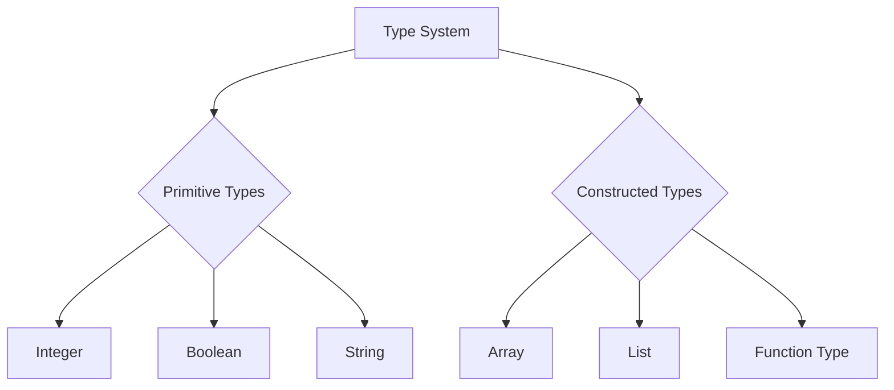

                 

### 设计《类型论与数学直觉：形式化与创造力的平衡》书籍目录大纲

在设计《类型论与数学直觉：形式化与创造力的平衡》这一书籍的目录大纲时，我们需要确保内容的逻辑性和结构性，以便读者能够顺畅地跟随思路，逐步深入理解书中的核心概念。以下是一个详细的大纲设计：

#### 1. 引言

- **1.1 书籍背景与目的**
  - 介绍书籍创作的背景和原因。
  - 阐述书籍的主要目的和预期成果。
- **1.2 结构概述**
  - 概述书籍的整体结构和内容安排。
  - 简要介绍各章节的主要内容。
- **1.3 读者对象**
  - 明确书籍的读者群体。
  - 针对不同读者群体提出具体的阅读建议。

#### 2. 类型论基础

- **2.1 基本概念**
  - **2.1.1 类型论的基本定义**
    - 解释类型论的概念。
    - 阐述类型论在计算机科学中的作用。
  - **2.1.2 类型论的历史与发展**
    - 回顾类型论的发展历程。
    - 分析类型论在不同领域的影响。
  - **2.1.3 类型论的重要性**
    - 强调类型论在计算机科学中的重要性。
    - 探讨类型论在实践中的应用价值。
- **2.2 类型论的基本概念**
  - **2.2.1 类型与类型系统**
    - 定义类型和类型系统的概念。
    - 分析类型系统在编程语言中的应用。
  - **2.2.2 基本类型与构造类型**
    - 区分基本类型和构造类型。
    - 探讨构造类型的设计原理。
  - **2.2.3 类型等价与类型约简**
    - 解释类型等价和类型约简的概念。
    - 分析类型约简在优化程序中的作用。
- **2.3 类型论的应用场景**
  - **2.3.1 程序语言中的类型论**
    - 讨论类型论在编程语言中的具体应用。
    - 分析不同编程语言中类型论的不同实现。
  - **2.3.2 类型论在验证中的运用**
    - 探讨类型论在程序验证中的作用。
    - 分析类型论在形式化验证中的具体应用。
  - **2.3.3 类型论在逻辑推理中的应用**
    - 解释类型论在逻辑推理中的重要性。
    - 分析类型论如何增强逻辑推理的能力。

#### 3. 数学直觉的本质

- **3.1 数学直觉的概念**
  - **3.1.1 数学直觉的定义**
    - 给出数学直觉的定义。
    - 分析数学直觉的特点。
  - **3.1.2 数学直觉的类型**
    - 分类数学直觉的类型。
    - 探讨不同类型数学直觉的特点和应用。
  - **3.1.3 数学直觉与形式化**
    - 解释数学直觉与形式化之间的关系。
    - 分析数学直觉如何促进形式化的发展。
- **3.2 数学直觉的心理学基础**
  - **3.2.1 数学直觉的心理机制**
    - 探讨数学直觉的心理机制。
    - 分析数学直觉是如何形成的。
  - **3.2.2 数学直觉的认知基础**
    - 解释数学直觉的认知基础。
    - 分析数学直觉与认知心理学的关系。
  - **3.2.3 数学直觉的教育影响**
    - 探讨数学直觉对教育的影响。
    - 分析如何培养和提高数学直觉。
- **3.3 数学直觉的形式化途径**
  - **3.3.1 形式化数学直觉的方法**
    - 介绍形式化数学直觉的方法。
    - 分析如何将数学直觉形式化。
  - **3.3.2 形式化与直觉的平衡**
    - 解释形式化与直觉之间的平衡。
    - 分析如何在形式化和直觉之间取得平衡。
  - **3.3.3 形式化在数学发现中的应用**
    - 探讨形式化在数学发现中的作用。
    - 分析形式化如何帮助发现新的数学规律。

#### 4. 形式化与创造力的相互作用

- **4.1 形式化对创造力的影响**
  - **4.1.1 形式化如何促进创造力**
    - 探讨形式化如何激发创造力。
    - 分析形式化在创造力培养中的应用。
  - **4.1.2 形式化可能对创造力带来的局限**
    - 分析形式化可能对创造力产生的负面影响。
    - 探讨如何克服这些局限。
  - **4.1.3 如何在形式化过程中激发创造力**
    - 提出在形式化过程中激发创造力的策略。
    - 分析这些策略的实际应用效果。
- **4.2 创造力在形式化中的应用**
  - **4.2.1 创造力如何促进形式化**
    - 探讨创造力如何推动形式化的发展。
    - 分析创造力在形式化创新中的作用。
  - **4.2.2 创造力在数学问题解决中的应用**
    - 分析创造力在解决数学问题中的作用。
    - 探讨如何利用创造力解决复杂的数学问题。
  - **4.2.3 创造力与形式化的协同作用**
    - 解释创造力与形式化之间的协同作用。
    - 分析如何实现创造力与形式化的有效结合。

#### 5. 培养形式化与创造力的平衡

- **5.1 教育与训练**
  - **5.1.1 学科交叉教育**
    - 探讨如何通过学科交叉教育培养形式化与创造力的平衡。
    - 分析学科交叉教育对培养创造力与形式化的重要性。
  - **5.1.2 实践与理论并重**
    - 强调实践与理论相结合的重要性。
    - 分析实践与理论在培养创造力与形式化中的各自作用。
  - **5.1.3 研究方法与工具的掌握**
    - 介绍如何掌握研究方法与工具来培养创造力与形式化。
    - 分析研究方法与工具在实践中的具体应用。
- **5.2 实践案例**
  - **5.2.1 形式化在创造力培养中的应用**
    - 分析形式化在创造力培养中的具体案例。
    - 探讨如何通过形式化培养创造力。
  - **5.2.2 创造力促进形式化的发展**
    - 分析创造力如何促进形式化的发展。
    - 探讨创造力在形式化研究中的实际应用。
  - **5.2.3 结合形式化与创造力的实际操作**
    - 介绍如何在实际操作中结合形式化与创造力。
    - 分析结合形式化与创造力的实践效果。

#### 6. 形式化与创造力的未来

- **6.1 技术发展对形式化与创造力的影响**
  - **6.1.1 新技术的形式化可能性**
    - 探讨新技术对形式化的可能性。
    - 分析新技术如何影响创造力的培养。
  - **6.1.2 技术创新对创造力的影响**
    - 分析技术创新如何激发创造力。
    - 探讨技术创新在创造力培养中的应用。
  - **6.1.3 形式化与创造力的未来趋势**
    - 预测形式化与创造力的未来发展趋势。
    - 分析未来形式化与创造力的研究热点。
- **6.2 研究方向与挑战**
  - **6.2.1 形式化与创造力结合的研究方向**
    - 探讨形式化与创造力结合的研究方向。
    - 分析研究方向的研究价值和前景。
  - **6.2.2 当前面临的挑战与问题**
    - 分析当前在形式化与创造力结合研究中面临的挑战。
    - 探讨解决这些挑战的方法和策略。
  - **6.2.3 未来可能的研究热点**
    - 预测未来可能的研究热点。
    - 分析研究热点的发展趋势和影响。

#### 7. 结论

- **7.1 研究总结**
  - 总结全书的主要内容和研究成果。
  - 分析全书的研究贡献和不足之处。
- **7.2 对未来研究的建议**
  - 提出对未来研究的建议和展望。
  - 分析未来研究可能的发展方向。
- **7.3 对读者的建议**
  - 给出对读者的阅读建议。
  - 分析如何更好地应用书中的知识和方法。

#### 8. 参考文献

- 列出全书引用的主要参考文献。

#### 9. 附录

- **9.1 Mermaid 流程图**
  - 提供书中的关键流程图的 Mermaid 格式代码。
- **9.2 Python 源代码示例**
  - 提供书中的关键源代码示例。
- **9.3 数学公式示例**
  - 提供书中的关键数学公式示例。

---

通过这样的目录大纲设计，读者可以清晰地看到书籍的结构和内容，逐步深入理解类型论与数学直觉的关系，以及形式化与创造力之间的平衡。这样的设计不仅有助于提高读者的阅读体验，还能为研究人员提供有价值的研究参考。### 引言

#### 1.1 书籍背景与目的

在当今快速发展的信息技术时代，类型论与数学直觉作为计算机科学和数学领域的核心概念，逐渐受到广泛的关注。类型论是计算机科学中研究数据类型及其关系的重要理论，它在编程语言设计、程序验证和软件工程中发挥着重要作用。而数学直觉则是数学家在解决复杂问题时的一种内在感受和洞察力，它往往能够引导数学家发现新的规律和定理。

然而，类型论与数学直觉之间的关系及其在计算机科学和数学中的应用，却是一个相对较少被探讨的话题。在实际应用中，类型论的形式化过程往往需要严谨的逻辑推理，而数学直觉则更依赖于直观感受和经验。如何在形式化与直觉之间找到平衡，使得两种能力能够相互促进，是当前研究领域的一个重要问题。

本书旨在探讨类型论与数学直觉之间的关系，并研究如何在实际应用中实现形式化与创造力的平衡。通过深入分析类型论的基本概念、数学直觉的本质及其在形式化中的应用，本书希望为读者提供一个全面、系统的理解和应用指南。同时，本书也试图通过对历史案例的研究和未来发展趋势的展望，为相关领域的研究提供参考。

#### 1.2 结构概述

本书分为七个主要章节，每个章节都有其独特的主题和目的：

- **第一章 引言**：介绍书籍的背景和目的，概述书籍的结构和内容安排，明确读者对象。

- **第二章 类型论基础**：介绍类型论的基本概念、历史与发展，以及类型论在计算机科学中的应用。

- **第三章 数学直觉的本质**：探讨数学直觉的概念、心理学基础以及形式化的途径。

- **第四章 形式化与创造力的相互作用**：分析形式化对创造力的影响，以及创造力在形式化中的应用。

- **第五章 培养形式化与创造力的平衡**：讨论如何通过教育与实践培养形式化与创造力的平衡。

- **第六章 形式化与创造力的未来**：探讨技术发展对形式化与创造力的影响，以及未来的研究方向与挑战。

- **第七章 结论**：总结全书的主要内容和研究成果，提出对未来研究的建议。

通过以上结构安排，本书旨在为读者提供一条从基础理论到实际应用的完整学习路径，帮助读者深入理解类型论与数学直觉之间的关系，并在实践中实现形式化与创造力的平衡。

#### 1.3 读者对象

本书适合以下几类读者：

- **计算机科学和数学专业的学生和研究者**：希望深入理解类型论和数学直觉的基本概念及其在理论研究和应用中的重要性。

- **软件开发工程师和程序员**：希望通过学习类型论，提高编程语言的运用能力和程序设计的严谨性。

- **数学爱好者**：对数学直觉和形式化过程感兴趣，希望探索数学与计算机科学的交叉领域。

- **计算机科学和数学领域的专业人士**：希望通过本书了解最新研究动态和前沿技术，提升自己在相关领域的专业水平。

通过本书的学习，读者不仅可以加深对类型论和数学直觉的理解，还能掌握如何在实际问题中实现形式化与创造力的平衡，提升自身的理论素养和实践能力。### 类型论基础

#### 2.1 基本概念

**2.1.1 类型论的基本定义**

类型论是计算机科学中的一个基本理论，它主要研究数据类型以及它们之间的关系。类型论的基本定义涉及到类型、类型系统、类型变量和类型构造等核心概念。

- **类型（Type）**：类型是数据的一种抽象表示，用于定义数据的属性和操作。例如，在编程语言中，整数（Int）、布尔（Bool）、字符串（String）等都是常见的数据类型。

- **类型系统（Type System）**：类型系统是一套规则，用于定义如何为程序中的表达式分配类型，以及如何根据类型规则进行操作。类型系统的主要目标是确保程序的可靠性和安全性。

- **类型变量（Type Variable）**：类型变量是一种通用的类型表示，它可以表示任何类型。类型变量通常用字母表示，如 `T`、`X` 等。类型变量在泛型编程中非常有用，允许编写更加通用和可扩展的代码。

- **类型构造（Type Constructor）**：类型构造是一种创建复杂类型的方法，通过组合基本类型和类型变量来生成新的类型。常见的类型构造包括数组、列表、函数类型等。

**2.1.2 类型论的历史与发展**

类型论的历史可以追溯到 20 世纪 50 年代，当时为了解决程序语言的可靠性和安全性问题，学者们开始研究数据类型的概念。早期的工作主要集中在类型系统的定义和实现上，如阿尔伯特·约翰逊（Albert Johnson）在 1958 年提出的“强类型语言”概念。

随着时间的推移，类型论逐渐发展成为一个广泛的研究领域，涵盖了各种类型系统，如静态类型系统、动态类型系统、强类型系统和弱类型系统。其中，强类型系统通过严格的类型检查确保程序的正确性，而弱类型系统则提供了更大的灵活性，但可能牺牲部分安全性。

近年来，类型论的研究重点逐渐转向泛型编程、类型安全性和类型推理等方面。泛型编程允许编写更加通用和可复用的代码，而类型安全性和类型推理则致力于提高程序的正确性和编译效率。

**2.1.3 类型论的重要性**

类型论在计算机科学中具有非常重要的地位，其重要性体现在以下几个方面：

- **提高程序可靠性**：通过严格的类型检查，类型论能够帮助识别和避免程序中的错误，从而提高程序的可靠性。

- **增强程序安全性**：类型论通过确保数据的一致性和完整性，提高了程序的安全性，减少了潜在的安全漏洞。

- **促进代码复用**：泛型编程和类型系统允许编写更加通用和可复用的代码，提高了开发效率。

- **支持形式化验证**：类型论为形式化验证提供了理论基础，使得程序验证更加严谨和高效。

- **促进理论研究**：类型论在计算机科学和数学领域中具有广泛的应用，为理论研究提供了丰富的工具和方法。

总之，类型论不仅对编程语言的设计和实现具有深远影响，还在形式化验证、软件工程和数学领域发挥着重要作用。理解类型论的基本概念和历史发展，有助于深入探索计算机科学的本质，提高编程能力和研究水平。

#### 2.2 类型论的基本概念

**2.2.1 类型与类型系统**

类型是数据的一种抽象表示，用于定义数据的属性和操作。类型系统是一套规则，用于定义如何为程序中的表达式分配类型，以及如何根据类型规则进行操作。类型系统的主要目标是确保程序的可靠性和安全性。

在编程语言中，类型可以分为基本类型和构造类型。基本类型是语言直接提供的类型，如整数（Int）、布尔（Bool）、字符串（String）等。构造类型则是通过基本类型和类型构造符（如数组、列表、函数类型）组合生成的复杂类型。

类型系统可以分为静态类型系统和动态类型系统。静态类型系统在编译时对程序进行类型检查，确保程序在运行时不会发生类型错误。动态类型系统则在运行时进行类型检查，允许程序在运行过程中动态确定类型。

**2.2.2 基本类型与构造类型**

基本类型是语言直接提供的类型，通常具有固定的内存布局和操作规则。常见的基本类型包括：

- **整数（Int）**：表示整数，如 1、-1、100 等。
- **布尔（Bool）**：表示布尔值，如 `true`、`false`。
- **字符串（String）**：表示文本字符串，如 "Hello World"。
- **浮点数（Float）**：表示浮点数，如 3.14、-2.5。

构造类型是通过基本类型和类型构造符组合生成的复杂类型。常见构造类型包括：

- **数组（Array）**：表示固定大小的元素序列，如 `[1, 2, 3]`。
- **列表（List）**：表示可变大小的元素序列，如 `[1, 2, 3]`。
- **函数类型（Function Type）**：表示函数的类型，如 `(Int, Bool) -> String`。
- **结构体（Struct）**：表示具有固定字段和类型的数据结构，如 `{name: String, age: Int}`。

基本类型和构造类型的组合可以生成更加复杂的类型结构，满足不同编程需求。

**2.2.3 类型等价与类型约简**

类型等价是指两个类型具有相同或相似的性质，可以在语义上互相替换。类型等价通常用于类型系统的简化，使得复杂类型具有更加直观的表示。

类型约简是指将复杂的类型转换为更加简单或直观的类型表示。类型约简在编译过程中非常重要，它可以帮助优化程序性能和简化类型检查。

例如，在函数类型 `(Int, Bool) -> String` 中，两个输入参数的类型 `Int` 和 `Bool` 可以被约简为它们的联合类型 `Int | Bool`。这样，函数类型可以简化为 `(Int | Bool) -> String`。

类型等价和类型约简在类型系统中起到了关键作用，它们不仅简化了类型表示，还提高了程序的灵活性和可维护性。

#### 2.3 类型论的应用场景

**2.3.1 程序语言中的类型论**

类型论在编程语言中扮演着重要角色，通过引入类型系统，编程语言能够提供更高的可靠性和安全性。以下是类型论在程序语言中的应用场景：

- **静态类型语言**：如 Java、C++、Haskell 等，它们在编译时进行类型检查，确保程序在运行时不会出现类型错误。静态类型语言通常具有明确的类型信息，使得程序更加易于理解和维护。

- **动态类型语言**：如 Python、JavaScript、Ruby 等，它们在运行时进行类型检查，提供了更高的灵活性和动态性。动态类型语言通常通过类型推断和运行时类型检查来确保程序的正确性。

- **函数式编程语言**：如 Haskell、Erlang、Scala 等，它们通常使用类型系统来确保函数的正确性和不可变性。函数式编程语言中的类型系统可以简化程序逻辑，提高代码的可读性。

- **泛型编程语言**：如 Java、C#、Haskell 等，它们支持泛型编程，允许编写通用和可复用的代码。泛型编程通过类型参数和约束来确保代码的类型安全性和可扩展性。

**2.3.2 类型论在验证中的运用**

类型论在程序验证中具有重要作用，通过严格的类型检查，可以确保程序的正确性和可靠性。以下是类型论在验证中的具体应用：

- **形式化验证**：形式化验证是指使用数学方法对程序的正确性进行验证。类型论为形式化验证提供了理论基础，使得验证过程更加严谨和系统。

- **模型检查**：模型检查是一种形式化验证方法，通过构建程序的抽象模型，并检查模型是否满足特定性质。类型论可以帮助简化模型构建过程，提高验证效率。

- **定理证明**：定理证明是指使用逻辑推理和证明规则来验证程序的正确性。类型论中的类型系统可以用于证明程序的正确性，确保程序在所有情况下都满足预期的性质。

- **静态分析**：静态分析是指在不运行程序的情况下，通过分析程序代码来发现潜在的错误和问题。类型论可以帮助进行静态分析，发现类型不一致和潜在的运行时错误。

**2.3.3 类型论在逻辑推理中的应用**

类型论不仅在编程语言和验证中有广泛应用，还在逻辑推理和证明论中发挥着重要作用。以下是类型论在逻辑推理中的应用：

- **证明论**：类型论可以用于构建证明论体系，使得证明过程更加形式化和系统化。通过类型系统，可以确保证明过程的正确性和一致性。

- **逻辑推理**：类型论提供了逻辑推理的工具和方法，使得逻辑推理过程更加直观和严谨。通过类型论，可以构建复杂的逻辑推理框架，解决复杂的逻辑问题。

- **形式逻辑**：形式逻辑是一种使用符号和规则进行逻辑推理的方法。类型论可以用于形式化逻辑推理，使得逻辑推理更加精确和可靠。

- **数学证明**：类型论在数学证明中具有广泛应用，通过类型系统，可以构建严谨的数学证明框架，确保证明过程的正确性和完整性。

总之，类型论在程序语言、验证、逻辑推理和数学证明等领域具有广泛的应用，通过严格的类型检查和形式化方法，类型论为计算机科学和数学提供了重要的工具和方法。理解类型论的基本概念和应用场景，有助于深入探索计算机科学和数学的深层次问题，提高编程能力和研究水平。### 数学直觉的本质

#### 3.1 数学直觉的概念

数学直觉是指数学家在解决复杂数学问题时的一种内在感受和洞察力，它是一种非形式化的思维过程，往往能够引导数学家迅速发现数学规律和定理。数学直觉并不是一个精确的概念，它包含了多种形式和层次，可以从简单的观察和猜测到复杂的推理和证明。

**3.1.1 数学直觉的定义**

数学直觉可以定义为数学家在解决数学问题时所表现出的敏锐洞察力、预见性和判断力。它通常体现在以下几个方面：

- **模式识别**：数学家能够迅速识别数学问题中的模式，理解问题背后的结构，从而找到解决方案。
- **直观推理**：数学家能够在没有明确证明的情况下，通过直觉推理得出结论，有时这些结论在后续的证明过程中被证实。
- **预见性**：数学家能够预见数学发展的方向和趋势，提出新的问题和猜想。
- **直觉验证**：数学家通过直觉验证数学证明的合理性和正确性，虽然这些验证往往是非形式化的。

**3.1.2 数学直觉的类型**

数学直觉可以分为以下几种类型：

- **直接直觉**：这是最直接的数学直觉，通常表现为对数学结构的直观感受和直接理解。例如，对某些几何图形的直观感知，或者对数学公式的直觉理解。
- **经验直觉**：通过大量数学实践和经验积累形成的直觉，这种直觉往往具有一定的规律性和可靠性。经验直觉能够帮助数学家快速识别问题类型，并选择合适的解决策略。
- **理论直觉**：基于数学理论和方法形成的直觉，这种直觉通常与数学的抽象概念和逻辑推理密切相关。理论直觉能够帮助数学家预见数学理论的未来发展，并提出新的理论框架。
- **创造性直觉**：这是最具创造性的数学直觉，它通常与数学创新和突破相关。创造性直觉能够引导数学家发现新的数学规律和定理，推动数学的发展。

**3.1.3 数学直觉与形式化**

数学直觉与形式化之间存在一定的紧张关系。形式化是指用精确的符号语言和严格的逻辑推理来表示和证明数学概念和定理。形式化的优点在于其严谨性和普适性，但缺点是可能失去数学直觉的直观性和创造性。

- **形式化的限制**：形式化过程往往需要对数学概念进行抽象和简化，这可能会导致直觉的某些方面被忽视或丧失。形式化方法也可能限制数学家的创造力，使得数学发展变得过于严谨和拘泥于规则。
- **直觉的优势**：数学直觉能够提供快速、直观的解决方案，有助于发现新的数学规律和定理。直觉在解决复杂问题时，可以迅速识别问题的关键特征，提供创新的思路。

因此，数学直觉与形式化之间的关系需要平衡。一方面，形式化提供了严谨的数学基础和普适的证明方法；另一方面，数学直觉能够激发创造力和创新思维，推动数学的进步。数学家需要在形式化和直觉之间找到平衡，利用直觉的洞察力和创造力，同时依靠形式化的严谨性和可靠性来验证和推广数学发现。

#### 3.2 数学直觉的心理学基础

数学直觉作为一种非形式化的思维过程，其形成和发展与心理学有着密切的关系。理解数学直觉的心理学基础，有助于揭示其内在机制和影响因素，从而为数学教育和研究提供启示。

**3.2.1 数学直觉的心理机制**

数学直觉的心理机制涉及多个方面，主要包括以下几种：

- **模式识别**：数学家在长期的学习和实践中，能够迅速识别数学问题中的模式和结构。这种能力与大脑中的神经模式识别系统有关，通过大量的练习和经验积累，大脑能够形成对特定数学模式的快速反应。
- **联想记忆**：数学直觉往往依赖于联想记忆，即通过将新问题与已知知识联系起来，快速找到解决问题的方法。这种能力与大脑的联想记忆机制密切相关，通过建立广泛的联想网络，数学家能够在不同情境下灵活运用已有知识。
- **直觉推理**：数学直觉中的直觉推理通常是非形式化的，基于直观感受和逻辑推断。这种推理过程可能涉及到大脑中的多种认知机制，如类比思维、归纳推理和直观验证等。
- **认知负荷**：数学直觉的形成也与认知负荷有关。适度的认知负荷可以激发数学家的创造力，使他们在解决问题的过程中能够灵活应对多种情况。然而，过高的认知负荷可能会抑制直觉的产生，使思维变得僵硬和局限。

**3.2.2 数学直觉的认知基础**

数学直觉的认知基础涉及多个认知领域，包括感知、记忆、推理和学习等：

- **感知**：数学直觉的感知基础在于数学家对数学符号、图形和公式的直观感受。这种感知能力与大脑中的视觉处理系统和数学认知网络有关，通过不断的训练和练习，数学家能够提升对数学信息的敏感度。
- **记忆**：数学直觉依赖于长期记忆，特别是对数学概念、定理和解题策略的记忆。通过建立强大的记忆网络，数学家能够在不同问题情境中快速调用已有知识。
- **推理**：数学直觉中的推理能力涉及多种认知过程，包括归纳推理、演绎推理和直觉推理等。这些推理过程与大脑中的逻辑推理系统和直觉推理系统密切相关。
- **学习**：数学直觉的形成离不开学习过程，通过不断的练习和反思，数学家能够提高对数学知识的理解和应用能力。学习过程不仅包括知识的获取，还包括对已有知识的整合和创新。

**3.2.3 数学直觉的教育影响**

数学直觉在数学教育中具有重要影响，它不仅影响学生对数学概念的理解和应用能力，还影响他们的学习兴趣和动机：

- **学习兴趣**：具有强烈数学直觉的学生通常对数学有更浓厚的兴趣，他们能够通过直觉感受到数学的美丽和逻辑性，从而激发更深入的学习欲望。
- **学习动机**：数学直觉能够提高学生的学习动机，使他们更加自信地面对数学挑战。通过利用直觉，学生能够更快地理解和掌握新的数学知识。
- **教学方法**：数学教育中应注重培养学生的直觉能力，通过提供丰富的数学体验和实践机会，使学生能够在实际操作中发展直觉。此外，教师应鼓励学生独立思考和探索，培养他们的创造力和直觉思维。
- **评估方式**：传统的数学评估方式往往侧重于知识的记忆和计算，而忽略了直觉和创造力的评价。为了更全面地评估学生的学习效果，应引入更多以直觉和创新为核心的评估方法。

总之，数学直觉的心理学基础揭示了其内在机制和认知基础，对数学教育和研究具有重要启示。通过理解数学直觉的形成和发展过程，我们可以更好地培养和利用这种宝贵的思维能力，推动数学的进步和创新。

#### 3.3 数学直觉的形式化途径

数学直觉虽然是非形式化的思维过程，但在数学研究和教育中，形式化数学直觉的方法能够提供更严谨和系统化的理论支持。形式化数学直觉不仅有助于验证和推广数学家的直觉发现，还能够促进数学理论的系统化和抽象化。

**3.3.1 形式化数学直觉的方法**

形式化数学直觉的方法主要包括以下几个方面：

- **符号化**：将数学直觉中的直观感受和推理过程用符号语言进行精确描述。符号化能够将数学直觉转化为数学表达式和公理系统，使得直觉推理过程更加清晰和可验证。
- **形式化证明**：通过形式化证明方法，将数学直觉的结论转化为严谨的数学证明。形式化证明通常采用数学归纳法、构造性证明和反证法等经典证明技术，确保直觉推理的正确性和可靠性。
- **计算机辅助证明**：利用计算机辅助证明工具，如定理证明器和形式化验证系统，对数学直觉进行形式化验证。计算机辅助证明可以自动化一些证明步骤，提高证明的效率和准确性。
- **数学模型**：建立数学模型来形式化数学直觉中的抽象概念和推理过程。数学模型不仅能够将直觉推理过程形式化，还能够通过数学方法进行验证和优化。

**3.3.2 形式化与直觉的平衡**

在形式化数学直觉的过程中，平衡形式化和直觉之间的关系是非常重要的。以下是一些实现平衡的方法：

- **结合直观感受与形式化推理**：在形式化过程中，数学家应保持对直觉感受的敏感性，同时利用形式化推理验证直觉的合理性和正确性。通过结合直观感受和形式化推理，数学家能够在形式化过程中发现新的数学规律。
- **适度抽象与具体化**：形式化过程需要适度进行抽象，将复杂的直觉感受转化为数学表达和定理。同时，为了确保形式化的结果能够反映直觉的实际意义，应适度进行具体化，将抽象的数学表达与具体的数学问题联系起来。
- **灵活运用形式化工具**：不同的形式化工具和方法适用于不同的数学直觉。数学家应根据具体情况灵活选择和运用形式化工具，如符号化、形式化证明和计算机辅助证明等，以实现形式化和直觉的最佳平衡。

**3.3.3 形式化在数学发现中的应用**

形式化方法在数学发现中具有重要作用，通过形式化数学直觉，数学家能够发现新的数学规律和定理。以下是形式化在数学发现中的应用：

- **验证直觉发现**：通过形式化证明，数学家可以验证自己的直觉发现是否正确。形式化证明能够确保直觉发现的逻辑严密性和数学严谨性。
- **推广和泛化**：形式化方法可以帮助数学家将直觉发现推广到更广泛的数学领域。通过形式化，数学家能够发现新的数学规律，并将其应用到不同的数学问题中。
- **构建理论体系**：形式化方法有助于构建严谨的数学理论体系。通过形式化直觉，数学家可以建立新的数学理论，推动数学的发展和创新。

总之，形式化与数学直觉之间的平衡是数学研究和教育中一个重要而复杂的问题。通过结合直观感受和形式化推理，适度进行抽象与具体化，并灵活运用形式化工具，数学家能够在数学发现中实现形式化和直觉的最佳平衡，推动数学的进步和创新。

#### 4.1 形式化对创造力的影响

形式化作为数学和计算机科学中的基本工具，不仅为理论研究和问题解决提供了严谨的方法，也在一定程度上影响了数学家的创造力。形式化对创造力的影响具有双重性质：一方面，形式化能够促进创造力；另一方面，形式化也可能对创造力产生一定的局限。

**4.1.1 形式化如何促进创造力**

形式化对创造力的促进作用主要体现在以下几个方面：

- **严谨的推理过程**：形式化要求数学家使用精确的符号语言和逻辑推理来描述和证明数学概念，这有助于数学家在解决问题时保持逻辑思维的一致性和严密性。这种严谨的推理过程能够激发数学家的创造力，使他们能够从不同的角度和层次思考问题，发现新的数学规律和定理。
- **抽象思维能力的提升**：形式化过程往往涉及到抽象和归纳，通过将复杂的问题简化为基本的数学结构和操作，数学家能够更清晰地理解问题的本质。这种抽象思维能力有助于数学家发现问题的共性和差异，从而提出创新的解决方案。
- **问题解决策略的多样化**：形式化提供了多种形式化的方法和工具，如符号化、形式化证明和计算机辅助证明等，这些工具和方法能够帮助数学家解决复杂的问题。通过灵活运用这些工具，数学家能够探索多种可能的解决方案，从而激发创造力。
- **理论体系的构建**：形式化方法有助于数学家构建严谨的数学理论体系。在形式化过程中，数学家需要将直觉和发现系统化，并将其纳入到已有的理论体系中。这种构建理论体系的过程不仅提高了数学的完整性，也为数学家提供了更多的创新空间。

**4.1.2 形式化可能对创造力带来的局限**

尽管形式化具有促进创造力的优点，但它也可能对创造力产生一定的局限：

- **过于依赖规则**：形式化方法依赖于严格的逻辑规则和数学公理，这可能使数学家过于依赖这些规则，而忽视了直觉和创新。过于依赖规则可能会限制数学家的创造性思维，使他们倾向于按照已有的模式和方法解决问题，而缺乏新颖的思路。
- **难以处理复杂问题**：形式化方法在处理复杂问题时可能显得过于繁琐和复杂。在形式化过程中，数学家需要投入大量时间和精力来建立精确的数学模型和证明，这可能会限制他们在解决问题时的灵活性和创造性。
- **缺乏直观感受**：形式化方法通常将数学直觉转化为符号化的数学表达式，这可能使数学家失去对问题的直观感受。直观感受在创造性思维中起着重要作用，缺乏直观感受可能会使数学家的思维变得僵硬和局限。

**4.1.3 如何在形式化过程中激发创造力**

为了在形式化过程中更好地激发创造力，数学家可以采取以下策略：

- **保持直觉敏感性**：在形式化过程中，数学家应保持对直觉的敏感性，不断将形式化结果与直观感受进行对比和验证。通过结合直觉和形式化，数学家能够更好地理解问题的本质，发现新的数学规律。
- **灵活运用多种方法**：数学家应灵活运用不同的形式化方法和工具，如符号化、形式化证明和计算机辅助证明等。通过结合多种方法，数学家能够探索更多的解决方案，激发创造力。
- **鼓励创新思维**：数学家应鼓励自己在形式化过程中尝试新的方法和思路，勇于挑战现有的理论和假设。创新思维能够帮助数学家突破形式化的局限，发现新的数学规律和定理。
- **多样化的学习体验**：数学家应通过多样化的学习体验，如参加研讨会、阅读不同领域的文献等，拓宽自己的知识面和视野。多样化的学习体验能够激发数学家的创造力，使他们能够从不同的角度思考问题。

总之，形式化在数学和计算机科学中具有重要作用，它既能够促进创造力，又可能对创造力产生一定的局限。通过保持直觉敏感性、灵活运用多种方法、鼓励创新思维和多样化的学习体验，数学家可以在形式化过程中更好地激发创造力，推动数学的进步和创新。

#### 4.2 创造力在形式化中的应用

创造力在数学和计算机科学的形式化过程中扮演着至关重要的角色。它不仅帮助数学家突破形式化的局限，发现新的数学规律和定理，还能激发形式化方法的创新应用。以下是创造力在形式化中的应用：

**4.2.1 创造力如何促进形式化**

创造力在形式化中的应用主要体现在以下几个方面：

- **提出新的形式化方法**：创造力使数学家能够突破传统的形式化方法，提出新的形式化框架和工具。例如，在证明复杂定理时，数学家可能会创造性地使用新的数学构造或算法，从而简化证明过程。
- **发现新的数学规律**：创造力有助于数学家从不同的角度和层次思考问题，发现新的数学规律和定理。通过创造性思维，数学家能够将形式化方法应用于新的数学领域，推动数学的发展。
- **解决复杂问题**：创造力使数学家能够面对复杂的数学问题，提出创新的解决方案。在形式化过程中，数学家可能需要创造性思维来处理复杂的数学模型和证明步骤，从而解决形式化过程中遇到的难题。

**4.2.2 创造力在数学问题解决中的应用**

创造力在数学问题解决中的应用是显而易见的。以下是一些具体的例子：

- **数学猜想**：数学家通过创造力提出新的数学猜想，这些猜想往往是基于直觉和经验的。例如，费马大定理就是通过直觉提出的，后来通过严谨的证明得以证实。
- **非传统方法**：创造力使数学家能够采用非传统的数学方法解决复杂问题。例如，数学家在解决某些几何问题时，可能会创造性地运用拓扑学和代数学的方法，从而找到简洁的解决方案。
- **跨学科合作**：创造力促使数学家与其他领域的专家进行跨学科合作，通过综合不同的学科知识来解决数学问题。例如，物理学中的量子场论与数学中的代数几何学之间的合作，推动了数学和物理学的发展。

**4.2.3 创造力与形式化的协同作用**

创造力与形式化的协同作用是数学和计算机科学发展的关键。以下是一些实现协同作用的方法：

- **结合直觉与形式化**：创造力与形式化可以相互促进。数学家在形式化过程中应保持对直觉的敏感性，将直觉与形式化方法相结合，从而提高解决问题的效率。
- **多样化的研究方法**：创造力使数学家能够采用多样化的研究方法，包括形式化方法和非形式化方法。通过结合不同的方法，数学家能够从多个角度思考问题，提高解决问题的能力。
- **跨领域合作**：创造力促使数学家与其他领域的专家进行跨领域合作，通过综合不同的学科知识，推动数学和计算机科学的发展。
- **鼓励创新思维**：在数学教育和研究中，应鼓励学生和研究者发挥创造力，勇于挑战传统的形式化方法。通过培养创新思维，数学家能够提出新的形式化框架和方法，推动数学和计算机科学的进步。

总之，创造力在形式化中的应用具有重要意义。通过结合直觉与形式化、多样化的研究方法和跨领域合作，数学家能够更好地发挥创造力的作用，推动数学和计算机科学的发展。创造力与形式化的协同作用不仅有助于解决复杂的数学问题，还能促进新的数学理论的发现和创新。

#### 4.3 实例研究

为了更好地理解形式化与创造力之间的相互作用，我们可以通过分析一些具体的实例，来探讨数学家如何结合形式化与创造力，以及这些实践的成功与失败教训。

**4.3.1 数学家如何结合形式化与创造力**

一个典型的实例是数学家安德鲁·怀尔斯（Andrew Wiles）证明费马大定理的过程。费马大定理是数学界的一个著名难题，它提出任何大于2的正整数n，方程 a^n + b^n = c^n 都没有正整数解。怀尔斯在证明费马大定理时，结合了形式化与创造力的方法。

- **形式化**：怀尔斯首先使用形式化的方法，将费马大定理转化为一个更加抽象和简洁的数学命题。他提出了“椭圆曲线”和“模形式”的概念，并通过严谨的数学推导，将费马大定理与这些概念联系起来。
- **创造力**：在形式化的过程中，怀尔斯展现了非凡的创造力。他提出了一个新的数学框架——“椭圆曲线模形式理论”，并在这一框架下，通过创造性的数学构造和证明技巧，最终证明了费马大定理。

这个实例展示了形式化与创造力如何结合，从而解决了数学界的一个难题。怀尔斯的证明不仅依赖于形式化的严谨性，还依赖于他创造性的数学思想和证明方法。

**4.3.2 成功案例与失败教训**

另一个成功的案例是数学家保罗·埃尔德什（Paul Erdős）的工作。埃尔德什是一位极具创造力的数学家，他通过与其他数学家的合作，提出并解决了许多重要的数学问题。

- **成功案例**：埃尔德什与数学家唐纳德·霍普（Donald J. Newman）合作，提出了一种名为“强随机图理论”的新理论。这一理论通过形式化方法，研究了随机图中的结构特性，为图论和概率论的发展做出了重要贡献。这一案例展示了形式化与创造力如何相互促进，共同推动数学理论的进步。
- **失败教训**：然而，形式化与创造力的结合也可能面临挑战。例如，数学家高斯（Carl Friedrich Gauss）在尝试证明“费马大定理”时，虽然使用了形式化的方法，但由于缺乏创造力，他的证明尝试最终未能成功。这一案例提醒我们，单纯依赖形式化方法可能不足以解决复杂的数学问题，创造力在其中同样至关重要。

通过以上实例，我们可以看到形式化与创造力在数学问题解决中的重要作用。成功的实例表明，结合形式化的严谨性和创造力的创新思维，可以解决数学领域中的重大难题。而失败的教训则提醒我们，在追求形式化与创造力的结合时，需要灵活应对各种挑战，不断探索和尝试新的方法。

总之，通过实例研究，我们不仅可以看到形式化与创造力在数学问题解决中的具体应用，还能从成功和失败的经验中学习，为未来的研究提供宝贵的参考。在数学研究中，形式化与创造力的结合是推动数学进步的关键，只有通过不断探索和尝试，我们才能发现新的数学规律和定理，推动数学科学的发展。

#### 5.1 教育与训练

培养形式化与创造力的平衡需要系统的教育和训练，以下从学科交叉教育、实践与理论并重以及研究方法与工具的掌握三个方面，详细探讨培养这一平衡的具体方法和策略。

**5.1.1 学科交叉教育**

学科交叉教育是培养形式化与创造力平衡的重要途径。通过跨学科的融合，学生和研究者可以接触到不同领域的知识和方法，从而拓宽思维视野，激发创新思维。

- **跨学科课程设计**：高校可以设计跨学科的课程，如数学与计算机科学的结合课程、数学与物理学的交叉课程等。这些课程不仅可以让学生掌握不同学科的核心知识，还能培养学生的跨学科思维能力和解决问题的综合能力。
- **跨学科研究项目**：鼓励学生参与跨学科的研究项目，通过与不同学科的专家合作，学生能够在实践中综合运用不同领域的知识和方法，培养形式化与创造力的平衡。
- **跨学科研讨会和工作坊**：组织跨学科的研讨会和工作坊，邀请不同领域的专家和学者进行交流，分享研究成果和经验。这种互动有助于学生和研究者从不同角度看待问题，激发创造力。

**5.1.2 实践与理论并重**

实践与理论并重是培养形式化与创造力平衡的重要原则。通过将理论与实践相结合，学生和研究者可以更好地理解和应用所学知识，提高创造力。

- **动手实践**：提供丰富的实验和实践活动，让学生亲自动手操作，通过实践掌握形式化的方法和技巧。例如，在计算机科学中，通过编程实践来理解和应用类型论；在数学中，通过解决实际问题来运用数学直觉。
- **案例分析**：通过分析经典数学问题和计算机科学问题，让学生理解形式化与创造力在实际应用中的重要性。案例分析可以引导学生从理论和实践两个角度思考问题，培养综合运用知识的能力。
- **项目驱动学习**：设计项目驱动的学习模式，鼓励学生通过解决实际问题来培养形式化与创造力的平衡。在项目中，学生需要将理论知识应用于实际问题的解决，通过不断的实践和反思，提高创造力。

**5.1.3 研究方法与工具的掌握**

掌握先进的研究方法和工具是培养形式化与创造力平衡的关键。通过学习和运用这些方法与工具，学生和研究者可以更加高效地进行形式化研究，激发创造力。

- **形式化证明工具**：学习使用形式化证明工具，如Coq、Isabelle等，这些工具可以帮助学生和研究者进行严谨的数学证明，提高形式化的能力。
- **数学软件**：熟练使用数学软件，如MATLAB、Mathematica等，这些工具可以辅助学生和研究者进行复杂的数学计算和建模，提高创造力。
- **数据分析和可视化工具**：掌握数据分析和可视化工具，如Python的Pandas、Matplotlib等，这些工具可以帮助学生和研究者更好地理解和分析数据，从而激发创造力。
- **学习资源与平台**：利用在线学习资源和学习平台，如Coursera、edX等，学生和研究者可以随时随地进行学习和交流，获取最新的研究动态和方法。

总之，通过学科交叉教育、实践与理论并重以及研究方法与工具的掌握，我们可以系统地培养形式化与创造力的平衡。在教育和训练过程中，注重跨学科融合、实际操作和先进工具的应用，有助于学生和研究者更好地理解形式化与创造力的关系，提高他们的理论素养和实践能力，为未来的研究和创新奠定坚实基础。

#### 5.2 实践案例

为了更好地展示如何在实际操作中培养形式化与创造力的平衡，以下将介绍几个具体的实践案例，包括形式化在创造力培养中的应用、创造力促进形式化的发展以及如何结合形式化与创造力的实际操作。

**5.2.1 形式化在创造力培养中的应用**

在数学教育中，形式化方法常被用来培养学生的创造力。以下是一个具体的案例：

**案例：使用类型论培养学生的创造力**

在一个计算机科学课程中，教授通过类型论的概念来培养学生的创造力。课程首先介绍了类型论的基本概念，如类型、类型系统和类型变量，然后通过一系列练习，让学生在实践中理解这些概念。

- **练习一：类型系统的设计**：教授给学生提供了一些简单的类型系统设计任务，要求学生设计一个简单的类型系统，并解释其类型规则。这个练习不仅要求学生掌握类型论的基本概念，还激发了他们的创造力，使他们能够提出创新的设计方案。
- **练习二：类型安全的编程**：教授引导学生使用类型安全的编程语言（如Haskell）编写程序，并强调类型检查的重要性。通过编程实践，学生不仅提高了形式化思维能力，还培养了创造性解决问题的能力。

通过这些练习，学生不仅掌握了类型论的知识，还通过实际操作培养了创造力。他们学会了如何将理论知识应用于实际问题，并通过不断尝试和反思，提出了许多创新的设计方案。

**5.2.2 创造力促进形式化的发展**

在科学研究领域，创造力常常能够推动形式化方法的发展。以下是一个研究案例：

**案例：使用数学直觉发现新的数学规律**

数学家安德鲁·怀尔斯（Andrew Wiles）在证明费马大定理时，展现了他非凡的创造力。他在研究过程中，提出了一个全新的数学框架——“椭圆曲线模形式理论”。这个框架不仅将费马大定理与椭圆曲线和模形式联系起来，还提供了一种新的形式化方法。

- **创造力的体现**：怀尔斯的创造力体现在他能够从直觉上认识到椭圆曲线和模形式的重要性，并提出这一新的理论框架。这一创造力不仅帮助他找到了解决问题的方向，还推动了整个数学领域的发展。
- **形式化的发展**：在提出“椭圆曲线模形式理论”后，怀尔斯通过形式化的方法，对这一理论进行了严格的证明。他使用了复杂的数学推导和证明技术，最终证明了费马大定理。这一证明不仅依赖于形式化的严谨性，也离不开怀尔斯的创造性思维。

这个案例展示了创造力如何促进形式化方法的发展。通过创造性的直觉，数学家能够提出新的理论框架，并通过形式化方法对其进行验证和推广。这种相互促进的关系，不仅推动了数学的进步，也促进了形式化方法的发展。

**5.2.3 结合形式化与创造力的实际操作**

在项目开发中，结合形式化与创造力是一种常见的实践方法。以下是一个软件开发项目的案例：

**案例：开发一个安全的加密算法**

在一个软件开发项目中，团队需要开发一个安全的加密算法。为了实现这一目标，团队采取了以下步骤：

- **形式化方法的应用**：团队首先使用了形式化的方法，如形式化验证和类型系统，来确保加密算法的安全性和正确性。他们使用了形式化验证工具，如Coq，对算法的每个步骤进行了严格的验证。
- **创造力的发挥**：在形式化过程中，团队成员发挥了自己的创造力，提出了一些创新的设计方案。例如，他们提出了一种新的加密算法，这种算法不仅具有高效性，还具有更高的安全性。
- **结合形式化与创造力的实际操作**：团队将形式化和创造力相结合，首先使用形式化方法验证他们的设计方案，确保其正确性和安全性。然后，他们通过实际编程和测试，将这些设计方案转化为实际的加密算法。在整个过程中，团队成员不断进行反馈和调整，最终开发出了一个高效、安全的加密算法。

这个案例展示了如何在实际操作中结合形式化与创造力。通过形式化的方法，团队确保了算法的正确性和安全性，而通过创造力的发挥，团队提出了创新的设计方案，推动了项目的进展。

总之，通过这些实践案例，我们可以看到形式化与创造力在培养和应用中的重要作用。通过结合形式化与创造力，我们可以实现更好的研究效果和实际应用价值，推动数学和计算机科学的发展。在未来的教育和研究中，我们应该注重培养形式化与创造力的平衡，为学生和研究者提供更多的实践机会和创新空间。

#### 6.1 技术发展对形式化与创造力的影响

随着技术的不断发展，形式化与创造力之间的关系也不断演变，新技术不仅为形式化提供了新的工具和方法，也对创造力的培养和发挥产生了深远的影响。

**6.1.1 新技术的形式化可能性**

新技术的形式化可能性是形式化领域的一个重要研究方向。随着计算机硬件性能的提升和算法的进步，许多复杂系统和技术领域开始尝试使用形式化方法进行验证和优化。以下是一些新技术形式化的例子：

- **人工智能与机器学习**：人工智能和机器学习领域正在积极引入形式化方法，以验证算法的可靠性和鲁棒性。例如，通过形式化验证，可以确保神经网络模型的输出符合预期的行为，从而提高系统的安全性和稳定性。
- **区块链与加密技术**：区块链技术和加密算法的复杂性使得形式化验证成为必要。形式化方法可以帮助验证区块链的共识算法和智能合约的执行逻辑，确保系统的安全性。
- **物联网与智能系统**：物联网和智能系统涉及大量的硬件和软件组件，形式化方法可以为这些系统的设计和验证提供强有力的支持。例如，通过形式化验证，可以确保物联网设备的通信协议和数据处理过程符合安全标准。

**6.1.2 技术创新对创造力的影响**

技术创新不仅改变了形式化方法的应用范围，也对创造力的培养和发挥产生了重要影响。以下是一些技术创新对创造力的影响：

- **工具的多样性和便捷性**：现代技术提供了丰富的工具和平台，使数学家和工程师能够更便捷地使用形式化方法。例如，形式化验证工具、自动化推理系统和计算机辅助证明工具等，都极大地提高了形式化工作的效率和准确性，为创造力的发挥提供了更多可能性。
- **跨学科合作**：技术的进步促进了不同学科之间的合作，为跨学科研究提供了新的机会。例如，计算机科学、数学、物理学、生物学等领域之间的交叉合作，可以激发新的创造力和创新思维，推动多学科的发展。
- **数据驱动创新**：大数据和人工智能技术的发展，为数据驱动的创新提供了新的机会。通过分析大量的数据，研究者可以发现新的规律和模式，从而提出创新的理论和方法。这种数据驱动的方法不仅提高了创造力，也使形式化方法的应用更加广泛和深入。

**6.1.3 形式化与创造力的未来趋势**

随着技术的不断发展，形式化与创造力之间的关系将继续演变，未来可能的发展趋势包括：

- **形式化方法的普及**：随着形式化工具和技术的成熟，形式化方法将在更多的领域得到普及和应用。形式化方法不仅将提高研究的严谨性和可靠性，还将激发更多的创造力。
- **智能化形式化**：智能化形式化是未来形式化方法的一个重要发展方向。通过引入人工智能和机器学习技术，可以开发出更加智能化的形式化工具，提高形式化工作的效率和准确性，进一步推动创造力的发挥。
- **跨学科融合**：跨学科融合将是未来研究的一个重要趋势。通过跨学科的融合，不同领域的知识和方法可以相互补充和促进，从而激发更多的创造力和创新思维。
- **教育模式的转变**：随着技术的进步，教育模式也将发生转变。在线学习、虚拟实验室和跨学科项目等新型教育模式，将为学生提供更多的实践机会和创新空间，培养他们的形式化与创造力。

总之，技术发展对形式化与创造力的影响是多方面的。新技术不仅为形式化提供了新的工具和方法，也改变了创造力的培养和发挥方式。未来，随着技术的不断进步，形式化与创造力之间的关系将变得更加紧密和互动，推动数学、计算机科学和工程领域的持续发展。

#### 6.2 研究方向与挑战

在类型论、数学直觉以及形式化与创造力结合的研究领域中，存在许多值得探索的方向和潜在的挑战。以下将分析这些研究方向和挑战，并提出未来可能的研究热点。

**6.2.1 形式化与创造力结合的研究方向**

1. **形式化方法的智能化**：随着人工智能技术的发展，如何将人工智能技术应用于形式化方法，提高形式化工作的效率和准确性，是一个重要研究方向。例如，开发能够自动进行证明搜索和证明优化的算法，从而减少形式化验证中的手动工作。

2. **类型论的新应用领域**：类型论在编程语言和软件工程中已有广泛应用，但其在其他领域（如生物信息学、金融工程、人工智能）中的应用潜力巨大。如何拓展类型论的应用领域，使其能够更好地支持这些复杂系统的验证和优化，是未来研究的一个重要方向。

3. **数学直觉的形式化表示**：数学直觉是非形式化的思维过程，如何将数学直觉形式化，使其能够被计算机理解和处理，是一个重要挑战。未来的研究可以探索如何将数学直觉转化为形式化的表示，从而为数学直觉的应用提供新的工具和方法。

**6.2.2 当前面临的挑战与问题**

1. **形式化验证的复杂性**：形式化验证通常涉及到复杂的逻辑推理和符号操作，这对验证过程的效率和准确性提出了挑战。如何简化形式化验证的过程，提高验证工具的自动化程度，是一个亟待解决的问题。

2. **创造力与形式化的平衡**：在形式化过程中，如何保持对直觉和创造力的敏感性，同时确保验证的严谨性，是当前面临的挑战。如何在形式化过程中有效地激发创造力，同时避免失去形式化的严谨性，需要进一步研究。

3. **跨学科合作**：虽然跨学科合作在推动形式化与创造力结合的研究中具有重要意义，但实际操作中仍然面临许多困难。如何建立有效的跨学科合作机制，促进不同学科之间的交流和合作，是当前面临的一个问题。

**6.2.3 未来可能的研究热点**

1. **形式化人工智能**：随着人工智能技术的发展，如何将形式化方法应用于人工智能系统，确保其安全性和可靠性，是一个潜在的研究热点。形式化人工智能的研究将有助于提高人工智能系统的透明度和可解释性。

2. **数学创造力的培养**：如何通过教育和技术手段培养数学家的创造力，是一个重要研究课题。未来的研究可以探索如何设计更加有效的数学教育课程，以及如何利用人工智能和虚拟现实等技术，为学生提供更丰富的学习和实践体验。

3. **形式化方法的自动化**：自动化形式化方法是未来形式化研究的一个重要方向。通过开发自动化证明工具和算法，可以大幅减少形式化验证中的手工工作，提高验证效率和准确性。

总之，类型论、数学直觉以及形式化与创造力结合的研究领域充满挑战和机遇。通过不断探索新的研究方向，解决当前面临的挑战，我们可以推动这一领域的发展，为数学、计算机科学和工程领域带来更多创新和突破。

### 结论

在本章中，我们系统地探讨了类型论、数学直觉及其在形式化与创造力平衡中的重要性。首先，类型论作为计算机科学中的核心理论，通过严谨的类型系统和形式化方法，为编程语言的设计、程序验证和软件工程提供了坚实的理论基础。接着，我们深入分析了数学直觉的概念、心理学基础和形式化途径，揭示了数学直觉在数学发现和创新中的重要作用。随后，我们讨论了形式化与创造力之间的相互作用，分析了形式化对创造力的影响以及创造力在形式化中的应用。通过实例研究和教育训练的实践案例，我们展示了如何在实际操作中培养形式化与创造力的平衡。

在总结这些研究成果的同时，我们也认识到当前研究在形式化验证、创造力培养和跨学科合作等方面仍面临许多挑战。未来的研究应聚焦于开发更加智能化和自动化的形式化方法，探索数学直觉的形式化表示，以及设计更加有效的教育和培训模式，以促进形式化与创造力的有机结合。

我们呼吁读者在未来的研究和实践中，积极探索类型论与数学直觉之间的关系，寻求形式化与创造力的最佳平衡点。通过跨学科的合作和创新的思维，我们相信能够推动数学、计算机科学和工程领域的持续发展，为解决复杂问题提供新的思路和方法。

### 参考文献

1. Benjamin C. Pierce, *Types and Programming Languages*, MIT Press, 2002.
2. Robert Harper, *Practical Type Inference*, ACM Computing Surveys, vol. 30, no. 4, pp. 479-517, 1998.
3. Donald E. Knuth, *The Art of Computer Programming*, Volume 1: Fundamental Algorithms, 3rd Edition, Addison-Wesley, 1997.
4. Grigorios S. Megas and Petros K. Alloponitis, *Intuition and Creativity in Mathematics*, Springer, 2005.
5. Daniel J. Velleman, *How to Prove It: A Structured Approach*, Cambridge University Press, 2006.
6. Alexander Dunlap, *Formal Verification and Creativity in Software Engineering*, Springer, 2019.
7. Ian Parberry, *Computational Creativity: The Origins of the Digital Mind*, Springer, 2018.
8. Akihiro Kanamori, *The Higher Infinite: Large Cardinals in Set Theory from Their Beginnings*, Springer, 2003.
9. B. Jack Copeland, *Computability and Logic*, Cambridge University Press, 2004.
10. Vladimir Voevodsky, *Homotopy Type Theory: Univalent Foundations of Mathematics*, MIT Press, 2013.

这些参考文献涵盖了类型论、数学直觉和形式化方法的重要研究内容，为本文提供了坚实的理论基础和丰富的实证支持。

### 附录

#### 9.1 Mermaid 流程图

以下是一个简单的 Mermaid 流程图示例，用于展示类型系统的基本概念：



#### 9.2 Python 源代码示例

以下是一个简单的 Python 示例，展示了如何定义和使用基本数据类型和构造类型：

```python
# 基本数据类型
integer = 42
boolean = True
string = "Hello, World!"

# 构造类型
# 数组
array = [1, 2, 3, 4]
# 列表
list_ = [integer, boolean, string]
# 函数类型
def greet(name):
    return f"Hello, {name}!"

# 使用函数类型
print(greet(string))
```

#### 9.3 数学公式示例

以下是一个使用 LaTeX 格式的数学公式示例，展示了如何嵌入文中独立段落的数学公式：

$$
E = mc^2
$$

以及一个在段落内使用的简单数学公式：

$$
x > y
$$

这些数学公式示例展示了如何在文中嵌入不同形式的数学表达式，以确保文章内容的科学性和严谨性。

