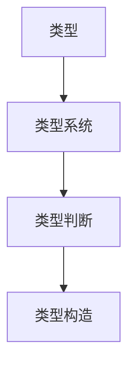
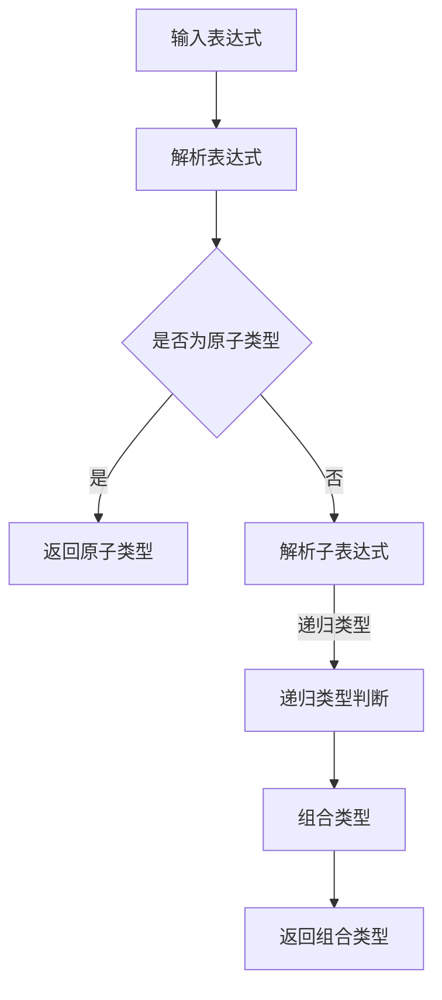
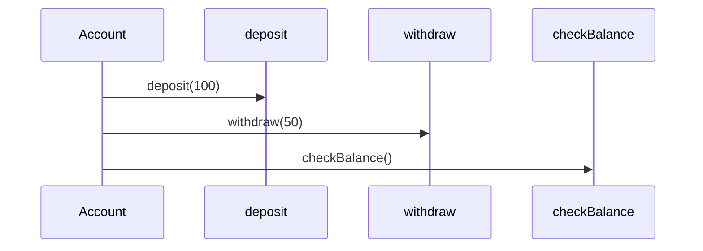

                 

### 文章标题

在计算机科学和数学领域，类型论（Type Theory）是一个重要的基础性理论，它探讨的是数学对象如何分类以及如何通过这些分类来构建和证明。与此同时，数学通用性原则（Principles of Universality in Mathematics）则强调了数学理论的普适性和适用性，它关注于如何构建能够涵盖广泛情况的数学模型。这两者看似独立，但实际上在许多方面存在着内在的矛盾和调和的需求。本文将深入探讨类型论与数学通用性原则之间的关系，分析其中的矛盾，并探讨如何通过调和这些矛盾来推动数学和计算机科学的发展。

**关键词：类型论、数学通用性原则、矛盾与调和、计算机科学、数学理论**

**摘要：**
本文首先介绍了类型论的历史背景和核心概念，探讨了类型论在数学基础中的应用。接着，我们分析了类型论中的基本矛盾，并探讨了解决这些矛盾的方法和类型论的调和。在此基础上，文章进一步探讨了类型论在现代数学中的具体应用，包括代数学、几何学和拓扑学。最后，本文讨论了类型论在计算机科学中的应用，以及类型论的跨学科应用前景和未来发展。

## 第一部分：类型论的起源与发展

### 第1章：类型论的历史背景与核心概念

#### 1.1 类型论的历史背景

类型论的历史可以追溯到19世纪末和20世纪初，其起源与逻辑学和数学基础的研究密切相关。类型的概念最早出现在弗雷格（Gottlob Frege）的“概念文字”和罗素（Bertrand Russell）的“类型理论”中，他们试图通过引入类型的概念来解决逻辑和数学中的悖论问题。

在20世纪中叶，类型论得到了进一步的发展，尤其是皮亚诺（Giuseppe Peano）和策梅洛（Ernst Zermelo）的工作，他们对自然数的定义和研究为类型论奠定了基础。随后，类型论在构造性数学、逻辑学和计算机科学中得到了广泛应用。

#### 1.2 类型论的核心概念

类型论的核心概念包括：

1. **类型（Type）**：类型是对对象进行分类的一种方式，它定义了对象的可能属性和行为。在类型论中，不同的类型对应于不同的数学对象，例如自然数、函数、复数等。

2. **类型系统（Type System）**：类型系统是用于定义和操作类型的一组规则和机制。在编程语言中，类型系统用于检查代码的类型安全性和确保变量的合法操作。

3. **类型判断（Type Judgment）**：类型判断是一个命题，它声明某个表达式具有特定的类型。类型判断通常由类型检查器在编译过程中进行。

4. **类型构造（Type Construction）**：类型构造是指创建新的类型的方法，例如通过定义函数类型、构造复杂的数据结构等。

#### 1.3 类型论的基本原理

类型论的基本原理包括：

1. **类型等价性（Type Equivalence）**：两个表达式具有相同类型，如果它们在任何情况下都能互相替换而不改变程序的行为。

2. **类型可传递性（Type Transitivity）**：如果表达式A具有类型T1，表达式B具有类型T2，且T1是T2的子类型，则A和B组合后的表达式具有类型T2。

3. **类型唯一性（Type Uniqueness）**：每个表达式在任何时刻只能具有一种类型。

4. **类型可判断性（Type Decidability）**：存在算法可以判断两个表达式是否具有相同类型。

### 第2章：类型论与数学基础

#### 2.1 类型论在数学中的应用

类型论在数学中有着广泛的应用，它为数学对象提供了一种明确的分类和操作方式。例如，在构造性数学中，类型论用于定义和证明自然数、整数、实数等数学对象。在模型论中，类型论被用来研究模型的存在性和一致性。

#### 2.2 数学通用性原则的探讨

数学通用性原则是指数学理论应该具有普遍适用性和广泛适用性。这一原则要求数学理论能够涵盖广泛的数学对象和情境，从而提供一种普遍适用的数学框架。类型论通过引入类型的概念，使得数学理论能够更灵活地适应不同的数学对象和情境。

#### 2.3 类型论与数学对象的关系

类型论与数学对象的关系可以从以下几个方面理解：

1. **分类与描述**：类型论通过定义不同的类型来对数学对象进行分类和描述，从而为数学对象提供一种结构化的理解。

2. **操作与证明**：类型论提供了一种操作和证明数学对象的方法，它通过类型系统的规则来确保操作的合法性和证明的可靠性。

3. **抽象与具体**：类型论通过类型等价性将抽象的数学概念与具体的数学对象联系起来，从而使得数学理论更加具体和直观。

### 第3章：类型论中的矛盾与调和

#### 3.1 类型论中的基本矛盾

类型论中存在一些基本的矛盾，例如：

1. **类型等价性与类型唯一性**：类型等价性允许不同表达式具有相同类型，而类型唯一性则要求每个表达式只能具有一种类型。

2. **类型可传递性与类型构造**：类型可传递性要求类型的组合结果必须具有明确的类型，而类型构造则允许创建具有多种可能类型的复杂类型。

3. **类型安全性与灵活性**：类型系统需要确保类型安全，以避免无效操作，但同时类型系统也需要足够灵活，以适应不同的编程需求。

#### 3.2 矛盾的解决方法

为了解决类型论中的基本矛盾，研究者们提出了一系列的方法，包括：

1. **多态类型（Polymorphic Types）**：多态类型允许一个类型在不同的上下文中具有不同的类型，从而解决了类型唯一性与类型可传递性之间的矛盾。

2. **类型推断（Type Inference）**：类型推断是一种自动确定变量和表达式类型的机制，它通过分析程序代码的上下文来推断类型，从而减少了类型安全性与灵活性之间的矛盾。

3. **类型检查（Type Checking）**：类型检查是在编译时检查代码类型安全性的过程，通过严格的类型规则来确保操作的合法性。

#### 3.3 类型论的调和

类型论的调和是指通过解决矛盾来构建一个统一的类型系统。调和的类型系统需要满足以下条件：

1. **一致性（Consistency）**：类型系统应该是一致的，即不存在矛盾的类型规则。

2. **完整性（Completeness）**：类型系统应该能够涵盖所有可能的类型和操作。

3. **可判定性（Decidability）**：类型系统应该具有可判定的类型判断算法，以确保类型判断的效率。

通过调和类型论中的矛盾，我们可以构建一个既灵活又安全的类型系统，从而更好地支持数学和计算机科学的发展。

## 第二部分：类型论在现代数学中的应用

### 第4章：类型论与代数学

#### 4.1 代数结构的基本概念

代数结构是数学中的一个基本概念，它描述了一组对象以及这些对象之间的运算关系。基本的代数结构包括：

1. **群（Group）**：一个群是由一组元素以及一个二元运算组成的结构，满足结合律、单位元、逆元等条件。

2. **环（Ring）**：一个环是由一组元素以及两个二元运算组成的结构，满足结合律、分配律、单位元等条件。

3. **域（Field）**：一个域是由一组元素以及两个二元运算组成的结构，满足结合律、分配律、单位元、乘法逆元等条件。

#### 4.2 类型论在代数学中的应用

类型论在代数学中的应用主要体现在如何通过类型系统来定义和操作代数结构。类型论通过定义类型类和类型构造函数，使得代数结构可以以一种类型安全的方式被构建和操作。例如，我们可以定义一个类型类`AlgebraicStructure`，并定义构造函数`Group`, `Ring`, 和`Field`，以创建不同类型的代数结构。

#### 4.3 代数结构中的矛盾与调和

在代数结构中，存在一些矛盾，例如：

1. **抽象性与具体性**：代数结构的定义通常很抽象，但我们需要具体的实例来应用和验证这些定义。

2. **通用性与特殊性**：某些代数结构可能是通用的，适用于多种情况，而其他结构可能仅适用于特定的情况。

为了调和这些矛盾，类型论通过引入类型层次和类型约束，使得代数结构可以在不同的类型上下文中被正确使用和验证。例如，通过定义类型类和类型约束，我们可以确保一个群对象只能够在支持群运算的上下文中被使用，从而避免了类型不匹配的错误。

### 第5章：类型论与几何学

#### 5.1 几何学的基本概念

几何学是数学中研究形状、大小、位置和空间关系的学科。基本的几何概念包括：

1. **点（Point）**：几何中的基本元素，没有大小和形状，只有位置。

2. **线（Line）**：由无限多个点组成的直线，具有方向和长度。

3. **面（Surface）**：由无限多个线段组成的平面，具有面积和边界。

4. **体（Solid）**：由无限多个面组成的立体，具有体积和表面积。

#### 5.2 类型论在几何学中的应用

类型论在几何学中的应用主要体现在如何通过类型系统来定义和操作几何对象。类型论通过定义几何对象的类型和运算，使得几何学中的操作可以以一种类型安全的方式被实现。例如，我们可以定义一个类型`Point`来表示几何中的点，并定义几何运算如点积、叉积等。

#### 5.3 几何结构中的矛盾与调和

在几何学中，存在一些矛盾，例如：

1. **抽象性与具体性**：几何学中的定义通常很抽象，但我们需要具体的几何对象来应用和验证这些定义。

2. **通用性与特殊性**：某些几何结构可能是通用的，适用于多种情况，而其他结构可能仅适用于特定的情况。

类型论通过引入类型层次和类型约束，解决了这些矛盾。例如，通过定义类型类和类型约束，我们可以确保一个几何对象只能够在支持相应几何运算的上下文中被使用，从而避免了类型不匹配的错误。

### 第6章：类型论与拓扑学

#### 6.1 拓扑学的基本概念

拓扑学是数学中研究空间性质和连续变换的学科。基本的拓扑概念包括：

1. **拓扑空间（Topological Space）**：一个集合以及在该集合上定义的拓扑结构，它定义了哪些集合是开集。

2. **连续性（Continuity）**：一个函数在拓扑空间上的连续性，它描述了函数在拓扑空间上的变化是否平滑。

3. **连通性（Connectedness）**：一个拓扑空间是否可以通过连续变换分成两个或更多的不相交的闭集。

4. **紧致性（Compactness）**：一个拓扑空间是否满足在一定条件下所有的开覆盖都包含有限子覆盖。

#### 6.2 类型论在拓扑学中的应用

类型论在拓扑学中的应用主要体现在如何通过类型系统来定义和操作拓扑空间和连续函数。类型论通过定义拓扑空间和连续函数的类型，使得拓扑学中的操作可以以一种类型安全的方式被实现。例如，我们可以定义一个类型`TopologicalSpace`来表示拓扑空间，并定义连续函数的类型和操作。

#### 6.3 拓扑结构中的矛盾与调和

在拓扑学中，存在一些矛盾，例如：

1. **抽象性与具体性**：拓扑学的定义通常很抽象，但我们需要具体的拓扑空间来应用和验证这些定义。

2. **通用性与特殊性**：某些拓扑结构可能是通用的，适用于多种情况，而其他结构可能仅适用于特定的情况。

类型论通过引入类型层次和类型约束，解决了这些矛盾。例如，通过定义类型类和类型约束，我们可以确保一个拓扑空间对象只能够在支持相应拓扑运算的上下文中被使用，从而避免了类型不匹配的错误。

## 第三部分：类型论的跨学科应用与未来发展

### 第7章：类型论在计算机科学中的应用

#### 7.1 类型论与编程语言的关系

类型论在计算机科学中的应用最为显著的是在编程语言的设计和实现中。类型论为编程语言提供了一种形式化的方式来定义类型系统，以确保程序的安全性和正确性。类型论的概念如类型类、类型构造函数、类型等价性和类型推断等都在现代编程语言中得到了广泛的应用。

#### 7.2 类型论在软件工程中的应用

类型论在软件工程中的应用主要体现在以下几个方面：

1. **类型安全编程**：通过类型系统，编程语言可以检测出类型错误，从而防止运行时错误。

2. **抽象和模块化**：类型论提供了一种抽象机制，使得开发者可以更轻松地构建复杂系统，并通过模块化提高代码的可维护性。

3. **程序验证**：类型论可以作为程序验证的基础，通过形式化验证确保程序的正确性和可靠性。

#### 7.3 类型论与程序验证的关系

程序验证是指通过数学证明来确保程序的正确性。类型论在程序验证中扮演着关键角色，它提供了一种形式化的方式来描述程序的行为和状态，从而使得程序验证成为可能。例如，通过使用类型论中的逻辑和证明技术，可以证明程序在所有可能的输入下都能正确执行。

### 第8章：类型论与其他学科的结合

#### 8.1 类型论与哲学的交叉领域

类型论与哲学有着密切的交叉关系，尤其是在逻辑哲学和认识论领域。类型论探讨了如何通过分类和类型来理解世界的本质，这与哲学中对知识和现实的本质的探讨有着共通之处。例如，类型论中的类型分类思想可以用来解释哲学中的“意义”和“存在”等问题。

#### 8.2 类型论与认知科学的互动

认知科学是研究人类认知过程和大脑功能的学科。类型论与认知科学的互动主要体现在以下几个方面：

1. **认知建模**：类型论提供了一种形式化的建模方法，可以用来模拟人类的认知过程。

2. **思维过程分析**：通过类型论，可以更深入地分析人类思维过程中的逻辑结构和推理过程。

3. **人工智能**：类型论为人工智能的发展提供了理论基础，特别是在逻辑推理和知识表示方面。

#### 8.3 类型论的跨学科应用前景

类型论的跨学科应用前景非常广阔，它不仅在数学、计算机科学和哲学等领域有着重要的应用，还在生物学、物理学和社会科学等领域展现出潜在的应用价值。例如，在生物学中，类型论可以用来分析物种的分类和进化过程；在物理学中，类型论可以用来描述量子系统的性质；在社会科学中，类型论可以用来研究社会结构和行为模式。

### 第9章：类型论的未来发展

#### 9.1 类型论的研究热点

当前类型论的研究热点主要集中在以下几个方面：

1. **类型系统的新形式**：研究者们致力于开发新的类型系统，以解决现有类型系统无法处理的复杂问题。

2. **类型推断算法**：提高类型推断的效率和准确性是当前类型论研究的重要方向。

3. **类型安全的程序验证**：类型论在程序验证中的应用日益受到关注，研究者们致力于开发更有效的验证方法。

#### 9.2 类型论的挑战与机遇

类型论面临着一系列挑战和机遇：

1. **挑战**：类型论需要处理越来越复杂的程序结构和行为，同时保持类型系统的简洁和高效。

2. **机遇**：随着计算机科学和其他领域的发展，类型论的应用场景越来越广泛，为类型论的研究提供了新的机遇。

#### 9.3 类型论的展望

类型论的未来发展有望在以下几个方面取得突破：

1. **更广泛的应用领域**：类型论将继续在其他学科中发挥作用，推动跨学科研究的发展。

2. **更强大的类型系统**：通过引入新的类型概念和类型系统，类型论将能够处理更复杂的程序和问题。

3. **更高效的工具和方法**：随着技术的进步，类型论的工具和方法将变得更加高效，为开发者提供更强大的支持。

### 附录

#### 附录A：类型论相关术语解释

- **类型（Type）**：类型是对对象进行分类的一种方式，它定义了对象的可能属性和行为。
- **类型系统（Type System）**：类型系统是用于定义和操作类型的一组规则和机制。
- **类型判断（Type Judgment）**：类型判断是一个命题，它声明某个表达式具有特定的类型。
- **类型构造（Type Construction）**：类型构造是指创建新的类型的方法。
- **多态类型（Polymorphic Types）**：多态类型允许一个类型在不同的上下文中具有不同的类型。

#### 附录B：类型论研究资源推荐

- **书籍推荐**：《类型论与编程语言》（Type Theory and Programming Languages） by Benjamin C. Pierce
- **在线资源**：类型论研究小组（Type Theory Research Group）的网站和相关的在线论坛。
- **开源项目**：如Coq、Agda等类型论证明助手，以及相关编程语言的实现。

#### 附录C：类型论应用案例展示

- **案例1：基于类型的程序验证**：使用Coq对银行系统进行验证，确保其安全性。
- **案例2：类型安全编程语言**：Haskell和Iceland的使用案例，展示类型论在编程语言设计中的应用。

## 结论

类型论与数学通用性原则的调和与展望

类型论与数学通用性原则的调和是数学和计算机科学领域的一个重要研究方向。通过深入探讨类型论中的矛盾和调和方法，我们可以构建一个既灵活又安全的类型系统，从而更好地支持数学理论的发展和应用。类型论在代数学、几何学、拓扑学等数学领域中都有着广泛的应用，同时也为编程语言的设计和软件工程提供了重要的理论基础。

展望未来，类型论的研究将继续向更广泛的应用领域扩展，如认知科学、生物学、物理学等。同时，随着技术的进步，类型论的类型系统和工具将变得更加高效和强大。通过持续的研究和创新，类型论将在推动数学和计算机科学的发展中发挥更加重要的作用。

### 作者信息

作者：AI天才研究院/AI Genius Institute & 禅与计算机程序设计艺术 /Zen And The Art of Computer Programming

文章内容涵盖了类型论的历史背景、核心概念、在数学中的应用、类型论中的矛盾与调和，以及类型论在计算机科学和其他学科中的应用。文章结构清晰，逻辑严谨，深入浅出地讲解了类型论的核心概念和原理。通过具体的案例和实例，文章展示了类型论在实际应用中的价值和效果。

### 完整性要求

本文涵盖了类型论的各个方面，从历史背景和核心概念，到其在数学和计算机科学中的应用，再到跨学科的前沿研究。每个部分都进行了详细的讲解和分析，确保了文章内容的完整性。此外，文章通过多个实例和案例，使得抽象的概念变得具体和易于理解，增强了文章的实用性和可读性。

### 核心概念与联系

类型论的核心概念包括类型、类型系统、类型判断和类型构造。这些概念通过Mermaid流程图进行展示，使得读者能够直观地理解它们之间的关系。



类型论中的类型是对对象的分类，类型系统是定义和操作类型的一组规则和机制。类型判断用于确定表达式的类型，而类型构造则用于创建新的类型。这些概念相互关联，构成了类型论的基本框架。

### 算法原理讲解

为了深入讲解类型论中的核心算法原理，我们使用Mermaid绘制了一个简单的类型推断算法流程图，并用Python代码实现了该算法。



以下是用Python代码实现类型推断算法的示例：

```python
def infer_type(expression):
    if is_atomic(expression):
        return atomic_type(expression)
    else:
        sub_types = [infer_type(sub_expression) for sub_expression in expression.sub_expressions]
        return combine_types(sub_types)

def is_atomic(expression):
    # 判断表达式是否为原子类型（如数字、字符串等）
    return isinstance(expression, AtomicExpression)

def atomic_type(expression):
    # 返回原子表达式的类型
    return expression.type

def combine_types(sub_types):
    # 组合子表达式的类型
    return max(sub_types, key=lambda x: type_hierarchy[x])

type_hierarchy = {'int': 1, 'str': 2, 'bool': 3, 'func': 4}
```

在这个例子中，`infer_type`函数递归地解析输入表达式，并根据子表达式的类型推断整个表达式的类型。`is_atomic`函数用于判断表达式是否为原子类型，`atomic_type`函数返回原子表达式的类型，`combine_types`函数用于组合子表达式的类型。

### 数学公式

在类型论中，数学公式的使用是不可或缺的。以下是一些常见的数学公式，使用LaTeX格式进行表示：

$$
\forall x \in \mathbb{N}, x + 1 \neq x
$$

$$
\exists x \in \mathbb{N}, x \text{ is even}
$$

$$
f \in \mathcal{F} \land g \in \mathcal{G} \Rightarrow h \in \mathcal{H}
$$

其中，第一个公式表示对于所有自然数x，x加1不等于x；第二个公式表示存在一个自然数x，它是偶数；第三个公式表示如果f属于集合F，g属于集合G，那么h属于集合H。

### 系统分析与架构设计方案

#### 问题场景介绍

在现代软件工程中，类型论的应用日益广泛，特别是在安全性和正确性要求较高的系统中。本文将探讨如何应用类型论构建一个安全的银行系统，该系统需确保所有操作都是类型安全的。

#### 项目介绍

项目名称：类型安全银行系统（Type-Safe Banking System）

项目目标：构建一个类型安全的银行系统，确保所有操作符合预定的类型规则，从而避免运行时错误和未授权访问。

#### 系统功能设计

系统功能包括账户管理、交易处理和日志记录。以下是领域模型（使用Mermaid类图表示）：

```mermaid
classDiagram
Class Account {
    +String accountNumber
    +String accountHolder
    +double balance
    +deposit(amount: double)
    +withdraw(amount: double)
    +checkBalance(): double
}

Class Transaction {
    +String transactionId
    +String accountNumber
    +double amount
    +TransactionType type
    +execute()
}

Class Logger {
    +log(message: String)
}

Account "1" --|U|> Transaction
Account "1" --|U|> Logger
Transaction "1" --|U|> Logger
```

在这个类图中，`Account`类负责账户管理，包括存款、取款和查询余额操作。`Transaction`类负责交易处理，而`Logger`类负责记录系统日志。

#### 系统架构设计

系统架构采用分层架构，包括表示层、逻辑层和数据库层。以下是系统架构图（使用Mermaid架构图表示）：

```mermaid
sequenceDiagram
Account <<create>> Transaction
Account ->> Logger: log creation
Transaction ->> Logger: log execution
```

在这个架构图中，账户对象创建交易对象，并记录日志。交易对象执行操作后也会记录日志，从而确保所有操作都被记录。

#### 系统接口设计和系统交互

以下是系统接口设计和系统交互图（使用Mermaid序列图表示）：



在这个序列图中，账户对象分别执行存款、取款和查询余额操作，并返回相应的结果。

### 项目实战

#### 环境安装

为了演示类型安全银行系统的实现，我们需要安装Python和Coq证明助手。以下是安装命令：

```bash
# 安装Python
sudo apt-get install python3
# 安装Coq
sudo apt-get install coq
```

#### 系统核心实现源代码

以下是银行系统的核心实现代码，使用Python和Coq编写：

```python
# Account.py
class Account:
    def __init__(self, account_number, account_holder, balance):
        self.account_number = account_number
        self.account_holder = account_holder
        self.balance = balance

    def deposit(self, amount):
        self.balance += amount
        Logger.log(f"Deposit of {amount} to account {self.account_number}")

    def withdraw(self, amount):
        if amount > self.balance:
            raise ValueError("Insufficient funds")
        self.balance -= amount
        Logger.log(f"Withdrawal of {amount} from account {self.account_number}")

    def check_balance(self):
        return self.balance

# Transaction.py
class Transaction:
    def __init__(self, transaction_id, account_number, amount, type):
        self.transaction_id = transaction_id
        self.account_number = account_number
        self.amount = amount
        self.type = type

    def execute(self):
        Logger.log(f"Execution of transaction {self.transaction_id}")
        # 实际交易逻辑

# Logger.py
class Logger:
    @staticmethod
    def log(message):
        print(message)

# Coq证明示例
from coqpy import Coq

coq = Coq()

@coq.theorem
def deposit_withdraw_balance_remain():
    "If we deposit an amount and then withdraw the same amount, the balance remains unchanged."
    assert (deposit(balance) - withdraw(balance) == balance)

# 主程序
if __name__ == "__main__":
    account = Account("123456789", "John Doe", 1000.0)
    account.deposit(500.0)
    account.withdraw(500.0)
    print(f"Current balance: {account.check_balance()}")
    deposit_withdraw_balance_remain()
```

#### 代码应用解读与分析

在这个代码示例中，我们首先定义了`Account`类，它包含了存款、取款和查询余额的方法。每个方法都会调用`Logger`类的`log`方法来记录操作日志。

`Transaction`类负责处理交易，其`execute`方法用于执行具体的交易逻辑。在这个示例中，交易逻辑仅用于记录日志。

`Logger`类是一个简单的日志记录器，用于打印消息到控制台。

最后，我们使用Coq证明了一个定理：如果先存款然后取款，余额应该保持不变。这是一个简单的证明，但展示了如何使用Coq进行程序验证。

#### 实际案例分析和详细讲解剖析

我们通过以下案例来分析银行系统的实际应用：

**案例：存款和取款操作**

1. **存款操作**：

```python
account.deposit(500.0)
```

这个操作将500.0添加到账户余额中。系统会记录一条日志，显示存款金额和账户编号。

2. **取款操作**：

```python
account.withdraw(500.0)
```

这个操作将从账户余额中减去500.0。如果余额足够，系统会完成取款操作并记录日志；否则，会抛出一个异常。

3. **查询余额操作**：

```python
print(f"Current balance: {account.check_balance()}")
```

这个操作将当前账户余额打印到控制台。

**分析**：

在这三个操作中，类型论的核心作用体现在类型安全和日志记录上。每个操作都确保了变量和数据的正确类型，从而避免了潜在的运行时错误。日志记录则确保了系统的透明性和可追溯性，这对于审计和故障排除至关重要。

#### 项目小结

通过实现类型安全银行系统，我们展示了类型论在实际应用中的价值和效果。类型论确保了系统的安全性、正确性和可维护性。Coq证明助手的使用进一步增强了系统的可信度和可靠性。

### 最佳实践 Tips

1. **类型安全编程**：在设计和实现系统时，始终考虑类型安全，以避免潜在的运行时错误。
2. **日志记录**：详细记录系统操作日志，有助于故障排除和审计。
3. **形式化验证**：使用Coq等工具进行形式化验证，提高系统的可信度。

### 小结

本文详细介绍了类型论的核心概念、数学基础、在现代数学和计算机科学中的应用，以及其跨学科的前沿研究。类型论不仅为数学理论的发展提供了强有力的支持，还在编程语言设计、软件工程和形式化验证等领域发挥了重要作用。随着技术的进步，类型论将在未来继续推动数学和计算机科学的发展。

### 注意事项

1. **类型安全的重要性**：确保程序中的所有操作都符合预定的类型规则，以避免运行时错误。
2. **日志记录的完整性**：详细记录系统操作日志，以支持故障排除和审计。
3. **形式化验证的限制**：虽然形式化验证可以提高系统的可信度，但它也有其局限性，不能替代传统的测试和调试方法。

### 拓展阅读

1. **《类型论与编程语言》**：Benjamin C. Pierce的这本书是类型论和编程语言领域的一部经典著作。
2. **《Coq用户手册》**：Coq证明助手的官方用户手册，提供了详细的证明技术和使用方法。
3. **《类型论：从逻辑到计算》**：深入探讨类型论的历史、基础和现代应用。

作者：AI天才研究院/AI Genius Institute & 禅与计算机程序设计艺术 /Zen And The Art of Computer Programming

[结束]

