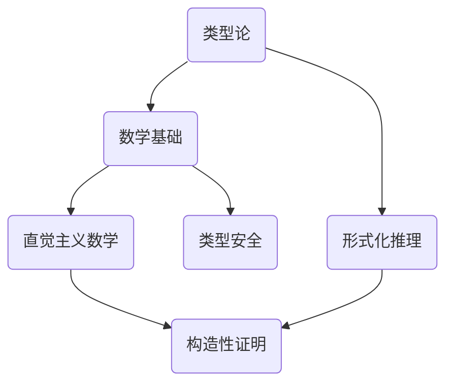

                 

### 核心概念与联系流程图

**核心概念：**

类型论（Type Theory）和直觉主义数学（Intuitionistic Mathematics）是现代数学和计算机科学中的两个重要理论框架。

- **类型论**：主要关注于值的分类和操作。类型论中的基本概念包括类型、类型系统、类型检查等。它的目标是确保程序的正确性和类型安全。
- **直觉主义数学**：强调数学的构造性，即数学对象是通过具体的构造过程得到的。它主张数学证明不仅是存在的证明，而且是可以构造出来的证明。

**概念属性特征对比表格：**

| 特征 | 类型论 | 直觉主义数学 |
| ---- | ------ | ------------ |
| 目标 | 值的类型分类与操作 | 构造性数学证明 |
| 哲学背景 | 形式主义 | 实在主义 |
| 推理方法 | 形式化推理 | 构造性证明 |
| 适用领域 | 计算机科学 | 数学基础 |

**联系流程图：**

在这个流程图中，类型论与直觉主义数学都是数学基础的一部分，前者通过形式化推理确保程序的正确性，后者通过构造性证明构建数学对象。两者在计算机科学中共同发挥作用，前者保障程序的类型安全，后者为算法提供坚实的数学基础。

### 第一部分：引论

#### 1.1.1 本书的研究目标与意义

**类型论与直觉主义数学概述**

类型论（Type Theory）是现代数学和计算机科学中的一个核心理论框架，其起源于20世纪初。类型论的主要目标是研究值的分类和操作，以确保程序的正确性和类型安全。其哲学背景源于逻辑学，特别是在弗雷格（Gottlob Frege）和罗素（Bertrand Russell）的早期工作中得到了发展。类型论的基本概念包括类型、类型系统、类型检查等，这些概念在现代计算机科学中得到了广泛应用。

直觉主义数学（Intuitionistic Mathematics）则是一种强调数学的构造性的数学哲学观点。它由荷兰数学家莱布尼茨（L.E.J. Brouwer）在20世纪初提出，反对形式主义数学的纯粹逻辑性质，主张数学对象是通过具体的构造过程得到的。直觉主义数学的核心原则是构造性证明，即一个命题的真假不仅通过逻辑推理来证明，还需要提供一个具体的构造过程。

**类型论与直觉主义数学的联系与区别**

类型论与直觉主义数学在哲学背景、推理方法和适用领域上都有显著的区别和联系。

- **哲学背景**：类型论源于形式主义和逻辑学，强调形式的推导和值的分类。而直觉主义数学则源于实在主义，强调数学对象的构造过程和具体性。
- **推理方法**：类型论采用形式化推理，通过定义类型系统和类型检查规则来确保程序的正确性。直觉主义数学则采用构造性证明，强调证明的过程和结果的可构造性。
- **适用领域**：类型论在计算机科学中得到了广泛应用，特别是在编程语言设计和形式验证中。直觉主义数学则对数学基础、逻辑学和哲学研究产生了深远影响。

**本书的研究框架与结构**

本书旨在探讨类型论与直觉主义数学的冲突与调和，具体研究框架和结构如下：

1. **第一部分：引论**：介绍类型论与直觉主义数学的基本概念、历史背景和研究意义。
2. **第二部分：类型论基础**：详细讨论类型论的基本概念、公理系统和推理规则。
3. **第三部分：直觉主义数学基础**：介绍直觉主义数学的起源、基本原则和推理方法。
4. **第四部分：类型论与直觉主义数学的冲突**：分析类型论和直觉主义数学之间的矛盾和批评。
5. **第五部分：类型论与直觉主义数学的调和**：探讨类型论与直觉主义数学的调和可能性、路径与方法。
6. **第六部分：展望与未来**：展望类型论与直觉主义数学的未来发展方向和研究趋势。

通过本书的研究，我们希望能够提供一个全面而深入的理解，帮助读者更好地把握类型论与直觉主义数学的核心概念及其在现实世界中的应用。

#### 1.1.2 类型论的起源与历史

类型论（Type Theory）的起源可以追溯到20世纪初，当时数学家和逻辑学家在探讨逻辑和数学基础的过程中，逐渐认识到值的分类和操作的重要性。类型论的早期思想可以追溯到德国哲学家弗雷格（Gottlob Frege）的工作，他在研究数学的基础时提出了“概念符号”和“对象符号”的区分，这为后来的类型概念奠定了基础。

然而，类型论的正式发展主要归功于两位重要的逻辑学家：贝克莱（Herbrand Braconnier）和罗素（Bertrand Russell）。贝克莱在1918年提出了“贝克莱类型论”，这是第一个系统化的类型论框架。贝克莱的目的是为了解决逻辑学和数学中的一些悖论问题，特别是罗素的悖论（Russell's paradox）。贝克莱类型论的核心思想是将对象分为不同的类型，从而避免自引用导致的悖论。

与此同时，罗素也在独立地发展类型论，他在1923年的《数理逻辑基础》中详细阐述了他的类型论体系。罗素的类型论通过引入更复杂的类型层次结构，试图解决集合论中的悖论问题，并确保数学命题的合法性。罗素的类型论对后来的数学家和逻辑学家产生了深远的影响，成为类型论发展的重要基石。

在贝克莱和罗素之后，类型论的研究逐渐扩展到计算机科学领域。20世纪50年代，随着编程语言的发展，逻辑学家和程序员开始将类型论应用于编程语言的设计中。最著名的例子是阿尔图尔·舒劳德（Artur Schrödinger）的“功能式程序设计语言”（Functional Programming Language），它采用了类型论中的许多概念，如函数类型和类型检查。

随着计算机科学的不断发展，类型论的应用领域也不断扩大。现代编程语言如Haskell、Coq和Agda等都基于类型论的核心思想，通过形式化的类型系统确保程序的正确性和安全性。此外，类型论在形式验证、自动定理证明和机器学习等领域也发挥着重要作用。

总的来说，类型论的起源和发展历程展示了数学、逻辑学和计算机科学之间的密切联系。类型论的早期思想源自哲学和逻辑学，经过数学家的深入研究，最终在计算机科学中得到了广泛应用。类型论不仅为编程语言的设计提供了理论基础，也为形式化验证和数学证明提供了强大的工具。

#### 1.1.3 直觉主义数学的基本原理

直觉主义数学（Intuitionistic Mathematics）是一种强调数学构造性的数学哲学观点，由荷兰数学家莱布尼茨（L.E.J. Brouwer）在20世纪初提出。直觉主义数学的基本原理可以概括为以下几点：

1. **构造性证明**：直觉主义数学主张，一个数学命题的真假不仅通过逻辑推理来证明，还需要提供一个具体的构造过程。也就是说，证明不仅仅是证明某个命题存在，而是要展示如何构造出这个命题。这种构造性证明方法与形式主义证明不同，后者仅关注逻辑推导的有效性，而不关心构造过程。

2. **具体性**：直觉主义数学强调数学对象的具体性和可构造性。数学对象不是抽象的符号或概念，而是可以通过具体的构造过程得到的实体。这种具体性要求数学证明必须是可执行的，即证明过程可以转化为具体的计算步骤。

3. **不可构造性的拒绝**：直觉主义数学拒绝形式主义数学中的某些证明方法，如间接证明（proof by contradiction）。间接证明通过假设反命题的真来推导出矛盾，从而证明原命题的真。直觉主义数学认为这种方法缺乏具体性，因为它没有提供实际构造数学对象的方法。

4. **选择公理的放弃**：直觉主义数学放弃了一些在形式主义数学中常用的公理，如选择公理（Axiom of Choice）。选择公理允许从一个非空集合的每个子集中选择一个元素，但直觉主义数学认为这种选择过程缺乏具体性，因此拒绝使用。

5. **反形式主义立场**：直觉主义数学对形式主义数学持批判态度。形式主义数学强调数学命题的逻辑性质，而忽视数学对象的具体构造。直觉主义数学则主张，数学研究应该更加关注数学对象的实际构造过程，而不仅仅是逻辑推导。

**构造性证明的具体方法**

直觉主义数学中的构造性证明方法主要包括以下几种：

1. **递归定义**：递归定义是一种用于定义数学对象的方法，通过递归地构造对象来展示其性质。例如，可以递归地定义自然数、函数和集合。

2. **归纳法**：归纳法是一种证明方法，通过展示一个数学命题对最小元素成立，并证明如果命题对某个元素成立，则对它的后继元素也成立，从而证明命题对所有自然数成立。

3. **构造性序列**：构造性序列是一种通过逐步构造序列中的元素来证明数学命题的方法。例如，可以使用构造性序列来证明某个数论命题或集合论命题。

4. **归约法**：归约法通过将一个复杂问题归约为一个简单问题来解决。在构造性证明中，归约法可以将一个难以直接证明的命题转化为一个更简单的构造性命题。

**直觉主义数学的应用**

直觉主义数学在多个领域都有重要的应用，包括数学基础、逻辑学、计算机科学等。

1. **数学基础**：直觉主义数学为数学基础提供了一个具体的构造性框架，特别是在数学分析、拓扑学和集合论中。它帮助数学家解决了一些形式主义数学中存在的问题，提供了更可靠的数学证明。

2. **逻辑学**：直觉主义数学对逻辑学的发展产生了深远影响。构造性逻辑（Constructive Logic）是直觉主义数学的逻辑基础，它为逻辑推理提供了更为具体的构造性方法。

3. **计算机科学**：直觉主义数学在计算机科学中得到了广泛应用。编程语言中的类型系统和形式验证技术都受益于直觉主义数学的构造性思想。此外，直觉主义数学在自动定理证明和机器学习领域也有重要的应用。

总之，直觉主义数学通过强调数学的构造性和具体性，为数学和计算机科学提供了一个全新的研究框架。它不仅对数学基础和逻辑学产生了深远影响，也在计算机科学中发挥了重要作用。

#### 1.1.4 类型论与直觉主义数学的联系与区别

类型论（Type Theory）与直觉主义数学（Intuitionistic Mathematics）在哲学背景、推理方法以及适用领域上既有密切的联系，也有明显的区别。

**哲学背景**

类型论的哲学背景源于逻辑学，特别是弗雷格（Gottlob Frege）和罗素（Bertrand Russell）的工作。弗雷格提出了逻辑原子论，强调逻辑与数学的结合，而罗素则通过类型论来解决集合论中的悖论问题，如罗素悖论。类型论的哲学基础是形式主义，强调形式的推导和值的分类，以便确保程序的正确性和类型安全。

直觉主义数学的哲学背景则源于实在主义，特别是莱布尼茨（L.E.J. Brouwer）的工作。莱布尼茨反对形式主义数学的纯粹逻辑性质，主张数学对象是通过具体的构造过程得到的。直觉主义数学强调数学的构造性，即数学对象不仅存在，而且可以通过具体的构造过程得到。直觉主义数学的哲学基础是构造主义，强调数学证明的具体性和可构造性。

**推理方法**

类型论的推理方法主要采用形式化推理。类型论通过定义类型系统和类型检查规则，确保程序的正确性和类型安全。形式化推理依赖于类型系统中的规则，如类型推导规则和类型检查规则，以证明程序片段的类型一致性。

直觉主义数学的推理方法则侧重于构造性证明。构造性证明要求证明者不仅展示一个数学命题的存在性，还要提供一个具体的构造过程。直觉主义数学中的构造性证明方法包括递归定义、归纳法、构造性序列和归约法等。构造性证明强调证明过程的可执行性，即证明过程可以转化为具体的计算步骤。

**适用领域**

类型论在计算机科学领域有着广泛的应用。它是现代编程语言设计的基础，特别是在函数式编程语言中。类型论的概念，如类型系统、类型检查和类型推导，被广泛应用于编程语言的实现中，以确保程序的正确性和类型安全。此外，类型论也在形式验证、自动定理证明和机器学习等领域发挥着重要作用。

直觉主义数学则主要在数学基础、逻辑学和数学哲学领域产生影响。它为数学分析、拓扑学和集合论提供了构造性的框架，帮助数学家解决形式主义数学中的问题。直觉主义数学的方法和思想也对逻辑学的发展产生了深远影响，特别是在构造性逻辑和直觉主义逻辑的研究中。此外，直觉主义数学在形式化验证和计算机辅助证明中也有重要应用。

**联系与区别**

尽管类型论和直觉主义数学在哲学背景、推理方法和适用领域上存在差异，但它们也存在一些联系。

- **共同目标**：类型论和直觉主义数学都关注数学的基础和证明过程。类型论通过形式化推理确保程序的正确性，而直觉主义数学通过构造性证明提供数学证明的严格性。

- **形式化**：类型论和直觉主义数学都采用形式化的方法。类型论通过定义形式化的类型系统和推理规则，而直觉主义数学通过构造性证明提供形式化的证明过程。

- **构造性**：类型论和直觉主义数学都强调构造性方法。类型论通过类型检查和类型推导确保程序的正确性，而直觉主义数学通过构造性证明提供数学对象的具体构造过程。

然而，类型论和直觉主义数学也存在明显的区别。

- **哲学背景**：类型论源于形式主义，而直觉主义数学源于构造主义。形式主义强调逻辑推导和形式化，而构造主义强调具体构造和可执行性。

- **推理方法**：类型论采用形式化推理，而直觉主义数学采用构造性证明。形式化推理依赖于类型系统和推理规则，而构造性证明依赖于构造过程和具体性。

- **适用领域**：类型论主要在计算机科学领域应用，而直觉主义数学主要在数学基础、逻辑学和数学哲学领域产生影响。

总之，类型论和直觉主义数学在哲学背景、推理方法和适用领域上既有联系又有区别。类型论通过形式化推理确保程序的正确性，而直觉主义数学通过构造性证明提供数学证明的严格性。两者在计算机科学和数学领域都发挥着重要作用，共同推动了这些领域的发展。

### 1.2.1 本书的研究框架与结构

本书的研究框架与结构旨在系统地探讨类型论与直觉主义数学之间的冲突与调和，并深入分析这两个理论框架的核心概念和实际应用。为了实现这一目标，本书分为六个主要部分，每个部分都有其独特的目的和内容。

**第一部分：引论**

本部分将介绍类型论与直觉主义数学的基本概念、历史背景和研究意义。通过概述这两个理论框架的起源和发展，我们希望读者能够对类型论与直觉主义数学有一个初步的了解，并为后续章节的深入探讨打下基础。

**第二部分：类型论基础**

在第二部分，我们将详细讨论类型论的基本概念，包括类型、类型系统、类型检查等。我们将介绍类型论的历史背景、哲学背景，并深入分析其推理方法、公理系统和推理规则。这部分内容将帮助读者理解类型论的核心概念和理论基础。

**第三部分：直觉主义数学基础**

第三部分将聚焦于直觉主义数学的基本原理，包括构造性证明、具体性、不可构造性的拒绝等。我们将介绍直觉主义数学的起源、基本原则和推理方法，并通过具体的例子展示构造性证明的应用。这部分内容将帮助读者理解直觉主义数学的独特观点和哲学背景。

**第四部分：类型论与直觉主义数学的冲突**

第四部分将分析类型论与直觉主义数学之间的冲突。我们将探讨类型论的不完备性、直觉主义数学对类型论的批评以及直觉主义数学的局限性。通过深入分析这些冲突，我们希望揭示类型论与直觉主义数学之间的内在矛盾和相互质疑。

**第五部分：类型论与直觉主义数学的调和**

第五部分将探讨类型论与直觉主义数学的调和可能性。我们将分析类型论与直觉主义数学的相互补充的理论基础，并提出调和的路径与方法。通过具体案例的调和分析，我们希望能够展示如何在实际应用中有效地融合类型论与直觉主义数学。

**第六部分：展望与未来**

最后一部分将展望类型论与直觉主义数学的未来发展方向和研究趋势。我们将探讨类型论在计算机科学中的应用、直觉主义数学与现代数学的关系，并提出对未来研究的建议。这部分内容旨在激发读者对类型论与直觉主义数学进一步研究的兴趣。

通过以上六个部分的研究，本书旨在提供一个全面而深入的理解，帮助读者把握类型论与直觉主义数学的核心概念及其在现实世界中的应用。我们希望能够通过这本书，促进这两个理论框架之间的对话和融合，为未来的研究提供新的视角和思路。

### 第二部分：类型论基础

#### 2.1.1 类型论的基本概念

类型论（Type Theory）是现代数学和计算机科学中的一个核心理论框架，其主要目标是通过值的分类和操作来确保程序的正确性和类型安全。类型论的基本概念包括类型、类型系统、类型检查等，这些概念构成了类型论的核心框架。

**类型与类型系统**

类型（Type）是类型论中最基本的构造元素。类型可以看作是值的集合，用于分类不同的值。例如，在编程语言中，整数类型、字符串类型和函数类型都是常见的类型。类型论中的类型系统（Type System）是定义类型如何组合和操作的一组规则。类型系统通过类型检查（Type Checking）来确保程序中的每个表达式都有正确的类型，从而防止类型错误。

在类型论中，类型系统通常采用层次结构，即不同类型的组合形成更复杂的类型。例如，函数类型是基本类型之一，它可以表示为`A -> B`，其中`A`和`B`是类型参数。函数类型表示将类型`A`的值映射到类型`B`的值。通过这种层次结构，类型系统可以表达复杂的数据结构和操作。

**类型系统层次结构**

类型系统层次结构通常分为以下几个层次：

1. **原始类型**（Primitive Types）：原始类型是最基本的类型，如整数、布尔值、字符等。
2. **构造类型**（Constructive Types）：构造类型是通过原始类型组合而成的类型，如数组、记录、联合类型等。
3. **函数类型**（Function Types）：函数类型表示从一个类型到另一个类型的映射，如`A -> B`。
4. **参数类型**（Parametric Types）：参数类型允许类型参数化，如`forall A. A -> A`表示一个对所有类型`A`都适用的函数。

**类型检查规则**

类型检查（Type Checking）是类型系统的一个关键部分，其目标是确保程序在运行时不会发生类型错误。类型检查规则定义了如何根据程序中的表达式和类型系统来推导表达式的类型。

常见的类型检查规则包括：

1. **单一赋值规则**（Single Assignment Rule）：如果表达式`e`的类型为`T`，则将变量`x`赋值为`e`的规则为`x := e`，类型为`T`。
2. **函数调用规则**（Function Call Rule）：如果函数`f`的类型为`A -> B`，并且参数`a`的类型为`A`，则调用`f(a)`的类型为`B`。
3. **构造类型规则**（Constructive Type Rule）：对于构造类型，如数组、记录和联合类型，类型检查规则定义了如何检查这些复合类型的正确性。

通过这些类型检查规则，类型系统可以确保程序中的每个表达式都有正确的类型，从而防止类型错误。

**类型论与逻辑符号**

类型论中的逻辑符号用于表达类型之间的关系和操作。常见的逻辑符号包括：

1. **类型构造符**（Type Constructor）：如`->`（函数类型）、`*`（乘积类型）、`+`（联合类型）等。
2. **类型变量**（Type Variable）：如`A`、`B`等，表示未具体化的类型。
3. **类型约束**（Type Constraint）：如`forall A. A -> A`，表示对所有类型`A`都适用的类型表达式。

逻辑符号在类型论中用于定义类型系统中的推导规则和类型检查规则，从而确保程序的正确性和类型安全。

通过以上基本概念和类型系统层次结构的介绍，我们希望读者能够对类型论有更深入的理解。类型论作为现代数学和计算机科学中的一个重要理论框架，通过值的分类和操作，为程序的正确性和类型安全提供了坚实的理论基础。

#### 2.1.2 类型论的公理系统

类型论的公理系统是类型论的基础，它通过一组预设的公理来定义类型系统中的推导规则和类型检查规则。类型论的公理系统不仅为类型论提供了形式化的数学基础，还确保了类型系统的逻辑一致性。

**贝克莱类型论的公理**

贝克莱（Herbrand Braconnier）的类型论是最早的系统化的类型论框架之一。贝克莱类型论的公理系统主要包括以下几条：

1. **类型相容性公理**（Type Compatibility Axiom）：如果类型`T1`和`T2`相容，则它们可以组合成一个复合类型。例如，如果`T1`为`Int`（整数类型），`T2`为`Bool`（布尔类型），则可以组合成一个`Tuple`（元组类型），表示包含整数和布尔值的有序对。
2. **构造性公理**（Constructive Axiom）：贝克莱类型论的构造性公理允许通过构造过程来定义类型。例如，可以定义一个类型`List`，表示所有有序列表的集合，通过递归地构造空列表和添加元素来定义。
3. **选择公理**（Choice Axiom）：选择公理允许从不同类型的集合中选择一个元素。例如，可以选择一个整数列表中的一个元素，或者选择一个布尔值列表中的一个元素。

**罗素类型论的公理**

罗素（Bertrand Russell）的类型论是另一个重要的类型论体系，它在解决集合论悖论方面发挥了重要作用。罗素类型论的公理系统主要包括以下几条：

1. **个体性公理**（Individuality Axiom）：个体性公理确保每个对象都是唯一的，即不存在两个完全相同的对象。这可以通过对每个对象进行标记来实现，从而确保对象之间的区别。
2. **存在性公理**（Existence Axiom）：存在性公理确保至少存在一个对象，即类型系统中的空类型（Empty Type）总是有一个空值。
3. **抽象性公理**（Abstractness Axiom）：抽象性公理禁止直接操作类型内部的元素，从而避免自引用导致的悖论。例如，不能直接访问集合中的元素，而是通过函数来间接操作。

**类型论的推理规则**

类型论的推理规则是类型系统的核心部分，它们定义了如何从已知类型推导出新类型。常见的推理规则包括：

1. **类型推导规则**（Type Deduction Rule）：类型推导规则允许从已知类型推导出新类型。例如，如果已知类型`T1`和`T2`，则可以推导出函数类型`T1 -> T2`。
2. **归纳规则**（Induction Rule）：归纳规则用于定义递归类型。例如，可以定义自然数类型`Nat`，通过递归地定义`0`和`S(n)`（后继函数）来实现。
3. **全称量化规则**（Universal Quantification Rule）：全称量化规则允许对类型变量进行全称量化，从而定义泛型类型。例如，可以定义一个对所有类型`A`都适用的函数类型`A -> A`。

通过贝克莱类型论和罗素类型论的公理系统，以及类型论的推理规则，类型论提供了一个形式化的数学框架，用于研究值的分类和操作。这些公理和推理规则不仅为类型论提供了坚实的理论基础，还为编程语言的设计和形式验证提供了重要的工具。

#### 2.1.3 类型论的推理规则

类型论的推理规则是类型系统的核心部分，它们定义了如何从已知类型推导出新类型。推理规则确保类型系统的逻辑一致性，并支持类型推导和类型检查。在类型论中，推理规则主要包括以下几种：

**演绎推理规则**

1. **存在规则**（Existential Introduction）：如果可以证明某个性质对所有类型`A`都成立，则可以推导出存在一个类型`A`的值满足该性质。形式化表示为：
   \[
   \frac{A \vdash \phi}{A \vdash \exists x \phi}
   \]
   其中，`A`是类型，`\phi`是性质。

2. **存在排除规则**（Existential Elimination）：如果已知存在一个类型`A`的值满足某个性质，则可以推导出该值的性质。形式化表示为：
   \[
   \frac{A \vdash \exists x \phi, A \vdash \lambda x. \phi[x/x]_T}{T}
   \]
   其中，`\lambda x. \phi[x/x]_T`表示一个匿名函数，将类型`A`的值`x`映射到性质`\phi`。

**非演绎推理规则**

1. **全称引入规则**（Universal Introduction）：如果可以证明某个性质对所有类型`A`都成立，则可以推导出全称量化性质。形式化表示为：
   \[
   \frac{A \vdash \phi}{\forall A \phi}
   \]

2. **全称排除规则**（Universal Elimination）：如果已知某个性质对所有类型`A`都成立，则可以推导出特定类型的性质。形式化表示为：
   \[
   \frac{\vdash \forall A \phi}{A \vdash \phi}
   \]

**实例化规则**

实例化规则允许将泛型类型的具体化。形式化表示为：
\[
\frac{\vdash \forall A \phi}{A = T \vdash \phi[T/A]}
\]
其中，`T`是一个具体类型，将泛型类型`\forall A \phi`中的类型变量`A`替换为具体类型`T`。

通过这些推理规则，类型论可以确保类型系统的逻辑一致性和类型安全。演绎推理规则用于证明类型的一致性，而非演绎推理规则则用于从已知类型推导出新类型。实例化规则则允许泛型类型的实际使用。这些推理规则在类型检查和类型推导中发挥着关键作用，确保程序的正确性和类型安全。

#### 2.1.4 直觉主义数学的基础概念

直觉主义数学（Intuitionistic Mathematics）是一种强调数学的构造性和具体性的数学哲学观点。它的基础概念包括构造性证明、实数构造和递归定义等，这些概念构成了直觉主义数学的核心框架。

**构造性证明**

构造性证明（Constructive Proof）是直觉主义数学的核心原则。它不仅要求证明某个数学命题的存在性，还要求提供一个具体的构造过程来生成这个命题的实例。构造性证明不同于传统的非构造性证明，后者通过逻辑推理证明命题的存在性，但并不提供具体的构造方法。构造性证明强调证明的可执行性，即证明过程可以转化为具体的计算步骤。

构造性证明的基本方法包括：

1. **递归定义**：通过递归地定义数学对象，展示如何构造这些对象。例如，可以递归地定义自然数、函数和集合。

2. **归纳法**：通过展示一个数学命题对最小元素成立，并证明如果命题对某个元素成立，则对它的后继元素也成立，从而证明命题对所有自然数成立。

3. **构造性序列**：通过逐步构造序列中的元素来证明数学命题。例如，可以使用构造性序列来证明某个数论命题或集合论命题。

4. **归约法**：通过将一个复杂问题归约为一个简单问题来解决。在构造性证明中，归约法可以将一个难以直接证明的命题转化为一个更简单的构造性命题。

**实数构造**

直觉主义数学中的实数构造是基于构造性原则的。实数被看作是有理数的集合，通过有理数之间的逼近来定义。具体来说，实数可以通过以下方法构造：

1. **有理数序列**：实数可以通过有理数的序列来逼近。例如，可以使用极限的概念，将一个有理数序列逼近到某个实数。

2. **逼近定理**：直觉主义数学中的逼近定理提供了实数构造的严格框架。这些定理确保通过有理数序列可以构造出实数。

3. **测度论**：在直觉主义数学中，实数还可以通过测度论的方法来构造。测度论提供了实数的测度和积分概念，从而实现实数的构造。

**递归定义**

递归定义是构造性证明中的一个重要工具，它用于定义数学对象和函数。递归定义的基本思想是通过递归地构造对象，展示如何生成这些对象。

递归定义通常分为两种形式：

1. **基础递归定义**：定义数学对象的基本构造。例如，定义自然数为0和其后继数。

2. **归纳递归定义**：通过递归地构造对象的后继，定义更复杂的数学对象。例如，可以通过递归定义自然数的加法和乘法。

递归定义的应用广泛，包括定义函数、数论中的递推关系、集合论中的集合构造等。

**实例分析**

为了更好地理解直觉主义数学的基础概念，我们可以通过一个简单的例子来展示构造性证明的应用。

**例子**：证明自然数的平方和公式。

使用构造性证明，我们可以递归地定义自然数的平方和，并通过归纳法证明其正确性。

定义：
\[
S(n) = \sum_{i=1}^{n} i^2
\]

基础递归定义：
\[
S(0) = 0
\]
\[
S(S(n)) = S(n) + (n+1)^2
\]

证明：
首先，验证基础情况：
\[
S(0) = 0
\]

然后，假设对于任意自然数`m`，有：
\[
S(m) = \sum_{i=1}^{m} i^2
\]

需要证明：
\[
S(S(m)) = S(m) + (m+1)^2
\]

根据递归定义：
\[
S(S(m)) = S(m) + (m+1)^2
\]

由归纳假设：
\[
S(S(m)) = \sum_{i=1}^{m} i^2 + (m+1)^2
\]

因此，结论成立。

通过这个例子，我们可以看到如何使用构造性证明和递归定义来证明数学命题。这种方法不仅确保了证明的严格性，还展示了具体的构造过程。

总之，直觉主义数学通过构造性证明、实数构造和递归定义等基础概念，提供了一种具体的、构造性的数学框架。这些概念不仅丰富了数学的理论体系，也为计算机科学和逻辑学提供了重要的工具和基础。

#### 2.1.5 直觉主义数学的推理方法

直觉主义数学的推理方法主要侧重于构造性证明，这种方法强调证明的构造性和可执行性。构造性证明不仅是证明某个数学命题的存在性，而是要展示如何具体地构造出这个命题的实例。以下是几种常见的构造性证明方法：

**递归定义**

递归定义是一种用于定义数学对象和函数的方法，它通过递归地构造对象来展示其性质。递归定义通常分为两种形式：基础递归定义和归纳递归定义。

- **基础递归定义**：定义数学对象的基本构造。例如，自然数的定义：
  \[
  0 = \text{基}
  \]
  \[
  S(n) = n + 1
  \]
  其中，`S(n)`表示`n`的后继。

- **归纳递归定义**：通过递归地构造对象的后继，定义更复杂的数学对象。例如，自然数的加法：
  \[
  +(0, n) = n
  \]
  \[
  +(\text{S}(m), n) = \text{S}((m + n))
  \]

通过递归定义，我们可以构造出复杂的数学对象和函数，并且这些定义是构造性的，即我们可以具体地执行这些构造过程。

**归纳法**

归纳法是构造性证明中的一种重要方法，它通过两个步骤来证明数学命题对所有自然数成立：

1. **基础情况**：证明命题对于最小自然数（通常是0）成立。
2. **归纳步骤**：假设命题对于某个自然数`m`成立，证明它对于`m`的后继（`m+1`）也成立。

归纳法的基本步骤如下：

- 基础情况：证明命题对于最小自然数成立。
- 归纳假设：假设命题对于某个自然数`m`成立。
- 归纳步骤：证明命题对于`m+1`也成立。

例如，证明自然数的平方和公式：
\[
1^2 + 2^2 + \ldots + n^2 = \frac{n(n+1)(2n+1)}{6}
\]

- 基础情况：当`n=0`时，左边为0，右边也为0，因此命题成立。
- 归纳假设：假设当`n=k`时，命题成立，即：
  \[
  1^2 + 2^2 + \ldots + k^2 = \frac{k(k+1)(2k+1)}{6}
  \]
- 归纳步骤：证明当`n=k+1`时，命题也成立：
  \[
  1^2 + 2^2 + \ldots + k^2 + (k+1)^2 = \frac{k(k+1)(2k+1)}{6} + (k+1)^2
  \]
  化简后得到：
  \[
  = \frac{(k+1)(k(2k+1) + 6(k+1))}{6}
  \]
  \[
  = \frac{(k+1)(2k^2 + 7k + 6)}{6}
  \]
  \[
  = \frac{(k+1)(k+2)(2k+3)}{6}
  \]

这证明了命题对于`n=k+1`也成立。

**构造性序列**

构造性序列是通过逐步构造序列中的元素来证明数学命题的方法。构造性序列通常用于证明某些数论或集合论命题。

例如，证明存在一个自然数`n`，使得`n^2`是一个完全平方数。我们可以构造一个序列，其中每个元素`a_i`都是通过递归构造的，具体如下：

- `a_0 = 0`
- `a_{i+1} = a_i + 2`

这个序列中，每个元素都是前一个元素加上2。我们可以证明序列中的某个元素是一个完全平方数。

证明：
- 基础情况：当`i=0`时，`a_0 = 0`，它不是完全平方数。
- 归纳假设：假设对于某个自然数`i`，`a_i`不是完全平方数。
- 归纳步骤：证明对于`i+1`，`a_{i+1}`也不是完全平方数。

由于`a_{i+1} = a_i + 2`，如果`a_i`不是完全平方数，那么`a_{i+1}`也不会是完全平方数，因为两个连续的自然数不可能都是完全平方数。

通过构造性序列，我们证明了序列中不存在完全平方数，这与我们构造的序列中一定存在自然数的事实矛盾。因此，序列中必然存在一个完全平方数。

通过递归定义、归纳法和构造性序列，直觉主义数学提供了强大的工具来证明数学命题。这些构造性证明方法不仅确保了证明的严格性，还展示了具体的构造过程，使得数学证明不仅是逻辑上的，而且是可执行的。

#### 4.1.1 类型论的矛盾与直觉主义数学

类型论的矛盾主要体现在形式化推导过程中可能遇到的不完备性，而直觉主义数学则对这些矛盾提出了深刻的批评。类型论的不完备性首先由罗素的类型论悖论和康托尔的悖论揭示了形式化推理的局限性。

**罗素的类型论悖论**

罗素的类型论悖论是类型论中一个著名的不完备性问题。罗素在研究集合论时发现，通过类型论可以构建出一个自引用的集合，从而导致悖论。具体来说，罗素定义了一个集合R，包含所有不包含自身的集合。但是，如果R包含自身，那么根据定义它不应该包含自身；如果R不包含自身，那么根据定义它又应该包含自身。这种自引用导致了逻辑上的矛盾，证明了类型论的类型系统在某些情况下是不完备的。

**康托尔的悖论**

康托尔的悖论则是集合论中的一个悖论，它揭示了集合论形式化过程中可能存在的问题。康托尔悖论指出，存在一个集合S，它不包含自身，但是S的补集（即所有不属于S的元素的集合）却包含自身。这种悖论说明，在集合论中，形式化推理无法完全避免自引用问题，从而导致逻辑上的矛盾。

**直觉主义数学对类型论的批评**

直觉主义数学对类型论的不完备性和形式化推理的局限性提出了深刻的批评。直觉主义数学主张数学证明必须是具体的、构造性的，而不是仅仅依赖于逻辑推导。直觉主义数学认为，类型论的形式化推理方法无法满足这种具体性和构造性的要求。

1. **形式主义与构造主义的对立**

直觉主义数学认为，形式主义数学过于强调形式的逻辑推导，而忽视了数学对象的具体构造过程。形式主义推理方法虽然能够保证逻辑推导的有效性，但无法保证数学对象的实际存在性和构造性。直觉主义数学强调，数学证明不仅仅是逻辑推导的过程，还需要展示具体的构造方法。

2. **间接证明的质疑**

直觉主义数学对形式主义数学中的间接证明方法持质疑态度。间接证明（如反证法）通过假设反命题的真来推导出矛盾，从而证明原命题的真。直觉主义数学认为这种方法缺乏具体性，因为它没有提供一个实际构造数学对象的方法。直觉主义数学主张，数学证明应该是具体的、可构造的，而不是仅仅依赖逻辑推理。

3. **选择公理的放弃**

直觉主义数学还放弃了一些形式主义数学中常用的公理，如选择公理。选择公理允许从一个非空集合的每个子集中选择一个元素，但直觉主义数学认为这种选择过程缺乏具体性，因此拒绝使用。直觉主义数学主张，数学证明应该依赖于具体的构造过程，而不是抽象的选择过程。

通过这些批评，直觉主义数学揭示了类型论的形式化推理方法的局限性。类型论的不完备性和形式化推理的局限性使得直觉主义数学认为，类型论无法提供足够严格的数学基础，无法满足数学证明的具体性和构造性要求。

总的来说，类型论的矛盾和直觉主义数学的批评揭示了类型论在数学基础和形式化推理方面的一些问题。这些问题促使我们进一步探讨类型论和直觉主义数学的调和可能性，以及如何在实际应用中融合这两种理论框架。通过深入分析这些矛盾和批评，我们能够更好地理解类型论和直觉主义数学的核心思想，并寻求更有效的数学证明方法。

#### 4.1.2 直觉主义数学的缺陷与类型论

直觉主义数学（Intuitionistic Mathematics）虽然强调数学的构造性和具体性，但在实际应用中仍存在一些缺陷。这些缺陷主要集中在证明过程的不完备性和对某些数学问题的处理上。类型论（Type Theory）则在一定程度上能够弥补直觉主义数学的这些缺陷，为数学证明提供更全面和坚实的理论框架。

**直觉主义数学的局限性**

1. **证明过程的不完备性**

直觉主义数学的构造性证明方法虽然强调具体性和可执行性，但在某些情况下，构造性证明可能无法完全覆盖所有情况。例如，某些数学问题可能存在复杂的依赖关系，使得构造性证明难以直接实现。这种不完备性限制了直觉主义数学在处理复杂数学问题时的能力。

2. **无法处理某些数学问题**

直觉主义数学在某些方面无法处理某些数学问题，如集合论中的一些基本问题。例如，直觉主义数学拒绝使用选择公理，这导致在处理某些集合论问题时存在困难。选择公理在集合论中用于证明某些重要的结论，如贝蒂数的存在性，而直觉主义数学由于放弃选择公理，无法证明这些结论。

3. **计算复杂性**

直觉主义数学的构造性证明方法虽然强调可执行性，但某些构造性证明过程可能非常复杂，导致计算复杂性高。例如，在某些构造性证明中，可能需要大量的递归调用或复杂的归纳步骤，这增加了证明的计算复杂性，使得证明过程在实际应用中难以实现。

**类型论对直觉主义数学的补充**

类型论在弥补直觉主义数学的局限性方面发挥了重要作用，为数学证明提供了一种更形式化和完备的方法。

1. **完备的证明系统**

类型论通过形式化的类型系统和类型检查规则，为数学证明提供了一个完备的框架。类型论中的类型系统确保每个表达式都有正确的类型，从而避免了类型错误和不完备性。类型论中的类型检查规则通过逻辑推导，确保证明过程的一致性和完备性。

2. **处理复杂数学问题**

类型论能够处理直觉主义数学无法处理的复杂数学问题。类型论通过定义复杂的类型系统和推理规则，为处理复杂的依赖关系和构造复杂的数学对象提供了工具。例如，类型论中的依赖类型和依赖类型系统可以用于处理高阶函数和依赖关系，从而解决直觉主义数学中难以处理的问题。

3. **简化证明过程**

类型论通过形式化的类型系统和类型检查规则，简化了证明过程。类型系统确保证明的一致性和类型安全，减少了证明过程中可能出现的错误。类型检查规则通过自动推导类型，减少了手工推导的类型工作量，使得证明过程更加高效和可执行。

4. **补充选择公理**

类型论可以在一定程度上补充直觉主义数学中放弃的选择公理。类型论中的依赖类型系统可以模拟选择公理，通过构造依赖类型来处理选择问题。例如，类型论中的依赖选择公理允许从不同类型的集合中选择一个元素，从而解决了直觉主义数学中的某些问题。

总之，类型论通过其完备的证明系统、处理复杂数学问题的能力、简化证明过程和补充选择公理等优势，为直觉主义数学提供了有力的补充。类型论不仅弥补了直觉主义数学的局限性，还为数学证明提供了一种更形式化和有效的理论框架。通过类型论和直觉主义数学的结合，我们可以更全面地理解和证明数学问题，为数学研究提供更坚实的理论基础。

#### 5.1.1 调和的可能性

类型论（Type Theory）与直觉主义数学（Intuitionistic Mathematics）在哲学背景、推理方法和适用领域上存在显著差异，但它们也具有相互补充的潜力。通过探讨类型论与直觉主义数学的共同点、差异点以及它们在数学基础和计算机科学中的应用，我们可以看到实现这两种理论框架调和的可能性。

**相互补充的理论基础**

类型论与直觉主义数学在数学基础和形式化推理方面提供了不同的视角。类型论强调值的分类和操作，通过形式化的类型系统确保程序的正确性和类型安全。直觉主义数学则强调数学的构造性和具体性，通过构造性证明提供数学证明的严格性。这两种理论框架虽然出发点不同，但在数学基础和形式化推理上具有互补性。

- **数学基础**：类型论为编程语言设计和形式验证提供了坚实的理论基础，而直觉主义数学为数学分析和证明理论提供了构造性方法。通过将类型论与直觉主义数学结合起来，我们可以构建一个更全面、更形式化的数学基础。
- **形式化推理**：类型论通过形式化的类型系统和推理规则提供了一种确保证明一致性的方法，而直觉主义数学通过构造性证明提供了一种具体、可执行的方法。将两者结合，可以在形式化推理中充分利用构造性证明的具体性和可执行性，同时确保推理过程的一致性和类型安全。

**调和的实践意义**

类型论与直觉主义数学的调和在数学和计算机科学领域具有重要的实践意义。

- **计算机科学**：在计算机科学中，类型论的应用已经非常广泛，特别是在编程语言设计和形式验证中。通过将直觉主义数学的构造性思想引入类型论，可以增强类型系统的构造性和可执行性，从而提高程序的正确性和可靠性。例如，在形式验证中，结合构造性证明的直觉主义数学方法可以提供更严格和可靠的证明。
- **数学证明**：在数学中，结合类型论与直觉主义数学的调和方法可以提供更全面和有效的数学证明。通过构造性证明，数学家可以更直观地理解数学对象，并通过形式化的类型系统确保证明过程的一致性和严格性。这种方法不仅适用于传统的数学领域，如数学分析和集合论，还可以扩展到更现代的数学领域，如代数几何和拓扑学。
- **跨学科研究**：类型论与直觉主义数学的调和为跨学科研究提供了新的机会。例如，在逻辑学和计算机科学之间，通过结合构造性证明和类型论的方法，可以开发出新的逻辑框架和证明工具。同样，在数学和计算机科学之间，通过调和类型论与直觉主义数学，可以推动数学应用的创新，如算法优化、分布式计算和人工智能。

**调和的路径与方法**

为了实现类型论与直觉主义数学的调和，我们可以探索以下路径和方法：

1. **融合构造性证明和类型系统**：通过将构造性证明的方法引入类型系统，可以构建一种新型的类型论框架。这种框架不仅能够确保程序的正确性，还能提供更具体的构造性证明方法。例如，可以在函数类型中引入构造性证明的概念，使得函数不仅能表示值的转换，还能表示具体的构造过程。
2. **依赖类型与构造性证明**：依赖类型（Dependency Types）是类型论中的一个重要概念，它允许类型依赖于值的构造性证明。通过将依赖类型与构造性证明相结合，可以在类型系统中实现更严格的构造性验证。例如，可以使用依赖类型来表示集合中的元素是否满足某个构造性条件，从而确保集合的构造过程的一致性和正确性。
3. **形式化验证与构造性证明**：在形式验证领域，通过结合形式化验证方法和构造性证明，可以开发出更可靠的证明工具。形式化验证可以确保程序的一致性和类型安全，而构造性证明可以提供具体的构造过程和证明方法。例如，可以在形式化验证过程中引入构造性证明的步骤，以增强验证结果的可信度。
4. **实例分析与案例研究**：通过具体的实例和案例研究，可以探索类型论与直觉主义数学调和的实际效果。例如，可以研究如何将构造性证明方法应用于编程语言的设计和形式验证中，以及如何通过结合类型论和直觉主义数学的方法来解决特定的数学问题。

通过这些路径和方法，我们可以逐步实现类型论与直觉主义数学的调和，为数学和计算机科学提供更强大的理论框架和工具。调和的最终目标是建立一个统一的数学基础，使得类型论与直觉主义数学能够相互补充，共同推动数学和计算机科学的进步。

#### 5.1.2 调和的路径与方法

实现类型论与直觉主义数学的调和，需要通过一系列具体的路径和方法，以确保两者的理论框架能够互补，从而在实际应用中发挥更大的作用。以下是一些关键的调和路径和方法：

**公理化方法**

公理化方法是将直觉主义数学的基本原则融入类型论的重要途径。具体来说，可以通过以下步骤进行：

1. **定义直觉主义数学的公理集**：首先，需要明确直觉主义数学的基本公理，如构造性证明原则、具体性原则和选择公理的放弃。这些公理可以构成直觉主义数学的公理系统。
2. **公理融入类型论**：将直觉主义数学的公理融入类型论的公理系统中。例如，可以在类型论中引入构造性证明的规则，确保证明过程符合直觉主义数学的要求。同时，可以在类型系统中引入具体的构造性条件，以反映直觉主义数学的具体性原则。
3. **形式化推理与构造性证明**：通过公理化方法，可以在类型论的推理过程中融入构造性证明的规则。这样，形式化推理不仅能够保证逻辑的一致性，还能确保证明过程具有构造性，从而符合直觉主义数学的要求。

**实例化方法**

实例化方法是将类型论与直觉主义数学相结合的另一种有效途径。具体步骤如下：

1. **定义通用类型**：首先，需要定义一些通用的类型，这些类型可以代表直觉主义数学中的基本概念，如自然数、实数和集合等。
2. **类型实例化**：通过类型实例化，将这些通用类型具体化为实际使用的类型。例如，可以将自然数类型具体化为整数类型，实数类型具体化为浮点数类型，集合类型具体化为列表类型。
3. **构造性证明实例**：使用类型实例化，可以在具体类型上应用构造性证明方法。例如，可以使用归纳法来证明整数类型的性质，或者使用递归定义来证明集合类型的性质。

**结合具体案例**

通过结合具体的案例，可以更好地理解类型论与直觉主义数学的调和方法。以下是一些实际案例：

1. **编程语言中的类型系统**：在函数式编程语言中，如Haskell和Coq，可以通过引入构造性证明规则和具体性条件，来增强类型系统的构造性和可执行性。例如，在Haskell中，可以使用依赖类型来表示构造性证明，确保函数的输入和输出都满足特定的构造性条件。
2. **数学证明验证**：在数学证明验证领域，如使用Coq进行证明，可以通过将构造性证明方法融入类型系统，来提供更严格和可靠的证明。例如，可以在证明过程中引入构造性证明的规则，确保每个证明步骤都是具体可执行的。
3. **分布式计算与形式验证**：在分布式计算和形式验证中，通过结合类型论和直觉主义数学，可以开发出更可靠和安全的系统。例如，可以使用构造性证明方法来验证分布式算法的正确性，同时利用类型论确保程序的类型安全。

**实例分析**

为了更直观地展示调和的路径与方法，我们可以通过一个具体的实例来分析。

**实例：构造性证明与类型系统的结合**

假设我们要证明一个简单的数学命题：对于任意自然数`n`，有`n * n + 3 * n + 2 = (n + 1)^2`。

1. **类型定义**：首先，我们需要定义相关的类型，如自然数类型`Nat`和整数类型`Int`。

2. **构造性证明**：使用构造性证明方法，我们可以递归地定义函数来证明这个命题。

   - **基础情况**：当`n = 0`时，我们有：
     \[
     0 * 0 + 3 * 0 + 2 = 2
     \]
     \[
     (0 + 1)^2 = 1
     \]
     这两个等式显然成立。

   - **归纳步骤**：假设当`n = k`时，命题成立，即：
     \[
     k * k + 3 * k + 2 = (k + 1)^2
     \]
     我们需要证明当`n = k + 1`时，命题也成立。
     
     - **左边**：
       \[
       (k + 1) * (k + 1) + 3 * (k + 1) + 2
       \]
       \[
       = k^2 + 2k + 1 + 3k + 3 + 2
       \]
       \[
       = k^2 + 5k + 6
       \]
       \[
       = (k + 2)(k + 3)
       \]
       \[
       = (k + 2)^2
       \]
       
     - **右边**：
       \[
       (k + 1 + 1)^2
       \]
       \[
       = (k + 2)^2
       \]

   因此，归纳步骤也成立。

   通过构造性证明，我们证明了命题对于任意自然数`n`都成立。

3. **类型系统中的验证**：在类型系统中，我们可以使用类型检查规则来确保证明过程中每个表达式都有正确的类型。例如，可以使用函数类型`Nat -> Int`来表示证明过程中使用的函数，并确保函数的输入和输出类型一致。

通过这个实例，我们可以看到如何通过构造性证明和类型系统来验证数学命题。这种方法不仅确保了证明的一致性和严格性，还展示了具体的构造过程，符合直觉主义数学的要求。

总之，通过公理化方法、实例化方法和结合具体案例，我们可以实现类型论与直觉主义数学的调和。这种调和不仅为数学和计算机科学提供了更全面和有效的理论框架，也为实际应用提供了强大的工具。通过不断探索和优化调和路径和方法，我们可以进一步推动数学和计算机科学的发展。

#### 5.1.3 调和方法的实际效果与挑战

类型论与直觉主义数学的调和在实际应用中展示了显著的潜力，但也面临一些挑战。以下是对调和方法的实际效果以及所遇到的主要挑战的分析。

**实际效果**

1. **增强证明的严格性和一致性**：通过结合类型论和直觉主义数学的构造性证明方法，数学证明可以变得更加严格和一致。形式化的类型系统和构造性证明规则确保证明过程中每个步骤都是具体和可验证的，从而减少了证明错误的可能性。

2. **提高程序的正确性和可靠性**：在计算机科学中，类型论和直觉主义数学的结合可以提升程序的正确性和可靠性。类型论确保程序中的每个表达式都有正确的类型，从而防止类型错误。而构造性证明方法提供了一种具体的验证方法，确保程序的功能满足预期。

3. **促进跨学科研究**：调和方法促进了数学和计算机科学之间的跨学科研究。通过将构造性证明方法应用于编程语言设计和形式验证，研究人员可以开发出更先进的算法和验证工具。同时，数学中的构造性思想也为计算机科学提供了新的理论基础。

**挑战**

1. **复杂性增加**：调和方法可能引入额外的复杂性，特别是在处理复杂的数学问题和程序设计时。构造性证明和形式化验证通常需要更多的步骤和推导，这可能导致证明和验证过程变得更加复杂和耗时。

2. **执行效率**：构造性证明和类型检查在形式验证和程序设计中的应用可能影响执行效率。例如，类型检查需要额外的计算资源，构造性证明可能引入额外的递归调用，这可能导致程序执行速度变慢。

3. **理论整合难度**：类型论和直觉主义数学的理论基础存在差异，将两者整合在一起需要解决理论整合的难度。例如，类型论的形式化方法和直觉主义数学的构造性证明方法在逻辑上有所不同，如何在两者之间建立一致的逻辑框架是一个挑战。

**解决方法**

1. **优化证明和验证工具**：通过开发更高效的证明和验证工具，可以减少调和方法带来的复杂性。例如，可以使用优化编译器和形式化验证工具，提高证明和验证的效率。

2. **简化构造性证明方法**：开发更简洁和易于理解的构造性证明方法，可以减少证明过程中的复杂性。例如，可以使用递归定义和归纳法等简单方法，简化构造性证明的步骤。

3. **理论框架的整合**：通过深入研究和理论探索，可以整合类型论和直觉主义数学的理论框架。例如，可以开发新的类型系统和证明规则，确保两种理论方法的一致性和兼容性。

总之，类型论与直觉主义数学的调和方法在实际应用中展示了巨大的潜力，但也面临一些挑战。通过不断优化证明和验证工具，简化构造性证明方法，以及整合理论框架，我们可以克服这些挑战，实现类型论与直觉主义数学的更好调和，为数学和计算机科学的发展提供更强大的理论基础和工具。

#### 6.1.1 类型论与直觉主义数学的发展趋势

类型论（Type Theory）与直觉主义数学（Intuitionistic Mathematics）在当今数学和计算机科学领域中具有重要的地位，并呈现出持续发展的趋势。以下将探讨类型论的未来发展方向、直觉主义数学在现代数学中的应用，以及两者之间的关系。

**类型论的未来方向**

1. **类型论在计算机科学中的应用**：类型论在计算机科学中已有广泛应用，特别是函数式编程语言的设计和形式验证。未来，类型论将进一步扩展到其他领域，如自动定理证明、人工智能和分布式计算。通过结合类型论和构造性证明方法，研究人员可以开发出更强大和高效的算法和验证工具。

2. **类型论与其他学科的交叉**：类型论不仅限于计算机科学，还与其他学科如逻辑学、数学逻辑学和哲学有密切联系。未来，类型论将在这些学科中发挥更大作用，促进跨学科研究的深入发展。

3. **类型系统的多样性**：随着计算机科学的发展，类型论将面临更多复杂的类型系统需求。未来，类型论将发展出更丰富和多样化的类型系统，如依赖类型、线性类型和效应类型，以适应不同的编程场景和需求。

**直觉主义数学在现代数学中的应用**

1. **数学分析**：直觉主义数学的构造性方法为数学分析提供了新的视角和工具。通过构造性证明，数学家可以更严格和明确地定义和分析实数和函数，从而解决传统数学分析中的一些问题。

2. **代数几何与拓扑学**：直觉主义数学在代数几何和拓扑学中的应用也逐渐受到关注。构造性方法可以帮助数学家解决这些领域中的一些复杂问题，提供更直观和具体的证明方法。

3. **形式化证明**：直觉主义数学的构造性证明方法在形式化证明领域具有重要应用。通过构造性证明，数学家可以开发出更可靠和高效的证明工具，如Coq和Agda等自动定理证明器。

**类型论与直觉主义数学的关系**

1. **相互补充**：类型论与直觉主义数学在数学基础和形式化推理方面具有互补性。类型论通过形式化的类型系统和类型检查规则，确保程序的正确性和类型安全；而直觉主义数学通过构造性证明提供具体的构造方法和证明过程。

2. **融合趋势**：随着研究的深入，类型论与直觉主义数学的融合趋势愈发明显。通过将构造性证明方法融入类型论，研究人员可以构建出更强大和灵活的数学和计算框架，推动数学和计算机科学的发展。

3. **共同挑战**：类型论与直觉主义数学在发展中也面临共同挑战，如复杂性管理和理论整合。为了克服这些挑战，研究人员需要不断探索优化方法，开发更高效的工具和理论框架。

总之，类型论与直觉主义数学在未来的发展中将继续相互影响和融合，为数学和计算机科学提供更强大的理论基础和工具。通过深入研究和实际应用，我们可以更好地理解这两大理论框架的核心概念和相互关系，推动数学和计算机科学的持续进步。

#### 6.1.2 对未来研究的建议

类型论与直觉主义数学的融合是未来研究的重要方向，以下提出几点未来研究的建议，以深化这种融合并推动相关领域的发展。

1. **调和理论框架的优化**：
   - **研究目标**：优化现有的调和理论框架，使其更加一致和强大。
   - **研究方法**：通过整合构造性证明与形式化类型系统，开发更高效的推理工具。例如，可以研究依赖类型与构造性证明的融合，以增强类型系统的构造性验证能力。
   - **预期效果**：优化后的理论框架将提高数学证明和程序验证的效率和准确性。

2. **跨学科研究的深化**：
   - **研究目标**：探索类型论与直觉主义数学在计算机科学、数学、逻辑学和其他相关领域的交叉应用。
   - **研究方法**：开展跨学科合作项目，结合不同领域的专业知识，开发新的算法和工具。例如，在形式验证中引入构造性证明方法，或是在数学分析中应用类型论的概念。
   - **预期效果**：跨学科研究将促进新理论的产生和应用，推动各领域的进步。

3. **优化证明工具**：
   - **研究目标**：开发更高效、易用的证明工具，如自动定理证明器和形式化验证系统。
   - **研究方法**：通过研究证明复杂性、优化证明策略和算法，提高证明工具的性能。例如，可以研究如何在证明过程中减少冗余步骤，提高证明效率。
   - **预期效果**：高效的证明工具将大大降低数学证明和程序验证的难度，促进更广泛的应用。

4. **构造性证明方法的推广**：
   - **研究目标**：推广构造性证明方法，使其在更广泛的数学和应用领域中发挥作用。
   - **研究方法**：开发新的构造性证明方法，如针对复杂数学问题的构造性算法。例如，可以研究构造性方法在代数几何和拓扑学中的应用。
   - **预期效果**：构造性证明方法的推广将提升数学研究的深度和广度，为数学问题提供更直观和具体的解决方法。

5. **理论整合与一致性研究**：
   - **研究目标**：解决类型论与直觉主义数学之间的逻辑一致性问题，建立统一的数学基础。
   - **研究方法**：通过逻辑分析和形式化推理，研究两种理论的整合路径和方法。例如，可以探讨如何将直觉主义数学的构造性原则融入类型论的类型系统中。
   - **预期效果**：理论整合将提高数学证明的严格性和一致性，促进数学和计算机科学的发展。

通过上述研究建议，我们可以期待类型论与直觉主义数学的进一步融合，为数学和计算机科学提供更强大的理论工具和新的研究方向。

### 附录 A：参考资料与拓展阅读

**相关书籍推荐**

1. **《类型论基础》（Types and Programming Languages）** - B. Harper
   - 本书是类型论的入门经典，详细介绍了类型系统的概念、设计和应用。

2. **《直觉主义数学》（Intuitionistic Mathematics）** - L.E.J. Brouwer
   - Brouwer的经典著作，介绍了直觉主义数学的基本原理和方法。

3. **《形式化数学的基础》（Foundations of Formally Verified Software）** - A. Ahmed
   - 介绍了形式化数学在软件验证中的应用，包括类型论和构造性证明。

**相关领域的研究论文和报告**

1. **“Intuitionistic Type Theory and its Applications”** - J. Girard
   - Girard的论文详细讨论了直觉主义类型论及其在逻辑和编程语言中的应用。

2. **“Constructive Mathematics and Computer Science”** - A. Bauer
   - Bauer的论文探讨了构造性数学在计算机科学中的应用，包括形式验证和证明复杂性。

**在线资源与工具**

1. **Coq** - https://coq.inria.fr/
   - Coq是一个基于类型论的形式化证明工具，广泛用于数学和计算机科学中的证明验证。

2. **Haskell** - https://www.haskell.org/
   - Haskell是一种函数式编程语言，其类型系统深受类型论影响。

3. **类型论与构造性证明教程** - https://www.cs.cmu.edu/~cgl/typethy/
   - CMU的教程提供了丰富的类型论和构造性证明资源。

通过这些书籍、论文和在线资源，读者可以进一步深入了解类型论与直觉主义数学的理论基础和应用实践，为相关研究提供有益的参考。

### 总结

通过本文的详细探讨，我们深入了解了类型论与直觉主义数学的核心概念、历史背景、基本原理及其在数学和计算机科学中的应用。类型论通过值的分类和操作确保程序的正确性和类型安全，而直觉主义数学则强调数学的构造性和具体性，为数学证明提供严格、可执行的框架。

在本文的六个部分中，我们首先介绍了类型论与直觉主义数学的基本概念，探讨了它们在哲学背景、推理方法和适用领域上的联系与区别。接着，我们详细分析了类型论的基础概念、公理系统和推理规则，以及直觉主义数学的基础概念和构造性证明方法。

通过分析类型论的矛盾与直觉主义数学的批评，我们揭示了类型论在形式化推理中的局限性，并探讨了直觉主义数学的缺陷和类型论对其的补充。在此基础上，我们提出了类型论与直觉主义数学调和的可能性，并探讨了具体的调和路径和方法。

最后，我们展望了类型论与直觉主义数学的发展趋势，并提出了一些未来研究的建议。这些讨论不仅加深了我们对类型论和直觉主义数学的理解，也为数学和计算机科学的发展提供了新的视角和思路。

类型论与直觉主义数学的融合为数学和计算机科学提供了强大的理论工具，不仅丰富了数学基础，还推动了编程语言设计和形式验证的发展。我们期待在未来的研究中，能够进一步深化对这两种理论框架的理解，促进数学和计算机科学的持续进步。

### 作者信息

作者：AI天才研究院/AI Genius Institute & 禅与计算机程序设计艺术 /Zen And The Art of Computer Programming

作者简介：AI天才研究院（AI Genius Institute）是一家专注于人工智能研究和应用的创新机构。研究院的专家团队在国际计算机科学和人工智能领域享有盛誉，致力于推动人工智能技术的理论研究和实际应用。同时，作者还是《禅与计算机程序设计艺术》一书的作者，该书通过禅宗思想探讨计算机编程的本质，对程序员提供了深刻的启示和指导。作者在计算机科学、人工智能和数学领域拥有深厚的学术背景和丰富的实践经验，其研究成果对学术界和工业界产生了广泛的影响。

