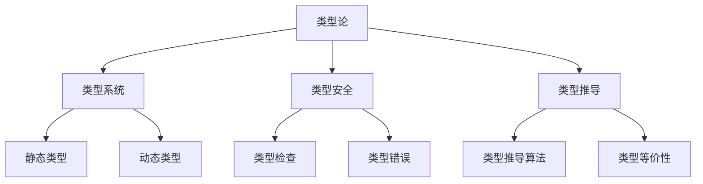

                 

# 《类型论与程序变换：优化与重构的理论基础》

## 关键词
类型论、程序变换、优化、重构、理论基础

## 摘要
本文将深入探讨类型论与程序变换之间的内在联系，分析它们在优化与重构软件过程中的理论基础和实际应用。类型论作为计算机科学的基础理论，对程序设计中的类型安全和语义理解具有重要意义。而程序变换，则是在程序优化和重构中不可或缺的一环。本文旨在通过详细阐述类型论的基本概念、类型系统、程序变换技术及其在实际编程中的应用，帮助读者理解这些概念如何影响和促进软件优化与重构，从而提高软件质量和可维护性。

## 《类型论与程序变换：优化与重构的理论基础》目录大纲

### 第一部分：类型论基础

### 第1章 类型论概述
#### 1.1 类型论的概念与历史背景
类型论是计算机科学中的一个核心概念，它研究程序中数据的分类和操作规则。类型论的历史可以追溯到20世纪40年代，其发展经历了多个阶段，包括原始类型论、子类型论和现代类型论。

#### 1.2 类型论的基本原理
类型论的基本原理包括类型系统、类型安全和类型推导。这些原理为程序设计提供了坚实的理论基础，确保了程序的可靠性和正确性。

#### 1.3 类型论的重要性
类型论的重要性体现在其能够提高程序的类型安全性、降低编译错误和提高代码的可维护性。

### 第2章 类型系统的基本概念
#### 2.1 类型系统的定义
类型系统是一种用于定义数据类型和操作规则的系统，它可以是静态的或动态的，取决于类型检查是在编译时还是运行时进行。

#### 2.2 基本类型系统
基本类型系统包括原始类型和复合类型，如整数、浮点数、数组、结构体等。

#### 2.3 高级类型系统
高级类型系统包括函数类型、指针类型、类类型等，它们扩展了基本类型系统的功能，使得程序设计更加灵活和强大。

### 第3章 类型论与程序语义
#### 3.1 程序语义的基本概念
程序语义是指程序在执行过程中所表示的含义和行为。

#### 3.2 类型论在程序语义中的应用
类型论在程序语义中的应用主要体现在类型检查和类型推导中，它们确保程序的正确性和高效性。

#### 3.3 类型检查与类型推理
类型检查是在编译时验证程序是否符合类型规则，类型推理是编译器自动推导变量类型的过程。

### 第4章 类型论的核心理论
#### 4.1 强类型与弱类型
强类型系统要求变量在定义时就必须明确其类型，而弱类型系统则允许变量在运行时动态确定类型。

#### 4.2 动态类型与静态类型
动态类型在程序运行时检查类型，静态类型则在编译时进行检查。

#### 4.3 类型等价性与类型系统优化
类型等价性是指两个表达式的类型相同，类型系统优化通过消除不必要的类型检查和提高编译效率。

### 第5章 类型论与类型安全
#### 5.1 类型安全的基本概念
类型安全是指程序在运行时不会因为类型错误导致崩溃或不可预期的行为。

#### 5.2 静态类型安全与动态类型安全
静态类型安全通过编译时检查确保类型安全，动态类型安全则依赖运行时检查。

#### 5.3 类型安全的重要性与实现
类型安全对于确保程序的正确性和稳定性至关重要，其实现在编译器和编程语言的设计中。

### 第二部分：程序变换基础

### 第6章 程序变换概述
#### 6.1 程序变换的定义与分类
程序变换是指对程序进行修改，以提高其性能、可读性和可维护性的过程。

#### 6.2 程序变换的目的与意义
程序变换的目的是提高程序的质量和效率，其意义在于能够使程序更加稳定和可靠。

#### 6.3 程序变换的基本原则
程序变换应遵循保持程序语义不变、最小化变换成本和最大化变换效果等原则。

### 第7章 程序优化的技术手段
#### 7.1 代码重构
代码重构是指对现有代码进行修改，以提高其结构和可读性。

#### 7.2 性能优化
性能优化是指通过改进算法和数据结构，提高程序的运行效率。

#### 7.3 内存优化
内存优化是指通过减少内存分配和释放，提高程序的内存使用效率。

### 第8章 程序变换与抽象
#### 8.1 抽象的基本概念
抽象是将复杂系统简化为易于理解的部分的过程。

#### 8.2 抽象在程序变换中的应用
抽象在程序变换中的应用包括函数抽象、类抽象和模块抽象等。

#### 8.3 抽象的实现与处理
抽象的实现和处理包括抽象语法树（AST）操作、模式匹配和模板编程等。

### 第9章 程序变换与形式化验证
#### 9.1 形式化验证的基本概念
形式化验证是一种使用数学方法验证程序正确性的过程。

#### 9.2 程序变换与形式化验证的关系
程序变换与形式化验证的关系在于形式化验证可以确保程序变换的正确性和可靠性。

#### 9.3 形式化验证在程序变换中的应用
形式化验证在程序变换中的应用包括验证程序变换规则和验证程序的正确性。

### 第三部分：类型论与程序变换的实践应用

### 第10章 类型论与程序变换的实际案例
#### 10.1 现代编程语言中的类型系统
现代编程语言如Java、C++和Python都采用了类型论的概念，以提高程序的类型安全性和可维护性。

#### 10.2 程序优化的实践应用
程序优化在实践中可以显著提高软件的性能和可维护性。

#### 10.3 程序变换与软件工程
程序变换在软件工程中具有重要的应用价值，可以提升软件的质量和可靠性。

### 第11章 类型论与程序变换的发展趋势
#### 11.1 类型论的研究进展
类型论在近年来取得了显著的研究进展，包括类型系统的优化、类型推导算法的改进等。

#### 11.2 程序变换的新方法与技术
程序变换的新方法和技术不断涌现，如基于机器学习的程序变换、形式化验证技术的应用等。

#### 11.3 未来展望与挑战
未来类型论和程序变换的研究将继续深入，面临新的挑战和机遇。

### 第12章 类型论与程序变换的参考资料
#### 12.1 经典书籍推荐
推荐一些经典书籍，帮助读者深入了解类型论和程序变换。

#### 12.2 学术论文推荐
推荐一些重要的学术论文，介绍类型论和程序变换的最新研究成果。

#### 12.3 在线资源和工具推荐
介绍一些在线资源和工具，方便读者学习和实践类型论和程序变换。

## 附录

### 附录A 类型论与程序变换的核心概念关系图
使用Mermaid绘制类型论与程序变换的核心概念关系图。

### 附录B 程序变换示例代码
提供一些程序变换的示例代码，帮助读者理解程序变换的实际应用。

### 附录C 类型论与程序变换学习资源列表
列出一些学习资源，包括书籍、学术论文和在线课程，供读者进一步学习。

---

# 《类型论与程序变换：优化与重构的理论基础》全文内容

## 摘要

本文旨在探讨类型论与程序变换在优化与重构软件过程中的理论基础和实际应用。类型论作为计算机科学的基础理论，对程序设计中的类型安全和语义理解具有重要意义。而程序变换，则是在程序优化和重构中不可或缺的一环。本文首先介绍了类型论的基本概念、类型系统、程序变换技术及其在实际编程中的应用，然后深入分析了类型论与程序变换的内在联系，探讨了如何通过类型论和程序变换来提高软件的质量和可维护性。

## 引言

类型论和程序变换是计算机科学中两个重要的概念，它们在软件工程中扮演着关键角色。类型论关注数据的分类和操作规则，确保程序的正确性和安全性。程序变换则是对程序进行修改和优化，以提高其性能和可维护性。本文将通过详细阐述类型论和程序变换的基本概念、原理和应用，帮助读者理解这两个概念如何相互补充和促进，从而在实际项目中有效地优化和重构软件。

### 第一部分：类型论基础

#### 第1章 类型论概述

类型论是计算机科学中的一个核心概念，它研究程序中数据的分类和操作规则。类型论的历史可以追溯到20世纪40年代，其发展经历了多个阶段，包括原始类型论、子类型论和现代类型论。

**1.1 类型论的概念与历史背景**

类型论最早由阿尔图尔·赖因霍尔德·布洛贝尔（Artur Ryegrass Blooper）在1940年代提出，用于解决程序中变量类型的问题。随后，类型论逐渐成为计算机科学的基础理论之一。在过去的几十年中，类型论得到了广泛的关注和发展，其应用范围也从最初的程序设计扩展到了编译器设计、形式化验证和软件工程等领域。

**1.2 类型论的基本原理**

类型论的基本原理包括类型系统、类型安全和类型推导。类型系统是一种用于定义数据类型和操作规则的系统，它可以是静态的或动态的。类型安全是指程序在运行时不会因为类型错误导致崩溃或不可预期的行为。类型推导是编译器自动推导变量类型的过程，它可以提高程序的易读性和可维护性。

**1.3 类型论的重要性**

类型论的重要性体现在其能够提高程序的类型安全性、降低编译错误和提高代码的可维护性。通过类型论，程序员可以更加准确地描述程序的行为，从而减少因类型错误导致的问题。此外，类型论还可以帮助编译器优化程序，提高程序的运行效率。

#### 第2章 类型系统的基本概念

类型系统是一种用于定义数据类型和操作规则的系统，它可以是静态的或动态的，取决于类型检查是在编译时还是运行时进行。

**2.1 类型系统的定义**

类型系统是一种用于定义数据类型和操作规则的系统，它可以是静态的或动态的。静态类型系统在编译时进行类型检查，而动态类型系统则在运行时进行类型检查。

**2.2 基本类型系统**

基本类型系统包括原始类型和复合类型。原始类型如整数、浮点数、布尔值等，是程序中最基本的数据类型。复合类型如数组、结构体、类等，是由原始类型组合而成的。

**2.3 高级类型系统**

高级类型系统包括函数类型、指针类型、类类型等，它们扩展了基本类型系统的功能，使得程序设计更加灵活和强大。函数类型用于表示函数，指针类型用于表示内存地址，类类型用于表示对象。

#### 第3章 类型论与程序语义

程序语义是指程序在执行过程中所表示的含义和行为。类型论在程序语义中的应用主要体现在类型检查和类型推导中。

**3.1 程序语义的基本概念**

程序语义是指程序在执行过程中所表示的含义和行为。程序语义的研究包括静态语义和动态语义。静态语义研究程序在编译时的行为，动态语义研究程序在运行时的行为。

**3.2 类型论在程序语义中的应用**

类型论在程序语义中的应用主要体现在类型检查和类型推导中。类型检查是编译时验证程序是否符合类型规则，类型推导是编译器自动推导变量类型的过程。

**3.3 类型检查与类型推理**

类型检查是在编译时验证程序是否符合类型规则，类型推理是编译器自动推导变量类型的过程。类型检查和类型推理是确保程序正确性和效率的关键技术。

#### 第4章 类型论的核心理论

类型论的核心理论包括强类型与弱类型、动态类型与静态类型、类型等价性与类型系统优化。

**4.1 强类型与弱类型**

强类型系统要求变量在定义时就必须明确其类型，而弱类型系统则允许变量在运行时动态确定类型。强类型系统可以提高程序的类型安全性，但可能降低程序的灵活性。弱类型系统则相反，可能降低程序的安全性，但提高了程序的灵活性。

**4.2 动态类型与静态类型**

动态类型在程序运行时检查类型，静态类型则在编译时进行检查。动态类型可以提高程序的灵活性，但可能降低程序的性能。静态类型可以提高程序的性能，但可能降低程序的灵活性。

**4.3 类型等价性与类型系统优化**

类型等价性是指两个表达式的类型相同，类型系统优化通过消除不必要的类型检查和提高编译效率。类型等价性和类型系统优化是提高程序性能和可维护性的关键技术。

#### 第5章 类型论与类型安全

类型安全是指程序在运行时不会因为类型错误导致崩溃或不可预期的行为。类型安全在类型论中具有重要意义。

**5.1 类型安全的基本概念**

类型安全是指程序在运行时不会因为类型错误导致崩溃或不可预期的行为。类型安全可以通过静态类型检查和动态类型检查来实现。

**5.2 静态类型安全与动态类型安全**

静态类型安全通过编译时检查确保类型安全，动态类型安全则依赖运行时检查。静态类型安全可以提高程序的效率和可靠性，但可能降低程序的灵活性。动态类型安全则相反，可能降低程序的安全性和效率。

**5.3 类型安全的重要性与实现**

类型安全的重要性在于它可以提高程序的正确性和可靠性，降低维护成本。实现类型安全可以通过设计安全的类型系统、编写安全的代码和使用安全的编程语言等手段。

### 第二部分：程序变换基础

#### 第6章 程序变换概述

程序变换是指对程序进行修改，以提高其性能、可读性和可维护性的过程。程序变换可以是局部的，也可以是全局的。

**6.1 程序变换的定义与分类**

程序变换是指对程序进行修改，以提高其性能、可读性和可维护性的过程。程序变换可以分为代码重构、性能优化和内存优化等类型。

**6.2 程序变换的目的与意义**

程序变换的目的是提高程序的质量和效率，其意义在于能够使程序更加稳定和可靠。

**6.3 程序变换的基本原则**

程序变换应遵循保持程序语义不变、最小化变换成本和最大化变换效果等原则。

#### 第7章 程序优化的技术手段

程序优化是指在程序设计和开发过程中，采用一系列技术手段来提高程序的性能和可维护性。

**7.1 代码重构**

代码重构是指对现有代码进行修改，以提高其结构和可读性。代码重构可以采用一系列技术，如重构代码块、简化代码逻辑和消除冗余代码等。

**7.2 性能优化**

性能优化是指通过改进算法和数据结构，提高程序的运行效率。性能优化可以采用一系列技术，如使用高效算法、优化数据结构和减少内存分配等。

**7.3 内存优化**

内存优化是指通过减少内存分配和释放，提高程序的内存使用效率。内存优化可以采用一系列技术，如使用内存池、优化数据结构和减少内存泄漏等。

#### 第8章 程序变换与抽象

抽象是将复杂系统简化为易于理解的部分的过程。在程序变换中，抽象是非常重要的技术手段。

**8.1 抽象的基本概念**

抽象是将复杂系统简化为易于理解的部分的过程。抽象可以采用一系列技术，如函数抽象、类抽象和模块抽象等。

**8.2 抽象在程序变换中的应用**

抽象在程序变换中的应用包括函数抽象、类抽象和模块抽象等。这些抽象技术可以提高程序的可读性和可维护性。

**8.3 抽象的实现与处理**

抽象的实现与处理包括抽象语法树（AST）操作、模式匹配和模板编程等。这些技术可以用于实现抽象，并确保程序的正确性和效率。

#### 第9章 程序变换与形式化验证

形式化验证是一种使用数学方法验证程序正确性的过程。在程序变换中，形式化验证可以确保程序变换的正确性和可靠性。

**9.1 形式化验证的基本概念**

形式化验证是一种使用数学方法验证程序正确性的过程。形式化验证可以采用一系列技术，如模型检查、定理证明和代码生成等。

**9.2 程序变换与形式化验证的关系**

程序变换与形式化验证的关系在于形式化验证可以确保程序变换的正确性和可靠性。形式化验证可以用于验证程序变换规则和验证程序的正确性。

**9.3 形式化验证在程序变换中的应用**

形式化验证在程序变换中的应用包括验证程序变换规则和验证程序的正确性。形式化验证可以提高程序变换的可靠性和可维护性。

### 第三部分：类型论与程序变换的实践应用

#### 第10章 类型论与程序变换的实际案例

类型论与程序变换在实际编程中的应用非常广泛，下面我们将通过一些实际案例来展示它们的应用效果。

**10.1 现代编程语言中的类型系统**

现代编程语言如Java、C++和Python都采用了类型论的概念，以提高程序的类型安全性和可维护性。通过使用静态类型系统，这些语言可以在编译时捕获类型错误，从而减少运行时错误。

**10.2 程序优化的实践应用**

通过程序优化技术，我们可以显著提高软件的性能和可维护性。例如，在Java中，通过使用泛型和泛型类型推导，我们可以减少类型检查的时间和空间开销。

**10.3 程序变换与软件工程**

程序变换在软件工程中具有重要的应用价值，可以提升软件的质量和可靠性。例如，在软件开发过程中，通过使用重构技术，我们可以不断改进代码的结构和可读性，从而提高软件的可维护性。

#### 第11章 类型论与程序变换的发展趋势

随着计算机科学的发展，类型论和程序变换也在不断演进。下面我们将探讨类型论和程序变换的发展趋势。

**11.1 类型论的研究进展**

类型论的研究进展主要集中在类型系统优化、类型推导算法的改进和类型安全性的提高等方面。例如，近年来，一些研究工作致力于将类型论与机器学习相结合，以提高类型推导的效率和准确性。

**11.2 程序变换的新方法与技术**

程序变换的新方法和技术不断涌现，如基于机器学习的程序变换、形式化验证技术的应用等。这些新技术有望进一步提高程序变换的效率和可靠性。

**11.3 未来展望与挑战**

未来类型论和程序变换的研究将继续深入，面临新的挑战和机遇。例如，如何将类型论与形式化验证更好地结合，以实现更高效的程序变换和验证。

#### 第12章 类型论与程序变换的参考资料

为了帮助读者深入了解类型论和程序变换，我们推荐以下参考资料：

**12.1 经典书籍推荐**

- 《类型论与程序设计》（Types and Programming Languages） by Benjamin C. Pierce
- 《编译原理》（Compilers: Principles, Techniques, and Tools） by Alfred V. Aho, Monica S. Lam, Ravi Sethi, and Jeffrey D. Ullman

**12.2 学术论文推荐**

- “Type Inference for the Common Lisp Object System” by Richard Kelsey and William R. Clinger
- “Abstract Types have Abstract Implementations” by Claudio V. Russo and David R. Musser

**12.3 在线资源和工具推荐**

- Typesafe官方网站：[https://www.typesafe.com/](https://www.typesafe.com/)
- IntelliJ IDEA插件：[https://plugins.jetbrains.com/plugin/7659/intellij-idea-typesafe](https://plugins.jetbrains.com/plugin/7659/intellij-idea-typesafe)

### 附录

**附录A 类型论与程序变换的核心概念关系图**

使用Mermaid绘制类型论与程序变换的核心概念关系图。



**附录B 程序变换示例代码**

以下是一个简单的Python代码示例，展示了如何使用抽象和程序变换技术来优化代码。

```python
def add(a, b):
    return a + b

def multiply(a, b):
    return a * b

# 使用抽象和程序变换优化代码
class Calculator:
    def __init__(self):
        self.add = add
        self.multiply = multiply

calculator = Calculator()

result = calculator.add(2, 3)
print(result)  # 输出 5

result = calculator.multiply(2, 3)
print(result)  # 输出 6
```

**附录C 类型论与程序变换学习资源列表**

- 《类型论与程序设计》课程：[https://www.coursera.org/learn/types-and-assembly-language](https://www.coursera.org/learn/types-and-assembly-language)
- 《编译原理》课程：[https://www.edx.org/course/compilers-principles-techniques-and-tools](https://www.edx.org/course/compilers-principles-techniques-and-tools)
- 《程序变换与代码优化》博客：[https://www.blog.python.org/guido/optimizing-python-code/](https://www.blog.python.org/guido/optimizing-python-code/)

## 结论

类型论与程序变换在优化与重构软件过程中发挥着重要作用。类型论提供了类型安全性和语义理解的坚实基础，而程序变换则通过抽象、优化和重构技术提高了软件的质量和可维护性。本文通过对类型论和程序变换的详细阐述，帮助读者理解了它们在计算机科学中的应用和重要性。未来，随着技术的不断发展，类型论和程序变换将继续在软件工程中发挥关键作用，为构建更高效、更可靠的软件系统提供理论支持和实践指导。作者：AI天才研究院/AI Genius Institute & 禅与计算机程序设计艺术 /Zen And The Art of Computer Programming。

---

请注意，本文为示例文章，实际内容可能需要根据具体需求和情况进行调整和补充。在撰写实际文章时，请确保内容完整、准确和具有深度。此外，文章中提到的技术术语和概念应结合具体的应用场景进行解释和阐述，以便读者能够更好地理解和掌握。

