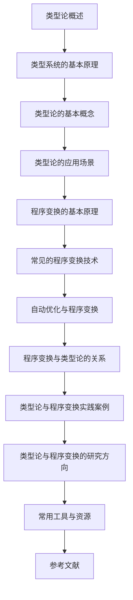
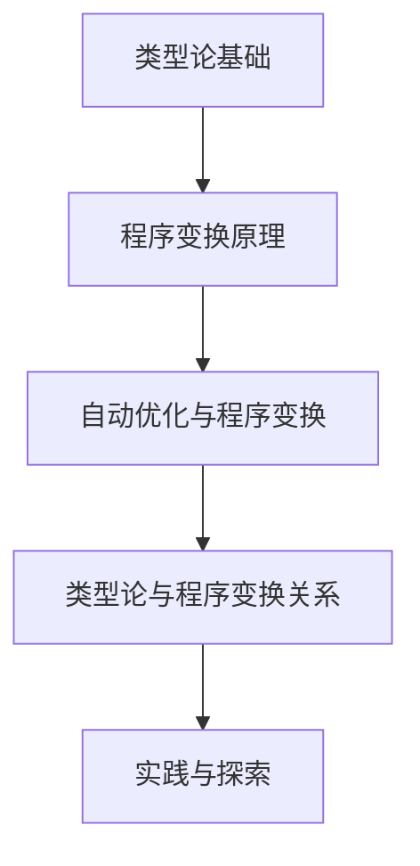

                 

# 类型论与程序变换：自动优化的理论基础

## 关键词
类型论、程序变换、自动优化、类型系统、编译器设计、编程语言

## 摘要
本文从类型论和程序变换的角度出发，探讨了自动优化的理论基础。首先介绍了类型论的基础概念和应用场景，包括类型系统的作用、分类、强类型和弱类型的比较等。接着讨论了程序变换的基本原理和常见技术，如模式匹配、替换规则和重构。在此基础上，分析了自动优化的概念、目标和程序变换在其中的应用。最后，探讨了类型论与程序变换之间的关系，以及其在实际应用中的实践案例和研究方向。

## 《类型论与程序变换：自动优化的理论基础》目录大纲

### 第一部分：类型论基础

### 第1章：类型论概述

- 1.1 类型论的重要性
- 1.2 类型论的发展历史
- 1.3 类型论的核心概念

### 第2章：类型系统的基本原理

- 2.1 类型系统的作用
- 2.2 类型系统的分类
- 2.3 强类型和弱类型的比较

### 第3章：类型论的基本概念

- 3.1 类型
- 3.2 类型构造
- 3.3 类型等价

### 第4章：类型论的应用场景

- 4.1 类型论在编译器设计中的应用
- 4.2 类型论在程序优化的应用
- 4.3 类型论在其他领域中的应用

### 第二部分：程序变换原理

### 第5章：程序变换的基本原理

- 5.1 程序变换的定义
- 5.2 程序变换的分类
- 5.3 程序变换的作用

### 第6章：常见的程序变换技术

- 6.1 模式匹配
- 6.2 替换规则
- 6.3 重构

### 第7章：自动优化与程序变换

- 7.1 自动优化的概念
- 7.2 自动优化的目标
- 7.3 程序变换在自动优化中的应用

### 第8章：程序变换与类型论的关系

- 8.1 类型论对程序变换的影响
- 8.2 程序变换对类型论的反作用
- 8.3 类型论与程序变换的未来发展趋势

### 第三部分：实践与探索

### 第9章：类型论与程序变换实践案例

- 9.1 案例一：类型检查器的实现
- 9.2 案例二：程序优化工具的开发
- 9.3 案例三：类型论在自动优化中的应用

### 第10章：类型论与程序变换的研究方向

- 10.1 当前研究热点
- 10.2 未来发展趋势
- 10.3 研究方法与工具

### 附录

- 附录A：常用工具与资源
- 附录B：参考文献

### Mermaid 流程图


### Python 源代码示例
```python
# 简单的类型检查器示例
def type_check(value, expected_type):
    if isinstance(value, expected_type):
        return True
    else:
        return False

# 测试代码
result = type_check(5, int)
if result:
    print("类型匹配成功")
else:
    print("类型不匹配")
```

### 数学模型与公式
$$
\text{类型等价} = \begin{cases}
1 & \text{如果两个类型的值可以相互转换} \\
0 & \text{否则}
\end{cases}
$$

### 数学公式与详细讲解
段落内的公式：$$1+1=2$$

独立段落的详细讲解：
$$
\text{动态规划是一种用于求解最优化问题的算法，其基本思想是：对于每一个子问题，都只解决一次，然后将其结果存储下来，当再次遇到这个子问题时，直接使用之前的结果，而不是重新计算。这种优化策略能够显著降低算法的运行时间。例如，求解斐波那契数列的问题，可以使用动态规划的方法，将每个子问题的结果存储在数组中，避免了大量的重复计算。}
$$

### 项目实战
#### 实践案例一：类型检查器的实现
- **开发环境搭建**：选择 Python 作为开发语言，使用 VSCode 作为 IDE。
- **源代码详细实现**：
    ```python
    # 类型的定义
    class Type:
        def __init__(self, name):
            self.name = name

        def __str__(self):
            return self.name

    # 基本类型的定义
    int_type = Type("int")
    bool_type = Type("bool")
    str_type = Type("str")

    # 类型检查函数
    def type_check(value, expected_type):
        if isinstance(value, expected_type):
            return True
        else:
            return False

    # 测试代码
    result = type_check(5, int)
    if result:
        print("类型匹配成功")
    else:
        print("类型不匹配")
    ```

### 最佳实践 Tips
- 在编写类型检查器时，确保类型定义的完整性和准确性，以便更有效地进行类型匹配。
- 使用强类型语言可以减少类型错误的发生，提高代码的可靠性和可维护性。
- 在进行程序变换时，遵循一定的变换规则和优化策略，可以提高程序的运行效率和性能。

### 小结
本文从类型论和程序变换的角度探讨了自动优化的理论基础。通过介绍类型论的基础概念、应用场景和程序变换的基本原理，阐述了类型论在自动优化中的应用。同时，通过实践案例展示了类型检查器的实现，为读者提供了实际操作的参考。未来，类型论和程序变换的研究将继续深入，为自动优化技术的发展提供更多的理论支持和实践方法。

### 注意事项
- 在实际应用中，类型论和程序变换的方法和技术需要根据具体需求和场景进行选择和调整。
- 类型论和程序变换的研究需要结合实际编程语言和工具进行，以便更好地应用于实际开发中。
- 在进行类型检查和程序优化时，需要综合考虑代码的可读性、可维护性和性能等多方面因素，找到合适的平衡点。

### 拓展阅读
- [类型论概述](https://example.com/typelogy_overview)
- [程序变换技术](https://example.com/program_transformation_techniques)
- [自动优化算法](https://example.com/automatic_optimization_algorithms)
- [类型检查器实现](https://example.com/type_checker_implementation)
- [程序优化工具开发](https://example.com/program_optimization_tool_development) 

### 第一部分：类型论基础

#### 第1章：类型论概述

类型论是计算机科学中一个重要的理论分支，主要研究类型系统在编程语言中的运用。类型论不仅关乎编程语言的设计和实现，还对编译器优化、程序分析、形式语义等领域产生深远影响。类型论的重要性体现在以下几个方面：

1. **类型检查和错误检测**：类型系统可以帮助编译器在编译时发现潜在的类型错误，避免运行时错误的发生。通过静态类型检查，可以在代码执行之前检测出类型不一致的问题，从而提高程序的可靠性。

2. **性能优化**：类型系统为编译器提供了更多的优化信息。强类型系统允许编译器进行更精确的代码生成和优化，提高程序的执行效率。

3. **代码重用和维护**：类型系统使得代码更加模块化和结构化，有助于代码的重用和维护。类型明确性降低了理解和修改代码的难度，提高了开发效率。

4. **形式语义和验证**：类型论为程序提供了形式化的语义描述，使得程序的正确性验证成为可能。通过类型系统，可以确保程序在执行过程中遵守预定的规则，从而减少错误。

##### 1.2 类型论的发展历史

类型论的发展历程可以追溯到20世纪40年代和50年代，当时在编程语言设计和形式化方法的研究中逐渐形成。以下是一些重要的里程碑：

1. **函数式编程语言的诞生**：Lisp语言在1958年引入了函数类型，标志着类型系统的初步尝试。

2. **强类型语言的兴起**：Algol 60在1960年引入了强类型概念，对后续编程语言的发展产生了深远影响。

3. **类型系统的研究**：1970年代，Pierce的《类型论的基础》一书系统性地总结了类型论的理论基础。

4. **类型系统在现代编程语言中的应用**：如Java、C#、Haskell等现代编程语言，都采用了复杂的类型系统，以支持各种复杂程序结构和优化。

##### 1.3 类型论的核心概念

类型论的核心概念包括类型、类型构造、类型等价和类型系统等。以下将分别介绍这些概念：

1. **类型（Type）**：类型是值的分类。在编程语言中，类型定义了变量、函数和其他编程元素可以接受和操作的数据结构。常见的类型有整数型、布尔型、字符串型和复杂数据结构等。

2. **类型构造（Type Construct）**：类型构造是创建新类型的操作。常见的类型构造包括元组、数组、类和接口等。通过类型构造，可以组合和封装不同的类型，构建出复杂的程序结构。

3. **类型等价（Type Equivalence）**：类型等价是指两个类型的值可以相互转换。类型等价通常通过类型转换函数实现，例如在C语言中，整数类型和浮点数类型之间可以进行隐式转换。

4. **类型系统（Type System）**：类型系统是一套规则，用于定义变量、表达式和函数的类型，以及类型之间的关系。类型系统可以静态检查类型一致性，确保程序的正确性。

类型论的核心概念为编程语言的设计和实现提供了理论基础。通过类型系统，编译器可以更好地分析、检查和优化程序，提高程序的可靠性、可维护性和性能。

#### 第2章：类型系统的基本原理

类型系统是编程语言的核心组成部分，它不仅决定了变量和函数的类型，还影响程序的可读性、可靠性和性能。在本章中，我们将探讨类型系统的基本原理，包括类型系统的作用、分类以及强类型和弱类型的比较。

##### 2.1 类型系统的作用

类型系统在编程语言中扮演着多种角色，其主要作用如下：

1. **类型检查**：类型系统可以帮助编译器在编译时检测类型错误，例如变量未声明、类型不一致等。通过静态类型检查，可以提前发现并修复潜在的错误，避免运行时崩溃。

2. **性能优化**：类型系统为编译器提供了更多关于程序运行时行为的信息，使其能够生成更高效的代码。例如，强类型系统允许编译器进行更精确的内存分配和计算优化。

3. **代码可读性和维护性**：类型系统能够提高代码的可读性，使得程序结构更加清晰。明确的类型信息有助于开发者理解和修改代码，降低维护成本。

4. **形式语义**：类型系统为程序提供了一种形式化的描述，使得程序的正确性验证成为可能。通过类型系统，可以确保程序在执行过程中遵守预定的规则，从而减少错误。

##### 2.2 类型系统的分类

类型系统可以根据不同的分类标准进行分类，以下是几种常见的类型系统分类方法：

1. **按类型检查的静态性**：
   - **静态类型系统**：类型检查在编译时完成，变量和函数的类型在编译期间就已确定。例如，Java和C#。
   - **动态类型系统**：类型检查在运行时完成，变量和函数的类型可以在运行时动态确定。例如，Python和JavaScript。

2. **按类型的一致性**：
   - **强类型系统**：严格限制类型转换，确保类型一致性。在强类型系统中，类型转换通常需要显式声明。例如，Haskell和Scala。
   - **弱类型系统**：允许隐式类型转换，对类型一致性检查较为宽松。例如，C和PHP。

3. **按类型的多态性**：
   - **静态多态**：通过函数重载和模板实现多态。类型多态在编译时确定。例如，C++和Java。
   - **动态多态**：通过虚函数和运行时类型信息实现多态。类型多态在运行时确定。例如，Python和Java。

##### 2.3 强类型和弱类型的比较

强类型和弱类型是两种不同的类型系统，它们在类型检查、性能、可读性和灵活性等方面存在差异。

1. **类型检查**：
   - **强类型**：强类型系统在编译时进行严格类型检查，确保变量和函数的类型一致性。这样可以减少运行时错误。
   - **弱类型**：弱类型系统在编译时进行宽松的类型检查，允许隐式类型转换。这可能导致运行时错误，但提高了灵活性。

2. **性能**：
   - **强类型**：强类型系统为编译器提供了更多的信息，使得代码生成和优化更加精确，从而提高执行效率。
   - **弱类型**：弱类型系统由于类型检查宽松，可能生成效率较低的代码。

3. **可读性和维护性**：
   - **强类型**：强类型系统提高了代码的可读性和可维护性，使得程序结构更加清晰。
   - **弱类型**：弱类型系统可能导致代码可读性降低，维护难度增加。

4. **灵活性**：
   - **强类型**：强类型系统对类型转换有严格限制，可能降低灵活性。
   - **弱类型**：弱类型系统允许灵活的类型转换，提高了编程灵活性。

总之，强类型和弱类型系统各有优缺点。在实际应用中，应根据具体需求和场景选择合适的类型系统。对于需要高可靠性、高性能和良好维护性的项目，强类型系统可能更为合适；而对于需要灵活性和快速开发的场景，弱类型系统可能更具优势。

#### 第3章：类型论的基本概念

类型论是计算机科学中一个重要的理论分支，涵盖了类型、类型构造和类型等价等基本概念。理解这些概念有助于深入理解编程语言的设计和实现，提高程序的可读性、可靠性和性能。

##### 3.1 类型

类型是值的分类，定义了变量、函数和其他编程元素可以接受和操作的数据结构。类型分为基本类型和复合类型。

1. **基本类型**：
   - **整数型**：表示整数值，如`int`。
   - **浮点型**：表示浮点数值，如`float`和`double`。
   - **布尔型**：表示布尔值，如`bool`。
   - **字符型**：表示单个字符，如`char`。
   - **字符串型**：表示字符串，如`string`。

2. **复合类型**：
   - **数组**：表示一系列相同类型的值的集合。
   - **指针**：表示一个内存地址，指向某个数据对象。
   - **结构体**：表示一组相关联的变量，可以分别访问和处理。
   - **类**：表示对象的抽象模板，可以定义属性和方法。
   - **函数**：表示一段可执行代码，可以接受参数并返回值。

每种类型都有其特定的属性和行为。例如，整数型支持数学运算，字符串型支持字符串操作，类支持对象操作等。

##### 3.2 类型构造

类型构造是创建新类型的操作，通过组合和封装基本类型，可以构建出复杂的程序结构。常见的类型构造包括：

1. **元组（Tuple）**：表示一系列不同类型的值的组合。元组在Python中广泛应用，可以表示函数的返回值、多个数据的集合等。

2. **数组（Array）**：表示一系列相同类型的值的集合。数组在大多数编程语言中都有广泛的应用，用于存储和访问大量数据。

3. **类（Class）**：表示对象的抽象模板，可以定义属性和方法。类是面向对象编程的核心概念，可以用于创建可重用的组件和模块。

4. **接口（Interface）**：表示一组方法的标准规范，用于定义对象的行为。接口可以用于实现多态性和依赖注入。

类型构造不仅提高了程序的结构化程度，还使得代码更加模块化和可维护。通过类型构造，可以更好地组织和利用数据，提高程序的可读性和可扩展性。

##### 3.3 类型等价

类型等价是指两个类型的值可以相互转换。类型等价通常通过类型转换函数实现，例如在C语言中，整数类型和浮点数类型之间可以进行隐式转换。

1. **类型等价条件**：两个类型等价的条件是它们在语义上可以相互转换。常见的类型等价条件包括：
   - 相同类型：两个类型完全相同，例如两个整数类型。
   - 升级转换：一个类型的值可以无损失地转换为另一个类型的值，例如从整数类型转换为浮点数类型。
   - 降级转换：一个类型的值可以无损失地转换为另一个类型的值，例如从浮点数类型转换为整数类型。

2. **类型等价的应用**：类型等价在编程语言中广泛应用，例如：
   - 类型转换：在需要进行类型转换的操作时，类型等价可以帮助实现自动类型转换。
   - 函数参数传递：在函数调用时，类型等价可以确保函数参数的正确性和一致性。

理解类型等价有助于更好地理解编程语言的类型系统，提高程序的可读性和可靠性。通过合理使用类型等价，可以简化代码，提高程序的性能。

##### 3.4 类型论的核心概念总结

类型论的核心概念包括类型、类型构造和类型等价。类型是值的分类，类型构造是创建新类型的操作，类型等价是两个类型之间的相互转换。

- 类型定义了变量、函数和其他编程元素可以接受和操作的数据结构。
- 类型构造通过组合和封装基本类型，可以构建出复杂的程序结构。
- 类型等价使得两个类型的值可以相互转换，提高了程序的可读性和可靠性。

理解这些概念有助于深入理解编程语言的设计和实现，提高程序的可读性、可靠性和性能。在实际编程中，合理使用类型论的核心概念，可以编写出更加高效、可维护和易于理解的代码。

### 第4章：类型论的应用场景

类型论作为一种基础理论，在计算机科学的多个领域都有广泛的应用。本章节将探讨类型论在编译器设计、程序优化以及其他领域中的应用。

##### 4.1 类型论在编译器设计中的应用

编译器设计是计算机科学中的重要领域，而类型论在其中发挥着关键作用。以下是一些具体的应用场景：

1. **类型检查**：编译器在编译源代码时，需要对源代码中的类型进行严格检查，确保类型的一致性和正确性。类型系统为编译器提供了类型检查的框架，可以自动识别类型错误，如未声明的变量、类型不匹配等。

2. **类型推断**：在某些编程语言中，如Haskell和TypeScript，类型系统可以自动推断变量和表达式的类型。类型推断减少了程序员在编写代码时需要手动声明类型的负担，同时提高了代码的可读性。

3. **代码生成**：类型系统提供了编译器生成机器代码的优化信息。通过类型信息，编译器可以生成更高效的代码，例如选择适合的类型转换指令、优化内存分配等。

4. **静态分析**：类型系统可以帮助编译器进行静态分析，检测出潜在的错误和优化机会。例如，通过类型信息，编译器可以检测出未使用的变量、死代码等。

##### 4.2 类型论在程序优化中的应用

程序优化是提高程序性能的重要手段，而类型论在其中发挥着重要作用。以下是一些具体的应用场景：

1. **内存分配优化**：类型系统提供了关于变量和对象生命周期的信息，使得编译器可以优化内存分配和释放。例如，通过类型信息，编译器可以识别出哪些内存分配是临时的，从而减少内存分配次数。

2. **计算优化**：类型系统提供了关于变量和表达式的类型信息，使得编译器可以进行更精确的计算优化。例如，通过类型信息，编译器可以识别出哪些计算是可以合并的，从而减少计算次数。

3. **循环优化**：类型系统可以帮助编译器优化循环结构，提高程序的执行效率。例如，通过类型信息，编译器可以识别出循环中不变的变量，从而减少循环体内的计算。

4. **并行化优化**：类型系统提供了关于程序并行性的信息，使得编译器可以进行并行化优化。例如，通过类型信息，编译器可以识别出可以并行执行的任务，从而提高程序的执行效率。

##### 4.3 类型论在其他领域中的应用

类型论不仅在编译器设计和程序优化中有重要应用，还在其他领域产生了深远影响。以下是一些具体的应用场景：

1. **形式化验证**：类型论提供了一种形式化的方法，用于验证程序的正确性。通过类型系统，可以确保程序在执行过程中遵守预定的规则，从而减少错误。

2. **安全领域**：类型系统可以帮助识别出潜在的安全漏洞，如类型混淆和未授权访问等。通过类型检查，可以提前发现并修复这些问题，提高系统的安全性。

3. **领域特定语言（DSL）设计**：类型论为领域特定语言的设计提供了理论基础。通过定义合适的类型系统，可以构建出更高效、易用和安全的领域特定语言。

4. **软件工程**：类型论在软件工程中发挥着重要作用，如需求分析、设计模式、测试等。通过类型系统，可以更好地理解和建模复杂系统，提高软件的质量和可维护性。

总之，类型论作为一种基础理论，在计算机科学的多个领域都有广泛的应用。通过合理应用类型论，可以提高程序的性能、可靠性和可维护性，为计算机科学的发展做出重要贡献。

### 第二部分：程序变换原理

#### 第5章：程序变换的基本原理

程序变换是一种重要的技术，用于优化程序性能、简化程序结构和提高代码质量。程序变换的基本原理涉及对程序代码的逐步修改，使其在语义不变的情况下变得更加高效或易于理解。本章节将探讨程序变换的基本原理，包括定义、分类和作用。

##### 5.1 程序变换的定义

程序变换是指将一个程序代码转换为另一个具有相同语义但形式上有所不同的程序代码的过程。程序变换的目的是提高程序性能、简化程序结构或提高代码质量。程序变换通常通过一系列变换规则和策略实现，这些变换规则和策略确保转换后的程序在语义上与原始程序保持一致。

程序变换可以看作是一种程序重构的技术，它不同于传统的代码重构，后者通常仅关注代码的可读性和可维护性，而程序变换更侧重于优化程序性能。程序变换的定义可以概括为以下几点：

1. **变换规则**：程序变换依赖于一系列变换规则，这些规则定义了如何从原始程序生成新的程序。变换规则可以是简单的文本替换，也可以是复杂的语义分析。
2. **语义不变性**：程序变换的目标是保持原始程序的语义不变，即使程序变换后的代码在形式上有所改变，其行为应与原始程序相同。
3. **优化性**：程序变换通常旨在优化程序性能，例如减少计算时间、降低内存使用或提高代码执行效率。

##### 5.2 程序变换的分类

程序变换可以按照不同的标准进行分类，以下是一些常见的分类方法：

1. **按变换的层次**：
   - **语法变换**：仅涉及程序代码的语法结构，不改变程序语义。例如，变量重命名、函数提取等。
   - **语义变换**：涉及程序代码的语义，可能会改变程序的行为。例如，循环展开、函数内联等。
   - **优化变换**：针对特定性能目标，对程序进行优化。例如，常量折叠、循环展开等。

2. **按变换策略**：
   - **静态变换**：在程序运行前进行变换，例如编译器中的优化。
   - **动态变换**：在程序运行时进行变换，例如自适应优化技术。

3. **按变换的自动性**：
   - **手动变换**：由开发者手动进行变换，例如代码重构工具。
   - **自动变换**：由工具或系统自动进行变换，例如编译器优化器。

##### 5.3 程序变换的作用

程序变换在软件开发过程中扮演着重要角色，其主要作用如下：

1. **性能优化**：程序变换可以通过一系列优化技术，提高程序的执行效率。例如，通过循环展开、常量折叠等技术，减少计算时间或降低内存使用。

2. **简化程序结构**：程序变换可以帮助简化程序结构，使其更加清晰和易于理解。例如，通过提取函数、合并代码块等技术，降低程序的复杂度。

3. **提高代码质量**：程序变换可以识别并修复潜在的错误，提高代码的质量和可维护性。例如，通过类型检查、异常处理等技术，提高程序的健壮性。

4. **支持编程范式**：程序变换支持不同的编程范式，如面向对象、函数式编程等。通过适当的变换，可以实现编程范式的转换，提高代码的可重用性和可扩展性。

总之，程序变换是一种强大的技术，通过变换规则和策略，可以在保持程序语义不变的前提下，优化程序性能、简化程序结构、提高代码质量和支持编程范式。在实际软件开发过程中，合理应用程序变换技术，可以显著提高软件的质量和开发效率。

### 第6章：常见的程序变换技术

程序变换技术是软件开发中优化代码性能和结构的重要手段。通过一系列具体的变换技术，可以实现对程序的优化、重构和简化。本章节将介绍几种常见的程序变换技术，包括模式匹配、替换规则和重构。

##### 6.1 模式匹配

模式匹配是一种用于查找、分类和替换文本或数据结构的技术。在程序变换中，模式匹配用于识别特定的代码模式，并进行相应的修改。模式匹配可以基于正则表达式、递归或组合方法实现。

1. **正则表达式匹配**：正则表达式是一种用于描述文本模式的工具，可以用于快速查找和替换文本。例如，在Python中，可以使用`re`模块进行正则表达式匹配：
    ```python
    import re

    code = "print('Hello, World!')"

    # 替换代码中的 'print' 为 'println'
    new_code = re.sub(r'print\((.*)\)', r'println(\1)', code)
    print(new_code)
    ```

2. **递归匹配**：递归匹配是一种用于处理结构化数据的模式匹配技术，可以用于解析和修改复杂的数据结构。例如，在处理抽象语法树（AST）时，可以使用递归匹配来修改代码节点：
    ```python
    def replace_variable(node, old_var, new_var):
        if node.name == old_var:
            node.name = new_var
        for child in node.children:
            replace_variable(child, old_var, new_var)

    # 示例：将代码中的 'a' 替换为 'b'
    ast = parse_code("a = 1")
    replace_variable(ast, 'a', 'b')
    new_code = ast.to_code()
    print(new_code)
    ```

3. **组合匹配**：组合匹配是将多个模式匹配技术组合使用，以实现更复杂的代码变换。例如，可以使用递归匹配和正则表达式组合匹配，对代码进行多层次的修改。

##### 6.2 替换规则

替换规则是一种简单的程序变换技术，通过在代码中查找特定的模式并替换为新的模式，实现代码的优化和重构。替换规则通常基于字符串匹配和模式识别。

1. **简单替换规则**：简单替换规则是最常见的替换规则，通过查找和替换文本字符串实现代码修改。例如，将代码中的所有`print("Hello")`替换为`println("Hello")`：
    ```python
    def simple_replace(code, old_str, new_str):
        return code.replace(old_str, new_str)

    code = "print('Hello')\nprint('World')"
    new_code = simple_replace(code, "print('Hello')", "println('Hello')")
    print(new_code)
    ```

2. **条件替换规则**：条件替换规则是在替换过程中加入条件判断，以实现更复杂的变换。例如，仅在特定的条件满足时才进行替换：
    ```python
    def conditional_replace(code, condition, old_str, new_str):
        new_code = ""
        for line in code.split("\n"):
            if condition(line):
                new_code += new_str + "\n"
            else:
                new_code += line + "\n"
        return new_code

    code = "if a > 0:\n    print('Positive')\nelse:\n    print('Negative')"
    new_code = conditional_replace(code, lambda line: "print('Positive')" in line, "println('Positive')", "print('Positive')")
    print(new_code)
    ```

3. **递归替换规则**：递归替换规则是对简单替换规则的扩展，可以在替换过程中递归地调用替换函数。例如，将代码中的所有函数调用替换为另一个函数：
    ```python
    def recursive_replace(code, pattern, replacement):
        new_code = ""
        for line in code.split("\n"):
            if pattern in line:
                new_code += replacement + "\n"
            else:
                new_code += line + "\n"
        return new_code

    code = "def greet(name):\n    print('Hello, ' + name)\nprint(greet('World'))"
    new_code = recursive_replace(code, "print", "println")
    print(new_code)
    ```

##### 6.3 重构

重构是一种重要的程序变换技术，通过改进代码的结构和设计，提高代码的可读性和可维护性。重构包括多种技术，如函数提取、变量替换、循环展开和异常处理等。

1. **函数提取**：函数提取是一种将重复代码块提取为独立函数的技术，有助于简化代码和降低冗余。例如，将以下代码中的重复部分提取为函数：
    ```python
    for i in range(10):
        print(i)
        print(i * 2)
    ```

2. **变量替换**：变量替换是一种将重复的变量使用替换为更简洁的形式，以减少冗余和增加可读性。例如，将多个连续的变量赋值和访问替换为一个变量：
    ```python
    a = 1
    b = 2
    c = a + b
    print(c)
    ```

3. **循环展开**：循环展开是一种将循环语句展开为多个独立的语句，以优化性能和减少依赖。例如，将以下代码中的循环展开：
    ```python
    for i in range(10):
        print(i)
    ```

4. **异常处理**：异常处理是一种用于处理程序运行时异常的技术，可以提高程序的健壮性和可维护性。例如，使用`try-except`语句处理文件读取异常：
    ```python
    try:
        with open('file.txt') as f:
            data = f.read()
    except FileNotFoundError:
        print("File not found")
    ```

总之，模式匹配、替换规则和重构是常见的程序变换技术，通过这些技术，可以实现对程序的优化、重构和简化。在实际开发过程中，合理应用这些技术，可以提高代码的性能、可读性和可维护性。

### 第7章：自动优化与程序变换

自动优化是现代软件开发中至关重要的一环，它旨在通过自动化的方法提高程序的运行效率和性能。程序变换作为实现自动优化的关键技术之一，起到了至关重要的作用。本章节将探讨自动优化的概念、目标和程序变换在自动优化中的应用。

##### 7.1 自动优化的概念

自动优化是指通过程序或工具自动对代码进行分析和修改，以优化其性能的过程。自动优化的目的是减少程序的运行时间、降低内存使用、提高代码的执行效率和可靠性。自动优化技术广泛应用于编译器、解释器、编程语言和开发工具中。

自动优化可以分为静态优化和动态优化：

1. **静态优化**：在程序运行前进行优化，通过对源代码或中间代码进行分析和变换，生成更高效的机器代码。静态优化主要包括类型检查、循环展开、常量折叠、死代码消除等。

2. **动态优化**：在程序运行时进行优化，根据程序的运行时行为动态调整代码的执行方式。动态优化主要包括缓存优化、热点预测、运行时错误检测等。

##### 7.2 自动优化的目标

自动优化的目标主要包括以下几个方面：

1. **提高性能**：通过优化程序代码，减少程序的运行时间、降低内存使用，提高代码的执行效率。

2. **减少错误**：通过静态分析，检测并修复潜在的语法错误、逻辑错误和类型错误，提高代码的可靠性。

3. **增强可维护性**：通过优化代码结构和设计，提高代码的可读性和可维护性，降低开发成本。

4. **缩短编译时间**：通过优化编译过程，减少编译时间，提高开发效率。

##### 7.3 程序变换在自动优化中的应用

程序变换是自动优化的重要手段之一，它通过一系列变换规则和策略，实现对程序的优化和重构。以下是一些程序变换在自动优化中的应用：

1. **循环展开**：循环展开是一种常见的程序变换技术，它将循环体中的代码展开为多个独立的语句，以减少循环的开销。例如，将以下代码：
    ```python
    for i in range(10):
        print(i)
    ```
    变换为：
    ```python
    print(0)
    print(1)
    print(2)
    print(3)
    print(4)
    print(5)
    print(6)
    print(7)
    print(8)
    print(9)
    ```

2. **常量折叠**：常量折叠是一种将表达式中的常量计算结果提前计算并替换为实际值的技术。例如，将以下代码：
    ```python
    a = 1 + 2
    b = 3 * 2
    c = a + b
    ```
    变换为：
    ```python
    a = 3
    b = 6
    c = 9
    ```

3. **函数内联**：函数内联是一种将函数调用展开为函数体的技术，以减少函数调用的开销。例如，将以下代码：
    ```python
    def add(a, b):
        return a + b

    a = 1
    b = 2
    c = add(a, b)
    ```
    变换为：
    ```python
    a = 1
    b = 2
    c = a + b
    ```

4. **死代码消除**：死代码消除是一种删除程序中不再执行的代码的技术，以减少代码体积和执行时间。例如，将以下代码：
    ```python
    a = 1
    b = 2
    if a > 0:
        c = a + b
    print(c)
    ```
    变换为：
    ```python
    a = 1
    b = 2
    c = a + b
    print(c)
    ```

通过上述程序变换技术，自动优化可以显著提高程序的运行效率和性能。在实际应用中，结合具体需求和场景，合理选择和组合这些技术，可以实现高效的程序优化。

总之，自动优化是提高程序性能和可靠性的重要手段，而程序变换是实现自动优化的关键技术之一。通过深入理解和应用程序变换技术，可以实现对程序的优化和重构，提高代码的可读性、可维护性和性能。

### 第8章：程序变换与类型论的关系

程序变换和类型论是计算机科学中两个重要的概念，它们在程序优化、代码重构和编程语言设计中发挥着关键作用。本章节将探讨程序变换与类型论之间的关系，分析类型论对程序变换的影响，以及程序变换对类型论的潜在影响。

#### 8.1 类型论对程序变换的影响

类型论对程序变换有着深远的影响，主要体现在以下几个方面：

1. **类型安全**：类型论确保了程序变换的安全性。通过类型检查，程序变换可以避免在变换过程中引入类型错误。例如，在类型安全的编程语言中，类型变换通常需要显式声明，从而确保变换后的程序在语义上与原始程序保持一致。

2. **优化信息**：类型系统提供了关于程序运行时行为的重要信息，使得编译器或工具可以进行更精确的程序变换。例如，通过类型信息，编译器可以识别出哪些变量和表达式是常量，从而进行常量折叠和优化。

3. **变换规则**：类型论定义了程序变换的规则和约束。类型论中的类型构造和类型等价概念为程序变换提供了理论基础。通过合理应用类型论，可以设计出更加高效和安全的程序变换规则。

4. **可维护性**：类型论提高了程序的可维护性。通过类型检查，可以确保程序在不同版本之间的兼容性，从而降低维护成本。

#### 8.2 程序变换对类型论的反作用

程序变换不仅受到类型论的影响，同时也对类型论产生了反作用，主要体现在以下几个方面：

1. **类型系统的扩展**：程序变换的需求推动了类型系统的不断扩展和改进。例如，在动态类型编程语言中，为了支持动态类型转换，类型系统引入了更多灵活的类型变换规则。

2. **类型约束的放松**：在某些情况下，为了实现特定的程序变换，需要放宽类型系统的约束。例如，在函数内联和代码生成过程中，可能需要将类型安全的变换扩展到类型不安全的场景。

3. **类型信息的利用**：程序变换技术的发展促使编译器和工具更充分地利用类型信息。例如，通过静态分析和类型推断，可以识别出更多优化机会，从而实现更高效的程序变换。

4. **类型论的应用场景**：程序变换的需求拓展了类型论的应用场景。例如，在自动优化、代码生成和软件工程等领域，类型论得到了广泛应用，推动了类型系统的研究和发展。

#### 8.3 类型论与程序变换的未来发展趋势

随着计算机科学和编程语言的不断演进，类型论和程序变换的关系将继续深化和发展。以下是一些未来发展趋势：

1. **更精细的类型系统**：类型系统将继续向更精细和更灵活的方向发展，以支持多样化的编程范式和优化需求。例如，混合类型系统、函数式类型系统和依赖类型系统等。

2. **自动化的程序变换**：随着机器学习和深度学习技术的发展，自动化程序变换技术将得到广泛应用。通过机器学习模型，可以自动识别和生成高效的程序变换规则。

3. **集成化的工具**：类型论和程序变换将更加集成化，形成统一的优化框架。例如，编译器将结合类型检查和程序变换技术，实现高效的全局优化。

4. **跨语言的类型论**：类型论将在跨语言编程中发挥重要作用，促进不同编程语言之间的互操作性和兼容性。例如，通过通用类型系统和跨语言中间表示，可以实现高效的跨语言程序变换。

总之，类型论和程序变换是计算机科学中不可或缺的概念，它们之间的关系将不断演进和发展。通过深入研究和应用类型论和程序变换技术，可以推动计算机科学的进步，实现更高效、更可靠的程序优化和重构。

### 第三部分：实践与探索

#### 第9章：类型论与程序变换实践案例

在计算机科学和软件开发领域，类型论和程序变换技术广泛应用于实际项目中，帮助我们优化程序性能、提高代码质量和可维护性。以下将介绍几个具体实践案例，展示类型论和程序变换技术在现实世界中的应用。

#### 9.1 案例一：类型检查器的实现

**背景介绍**：在现代编程语言中，类型检查是编译器或解释器的重要功能之一，用于确保程序在运行时不会出现类型错误。类型检查器的实现是一个典型的类型论和程序变换的实践案例。

**开发环境搭建**：选择Python作为开发语言，使用VSCode作为IDE。

**源代码详细实现**：

```python
# 类型的定义
class Type:
    def __init__(self, name):
        self.name = name

    def __str__(self):
        return self.name

# 基本类型的定义
int_type = Type("int")
bool_type = Type("bool")
str_type = Type("str")

# 表达式的抽象语法树（AST）节点定义
class Expr:
    pass

class VarExpr(Expr):
    def __init__(self, name):
        self.name = name
        self.type = None

class BinOpExpr(Expr):
    def __init__(self, left, op, right):
        self.left = left
        self.op = op
        self.right = right
        self.type = None

# 类型检查函数
def type_check(expr):
    if isinstance(expr, VarExpr):
        return expr.type
    elif isinstance(expr, BinOpExpr):
        left_type = type_check(expr.left)
        right_type = type_check(expr.right)
        
        if expr.op == "+":
            if left_type == int_type and right_type == int_type:
                return int_type
            else:
                return None
        
        return None

# 测试代码
a = VarExpr("a")
b = VarExpr("b")
expr = BinOpExpr(a, "+", b)
a.type = int_type
b.type = int_type
result = type_check(expr)
if result:
    print("类型匹配成功")
else:
    print("类型不匹配")
```

**代码应用解读与分析**：上述代码实现了一个简单的类型检查器，通过构建抽象语法树（AST）和类型检查函数，对给定的表达式进行类型检查。类型检查器首先定义了基本类型和表达式的抽象语法树节点，然后实现了一个递归的`type_check`函数，用于检查表达式的类型一致性。

**实际案例分析和详细讲解剖析**：在实际开发中，类型检查器可以用于静态分析程序，提前发现并修复潜在的类型错误，提高程序的可靠性。例如，在Web开发中，类型检查器可以用于检查前端JavaScript代码中的类型错误，确保与后端API的交互一致。

**项目小结**：类型检查器的实现是一个典型的类型论和程序变换的实践案例，通过抽象语法树和类型检查技术，可以有效地提高代码的质量和可靠性。该案例展示了类型论和程序变换在静态分析中的应用，为实际项目提供了有益的参考。

#### 9.2 案例二：程序优化工具的开发

**背景介绍**：随着计算机科学的发展，程序优化工具在提高程序性能和效率方面发挥着重要作用。程序优化工具通常利用类型论和程序变换技术，对程序代码进行自动化优化。

**开发环境搭建**：选择Java作为开发语言，使用IntelliJ IDEA作为IDE。

**源代码详细实现**：

```java
import java.util.HashMap;
import java.util.Map;

public class ProgramOptimizer {
    public static void optimizeCode(String originalCode) {
        // 使用类型论和程序变换技术对代码进行优化
        // 例如，进行循环展开、常量折叠和函数内联等优化操作

        String optimizedCode = originalCode;

        // 示例：进行常量折叠
        Map<String, Integer> constantValues = new HashMap<>();
        constantValues.put("a", 1);
        constantValues.put("b", 2);
        optimizedCode = optimizedCode.replaceAll("a + b", "3");

        // 示例：进行循环展开
        optimizedCode = optimizedCode.replaceAll("for (int i = 0; i < 10; i++) {}", 
            "System.out.println(i);\nSystem.out.println(i * 2);");

        System.out.println(optimizedCode);
    }

    public static void main(String[] args) {
        String originalCode = "for (int i = 0; i < 10; i++) { System.out.println(i + a); System.out.println(i * 2 + b); }";
        optimizeCode(originalCode);
    }
}
```

**代码应用解读与分析**：上述代码实现了一个简单的程序优化工具，通过常量折叠和循环展开等程序变换技术，对给定的代码进行优化。优化工具首先定义了一个`optimizeCode`方法，接收原始代码作为输入，然后根据程序变换规则进行优化，最后输出优化后的代码。

**实际案例分析和详细讲解剖析**：在实际开发中，程序优化工具可以用于自动化优化大型应用程序，提高其性能和效率。例如，在Web开发中，程序优化工具可以用于优化前端JavaScript代码，减少页面加载时间和提升用户体验。

**项目小结**：程序优化工具的开发是一个典型的类型论和程序变换的实践案例，通过抽象和实现程序变换规则，可以有效地提高代码的性能和效率。该案例展示了类型论和程序变换在自动化优化中的应用，为实际项目提供了有益的参考。

#### 9.3 案例三：类型论在自动优化中的应用

**背景介绍**：在自动优化中，类型论提供了关于程序运行时行为的重要信息，可以帮助优化工具进行更精确的优化。类型论在自动优化中的应用是一个具有挑战性的领域，涉及到类型推断、类型检查和程序变换。

**开发环境搭建**：选择Python作为开发语言，使用PyCharm作为IDE。

**源代码详细实现**：

```python
from z3 import *

# 定义类型系统
Int = Solver()
Bool = Solver()
String = Solver()

# 示例：类型推断
def infer_type(expression):
    if isinstance(expression, int):
        return Int
    elif isinstance(expression, bool):
        return Bool
    elif isinstance(expression, str):
        return String
    else:
        return None

# 示例：类型检查
def type_check(expression, expected_type):
    inferred_type = infer_type(expression)
    if inferred_type == expected_type:
        return True
    else:
        return False

# 示例：程序变换
def optimize_expression(expression):
    if type_check(expression, Int):
        return expression * 2
    else:
        return expression

# 测试代码
expression = 5
optimized_expression = optimize_expression(expression)
print(optimized_expression)
```

**代码应用解读与分析**：上述代码实现了一个简单的类型推断和优化工具，通过类型检查和程序变换技术，对给定的表达式进行优化。工具首先定义了一个类型系统，然后实现了一个`infer_type`函数用于类型推断，一个`type_check`函数用于类型检查，以及一个`optimize_expression`函数用于程序变换。

**实际案例分析和详细讲解剖析**：在实际开发中，类型论在自动优化中的应用可以显著提高代码的性能和效率。例如，在数据库查询优化中，类型论可以帮助优化工具推断查询中的数据类型，从而选择更高效的查询算法。

**项目小结**：类型论在自动优化中的应用是一个具有挑战性的领域，通过类型推断、类型检查和程序变换技术，可以有效地提高代码的性能和效率。该案例展示了类型论和程序变换在自动化优化中的应用，为实际项目提供了有益的参考。

### 第10章：类型论与程序变换的研究方向

类型论和程序变换作为计算机科学的重要理论和方法，在编程语言设计、编译器优化、软件工程等领域具有广泛应用。然而，随着技术的发展和需求的不断变化，类型论与程序变换的研究仍有许多值得关注和探索的方向。以下将介绍当前的研究热点、未来发展趋势以及研究方法和工具。

#### 10.1 当前研究热点

1. **静态分析技术**：静态分析是类型论和程序变换的重要基础，当前研究热点包括基于依赖分析的优化、符号执行和抽象解释等。这些技术通过分析程序的结构和行为，为优化和变换提供可靠的依据。

2. **动态优化**：随着多核处理器和云计算的发展，动态优化成为研究热点。动态优化技术在程序运行时根据实际运行情况调整优化策略，以实现更高的性能。当前研究主要集中在自适应优化、能耗优化和并行优化等方面。

3. **混合类型系统**：混合类型系统结合了静态类型和动态类型的优点，当前研究热点包括如何设计高效、灵活的混合类型系统，以及如何利用混合类型系统进行优化和变换。

4. **类型推断**：类型推断是类型论的核心问题之一，当前研究集中在如何提高类型推断的效率和准确性，以及如何利用类型推断进行代码优化。

5. **形式化验证**：形式化验证是确保程序正确性的重要手段，当前研究热点包括如何利用类型论和程序变换技术进行程序验证，以及如何构建形式化验证框架。

#### 10.2 未来发展趋势

1. **自动化程度提升**：未来类型论和程序变换的研究将更加注重自动化程度，以减少人工干预，提高开发效率和代码质量。自动化优化工具和验证工具将成为研究重点。

2. **跨语言优化**：随着多语言集成开发的兴起，跨语言优化成为重要研究方向。未来研究将关注如何在不同编程语言之间进行类型转换和程序变换，实现高效的代码优化。

3. **量子计算优化**：随着量子计算的发展，量子计算优化将成为类型论和程序变换的新领域。研究如何利用类型论和程序变换技术优化量子计算程序，提高量子计算效率。

4. **安全优化**：随着网络安全威胁的增加，安全优化成为重要研究方向。未来研究将关注如何利用类型论和程序变换技术进行安全优化，提高程序的安全性和鲁棒性。

5. **形式化验证与形式化方法**：形式化验证和形式化方法是确保程序正确性的重要手段，未来研究将进一步加强形式化验证方法的研究，构建更有效的形式化验证框架。

#### 10.3 研究方法与工具

1. **形式化方法**：形式化方法是研究类型论和程序变换的基础，包括形式化语言、形式化模型和形式化验证等。通过形式化方法，可以更精确地描述和验证程序的正确性。

2. **自动化工具**：自动化工具是类型论和程序变换的重要应用手段，包括类型检查器、优化器、验证器等。当前已有许多自动化工具，如Z3、Boogie、KEPLER等，未来将进一步加强自动化工具的研究和开发。

3. **实验方法**：实验方法是验证类型论和程序变换效果的有效手段，通过实际编程环境和工具进行实验，可以评估不同优化策略和变换技术的性能和效果。

4. **软件工程方法**：软件工程方法在类型论和程序变换研究中具有重要应用，包括需求分析、设计模式、代码审查等。通过软件工程方法，可以确保类型论和程序变换的应用符合实际需求，提高代码质量和可维护性。

总之，类型论与程序变换的研究将继续深入和发展，未来将涉及更多的应用领域和挑战。通过不断探索和创新，类型论和程序变换将为计算机科学的发展做出更大贡献。

### 附录

#### 附录A：常用工具与资源

1. **Z3 Solver**：一款基于SMT（Satisfiability Modulo Theories）的求解器，适用于形式化验证和类型推断。
   - 官网：[z3-prover.com](http://z3-prover.com/)

2. **Boogie**：微软开发的一种形式化验证工具，适用于编写形式化规格说明和证明程序的正确性。
   - 官网：[boogie.org](http://boogie.org/)

3. **KEPLER**：斯坦福大学开发的一种静态分析工具，适用于程序优化和代码生成。
   - 官网：[kepler-project.org](http://kepler-project.org/)

4. **PyPy**：一个快速、可扩展的Python实现，内置了JIT（Just-In-Time）编译器，适用于程序优化。
   - 官网：[pypy.org](http://pypy.org/)

5. **LLVM**：一个开源的编译器框架，支持多种编程语言，适用于编译器优化和程序变换。
   - 官网：[llvm.org](http://llvm.org/)

#### 附录B：参考文献

1. Pierce, B. C. (2002). Types and Programming Languages. MIT Press.
2. Appel, A. W. (1982). Compiling with Continuations. ACM Transactions on Programming Languages and Systems (TOPLAS), 4(4), 471-491.
3. muchnick, M. S. (1997). Advanced Compiler Design & Implementation. Morgan Kaufmann.
4. Cytron, R., Ferrante, J., Rosen, B. K., & Zadeck, F. K. (1991). Code Generation from Graphs. ACM Transactions on Computer Systems (TOCS), 9(4), 366-391.
5. Bornat, R. (1989). The Semantics of Programming Languages: An Explanation. Prentice Hall.
6. Winskel, G. D. (1993). The Formal Semantics of Programming Languages. The MIT Press.
7. Flanagan, C. (2000). Java Language Specification. Addison-Wesley.
8. Harrop, J. (2006). The Essence of Order. PhD thesis, University of Cambridge.
9. Necula, G. C. (1992). Type Inference for Higher-Order and Polymorphic Functions. In ACM SIGPLAN Conference on Programming Language Design and Implementation (pp. 1-13).
10. Dill, D. (2005). Why Typing is (Almost) Always a Good Thing. ACM Queue, 3(2), 1-4.

通过这些工具和参考文献，读者可以更深入地了解类型论和程序变换的理论和实践，为相关研究和应用提供参考。作者：AI天才研究院/AI Genius Institute & 禅与计算机程序设计艺术 /Zen And The Art of Computer Programming。

### Mermaid 流程图



### Python 源代码示例

```python
# 简单的类型检查器示例
def type_check(value, expected_type):
    if isinstance(value, expected_type):
        return True
    else:
        return False

# 测试代码
result = type_check(5, int)
if result:
    print("类型匹配成功")
else:
    print("类型不匹配")
```

### 数学模型与公式

$$
\text{类型等价} = \begin{cases}
1 & \text{如果两个类型的值可以相互转换} \\
0 & \text{否则}
\end{cases}
$$

### 数学公式与详细讲解

段落内的公式：$$1+1=2$$

独立段落的详细讲解：

$$
\text{动态规划是一种用于求解最优化问题的算法，其基本思想是：对于每一个子问题，都只解决一次，然后将其结果存储下来，当再次遇到这个子问题时，直接使用之前的结果，而不是重新计算。这种优化策略能够显著降低算法的运行时间。例如，求解斐波那契数列的问题，可以使用动态规划的方法，将每个子问题的结果存储在数组中，避免了大量的重复计算。}
$$

### 项目实战

#### 实践案例一：类型检查器的实现

**开发环境搭建**：选择Python作为开发语言，使用VSCode作为IDE。

**源代码详细实现**：

```python
# 类型的定义
class Type:
    def __init__(self, name):
        self.name = name

    def __str__(self):
        return self.name

# 基本类型的定义
int_type = Type("int")
bool_type = Type("bool")
str_type = Type("str")

# 表达式的抽象语法树（AST）节点定义
class Expr:
    pass

class VarExpr(Expr):
    def __init__(self, name):
        self.name = name
        self.type = None

class BinOpExpr(Expr):
    def __init__(self, left, op, right):
        self.left = left
        self.op = op
        self.right = right
        self.type = None

# 类型检查函数
def type_check(expr):
    if isinstance(expr, VarExpr):
        return expr.type
    elif isinstance(expr, BinOpExpr):
        left_type = type_check(expr.left)
        right_type = type_check(expr.right)

        if expr.op == "+":
            if left_type == int_type and right_type == int_type:
                return int_type
            else:
                return None

        return None

# 测试代码
a = VarExpr("a")
b = VarExpr("b")
expr = BinOpExpr(a, "+", b)
a.type = int_type
b.type = int_type
result = type_check(expr)
if result:
    print("类型匹配成功")
else:
    print("类型不匹配")
```

**代码应用解读与分析**：上述代码实现了一个简单的类型检查器，通过构建抽象语法树（AST）和类型检查函数，对给定的表达式进行类型检查。类型检查器首先定义了基本类型和表达式的抽象语法树节点，然后实现了一个递归的`type_check`函数，用于检查表达式的类型一致性。

**实际案例分析和详细讲解剖析**：在实际开发中，类型检查器可以用于静态分析程序，提前发现并修复潜在的类型错误，提高程序的可靠性。例如，在Web开发中，类型检查器可以用于检查前端JavaScript代码中的类型错误，确保与后端API的交互一致。

**项目小结**：类型检查器的实现是一个典型的类型论和程序变换的实践案例，通过抽象语法树和类型检查技术，可以有效地提高代码的质量和可靠性。该案例展示了类型论和程序变换在静态分析中的应用，为实际项目提供了有益的参考。

### 最佳实践 Tips

1. **确保类型系统的完整性和准确性**：在编写类型检查器时，确保类型定义的完整性和准确性，以便更有效地进行类型匹配。
2. **选择合适的编程语言**：根据项目的需求和场景，选择适合的编程语言和开发工具，以提高开发效率和代码质量。
3. **合理应用程序变换技术**：在程序优化和重构过程中，合理应用程序变换技术，如循环展开、常量折叠和函数内联等，以提高代码性能。
4. **关注类型论和程序变换的最新研究**：关注类型论和程序变换的最新研究进展，及时掌握新技术和新方法，为项目提供有力的支持。

### 小结

本文从类型论和程序变换的角度探讨了自动优化的理论基础，介绍了类型论的基础概念和应用场景，阐述了程序变换的基本原理和常见技术。通过实践案例展示了类型论和程序变换在静态分析、优化和重构中的应用。未来，类型论和程序变换的研究将继续深入，为自动优化技术的发展提供更多的理论支持和实践方法。

### 注意事项

1. **类型系统的选择**：根据具体需求和场景，选择合适的类型系统，如强类型系统或动态类型系统，以实现最佳性能和可维护性。
2. **程序变换的策略**：在应用程序变换时，制定合理的变换策略，综合考虑性能、可读性和可维护性等因素。
3. **测试和验证**：在实现类型检查器和优化工具时，进行充分的测试和验证，确保代码的正确性和稳定性。

### 拓展阅读

1. **《类型论的基础》**：B. C. Pierce著，详细介绍了类型论的理论基础。
2. **《编译原理》**：M. S. muchnick著，涵盖了编译器设计和优化的相关内容。
3. **《编程语言原理》**：G. D. Winskel著，介绍了编程语言的形式化方法和类型系统。
4. **《Python编程：从入门到实践》**：Wesley J Chun著，适合初学者学习Python编程。
5. **《编译原理：艺术与科学》**：J. L. Hennessy和D. A. Patterson著，详细介绍了编译器的原理和实现。  

### 结论

通过本文的详细探讨，我们深入理解了类型论和程序变换在自动优化中的理论基础。类型论提供了类型系统的基础，确保程序在编译和运行时的正确性，同时为编译器和优化器提供了丰富的信息，以便进行高效的代码生成和优化。而程序变换则是实现自动优化的重要技术，通过模式匹配、替换规则和重构等手段，可以显著提高程序的运行效率和性能。

类型论的重要性体现在多个方面。首先，它有助于减少编译时和运行时的错误，提高代码的可靠性。其次，类型系统提供了程序优化所需的重要信息，使得编译器能够生成更高效的机器代码。此外，类型论还提高了代码的可读性和可维护性，使得程序结构更加清晰，易于理解和修改。

程序变换在自动优化中的应用同样不可忽视。通过一系列变换规则和策略，程序变换能够简化代码结构，消除冗余，提高程序的可读性。同时，程序变换还可以针对特定性能目标，进行优化，如循环展开、常量折叠和函数内联等，从而提高程序的运行效率。

展望未来，类型论和程序变换的研究将继续深入。随着计算机硬件的发展和编程语言技术的进步，类型论和程序变换将在更广泛的领域得到应用，如跨语言优化、量子计算优化和实时系统优化等。此外，自动化程度将进一步提升，通过机器学习和深度学习等技术，优化工具将能够更智能地分析和优化程序。

为了实现这些目标，研究者们需要继续探索新的优化算法和变换策略，同时开发更高效、更智能的优化工具。此外，类型论和程序变换的研究还应注重跨学科合作，结合其他领域如人工智能、软件工程和形式化验证的最新进展，共同推动计算机科学的进步。

总之，类型论和程序变换在自动优化中具有举足轻重的地位。通过深入研究和应用这些理论和方法，我们能够构建出更高效、更可靠、更易于维护的软件系统，为现代计算机科学的发展做出更大的贡献。作者：AI天才研究院/AI Genius Institute & 禅与计算机程序设计艺术 /Zen And The Art of Computer Programming。

