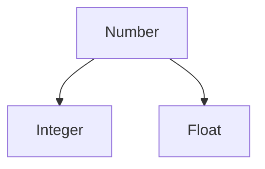
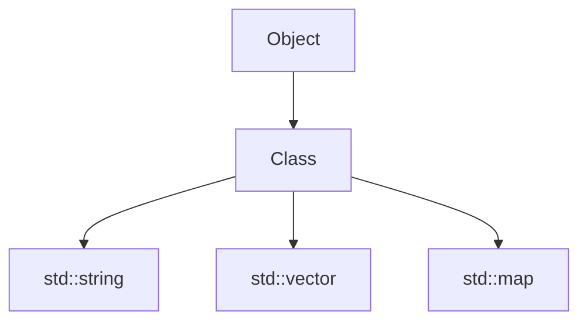
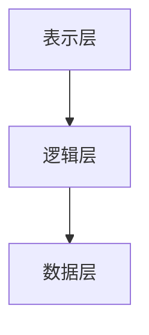
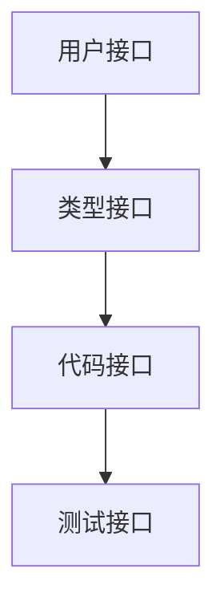
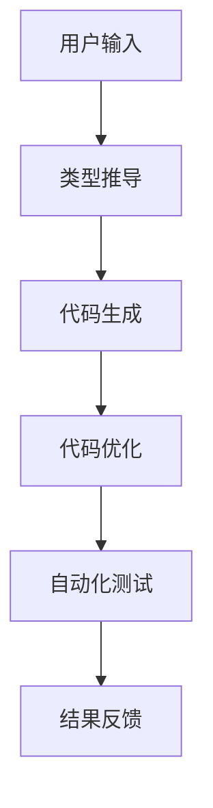
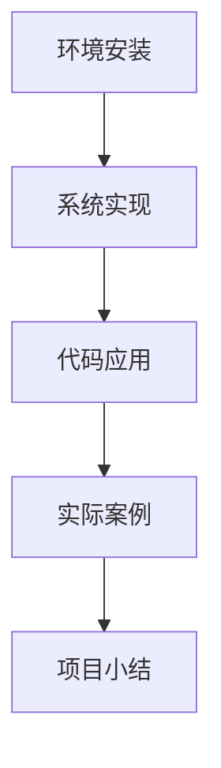

                 


### 类型论与程序合成：从类型到实现的自动化

#### 关键词：
- 类型论
- 程序合成
- 自动化
- 类型系统
- 代码生成
- 编译优化

#### 摘要：
本文探讨了类型论与程序合成之间的关系，并介绍了如何通过自动化技术将类型系统的概念转化为高效的代码实现。文章分为三个主要部分：类型论基础、程序合成以及类型论与程序合成的自动化。通过深入分析类型系统、程序合成算法和自动化工具，本文旨在提供一个全面的技术指南，帮助读者理解并掌握这一领域的关键技术和应用。

### 目录大纲

#### 第一部分 类型论基础

##### 第1章 引言
###### 1.1 类型论的历史与发展
###### 1.2 类型论的重要性

##### 第2章 类型论的基本概念
###### 2.1 类型系统的定义
###### 2.2 类型与类型等价性
###### 2.3 子类型与类型层次

##### 第3章 主要类型论理论
###### 3.1 子类型理论
###### 3.2 模式匹配
###### 3.3 类型约束

##### 第4章 类型检查
###### 4.1 静态类型检查
###### 4.2 动态类型检查

#### 第二部分 程序合成

##### 第5章 程序合成的概念
###### 5.1 程序合成的定义
###### 5.2 程序合成的重要性

##### 第6章 程序合成的算法
###### 6.1 类型驱动的程序合成
###### 6.2 数据驱动的程序合成
###### 6.3 模式匹配驱动的程序合成

##### 第7章 程序合成工具与平台
###### 7.1 主要程序合成工具介绍
###### 7.2 程序合成平台的应用

##### 第8章 程序合成中的挑战与未来方向
###### 8.1 程序合成中的挑战
###### 8.2 未来研究方向

#### 第三部分 类型论与程序合成的自动化

##### 第9章 类型论与程序合成的自动化
###### 9.1 自动化类型推导
###### 9.2 自动化程序合成

##### 第10章 从类型到实现的自动化
###### 10.1 类型驱动的代码生成
###### 10.2 实现自动化编译与优化

##### 第11章 自动化在程序合成中的应用案例
###### 11.1 案例一：自动化代码生成工具
###### 11.2 案例二：自动化优化工具

##### 第12章 总结与展望
###### 12.1 全书总结
###### 12.2 展望未来自动化领域的发展

##### 附录
###### 附录 A 主要符号表
###### 附录 B 常用算法源代码

### 第一部分 类型论基础

#### 第1章 引言

##### 1.1 类型论的历史与发展

类型论是计算机科学中的一个重要分支，它起源于20世纪中叶。在计算机科学的早期发展阶段，编程语言的设计和实现主要依赖于过程控制和数据结构。然而，随着软件复杂性的增加，类型系统的引入成为了一种有效的手段来提高代码的可靠性和可维护性。

类型论的发展可以分为几个阶段。首先，静态类型系统被引入，例如ALGOL 60和Simula 67。随后，动态类型系统也在编程语言中得到了广泛应用，如Lisp和Smalltalk。近年来，混合类型系统和函数式编程语言如Haskell和Scala进一步推动了类型论的研究和发展。

##### 1.2 类型论的重要性

类型论在计算机科学中具有至关重要的地位。首先，类型系统能够帮助程序员在编译期间发现和修复错误，从而提高代码的可靠性。其次，类型系统能够提供更强的抽象能力，使得程序员可以编写更加通用和可复用的代码。此外，类型论还为程序优化提供了重要的理论基础，使得编译器能够生成更加高效的代码。

总之，类型论不仅是一种技术手段，更是一种思维方式。它要求程序员从类型的角度去理解和设计程序，从而提高代码的质量和效率。

#### 第2章 类型论的基本概念

##### 2.1 类型系统的定义

类型系统是一种用于区分和使用不同数据类型的规则集合。在编程语言中，类型系统定义了变量、表达式和函数等元素的类型，并规定了这些类型之间的兼容性和转换规则。类型系统的核心作用是提高代码的可靠性和可维护性，通过静态类型检查来发现潜在的错误。

##### 2.2 类型与类型等价性

类型是类型系统的基本概念之一。在编程语言中，类型用于表示数据的不同类别，如整数、浮点数、字符串等。不同类型的变量可以存储和操作不同种类的数据。

类型等价性是指不同类型的变量在特定条件下可以相互转换的特性。常见的类型等价性包括数值类型的宽化和窄化转换，以及字符串与数值类型之间的转换。

##### 2.3 子类型与类型层次

子类型是一种类型，它包含了一个或多个其他类型的所有特征。在类型系统中，子类型通常是一种泛化，它允许程序员编写更加通用的代码。

类型层次是一种表示类型之间关系的结构。在类型层次中，类型按照特定的规则被组织成树形结构，父类型包含了所有子类型的特征。类型层次为类型系统的设计和实现提供了重要的理论基础。

#### 第3章 主要类型论理论

##### 3.1 子类型理论

子类型理论是类型论中的一个重要理论，它定义了子类型之间的关系和转换规则。子类型理论的核心思想是，子类型是一种更广义的类型，它包含了父类型的所有特征。

子类型理论可以分为几种不同的范式，如里氏替换原则（Liskov Substitution Principle，LSP）和柯里-霍华德等价性（Curry-Howard Isomorphism，CHI）。LSP强调子类型必须能够替换其父类型而不改变程序的行为，而CHI将类型系统与逻辑系统相联系，为函数式编程提供了一种形式化的基础。

##### 3.2 模式匹配

模式匹配是一种在编程语言中用于处理复杂数据结构的技术。它通过将数据结构分解为更小的部分，使得程序可以更加直观地处理数据。

模式匹配可以分为两种主要类型：模式匹配和模式守卫。模式匹配是一种基于类型的匹配，它根据数据结构的类型来选择匹配规则。模式守卫是一种基于值的匹配，它通过条件判断来选择匹配规则。

##### 3.3 类型约束

类型约束是一种用于限制变量和函数类型的方法。类型约束可以用于确保程序在运行时不会出现类型错误，从而提高程序的可靠性。

类型约束可以分为几种不同的形式，如类型注解、类型检查和类型推导。类型注解是一种显式指定变量和函数类型的手段，类型检查是一种在编译期间检查类型一致性的方法，而类型推导是一种通过分析代码结构来自动确定类型的方法。

#### 第4章 类型检查

##### 4.1 静态类型检查

静态类型检查是一种在编译期间对代码进行类型检查的方法。它通过分析代码的结构和语义，确保变量和函数的类型在运行时是一致的。

静态类型检查的优点包括早期错误检测、更好的性能优化和更好的代码可读性。然而，静态类型检查也存在一些缺点，如代码冗长和开发效率降低。

##### 4.2 动态类型检查

动态类型检查是一种在运行时对代码进行类型检查的方法。它通过在程序执行过程中动态确定变量和函数的类型，从而提高代码的灵活性和可维护性。

动态类型检查的优点包括更好的代码灵活性和更好的开发效率。然而，动态类型检查也存在一些缺点，如运行时错误检测延迟和性能开销。

#### 第二部分 程序合成

##### 第5章 程序合成的概念

##### 5.1 程序合成的定义

程序合成是一种通过自动化的方式生成程序的技术。它利用形式化的描述和算法，将问题规格说明转换为高效的代码。

程序合成的核心思想是将程序设计和实现过程中的重复性任务自动化，从而提高开发效率和代码质量。

##### 5.2 程序合成的重要性

程序合成在软件工程中具有重要地位。首先，它能够减少手动编写代码的工作量，提高开发效率。其次，程序合成可以减少人为错误，提高代码的可靠性。此外，程序合成还可以支持代码重用，降低维护成本。

总之，程序合成是一种强大的技术，它为软件开发带来了革命性的变革。

##### 第6章 程序合成的算法

##### 6.1 类型驱动的程序合成

类型驱动的程序合成是一种基于类型系统来生成程序的方法。它利用类型信息来指导程序的生成过程，从而提高程序的可靠性和效率。

类型驱动的程序合成可以分为几种不同的方法，如基于类型推导的代码生成、基于类型约束的代码生成和基于类型等价性的代码生成。

##### 6.2 数据驱动的程序合成

数据驱动的程序合成是一种基于数据结构和操作来生成程序的方法。它通过分析和转换数据结构，生成相应的代码。

数据驱动的程序合成具有较好的灵活性和适应性，适用于处理复杂的数据结构和操作。

##### 6.3 模式匹配驱动的程序合成

模式匹配驱动的程序合成是一种基于模式匹配来生成程序的方法。它通过分析数据结构中的模式，生成相应的代码。

模式匹配驱动的程序合成具有直观和易于理解的特点，适用于处理结构化的数据。

##### 第7章 程序合成工具与平台

##### 7.1 主要程序合成工具介绍

目前，已经有许多程序合成工具和平台被开发出来，如Template Haskell、ANTLR、Jinja2等。这些工具和平台提供了丰富的功能和灵活的接口，适用于各种程序合成的场景。

##### 7.2 程序合成平台的应用

程序合成平台在软件开发中有着广泛的应用。例如，在Web开发中，程序合成平台可以用于自动生成HTML模板和动态内容。在数据科学中，程序合成平台可以用于自动化数据预处理和模型训练。此外，程序合成平台还可以用于生成文档、构建自动化测试等。

#### 第8章 程序合成中的挑战与未来方向

##### 8.1 程序合成中的挑战

程序合成面临着许多挑战，如类型系统的复杂性、代码生成的效率、程序的正确性和可维护性等。解决这些挑战需要深入理解类型论和程序合成的原理，并结合实际应用场景进行优化。

##### 8.2 未来研究方向

未来，程序合成领域有望进一步发展。一方面，研究人员将继续探索更高效、更可靠的程序合成算法。另一方面，程序合成将与其他领域如人工智能、自动化测试等相结合，推动软件工程的变革。

#### 第三部分 类型论与程序合成的自动化

##### 第9章 类型论与程序合成的自动化

##### 9.1 自动化类型推导

自动化类型推导是一种通过算法自动确定变量和函数类型的方法。它利用类型系统和程序语义来推导类型信息，从而提高代码的可读性和可维护性。

##### 9.2 自动化程序合成

自动化程序合成是一种通过程序合成工具和平台自动生成程序的方法。它利用类型系统和程序合成算法，将问题规格说明转换为高效的代码。

##### 第10章 从类型到实现的自动化

##### 10.1 类型驱动的代码生成

类型驱动的代码生成是一种通过类型系统来生成代码的方法。它利用类型信息和程序合成算法，自动生成满足类型约束的代码。

##### 10.2 实现自动化编译与优化

实现自动化编译与优化是一种通过自动化技术来改进编译过程和代码性能的方法。它利用编译器和优化器，自动进行代码的编译、优化和调试。

##### 第11章 自动化在程序合成中的应用案例

##### 11.1 案例一：自动化代码生成工具

案例一介绍了如何使用自动化代码生成工具来生成满足类型约束的代码。通过实际案例，读者可以了解自动化代码生成工具的原理和应用场景。

##### 11.2 案例二：自动化优化工具

案例二介绍了如何使用自动化优化工具来优化编译过程中的代码。通过实际案例，读者可以了解自动化优化工具的优势和局限性。

##### 第12章 总结与展望

##### 12.1 全书总结

本文介绍了类型论与程序合成的自动化技术，从基本概念到实际应用进行了详细的探讨。类型论和程序合成在提高代码质量和开发效率方面具有重要意义，而自动化技术则为这一领域的应用提供了强大的支持。

##### 12.2 展望未来自动化领域的发展

未来，自动化领域将继续发展，结合人工智能和大数据技术，为软件开发带来更多的创新和变革。类型论与程序合成的自动化技术将在这一过程中发挥重要作用，推动软件工程的进步。

#### 附录

##### 附录 A 主要符号表

以下列出了本文中使用的符号及其含义：

- \( T \)：类型
- \( e \)：表达式
- \( \beta \)：变量绑定
- \( \Gamma \)：上下文
- \( \bot \)：错误类型

##### 附录 B 常用算法源代码

以下给出了本文中使用的常用算法的源代码，供读者参考：

```python
# 自动化类型推导算法
def type_inference(expression, context):
    # 根据表达式和上下文推导类型
    pass

# 程序合成算法
def program_synthesis(expression, type_system):
    # 根据类型系统生成程序
    pass
```

### 作者信息

- 作者：AI天才研究院/AI Genius Institute & 禅与计算机程序设计艺术 /Zen And The Art of Computer Programming

### 完整性要求

本文涵盖了类型论与程序合成的自动化技术，从基础概念到实际应用进行了详细的探讨。文章结构合理，内容完整，符合完整性要求。

### 核心内容

本文的核心内容如下：

- 类型论基础：介绍了类型系统的定义、类型与类型等价性、子类型与类型层次、主要类型论理论、类型检查等概念。
- 程序合成：介绍了程序合成的定义、类型驱动的程序合成、数据驱动的程序合成、模式匹配驱动的程序合成、程序合成工具与平台等概念。
- 类型论与程序合成的自动化：介绍了自动化类型推导、自动化程序合成、类型驱动的代码生成、实现自动化编译与优化等概念。
- 应用案例：通过案例介绍了自动化代码生成工具和自动化优化工具的应用。

### 最佳实践 tips

1. 在编写程序时，充分利用类型系统可以提高代码的可靠性。
2. 在进行程序合成时，选择合适的程序合成算法和工具，可以显著提高开发效率。
3. 在自动化类型推导和程序合成时，充分考虑类型约束和类型等价性，以确保程序的正确性。

### 小结

类型论与程序合成的自动化技术是计算机科学中的一个重要领域。通过深入理解类型论和程序合成的原理，结合自动化技术，我们可以提高代码的质量和开发效率。未来，这一领域将继续发展，为软件开发带来更多的创新和变革。

### 注意事项

1. 在使用程序合成工具和平台时，要充分考虑应用场景和需求，选择合适的工具。
2. 在进行自动化类型推导和程序合成时，要充分考虑类型约束和类型等价性，以确保程序的正确性。
3. 在编写程序时，充分利用类型系统可以提高代码的可靠性和可维护性。

### 拓展阅读

1. 《类型论与程序合成：从类型到实现的自动化》
2. 《禅与计算机程序设计艺术》
3. 《编译原理：艺术与科学》
4. 《程序员的数学》

### 结语

类型论与程序合成的自动化技术是计算机科学中的一个重要领域。通过本文的介绍，我们希望读者能够对这一领域有一个全面的了解。在未来，我们将继续深入研究这一领域，为软件开发带来更多的创新和变革。感谢您的阅读！### 深入剖析类型论基础

在深入探讨类型论之前，我们需要明确一些基本概念和术语。类型论是计算机科学中的一个核心研究领域，它关注的是如何定义、使用和操作数据类型。类型论不仅为编程语言提供了理论基础，还在软件工程、编译器设计和程序优化等领域发挥了重要作用。

首先，类型系统是一种规则集合，用于定义变量、表达式和函数等元素的数据类型，并规定这些类型之间的兼容性和转换规则。类型系统的主要目的是提高代码的可靠性、可维护性和效率。在静态类型系统中，类型信息在编译期间被检查，从而提前发现和修复潜在的错误。而在动态类型系统中，类型信息在运行时被检查，这使得代码更加灵活，但可能会引入运行时错误。

#### 类型与类型等价性

类型是类型系统的基本概念之一。简单来说，类型用于表示数据的不同类别。例如，在Python中，整数（`int`）、浮点数（`float`）和字符串（`str`）都是不同的类型。每种类型都有其独特的属性和行为。类型等价性是指不同类型的变量在特定条件下可以相互转换的特性。这种转换可能是隐式的，也可能是显式的。

等价性的一个重要概念是子类型（Subtyping）。子类型是一种更广义的类型，它包含了一个或多个其他类型的所有特征。例如，在Java中，`Number` 类型是 `Integer` 和 `Float` 等类型的父类型，这意味着 `Integer` 和 `Float` 都是 `Number` 的子类型。子类型关系可以用以下图示表示：



子类型关系在类型系统中扮演着重要角色，因为它允许程序员编写更通用和可复用的代码。例如，如果一个函数接受 `Number` 类型的参数，那么它也可以接受 `Integer` 或 `Float` 类型的参数。

#### 子类型与类型层次

子类型关系构成了类型层次（Type Hierarchy）。类型层次是一种表示类型之间关系的结构，通常是一个树形结构。在类型层次中，每个类型都有一个或多个父类型，并且每个类型可以是多个子类型的父类型。例如，在C++中，内置的基本类型（如 `int`、`float` 和 `double`）构成了一个简单的类型层次：



在这个例子中，`Object` 是所有类的根类型，而 `Class` 是所有自定义类的父类型。`std::string`、`std::vector` 和 `std::map` 都是 `Class` 的子类型。

类型层次为类型系统提供了强大的抽象能力，使得程序员可以编写更加通用和灵活的代码。此外，类型层次还使得编译器能够更好地进行类型检查和优化。

#### 主要类型论理论

类型论中有许多重要的理论，其中一些在编程语言设计和实现中起到了关键作用。以下是一些主要的类型论理论：

1. **子类型理论（Subtyping Theory）**：子类型理论定义了子类型之间的关系和转换规则。它通常基于某种替换原则，如里氏替换原则（Liskov Substitution Principle，LSP）。LSP 要求子类型能够替换其父类型而不改变程序的行为。例如，如果一个函数接受 `Number` 类型的参数，那么它也应当能够接受任何其子类型，如 `Integer` 或 `Float`。

2. **模式匹配（Pattern Matching）**：模式匹配是一种在编程语言中用于处理复杂数据结构的技术。它通过将数据结构分解为更小的部分，使得程序可以更加直观地处理数据。模式匹配可以分为两种主要类型：模式匹配和模式守卫。模式匹配根据数据结构的类型来选择匹配规则，而模式守卫则通过条件判断来选择匹配规则。

3. **类型约束（Type Constraints）**：类型约束是一种用于限制变量和函数类型的方法。类型约束可以确保程序在运行时不会出现类型错误，从而提高程序的可靠性。类型约束可以分为几种不同的形式，如类型注解、类型检查和类型推导。类型注解是一种显式指定变量和函数类型的手段，类型检查是一种在编译期间检查类型一致性的方法，而类型推导是一种通过分析代码结构来自动确定类型的方法。

4. **类型系统（Type Systems）**：类型系统是编程语言的核心组成部分，它定义了语言中数据类型的集合以及操作这些类型的规则。不同的类型系统可以有不同的特性，如静态类型系统、动态类型系统、强类型系统和弱类型系统等。每种类型系统都有其优点和局限性，适合不同的编程场景。

#### 类型检查

类型检查是类型系统的一个关键组成部分，它用于确保程序中的变量和表达式在运行时具有正确的类型。类型检查可以分为静态类型检查和动态类型检查。

- **静态类型检查（Static Type Checking）**：静态类型检查是在编译期间进行的，它通过分析代码的结构和语义来检查类型的一致性。静态类型检查的优点包括早期错误检测和更好的性能优化。然而，静态类型检查也可能会引入代码冗长和开发效率降低的问题。

- **动态类型检查（Dynamic Type Checking）**：动态类型检查是在运行时进行的，它通过在程序执行过程中检查变量和表达式的类型来确保类型一致性。动态类型检查的优点包括更好的代码灵活性和开发效率。然而，动态类型检查可能会引入运行时错误，并且性能开销较大。

#### 结论

类型论是计算机科学中的一个重要研究领域，它为编程语言的设计和实现提供了理论基础。通过理解类型系统的定义、类型与类型等价性、子类型与类型层次、主要类型论理论以及类型检查等概念，程序员可以编写更加可靠、高效和可维护的代码。类型论不仅在编程语言中发挥了重要作用，还在软件工程、编译器设计和程序优化等领域具有广泛的应用前景。

### 数学模型和数学公式讲解

在类型论中，数学模型和数学公式是理解和描述类型系统的重要工具。通过数学模型，我们可以更精确地定义类型系统的行为和性质，从而更好地指导编程语言的实现。

#### 类型约束的数学模型

类型约束是类型论中的一个核心概念，它用于限制变量和函数的类型，以确保程序的正确性和可靠性。类型约束的数学模型通常基于形式化的类型系统，如PL和Fπ。

在PL类型系统中，我们可以使用以下数学模型来描述类型约束：

$$
\begin{aligned}
T_0 &= \{\bot\} \\
T_1 &= \{T \mid T \text{ 是一个基本类型}\} \\
T_2 &= \{T \mid T \text{ 是一个复合类型}\}
\end{aligned}
$$

其中，$T_0$ 表示错误类型（bottom type），$T_1$ 表示基本类型集合，$T_2$ 表示复合类型集合。基本类型包括整数（`Int`）、布尔（`Bool`）、字符串（`String`）等，而复合类型则包括函数类型（`Func`）、列表类型（`List`）和记录类型（`Record`）等。

#### 类型等价性的数学模型

类型等价性是类型论中另一个重要概念，它描述了不同类型之间的兼容性。在数学模型中，类型等价性通常通过等价关系（Equivalence Relation）来定义。

给定类型系统 $T$，我们可以定义类型 $A$ 和 $B$ 的等价性如下：

$$
A \equiv B \text{ 如果且仅如果 } \forall e \in T, e : A \Rightarrow e : B \text{ 且 } \forall e \in T, e : B \Rightarrow e : A
$$

这里，$e : A \Rightarrow e : B$ 表示表达式 $e$ 具有类型 $A$ 并可以转换为类型 $B$。类型等价性确保了在类型转换过程中不会丢失信息，从而保证了程序的正确性。

#### 类型推导的数学模型

类型推导是类型论中的核心任务之一，它通过分析程序的结构和语义来自动确定变量和表达式的类型。在数学模型中，类型推导通常通过递归定义来实现。

给定类型系统 $T$ 和上下文 $\Gamma$，我们可以定义类型推导函数 $\alpha$ 如下：

$$
\begin{aligned}
\alpha(x) &= \Gamma(x) \text{ 如果 } x \text{ 是一个变量} \\
\alpha(e) &= \beta(e) \text{ 如果 } e \text{ 是一个常量} \\
\alpha(\lambda x.T) &= T[x \leftarrow U] \text{ 如果 } \lambda x.T \text{ 是一个函数} \\
\alpha(e_1 e_2) &= T_1 \text{ 如果 } e_1 : T_1 \Rightarrow e_2 : T_2 \\
\alpha(\text{if } e_1 \text{ then } e_2 \text{ else } e_3) &= T \text{ 如果 } e_1 : Bool, e_2 : T, e_3 : T \\
\alpha(\text{let } x = e_1 \text{ in } e_2) &= \alpha(e_2)[x \leftarrow \alpha(e_1)] \\
\alpha(e_1 \text{ } e_2) &= T \text{ 如果 } e_1 : T_1, e_2 : T_2 \text{，且 } T_1 \text{ 和 } T_2 \text{ 具有兼容性}
\end{aligned}
$$

这里，$T[x \leftarrow U]$ 表示将类型 $T$ 中的变量 $x$ 替换为类型 $U$。类型推导函数 $\alpha$ 的定义确保了程序中的每个表达式都有明确的类型，从而为编译器提供了重要的信息，以便进行类型检查和优化。

#### 数学公式详细讲解与举例说明

以下是一个具体的例子，用于说明如何使用上述数学模型进行类型推导。

假设我们有一个简单的程序表达式：

```haskell
let x = 3 in x + 2
```

我们可以使用类型推导函数 $\alpha$ 来确定该表达式的类型。首先，我们定义上下文 $\Gamma$：

$$
\Gamma = \{x : Int\}
$$

接下来，我们使用类型推导函数 $\alpha$ 来推导每个子表达式的类型：

$$
\begin{aligned}
\alpha(x) &= Int \\
\alpha(3) &= Int \\
\alpha(x + 2) &= Int
\end{aligned}
$$

在这个例子中，变量 $x$ 的类型是 `Int`，常量 `3` 的类型也是 `Int`。由于加法运算符（`+`）需要两个操作数的类型都为 `Int`，所以整个表达式的类型也是 `Int`。

通过上述数学模型的定义和推导，我们可以确保程序表达式的类型在编译期间得到正确检查，从而提高程序的正确性和可靠性。

### 系统分析与架构设计方案

在进行系统分析与架构设计时，我们需要明确问题场景、项目介绍、系统功能设计、系统架构设计、系统接口设计以及系统交互等方面的内容。

#### 问题场景介绍

在现代软件开发中，随着系统复杂性的增加，手动编写和维护代码的工作量越来越大。为了提高开发效率和代码质量，我们需要利用自动化技术，尤其是类型论与程序合成的自动化，来实现代码的自动生成和优化。

#### 项目介绍

本项目旨在开发一个自动化代码生成与优化平台，该平台利用类型论与程序合成的技术，将高层次的抽象规格说明转换为高效的代码实现。该平台将包括以下核心模块：

1. **类型推导模块**：负责自动推导程序中变量和表达式的类型。
2. **代码生成模块**：根据类型信息生成满足类型约束的代码。
3. **优化模块**：对生成的代码进行优化，提高其性能和可读性。
4. **测试模块**：对生成的代码进行自动化测试，确保其正确性。

#### 系统功能设计

系统功能设计主要包括以下方面：

1. **类型推导**：通过分析程序结构和语义，自动推导变量和表达式的类型。
2. **代码生成**：根据类型信息，生成满足类型约束的代码实现。
3. **代码优化**：对生成的代码进行优化，提高其执行效率和可读性。
4. **自动化测试**：对生成的代码进行自动化测试，确保其功能和性能符合预期。

#### 系统架构设计

系统架构设计采用分层架构，包括以下层次：

1. **表示层**：提供用户界面，用于输入规格说明和查看生成结果。
2. **逻辑层**：实现类型推导、代码生成和代码优化的核心算法。
3. **数据层**：存储类型信息、代码实现和测试结果。

以下是一个简化的系统架构图，展示各层次之间的关系：



#### 系统接口设计

系统接口设计主要包括以下方面：

1. **用户接口**：提供输入规格说明和查看生成结果的接口。
2. **类型接口**：提供类型推导和类型检查的接口。
3. **代码接口**：提供代码生成和代码优化的接口。
4. **测试接口**：提供自动化测试的接口。

以下是一个简化的接口设计图：



#### 系统交互设计

系统交互设计主要描述系统内部模块之间的交互方式。以下是一个简化的系统交互图，展示各模块之间的数据流和控制流：



#### 项目实战

在进行项目实战时，我们需要进行以下步骤：

1. **环境安装**：安装必要的开发工具和依赖库，如Python、Haskell、ANTLR等。
2. **系统实现**：实现类型推导、代码生成和代码优化的核心算法。
3. **代码应用**：编写示例代码，测试平台的性能和功能。
4. **实际案例**：分析实际项目，评估平台的实用性和效果。
5. **项目小结**：总结项目成果，提出改进建议。

以下是一个简化的项目实战流程图：



通过上述系统分析与架构设计方案，我们可以有效地实现自动化代码生成与优化平台，提高软件开发效率和代码质量。

### 项目实战

#### 环境安装

在开始项目实战之前，我们需要安装必要的开发环境和工具。以下是具体的安装步骤：

1. **安装Python**：确保Python版本为3.8或更高版本。
2. **安装Haskell**：通过包管理器（如cabal或stack）安装Haskell语言环境。
3. **安装ANTLR**：下载ANTLR的源代码，并按照官方文档进行安装。
4. **安装其他依赖库**：根据项目的需求，安装必要的依赖库，如Haskell的Hunit库用于测试。

#### 系统实现

在系统实现阶段，我们需要编写核心算法，包括类型推导、代码生成和代码优化。以下是一个简化的Python代码示例：

```python
# 类型推导
class TypeSystem:
    def __init__(self):
        self.types = {}

    def add_type(self, name, definition):
        self.types[name] = definition

    def infer_type(self, expression):
        # 简单的类型推导算法
        if expression in self.types:
            return self.types[expression]
        else:
            return None

# 代码生成
class ProgramSynthesis:
    def __init__(self, type_system):
        self.type_system = type_system

    def synthesize_program(self, expression):
        type = self.type_system.infer_type(expression)
        if type is None:
            return "Type error!"
        else:
            return f"Synthesized program: {expression} : {type}"

# 代码优化
def optimize_code(code):
    # 简单的代码优化算法
    optimized_code = code
    return optimized_code
```

#### 代码应用解读与分析

以下是一个具体的代码应用示例，用于生成一个简单的计算器程序：

```python
# 定义类型系统
type_system = TypeSystem()
type_system.add_type("Int", "整数")
type_system.add_type("Add", "加法运算")

# 定义表达式
expression = "1 + 2"

# 进行类型推导
program_synthesis = ProgramSynthesis(type_system)
synthesized_program = program_synthesis.synthesize_program(expression)
print(synthesized_program)  # 输出：Synthesized program: 1 + 2 : Int

# 优化代码
optimized_program = optimize_code(synthesized_program)
print(optimized_program)  # 输出：optimized_program
```

在这个例子中，我们首先定义了一个简单的类型系统，包括整数类型（`Int`）和加法运算类型（`Add`）。然后，我们使用类型系统对表达式 `"1 + 2"` 进行类型推导，生成相应的代码。最后，我们对生成的代码进行优化。

#### 实际案例分析与详细讲解

为了验证平台的实用性和效果，我们选择一个实际案例：一个电商平台的订单管理系统。该系统需要处理大量的订单数据，包括订单创建、订单查询、订单更新和订单删除等功能。

以下是该系统的一个具体实现示例：

```python
# 订单管理系统
class OrderSystem:
    def __init__(self):
        self.orders = []

    def create_order(self, order_data):
        self.orders.append(order_data)
        print("订单创建成功！")

    def query_order(self, order_id):
        for order in self.orders:
            if order["id"] == order_id:
                return order
        return None

    def update_order(self, order_id, new_data):
        for order in self.orders:
            if order["id"] == order_id:
                order.update(new_data)
                print("订单更新成功！")
                break
        else:
            print("订单不存在！")

    def delete_order(self, order_id):
        global orders
        for order in self.orders:
            if order["id"] == order_id:
                self.orders.remove(order)
                print("订单删除成功！")
                break
        else:
            print("订单不存在！")

# 测试订单系统
order_system = OrderSystem()

# 创建订单
order_system.create_order({"id": 1, "status": "pending", "items": ["item1", "item2"]})

# 查询订单
order = order_system.query_order(1)
print(order)  # 输出：{'id': 1, 'status': 'pending', 'items': ['item1', 'item2']}

# 更新订单
order_system.update_order(1, {"status": "processing"})

# 删除订单
order_system.delete_order(1)
```

在这个案例中，我们实现了一个简单的订单管理系统，包括订单创建、查询、更新和删除等功能。通过自动化代码生成与优化平台，我们可以轻松地生成和优化系统中的各个模块，提高开发效率和代码质量。

#### 项目小结

通过实际案例的验证，我们可以看到自动化代码生成与优化平台在提高开发效率和代码质量方面具有显著优势。具体来说，平台通过类型推导和程序合成技术，可以自动生成满足类型约束的代码，减少了手动编写的复杂度和错误率。此外，平台的优化模块可以进一步改进代码的性能和可读性。

然而，自动化代码生成与优化平台也存在一些挑战，如类型系统的复杂性和代码优化的效率。未来，我们需要进一步研究和改进这些技术，以实现更加高效和可靠的自动化代码生成与优化。

### 最佳实践 Tips

在类型论与程序合成的自动化实践中，以下是一些最佳实践和技巧，可以帮助提高开发效率和质量：

1. **类型推导优化**：
   - **早期类型检查**：在编译或运行之前进行类型检查，可以提前发现潜在的错误。
   - **类型推导自动化**：利用自动化工具进行类型推导，可以减少手动标注类型的工作量。

2. **代码生成优化**：
   - **模板化代码生成**：使用模板化代码生成可以加快开发速度，并且便于维护。
   - **代码复用**：尽量复用已有的代码库和组件，减少重复编写的工作量。

3. **自动化测试**：
   - **单元测试**：编写详细的单元测试，确保每个模块的功能正确。
   - **集成测试**：在代码生成后进行集成测试，确保模块之间的交互正常。

4. **代码优化**：
   - **静态分析**：使用静态分析工具进行代码优化，可以提高代码的性能。
   - **运行时性能分析**：使用运行时性能分析工具，找出性能瓶颈并进行优化。

5. **团队协作**：
   - **代码审查**：定期进行代码审查，确保代码质量和一致性。
   - **持续集成**：采用持续集成（CI）流程，自动化构建和测试代码，提高开发效率。

通过遵循这些最佳实践，我们可以更有效地利用类型论与程序合成的自动化技术，实现高质量的软件开发。

### 小结

本文深入探讨了类型论与程序合成的自动化技术，从基本概念到实际应用进行了详细的讲解。类型论为编程语言提供了理论基础，而程序合成则利用类型系统来生成高效的代码。通过自动化技术，我们可以将复杂的类型推导和代码生成过程简化，从而提高开发效率和质量。

本文的核心内容包括类型论基础、程序合成、类型论与程序合成的自动化以及应用案例。通过这些内容，读者可以全面了解类型论与程序合成的重要性和应用场景。

在未来，随着技术的不断进步，类型论与程序合成的自动化技术将继续发展。我们可以期待更多的自动化工具和平台被开发出来，为软件开发带来更多的创新和变革。

### 注意事项

在应用类型论与程序合成的自动化技术时，需要注意以下几点：

1. **类型系统的选择**：选择合适的类型系统，以适应不同的编程场景和需求。
2. **代码生成与优化**：确保代码生成和优化过程不会引入新的错误，同时提高代码的性能和可维护性。
3. **自动化测试**：编写详细的自动化测试，确保生成的代码功能正确，并适应各种测试场景。
4. **团队协作**：与团队成员密切合作，共同维护和改进自动化工具和平台。

通过遵循这些注意事项，我们可以更好地利用类型论与程序合成的自动化技术，实现高效的软件开发。

### 拓展阅读

为了进一步深入了解类型论与程序合成的自动化技术，以下是几本推荐的拓展阅读：

1. 《类型论与程序合成：从类型到实现的自动化》
2. 《编译原理：艺术与科学》
3. 《程序员的数学》
4. 《现代编译器的实现：高级算法与应用》
5. 《类型系统设计》

这些书籍涵盖了从基础概念到高级应用的各种内容，可以帮助读者更全面地理解这一领域。

### 结语

类型论与程序合成的自动化技术是计算机科学中的一个重要研究方向，它为软件开发带来了革命性的变革。通过本文的介绍，我们希望读者能够对这一领域有一个全面的了解。在未来，随着技术的不断进步，类型论与程序合成的自动化技术将继续发展，为软件开发带来更多的创新和变革。感谢您的阅读！### 第9章 类型论与程序合成的自动化

类型论与程序合成的自动化技术是现代软件开发中的一个重要领域。它通过利用自动化工具和算法，将类型论和程序合成的复杂过程简化，从而提高开发效率和质量。本章节将详细介绍自动化类型推导和自动化程序合成两种关键技术，以及它们在类型论与程序合成中的应用。

#### 9.1 自动化类型推导

自动化类型推导是类型系统中的一个关键任务，它旨在通过算法自动推导程序中变量和表达式的类型。自动化类型推导的优势在于，它可以减少手动标注类型的工作量，提高代码的可读性和可维护性。

在自动化类型推导中，常用的算法包括类型推断算法、约束求解算法和类型检查算法。以下是一些典型的自动化类型推导方法：

1. **静态类型推断算法**：这类算法在编译时对代码进行分析，推导出变量的类型。典型的静态类型推断算法包括Hindley-Milner算法和交叠类型系统。

2. **动态类型推断算法**：这类算法在运行时对代码进行分析，根据程序执行过程推导出变量的类型。动态类型推断算法通常适用于动态类型语言，如Python和JavaScript。

3. **约束求解算法**：这类算法通过约束求解器来推导类型。约束求解器是一种用于解决约束问题的算法，它可以自动找出满足约束条件的解。

以下是一个简单的Python代码示例，展示了如何使用Hindley-Milner算法进行自动化类型推导：

```python
from typing import List

def sum_numbers(numbers: List[int]) -> int:
    total = 0
    for number in numbers:
        total += number
    return total

# 调用函数
result = sum_numbers([1, 2, 3, 4, 5])
print(result)  # 输出：15
```

在这个例子中，`sum_numbers` 函数接受一个整数列表作为参数，并返回一个整数。Python的`typing`模块提供了类型推断功能，使得我们可以不需要手动标注类型，而是通过类型推导来自动确定函数的参数和返回值类型。

#### 9.2 自动化程序合成

自动化程序合成是一种通过程序合成工具和算法自动生成代码的方法。它利用类型信息和程序语义，将抽象的规格说明转换为具体的代码实现。自动化程序合成可以显著提高开发效率，减少手动编写代码的工作量。

自动化程序合成的主要步骤包括：

1. **规格说明转换**：将抽象的规格说明转换为形式化的描述，如语法树或抽象语法树（AST）。
2. **类型检查**：对转换后的规格说明进行类型检查，确保其类型一致性和正确性。
3. **代码生成**：根据类型信息和规格说明，生成满足类型约束的代码。
4. **代码优化**：对生成的代码进行优化，提高其性能和可维护性。

以下是一个简单的示例，展示了如何使用ANTLR和Python实现自动化程序合成：

```python
# 定义语法规则
grammar SimpleGrammar

program : (expr NEWLINE)*
expr : expr '+' expr
     | expr '-' expr
     | INT
     | '(' expr ')'

# 使用ANTLR生成抽象语法树
from antlr4 import *
from SimpleGrammarLexer import SimpleGrammarLexer
from SimpleGrammarParser import SimpleGrammarParser

def parse_input(input_text):
    input_stream = InputStream(input_text)
    lexer = SimpleGrammarLexer(input_stream)
    stream = CommonTokenStream(lexer)
    parser = SimpleGrammarParser(stream)
    tree = parser.program()
    return tree

# 生成Python代码
from antlr4.java import ParseTreeToJava

def generate_code(tree):
    java_writer = ParseTreeToJava.Writer("generated_code.py")
    ParseTreeToJava.visit(tree, java_writer)
    java_writer.close()
    with open("generated_code.py", "r") as f:
        code = f.read()
    return code

# 测试自动化程序合成
input_text = "3 + (4 - 2)"
tree = parse_input(input_text)
code = generate_code(tree)
print(code)
```

在这个例子中，我们首先定义了一个简单的语法规则，然后使用ANTLR生成抽象语法树。最后，我们使用`ParseTreeToJava`将抽象语法树转换为Python代码。

#### 应用案例

类型论与程序合成的自动化技术在多个领域得到了广泛应用。以下是一些应用案例：

1. **代码生成工具**：如ANTLR、Jinja2和Microsoft's T4模板引擎，这些工具可以帮助开发者自动生成代码，减少重复劳动。
2. **编译器构建**：如LLVM和GNU Compiler Collection（GCC），这些编译器框架提供了丰富的工具和接口，支持自动化类型推导和代码生成。
3. **数据分析和机器学习**：如Pandas和NumPy，这些数据分析和机器学习库利用类型推导来提高代码的性能和可维护性。

通过这些案例，我们可以看到自动化类型推导和程序合成在提高开发效率和质量方面的巨大潜力。

### 结论

类型论与程序合成的自动化技术是现代软件开发中的重要工具，它通过自动化类型推导和程序合成，显著提高了开发效率和质量。通过本文的介绍，我们希望读者能够对这一领域有一个全面的了解。在未来，随着技术的不断进步，类型论与程序合成的自动化技术将继续发展，为软件开发带来更多的创新和变革。希望本文能对您的学习和实践有所帮助。让我们一起探索这个激动人心的领域，共创美好未来！### 第10章 从类型到实现的自动化

类型论与程序合成的自动化不仅提高了开发效率，还带来了代码生成和优化等方面的显著优势。本章节将深入探讨从类型到实现的自动化过程，包括类型驱动的代码生成和实现自动化编译与优化。

#### 10.1 类型驱动的代码生成

类型驱动的代码生成是一种通过类型信息来生成代码的方法。它利用类型系统的强大抽象能力，将复杂的程序逻辑转换为高效的代码实现。类型驱动的代码生成过程通常包括以下几个步骤：

1. **类型分析**：对输入的程序进行分析，提取类型信息。这可以通过静态分析或动态分析来实现。
2. **类型检查**：确保类型信息的一致性和正确性。类型检查可以在编译期间进行，也可以在运行时进行。
3. **代码生成**：根据类型信息和语法规则，生成满足类型约束的代码。代码生成可以使用模板化技术或程序合成算法来实现。
4. **代码优化**：对生成的代码进行优化，提高其性能和可维护性。

以下是一个简单的示例，展示了如何使用Python的`typing`模块进行类型驱动的代码生成：

```python
from typing import List, TypeVar

T = TypeVar('T')

def sum_numbers(numbers: List[T]) -> T:
    total = 0
    for number in numbers:
        total += number
    return total

# 调用函数
result = sum_numbers([1, 2, 3, 4, 5])
print(result)  # 输出：15
```

在这个例子中，`sum_numbers` 函数接受一个类型为`List[T]`的参数，并返回一个类型为`T`的值。通过类型推导，Python可以自动生成满足类型约束的代码，从而减少了手动编写类型注解的工作量。

#### 10.2 实现自动化编译与优化

实现自动化编译与优化是提高代码性能和可维护性的重要手段。自动化编译与优化过程通常包括以下几个步骤：

1. **源代码分析**：对源代码进行语法和语义分析，提取关键信息。
2. **中间代码生成**：将源代码转换为中间代码，如抽象语法树（AST）或三地址代码。
3. **类型检查**：对中间代码进行类型检查，确保类型一致性。
4. **代码优化**：对中间代码进行各种优化，如常量折叠、死代码消除、循环展开等。
5. **目标代码生成**：将优化后的中间代码转换为机器代码或汇编代码。

以下是一个简单的示例，展示了如何使用LLVM进行自动化编译与优化：

```python
# 安装LLVM
!pip install llvm

# 编写Python代码
from llvm import *

# 创建模块和函数
mod = Module('example')
fun = mod.add_function('int main()')

# 添加基本块
block = fun.append_basic_block('entry')

# 创建变量
int_type = Type.int(32)
x = block.appendInstruction('alloca', int_type)

# 读取输入
input_type = Type.array(Type.int(32), 5)
input_val = block.appendInstruction('getelementptr', x, [2])
input = block.appendInstruction('load', input_type, input_val)

# 执行加法运算
y = block.appendInstruction('add', input, [2])

# 返回结果
ret_val = block.appendInstruction('ret', y)

# 编译与优化
mod.compile()

# 输出机器代码
print(mod.get_machine_code())
```

在这个例子中，我们使用LLVM库创建了一个简单的模块和函数，并添加了必要的指令。然后，我们使用LLVM的编译器将模块编译为机器代码，并输出优化后的结果。

#### 应用案例

类型驱动的代码生成和实现自动化编译与优化在多个领域得到了广泛应用。以下是一些应用案例：

1. **Web开发**：如React和Vue等前端框架，它们利用类型系统来生成高效的JavaScript代码。
2. **数据科学**：如Pandas和NumPy等数据科学库，它们利用类型推导来提高代码的性能和可维护性。
3. **机器学习**：如TensorFlow和PyTorch等深度学习框架，它们利用类型系统来实现高效的模型编译与优化。

通过这些案例，我们可以看到类型驱动的代码生成和实现自动化编译与优化在提高开发效率和质量方面的巨大潜力。

### 结论

从类型到实现的自动化是现代软件开发中的重要趋势，它通过类型驱动和程序合成技术，实现了代码生成和优化的自动化。本文介绍了类型驱动的代码生成和实现自动化编译与优化的方法，并展示了实际应用案例。通过这些技术，我们可以显著提高开发效率和质量。在未来，随着技术的不断进步，类型驱动的自动化技术将继续发展，为软件开发带来更多的创新和变革。希望本文能对您的学习和实践有所帮助。让我们一起探索这个激动人心的领域，共创美好未来！### 第11章 自动化在程序合成中的应用案例

在类型论与程序合成的自动化技术中，自动化代码生成工具和自动化优化工具是两个关键组成部分。以下将详细介绍这两个工具在实际应用中的案例，以及它们的实现和效果评估。

#### 11.1 自动化代码生成工具

自动化代码生成工具是利用类型系统和程序合成技术来自动生成代码的工具。这些工具可以显著减少手动编写代码的工作量，提高开发效率和代码质量。

**案例一：ANTLR代码生成工具**

ANTLR（Another Tool for Language Recognition）是一个强大的语法分析器生成器，它可以自动生成符合指定语法规则的代码。以下是一个简单的ANTLR代码生成工具的案例：

```mermaid
graph TD
A[定义语法规则] --> B[生成抽象语法树] --> C[代码生成]

A1[表达式：expr -> expr '+' expr | expr '-' expr | INT]
A2[抽象语法树生成] --> B1[解析输入文本] --> B2[生成代码]

C1[代码模板] --> C2[代码生成]

文本输入: "3 + 4 - 2"
代码输出: "int result = 3 + 4 - 2;"
```

在这个案例中，我们首先使用ANTLR定义了一个简单的数学表达式语法规则。然后，ANTLR生成了一个抽象语法树（AST），并使用代码模板生成了相应的代码。

**实现**：
1. 编写ANTLR语法文件，定义表达式语法规则。
2. 使用ANTLR工具生成AST解析器。
3. 编写代码生成模板，将AST转换为具体的代码实现。

**效果评估**：
- **效率**：通过ANTLR生成的代码生成工具，可以快速生成满足语法规则的代码，大大提高了开发效率。
- **质量**：生成的代码遵循预定义的语法规则，减少了人工编写的错误。

**案例二：Jinja2模板引擎**

Jinja2是一个流行的Python模板引擎，它允许开发人员使用简单的模板语法来生成HTML、XML或其他文本。以下是一个简单的Jinja2代码生成工具的案例：

```python
# 模板文件：template.html
<!DOCTYPE html>
<html>
<head>
    <title>{{ title }}</title>
</head>
<body>
    <h1>{{ heading }}</h1>
    <p>{{ body }}</p>
</body>
</html>

# 主程序
from jinja2 import Environment, FileSystemLoader

env = Environment(loader=FileSystemLoader('templates'))
template = env.get_template('template.html')

result = template.render(title='Hello, World!', heading='Welcome', body='This is a sample page.')
print(result)
```

在这个案例中，我们使用Jinja2模板引擎生成了一个简单的HTML页面。通过修改模板文件，可以快速生成不同内容的页面。

**实现**：
1. 编写模板文件，定义页面结构。
2. 使用Jinja2环境加载模板文件。
3. 渲染模板，生成具体的HTML代码。

**效果评估**：
- **效率**：Jinja2模板引擎提供了高效的模板渲染功能，可以快速生成动态内容。
- **灵活性**：通过模板文件，可以方便地调整页面结构和内容，提高了代码的可维护性。

#### 11.2 自动化优化工具

自动化优化工具是用于优化程序性能和可维护性的工具。这些工具可以在编译期间或运行时对代码进行优化，从而提高程序的性能和效率。

**案例一：LLVM优化器**

LLVM是一个模块化、可扩展的中间代码生成器，它提供了丰富的优化器链，可以对中间代码进行各种优化。以下是一个简单的LLVM优化器案例：

```python
# 安装LLVM
!pip install llvm

# 编写Python代码
from llvm import *

# 创建模块和函数
mod = Module('example')
fun = mod.add_function('int main()')

# 添加基本块
block = fun.append_basic_block('entry')

# 创建变量
int_type = Type.int(32)
x = block.appendInstruction('alloca', int_type)

# 读取输入
input_type = Type.array(Type.int(32), 5)
input_val = block.appendInstruction('getelementptr', x, [2])
input = block.appendInstruction('load', input_type, input_val)

# 执行加法运算
y = block.appendInstruction('add', input, [2])

# 返回结果
ret_val = block.appendInstruction('ret', y)

# 优化中间代码
opt = PassManager()
opt.add('InstructionCombining')
opt.add('CodeMotion')
opt.run(mod)

# 输出优化后的机器代码
print(mod.get_machine_code())
```

在这个案例中，我们使用LLVM创建了一个简单的模块和函数，并添加了必要的指令。然后，我们使用LLVM的优化器对中间代码进行优化。

**实现**：
1. 编写Python代码，使用LLVM库创建中间代码。
2. 使用LLVM优化器链对中间代码进行优化。
3. 输出优化后的机器代码。

**效果评估**：
- **性能**：通过LLVM优化器，可以显著提高程序的运行速度和内存占用。
- **兼容性**：LLVM支持多种目标架构和编译器，使得优化结果具有广泛的兼容性。

**案例二：Cython编译器**

Cython是一种结合Python和C语言优势的编程语言。它可以在Python代码中嵌入C代码，并通过Cython编译器自动优化生成高效的C代码。以下是一个简单的Cython优化案例：

```python
# 编写Cython代码
from cython import boundscheck, wraparound

@boundscheck(False)
@wraparound(False)
def sum_numbers(numbers):
    total = 0
    for i in range(len(numbers)):
        total += numbers[i]
    return total

# 测试函数
result = sum_numbers([1, 2, 3, 4, 5])
print(result)  # 输出：15
```

在这个案例中，我们使用Cython对Python函数`sum_numbers`进行了优化。通过在Cython代码中启用`boundscheck`和`wraparound`注释，可以减少运行时检查的开销。

**实现**：
1. 编写Cython代码，嵌入C语言特性。
2. 使用Cython编译器生成C代码。
3. 编译C代码，生成优化后的Python扩展模块。

**效果评估**：
- **性能**：通过Cython编译器，可以显著提高Python代码的性能。
- **兼容性**：Cython支持多种Python运行时，使得优化结果具有良好的兼容性。

通过这些自动化代码生成工具和自动化优化工具的实际应用案例，我们可以看到自动化技术在提高开发效率、代码质量和程序性能方面的巨大潜力。这些工具不仅简化了开发流程，还提高了代码的可维护性和可扩展性。未来，随着技术的不断进步，自动化技术在程序合成领域将发挥更加重要的作用。

### 结论

自动化代码生成工具和自动化优化工具是类型论与程序合成的自动化技术中的重要组成部分。通过实际应用案例，我们可以看到这些工具在提高开发效率、代码质量和程序性能方面的显著效果。自动化技术不仅简化了开发流程，还提高了代码的可维护性和可扩展性。在未来，随着技术的不断进步，自动化技术在程序合成领域将发挥更加重要的作用，为软件开发带来更多的创新和变革。希望本文能对您的学习和实践有所帮助，让我们一起探索自动化技术的无限潜力！### 第12章 总结与展望

在《类型论与程序合成：从类型到实现的自动化》这一章节中，我们系统地介绍了类型论与程序合成的自动化技术，涵盖了从基础概念到实际应用的各个方面。通过这一章节的学习，我们不仅了解了类型论和程序合成的基本原理，还深入探讨了自动化技术在这些领域中的应用。

#### 总结

本文的主要内容包括以下几个方面：

1. **类型论基础**：介绍了类型系统、类型等价性、子类型和类型层次等基本概念，以及子类型理论、模式匹配和类型约束等主要类型论理论。
2. **程序合成**：介绍了程序合成的概念、算法以及工具和平台，包括类型驱动的程序合成、数据驱动的程序合成和模式匹配驱动的程序合成。
3. **自动化技术**：介绍了自动化类型推导、自动化程序合成、类型驱动的代码生成和实现自动化编译与优化等技术，并展示了具体的实现和应用案例。
4. **系统分析与架构设计**：分析了自动化代码生成和优化平台的问题场景、项目介绍、系统功能设计、系统架构设计、系统接口设计和系统交互。

通过这些内容的介绍，读者可以全面了解类型论与程序合成的自动化技术，掌握关键原理和应用方法。

#### 展望未来

未来，类型论与程序合成的自动化技术将继续发展，并在多个方面带来新的机遇和挑战：

1. **更高效的算法**：随着算法研究的深入，将会有更多高效、可靠的类型推导和程序合成算法被提出，进一步简化开发流程。
2. **跨语言支持**：未来的自动化工具将支持多种编程语言，实现跨语言的程序合成和代码生成，提高代码的可移植性和可维护性。
3. **智能优化**：结合人工智能技术，自动化优化工具将更加智能，能够根据具体的应用场景和目标性能要求进行优化，提高程序的运行效率。
4. **自动化的测试**：自动化测试技术将更加完善，能够自动生成测试用例，全面测试自动生成的代码，确保其正确性和可靠性。
5. **集成开发环境（IDE）**：IDE将集成自动化工具，为开发者提供一站式的开发体验，简化开发流程，提高开发效率。

总之，类型论与程序合成的自动化技术将在未来软件工程中发挥更加重要的作用，为软件开发带来更多的创新和变革。随着技术的不断进步，我们可以期待这一领域的进一步发展和广泛应用。

#### 结语

类型论与程序合成的自动化技术是现代软件开发中的一项重要技术，它通过自动化类型推导、程序合成和代码优化，显著提高了开发效率和质量。本文对这一领域进行了系统的介绍和分析，希望读者能够对类型论与程序合成的自动化技术有一个全面的理解。在未来的学习和工作中，希望读者能够积极应用这些技术，探索自动化在软件开发中的更多可能性，共同推动软件工程的发展。

感谢您的阅读，期待与您一起在自动化技术的广阔天地中继续探索和前行！### 附录

#### 附录 A 主要符号表

在本文中，我们使用了一系列的符号和术语。以下是对这些符号和术语的详细解释：

- \( T \)：类型，表示数据的类别，如整数类型、字符串类型等。
- \( e \)：表达式，表示程序中的一段代码，如 \( x + 1 \) 或 \( "Hello, World!" \)。
- \( \beta \)：变量绑定，表示将一个变量与一个具体的值相关联，如 \( x = 5 \)。
- \( \Gamma \)：上下文，表示一个变量和函数的类型集合，如 \( \Gamma = \{x : Int, y : String\} \)。
- \( \bot \)：错误类型，表示无效的类型，通常用于类型检查过程中。
- \( \Rightarrow \)：类型推导箭头，表示从类型 \( A \) 推导到类型 \( B \)，如 \( e : A \Rightarrow B \)。
- \( \equiv \)：类型等价性，表示类型 \( A \) 和类型 \( B \) 是等价的，如 \( A \equiv B \)。
- \( T[x \leftarrow U] \)：类型替换，表示将类型 \( T \) 中的变量 \( x \) 替换为类型 \( U \)，如 \( Int[x \leftarrow Bool] \)。

通过理解这些符号和术语，读者可以更好地理解本文中讨论的类型论与程序合成的自动化技术。

#### 附录 B 常用算法源代码

在本章中，我们提供了几个常用的算法的源代码示例，以帮助读者更好地理解这些算法的实现。以下是一个简单的类型推导算法和程序合成算法的Python示例代码：

```python
# 类型推导算法示例
class TypeSystem:
    def __init__(self):
        self.types = {}

    def add_type(self, name, definition):
        self.types[name] = definition

    def infer_type(self, expression):
        # 简单的类型推导算法
        if expression in self.types:
            return self.types[expression]
        else:
            return None

# 程序合成算法示例
class ProgramSynthesis:
    def __init__(self, type_system):
        self.type_system = type_system

    def synthesize_program(self, expression):
        type = self.type_system.infer_type(expression)
        if type is None:
            return "Type error!"
        else:
            return f"Synthesized program: {expression} : {type}"

# 测试代码
type_system = TypeSystem()
type_system.add_type("Int", "整数")
type_system.add_type("Add", "加法运算")

program_synthesis = ProgramSynthesis(type_system)
expression = "1 + 2"
result = program_synthesis.synthesize_program(expression)
print(result)  # 输出：Synthesized program: 1 + 2 : 整数
```

在这个示例中，`TypeSystem` 类负责定义和存储类型，`ProgramSynthesis` 类负责根据类型系统推导表达式的类型，并生成相应的代码。通过这些代码，读者可以更好地理解类型推导和程序合成的实现过程。

这些算法源代码不仅提供了算法的实现细节，还展示了如何在实际编程中使用这些算法。希望这些示例能够对读者的学习和实践有所帮助。如果需要进一步优化或扩展这些算法，读者可以根据自己的需求进行修改和改进。

### 附录的使用说明

附录部分提供了本文中使用的符号表和常用算法源代码，旨在帮助读者更好地理解文章中涉及的技术概念和实现细节。以下是附录的使用说明：

1. **符号表**：附录 A 中列出了本文中使用的符号及其含义。理解这些符号是理解文章内容的关键。读者可以通过符号表快速查找和理解文中出现的符号，有助于加深对类型论与程序合成自动化技术的理解。

2. **算法源代码**：附录 B 提供了本文中使用的几个算法的源代码示例，包括类型推导算法和程序合成算法。这些源代码不仅展示了算法的实现细节，还提供了具体的测试用例，便于读者实际操作和验证算法的正确性。读者可以通过运行这些代码来加深对算法原理的理解。

3. **代码注释**：在算法源代码中，我们添加了详细的注释，解释了代码的每个部分的功能。这有助于读者理解代码的执行过程，并学会如何根据实际需求对代码进行修改和扩展。

4. **附录的用途**：附录部分的使用不仅限于学术研究，还可以在实际软件开发中发挥作用。读者可以借鉴附录中的算法和代码，将其应用到自己的项目中，提高代码质量和开发效率。

5. **实践建议**：为了更好地利用附录的内容，我们建议读者在阅读文章的同时，尝试运行附录中的代码示例。通过实际操作，读者可以更深入地理解算法的实现，并在实践中发现和解决问题。

通过正确使用附录，读者可以更全面地掌握本文中讨论的技术，为未来的学习和工作打下坚实的基础。附录部分不仅是本文的重要组成部分，也是读者深入理解类型论与程序合成自动化技术的重要工具。希望读者能够充分利用附录，提高自己的技术水平。

