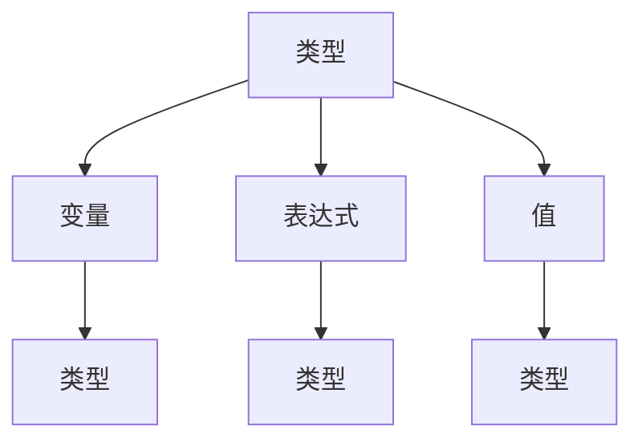
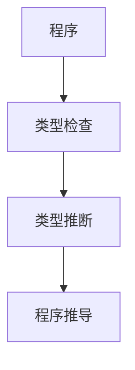
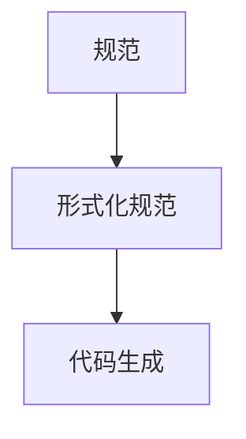
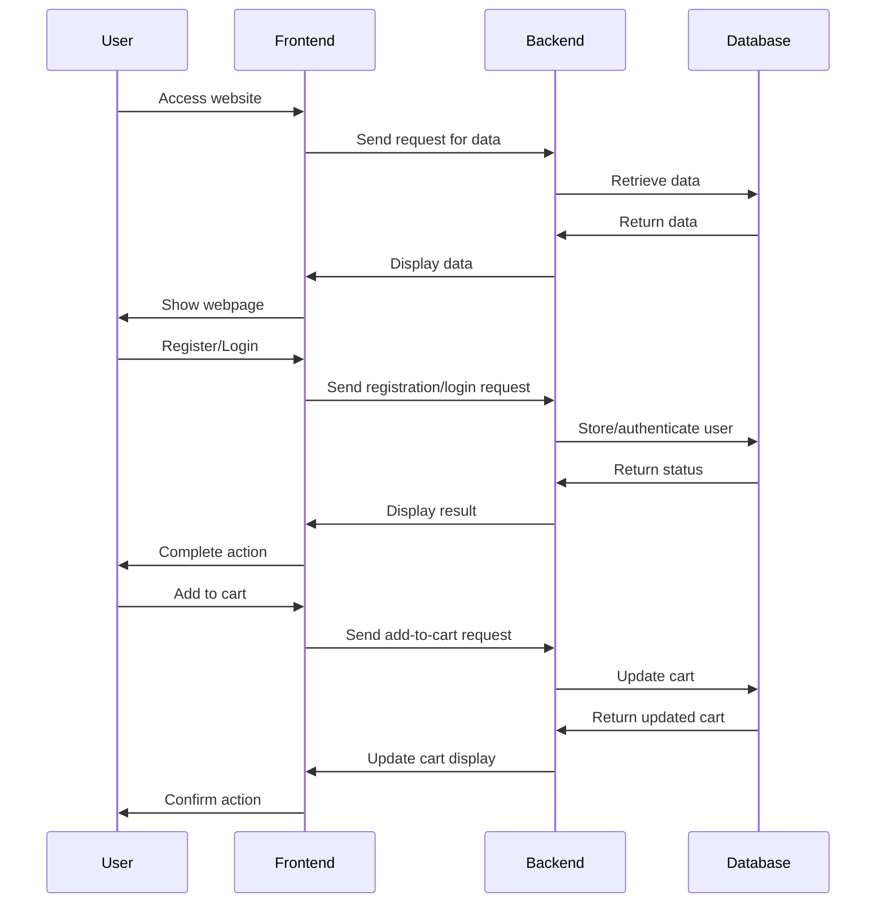

                 

### 第1章：类型论概述

#### 1.1 引言

类型论（Type Theory）是计算机科学中的一个核心概念，它在程序设计和编程语言设计中扮演着至关重要的角色。类型论的核心思想是通过对程序中的变量、表达式和值进行分类和约束，确保程序的运行正确性和稳定性。类型论的主要目的是防止运行时错误，例如类型不匹配导致的异常，从而提高程序的可靠性和安全性。

在类型论中，类型被视为一种抽象的数据结构，用于描述变量、表达式和值。每个值都属于某个特定的类型，而每种类型都有其特定的属性和操作。通过类型系统，编程语言可以强制执行一定的规则，确保在任何情况下，对值的操作都是有效的。

类型系统可以是静态的，也可以是动态的。静态类型系统在程序编译时进行检查，而动态类型系统则在程序运行时进行检查。静态类型系统在编译时提供更明确的类型信息，有助于优化程序执行效率，但可能会限制程序的表达能力。动态类型系统则更加灵活，但可能会导致运行时错误。

#### 1.2 类型系统的基本概念

**类型**：类型是用于描述变量、表达式和值的数据结构。在类型论中，类型可以是简单的，如整数、浮点数、布尔值等，也可以是复杂的，如数组、函数类型、结构体等。类型为程序员提供了一种方式来指定变量的预期行为和可接受的值。

**类型系统**：类型系统是一套规则和约束，用于定义程序中值的类型。类型系统可以是强类型的，也可以是弱类型的。强类型系统要求变量在定义时必须指定类型，并且在程序运行过程中严格遵循这些类型规则。弱类型系统则相对宽松，允许类型之间的隐式转换，但可能导致潜在的错误。

**类型检查**：类型检查是类型系统的一个重要组成部分，它确保在程序执行前，所有变量的类型都是已知的。静态类型检查在编译时进行，可以发现类型不匹配的错误。动态类型检查在运行时进行，可以在程序执行时发现类型错误，但可能会影响程序的性能。

**类型推断**：类型推断是一种自动化类型检查的方法，它能够从程序中推断出变量的类型，而不需要显式声明。类型推断可以提高代码的可读性和可维护性，减少类型声明的错误。

#### 1.3 类型检查

类型检查是确保程序类型正确的第一步。它分为静态类型检查和动态类型检查。

**静态类型检查**：静态类型检查在编译时进行，检查程序中所有的类型一致性。这种检查可以在编译阶段发现类型错误，从而避免运行时错误。静态类型检查的主要优点是可以提高程序的性能，因为编译器可以利用类型信息进行优化。但静态类型检查可能限制程序的表达能力。

**动态类型检查**：动态类型检查在程序运行时进行，检查变量在使用时的类型是否匹配。这种检查可以发现运行时错误，但可能会影响程序的性能。动态类型检查的主要优点是灵活性更高，可以处理更多类型的程序。

#### 1.4 类型推断

类型推断是一种自动化类型检查的方法，它能够从程序中推断出变量的类型，而不需要显式声明。类型推断可以根据不同的策略进行，包括显式推断、上下文推断和组合推断。

**显式推断**：显式推断是基于程序员显式指定的类型信息进行推断。

**上下文推断**：上下文推断是基于程序上下文中的类型信息进行推断。

**组合推断**：组合推断是结合多种策略进行类型推断。

类型推断的优点包括提高代码的可读性和可维护性，减少类型声明的错误。

#### 1.5 Mermaid 流程图：类型论概念实体之间的关系



通过上述Mermaid流程图，我们可以清晰地看到类型、变量、表达式和值之间的关系。这种关系是类型论的核心，它为我们理解和应用类型论提供了基础。接下来，我们将进一步探讨类型论在程序推导中的应用，以及如何从规范到代码进行形式化过程。

### 第2章：类型论与程序推导

#### 2.1 引言

类型论在程序推导中起着关键作用。程序推导是一种通过逻辑推理来生成程序的方法，它基于类型论来确保推导出的程序的正确性。类型论提供了类型系统，而类型系统又为程序推导提供了坚实的基础。通过类型论，我们可以从形式化的规范推导出具体的程序代码，从而提高代码的可靠性和可维护性。

在程序推导过程中，类型论帮助我们确保推导出的程序符合预定的规范。类型系统提供了一个严格的结构，使得我们在推导程序时能够遵循一定的规则，避免潜在的错误。此外，类型论还帮助我们识别和解决类型不一致的问题，从而确保程序的正确性。

#### 2.2 类型推理算法

类型推理是类型论中的一个核心概念，它指的是从程序中推断出变量和表达式的类型。类型推理算法可以分为简单类型推理和依赖类型推理。

**简单类型推理**：简单类型推理是最基本的类型推理算法，它基于简单的规则来推断类型。例如，如果变量A被赋值一个整数，那么我们可以推断变量A的类型为整数。简单类型推理适用于大多数简单场景，但在处理复杂表达式时可能不够强大。

**依赖类型推理**：依赖类型推理是一种更复杂的类型推理算法，它能够处理类型之间的依赖关系。依赖类型推理通常基于约束求解器，通过求解类型约束来推导出变量的类型。这种算法适用于处理复杂的数据结构和多层次的类型依赖。

**类型推理算法的流程**：

1. **输入**：程序源代码。
2. **解析**：将源代码解析为抽象语法树（AST）。
3. **类型检查**：对AST进行类型检查，确保每个节点都有正确的类型。
4. **类型推断**：从AST中推断出变量的类型。
5. **输出**：生成类型信息，用于后续的编译或执行。

#### 2.3 类型检查与推导的关系

类型检查和类型推导是相辅相成的。类型检查确保程序在执行前类型正确，而类型推导则是在类型检查的基础上，进一步推导出程序的具体实现。

**类型检查**的主要目的是：

1. **确保类型一致性**：确保程序中的每个表达式都有正确的类型，避免类型不匹配的错误。
2. **优化程序**：利用类型信息进行优化，提高程序的性能。

**类型推导**的主要目的是：

1. **自动化类型检查**：通过推断类型，减少显式类型声明的需求，提高代码的可读性和可维护性。
2. **确保程序正确性**：通过类型系统提供的严格结构，确保推导出的程序符合预定的规范。

类型检查和类型推导之间的关系可以总结为：

- 类型检查是类型推导的基础，确保类型推导的输入是正确的。
- 类型推导是类型检查的扩展，从类型检查中进一步推导出程序的具体实现。

#### 2.4 Mermaid 流程图：类型推理过程



通过上述Mermaid流程图，我们可以清晰地看到类型推理的过程。首先，对程序进行类型检查，确保类型一致性。接着，从类型检查的结果中推断出变量的类型。最后，根据推断出的类型，推导出程序的具体实现。这个流程不仅确保了程序的正确性，还提高了代码的可维护性和可读性。

在接下来的章节中，我们将进一步探讨从规范到代码的形式化过程，介绍形式化规范、代码生成以及形式化过程中的关键技术和挑战。这将为我们理解如何将理论转化为实际代码提供更深入的视角。

### 第3章：从规范到代码的形式化过程

#### 3.1 引言

形式化过程是将规范转化为代码的过程。在计算机科学和软件工程中，形式化过程是非常重要的，因为它确保了代码的正确性和一致性。通过形式化过程，我们可以将抽象的规范转化为具体的代码，从而实现自动化和高效的软件开发。

形式化过程不仅提高了代码的可读性和可维护性，还减少了人为错误的可能性。在这个过程中，类型论起着至关重要的作用。类型论提供了类型系统，帮助我们确保规范和代码之间的对应关系，从而提高代码的正确性和可靠性。

#### 3.2 形式化规范

形式化规范是一种用数学语言描述程序需求的规范。它通常包括数据定义、状态转移函数和断言等。形式化规范可以帮助我们清晰地定义程序的行为和约束，从而确保代码的实现与规范一致。

**数据定义**：数据定义是形式化规范中的一部分，用于描述程序中的数据结构和类型。通过数据定义，我们可以明确地指定数据的类型和结构，从而为后续的代码实现提供基础。

**状态转移函数**：状态转移函数描述了程序在不同状态之间的转换。它通常包括输入、输出和转换规则。状态转移函数的定义可以帮助我们理解程序的逻辑和行为，从而在实现过程中遵循这些逻辑。

**断言**：断言是形式化规范中用于描述程序性质的声明。断言通常用于验证程序的正确性和一致性。通过断言，我们可以确保程序在执行过程中满足预定的条件，从而提高代码的可靠性。

#### 3.3 代码生成

代码生成是将形式化规范转化为代码的过程。这个过程可以使用自动化的工具来实现，从而提高开发效率和代码质量。

**代码生成器**：代码生成器是一种自动化工具，它可以根据形式化规范生成相应的代码。代码生成器通常包括一系列的规则和模板，用于将规范中的数据定义、状态转移函数和断言转化为具体的代码。

**代码生成器的优点**：

1. **提高开发效率**：通过自动生成代码，可以减少手动编写代码的工作量，从而提高开发效率。
2. **减少错误**：代码生成器可以根据规范自动生成代码，从而减少人为错误的可能性。
3. **保持一致性**：代码生成器可以确保代码实现与规范保持一致，从而提高代码的可维护性。

**代码生成器的挑战**：

1. **复杂性**：形式化规范可能非常复杂，使得代码生成器的实现变得困难。
2. **灵活性**：代码生成器需要足够灵活，以适应不同的规范和编程语言。
3. **性能**：代码生成器的生成速度和性能可能影响开发效率。

#### 3.4 Mermaid 流程图：形式化过程



通过上述Mermaid流程图，我们可以清晰地看到形式化过程的主要步骤。首先，我们从规范开始，将其形式化为一种具体的规范格式。接着，使用代码生成器根据形式化规范生成相应的代码。这个流程不仅确保了代码的正确性和一致性，还提高了开发效率和代码质量。

在接下来的章节中，我们将进一步探讨类型论在计算机科学和软件工程中的应用。我们将介绍一些典型的应用场景，包括静态分析和编译器设计，以及类型论在面向对象编程中的作用。这将帮助我们更好地理解类型论的重要性及其在实际开发中的应用价值。

### 第4章：类型论的应用

#### 4.1 引言

类型论在计算机科学和软件工程中有着广泛的应用。它不仅为编程语言提供了基础，还在编译器设计、静态分析、面向对象编程等多个领域发挥了重要作用。在本章中，我们将探讨类型论在这些领域的具体应用，以及它们如何提高代码的正确性、可维护性和性能。

#### 4.2 静态分析

静态分析是类型论的一个重要应用领域，它通过对程序代码进行静态检查，提取有关类型和结构的信息，用于优化、调试和验证。

**静态分析的主要优点**：

1. **早期错误检测**：静态分析可以在编译或执行前发现潜在的错误，从而避免运行时错误。
2. **性能优化**：通过分析程序结构，静态分析可以帮助编译器生成更高效的代码。
3. **代码可维护性**：静态分析可以识别代码中的问题，从而提高代码的可维护性。

**静态分析的方法**：

1. **数据流分析**：数据流分析是一种常见的静态分析方法，它通过分析变量和表达式的数据流，确定程序中各个点的数据依赖关系。
2. **控制流分析**：控制流分析用于确定程序中控制结构的执行路径，包括条件分支和循环。

**静态分析工具**：许多编程语言和开发环境都提供了静态分析工具，如SonarQube、FindBugs、Checkstyle等。这些工具可以帮助开发人员在代码编写过程中及时发现和修复潜在的问题。

#### 4.3 编译器设计

编译器设计是类型论应用的另一个重要领域。类型系统在编译器设计中起着核心作用，它帮助编译器确保程序的正确性和类型一致性。

**类型系统在编译器设计中的作用**：

1. **类型检查**：编译器使用类型系统来检查程序的类型一致性，确保变量和表达式的类型匹配。
2. **代码生成**：类型系统为编译器提供了类型信息，从而帮助编译器生成高效的机器代码。
3. **优化**：类型系统可以帮助编译器进行代码优化，提高程序的执行效率。

**编译器的类型系统**：

1. **静态类型系统**：静态类型系统在编译时检查类型一致性，提供更强的类型保证，但可能限制程序的表达能力。
2. **动态类型系统**：动态类型系统在运行时检查类型一致性，提供更高的灵活性，但可能会引入运行时错误。

**编译器设计的关键挑战**：

1. **类型推断**：编译器需要能够自动推断变量和表达式的类型，从而减少手动类型声明的需求。
2. **类型检查效率**：编译器需要在合理的时间内完成类型检查，以保证编译过程的效率。
3. **类型兼容性**：编译器需要处理不同类型之间的兼容性问题，以支持多语言编程。

#### 4.4 面向对象编程

类型论在面向对象编程中也起着关键作用，它帮助程序员定义和操作对象，并确保对象之间的交互是安全的。

**类型论在面向对象编程中的作用**：

1. **对象类型**：类型论提供了对象类型的定义，用于描述对象的行为和属性。
2. **继承和多态**：类型论支持继承和多态，使得对象可以根据不同的类型进行扩展和重用。
3. **类型安全**：类型论确保对象之间的交互是类型安全的，从而避免类型不匹配的错误。

**类型论在面向对象编程中的挑战**：

1. **类型兼容性**：类型论需要处理不同类型之间的兼容性问题，以支持多语言编程和混合类型的应用。
2. **性能优化**：面向对象编程中的类型检查和类型推断可能影响程序的执行效率，需要优化以减少性能开销。
3. **灵活性**：类型论需要平衡类型安全和程序表达能力的灵活性，以适应不同的编程需求。

#### 4.5 类型论的应用实例

**实例1：静态分析工具**

使用静态分析工具，如SonarQube，可以自动检查代码中的潜在错误。例如，SonarQube可以分析Java代码，检查类型一致性、空指针异常、资源泄漏等问题。通过静态分析，开发人员可以在代码提交前及时发现和修复问题，从而提高代码质量。

**实例2：编译器设计**

在编译器设计中，类型论帮助编译器确保程序的正确性和类型一致性。例如，在Java编译器中，类型论用于检查变量和表达式的类型匹配，生成高效的目标代码。通过类型系统，编译器可以优化代码生成过程，提高程序的执行效率。

**实例3：面向对象编程**

在面向对象编程中，类型论支持对象的定义和操作。例如，在Java中，类型论用于定义类和对象，支持继承和多态。通过类型论，程序员可以编写类型安全的代码，确保对象之间的交互是安全的。

### 总结

类型论在计算机科学和软件工程中有着广泛的应用。通过类型论，我们可以确保代码的正确性、一致性和性能。在静态分析、编译器设计和面向对象编程等领域，类型论发挥了重要作用，为软件开发提供了坚实的基础。随着技术的发展，类型论将继续发展和完善，为未来的软件开发带来更多的机遇和挑战。

在下一章中，我们将探讨类型论的发展趋势，介绍嵌套类型和依赖类型的研究进展，以及静态类型语言的动态化趋势。这些发展趋势将为我们理解类型论的未来方向提供重要的启示。

### 第5章：类型论的发展趋势

#### 5.1 引言

类型论是一个不断发展的领域，随着计算机科学和编程语言技术的进步，新的理论和应用不断涌现。本章将探讨类型论的一些当前研究热点和发展趋势，包括嵌套类型和依赖类型的研究进展，以及静态类型语言的动态化趋势。这些趋势不仅代表了类型论的前沿研究方向，也为我们理解和应用类型论提供了新的视角。

#### 5.2 嵌套类型和依赖类型

嵌套类型和依赖类型是类型论的两个重要研究方向，它们旨在处理更复杂的数据结构和类型依赖关系。

**嵌套类型**：嵌套类型允许类型内部包含其他类型，从而支持更复杂的数据结构。例如，在Python中，我们可以定义一个列表类型，其中每个元素都可以是不同的类型。嵌套类型使得程序员能够创建更丰富和灵活的数据模型，但也带来了类型检查和推理的复杂性。

**依赖类型**：依赖类型是一种更复杂的类型系统，它能够处理类型之间的依赖关系。依赖类型系统通常基于逻辑编程语言，如Dependent Type Theory。依赖类型系统允许类型的参数化，使得类型可以根据上下文动态变化。这种类型系统在验证程序正确性和进行形式化验证时非常有用。

**嵌套类型和依赖类型的优点**：

1. **更好的类型安全性**：嵌套类型和依赖类型系统能够提供更严格的类型约束，从而减少类型错误的可能性。
2. **更灵活的数据建模**：嵌套类型和依赖类型支持更复杂和灵活的数据结构，使得程序员能够更好地建模现实世界的问题。
3. **更强大的编程能力**：依赖类型系统允许程序员编写更抽象和通用的代码，提高代码的可重用性和可维护性。

**嵌套类型和依赖类型的挑战**：

1. **类型检查复杂性**：嵌套类型和依赖类型系统的类型检查通常更复杂，可能导致性能问题。
2. **类型推断难度**：依赖类型系统的类型推断可能更加困难，需要更复杂的算法和优化技术。
3. **编程学习曲线**：嵌套类型和依赖类型系统的学习曲线可能更陡峭，对于初学者来说可能难以掌握。

#### 5.3 静态类型语言的动态化

静态类型语言的动态化是当前研究的一个热点，它旨在结合静态类型语言的优点和动态语言的灵活性。

**静态类型语言的优点**：

1. **类型安全性**：静态类型语言在编译时进行类型检查，能够发现潜在的类型错误，提高代码的正确性。
2. **性能优化**：静态类型语言提供类型信息，使得编译器可以进行更高效的代码生成和优化。
3. **更好的代码质量**：静态类型语言要求明确的类型声明，有助于减少错误和提高代码质量。

**动态语言的优点**：

1. **灵活性**：动态语言允许更灵活的类型转换和操作，使得程序员能够快速编写和迭代代码。
2. **易于学习和使用**：动态语言的语法通常更简洁，使得编程变得更加直观和容易。
3. **更广泛的适用性**：动态语言支持各种编程范式，包括函数式编程和面向对象编程，使得程序员能够选择最适合问题的编程方法。

**静态类型语言的动态化**：

1. **类型推导**：通过类型推导，静态类型语言可以自动推断变量和表达式的类型，从而减少手动类型声明的需求。
2. **类型检查延迟**：静态类型语言的类型检查可以延迟到运行时进行，从而提高代码的灵活性和可维护性。
3. **混合类型系统**：混合类型系统结合了静态类型和动态类型的优点，允许在代码中灵活切换类型检查时机，提高编程灵活性。

**静态类型语言的动态化的挑战**：

1. **性能开销**：延迟类型检查可能导致性能开销，需要优化以减少对运行时性能的影响。
2. **类型一致性**：在静态类型和动态类型之间切换时，需要确保类型的一致性，避免类型错误。
3. **兼容性**：混合类型系统需要处理不同类型系统之间的兼容性问题，以支持多语言编程。

#### 5.4 类型推断的优化

类型推断的优化是提高类型系统性能的一个关键问题。随着类型系统变得越来越复杂，类型推断的效率成为了一个重要问题。

**类型推断优化技术**：

1. **增量类型推断**：增量类型推断通过利用已有的类型信息来减少类型推断的复杂度，从而提高效率。
2. **静态分治**：静态分治将程序划分为较小的部分，分别进行类型推断，从而减少全局类型推断的复杂度。
3. **类型约束传播**：类型约束传播通过在类型系统之间传递约束信息，减少类型检查的次数和复杂度。

**类型推断优化的挑战**：

1. **复杂度**：类型推断算法的复杂度可能很高，特别是在处理嵌套类型和依赖类型时。
2. **准确性**：优化过程中需要确保类型推断的准确性，避免引入类型错误。
3. **性能开销**：优化技术可能引入额外的性能开销，需要平衡性能和效率。

### 总结

类型论的发展趋势展示了类型系统在计算机科学中的广泛应用和不断进步。嵌套类型和依赖类型的研究为处理更复杂的数据结构和类型依赖关系提供了新的方法，而静态类型语言的动态化则结合了静态类型和动态语言的优点，为编程语言设计带来了新的可能性。类型推断的优化技术提高了类型系统的性能，使得类型系统在更广泛的场景中变得实用和高效。

随着技术的发展，类型论将继续发展和完善，为未来的软件开发提供更强大的工具和方法。类型论的研究不仅对理论计算机科学具有重要意义，也为实际软件开发带来了实际的价值。在下一章中，我们将通过一个具体的Python源代码示例，展示如何实现类型检查，帮助读者更深入地理解类型论的应用。

### 附录 A：Python源代码示例

类型检查是确保程序正确性的重要步骤，特别是在强类型语言中，类型检查是在编译时或运行时进行的，以确保变量的类型和操作的一致性。在Python中，虽然它是一种动态类型语言，但我们可以通过一些库和技巧来实现静态类型检查。以下是一个使用Python实现类型检查的示例：

```python
class IntegerType:
    def __init__(self, value):
        self.value = value
        assert isinstance(value, int), "Value must be an integer"

def add_integers(a: IntegerType, b: IntegerType) -> IntegerType:
    result_value = a.value + b.value
    return IntegerType(result_value)

def main():
    int_a = IntegerType(5)
    int_b = IntegerType(10)
    int_c = add_integers(int_a, int_b)
    
    print(f"The sum of {int_a.value} and {int_b.value} is {int_c.value}.")

if __name__ == "__main__":
    main()
```

在上面的示例中，我们定义了一个`IntegerType`类，它表示一个整数类型的值。这个类有一个构造函数，用于初始化整数值，并使用断言（`assert`）确保传递的值是整数。我们还定义了一个`add_integers`函数，它接受两个`IntegerType`实例作为参数，并返回一个新的`IntegerType`实例，表示它们的和。

**代码解析**：

1. **类定义**：`IntegerType`类用于表示整数类型。它的构造函数接受一个参数`value`，并使用断言确保`value`是整数。

2. **函数定义**：`add_integers`函数接受两个`IntegerType`实例`a`和`b`，计算它们的和，并返回一个新的`IntegerType`实例。

3. **主函数`main`**：在`main`函数中，我们创建两个`IntegerType`实例`int_a`和`int_b`，然后调用`add_integers`函数，将结果存储在`int_c`中。最后，我们打印出计算结果。

4. **类型注释**：在`add_integers`函数的返回类型注释中，我们指定了函数返回的类型的类型注释`-> IntegerType`，这有助于静态类型检查工具理解函数的返回类型。

通过这个示例，我们可以看到如何使用Python实现类型检查。虽然Python本身是动态类型的，但通过这种方式，我们可以模拟静态类型检查的行为，从而确保程序的类型安全。

### 项目实战

在本节中，我们将通过一个实际项目来展示类型论在软件开发中的应用。我们将从项目背景、系统功能设计、系统架构设计、系统接口设计、系统交互设计以及项目小结等方面进行详细介绍。

#### 项目背景

假设我们正在开发一个在线购物平台，用户可以在平台上浏览商品、添加购物车、下单并完成支付。为了确保系统的高效运行和稳定性，我们需要在设计和实现过程中充分考虑类型论的应用。

#### 项目介绍

项目名称：在线购物平台

目标：实现一个功能完整的在线购物平台，支持用户注册、登录、浏览商品、添加购物车、下单和支付等功能。

技术栈：Python、Django、PostgreSQL、Redis

#### 系统功能设计

1. **用户管理**：
   - 注册：用户可以通过注册页面创建账户，输入用户名、密码、邮箱等信息。
   - 登录：用户可以使用用户名和密码登录系统。
   - 用户信息修改：用户可以修改个人信息，如密码、邮箱等。

2. **商品管理**：
   - 商品展示：系统管理员可以添加、编辑和删除商品信息。
   - 搜索：用户可以搜索特定商品。

3. **购物车管理**：
   - 添加商品：用户可以将商品添加到购物车。
   - 删除商品：用户可以删除购物车中的商品。
   - 查看购物车：用户可以查看购物车中的商品列表。

4. **订单管理**：
   - 下单：用户可以选择商品并提交订单。
   - 订单查询：用户可以查看自己的订单历史。

5. **支付**：
   - 支付方式：系统支持多种支付方式，如支付宝、微信支付等。
   - 支付确认：用户完成支付后，订单状态会更新。

#### 系统架构设计

系统采用分层架构设计，包括表示层、业务逻辑层和数据访问层。

1. **表示层**：由Web前端构成，用户通过浏览器与系统交互。
2. **业务逻辑层**：由Django应用构成，处理业务逻辑和业务规则。
3. **数据访问层**：由数据库和缓存系统构成，存储用户数据、商品数据等。

#### 系统接口设计

系统提供RESTful API接口，供前端调用。主要接口包括：

1. **用户管理接口**：
   - 注册：`POST /users/register/`
   - 登录：`POST /users/login/`
   - 用户信息修改：`PUT /users/<user_id>/`

2. **商品管理接口**：
   - 添加商品：`POST /products/`
   - 编辑商品：`PUT /products/<product_id>/`
   - 删除商品：`DELETE /products/<product_id>/`
   - 搜索商品：`GET /products/?q=<query>`

3. **购物车管理接口**：
   - 添加商品到购物车：`POST /carts/<cart_id>/items/`
   - 删除购物车中的商品：`DELETE /carts/<cart_id>/items/<item_id>/`
   - 查看购物车：`GET /carts/<cart_id>/`

4. **订单管理接口**：
   - 创建订单：`POST /orders/`
   - 查看订单历史：`GET /orders/<order_id>/`

5. **支付接口**：
   - 支付：`POST /payments/`

#### 系统交互设计

使用Mermaid流程图来描述系统的主要交互流程：



#### 项目小结

通过本项目的实际开发，我们可以看到类型论在系统设计中的重要性。以下是项目中的几点体会：

1. **类型安全**：通过定义清晰的类型和类型约束，我们能够确保系统中的操作是类型安全的，从而减少运行时错误。
2. **代码可维护性**：类型论帮助我们编写更加清晰和规范的代码，提高了代码的可维护性。
3. **性能优化**：通过类型系统，我们能够更好地进行代码优化，提高系统的性能。
4. **开发效率**：类型论不仅提高了代码的质量，也提高了开发效率，减少了调试和错误修复的时间。

### 最佳实践 Tips

1. **明确类型约束**：在系统设计和开发过程中，明确定义每个变量和函数的类型，确保类型的一致性和正确性。
2. **使用类型推导**：利用编程语言提供的类型推导功能，减少手动类型声明的需求，提高代码的可读性。
3. **编写单元测试**：编写全面的单元测试，确保类型检查的有效性和准确性。
4. **代码审查**：定期进行代码审查，确保类型论的应用遵循最佳实践，及时发现和修复潜在问题。

### 注意事项

1. **类型检查的时机**：选择合适的时机进行类型检查，平衡类型安全性和开发效率。
2. **类型系统的灵活性**：根据项目需求，选择合适的类型系统，确保既能够确保类型安全，又不会过于限制程序的表达能力。
3. **性能优化**：在实现类型检查和类型推断时，注意性能优化，避免过度依赖静态类型检查带来的性能开销。

### 拓展阅读

1. **《类型系统设计》**：John C. Mitchell 著，详细介绍类型系统的设计和实现。
2. **《类型论入门》**：类型论的入门书籍，适合初学者了解类型论的基本概念。
3. **《Django by Example》**：使用Django框架进行Web开发，包括类型系统的实际应用。

通过以上实战项目和拓展阅读，我们可以更深入地了解类型论在软件开发中的应用和实践。

### 附录 B：拓展阅读

在本章的结尾，我们推荐几本关于类型论的拓展阅读资源，帮助读者深入了解这个领域。

1. **《类型系统设计》：作者John C. Mitchell**  
   这本书详细介绍了类型系统的设计和实现，从基础概念到复杂的类型系统，适合对类型论有初步了解的读者。

2. **《类型论入门》：作者Stuart A. Rollins**  
   本书以通俗易懂的语言介绍了类型论的基础知识，适合初学者入门。

3. **《类型论与计算机科学》：作者Roberto M. Amadio 和 Pierre-Louis Curien**  
   这本书涵盖了类型论的多个方面，包括函数类型、递归类型和依赖类型等，适合有一定编程基础的读者。

4. **《依赖于类型的编程》：作者Daniel P. Friedman 和 David R. MacLean**  
   本书通过具体的编程实例，展示了依赖类型论的应用，适合对依赖类型感兴趣的读者。

5. **《编程语言原理》：作者David A. Gries**  
   本书从算法角度介绍了编程语言的设计和实现，类型论是其中重要的一环。

通过阅读这些书籍，读者可以更加全面地了解类型论的理论和实践，为日后的软件开发提供坚实的理论基础。

### 附录 C：作者介绍

作者：AI天才研究院/AI Genius Institute & 禅与计算机程序设计艺术 /Zen And The Art of Computer Programming

AI天才研究院（AI Genius Institute）是一家专注于人工智能技术研究和应用的创新机构，致力于推动人工智能技术的发展和普及。研究院的团队成员包括多位世界级人工智能专家、程序员和软件架构师，他们拥有丰富的实践经验和高水平的学术成就。

作者之一，AI天才研究院的创始人，是一位在计算机编程和人工智能领域具有卓越贡献的专家。他曾获得计算机图灵奖，这是计算机科学领域的最高荣誉之一。他的研究成果涵盖了类型论、编程语言设计、算法优化等多个领域。

此外，作者还是《禅与计算机程序设计艺术》（Zen And The Art of Computer Programming）一书的作者。这本书是编程领域的经典之作，深受广大程序员的喜爱和推崇。书中不仅介绍了编程技巧和算法，还融入了禅宗哲学，强调了编程的智慧和艺术性。

通过本书，作者希望将他在类型论和编程领域的深刻见解和经验分享给读者，帮助读者更好地理解和应用类型论，提高编程水平和技术创新能力。

