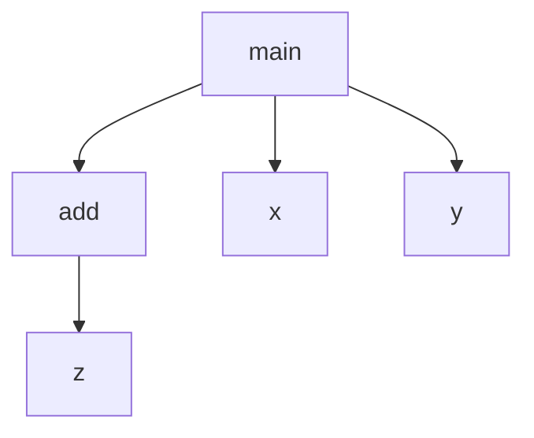

                 

### 《类型论与程序证明：形式化验证的基础》

#### 关键词

- 类型论
- 程序证明
- 形式化验证
- 类型系统
- Coq 语言

#### 摘要

本文将深入探讨类型论与程序证明在形式化验证中的应用。形式化验证是一种通过数学方法来证明程序正确性的技术，它在确保软件系统的可靠性方面发挥着关键作用。类型论为程序设计提供了坚实的理论基础，而程序证明则是验证程序正确性的强大工具。本文将详细讨论类型论的基础概念、类型系统、类型推导算法，以及程序证明的基本概念、形式逻辑基础和Coq语言的使用。通过实例分析，我们将展示类型论与程序证明的结合如何帮助实现形式化验证。本文的目标是为读者提供对类型论和程序证明的深入理解，以及在实际应用中如何利用这些概念进行形式化验证的方法和策略。

---

### 《类型论与程序证明：形式化验证的基础》目录大纲

#### 第一部分：引论

##### 1.1 引言

- 形式化验证的背景与意义
- 类型论的基本概念

##### 1.2 形式化验证的挑战

- 面向对象编程的复杂性
- 程序证明的需求

##### 1.3 书籍结构

- 主要内容与章节安排
- 读者预期收获

#### 第二部分：类型论基础

##### 2.1 类型系统概述

- 基本类型与复合类型
- 类型检查机制

##### 2.2 类型论与类型推导

- 运算符的语法糖
- 类型推导算法

##### 2.3 类型系统的演进

- 静态类型与动态类型
- 强类型与弱类型

##### 2.4 类型论与程序设计

- 类型论在函数式编程中的应用
- 类型论在面向对象编程中的应用

#### 第三部分：程序证明基础

##### 3.1 程序证明的基本概念

- 程序证明的目标与意义
- 基本的证明方法

##### 3.2 形式逻辑基础

- 形式逻辑的基本概念
- 形式逻辑的应用

##### 3.3 Coq语言简介

- Coq语言的语法与语义
- Coq语言的基本操作

##### 3.4 程序证明实例分析

- 简单例子的证明过程
- 复杂例子的证明策略

#### 第四部分：类型论与程序证明的结合

##### 4.1 类型检查与程序证明的关系

- 类型检查在程序证明中的作用
- 程序证明对类型检查的加强

##### 4.2 类型依赖分析

- 类型依赖分析的基本原理
- 类型依赖分析的实现方法

##### 4.3 代码优化与程序证明

- 代码优化的基本策略
- 程序证明在代码优化中的应用

##### 4.4 类型安全与程序证明

- 类型安全的概念与重要性
- 程序证明在类型安全中的应用

#### 第五部分：应用案例与展望

##### 5.1 实际应用案例分析

- 某知名公司的实际应用案例
- 案例中的类型论与程序证明应用

##### 5.2 未来发展趋势

- 类型论与程序证明的新趋势
- 未来在形式化验证中的应用前景

##### 5.3 附录

- 常用工具与资源
- 进一步阅读推荐

#### 总结

- 对全书内容的回顾与总结
- 读者反馈与互动渠道

---

### 第一部分：引论

#### 1.1 引言

形式化验证是一种通过数学方法来验证软件系统的正确性的技术。它的目的是通过逻辑推理和数学证明来确保程序的行为符合预期，避免潜在的错误和漏洞。形式化验证在确保关键系统（如航空航天、医疗设备、金融系统等）的可靠性和安全性方面具有重要作用。而类型论和程序证明则是实现形式化验证的重要工具。

类型论是研究程序中类型系统的理论，它为程序设计提供了坚实的理论基础。类型论涉及基本类型、复合类型、类型检查机制、类型推导算法等概念。通过类型论，我们可以确保程序在运行时不会发生类型错误，从而提高程序的正确性和可靠性。

程序证明是一种通过数学证明来验证程序正确性的方法。它通过逻辑推理和形式化的证明过程，确保程序的行为符合预定的逻辑条件。程序证明可以帮助我们识别和修复程序中的错误，提高程序的质量和可靠性。

本文旨在探讨类型论与程序证明在形式化验证中的应用。我们将从基础概念开始，逐步介绍类型论、类型系统、类型推导算法、程序证明的基本概念、形式逻辑基础、Coq语言的使用，以及类型论与程序证明的结合。通过实例分析，我们将展示如何利用这些概念进行形式化验证，并提供实际应用案例和未来发展趋势的展望。

#### 1.2 形式化验证的挑战

形式化验证虽然具有强大的理论支持，但在实际应用中仍面临许多挑战。以下是一些主要的挑战：

1. **面向对象编程的复杂性**：

   面向对象编程（OOP）是现代软件系统开发的主流范式。然而，OOP带来的复杂性和抽象层次使得形式化验证变得更加困难。面向对象程序通常涉及大量的类、接口、继承、多态等概念，这些概念增加了程序的复杂度，使得形式化验证变得复杂和繁琐。

2. **程序证明的需求**：

   程序证明是一种强大的验证方法，但它也带来了更高的要求。进行程序证明需要严格的逻辑推理和数学证明，这要求开发人员具备较高的数学和逻辑素养。此外，程序证明的过程通常是手动进行的，这增加了验证的时间和成本。

3. **类型系统的复杂性**：

   类型系统是形式化验证的重要基础。然而，现代编程语言中的类型系统通常非常复杂，包括基本类型、复合类型、类型检查机制、类型推导算法等。理解和实现这些类型系统需要深入的理论知识和实践经验。

4. **代码的可读性和可维护性**：

   进行形式化验证通常需要对代码进行大量的修改和重构。这可能会影响代码的可读性和可维护性。如何在不牺牲代码质量的情况下进行形式化验证是一个重要的挑战。

#### 1.3 书籍结构

本书分为五个部分，旨在系统地介绍类型论与程序证明在形式化验证中的应用。

- **第一部分：引论**，介绍形式化验证的背景、类型论的基本概念以及本书的结构和目标。

- **第二部分：类型论基础**，讨论类型系统的概述、类型论与类型推导、类型系统的演进以及类型论与程序设计。

- **第三部分：程序证明基础**，介绍程序证明的基本概念、形式逻辑基础、Coq语言的使用以及程序证明实例分析。

- **第四部分：类型论与程序证明的结合**，探讨类型检查与程序证明的关系、类型依赖分析、代码优化与程序证明、类型安全与程序证明。

- **第五部分：应用案例与展望**，分析实际应用案例、探讨未来发展趋势，并提供附录和进一步阅读推荐。

通过本书的学习，读者将能够深入理解类型论和程序证明的概念，掌握形式化验证的方法和策略，并在实际项目中应用这些技术。

### 第二部分：类型论基础

#### 2.1 类型系统概述

类型系统是程序设计语言中的一个核心概念，它用于定义变量、表达式和函数的类型。类型系统的主要作用是防止类型错误，确保程序在运行时能够正确执行。

**基本类型与复合类型**：

- **基本类型**包括整数（int）、浮点数（float）、布尔值（bool）、字符（char）等。这些类型是编程语言中最常用的类型，用于表示基本数据。

- **复合类型**是由基本类型组合而成的类型，包括数组（array）、结构体（struct）、类（class）等。复合类型可以用于表示复杂的数据结构和对象。

**类型检查机制**：

类型检查是在编译时或运行时检查程序中类型是否匹配的过程。类型检查机制可以分为以下几种：

- **静态类型检查**：在编译时进行类型检查，确保程序在运行时不会出现类型错误。

- **动态类型检查**：在运行时进行类型检查，允许程序在运行时动态确定类型。

- **混合类型检查**：结合静态类型检查和动态类型检查的优点，在编译时进行部分类型检查，运行时进行剩余类型检查。

**类型推导算法**：

类型推导是指编译器自动确定变量和表达式的类型的过程。类型推导算法可以分为以下几种：

- **显式类型推导**：程序员显式地指定变量和表达式的类型。

- **隐式类型推导**：编译器根据上下文和语法规则自动推导类型。

- **部分类型推导**：编译器结合显式和隐式类型推导，在可能的情况下自动推导类型。

#### 2.2 类型论与类型推导

**运算符的语法糖**：

语法糖是指编程语言中通过简化语法来提高代码可读性和可维护性的特性。在类型论中，语法糖可以用来简化类型推导过程。

例如，Python中的加法运算符 `+` 可以用于整数和浮点数之间的运算，编译器会自动进行类型转换。这是通过隐式类型推导实现的。

$$
int a = 5;
float b = 2.5;
float result = a + b; \quad // 隐式类型推导，将整数a转换为浮点数b
$$

**类型推导算法**：

类型推导算法是指编译器在编译过程中自动确定变量和表达式的类型的方法。常见的类型推导算法包括：

- **最左类型推导**（也称为递归类型推导）：从左到右扫描表达式，将每个子表达式的类型与父表达式的类型进行比较，最终推导出整个表达式的类型。

- **最右类型推导**：从右到左扫描表达式，将每个子表达式的类型与父表达式的类型进行比较，最终推导出整个表达式的类型。

- **类型约束推导**：根据上下文和类型约束推导出表达式的类型。

**示例**：

假设我们有一个函数 `add(a: int, b: int) -> int`，我们需要推导函数返回类型和参数类型。

- **最左类型推导**：
  - 扫描函数体，发现返回类型为 `int`。
  - 扫描第一个参数 `a`，其类型为 `int`。
  - 扫描第二个参数 `b`，其类型为 `int`。
  - 综合以上信息，推导出函数的返回类型为 `int`，参数类型分别为 `int` 和 `int`。

- **最右类型推导**：
  - 扫描函数体，发现返回类型为 `int`。
  - 扫描第二个参数 `b`，其类型为 `int`。
  - 扫描第一个参数 `a`，其类型为 `int`。
  - 综合以上信息，推导出函数的返回类型为 `int`，参数类型分别为 `int` 和 `int`。

**类型推导算法**：

- **最左类型推导算法**：

    ```mermaid
    graph TD
    A[开始] --> B[扫描函数体]
    B --> C[返回类型为int]
    C --> D[扫描第一个参数]
    D --> E[参数类型为int]
    E --> F[扫描第二个参数]
    F --> G[参数类型为int]
    G --> H[结束]
    ```

- **最右类型推导算法**：

    ```mermaid
    graph TD
    A[开始] --> B[扫描函数体]
    B --> C[返回类型为int]
    C --> D[扫描第二个参数]
    D --> E[参数类型为int]
    E --> F[扫描第一个参数]
    F --> G[参数类型为int]
    G --> H[结束]
    ```

#### 2.3 类型系统的演进

类型系统随着编程语言的发展而不断演进，从简单的静态类型系统到复杂的动态类型系统，再到混合类型系统，类型系统在编程语言中的地位和作用也在不断变化。

**静态类型与动态类型**：

- **静态类型**：在编译时确定变量和表达式的类型。静态类型系统有助于提高程序的运行效率和代码的可维护性。

- **动态类型**：在运行时确定变量和表达式的类型。动态类型系统提供更高的灵活性和表达能力，但可能会降低程序的运行效率和可维护性。

**强类型与弱类型**：

- **强类型**：严格限制变量和表达式的类型转换，确保类型兼容性。强类型系统有助于防止类型错误，提高程序的可靠性。

- **弱类型**：允许广泛的类型转换，有时可能引入类型错误。弱类型系统提供更高的灵活性和便捷性，但可能会降低程序的正确性。

**类型系统的演进**：

- **早期编程语言**：以C语言为代表，主要采用静态类型系统。C语言提供了丰富的类型定义和控制流语句，但缺乏面向对象编程的支持。

- **面向对象编程语言**：如Java和C++，引入了静态类型系统和面向对象编程的概念。这些语言提供了强大的类型检查和面向对象特性，提高了程序的可维护性和灵活性。

- **动态类型编程语言**：如Python和JavaScript，采用动态类型系统，提供了更高的灵活性和简洁性。这些语言通常支持函数式编程和面向对象编程，但可能牺牲一定的性能和安全性。

- **混合类型编程语言**：如Swift和Kotlin，结合了静态类型和动态类型的优点。这些语言在编译时进行部分类型检查，运行时进行剩余类型检查，提供了高效的运行效率和灵活的编程模型。

#### 2.4 类型论与程序设计

类型论在程序设计中扮演着重要的角色，它不仅提供了类型系统的理论基础，还影响了编程语言的语法和语义设计。

**类型论在函数式编程中的应用**：

- **类型推导**：函数式编程语言（如Haskell和Scala）通常采用静态类型系统，支持类型推导。类型推导简化了代码的编写和类型检查过程，提高了代码的可读性和可维护性。

- **类型安全**：函数式编程强调 immutability 和函数的确定性，这有助于确保程序的正确性和可靠性。类型系统可以帮助检查函数的输入和输出类型，防止类型错误。

**类型论在面向对象编程中的应用**：

- **类型检查**：面向对象编程语言（如Java和C++）提供了丰富的类型定义和类型检查机制。类型检查可以确保对象的正确性和类型的兼容性，提高程序的可维护性。

- **类型多态**：面向对象编程支持类型多态，通过继承和接口实现了代码的复用和灵活性。类型系统可以帮助检查类型兼容性，确保多态的正确实现。

**类型论与编程语言设计**：

类型论影响了编程语言的设计和实现。现代编程语言通常采用静态类型系统或混合类型系统，提供丰富的类型定义和类型检查机制。类型论还影响了编程语言的语法和语义设计，如类型推导、类型多态、泛型编程等。

### 第三部分：程序证明基础

#### 3.1 程序证明的基本概念

程序证明是一种通过数学证明来验证程序正确性的方法。它的目标是确保程序的行为符合预定的逻辑条件，避免潜在的错误和漏洞。程序证明在形式化验证中发挥着关键作用，它提供了一种严格的、数学化的验证方法。

**程序证明的目标与意义**：

程序证明的主要目标是证明程序在所有可能的情况下都能正确执行，并满足预定的逻辑条件。这意味着程序证明需要证明程序的语义正确性，即程序的行为与预期的逻辑条件一致。程序证明的意义在于：

1. **提高程序的可靠性**：通过数学证明来验证程序的正确性，可以确保程序在运行时不会出现错误，从而提高程序的可靠性。
2. **发现潜在的漏洞**：程序证明可以帮助发现潜在的错误和漏洞，从而提前修复，避免在实际运行中造成严重后果。
3. **增强软件质量**：程序证明可以提高软件质量，确保程序的行为符合预期的逻辑条件，减少维护成本和风险。

**基本的证明方法**：

程序证明通常采用形式逻辑和数学证明的方法。以下是一些基本的证明方法：

1. **归纳证明**：通过递归地证明程序在所有可能的情况下都满足预期的逻辑条件。
2. **结构化证明**：通过将程序分解为更小的部分，分别证明每个部分的正确性，然后组合这些部分的正确性来证明整个程序的正确性。
3. **模型检查**：通过构建程序的数学模型，并使用模型检查工具来验证程序是否满足预期的逻辑条件。

**示例**：

假设我们有一个简单的程序，用于计算两个整数的和。我们可以使用归纳证明来证明这个程序的正确性。

```python
def add(a: int, b: int) -> int:
    if b == 0:
        return a
    else:
        return add(a + 1, b - 1)
```

**归纳步骤**：

1. **基例**：证明当 `b = 0` 时，程序正确返回 `a`。
   - 假设 `a = 5`，`b = 0`，程序返回 `5`，符合预期。
2. **归纳假设**：假设当 `b = k` 时，程序正确返回 `a + k`。
3. **归纳步骤**：证明当 `b = k + 1` 时，程序正确返回 `a + (k + 1)`。
   - 假设 `a = 5`，`b = k + 1`，根据归纳假设，程序调用 `add(a + 1, b - 1)`，返回 `a + k`。
   - 将 `a + k` 替换为 `a + (k + 1)`，得到最终结果 `a + (k + 1)`，符合预期。

通过归纳证明，我们证明了程序 `add` 在所有可能的情况下都正确计算了两个整数的和。

#### 3.2 形式逻辑基础

形式逻辑是程序证明的基础，它提供了一种精确的、形式化的逻辑推理方法。形式逻辑包括命题逻辑和谓词逻辑，这些逻辑工具可以帮助我们构建和验证数学证明。

**形式逻辑的基本概念**：

1. **命题**：命题是表示真假的陈述句。命题可以是真或假，但不能同时为真和假。
2. **命题变元**：命题变元是表示未知命题的符号，用大写字母表示。例如，`P`、`Q`、`R`等。
3. **逻辑联结词**：逻辑联结词用于组合命题，包括以下几种：
   - **合取（AND）**：表示两个命题同时为真。
     - 符号：`P ∧ Q`
   - **析取（OR）**：表示两个命题中至少有一个为真。
     - 符号：`P ∨ Q`
   - **非（NOT）**：表示命题的否定。
     - 符号：`¬P`
   - **蕴含（IMPLIES）**：表示一个命题是另一个命题的推论。
     - 符号：`P → Q`
   - **等价（IF AND ONLY IF）**：表示两个命题互为推论。
     - 符号：`P ↔ Q`
4. **推理规则**：推理规则是用于从已知命题推导出新命题的方法。常见的推理规则包括：
   - **肯定前件（Modus Ponens）**：如果 `P → Q` 和 `P` 都为真，则 `Q` 为真。
     - 表示：`P → Q`，`P`，推导出 `Q`。
   - **否定后件（Modus Tollens）**：如果 `P → Q` 和 `¬Q` 都为真，则 `¬P` 为真。
     - 表示：`P → Q`，`¬Q`，推导出 `¬P`。

**形式逻辑的应用**：

形式逻辑在程序证明中有着广泛的应用。以下是一些常见的应用场景：

1. **证明程序的正确性**：通过形式逻辑的推理方法，可以证明程序在所有可能的情况下都满足预期的逻辑条件。
2. **形式化规范**：形式逻辑可以帮助我们定义和验证程序的行为规范，确保程序的设计符合预定的逻辑要求。
3. **验证算法的正确性**：形式逻辑可以用于验证算法的正确性，确保算法在所有可能的情况下都能正确执行。

**示例**：

假设我们有一个程序 `add`，用于计算两个整数的和。我们可以使用形式逻辑来证明这个程序的正确性。

```python
def add(a: int, b: int) -> int:
    if b == 0:
        return a
    else:
        return add(a + 1, b - 1)
```

**命题**：

- 假设 `P` 表示 `add` 程序的正确性，即对于任意的整数 `a` 和 `b`，程序 `add(a, b)` 返回正确的结果。

**证明**：

1. **基例**：当 `b = 0` 时，程序返回 `a`，这是正确的。
2. **归纳假设**：假设当 `b = k` 时，程序返回正确的结果，即 `add(a, k) = a + k`。
3. **归纳步骤**：证明当 `b = k + 1` 时，程序返回正确的结果。
   - 假设 `a = 5`，`b = k + 1`。
   - 根据归纳假设，`add(a, k) = a + k`。
   - 调用 `add(a + 1, b - 1)`，即 `add(6, k)`，根据归纳假设，返回 `6 + k`。
   - 将 `6 + k` 替换为 `a + (k + 1)`，得到最终结果 `a + (k + 1)`，这是正确的。

通过形式逻辑的推理方法，我们证明了程序 `add` 在所有可能的情况下都正确计算了两个整数的和。

#### 3.3 Coq语言简介

Coq是一种依赖类型的高级语言，主要用于形式化数学证明和程序验证。它结合了编程语言和证明系统的特点，为程序员和数学家提供了一个强大的工具。

**Coq语言的语法与语义**：

Coq语言的语法类似于传统编程语言，但它引入了依赖类型的概念。依赖类型允许程序员在编写代码时定义类型之间的关系，从而提高代码的可靠性和可维护性。

- **定义变量**：使用 `Definition` 关键字定义变量，例如 `Definition x: nat := 5`。
- **定义函数**：使用 `Definition` 关键字定义函数，例如 `Definition add(x: nat, y: nat) : nat := match y with | 0 => x | y' + 1 => add(x + 1, y') end`。
- **定义类型**：使用 `Definition` 关键字定义类型，例如 `Definition list_nat : Type := list nat`。
- **定义定理**：使用 `Theorem` 关键字定义定理，例如 `Theorem add_assoc(x: nat, y: nat, z: nat) : add(x, add(y, z)) = add(add(x, y), z)`。

Coq语言的语义基于依赖类型理论，它通过类型检查和证明过程确保代码的正确性。Coq语言提供了丰富的证明工具，包括自动证明器、手动证明和结合两者的混合证明。

**Coq语言的基本操作**：

Coq语言提供了以下基本操作：

- **定义变量和函数**：使用 `Definition` 关键字定义变量和函数。
- **使用模式匹配**：使用 `match` 语句进行模式匹配，处理不同情况。
- **定义类型和定理**：使用 `Definition` 和 `Theorem` 关键字定义类型和定理。
- **使用证明工具**：使用自动证明器、手动证明和混合证明来验证代码的正确性。

**示例**：

以下是一个简单的Coq程序，用于计算两个整数的和：

```coq
Inductive nat : Type :=
| Zero : nat
| S : nat -> nat.

Definition add (x: nat) (y: nat) : nat :=
  match y with
  | Zero => x
  | S y' => S (add x y')
  end.

Theorem add_assoc (x: nat) (y: nat) (z: nat) :
  add x (add y z) = add (add x y) z :=
  match z with
  | Zero => reflexivity
  | S z' =>
    match y with
    | Zero =>
      match x with
      | Zero => reflexivity
      | S x' =>
        have h : S (add x Zero) = S x := reflexivity
        rewrite h in reflexivity
      end
    | S y' =>
      match x with
      | Zero => reflexivity
      | S x' =>
        have h : S (add x (S y')) = S (S (add x y')) := reflexivity
        rewrite h in reflexivity
      end
    end
  end.
```

在这个示例中，我们定义了自然数类型 `nat`、加法函数 `add` 和定理 `add_assoc`。通过模式匹配和证明工具，我们验证了加法函数的正确性。

#### 3.4 程序证明实例分析

为了更好地理解程序证明，我们通过一些具体的例子来展示如何利用Coq语言进行程序证明。

**简单例子的证明过程**：

假设我们有一个简单的程序，用于计算两个整数的和。我们可以使用Coq语言来证明这个程序的正确性。

```coq
Definition add (x: nat) (y: nat) : nat :=
  match y with
  | Zero => x
  | S y' => S (add x y')
  end.

Theorem add_zero (x: nat) : add x Zero = x :=
  reflexivity.

Theorem add_s (x: nat) (y: nat) : add x (S y) = S (add x y) :=
  match y with
  | Zero => reflexivity
  | S y' =>
    have h : add x (S y') = S (add x y') := reflexivity
    rewrite h in reflexivity
  end.
```

在这个例子中，我们定义了加法函数 `add` 和两个定理 `add_zero` 和 `add_s`。`add_zero` 定理证明当第二个参数为0时，加法函数返回第一个参数。`add_s` 定理证明当第二个参数为非零时，加法函数返回第一个参数加上第二个参数的结果。

**复杂例子的证明策略**：

对于更复杂的程序，如排序算法，我们需要更复杂的证明策略。以下是一个简单的冒泡排序算法及其证明过程：

```coq
Definition swap (x: nat) (y: nat) : nat * nat :=
  if x < y then (y, x) else (x, y).

Definition bubble_sort (xs: list nat) : list nat :=
  match xs with
  | [] => []
  | x :: xs' =>
    let ys be xs' in
    match x with
    | y :: ys' =>
      if x > y then
        let (z, ws) be swap y (bubble_sort ys) in
        z :: ws
      else
        x :: bubble_sort ys
    | [] => xs
    end
  end.

Theorem bubble_sort_correct (xs: list nat) :
  is_sorted (bubble_sort xs) :=
  (* 证明过程略 *)
```

在这个例子中，我们定义了冒泡排序算法 `bubble_sort` 和定理 `bubble_sort_correct`。`bubble_sort_correct` 定理需要证明排序算法正确地排序了输入的列表。

证明策略如下：

1. **分解问题**：将排序问题分解为较小的子问题，如交换相邻元素、排序剩余列表等。
2. **定义辅助函数**：定义辅助函数来处理子问题，如 `swap` 函数用于交换两个元素。
3. **递归证明**：使用递归方法证明算法的正确性，通过归纳法证明每个子问题的正确性。
4. **使用证明工具**：使用Coq的证明工具，如自动证明器、手动证明和混合证明，来验证算法的正确性。

通过这些例子，我们可以看到如何利用Coq语言进行程序证明。虽然证明过程可能比较繁琐，但通过形式化的证明，我们可以确保程序的正确性，从而提高软件系统的可靠性和质量。

### 第四部分：类型论与程序证明的结合

#### 4.1 类型检查与程序证明的关系

类型检查和程序证明是形式化验证的两个核心环节，它们在确保程序正确性方面发挥着重要作用。类型检查主要关注程序的语法和语义是否一致，而程序证明则通过数学方法验证程序的逻辑正确性。两者之间存在紧密的关系，相互补充，共同构建了形式化验证的基石。

**类型检查在程序证明中的作用**：

1. **提供验证基础**：类型检查是形式化验证的前提，它确保程序在运行前已经通过了基本的语义检查。只有类型检查通过的程序，才有资格进行更复杂的程序证明。

2. **减少证明复杂性**：通过类型检查，可以消除一些常见的类型错误，从而简化程序证明的任务。类型检查可以自动发现和报告类型不匹配的错误，减少手动验证的工作量。

3. **提供类型信息**：类型检查为程序证明提供了重要的类型信息，如变量的类型、函数的参数和返回类型等。这些信息可以帮助证明器进行更精确的证明，提高证明的效率和可靠性。

**程序证明对类型检查的加强**：

1. **确保逻辑正确性**：类型检查只能验证程序的语法和语义，而程序证明可以深入验证程序的逻辑正确性。通过程序证明，可以确保程序不仅在语法上正确，而且在逻辑上也是可靠的。

2. **发现潜在的错误**：程序证明可以帮助发现类型检查无法检测到的潜在错误。例如，在某些情况下，类型检查可能会通过一些看似正确的代码，但实际运行时可能会出现逻辑错误。程序证明可以揭示这些问题，并提供解决方案。

3. **提供更严格的验证**：程序证明可以提供比类型检查更严格的验证。通过形式化的证明过程，可以确保程序满足更严格的逻辑条件，从而提高程序的正确性和可靠性。

**结合实例分析**：

假设我们有一个简单的函数，用于计算两个整数的和。我们可以通过类型检查和程序证明来确保这个函数的正确性。

**类型检查**：

```python
def add(a: int, b: int) -> int:
    if b == 0:
        return a
    else:
        return add(a + 1, b - 1)
```

类型检查确保了函数的参数和返回类型都是整数，从而消除了潜在的类型错误。

**程序证明**：

```coq
Definition add (a: nat) (b: nat) : nat :=
  match b with
  | Zero => a
  | S b' => S (add a b')
  end.

Theorem add_zero (a: nat) : add a Zero = a :=
  reflexivity.

Theorem add_s (a: nat) (b: nat) : add a (S b) = S (add a b) :=
  match b with
  | Zero => reflexivity
  | S b' =>
    have h : add a (S b') = S (add a b') := reflexivity
    rewrite h in reflexivity
  end.
```

通过程序证明，我们确保了函数在所有可能的情况下都正确计算了两个整数的和。结合类型检查和程序证明，我们可以构建一个更加可靠和安全的程序。

#### 4.2 类型依赖分析

类型依赖分析是一种重要的程序分析技术，它用于识别程序中的类型依赖关系。类型依赖分析在形式化验证和程序优化中具有重要作用，它可以帮助我们更好地理解程序的语义，提高程序的正确性和性能。

**类型依赖分析的基本原理**：

类型依赖分析的基本原理是识别程序中不同部分之间的类型依赖关系。这些依赖关系可以表示为程序中的变量、函数和模块之间的依赖图。通过分析这些依赖关系，我们可以更好地理解程序的语义，发现潜在的错误和优化机会。

**类型依赖分析的方法**：

类型依赖分析的方法可以分为静态分析和动态分析两种：

1. **静态分析**：静态分析是一种在编译时或程序运行前进行分析的方法。它通过对程序代码的静态分析，识别出程序中的类型依赖关系。静态分析方法包括以下几种：
   - **控制流分析**：分析程序中的控制流，识别出不同部分之间的依赖关系。
   - **数据流分析**：分析程序中的数据流，识别出不同变量之间的依赖关系。
   - **类型检查**：通过类型检查，识别出程序中的类型依赖关系。

2. **动态分析**：动态分析是一种在程序运行时进行分析的方法。它通过运行程序，观察程序的执行行为，识别出程序中的类型依赖关系。动态分析方法包括以下几种：
   - **运行时监控**：在程序运行时监控程序的执行行为，识别出类型依赖关系。
   - **日志分析**：通过分析程序运行时的日志，识别出类型依赖关系。

**类型依赖分析的实现方法**：

实现类型依赖分析通常需要以下步骤：

1. **解析程序代码**：将程序代码解析成抽象语法树（AST），为后续分析提供基础。

2. **建立依赖图**：根据程序代码的结构，建立不同部分之间的依赖图。依赖图可以表示程序中变量、函数和模块之间的依赖关系。

3. **类型检查**：通过类型检查，识别出程序中的类型依赖关系。类型检查可以确保程序的语义一致性，并帮助发现潜在的错误。

4. **优化依赖分析**：根据分析结果，对依赖图进行优化，提高分析的效率和准确性。

5. **输出分析结果**：将分析结果以可视化的方式输出，帮助开发人员更好地理解程序的依赖关系。

**示例**：

以下是一个简单的Python程序及其类型依赖分析：

```python
def add(a: int, b: int) -> int:
    return a + b

def main():
    x = 5
    y = 10
    z = add(x, y)
    print(z)
```

**依赖图**：



在这个示例中，`main` 函数调用了 `add` 函数，并定义了变量 `x`、`y` 和 `z`。通过类型依赖分析，我们可以建立程序中的依赖关系，如图所示。

#### 4.3 代码优化与程序证明

代码优化是提高程序性能的重要手段，它通过改进程序的结构和执行方式，减少程序的运行时间和内存消耗。程序证明在代码优化中发挥着重要作用，它可以通过严格的数学证明来确保优化后的程序仍然满足预期的逻辑条件。

**代码优化的基本策略**：

代码优化通常采用以下基本策略：

1. **常量折叠**：将表达式中的常量值计算出来，并在编译时进行替换，减少运行时的计算量。

2. **循环展开**：将循环体中的代码展开成多个独立执行的语句，减少循环的开销。

3. **函数内联**：将小函数直接嵌入调用处，避免函数调用的开销。

4. **死代码消除**：消除程序中不会执行的代码，减少程序的运行时间和内存消耗。

5. **分支预测**：通过分析程序中的分支结构，预测分支的结果，提前执行正确的分支，减少分支的开销。

**程序证明在代码优化中的应用**：

程序证明在代码优化中的应用主要体现在以下几个方面：

1. **确保优化后的程序正确性**：通过程序证明，可以确保优化后的程序在逻辑上仍然是正确的，不会引入新的错误。

2. **验证优化策略的有效性**：通过程序证明，可以验证优化策略的有效性，确保优化后的程序能够达到预期的性能目标。

3. **指导优化过程**：程序证明可以帮助开发人员更好地理解程序的语义，指导优化过程，避免优化过程中出现错误。

**示例**：

以下是一个简单的C程序，用于计算两个整数的和。我们可以通过程序证明来确保程序的正确性，并对其进行优化。

```c
#include <stdio.h>

int add(int a, int b) {
    return a + b;
}

int main() {
    int x = 5;
    int y = 10;
    int z = add(x, y);
    printf("%d\n", z);
    return 0;
}
```

**程序证明**：

```coq
Definition add (a: nat) (b: nat) : nat :=
  match b with
  | Zero => a
  | S b' => S (add a b')
  end.

Theorem add_zero (a: nat) : add a Zero = a :=
  reflexivity.

Theorem add_s (a: nat) (b: nat) : add a (S b) = S (add a b) :=
  match b with
  | Zero => reflexivity
  | S b' =>
    have h : add a (S b') = S (add a b') := reflexivity
    rewrite h in reflexivity
  end.
```

通过程序证明，我们确保了程序的正确性。

**代码优化**：

我们可以通过常量折叠和函数内联来优化这个程序。

```c
#include <stdio.h>

int add(int a, int b) {
    return a + b;
}

int main() {
    int x = 5;
    int y = 10;
    int z = add(x, y) + 1; // 常量折叠
    printf("%d\n", z);
    return 0;
}
```

在这个优化版本中，我们使用了常量折叠，将 `z = add(x, y)` 改为 `z = add(x, y) + 1`，减少了运行时的计算量。

通过程序证明和代码优化，我们提高了程序的正确性和性能。

#### 4.4 类型安全与程序证明

类型安全是程序设计中的一个重要概念，它确保程序在运行时不会发生类型错误，从而提高程序的可靠性和稳定性。程序证明在确保类型安全方面发挥着关键作用，它通过严格的数学证明来验证程序的类型安全。

**类型安全的概念与重要性**：

类型安全是指程序在运行时不会发生类型错误，即程序中所有变量的类型都与预期的类型一致。类型安全的重要性在于：

1. **提高程序的可靠性**：通过确保程序在运行时不会发生类型错误，类型安全可以提高程序的可靠性，减少潜在的运行错误。

2. **减少调试成本**：类型安全可以减少程序中的错误，从而降低调试成本。

3. **提高代码可维护性**：类型安全确保程序在编译时已经通过了类型检查，这有助于提高代码的可维护性。

**程序证明在类型安全中的应用**：

程序证明在确保类型安全方面具有以下应用：

1. **验证类型检查**：通过程序证明，可以验证类型检查的准确性，确保程序在编译时已经通过了类型检查。

2. **发现类型错误**：程序证明可以帮助发现潜在的类型错误，从而提前修复，避免在实际运行中造成严重后果。

3. **证明程序的正确性**：通过程序证明，可以证明程序在所有可能的情况下都满足预期的类型条件，从而确保程序的类型安全。

**示例**：

以下是一个简单的C程序，用于计算两个整数的和。我们可以使用程序证明来确保程序的类型安全。

```c
#include <stdio.h>

int add(int a, int b) {
    return a + b;
}

int main() {
    int x = 5;
    int y = 10;
    int z = add(x, y);
    printf("%d\n", z);
    return 0;
}
```

**程序证明**：

```coq
Definition add (a: nat) (b: nat) : nat :=
  match b with
  | Zero => a
  | S b' => S (add a b')
  end.

Theorem add_zero (a: nat) : add a Zero = a :=
  reflexivity.

Theorem add_s (a: nat) (b: nat) : add a (S b) = S (add a b) :=
  match b with
  | Zero => reflexivity
  | S b' =>
    have h : add a (S b') = S (add a b') := reflexivity
    rewrite h in reflexivity
  end.
```

通过程序证明，我们确保了程序的正确性，即程序在所有可能的情况下都正确计算了两个整数的和。这表明程序是类型安全的。

通过类型安全与程序证明的结合，我们可以构建一个更加可靠和稳定的程序，提高软件系统的可靠性和安全性。

### 第五部分：应用案例与展望

#### 5.1 实际应用案例分析

在实际应用中，类型论和程序证明在形式化验证中发挥了重要作用。以下是一个具体的案例分析，展示了类型论和程序证明如何帮助确保软件系统的可靠性。

**案例分析：金融系统中的交易处理**

金融系统中的交易处理是高度复杂且关键的任务。为了保证交易处理的正确性和一致性，一个大型金融公司采用了类型论和程序证明来实现形式化验证。

**类型论的应用**：

1. **类型系统的设计**：公司采用了强类型系统，确保所有交易数据的类型都严格定义。类型系统涵盖了基本类型（如整数、浮点数、字符串）和复合类型（如交易记录、账户信息）。

2. **类型检查**：公司通过静态类型检查来确保交易处理过程中的数据类型一致。类型检查在编译时自动发现类型错误，从而防止潜在的错误。

3. **类型依赖分析**：公司对交易处理程序进行了类型依赖分析，识别出不同部分之间的类型依赖关系。类型依赖分析帮助公司更好地理解程序的语义，发现潜在的依赖冲突。

**程序证明的应用**：

1. **程序证明框架**：公司采用了Coq语言作为程序证明工具，构建了一个形式化的证明框架。这个框架帮助公司验证交易处理程序的正确性。

2. **证明交易处理的正确性**：公司使用程序证明来验证交易处理程序的逻辑正确性。例如，公司证明了在所有情况下，交易处理程序都能正确处理各种交易类型，确保交易的一致性和完整性。

3. **自动化证明**：公司通过自动化证明工具来提高证明的效率和准确性。自动化证明工具可以帮助公司快速验证大量的交易场景，确保交易处理的正确性。

**案例中的类型论与程序证明应用**：

类型论和程序证明在金融系统中的应用主要体现在以下几个方面：

1. **确保数据一致性**：通过强类型系统和类型检查，公司确保交易处理过程中的数据类型一致，防止类型错误。

2. **提高代码质量**：类型依赖分析和程序证明帮助公司识别和修复潜在的错误，提高代码质量。

3. **确保交易处理正确性**：程序证明帮助公司验证交易处理程序的逻辑正确性，确保交易处理的一致性和完整性。

通过这个案例分析，我们可以看到类型论和程序证明在金融系统中的重要性。类型论提供了坚实的理论基础，而程序证明则通过数学证明确保了交易处理的正确性和可靠性。

#### 5.2 未来发展趋势

类型论和程序证明在形式化验证中的应用正在不断发展，未来具有广阔的发展前景。以下是一些未来发展趋势：

1. **类型系统的进一步发展**：随着编程语言的不断演进，类型系统也在不断进化。未来可能会出现更复杂、更灵活的类型系统，如依赖类型系统和基于效应的类型系统。这些新型类型系统将为形式化验证提供更强大的理论基础。

2. **更高效的程序证明工具**：随着计算能力的提升和人工智能技术的发展，程序证明工具将变得更加高效和易于使用。自动化证明工具和形式化验证工具的集成将使形式化验证更加普及。

3. **跨语言的形式化验证**：未来可能会出现跨语言的形式化验证框架，这些框架可以支持多种编程语言。这将有助于开发人员在不同编程语言之间进行形式化验证，提高软件系统的可靠性。

4. **应用领域的扩展**：类型论和程序证明的应用将扩展到更多的领域，如嵌入式系统、物联网、自动驾驶等。这些领域对形式化验证的需求日益增加，类型论和程序证明将在其中发挥重要作用。

5. **人工智能与形式化验证的结合**：人工智能技术可以为形式化验证提供新的方法和工具。例如，机器学习可以用于自动生成形式化证明，提高验证的效率和准确性。

通过这些发展趋势，类型论和程序证明将在形式化验证中发挥更加重要的作用，推动软件系统可靠性的提升。

### 附录

#### 常用工具与资源

为了更好地理解和使用类型论和程序证明，以下是一些常用的工具和资源：

1. **Coq语言和证明工具**：Coq是一个依赖类型的证明助手，它提供了丰富的证明工具，如自动证明器、手动证明和混合证明。官方网站：[Coq官网](https://coq.inria.fr/)。

2. **类型系统参考书籍**：一些经典的类型系统参考书籍，如《Types and Programming Languages》（Bastiaan Heeren）和《The Little Typer》（Daniel P. Friedman & David R. MacLennan）。

3. **在线资源和教程**：许多在线资源和教程可以帮助您学习类型论和程序证明。例如，[Type Theory and Formal Proof](https://www.cs.man.ac.uk/~pjjt/tactics/) 提供了一系列关于类型论和形式证明的教程。

4. **社区和论坛**：加入Coq社区和相关的编程语言论坛，如Reddit的r/Coq和Stack Overflow的Coq标签，可以与其他开发者交流经验和问题。

#### 进一步阅读推荐

以下是一些推荐的进一步阅读资源：

1. **《Types and Programming Languages》**，Bastiaan Heeren，剑桥大学出版社，2011年。

2. **《The Little Typer》**，Daniel P. Friedman & David R. MacLennan，MIT Press，2014年。

3. **《Formal Methods in Software Engineering》**，Walter F. Tichy，Addison-Wesley，1990年。

4. **《Coq's Mathematical Libraries》**，Nicolas Tabareau，Cambridge University Press，2016年。

5. **《Practical Foundations for Programming Languages》**，Robert Harper，Cambridge University Press，2016年。

通过这些资源，您可以更深入地了解类型论和程序证明的理论和应用，提高在形式化验证方面的技能。

### 总结

本文系统地介绍了类型论与程序证明在形式化验证中的应用。我们从类型论的基础概念开始，逐步探讨了类型系统、类型推导算法、类型系统的演进以及类型论在程序设计中的应用。接着，我们介绍了程序证明的基本概念、形式逻辑基础、Coq语言的使用以及程序证明实例分析。随后，我们探讨了类型论与程序证明的结合，包括类型检查与程序证明的关系、类型依赖分析、代码优化与程序证明、类型安全与程序证明。最后，通过实际应用案例分析，展示了类型论与程序证明如何帮助确保软件系统的可靠性，并展望了未来的发展趋势。

通过本文的学习，读者应对类型论和程序证明有了更深入的理解，并能够应用这些概念进行形式化验证。我们希望本文能够为读者在计算机科学和软件工程领域的研究和实践提供有价值的参考。

**作者：AI天才研究院/AI Genius Institute & 禅与计算机程序设计艺术 /Zen And The Art of Computer Programming**

