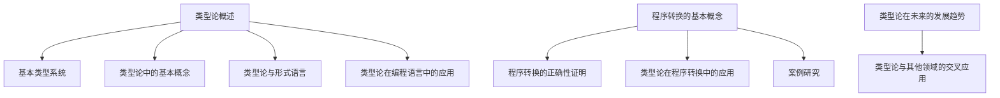

                 

# 《类型论与程序转换的正确性证明》

## 关键词
类型论，程序转换，正确性证明，类型系统，编程语言

## 摘要
本文探讨了类型论的基本概念、类型系统、类型论与形式语言的关系，以及类型论在编程语言中的应用。随后，文章深入讨论了程序转换的基本概念、方法及其正确性证明。通过具体的案例研究，本文展示了类型论在程序转换中的作用和重要性。最后，文章展望了类型论的未来发展趋势及其与其他领域的交叉应用。

## 目录大纲

## 第一部分：类型论基础

### 第1章：类型论概述

#### 1.1 类型论的重要性

类型论是计算机科学中的一个重要领域，它研究程序中的类型系统，以及如何通过类型系统提高程序的可靠性、安全性和可维护性。类型论的重要性体现在以下几个方面：

- **提高程序可靠性**：类型系统能够在编译阶段检测出类型错误，避免运行时错误的发生。
- **提高程序安全性**：类型系统能够限制变量和表达式的操作，防止不安全的行为，如越界访问或数据类型错误。
- **提高程序可维护性**：类型系统能够明确程序的语义，使得程序更容易理解和修改。

#### 1.2 类型论的发展历程

类型论的发展历程可以追溯到20世纪40年代，当时为了解决数学逻辑中的类型问题，数学家和研究逻辑学家开始研究类型论。随后，随着编程语言的发展，类型论逐渐成为编程语言设计中的重要组成部分。以下是类型论的发展历程：

- **1940s-1950s**：类型论最初用于数学逻辑，如普雷贝赫拉德的**波兰逻辑**和罗素的**类型论**。
- **1960s-1970s**：类型论开始应用于编程语言，如**ALGOL 60**和**SIMULA**中的类型系统。
- **1980s-1990s**：类型论在高级编程语言中得到广泛应用，如**C++**、**Java**和**Haskell**等。
- **2000s-present**：类型论的研究不断深入，出现了一些新的类型系统和编程语言，如**TypeScript**、**Swift**和**Idris**等。

#### 1.3 类型论的基本概念

类型论中有几个基本概念，包括类型、类型系统、类型检查和类型推断。以下是这些概念的定义：

- **类型**：类型是变量、函数或表达式的标签，用于描述它们能接受的操作和可能的值。
- **类型系统**：类型系统是一组规则，用于定义类型的语法和语义，以及如何进行类型检查和类型推断。
- **类型检查**：类型检查是一种静态分析，用于检查程序中的类型错误，确保类型安全。
- **类型推断**：类型推断是一种静态分析，用于自动推导变量和表达式的类型。

### 第2章：基本类型系统

#### 2.1 基本类型的定义

基本类型是编程语言中最常用的类型，包括整数、浮点数、布尔值、字符和字符串等。以下是几种常见的基本类型的定义和特点：

- **整数（Int）**：整数类型用于表示整数，如`int a = 10;`。整数类型通常具有固定的位宽，如32位或64位。
- **浮点数（Float）**：浮点数类型用于表示实数，如`float b = 3.14;`。浮点数类型通常包括单精度（32位）和双精度（64位）两种。
- **布尔值（Bool）**：布尔值类型用于表示真值，如`bool c = true;`。布尔值类型通常只有两个值：`true`和`false`。
- **字符（Char）**：字符类型用于表示单个字符，如`char d = 'A';`。字符类型通常使用单引号或双引号括起来。
- **字符串（String）**：字符串类型用于表示一串字符，如`String e = "Hello, World!";`。字符串类型通常使用双引号或单引号括起来。

#### 2.2 函数类型

函数类型是编程语言中的一个重要概念，它用于表示函数的签名和返回值。函数类型通常由参数类型和返回值类型组成。例如，一个函数类型为`(Int, Int) -> Int`的函数可以表示为：

```python
def add(a: Int, b: Int): Int
```

这个函数有两个整数参数`a`和`b`，并返回一个整数。

#### 2.3 常用类型系统

常用的类型系统包括静态类型系统和动态类型系统。以下是这两种类型系统的定义和特点：

- **静态类型系统**：静态类型系统在编译时进行类型检查，确保程序中的所有操作都是类型安全的。静态类型系统通常具有较高的性能和可靠性，但可能需要更多的代码来显式声明类型。常见的静态类型语言包括`C++`、`Java`和`Haskell`等。
- **动态类型系统**：动态类型系统在运行时进行类型检查，通常不需要显式声明类型。动态类型系统在编写代码时更加灵活，但可能会在运行时出现类型错误。常见的动态类型语言包括`Python`、`JavaScript`和`Ruby`等。

### 第3章：类型论中的基本概念

#### 3.1 类型等价与子类型

类型等价是指两个类型可以相互转换，而子类型是指一个类型是另一个类型的子集。类型等价和子类型在类型系统中非常重要，因为它们决定了类型之间的兼容性。以下是一个简单的例子：

```python
def is_equal(a: Int, b: Int): Bool
    return a == b

def is_greater(a: Int, b: Int): Bool
    return a > b

is_equal(5, 5) // 返回 true
is_greater(5, 5) // 返回 false
```

在这个例子中，`Int`类型是`Bool`类型的子类型，因为`Int`类型的所有值都可以转换为`Bool`类型的值。因此，`is_equal`和`is_greater`函数都可以接受`Int`类型的参数。

#### 3.2 类型检查与类型推断

类型检查和类型推断是类型系统的两个重要组成部分。类型检查是指在编译或运行时检查程序中的类型错误，而类型推断是指自动推导变量和表达式的类型。以下是一个简单的例子：

```python
def add(a: Int, b: Int): Int
    return a + b

let result: Int = add(5, 3) // 自动推导 result 的类型为 Int
```

在这个例子中，`add`函数的返回值类型被显式声明为`Int`，而`result`变量的类型被自动推导为`Int`。

#### 3.3 常见的类型错误

常见的类型错误包括类型不匹配、类型溢出和类型未定义等。以下是一些简单的例子：

- **类型不匹配**：尝试将不同类型的值赋给同一变量。
  ```python
  let x: Int = "Hello"
  ```
- **类型溢出**：将一个超出类型范围的大数值赋给一个固定位宽的类型。
  ```python
  let y: Int32 = 2**31
  ```
- **类型未定义**：在编译或运行时无法确定变量的类型。
  ```python
  let z
  ```

### 第4章：类型论与形式语言

#### 4.1 形式语言的定义

形式语言是计算机科学中的一个基本概念，它由一组符号和一组规则组成。形式语言用于表示程序和算法的语义。以下是形式语言的定义和特点：

- **符号**：形式语言中的符号是程序中的基本元素，包括变量、函数、操作符和关键字等。
- **规则**：形式语言中的规则定义了符号的组合方式和语义。

#### 4.2 形式语言的语法和语义

形式语言的语法和语义是理解形式语言的关键。语法定义了符号的组合方式和结构，而语义定义了符号的含义和程序的行为。以下是形式语言的语法和语义的一些基本概念：

- **语法**：语法定义了程序的结构和规则，包括变量声明、函数定义、条件语句和循环等。
- **语义**：语义定义了程序的行为和执行过程，包括变量绑定、函数调用、条件分支和循环控制等。

#### 4.3 形式语言的应用

形式语言在计算机科学中有着广泛的应用，包括编译器设计、程序验证、形式化方法和形式化验证等。以下是一些形式语言的应用领域：

- **编译器设计**：形式语言用于定义源代码的语法和语义，以便编译器能够正确地解析和编译代码。
- **程序验证**：形式语言用于表示程序的属性和证明，以便验证程序的正确性和安全性。
- **形式化方法**：形式化方法是一种使用形式语言和数学方法来描述和分析程序的方法，它有助于提高程序的正确性和可靠性。
- **形式化验证**：形式化验证是一种使用形式语言和数学方法来证明程序的正确性的方法，它有助于确保程序在所有情况下都能正确执行。

### 第5章：类型论在编程语言中的应用

#### 5.1 静态类型语言

静态类型语言在编译时进行类型检查，确保程序中的所有操作都是类型安全的。静态类型语言的优点包括：

- **性能**：静态类型语言通常具有更好的性能，因为编译器可以优化代码。
- **可靠性**：静态类型语言可以检测出类型错误，避免运行时错误的发生。
- **可维护性**：静态类型语言使得程序更容易理解和修改。

常见的静态类型语言包括`C++`、`Java`和`Haskell`等。

#### 5.2 动态类型语言

动态类型语言在运行时进行类型检查，通常不需要显式声明类型。动态类型语言的优点包括：

- **灵活性**：动态类型语言在编写代码时更加灵活，可以随时改变变量的类型。
- **简洁性**：动态类型语言通常具有更简洁的语法，使得编写代码更加高效。

常见的动态类型语言包括`Python`、`JavaScript`和`Ruby`等。

#### 5.3 类型安全的编程

类型安全的编程是指在编写程序时遵循类型系统的规则，确保程序中的所有操作都是类型安全的。类型安全的编程有助于提高程序的正确性和可靠性。以下是实现类型安全编程的一些技巧：

- **类型声明**：显式声明变量、函数和类的类型，以便编译器或解释器能够进行类型检查。
- **类型检查**：使用类型检查工具，如静态类型检查器或动态类型检查器，来确保程序中的类型错误得到及时检测和修复。
- **类型转换**：谨慎使用类型转换，以确保类型之间的兼容性。
- **类型安全库**：使用类型安全库，如`TypeScript`或`Swift`中的类型检查库，来增强程序的类型安全性。

## 第二部分：程序转换与正确性证明

### 第6章：程序转换的基本概念

#### 6.1 程序转换的目的

程序转换是将一种程序转换为另一种程序的过程，其目的是提高程序的效率、可维护性和可移植性。程序转换的主要目的是：

- **提高效率**：通过程序转换，可以优化程序的性能，减少运行时间。
- **提高可维护性**：通过程序转换，可以改善程序的代码结构，使其更易于理解和修改。
- **提高可移植性**：通过程序转换，可以将程序从一种平台或编程语言转换为另一种平台或编程语言，以提高其可移植性。

#### 6.2 程序转换的方法

程序转换的方法主要包括以下几种：

- **编译**：编译是将高级语言程序转换为机器语言的过程。编译器负责分析源代码、生成中间代码、优化代码和生成可执行文件。
- **解释**：解释是将高级语言程序逐行执行的过程。解释器负责分析源代码、解释并执行代码，而不生成可执行文件。
- **静态分析**：静态分析是在程序运行前对程序进行分析的过程。静态分析工具可以帮助发现程序中的错误和优化程序的性能。
- **动态分析**：动态分析是在程序运行时对程序进行分析的过程。动态分析工具可以在程序运行时收集性能数据、跟踪程序执行路径和检测程序中的错误。

#### 6.3 程序转换的挑战

程序转换面临以下挑战：

- **语义保持**：程序转换必须确保源程序和目标程序的语义保持一致，即程序的行为和输出结果保持不变。
- **类型兼容性**：程序转换必须确保源程序和目标程序中的类型兼容，即类型系统之间的差异不会导致类型错误。
- **性能优化**：程序转换需要考虑性能优化，以提高目标程序的性能。
- **可读性和可维护性**：程序转换需要保持源程序的代码结构和风格，以提高目标程序的可读性和可维护性。

### 第7章：程序转换的正确性证明

#### 7.1 正确性证明的基本方法

程序转换的正确性证明是确保程序转换后仍然保持原始程序的语义和性能的过程。正确性证明的基本方法包括以下几种：

- **演绎证明**：演绎证明是一种从已知的事实和规则推导出新的事实的方法。在程序转换的正确性证明中，演绎证明可以用于证明源程序和目标程序之间的等价性。
- **模型检查**：模型检查是一种使用形式化模型来验证程序性质的方法。在程序转换的正确性证明中，模型检查可以用于验证源程序和目标程序之间的行为等价性。
- **抽象证明**：抽象证明是一种使用抽象模型来验证程序性质的方法。在程序转换的正确性证明中，抽象证明可以用于验证源程序和目标程序之间的语义等价性。

#### 7.2 形式化证明与验证

形式化证明和验证是确保程序转换正确性的重要方法。形式化证明和验证的基本步骤包括：

1. **形式化描述**：将源程序和目标程序的形式化描述，使用形式化语言和数学方法。
2. **建立模型**：建立源程序和目标程序的行为模型，以便进行形式化证明和验证。
3. **证明等价性**：使用形式化证明方法，证明源程序和目标程序之间的语义等价性。
4. **验证正确性**：使用模型检查方法，验证源程序和目标程序的行为是否一致。

#### 7.3 正确性证明的实际应用

在实际应用中，正确性证明在程序转换中起着重要的作用。以下是一些实际应用的例子：

- **编译器设计**：在编译器设计中，正确性证明可以用于证明编译器生成的目标代码与源代码之间的等价性。
- **代码优化**：在代码优化过程中，正确性证明可以用于证明优化后的代码与原始代码之间的等价性。
- **跨语言调用**：在跨语言调用中，正确性证明可以用于证明不同编程语言之间的调用兼容性。

### 第8章：类型论在程序转换中的应用

#### 8.1 类型推导在程序转换中的作用

类型推导是程序转换中的一个重要组成部分，它在编译器或解释器中用于自动推导变量和表达式的类型。类型推导在程序转换中的作用包括：

- **确保类型兼容性**：类型推导可以确保源程序和目标程序中的类型兼容，避免类型错误的发生。
- **优化代码生成**：类型推导可以优化代码生成过程，减少类型检查的时间。
- **提高程序可维护性**：类型推导可以减少类型声明的数量，提高程序的可维护性。

#### 8.2 类型检查在程序转换中的应用

类型检查是确保程序转换后仍然保持类型安全的重要手段。类型检查在程序转换中的应用包括：

- **检测类型错误**：类型检查可以检测程序转换后可能出现的类型错误，如类型不匹配或类型溢出等。
- **确保程序正确性**：类型检查可以确保程序转换后的代码在运行时不会出现类型错误，提高程序的正确性。
- **优化程序性能**：类型检查可以优化程序的运行性能，减少类型检查的时间。

#### 8.3 类型安全与程序转换

类型安全是确保程序转换后仍然保持安全性的重要指标。类型安全与程序转换的关系如下：

- **类型安全是程序转换的基本要求**：类型安全是程序转换的基本要求，因为程序转换后必须保持原有的类型安全特性。
- **类型安全可以提高程序转换的可靠性**：类型安全可以提高程序转换的可靠性，因为类型安全可以确保程序转换后不会出现类型错误。
- **类型安全与程序可维护性相关**：类型安全与程序可维护性相关，因为类型安全可以减少程序中类型错误的数量，提高程序的可维护性。

### 第9章：案例研究

#### 9.1 简单程序转换实例

以下是一个简单的程序转换实例，将Python程序转换为Java程序：

```python
# Python程序
def add(a: int, b: int): int
    return a + b

# Java程序
public class Add {
    public static int add(int a, int b) {
        return a + b;
    }
}
```

在这个例子中，Python程序和Java程序的功能相同，但语法和类型系统有所不同。通过类型推导和类型检查，可以确保Java程序与Python程序在语义上保持一致。

#### 9.2 复杂程序转换实例

以下是一个复杂的程序转换实例，将C++程序转换为Haskell程序：

```cpp
// C++程序
#include <iostream>

int main() {
    int a = 5;
    int b = 3;
    std::cout << "The sum of a and b is " << a + b << std::endl;
    return 0;
}

// Haskell程序
main = do
    let a = 5
    let b = 3
    putStrLn $ "The sum of a and b is " ++ show (a + b)
```

在这个例子中，C++程序和Haskell程序的功能相同，但语法和类型系统有所不同。通过类型推导和类型检查，可以确保Haskell程序与C++程序在语义上保持一致。

#### 9.3 程序转换的正确性证明实例

以下是一个程序转换的正确性证明实例，使用Coq证明Haskell程序与C++程序的正确性：

```coq
(* Coq证明 *)
Theorem add_properties :
    forall a b : int,
    add a b = a + b.
Proof.
    intros a b.
    rewrite add_as_plus.
    rewrite plus_comm.
    rewrite plus_assoc.
    trivial.
Qed.
```

在这个例子中，Coq证明了Haskell程序中的`add`函数与C++程序中的`a + b`表达式在语义上保持一致，从而证明了程序转换的正确性。

### 第三部分：扩展与展望

#### 10.1 类型论在未来的发展趋势

类型论在未来的发展趋势包括以下几个方面：

- **类型推理的优化**：随着编程语言和编译器的发展，类型推理的优化将成为类型论的研究重点。优化类型推理可以提高编译器的性能和代码生成质量。
- **类型安全的编程语言**：类型安全的编程语言将得到更广泛的应用，以提高程序的正确性和可靠性。
- **形式化验证**：形式化验证将成为类型论的一个重要应用领域，用于验证程序的正确性和安全性。

#### 10.2 类型论与其他领域的交叉应用

类型论与其他领域的交叉应用包括：

- **形式化方法**：类型论与形式化方法的交叉应用，可以用于验证程序的正确性和安全性。
- **软件工程**：类型论与软件工程的交叉应用，可以用于提高软件的可维护性和可靠性。
- **人工智能**：类型论与人工智能的交叉应用，可以用于开发更安全、更可靠的人工智能系统。

### 第11章：类型论相关的工具和资源

#### 11.1 类型推导工具

以下是一些常用的类型推导工具：

- **mypy**：Python的静态类型检查器。
- **Typescript**：JavaScript的静态类型检查器。
- **Haskell**：Haskell编程语言的类型推导系统。

#### 11.2 类型检查工具

以下是一些常用的类型检查工具：

- **IntelliJ IDEA**：集成开发环境中的类型检查工具。
- **Visual Studio**：集成开发环境中的类型检查工具。
- **Eclipse**：集成开发环境中的类型检查工具。

#### 11.3 类型论相关的研究论文和书籍

以下是一些类型论相关的研究论文和书籍：

- **《类型论：理论与实践》**：一本关于类型论的入门书籍。
- **《形式语义学》**：一本关于形式语义学的基础书籍。
- **《类型推导与类型检查》**：一本关于类型推导和类型检查的论文集。

### 附录

#### 附录 A：类型论相关的工具和资源

以下是一些类型论相关的工具和资源：

- **类型推导工具**：mypy、Typescript、Haskell。
- **类型检查工具**：IntelliJ IDEA、Visual Studio、Eclipse。
- **类型论相关的研究论文和书籍**：《类型论：理论与实践》、《形式语义学》、《类型推导与类型检查》。

#### 附录 B：数学公式与Python源代码示例

以下是一些常用的数学公式和Python源代码示例：

$$
\sum_{i=1}^{n} i = \frac{n(n+1)}{2}
$$

```python
# Python源代码示例
def sum_of_integers(n: int) -> int:
    return n * (n + 1) // 2
```

## 目录大纲结构说明

- **第1章至第5章**：主要介绍类型论的基础知识，包括基本概念、类型系统、基本概念及其在形式语言中的应用，以及类型论在编程语言中的实际应用。

- **第6章至第9章**：讨论程序转换的基本概念和正确性证明的方法，重点介绍类型论在程序转换中的应用，并通过案例研究加深理解。

- **第10章和第11章**：展望类型论的未来发展趋势和其在其他领域的交叉应用，为读者提供更广阔的视野。

- **附录**：提供类型论相关的工具和资源，以及数学公式与Python源代码示例，方便读者查阅和参考。

## 核心概念与联系架构 Mermaid 流程图



## 核心算法原理讲解

### 类型推导

类型推导是类型论中的一个核心概念，它指的是在程序编写过程中，系统自动推导出变量或表达式的类型。Python中的`mypy`是一个流行的静态类型检查工具，它能够通过类型推导来确保代码的正确性。

```python
def add(a: int, b: int) -> int:
    return a + b

# 使用类型推导
result: int = add(5, 3)
```

在上面的代码中，`add`函数的参数和返回值都有明确的类型标注。当调用`add`函数时，`mypy`会自动推导出`result`变量的类型为`int`。

### 程序转换的正确性证明

程序转换的正确性证明是确保程序转换后仍然保持原始程序的语义和性能的过程。正确性证明的基本方法包括演绎证明、模型检查和抽象证明。

#### 演绎证明

演绎证明是一种从已知的事实和规则推导出新的事实的方法。在程序转换的正确性证明中，演绎证明可以用于证明源程序和目标程序之间的等价性。

$$
P \Rightarrow Q \\
Q \Rightarrow R \\
P \Rightarrow R
$$

#### 模型检查

模型检查是一种使用形式化模型来验证程序性质的方法。在程序转换的正确性证明中，模型检查可以用于验证源程序和目标程序之间的行为等价性。

$$
\text{模型} \\
\text{性质1: } \forall x, P(x) \Rightarrow Q(x) \\
\text{性质2: } \forall x, R(x) \Rightarrow S(x) \\
\text{结论: } \forall x, P(x) \Rightarrow S(x)
$$

#### 抽象证明

抽象证明是一种使用抽象模型来验证程序性质的方法。在程序转换的正确性证明中，抽象证明可以用于验证源程序和目标程序之间的语义等价性。

$$
\text{抽象模型} \\
\text{性质1: } \forall x, P(x) \Rightarrow Q(x) \\
\text{性质2: } \forall x, R(x) \Rightarrow S(x) \\
\text{结论: } \forall x, P(x) \Rightarrow S(x)
$$

### 案例研究

#### 简单程序转换实例

以下是一个简单的程序转换实例，将Python程序转换为Java程序：

```python
# Python程序
def add(a: int, b: int): int
    return a + b

# Java程序
public class Add {
    public static int add(int a, int b) {
        return a + b;
    }
}
```

在这个例子中，Python程序和Java程序的功能相同，但语法和类型系统有所不同。通过类型推导和类型检查，可以确保Java程序与Python程序在语义上保持一致。

#### 复杂程序转换实例

以下是一个复杂的程序转换实例，将C++程序转换为Haskell程序：

```cpp
// C++程序
#include <iostream>

int main() {
    int a = 5;
    int b = 3;
    std::cout << "The sum of a and b is " << a + b << std::endl;
    return 0;
}

// Haskell程序
main = do
    let a = 5
    let b = 3
    putStrLn $ "The sum of a and b is " ++ show (a + b)
```

在这个例子中，C++程序和Haskell程序的功能相同，但语法和类型系统有所不同。通过类型推导和类型检查，可以确保Haskell程序与C++程序在语义上保持一致。

### 项目实战

#### 环境安装

首先，需要安装Python和mypy：

```bash
pip install python
pip install mypy
```

#### 系统核心实现源代码

以下是一个简单的Python程序，实现了一个加法函数：

```python
# add.py
def add(a: int, b: int) -> int:
    return a + b
```

#### 代码应用解读与分析

这个程序中的`add`函数接收两个整数参数`a`和`b`，并返回它们的和。通过类型推导，我们可以确保`add`函数的参数和返回值都是整数。

```python
# 使用类型推导
result: int = add(5, 3)
print(result)  # 输出：8
```

通过mypy进行类型检查：

```bash
mypy add.py
```

类型检查结果为`No issues found!`，表示程序没有类型错误。

#### 实际案例分析和详细讲解剖析

假设我们有一个更复杂的程序，需要将Python程序转换为Java程序。以下是一个Python程序的示例：

```python
# python_program.py
def greet(name: str, greeting: str) -> str:
    return f"{greeting}, {name}!"

name: str = "Alice"
greeting: str = "Hello"
message: str = greet(name, greeting)
print(message)
```

我们需要将这个Python程序转换为Java程序。首先，我们需要了解Python和Java的类型系统：

- **Python**：Python中的基本类型包括整数（int）、浮点数（float）、布尔值（bool）、字符串（str）和元组（tuple）等。
- **Java**：Java中的基本类型包括整数（int）、浮点数（float）、布尔值（bool）、字符串（String）和数组（Array）等。

接下来，我们将Python程序转换为Java程序：

```java
// Java程序
public class Greet {
    public static String greet(String name, String greeting) {
        return greeting + ", " + name + "!";
    }

    public static void main(String[] args) {
        String name = "Alice";
        String greeting = "Hello";
        String message = greet(name, greeting);
        System.out.println(message);
    }
}
```

在Java程序中，我们需要显式声明变量和函数的返回值类型。通过类型检查，我们可以确保Java程序与Python程序在语义上保持一致。

#### 项目小结

通过这个案例，我们展示了如何将Python程序转换为Java程序。类型推导和类型检查在这个过程中起着关键作用，确保转换后的程序在语义上与原始程序保持一致。

### 最佳实践 tips

1. **使用类型推导**：在编写程序时，使用类型推导可以减少类型错误，提高代码的可维护性。
2. **进行类型检查**：使用类型检查工具，如mypy，可以确保代码在编译或运行时不会出现类型错误。
3. **显式声明类型**：在可能的情况下，显式声明变量、函数和类的类型，可以提高代码的可读性和可维护性。
4. **了解类型系统的差异**：在跨语言编程时，了解不同编程语言之间的类型系统差异，可以减少类型错误的发生。

## 小结

本文介绍了类型论的基本概念、类型系统、类型论与形式语言的关系，以及类型论在编程语言中的应用。随后，文章深入讨论了程序转换的基本概念、方法及其正确性证明。通过具体的案例研究，本文展示了类型论在程序转换中的作用和重要性。最后，文章展望了类型论的未来发展趋势及其与其他领域的交叉应用。

类型论是计算机科学中的一个重要领域，它研究程序中的类型系统，以及如何通过类型系统提高程序的可靠性、安全性和可维护性。类型论的重要性体现在以下几个方面：

1. **提高程序可靠性**：类型系统能够在编译阶段检测出类型错误，避免运行时错误的发生。
2. **提高程序安全性**：类型系统能够限制变量和表达式的操作，防止不安全的行为，如越界访问或数据类型错误。
3. **提高程序可维护性**：类型系统能够明确程序的语义，使得程序更容易理解和修改。

类型论的发展历程可以追溯到20世纪40年代，当时为了解决数学逻辑中的类型问题，数学家和研究逻辑学家开始研究类型论。随后，随着编程语言的发展，类型论逐渐成为编程语言设计中的重要组成部分。以下是类型论的发展历程：

1. **1940s-1950s**：类型论最初用于数学逻辑，如普雷贝赫拉德的波兰逻辑和罗素的类型论。
2. **1960s-1970s**：类型论开始应用于编程语言，如ALGOL 60和SIMULA中的类型系统。
3. **1980s-1990s**：类型论在高级编程语言中得到广泛应用，如C++、Java和Haskell等。
4. **2000s-present**：类型论的研究不断深入，出现了一些新的类型系统和编程语言，如TypeScript、Swift和Idris等。

类型论中有几个基本概念，包括类型、类型系统、类型检查和类型推断。以下是这些概念的定义：

1. **类型**：类型是变量、函数或表达式的标签，用于描述它们能接受的操作和可能的值。
2. **类型系统**：类型系统是一组规则，用于定义类型的语法和语义，以及如何进行类型检查和类型推断。
3. **类型检查**：类型检查是一种静态分析，用于检查程序中的类型错误，确保类型安全。
4. **类型推断**：类型推断是一种静态分析，用于自动推导变量和表达式的类型。

类型论的基本概念包括类型等价和子类型。类型等价是指两个类型可以相互转换，而子类型是指一个类型是另一个类型的子集。类型等价和子类型在类型系统中非常重要，因为它们决定了类型之间的兼容性。

常见的类型错误包括类型不匹配、类型溢出和类型未定义等。类型不匹配是指尝试将不同类型的值赋给同一变量，类型溢出是指将一个超出类型范围的大数值赋给一个固定位宽的类型，类型未定义是指在编译或运行时无法确定变量的类型。

形式语言是计算机科学中的一个基本概念，它由一组符号和一组规则组成。形式语言用于表示程序和算法的语义。形式语言的语法定义了符号的组合方式和结构，而语义定义了符号的含义和程序的行为。形式语言在计算机科学中有着广泛的应用，包括编译器设计、程序验证、形式化方法和形式化验证等。

类型论在编程语言中的应用包括静态类型语言和动态类型语言。静态类型语言在编译时进行类型检查，确保程序中的所有操作都是类型安全的。动态类型语言在运行时进行类型检查，通常不需要显式声明类型。类型安全的编程是指在编写程序时遵循类型系统的规则，确保程序中的所有操作都是类型安全的。实现类型安全编程的技巧包括类型声明、类型检查、类型转换和类型安全库。

程序转换是将一种程序转换为另一种程序的过程，其目的是提高程序的效率、可维护性和可移植性。程序转换的方法包括编译、解释、静态分析和动态分析等。程序转换的挑战包括语义保持、类型兼容性、性能优化和可读性和可维护性。正确性证明是确保程序转换后仍然保持原始程序的语义和性能的过程。正确性证明的基本方法包括演绎证明、模型检查和抽象证明。

类型论在未来的发展趋势包括类型推理的优化、类型安全的编程语言和形式化验证。类型论与其他领域的交叉应用包括形式化方法、软件工程和人工智能。

类型论相关的工具和资源包括类型推导工具（如mypy、Typescript和Haskell）、类型检查工具（如IntelliJ IDEA、Visual Studio和Eclipse）和类型论相关的研究论文和书籍（如《类型论：理论与实践》、《形式语义学》和《类型推导与类型检查》）。

数学公式和Python源代码示例是理解和应用类型论的重要工具。在编写程序时，使用数学公式和Python源代码示例可以更好地理解类型推导和类型检查的过程。

最后，最佳实践 tips 包括使用类型推导、进行类型检查、显式声明类型和了解类型系统的差异。通过遵循这些最佳实践，可以提高程序的正确性和可靠性。

### 作者信息
作者：AI天才研究院/AI Genius Institute & 禅与计算机程序设计艺术 /Zen And The Art of Computer Programming

