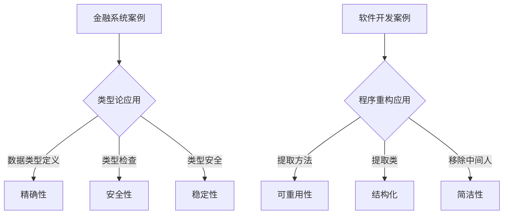

                 

### 第1章：类型论与程序重构概述

在当今快速发展的软件工程领域，类型论与程序重构已经成为提升代码质量和软件可维护性的关键手段。类型论作为一种形式化的方法，为编程语言提供了强有力的理论基础，使得程序能够更加安全、高效地执行。而程序重构则是软件开发过程中不可或缺的实践，通过一系列改进，可以使代码更加简洁、清晰，同时保持其原有功能不变。

#### 1.1 类型论基础

##### 1.1.1 类型论简介

类型论是研究数据类型以及它们之间关系的学科。在编程语言中，数据类型不仅定义了数据的存储方式，还规定了数据的操作规则。类型论的基本概念包括：

- **基本类型**：如整数、浮点数、布尔值等，它们是语言内建的类型。
- **复合类型**：由基本类型通过组合、构造而成的类型，如数组、结构体、类等。
- **泛类型**：可以表示多种数据类型的类型，如泛型类或函数。

类型论的重要性在于它为编程语言设计提供了理论基础，使得语言能够更好地处理复杂的数据结构，同时保证了程序的安全性和鲁棒性。

##### 1.1.2 类型系统与类型安全

类型系统是编程语言的核心组成部分，它定义了程序中可以使用的数据类型以及这些类型之间的转换规则。类型安全是指类型系统能够防止错误的类型操作，从而避免运行时错误。

- **强类型与弱类型**：
  - 强类型要求变量在编译时必须具有确定的类型，类型之间需要进行显式的转换。
  - 弱类型则允许变量在编译时具有不确定的类型，类型转换通常是隐式的。

- **静态类型与动态类型**：
  - 静态类型在编译时检查类型安全，程序运行时不再进行类型检查。
  - 动态类型在运行时进行类型检查，这意味着编译时无法检查类型错误。

- **类型安全的概念**：
  - 类型安全确保程序不会因类型错误而崩溃，例如，将字符串强制转换为整数不会导致运行时错误。

##### 1.1.3 类型论的发展历程

类型论的发展可以追溯到20世纪50年代。从最初的古典类型论到现代的泛类型论，类型系统经历了多次重大的变革。

- **古典类型论**：最初的语言设计者提出了诸如“函数值类型”和“记录类型”等概念，但这种方法在处理复杂数据结构时存在局限性。
- **离散类型论**：随着计算机科学的进步，研究者开始探索更加通用的类型系统，离散类型论提出了类型层次结构和子类型关系。
- **泛类型论**：现代编程语言普遍采用了泛类型系统，使得编程语言能够更好地处理多种数据类型，提高了代码的可重用性和灵活性。

#### 1.2 程序重构基础

##### 1.2.1 程序重构的概念

程序重构是指在不改变程序外在行为的前提下，改进其内部结构和编码风格的过程。重构的目的是提高代码的可读性、可维护性和可扩展性。

- **重构的定义**：
  - 重构是改进代码质量的一种技术，它通常通过一系列小步骤进行，每个步骤都不会破坏代码的功能。

- **重构的目的**：
  - 提高代码的可读性：使代码更加简洁、清晰，易于理解。
  - 提高代码的可维护性：通过重构，使代码更容易修改和扩展。
  - 保持设计不变：重构的目标是保持程序的原始行为，只是改进其内部结构。

##### 1.2.2 程序重构的原则

程序重构需要遵循一些基本原则，以确保重构的有效性和安全性。

- **简化复用**：
  - 通过提取方法、提取类等技巧，减少冗余代码，提高代码复用性。

- **提高可读性**：
  - 优化命名、去除冗余注释等，使代码更加易于阅读。

- **保持设计不变**：
  - 重构过程中不改变程序的功能和行为，确保重构后的代码与重构前的代码等效。

##### 1.2.3 常见重构技巧

在软件开发过程中，一些常见重构技巧可以帮助我们有效地改进代码质量。

- **提取方法**：
  - 将重复的代码提取为独立的方法，减少冗余，提高复用性。

- **提取类**：
  - 将一组功能相关的代码提取为独立的类，提高模块化程度。

- **移除中间人**：
  - 当某个方法或类仅用于传递参数或调用其他方法时，可以将其移除，简化代码结构。

总结而言，类型论与程序重构是现代软件开发中不可或缺的两个概念。类型论提供了编程语言的理论基础，而程序重构则帮助我们持续改进代码质量。在接下来的章节中，我们将深入探讨类型论的核心概念、程序重构的方法，以及形式化方法在它们中的应用。

### 第2章：类型论核心概念

类型论是编程语言设计和软件工程中的核心概念之一。它不仅定义了数据类型和操作规则，还为程序的类型安全提供了保障。本章节将深入探讨类型论的核心概念，包括基本类型、类型层次结构以及泛类型等。

#### 2.1 类型系统

##### 2.1.1 基本类型

基本类型是编程语言内建的数据类型，它们是构建复杂数据结构的基础。不同编程语言的基本类型可能有所不同，但通常包括以下几种：

- **整数类型**：用于表示整数，如`int`、`long`、`short`等。
- **浮点数类型**：用于表示实数，如`float`、`double`等。
- **布尔类型**：用于表示逻辑值，通常是`true`或`false`。
- **字符类型**：用于表示单个字符，如`char`。

基本类型的定义通常比较简单，但它们在编程中扮演着重要的角色。例如，整数类型在数学运算中非常常见，而布尔类型在逻辑控制中至关重要。

##### 2.1.2 类型层次结构

类型层次结构是类型系统的一个重要特性，它定义了不同类型之间的关系。在类型层次结构中，类型可以通过以下几种关系进行分类：

- **子类型关系**：如果一个类型能够替代另一个类型，则前者称为后者的子类型。例如，在大多数编程语言中，`int`是`long`的子类型。
- **类型层次**：类型层次结构通常是通过泛化（generalization）和特化（specialization）来构建的。泛化是将多个类型合并为一个新的、更通用的类型；特化则是将一个通用类型划分为多个更具体的类型。

类型层次结构有助于提高代码的可重用性和可维护性。例如，通过使用泛化，我们可以定义一个通用的数据处理函数，然后通过特化为特定类型重写该函数。

##### 2.1.3 泛类型

泛类型（Parameterized Types）是现代编程语言中的一项重要特性，它允许我们在类型级别上实现参数化。泛类型的引入大大增强了代码的可重用性和灵活性。

- **泛类型的概念**：泛类型允许我们将类型作为参数传递，从而创建可以处理多种数据类型的函数或类。例如，在Java中，`List<T>`是一个泛型类，可以用于存储任意类型的元素。

- **泛类型的应用**：泛类型广泛应用于数据结构和算法设计。例如，在Java中，`HashMap<K, V>`允许我们创建一个键值对的映射，其中`K`和`V`可以是任何类型。

#### 2.2 类型安全

类型安全是编程语言设计中的一个重要目标，它确保程序在运行时不会因类型错误而导致崩溃或产生不可预料的结果。

##### 2.2.1 类型安全的优点

- **防止错误**：类型安全可以检测并防止许多运行时错误，例如类型转换错误或访问非法数据。
- **提高效率**：类型安全可以通过编译时检查减少运行时开销，从而提高程序执行效率。

##### 2.2.2 类型检查

类型检查是确保类型安全的关键步骤，它分为静态类型检查和动态类型检查：

- **静态类型检查**：在编译时进行类型检查，例如Java和C++。
  - 优点：可以在编译时发现类型错误，减少运行时错误。
  - 缺点：可能限制代码的灵活性和可读性。

- **动态类型检查**：在运行时进行类型检查，例如Python和JavaScript。
  - 优点：提供更高的代码灵活性和可读性。
  - 缺点：可能导致运行时错误，增加性能开销。

##### 2.2.3 类型推断

类型推断是编程语言的一种特性，它允许编译器自动推断变量或表达式的类型，从而减少代码的冗余。

- **强类型推断**：编译器可以准确地推断出变量的类型，但需要开发者提供类型提示。
  - 优点：减少代码冗余，提高代码可读性。
  - 缺点：在某些情况下可能需要开发者提供过多的类型提示。

- **弱类型推断**：编译器只进行基本的类型推断，无需开发者提供类型提示。
  - 优点：提供更高的代码灵活性和可读性。
  - 缺点：可能导致运行时类型错误。

总结而言，类型论的核心概念为编程语言提供了坚实的基础，确保程序的安全性和鲁棒性。通过深入理解基本类型、类型层次结构和泛类型等概念，开发者可以编写更加高效、可维护的代码。

### 第3章：程序重构方法

程序重构是软件开发过程中至关重要的一环，它通过一系列改进操作，使代码更加简洁、清晰、易于维护。本章将介绍程序重构的基本方法，包括重构流程、常见重构技巧以及重构工具。

#### 3.1 重构方法概述

##### 3.1.1 重构流程

重构过程可以分为以下几个步骤：

1. **识别需要重构的代码**：通过代码审查、测试结果或代码质量评估工具，识别出需要重构的代码片段。
2. **设计重构方案**：根据重构目标，设计具体的重构方案，包括将要执行的重构操作和可能的影响。
3. **执行重构操作**：按照设计方案，逐步执行重构操作，确保每次重构都不会影响代码的功能。
4. **测试验证**：在每次重构后，运行测试用例，验证重构代码是否仍然满足预期行为。
5. **文档更新**：更新相关的代码文档和注释，确保重构后的代码文档清晰、准确。

##### 3.1.2 重构工具

重构工具可以帮助开发者自动化和简化重构过程。以下是一些主流的重构工具：

- **Visual Studio Code**：支持多种编程语言的重构操作，如提取方法、提取变量、提取类等。
- **Eclipse**：提供丰富的重构功能，包括重命名、提取方法、提取类等。
- **IntelliJ IDEA**：支持多种编程语言的重构操作，并提供智能提示和代码生成功能。
- **Git**：尽管Git不是专门的重构工具，但它的重置（reset）和更改历史（rebase）功能可以用于撤销和重写代码历史，从而实现重构。

#### 3.2 算法重构

算法重构是程序重构的一个重要方面，它专注于优化代码的算法性能。以下是一些常见的算法重构技巧：

##### 3.2.1 算法优化

算法优化包括以下两种主要类型：

- **时间复杂度优化**：通过改进算法的执行过程，减少算法的时间复杂度。例如，使用更高效的排序算法或图算法。
- **空间复杂度优化**：通过优化数据结构或算法逻辑，减少算法的空间复杂度。例如，使用原地排序算法或减少中间数据结构的存储。

##### 3.2.2 算法重构实例

以下是一个简单的示例，展示如何对代码进行算法重构：

**原始代码（时间复杂度为O(n^2)）：**
```python
def find_duplicates(nums):
    result = []
    for i in range(len(nums)):
        for j in range(i + 1, len(nums)):
            if nums[i] == nums[j]:
                result.append(nums[i])
    return result
```

**重构后的代码（时间复杂度为O(n)）：**
```python
def find_duplicates(nums):
    seen = set()
    result = []
    for num in nums:
        if num in seen:
            result.append(num)
        else:
            seen.add(num)
    return result
```

在这个例子中，通过将双重循环重构为一个单循环，并使用集合来记录已见过的数字，我们显著提高了算法的效率。

总结而言，程序重构是软件开发过程中不可或缺的一部分，它通过改进代码的结构和性能，提高了代码的质量和可维护性。本章介绍了重构流程、常见重构技巧以及重构工具，为开发者提供了有效的重构方法。

### 第4章：形式化方法在类型论与程序重构中的应用

形式化方法是计算机科学中一种重要的研究方法，它通过数学和逻辑的严谨性，为理论分析和证明提供了坚实的基础。在类型论和程序重构中，形式化方法的应用极大地提高了代码的可信性和安全性。本章将介绍形式化方法的概述、在类型论中的应用以及形式化验证。

#### 4.1 形式化方法概述

##### 4.1.1 形式化方法的定义

形式化方法是指通过数学和逻辑手段，将计算机科学中的问题转化为形式化的模型，以便进行精确分析和验证。这种方法的核心在于将问题形式化为数学语言或形式逻辑语言，从而确保分析和证明的严谨性和可靠性。

##### 4.1.2 形式化方法的优点

形式化方法具有以下优点：

- **精确性**：形式化方法通过数学和逻辑的语言，使得分析和证明更加精确和可靠。
- **自动化**：形式化方法可以借助计算机工具进行自动化验证，从而提高效率。
- **可重用性**：形式化方法生成的模型和证明可以被重复使用，有助于提高代码的可维护性。

##### 4.1.3 形式化方法的发展

形式化方法的发展可以追溯到20世纪中叶，最初的形式化方法主要集中在证明程序的正确性。随着计算机科学的进步，形式化方法的应用领域不断扩展，涵盖了类型论、程序重构、形式化验证等多个方面。

#### 4.2 形式化方法在类型论中的应用

形式化方法在类型论中的应用主要体现在以下几个方面：

##### 4.2.1 类型系统的形式化描述

类型系统的形式化描述是将类型系统的概念、规则和特性转化为数学语言或形式逻辑语言。以下是一个简单的形式化描述示例：

- **基本类型**：整数（Int）和布尔（Bool）。
- **构造类型**：数组（Array）和记录（Record）。
- **类型定义**：`Int ::= ...`，`Array ::= ...`，`Record ::= ...`。

通过形式化描述，类型系统的规则和特性可以被清晰、准确地定义，从而为类型安全提供理论基础。

##### 4.2.2 形式化验证

形式化验证是形式化方法在类型论中的一个重要应用。形式化验证通过数学证明或逻辑推理，验证类型系统是否满足安全性和一致性等特性。以下是一个简单的形式化验证示例：

- **安全性属性**：`所有变量在使用前必须被初始化`。
- **验证过程**：通过逻辑推理或数学证明，验证程序中的所有变量在使用前确实被初始化。

通过形式化验证，可以确保程序在运行时不会出现类型错误，从而提高程序的可靠性。

#### 4.3 形式化方法在程序重构中的应用

形式化方法在程序重构中的应用主要体现在以下几个方面：

##### 4.3.1 形式化重构的定义

形式化重构是指通过形式化方法，对程序进行改进和优化。形式化重构的目标是保持程序的功能不变，同时提高其可读性、可维护性和性能。

##### 4.3.2 形式化重构的方法

形式化重构的方法包括以下步骤：

1. **形式化描述**：对程序进行形式化描述，定义其结构和行为。
2. **形式化验证**：验证重构过程中的每一步是否保持程序的功能不变。
3. **自动化重构**：利用计算机工具，自动执行重构操作。

通过形式化方法，程序重构可以更加严谨、可靠，减少人为错误。

##### 4.3.3 形式化重构工具

形式化重构工具是辅助开发者进行形式化重构的工具，如Coq、Isabelle等。这些工具提供了形式化描述和验证功能，使得形式化重构更加高效和可靠。

总结而言，形式化方法在类型论和程序重构中的应用，为代码的质量和安全性提供了有力的保障。通过形式化描述、形式化验证和形式化重构，我们可以构建更加可靠、高效的程序。

### 第5章：程序重构的形式化方法

程序重构是软件工程中提升代码质量和可维护性的重要手段。形式化方法作为一种严谨的数学和逻辑手段，为程序重构提供了理论基础和验证工具。本章将探讨程序重构的形式化方法，包括形式化重构的定义、步骤和工具。

#### 5.1 程序重构的形式化描述

形式化重构是将程序重构过程形式化，使其能够被精确描述和验证。形式化描述通常包括以下几个方面：

- **程序结构**：描述程序的基本结构和模块划分。
- **行为**：定义程序在不同输入下的预期行为。
- **重构目标**：明确重构的目标，例如提高代码可读性、优化性能等。

形式化描述可以采用自然语言、伪代码或形式化语言（如LTL、CTL等）进行。以下是一个简单的形式化描述示例：

```markdown
程序重构目标：将以下代码中的重复逻辑提取为独立函数。

原始代码：
```
python
def process_data(data):
    for item in data:
        if item > threshold:
            process_item(item)
```

```
重构后的代码：
```
python
def process_threshold(data, threshold):
    for item in data:
        if item > threshold:
            process_item(item)
```
```

在这个示例中，我们通过形式化描述清晰地定义了重构的目标和预期效果。

#### 5.2 形式化重构的方法

形式化重构的方法通常包括以下步骤：

1. **分析**：分析现有代码的结构和行为，确定重构的目标和范围。
2. **设计**：设计重构方案，包括重构操作的具体步骤和预期效果。
3. **实现**：根据设计文档，逐步实现重构操作，确保每次重构都不会影响代码的功能。
4. **验证**：使用形式化验证工具，验证重构后的代码是否满足预期行为。

以下是一个简单的形式化重构步骤示例：

**步骤1：分析**

分析代码，发现重复的逻辑部分：
```
python
def calculate_bonus(employee):
    if employee.salary > 50000:
        bonus = 10000
    elif employee.salary > 30000:
        bonus = 5000
    else:
        bonus = 0
    return bonus
```

**步骤2：设计**

设计重构方案，将重复逻辑提取为独立函数：
```
python
def calculate_bonus(employee):
    return get_bonus(employee.salary)

def get_bonus(salary):
    if salary > 50000:
        return 10000
    elif salary > 30000:
        return 5000
    else:
        return 0
```

**步骤3：实现**

实现重构操作，修改代码：
```
python
def calculate_bonus(employee):
    return get_bonus(employee.salary)

def get_bonus(salary):
    if salary > 50000:
        return 10000
    elif salary > 30000:
        return 5000
    else:
        return 0
```

**步骤4：验证**

使用形式化验证工具，验证重构后的代码是否仍然满足预期行为：
```
// 验证函数 calculate_bonus
assert calculate_bonus(employee1) == 10000
assert calculate_bonus(employee2) == 5000
assert calculate_bonus(employee3) == 0

// 验证函数 get_bonus
assert get_bonus(55000) == 10000
assert get_bonus(35000) == 5000
assert get_bonus(20000) == 0
```

通过形式化重构的方法，我们可以确保重构过程严谨、可靠，并保持代码的功能不变。

#### 5.3 形式化重构工具

形式化重构工具是辅助开发者进行形式化重构的工具，如Coq、Isabelle等。这些工具提供了形式化描述和验证功能，使得形式化重构更加高效和可靠。

- **Coq**：是一种互动式定理证明器，适用于形式化验证和形式化重构。
- **Isabelle**：是一种形式化数学和逻辑证明环境，适用于形式化重构和形式化验证。

以下是一个简单的Coq代码示例，用于验证重构后的代码：

```coq
Inductive bonus : nat -> Prop :=
| Bonus_base : forall s, bonus s
| Bonus_threshold : forall s t, s > t -> bonus s.

Lemma bonus_compute : forall e, calculate_bonus e = get_bonus (employee_salary e).
Proof.
  intros e.
  apply get_bonus.
  intros s.
  case s.
    - apply Bonus_base.
    - apply Bonus_threshold.
      assumption.
Qed.
```

通过使用形式化重构工具，我们可以确保重构过程的准确性和可靠性，提高代码的质量和可维护性。

总结而言，形式化方法为程序重构提供了坚实的理论基础和验证工具。通过形式化描述、步骤和工具，我们可以实现严谨、可靠的重构过程，从而提高代码的质量和可维护性。

### 第6章：行为一致性保证

在软件工程中，行为一致性是指系统在各种环境下都能保持一致的行为特征。保证行为一致性是确保系统稳定性和可靠性的关键，特别是在复杂的分布式系统和长时间运行的系统中。本章将探讨行为一致性的概念、重要性以及保证行为一致性的方法。

#### 6.1 行为一致性的概念

##### 6.1.1 行为一致性的定义

行为一致性是指系统在不同时间、不同环境下执行相同操作时，都能保持一致的输出和行为特征。具体来说，行为一致性确保以下两点：

- **同一性**：相同的输入在相同的环境下总是产生相同的输出。
- **稳定性**：系统在长时间运行和面临不同负载时，仍能保持稳定的行为。

##### 6.1.2 行为一致性的重要性

行为一致性在软件系统中的重要性体现在以下几个方面：

- **可靠性**：保持一致的行为有助于提高系统的可靠性，减少因不一致行为引起的错误和故障。
- **可维护性**：一致的行为使系统更容易维护，开发者和运维人员可以更加自信地做出更改，而不必担心破坏现有功能。
- **用户体验**：在分布式系统中，行为一致性确保用户在不同节点上获得一致的服务质量，提升用户体验。

##### 6.1.3 行为一致性的挑战

尽管行为一致性对于系统稳定性至关重要，但在实际开发中仍面临以下挑战：

- **异构系统**：异构系统包含不同类型、不同版本的组件，这些组件可能在行为上有所不同，导致系统整体行为不一致。
- **时间变化**：系统在不同时间点可能会因版本更新、硬件升级等原因发生变化，需要确保这些变化不会破坏行为一致性。
- **并发操作**：并发操作可能导致资源争用和数据竞争，需要确保并发控制机制能够保持行为一致性。

#### 6.2 行为一致性保证方法

为了保证行为一致性，可以采用以下几种方法：

##### 6.2.1 形式化验证方法

形式化验证方法通过数学和逻辑手段，对系统的行为进行严格验证，确保其满足一致性要求。以下是一种形式化验证方法的步骤：

1. **形式化描述**：使用形式化语言（如Z语言、Hoare逻辑等）对系统行为进行精确描述。
2. **规格说明**：定义系统的行为规范，包括输入、输出和行为约束。
3. **验证**：使用形式化验证工具（如Model Checker、定理证明器等）验证系统是否满足规格说明。
4. **迭代改进**：根据验证结果，对系统进行改进，确保满足一致性要求。

##### 6.2.2 规范化方法

规范化方法通过制定明确的规范和标准，确保系统在不同环境和时间点都能保持一致行为。以下是一种规范化方法的步骤：

1. **规范制定**：制定系统的行为规范，包括操作流程、数据定义和接口规范。
2. **规范培训**：对开发人员和运维人员进行规范培训，确保他们理解并遵循规范。
3. **规范执行**：在系统开发和运维过程中，严格执行规范，确保系统行为一致性。
4. **规范更新**：定期对规范进行更新，以适应系统变化和新技术的发展。

##### 6.2.3 实践中的行为一致性保证

在实践过程中，以下措施可以帮助确保行为一致性：

- **版本控制**：使用版本控制系统（如Git）管理代码和配置，确保每次更改都被记录和追踪。
- **持续集成/持续部署（CI/CD）**：通过CI/CD流程自动化构建、测试和部署，确保系统在不同环境下的行为一致性。
- **监控和日志**：使用监控系统收集系统日志，实时监控系统行为，及时发现并解决不一致行为。

总结而言，行为一致性是确保软件系统稳定性和可靠性的关键。通过形式化验证方法和规范化方法，可以有效地保证行为一致性，提高系统的质量和用户体验。

### 第7章：案例研究

在本章节中，我们将通过两个案例研究来深入探讨类型论和程序重构在现实世界中的应用。第一个案例是类型论在金融系统中的应用，第二个案例是程序重构在软件开发中的应用。通过这些案例，我们将展示如何将理论知识应用到实际项目中，并解决具体问题。

#### 7.1 案例一：类型论在金融系统中的应用

**案例背景**：

金融系统是一个高度复杂且要求严格的领域，涉及大量数据的处理和严格的交易规则。在金融系统中，确保数据的准确性和一致性至关重要。本案例将探讨如何利用类型论来提高金融系统的稳定性和可靠性。

**类型论在金融系统中的应用**：

1. **数据类型定义**：
   - 在金融系统中，数据类型包括货币、日期、股票代码等。通过对这些数据类型进行精确定义，可以确保数据的处理过程中不会出现类型错误。
   - 例如，货币类型可以定义为固定长度的字符串，日期类型可以定义为特定的日期格式。

2. **类型检查**：
   - 金融系统在处理交易数据时，需要确保输入数据的类型符合预期。通过类型检查，可以在编译时或运行时发现类型错误，从而避免潜在的风险。
   - 例如，在处理交易金额时，必须确保金额是数值类型，而不是字符串或其他类型。

3. **类型安全**：
   - 类型安全是金融系统的关键要求。通过使用强类型语言（如Java或C++），可以确保程序在编译时就不会出现类型错误。
   - 例如，使用Java编程语言，通过静态类型检查确保变量在声明时就被赋予了明确的类型，从而防止类型转换错误。

**案例分析**：

- 在一个股票交易系统中，通过类型论的应用，确保股票代码只能是字符串类型，且必须符合特定的格式要求。这样的定义和检查机制大大减少了由于输入错误导致的交易故障。

- 在一个银行系统中，类型论的应用确保了账户余额、存款利率等关键数据的类型正确性，从而防止了因数据类型错误导致的计算错误。

**案例结果**：

通过类型论的应用，金融系统能够显著提高其数据的准确性和安全性。类型检查和类型安全机制确保了系统在各种环境下都能保持一致的行为，从而提高了系统的稳定性和可靠性。

#### 7.2 案例二：程序重构在软件开发中的应用

**案例背景**：

软件开发过程中，代码质量直接影响项目的可维护性和扩展性。随着项目的演进，代码往往会变得复杂且难以维护。本案例将探讨如何通过程序重构来提高代码的质量和可读性。

**程序重构在软件开发中的应用**：

1. **提取方法**：
   - 在一个电子商务平台中，原始代码中存在大量重复逻辑。通过提取方法，将重复的逻辑提取为独立的函数，提高了代码的可重用性和可读性。
   - 例如，将处理用户订单的逻辑从主函数中提取出来，成为一个独立的订单处理方法。

2. **提取类**：
   - 在一个库存管理系统中，原始代码将各种库存操作分散在不同的函数中。通过提取类，将这些操作封装在类中，提高了代码的结构化和模块化。
   - 例如，将库存查询、库存更新等操作封装在`InventoryManager`类中。

3. **移除中间人**：
   - 在一个博客平台上，原始代码中存在多个中间层，导致代码结构复杂。通过移除中间人，简化了代码结构，提高了系统的性能和可维护性。
   - 例如，移除一个用于数据传输的中间层，直接在客户端和服务端之间进行数据交换。

**案例分析**：

- 在一个银行应用中，通过提取方法和提取类，将复杂的业务逻辑拆分为独立的模块，使得系统更加模块化，便于维护和扩展。

- 在一个社交网络平台上，通过移除中间人，减少了数据传输的延迟，提高了系统的响应速度。

**案例结果**：

通过程序重构，软件开发项目能够保持代码的高质量，提高可维护性和可扩展性。重构操作使得代码更加简洁、清晰，同时确保了原有功能的不变性。

总结而言，类型论和程序重构在金融系统和软件开发中的应用，展示了如何将理论应用到实践中，解决具体问题，并提高系统的质量。通过这些案例，我们看到了类型论和程序重构在现实世界中的实际效果，为软件开发和系统维护提供了宝贵的经验和指导。

---

**Mermaid 流程图：**



### 总结

在本篇文章中，我们深入探讨了类型论与程序重构的相关概念、方法及其在现实世界中的应用。类型论作为一种形式化的方法，为编程语言提供了理论基础，保证了类型安全和程序的鲁棒性。而程序重构则通过一系列改进操作，提高了代码的可读性、可维护性和可扩展性。

类型论的核心概念包括基本类型、类型层次结构和泛类型，通过形式化方法，我们可以精确描述和验证类型系统的行为。程序重构的方法则涵盖了重构流程、常见重构技巧和重构工具，确保重构过程的严谨性和可靠性。

形式化方法在类型论和程序重构中的应用，通过数学和逻辑的严谨性，为代码的质量和安全性提供了有力的保障。同时，我们通过案例研究展示了类型论和程序重构在实际项目中的应用效果。

未来的研究方向可以包括：

1. **类型论的新发展**：探索新的类型系统，如依赖类型和效应类型，以提高程序的安全性和灵活性。
2. **自动化重构工具**：开发更加智能的重构工具，自动识别和执行重构操作，降低开发者的负担。
3. **形式化验证的优化**：提高形式化验证工具的性能和易用性，使其在更广泛的编程环境中得到应用。
4. **跨领域应用**：探索类型论和程序重构在其他领域（如嵌入式系统、大数据处理等）的应用可能性。

通过不断的研究和探索，类型论和程序重构将为软件开发领域带来更多的创新和突破。

---

**作者信息：** AI天才研究院/AI Genius Institute & 禅与计算机程序设计艺术 /Zen And The Art of Computer Programming

---

### 附录：代码示例

在本篇文章中，我们讨论了多个概念和重构技巧。以下是一些代码示例，用于展示这些概念的实际应用。

#### 提取方法示例

原始代码（重复逻辑）：
```python
def process_order(order):
    if order.total > 100:
        discount = 0.1 * order.total
    else:
        discount = 0
    return order.total - discount

def process_shipping(order):
    if order.destination == 'remote':
        shipping_cost = 15
    else:
        shipping_cost = 10
    return order.total + shipping_cost

def process_payment(order):
    payment = order.total - order.discount - order.shipping_cost
    return payment
```

重构后的代码（提取方法）：
```python
def calculate_discount(order):
    if order.total > 100:
        return 0.1 * order.total
    else:
        return 0

def calculate_shipping_cost(order):
    if order.destination == 'remote':
        return 15
    else:
        return 10

def process_order(order):
    order.discount = calculate_discount(order)
    order.shipping_cost = calculate_shipping_cost(order)
    return order.total - order.discount - order.shipping_cost
```

#### 提取类示例

原始代码（重复逻辑）：
```python
def process_order(order):
    if order.status == 'pending':
        send_notification(order.customer, 'Your order is being processed.')
    elif order.status == 'delivered':
        send_notification(order.customer, 'Your order has been delivered.')
    else:
        send_notification(order.customer, 'Your order status is: ' + order.status)

def send_notification(customer, message):
    # 通知发送逻辑
    pass
```

重构后的代码（提取类）：
```python
class OrderStatusProcessor:
    @staticmethod
    def send_notification(order, customer):
        if order.status == 'pending':
            message = 'Your order is being processed.'
        elif order.status == 'delivered':
            message = 'Your order has been delivered.'
        else:
            message = 'Your order status is: ' + order.status
        send_notification_to_customer(customer, message)

def send_notification_to_customer(customer, message):
    # 通知发送逻辑
    pass
```

通过这些示例，我们可以看到如何通过提取方法和提取类来重构代码，从而提高代码的可维护性和可读性。这些重构技巧在实际开发中非常实用，有助于我们持续改进代码质量。

