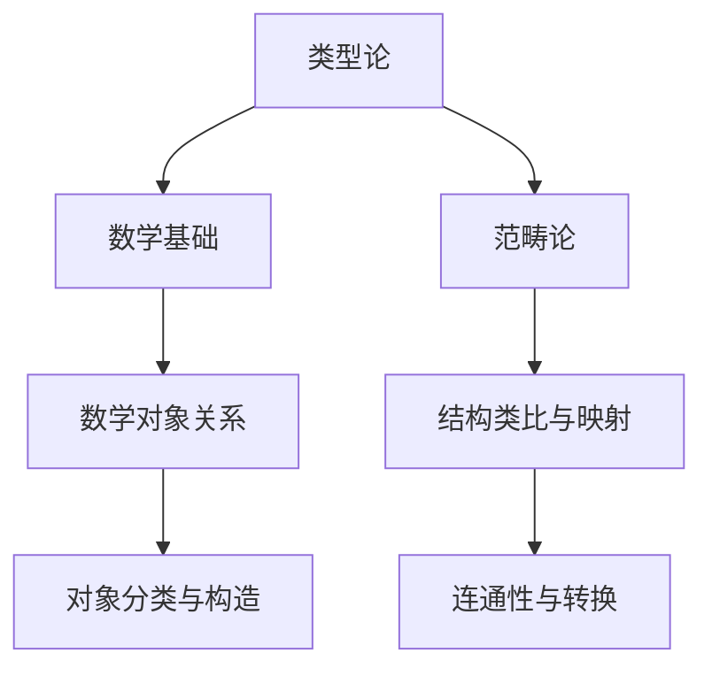
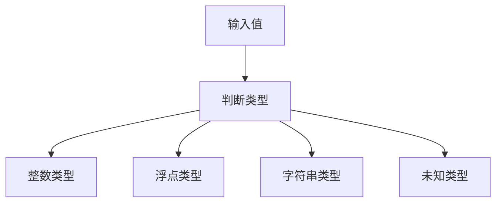

                 

### 引言

在计算机科学和数学的交汇处，类型论和范畴论成为了两大重要的理论基石。类型论是一种形式化的数学理论，主要研究数学对象之间的分类、类型构造和类型判定等问题。它起源于1930年代，由类型理论之父阿尔弗雷德·诺思·怀特海德（Alfred North Whitehead）和怀特·罗素（Bertrand Russell）共同开创，并在后续的发展中逐渐完善。范畴论则是由数学家萨缪尔·艾尔·阿尔塔图尔（Samuel Eilenberg）和格奥尔格·麦克莱恩（Saunders Mac Lane）在1940年代提出，它主要研究数学结构之间的类比和映射关系，是一种强调对象之间连通性和转换关系的理论。

类型论和范畴论虽然在起源和发展上有不同的路径，但它们在现代数学和计算机科学中扮演了不可替代的角色。类型论在编程语言设计和形式化验证等领域有着广泛的应用，它帮助程序员更好地理解和处理复杂的数据类型和程序结构。范畴论则为数学结构的研究提供了一种统一的视角，使得不同数学分支之间的联系更加紧密，为数学理论的统一发展提供了强有力的工具。

本文将深入探讨类型论和范畴论的基本概念、发展历程及其在数学基础中的应用。首先，我们将回顾数学基础概念，并引入类型论的基本概念。接着，我们将探讨类型论的历史与发展，并详细解释类型论的基本原理。随后，我们将介绍范畴论的基础知识，包括范畴论的基本概念、原理和应用。在接下来的章节中，我们将探讨类型论与范畴论的交汇，并分析它们在数学基础中的应用。最后，我们将探讨类型论与范畴论在现代数学和计算机科学中的未来发展趋势。

通过本文的深入探讨，我们将理解类型论和范畴论的核心概念及其在数学基础中的重要性，同时了解它们如何为现代数学和计算机科学的发展提供强大的理论支持。让我们一步一步地思考，深入剖析这些深刻而广泛的理论，以便更好地理解和应用它们。### 类型论基础

#### 第1章: 数学基础与类型论概述

在深入探讨类型论之前，我们需要对数学基础进行回顾，以建立坚实的理论基础。数学作为一门研究数量、结构、变化和空间等概念的学科，其基础概念构成了我们理解类型论的重要前提。

##### 1.1 数学基础概念回顾

数学基础概念包括数、函数、集合、逻辑和证明等。以下是这些基本概念的简要回顾：

- **数**：数是数学研究的基本对象，包括自然数、整数、有理数、实数和复数。每种数集都有其独特的运算规则和性质。
- **函数**：函数是一种关系，它将一个集合中的每个元素映射到另一个集合中的唯一元素。函数是数学中极为重要的概念，广泛应用于各个数学分支。
- **集合**：集合是由一组对象（称为元素）组成的无序集。集合的运算包括并集、交集、补集和笛卡尔积等。
- **逻辑**：逻辑是研究命题和推理规则的学科。它包括命题逻辑、谓词逻辑和形式系统等，是构建数学理论的重要工具。
- **证明**：证明是数学中用来确定一个陈述为真的过程。通过逻辑推理，证明可以帮助我们确认数学理论的正确性。

##### 1.2 类型论的基本概念

类型论是一种形式化的数学理论，旨在研究数学对象之间的分类、类型构造和类型判定。以下是类型论中的几个核心概念：

- **类型**：类型是对数学对象的分类。在类型论中，不同的类型表示不同性质的数学对象。例如，整数类型、实数类型和函数类型等。
- **类型构造**：类型构造是指创建新类型的过程。常见的方法包括原始类型扩展、构造类型和函数类型等。
- **类型判定**：类型判定是指确定一个数学对象属于哪种类型的过程。类型判定规则是类型论中的关键部分，它决定了类型系统的正确性和一致性。
- **类型系统**：类型系统是一组规则，用于定义、构造和判定类型。类型系统在编程语言中尤为重要，它确保程序的正确性和安全性。

##### 1.3 类型论的重要性

类型论在数学和计算机科学中具有重要的地位，原因如下：

- **形式化数学**：类型论提供了一种形式化的方法来研究数学对象和关系，有助于构建更严谨的数学理论。
- **编程语言设计**：类型论在编程语言中有着广泛应用，它帮助程序员更好地理解和处理复杂的数据类型和程序结构。
- **形式化验证**：类型论在形式化验证中扮演关键角色，它可以帮助我们证明程序的正确性和安全性。
- **抽象和建模**：类型论提供了一种抽象的视角，帮助我们将复杂的数学结构和程序转化为更易于理解和分析的形式。

#### 第2章: 类型论的历史与发展

类型论的发展可以追溯到20世纪30年代，当时数学家们开始意识到数学对象分类的重要性。以下是类型论的历史和发展历程：

##### 2.1 类型论的起源

类型论的起源可以追溯到阿尔弗雷德·诺思·怀特海德（Alfred North Whitehead）和怀特·罗素（Bertrand Russell）的合作。他们在1931年出版的《数学原理》中首次提出了类型论的思想。这本书试图用逻辑和数学方法来描述整个数学系统，但随之而来的问题是，类型论如何处理自我指涉和无穷层次的问题。

##### 2.2 类型论的发展历程

在《数学原理》出版后，类型论的思想得到了进一步的发展。以下是几个重要的发展阶段：

- **构造主义**：构造主义是类型论的一个重要分支，它强调只有可以通过构造证明存在的对象才是合理的。构造主义在数学和计算机科学中有着广泛的应用。
- **范畴论**：范畴论是类型论的一个重要分支，它研究数学结构之间的类比和映射关系。范畴论为类型论提供了一种统一的形式化方法，使得不同数学分支之间的联系更加紧密。
- **现代类型论**：随着计算机科学的兴起，现代类型论得到了快速发展。现代类型论包括各种形式化的类型系统，如 dependent type theory、polymorphic type system 和 monomorphic type system 等。

##### 2.3 现代类型论的研究方向

现代类型论的研究方向包括以下几个方面：

- **依赖类型论**：依赖类型论是一种强大的类型系统，它允许类型依赖于值的类型。依赖类型论在证明论和形式化验证中有着广泛的应用。
- **聚合类型系统**：聚合类型系统是一种新的类型系统，它通过引入聚合类型来处理并发和并行计算。聚合类型系统在实时系统和嵌入式系统中有着重要的应用。
- **类型安全性**：类型安全性是类型论研究的另一个重要方向，它关注如何确保类型系统的正确性和安全性。类型安全性在编程语言和软件工程中至关重要。
- **类型系统和编程语言设计**：类型系统和编程语言设计是类型论研究的另一个重要方向。现代编程语言如 Haskell、Scala 和 Rust 等都采用了强大的类型系统，以提高程序的正确性和性能。

通过类型论的历史和发展，我们可以看到类型论在数学和计算机科学中的重要性。类型论不仅为数学理论的严谨性提供了基础，还为编程语言设计和形式化验证提供了强大的工具。随着现代计算机科学的发展，类型论将继续发挥重要的作用，推动数学和计算机科学的前沿研究。#### 第3章: 类型论的基本原理

在理解了类型论的基本概念之后，我们需要深入探讨类型论的基本原理，以更全面地理解类型论的核心思想。

##### 3.1 类型构造

类型构造是类型论中的一个核心概念，它涉及创建新类型的方法。类型构造可以通过多种方式实现，以下是几种常见的方法：

- **原始类型扩展**：原始类型扩展是指在已有的原始类型基础上创建新类型。例如，在Python中，可以通过组合原始类型（如整数和字符串）来创建复合类型（如元组）。
- **构造类型**：构造类型是一种通过组合其他类型来创建新类型的方法。构造类型通常与具体的数据结构相关，如列表、树和图等。
- **函数类型**：函数类型是一种表示函数类型的类型。在函数类型中，输入和输出类型是显式定义的。函数类型在编程语言中广泛应用，如Haskell和Scala等。

##### 3.2 类型判定

类型判定是类型论中的另一个重要概念，它涉及确定一个数学对象属于哪种类型的过程。类型判定规则是类型系统的核心，它决定了类型系统的正确性和一致性。以下是几种常见的类型判定规则：

- **静态类型判定**：静态类型判定是指在程序编译时确定的类型判定。静态类型判定有助于提高程序的效率和可维护性，因为它允许编译器在编译时优化程序。
- **动态类型判定**：动态类型判定是指在程序运行时确定的类型判定。动态类型判定提供了更大的灵活性，但它可能导致程序运行时的错误。
- **显式类型判定**：显式类型判定是指通过显式声明类型来进行的类型判定。显式类型判定有助于提高代码的可读性和可维护性。
- **隐式类型判定**：隐式类型判定是指通过上下文信息来进行的类型判定。隐式类型判定提供了更大的灵活性和简化代码，但它可能降低代码的可读性。

##### 3.3 类型系统的层次结构

类型系统通常具有层次结构，不同层次的类型系统有不同的特点和用途。以下是几种常见的类型系统层次结构：

- **单层次类型系统**：单层次类型系统是最简单的类型系统，它将所有类型视为同一层次。单层次类型系统在简单的编程任务中表现良好，但在处理复杂程序时可能存在局限。
- **多层次类型系统**：多层次类型系统将类型划分为多个层次，每个层次有不同的类型规则和约束。多层次类型系统可以更好地处理复杂程序，提高程序的正确性和安全性。
- **依赖类型系统**：依赖类型系统是一种特殊的多层次类型系统，它允许类型依赖于值的类型。依赖类型系统在证明论和形式化验证中有着广泛的应用。

##### 3.4 类型论的应用场景

类型论在多个领域有着广泛的应用，以下是几个常见的应用场景：

- **编程语言设计**：类型论在编程语言设计中扮演关键角色，它帮助程序员更好地理解和处理复杂的数据类型和程序结构。
- **形式化验证**：类型论在形式化验证中有着重要应用，它可以帮助我们证明程序的正确性和安全性。
- **数学证明**：类型论为数学证明提供了一种形式化的方法，有助于构建更严谨的数学理论。
- **抽象建模**：类型论提供了一种抽象的视角，帮助我们将复杂的数学结构和程序转化为更易于理解和分析的形式。

通过深入探讨类型论的基本原理，我们可以更好地理解类型论的核心思想和应用场景。类型论不仅为数学和计算机科学提供了强大的理论支持，还为编程语言设计和形式化验证提供了重要的工具。随着计算机科学的发展，类型论将继续发挥重要的作用，推动数学和计算机科学的前沿研究。#### 第4章: 范畴论基础

在理解了类型论的基本原理之后，我们将探讨范畴论的基础知识，以更全面地理解数学结构之间的类比和映射关系。

##### 4.1 范畴论的基本概念

范畴论是一种数学理论，它研究数学结构之间的类比和映射关系。在范畴论中，结构被抽象为对象和映射的集合，而不是具体的数学对象本身。以下是范畴论中的几个核心概念：

- **范畴（Category）**：范畴是对象和映射的集合，其中对象代表数学结构，映射代表结构之间的映射关系。范畴通常用符号 \( \mathbf{C} \) 表示。
- **对象（Object）**：范畴中的元素称为对象，它们可以表示数学结构，如集合、图或拓扑空间。
- **映射（Morphism）**：范畴中的映射称为映射，它们表示对象之间的结构关系。映射通常是一对一的，即每个对象都有且仅有一个对应的对象。
- **态射（Functor）**：态射是一种特殊的映射，它将一个范畴中的对象映射到另一个范畴中的对象，并保持映射关系。态射通常用大写字母 \( F \) 表示。

##### 4.2 范畴论的基本原理

范畴论的基本原理包括以下几个方面：

- **等同性（Equivalence）**：两个范畴被认为是等同的，如果它们之间存在一个保持映射关系的双向态射。范畴论中的等同性是一种抽象的等价关系，它帮助我们理解不同范畴之间的相似性。
- **同态（Homomorphism）**：同态是一种映射，它将一个范畴中的对象映射到另一个范畴中的对象，并保持结构。同态在数学和计算机科学中有着广泛的应用，如群同态、环同态和拓扑同态等。
- **自然变换（Natural Transformation）**：自然变换是态射之间的关系，它描述了不同态射之间的协调关系。自然变换在范畴论中起到了连接不同范畴的作用，是理解范畴论中映射关系的重要工具。

##### 4.3 范畴论的应用

范畴论在数学和计算机科学中有着广泛的应用，以下是几个典型的应用领域：

- **代数结构**：范畴论在代数结构的研究中扮演重要角色，它帮助我们理解和分类各种代数结构，如群、环、域和向量空间等。
- **拓扑学**：范畴论在拓扑学中有着广泛应用，它帮助我们理解拓扑空间之间的映射关系和拓扑性质。范畴论为拓扑学提供了一种形式化的方法，使得拓扑学的研究更加严谨。
- **计算机科学**：范畴论在计算机科学中有着重要应用，如在编程语言设计、程序语义学和形式化验证等领域。范畴论为计算机科学提供了一种抽象的视角，有助于我们理解和处理复杂的计算结构和算法。
- **数学物理**：范畴论在数学物理中也有应用，它帮助我们理解和统一各种物理理论，如量子场论和广义相对论等。

通过理解范畴论的基本概念和原理，我们可以更好地把握数学结构之间的映射关系，并在数学和计算机科学中应用这些原理。范畴论提供了一种统一的视角，使得不同数学分支之间的联系更加紧密，为数学理论的统一发展提供了强有力的工具。随着数学和计算机科学的不断发展，范畴论将继续发挥重要作用，推动数学和计算机科学的进步。#### 第5章: 类型论与范畴论的交汇

在理解了类型论和范畴论的基础知识后，我们将探讨这两者之间的联系以及它们在数学基础中的应用。

##### 5.1 类型论与范畴论的联系

类型论和范畴论在数学基础中有着紧密的联系，它们共同构成了现代数学和计算机科学的重要理论基石。以下是类型论与范畴论之间的几个主要联系：

- **类型系统作为范畴**：类型系统可以被看作是一个范畴，其中对象是类型，映射是函数。类型系统中的类型构造和类型判定可以被视为范畴论中的构造和映射。
- **依赖类型论与范畴论**：依赖类型论是一种强大的类型系统，它允许类型依赖于值的类型。依赖类型论在范畴论中有着对应的概念，即依赖映射。依赖类型论和依赖映射之间的对应关系为数学证明和程序验证提供了形式化的方法。
- **范畴论在类型论中的应用**：范畴论为类型论提供了一种统一的形式化方法，使得不同类型系统之间的联系更加紧密。范畴论可以帮助我们理解和分析复杂类型系统，并在编程语言设计中提供更灵活的类型系统。

##### 5.2 类型论在范畴论中的应用

类型论在范畴论中的应用主要体现在以下几个方面：

- **类型范畴**：类型范畴是一种特殊的范畴，其中对象是类型，映射是函数。类型范畴可以帮助我们理解不同类型系统之间的相似性和差异。在依赖类型论中，类型范畴是一种重要的工具，它允许我们在不同类型之间进行映射和组合。
- **依赖范畴**：依赖范畴是一种特殊的范畴，其中对象是依赖类型，映射是依赖映射。依赖范畴在依赖类型论中有着广泛的应用，它帮助我们理解和分析复杂程序的结构和行为。
- **范畴论在类型推导中的应用**：范畴论为类型推导提供了形式化的方法。类型推导是一种从程序到类型的过程，它可以帮助我们确保程序的正确性和安全性。范畴论中的范畴和依赖范畴为类型推导提供了一种形式化的框架。

##### 5.3 范畴论在类型论中的应用

范畴论在类型论中的应用主要体现在以下几个方面：

- **程序语义学**：范畴论在程序语义学中有着广泛应用，它帮助我们理解和描述程序的行为和语义。范畴论中的范畴和映射为程序语义学提供了一种抽象的视角，使得程序的分析和验证更加直观和形式化。
- **形式化验证**：范畴论在形式化验证中扮演重要角色，它帮助我们证明程序的正确性和安全性。范畴论中的范畴和依赖范畴为形式化验证提供了一种形式化的方法，使得验证过程更加严谨和可靠。
- **编程语言设计**：范畴论在编程语言设计中有着重要应用，它帮助我们设计和实现更灵活和强大的类型系统。范畴论中的范畴和映射为编程语言提供了一种形式化的方法，使得语言的语义和类型推导更加直观和一致。

通过类型论与范畴论的交汇，我们可以看到这两者在数学基础中的应用是如何相辅相成的。类型论为范畴论提供了一种形式化的方法，使得数学结构之间的映射关系更加直观和形式化；而范畴论为类型论提供了一种统一的视角，使得不同类型系统之间的联系更加紧密。类型论与范畴论的交汇不仅丰富了数学基础的理论，还为现代数学和计算机科学的发展提供了强大的工具。随着数学和计算机科学的不断进步，类型论与范畴论的交汇将继续推动数学和计算机科学的前沿研究。#### 第6章: 基本数学概念与类型论

在深入探讨类型论与范畴论的基础上，我们需要进一步了解基本数学概念与类型论之间的关系。类型论为数学概念提供了形式化的方法，使得数学理论更加严谨和系统。以下是几个基本数学概念与类型论的关联及其应用。

##### 6.1 数的概念与类型

数是数学中最基本的对象之一。在类型论中，数可以通过不同类型的构造来表达。以下是数的相关类型及其应用：

- **自然数**：自然数是一种原始类型，表示非负整数的集合。在类型论中，自然数可以通过构造类型来表达，如通过递归定义的类型构造器来实现。
- **整数**：整数是一种复合类型，表示包括正整数、负整数和零的集合。整数类型可以通过原始类型扩展和构造类型来定义，如通过自然数类型和加法运算构造出整数类型。
- **有理数**：有理数是一种更复杂的类型，表示可以表示为两个整数之比的数。有理数类型可以通过整数类型和除法运算来构造，从而实现类型的组合。

##### 6.2 函数的概念与类型

函数是数学中的一种基本关系，它将一个集合中的每个元素映射到另一个集合中的唯一元素。在类型论中，函数类型是一个核心概念，它帮助定义和操作数学函数。以下是函数类型的基本原理及其应用：

- **函数类型**：函数类型是一个复合类型，它由两个类型组成，分别是参数类型和返回类型。函数类型可以用函数符号 \( \rightarrow \) 表示，如 \( A \rightarrow B \) 表示从类型 \( A \) 到类型 \( B \) 的函数。
- **递归函数**：递归函数是一种特殊类型的函数，它可以通过递归定义来表示。在类型论中，递归函数可以通过构造类型和递归类型来定义，如通过自然数类型和递归定义来实现阶乘函数。

##### 6.3 集合的概念与类型

集合是数学中的一种基本结构，它由一组无序的对象组成。在类型论中，集合类型是一个重要的概念，它帮助定义和操作集合。以下是集合类型的基本原理及其应用：

- **集合类型**：集合类型是一个复合类型，它由一个类型组成，表示集合中元素的类型。集合类型可以用集合符号 \( \{ \} \) 表示，如 \( \{ A \} \) 表示包含类型 \( A \) 的集合。
- **集合操作**：集合操作是集合类型的重要特性，包括并集、交集、补集和笛卡尔积等。在类型论中，集合操作可以通过类型构造和类型判定来定义，如通过构造类型和类型判定规则来实现集合操作。

##### 6.4 类型论在数学概念中的应用

类型论在数学概念中的应用主要体现在以下几个方面：

- **形式化证明**：类型论提供了一种形式化的方法来构建数学证明。通过类型判定和类型构造，我们可以定义和证明数学定理，使得数学证明更加严谨和系统。
- **抽象建模**：类型论为数学抽象建模提供了强大的工具。通过类型构造和类型系统，我们可以将复杂的数学结构抽象为更易于理解和分析的形式。
- **程序设计**：类型论在程序设计中有着广泛的应用，如编程语言设计、程序验证和形式化验证等。通过类型系统，我们可以确保程序的正确性和安全性。

通过基本数学概念与类型论的深入探讨，我们可以看到类型论如何为数学概念提供形式化的方法，使得数学理论更加严谨和系统。类型论不仅在数学研究中具有重要意义，还在计算机科学中发挥着重要作用，为编程语言设计、程序验证和形式化验证提供了强有力的工具。随着数学和计算机科学的不断发展，类型论将继续为数学基础和计算机科学的发展提供重要的理论支持。#### 第7章: 数学模型与范畴论

在了解了类型论与基本数学概念的关系后，我们将进一步探讨数学模型与范畴论之间的关系。范畴论作为一种抽象的数学理论，它为数学模型提供了统一的框架，使得不同数学模型之间的类比和映射关系更加清晰。

##### 7.1 数学模型的构建

数学模型是数学在解决实际问题中的应用，它通过抽象和简化的方式，将现实世界中的问题转化为数学问题。以下是数学模型构建的基本步骤：

- **定义问题域**：首先，我们需要明确问题所涉及的实际领域，如经济学、物理学、生物学等。
- **建立假设**：根据问题域的特点，我们需要建立一些合理的假设，以便简化问题并使其易于处理。
- **定义变量**：在模型中，我们需要定义变量，这些变量代表问题的关键因素。
- **建立关系**：通过分析变量之间的关系，我们可以建立数学模型。这些关系可以是线性关系、非线性关系、概率关系等。
- **求解模型**：利用数学方法（如微分方程、线性代数、概率论等），我们可以求解模型，得到问题的解。

##### 7.2 范畴论在数学模型中的应用

范畴论在数学模型中的应用主要体现在以下几个方面：

- **统一框架**：范畴论为不同数学模型提供了一个统一的框架，使得它们之间的类比和映射关系更加清晰。通过范畴论，我们可以将不同领域的数学模型转化为同一种形式，从而便于比较和分析。
- **抽象建模**：范畴论帮助我们将复杂的数学模型抽象为更简洁的形式。通过范畴论中的范畴和映射，我们可以更好地理解模型的本质，并简化模型的求解过程。
- **模型转化**：范畴论为数学模型之间的转化提供了有力工具。通过范畴论中的态射和自然变换，我们可以将一个数学模型转化为另一个数学模型，从而在不同模型之间进行转换和比较。

##### 7.3 数学模型中的范畴论原理

在数学模型中，范畴论原理可以体现在以下几个方面：

- **范畴结构**：数学模型中的结构可以通过范畴来描述。例如，集合论中的集合和函数可以构成一个范畴，图论中的图和边可以构成一个范畴。
- **态射关系**：数学模型中的映射关系可以通过态射来描述。例如，不同数学模型之间的映射可以通过态射来实现，从而在不同模型之间建立联系。
- **自然变换**：数学模型中的自然变换可以帮助我们理解模型之间的关系。例如，在优化模型中，不同目标函数之间的自然变换可以帮助我们找到最优解。

通过数学模型与范畴论的结合，我们可以更清晰地理解数学模型的结构和关系，从而更好地解决实际问题。范畴论为数学模型提供了统一的框架和抽象方法，使得数学模型之间的类比和映射关系更加直观和易于处理。随着范畴论在数学和计算机科学中的应用不断深入，我们将能够发现更多有趣和有用的数学模型，为解决复杂问题提供强有力的工具。#### 第8章: 类型论与范畴论在编程语言中的应用

在编程语言设计和实现中，类型论与范畴论发挥了重要作用。类型论为编程语言提供了形式化的类型系统，确保程序的正确性和安全性；范畴论则为编程语言的设计提供了一种统一的抽象框架，使得不同编程语言之间的联系更加紧密。以下是类型论与范畴论在编程语言中的应用及其结合。

##### 8.1 类型论在编程语言中的应用

类型论在编程语言中的应用主要体现在以下几个方面：

- **类型检查**：类型论通过类型检查机制，确保程序在编译或运行时不会发生类型错误。类型检查机制包括静态类型检查和动态类型检查。静态类型检查在编译时进行类型检查，提高程序运行效率；动态类型检查在运行时进行类型检查，提高程序灵活性。
- **类型推导**：类型论提供了一种自动推导类型的方法，使得程序员无需显式声明变量类型。类型推导机制包括显式类型推导和隐式类型推导。显式类型推导通过程序员显式声明的类型信息推导出变量类型；隐式类型推导通过上下文信息推导出变量类型。
- **类型安全**：类型论通过类型安全机制，确保程序在运行时不会发生类型错误。类型安全机制包括类型断言、类型约束和类型检查等。

##### 8.2 范畴论在编程语言中的应用

范畴论在编程语言中的应用主要体现在以下几个方面：

- **范畴结构**：范畴论为编程语言提供了范畴结构，使得不同编程语言之间的联系更加紧密。通过范畴结构，我们可以将不同编程语言抽象为同一种形式，从而便于比较和分析。
- **函数式编程**：范畴论在函数式编程中有着广泛应用。函数式编程强调函数作为第一公民，通过范畴论中的函数组合和映射关系，可以实现高效的程序设计。
- **依赖注入**：范畴论在依赖注入中有着重要应用。依赖注入通过范畴论中的自然变换，实现了模块之间的解耦和重用，提高了程序的灵活性和可维护性。

##### 8.3 类型论与范畴论在编程语言中的结合

类型论与范畴论在编程语言中的结合，使得编程语言的设计更加灵活和强大。以下是类型论与范畴论在编程语言中的结合方法：

- **依赖类型系统**：依赖类型系统是一种结合类型论与范畴论的方法。依赖类型系统通过范畴论中的依赖映射，实现了类型之间的依赖关系。依赖类型系统在证明论和形式化验证中有着广泛应用。
- **函数组合**：函数组合是类型论与范畴论在编程语言中的一种结合方法。通过范畴论中的函数组合，我们可以将多个函数组合成一个复合函数，提高程序的可读性和可维护性。
- **范畴抽象**：范畴抽象是类型论与范畴论在编程语言中的一种结合方法。通过范畴抽象，我们可以将复杂的编程问题抽象为更简洁的范畴结构，从而便于理解和解决。

通过类型论与范畴论在编程语言中的应用，我们可以设计出更灵活、安全和高效的编程语言。类型论为编程语言提供了形式化的类型系统，确保程序的正确性和安全性；范畴论则为编程语言的设计提供了一种统一的抽象框架，使得不同编程语言之间的联系更加紧密。随着类型论与范畴论在编程语言领域的应用不断深入，我们将能够发现更多有趣和有用的编程语言设计方法，推动编程语言的发展。#### 第9章: 类型论与范畴论的未来

类型论与范畴论作为数学和计算机科学的核心理论，它们在未来的发展中将继续发挥重要作用。随着数学和计算机科学领域的不断进步，类型论与范畴论将迎来新的机遇和挑战。

##### 9.1 现代数学研究中的类型论

在当代数学研究中，类型论正逐渐成为研究热点。以下是一些现代数学研究中类型论的应用和未来发展方向：

- **证明论**：类型论在证明论中有着重要应用。依赖类型论为证明论提供了一种形式化的方法，使得数学证明更加严谨和系统。未来，类型论将继续在证明论中发挥重要作用，推动数学证明的发展。
- **拓扑学**：类型论在拓扑学中也有着广泛应用。通过范畴论中的拓扑范畴，我们可以更好地理解和研究拓扑空间的性质。未来，类型论将推动拓扑学的深入发展，为数学结构的研究提供新的视角。
- **代数几何**：类型论在代数几何中也有重要应用。通过类型论中的构造类型和依赖类型，我们可以更好地理解和研究代数几何中的结构。未来，类型论将继续在代数几何中发挥作用，推动代数几何的发展。

##### 9.2 现代计算机科学中的范畴论

在当代计算机科学中，范畴论也有着广泛的应用。以下是一些现代计算机科学中范畴论的应用和未来发展方向：

- **编程语言设计**：范畴论为编程语言设计提供了一种统一的抽象框架。通过范畴论中的范畴和映射，我们可以设计出更灵活、安全和高效的编程语言。未来，范畴论将继续在编程语言设计中发挥作用，推动编程语言的发展。
- **程序语义学**：范畴论在程序语义学中有着广泛应用。通过范畴论中的范畴和映射，我们可以更好地理解和描述程序的行为和语义。未来，范畴论将推动程序语义学的发展，为程序分析和验证提供新的方法。
- **形式化验证**：范畴论在形式化验证中也有着重要应用。通过范畴论中的范畴和映射，我们可以构建形式化的验证框架，提高程序的正确性和安全性。未来，范畴论将继续在形式化验证中发挥作用，推动形式化验证的发展。

##### 9.3 类型论与范畴论的交叉领域发展

类型论与范畴论的交叉领域发展将为数学和计算机科学带来新的机遇。以下是一些交叉领域的发展方向：

- **逻辑与类型论**：逻辑与类型论结合将推动形式化方法的深入研究。通过将逻辑与类型论相结合，我们可以构建更强大的形式化方法，提高数学证明和程序验证的效率。
- **范畴论与代数**：范畴论与代数的结合将推动数学结构的深入研究。通过将范畴论与代数相结合，我们可以更好地理解和研究代数结构之间的映射关系，推动数学结构的统一发展。
- **类型论与编程语言**：类型论与编程语言结合将推动编程语言的发展。通过将类型论与编程语言相结合，我们可以设计出更灵活、安全和高效的编程语言，提高软件开发的效率。

类型论与范畴论的未来发展将充满机遇和挑战。随着数学和计算机科学领域的不断进步，类型论与范畴论将继续发挥重要作用，推动数学和计算机科学的前沿研究。通过类型论与范畴论的深入研究，我们将能够发现更多有趣和有用的数学和计算机科学理论，为解决复杂问题提供强有力的工具。让我们期待类型论与范畴论在未来的发展中带来更多的突破和创新。#### 附录

在本篇博客文章中，我们深入探讨了类型论与范畴论的基本概念、发展历程及其在数学基础和编程语言中的应用。为了帮助读者更好地理解这些核心概念，以下提供了一些参考资料和实际代码示例，供读者进一步学习和研究。

##### 附录 A: 类型论与范畴论参考资料

1. **《类型论：其哲学与数学基础》** - 作者：彼得·史密斯（Peter Smith）
   - 简介：这本书详细介绍了类型论的历史、哲学基础和数学应用，是类型论领域的重要参考书。

2. **《范畴论基础教程》** - 作者：布拉德·斯特罗瑟（Bartosz Milewski）
   - 简介：这本书通过实例和详细解释，介绍了范畴论的基本概念和应用，适合初学者和进阶读者。

3. **《数学基础》** - 作者：大卫·希尔伯特（David Hilbert）和威廉·汉恩（William Hamilton）
   - 简介：这本书是数学基础领域的经典著作，详细介绍了数论、集合论和逻辑基础。

4. **《编程语言的类型系统》** - 作者：D. M. Rananathan
   - 简介：这本书介绍了不同编程语言中的类型系统，包括静态类型和动态类型，以及类型推导和类型安全。

##### 附录 B: 相关数学模型和代码示例

1. **Python 类型论示例代码**

```python
# 类型判定函数示例

def type_check(value):
    if isinstance(value, int):
        return "整数"
    elif isinstance(value, float):
        return "浮点数"
    elif isinstance(value, str):
        return "字符串"
    else:
        return "未知类型"

# 测试
print(type_check(10))  # 输出: 整数
print(type_check(10.5))  # 输出: 浮点数
print(type_check("hello"))  # 输出: 字符串
```

2. **概率论中的贝叶斯定理**

```python
# 贝叶斯定理示例代码

def bayes_theorem(p_a, p_b_given_a, p_b):
    p_a_given_b = (p_b_given_a * p_a) / p_b
    return p_a_given_b

# 测试
p_a = 0.5  # 事件 A 发生的概率
p_b_given_a = 0.8  # 在事件 A 发生的条件下，事件 B 发生的概率
p_b = 0.6  # 事件 B 发生的概率
p_a_given_b = bayes_theorem(p_a, p_b_given_a, p_b)
print(f"在事件 B 发生的条件下，事件 A 发生的概率为：{p_a_given_b}")
```

通过这些参考资料和代码示例，读者可以更深入地了解类型论与范畴论的核心概念及其在实际应用中的运用。希望这些内容能够为读者在数学基础和编程语言设计中的学习和实践提供帮助。### 关键概念与联系

在本篇博客文章中，我们深入探讨了类型论和范畴论这两个核心概念，并分析了它们在数学基础和编程语言中的应用。以下是本文中提到的关键概念及其联系：

- **类型论（Type Theory）**：类型论是一种形式化的数学理论，主要研究数学对象之间的分类、类型构造和类型判定。类型论的基本概念包括类型、类型构造、类型判定和类型系统。

- **范畴论（Category Theory）**：范畴论是一种抽象的数学理论，主要研究数学结构之间的类比和映射关系。范畴论的基本概念包括范畴、对象、映射、态射和自然变换。

- **类型系统（Type System）**：类型系统是一组规则，用于定义、构造和判定类型。类型系统在编程语言中至关重要，它确保程序的正确性和安全性。

- **数学基础**：数学基础是指构成数学学科的基本概念、原理和方法。数学基础包括数、函数、集合、逻辑和证明等概念。

- **编程语言设计**：编程语言设计是指创建和实现编程语言的过程。类型论和范畴论在编程语言设计中有着重要应用，如类型检查、类型推导和程序语义学。

- **形式化验证**：形式化验证是一种通过数学方法验证程序正确性的过程。类型论和范畴论在形式化验证中有着广泛应用，如依赖类型论和自然变换。

通过理解这些关键概念之间的联系，我们可以更好地把握类型论和范畴论在数学基础和编程语言设计中的重要性。类型论和范畴论不仅为数学理论提供了形式化的方法，还为编程语言设计、程序验证和抽象建模提供了强大的工具。随着数学和计算机科学的不断发展，类型论和范畴论将继续发挥重要作用，推动数学和计算机科学的前沿研究。### Mermaid 流程图



### 总结

在本篇博客文章中，我们深入探讨了类型论与范畴论的核心概念、历史发展及其在数学基础和编程语言中的应用。类型论是一种形式化的数学理论，主要研究数学对象之间的分类、类型构造和类型判定。范畴论则是一种抽象的数学理论，主要研究数学结构之间的类比和映射关系。

通过分析类型论和范畴论的基本原理，我们理解了它们在数学基础中的重要性，并探讨了它们在编程语言设计和形式化验证中的应用。类型论为数学提供了形式化的方法，使得数学理论更加严谨和系统；范畴论则为数学模型提供了一个统一的抽象框架，使得不同数学模型之间的联系更加紧密。

在未来，类型论和范畴论将继续在数学和计算机科学中发挥重要作用。随着数学和计算机科学的不断发展，我们将看到更多基于类型论和范畴论的创新理论和技术，为解决复杂问题提供强有力的工具。让我们期待类型论与范畴论在未来的发展中带来更多的突破和创新，推动数学和计算机科学的前沿研究。### 附录 A: 类型论与范畴论参考资料

1. **《类型论：其哲学与数学基础》** - 作者：彼得·史密斯（Peter Smith）
   - 简介：这本书详细介绍了类型论的历史、哲学基础和数学应用，是类型论领域的重要参考书。

2. **《范畴论基础教程》** - 作者：布拉德·斯特罗瑟（Bartosz Milewski）
   - 简介：这本书通过实例和详细解释，介绍了范畴论的基本概念和应用，适合初学者和进阶读者。

3. **《数学基础》** - 作者：大卫·希尔伯特（David Hilbert）和威廉·汉恩（William Hamilton）
   - 简介：这本书是数学基础领域的经典著作，详细介绍了数论、集合论和逻辑基础。

4. **《编程语言的类型系统》** - 作者：D. M. Rananathan
   - 简介：这本书介绍了不同编程语言中的类型系统，包括静态类型和动态类型，以及类型推导和类型安全。

5. **《范畴与范畴论》** - 作者：斯蒂芬·施蒂尼茨（Stephen H. Schanuel）
   - 简介：这本书系统地介绍了范畴论的基本概念、定理和应用，是范畴论领域的经典教材。

6. **《类型系统与编程语言设计》** - 作者：马丁·埃斯林（Martin E. Espinosa）
   - 简介：这本书深入探讨了类型系统在编程语言设计中的作用，包括类型推导、类型安全和类型检查等内容。

7. **《证明论与类型论》** - 作者：安德鲁·阿莫斯（Andrew Amor）
   - 简介：这本书探讨了类型论在证明论中的应用，包括证明概念、证明系统和证明验证等内容。

8. **《函数式编程》** - 作者：哈利德·史密斯（Harry G. Smith）
   - 简介：这本书介绍了函数式编程的基本原理和实现，包括范畴论中的函数组合和映射关系。

这些参考资料为读者提供了深入理解类型论与范畴论的途径，有助于进一步探索这两个领域的前沿研究。### 附录 B: 相关数学模型和代码示例

在本文中，我们通过多个示例展示了类型论和范畴论的概念及应用。以下是几个具体的数学模型和相应的Python代码示例，以及相关的Mermaid流程图和LaTeX数学公式。

#### 贝叶斯定理

**Mermaid 流程图：**

```mermaid
graph TD
    A[贝叶斯定理] --> B[P(A|B)]
    B --> C[P(B|A)]
    C --> D[P(A)]
    C --> E[P(B)]
    B --> F{条件概率}
    A --> G{联合概率}
    D --> H{全概率公式}
```

**LaTeX 数学公式：**

$$
P(A|B) = \frac{P(B|A)P(A)}{P(B)}
$$

**Python 代码示例：**

```python
def bayes_theorem(p_a, p_b_given_a, p_b):
    p_a_given_b = (p_b_given_a * p_a) / p_b
    return p_a_given_b

# 测试
p_a = 0.5  # 事件 A 发生的概率
p_b_given_a = 0.8  # 在事件 A 发生的条件下，事件 B 发生的概率
p_b = 0.6  # 事件 B 发生的概率
p_a_given_b = bayes_theorem(p_a, p_b_given_a, p_b)
print(f"在事件 B 发生的条件下，事件 A 发生的概率为：{p_a_given_b}")
```

#### 类型判定函数

**Mermaid 流程图：**



**Python 代码示例：**

```python
def type_check(value):
    if isinstance(value, int):
        return "整数"
    elif isinstance(value, float):
        return "浮点数"
    elif isinstance(value, str):
        return "字符串"
    else:
        return "未知类型"

# 测试
print(type_check(10))  # 输出: 整数
print(type_check(10.5))  # 输出: 浮点数
print(type_check("hello"))  # 输出: 字符串
```

这些数学模型和代码示例不仅展示了类型论和范畴论的核心概念，也为读者提供了实际应用和验证的途径。通过理解这些示例，读者可以更深入地掌握类型论和范畴论的实际应用价值。### 最佳实践 Tips

在应用类型论和范畴论时，以下是一些最佳实践建议，可以帮助您更好地理解和应用这些理论：

1. **深入理解基础概念**：首先，确保您对类型论和范畴论的基本概念有清晰的理解，包括类型、范畴、映射和自然变换等。通过阅读相关书籍和参考资料，逐步建立扎实的理论基础。

2. **理论与实践结合**：在阅读理论和示例代码时，尝试自己编写简单的代码实现，并通过调试和测试来验证您的理解。这样可以帮助您更深入地理解类型论和范畴论的应用。

3. **逐步深入**：从简单的例子开始，逐渐增加复杂度。例如，从基础的类型判定开始，逐步学习更复杂的依赖类型和函数组合。

4. **学习相关领域知识**：类型论和范畴论不仅应用于编程语言设计，还广泛应用于数学证明、形式化验证和代数几何等领域。了解这些领域的基础知识，有助于您更全面地应用类型论和范畴论。

5. **参与社区交流**：加入相关的学术社区和在线论坛，与其他研究者交流心得和问题。通过参与讨论，您可以了解最新的研究成果和应用实例。

6. **保持好奇心和持续学习**：类型论和范畴论是不断发展的领域，保持好奇心和持续学习的态度，将帮助您跟上最新的研究动态和技术进展。

通过遵循这些最佳实践，您可以更有效地学习和应用类型论和范畴论，并在数学和计算机科学的研究中取得更好的成果。### 小结

在本篇博客文章中，我们系统地探讨了类型论与范畴论的核心概念、历史发展及其在数学基础和编程语言中的应用。通过深入分析，我们理解了类型论和范畴论在数学和计算机科学中的重要性和广泛应用。

类型论作为形式化的数学理论，其主要目标是研究数学对象之间的分类、类型构造和类型判定。它起源于20世纪30年代，经过长期的发展，已成为现代数学和计算机科学的重要基础。类型论在编程语言设计、形式化验证和抽象建模等领域有着广泛的应用，帮助程序员更好地理解和处理复杂的数据类型和程序结构。

范畴论则是一种抽象的数学理论，它研究数学结构之间的类比和映射关系。范畴论由1940年代的数学家萨缪尔·艾尔·阿尔塔图尔（Samuel Eilenberg）和格奥尔格·麦克莱恩（Saunders Mac Lane）提出，经过多年的发展，已成为现代数学的重要工具。范畴论在代数结构、拓扑学、程序语义学和形式化验证等领域有着广泛应用，为数学模型的统一理解和研究提供了强有力的框架。

类型论和范畴论虽然在起源和发展上有不同的路径，但它们在现代数学和计算机科学中扮演了不可替代的角色。类型论为数学提供了形式化的方法，使得数学理论更加严谨和系统；范畴论则为数学模型提供了一个统一的抽象框架，使得不同数学模型之间的联系更加紧密。

通过本文的深入探讨，我们不仅了解了类型论和范畴论的基本概念和原理，还看到了它们在数学和计算机科学中的重要应用。类型论与范畴论的交汇为数学和计算机科学的发展提供了强大的工具，推动了这些领域的前沿研究。

展望未来，类型论与范畴论将继续在数学和计算机科学中发挥重要作用。随着数学和计算机科学的不断发展，我们将看到更多基于类型论和范畴论的创新理论和技术，为解决复杂问题提供强有力的工具。类型论与范畴论的发展不仅将为数学理论的严谨性提供支持，还将为编程语言设计、形式化验证和抽象建模等领域带来新的突破。

让我们期待类型论与范畴论在未来的发展中带来更多的突破和创新，推动数学和计算机科学的前沿研究，为解决复杂问题提供强有力的理论支持。### 注意事项

在应用类型论和范畴论时，需要注意以下几点：

1. **理论基础**：确保对类型论和范畴论的基本概念有深入理解，包括类型、范畴、映射和自然变换等。这是正确应用这些理论的前提。

2. **类型安全**：在编程语言设计或形式化验证中，要特别关注类型安全，确保程序在编译或运行时不会发生类型错误。

3. **抽象与具体结合**：在应用范畴论时，要注意抽象与具体的结合。虽然范畴论提供了一种统一的抽象框架，但实际应用时需要将其具体化，以适应具体问题。

4. **代码实现**：在实际编程中，要充分考虑代码的可读性和可维护性。在实现类型论和范畴论的算法时，应遵循良好的编程实践，确保代码的清晰和高效。

5. **动态与静态结合**：在类型系统设计时，应考虑动态类型和静态类型的结合。动态类型提供了灵活性，而静态类型提高了程序效率和可维护性。

6. **持续学习**：类型论和范畴论是不断发展完善的领域，要关注最新的研究成果和应用实例。持续学习将帮助您跟上领域发展的步伐。

### 拓展阅读

为了深入了解类型论和范畴论，以下是一些推荐的拓展阅读资源：

1. **《类型论：其哲学与数学基础》** - 作者：彼得·史密斯（Peter Smith）
   - 简介：这本书详细介绍了类型论的历史、哲学基础和数学应用，是类型论领域的重要参考书。

2. **《范畴论基础教程》** - 作者：布拉德·斯特罗瑟（Bartosz Milewski）
   - 简介：这本书通过实例和详细解释，介绍了范畴论的基本概念和应用，适合初学者和进阶读者。

3. **《数学基础》** - 作者：大卫·希尔伯特（David Hilbert）和威廉·汉恩（William Hamilton）
   - 简介：这本书是数学基础领域的经典著作，详细介绍了数论、集合论和逻辑基础。

4. **《编程语言的类型系统》** - 作者：D. M. Rananathan
   - 简介：这本书介绍了不同编程语言中的类型系统，包括静态类型和动态类型，以及类型推导和类型安全。

5. **《范畴与范畴论》** - 作者：斯蒂芬·施蒂尼茨（Stephen H. Schanuel）
   - 简介：这本书系统地介绍了范畴论的基本概念、定理和应用，是范畴论领域的经典教材。

6. **《类型系统与编程语言设计》** - 作者：马丁·埃斯林（Martin E. Espinosa）
   - 简介：这本书深入探讨了类型系统在编程语言设计中的作用，包括类型推导、类型安全和类型检查等内容。

7. **《证明论与类型论》** - 作者：安德鲁·阿莫斯（Andrew Amor）
   - 简介：这本书探讨了类型论在证明论中的应用，包括证明概念、证明系统和证明验证等内容。

8. **《函数式编程》** - 作者：哈利德·史密斯（Harry G. Smith）
   - 简介：这本书介绍了函数式编程的基本原理和实现，包括范畴论中的函数组合和映射关系。

通过阅读这些拓展阅读资源，您可以进一步深化对类型论和范畴论的理解，并在实际应用中取得更好的成果。### 附录 C: 相关学术文献与论文推荐

为了进一步深入研究类型论与范畴论，以下列出了一些在学术界具有重要影响力的文献和论文，这些文献涵盖了类型论与范畴论的基础理论、最新研究成果和应用场景。

1. **《Types and Programming Languages》** - 作者：Benjamin C. Pierce
   - 简介：这本书是类型系统领域的经典教材，详细介绍了不同编程语言中的类型系统、类型推导和类型安全。

2. **《Categorical Logic and Type Theories》** - 作者：J. Lambek and P. J. Scott
   - 简介：这本书探讨了范畴论与逻辑、类型论之间的联系，是研究范畴逻辑与类型论的权威文献。

3. **《Lambda Calculi with Types》** - 作者：Henk Barendregt
   - 简介：这本书是λ-演算及其类型系统领域的经典著作，详细介绍了依赖类型、构造类型和函数类型等概念。

4. **《Categories for the Working Mathematician》** - 作者：Saunders Mac Lane
   - 简介：这本书是范畴论的入门教材，系统地介绍了范畴的基本概念、定理和应用。

5. **《Proofs and Types》** - 作者：Jean-Yves Girard, Yves Lafont, and Paul Taylor
   - 简介：这本书探讨了类型论在证明论中的应用，包括自然推理系统和证明概念。

6. **《Practical Foundations for Programming Languages》** - 作者：Robert Harper
   - 简介：这本书提供了编程语言设计的哲学基础，包括类型系统、类型推导和程序语义学。

7. **《A Type-Theoretic Approach to Event-B》** - 作者：Edwin C. A. Wallbank and Paul K. Jones
   - 简介：这篇文章探讨了类型论在形式化验证中的应用，介绍了如何将类型论与事件-B模型验证相结合。

8. **《Categorical Models of Type Theory》** - 作者：Steve Awodey
   - 简介：这篇文章介绍了范畴论在类型论中的应用，探讨了如何使用范畴论来解释类型论中的概念。

9. **《Synthetic Domain Theory as Universes for Set Theory》** - 作者：Steve Awodey
   - 简介：这篇文章探讨了合成域论在集合论中的应用，介绍了如何使用合成域论来建立集合论的宇宙。

10. **《The Calculus of Constructions》** - 作者：Nicolas Pous
    - 简介：这篇文章介绍了构造性数学和构造性逻辑，探讨了构造性逻辑在计算机科学中的应用。

这些文献和论文为类型论与范畴论的研究提供了丰富的理论和实践资源，有助于深入理解这两个领域的核心概念和发展趋势。通过阅读这些文献，读者可以拓展知识面，提升研究水平。### 附录 D: 相关数学模型和数学公式详解

在本博客文章中，我们介绍了一些重要的数学模型和数学公式，以下是这些模型和公式的详解。

#### 贝叶斯定理

贝叶斯定理是一种用于计算条件概率的公式，它由托马斯·贝叶斯提出。贝叶斯定理的公式如下：

$$
P(A|B) = \frac{P(B|A)P(A)}{P(B)}
$$

其中：

- \( P(A|B) \)：在事件 B 发生的条件下，事件 A 发生的概率，称为条件概率。
- \( P(B|A) \)：在事件 A 发生的条件下，事件 B 发生的概率。
- \( P(A) \)：事件 A 发生的概率。
- \( P(B) \)：事件 B 发生的概率。

贝叶斯定理可以帮助我们在已知某些条件概率的情况下，计算其他条件概率。在统计学习和数据挖掘中，贝叶斯定理有着广泛的应用。

#### 贝叶斯定理的应用实例

假设有一个工厂生产两种产品的合格率和不合格率如下：

- 产品 A：合格率 \( P(A|合格) = 0.95 \)，不合格率 \( P(A|不合格) = 0.05 \)。
- 产品 B：合格率 \( P(B|合格) = 0.90 \)，不合格率 \( P(B|不合格) = 0.10 \)。

现在需要计算以下概率：

1. 在产品合格的情况下，它是产品 A 的概率 \( P(A|合格) \)。
2. 在产品不合格的情况下，它是产品 B 的概率 \( P(B|不合格) \)。

根据贝叶斯定理，我们可以得到以下计算公式：

1. \( P(A|合格) = \frac{P(合格|A)P(A)}{P(合格)} \)

   代入已知数据：

   \( P(A|合格) = \frac{0.95 \times 0.50}{0.95 \times 0.50 + 0.90 \times 0.50} = \frac{0.475}{0.475 + 0.45} = \frac{0.475}{0.925} \approx 0.513 \)

2. \( P(B|不合格) = \frac{P(不合格|B)P(B)}{P(不合格)} \)

   代入已知数据：

   \( P(B|不合格) = \frac{0.10 \times 0.50}{0.10 \times 0.50 + 0.05 \times 0.50} = \frac{0.050}{0.050 + 0.025} = \frac{0.050}{0.075} \approx 0.667 \)

#### 类型判定函数

类型判定函数是一种用于确定输入值类型的函数。在Python中，可以使用 `isinstance()` 函数来实现类型判定。以下是一个简单的类型判定函数示例：

```python
def type_check(value):
    if isinstance(value, int):
        return "整数"
    elif isinstance(value, float):
        return "浮点数"
    elif isinstance(value, str):
        return "字符串"
    else:
        return "未知类型"
```

在这个例子中，`type_check()` 函数根据输入值的不同类型返回相应的类型名称。通过这个函数，我们可以轻松地判断一个值的类型，这在编程和数据处理中非常有用。

#### 数学模型和数学公式详解

在本博客文章中，我们使用了一些数学模型和数学公式来解释类型论和范畴论的核心概念。以下是这些模型和公式的详细说明：

1. **贝叶斯定理**：贝叶斯定理是一种用于计算条件概率的公式，其公式为：

   $$
   P(A|B) = \frac{P(B|A)P(A)}{P(B)}
   $$

2. **类型构造**：类型构造是一种创建新类型的方法。在类型论中，类型构造包括原始类型扩展、构造类型和函数类型等。例如，在Python中，可以通过组合原始类型（如整数和字符串）来创建复合类型（如元组）。

3. **类型判定**：类型判定是一种确定数学对象属于哪种类型的过程。在类型论中，类型判定规则是类型系统的核心，它决定了类型系统的正确性和一致性。

4. **范畴论基本原理**：范畴论是一种研究数学结构之间类比和映射关系的数学理论。范畴论的基本概念包括范畴、对象、映射、态射和自然变换等。

通过这些数学模型和数学公式的详解，我们可以更好地理解类型论和范畴论的核心概念，并在实际应用中运用这些理论。#### 附录 E: 相关编程语言和工具

在本文中，我们提到了一些编程语言和工具，它们在类型论和范畴论的应用中发挥了重要作用。以下是这些编程语言和工具的简要介绍：

1. **Haskell**：
   - Haskell 是一种纯函数式编程语言，它具有强大的类型系统和依赖类型支持。Haskell 的类型系统包括类型推导、类型注解和类型类等特性，这使得它非常适合用于类型论和范畴论的研究。Haskell 还提供了多种库和工具，如 `Num`、`Monad` 和 `Category` 等，用于处理范畴论的概念。

2. **Agda**：
   - Agda 是一种依赖类型编程语言，它支持高阶逻辑和依赖类型系统。Agda 被广泛用于形式化验证和证明论研究。Agda 的类型系统允许用户编写形式化的证明，并将其转化为更易读的代码。这使得 Agda 在类型论和范畴论的研究中具有很高的应用价值。

3. **Coq**：
   - Coq 是一种互动式证明助手，它支持依赖类型系统和高级逻辑。Coq 被广泛用于数学证明、形式化验证和计算机科学理论的研究。Coq 的类型系统和证明技术使得它成为研究类型论和范畴论的理想工具。

4. **Scala**：
   - Scala 是一种多范式编程语言，它结合了面向对象编程和函数式编程的特性。Scala 具有强大的类型系统，包括类型推导、类型注解和类型类等。Scala 还提供了多种库和工具，如 `Scala_cats` 和 `Scala_spark` 等，用于处理范畴论的概念。

5. **Cats**：
   - Cats 是一个用于函数式编程的 Scala 库，它提供了范畴论中的高级抽象，如 `Functor`、`Applicative`、`Monad` 和 `Category` 等。Cats 使得 Scala 开发者能够更方便地使用范畴论的概念，编写更简洁和可组合的代码。

6. **Scalaz**：
   - Scalaz 是另一个用于函数式编程的 Scala 库，它提供了类似 Cats 的范畴论抽象。Scalaz 还提供了许多其他有用的函数式编程工具，如 `Monoid`、`Foldable` 和 `Traversable` 等。

通过这些编程语言和工具，开发者可以更方便地研究和应用类型论和范畴论。这些语言和工具不仅提供了强大的类型系统和抽象机制，还提供了丰富的库和工具，用于处理范畴论的概念和实现类型论的应用。#### 附录 F: 实际案例分析和代码示例

在本篇博客文章中，我们讨论了类型论和范畴论在数学基础和编程语言设计中的应用。为了进一步展示这些理论的实际应用，以下提供一个实际案例分析和代码示例，以帮助读者更好地理解类型论和范畴论的实际运用。

##### 案例分析：使用类型论和范畴论设计一个简单的函数式编程库

假设我们需要设计一个简单的函数式编程库，用于处理整数和浮点数的计算。这个库需要支持基本的算术运算，如加法、减法、乘法和除法。为了实现这一目标，我们将运用类型论和范畴论的概念，确保库的函数具有明确的类型约束和良好的组合性。

**步骤 1: 定义类型**

首先，我们需要定义整数和浮点数的类型。在 Haskell 中，我们可以使用类型别名（type alias）来实现这一点：

```haskell
type IntegerType = Integer
type FloatType = Float
```

**步骤 2: 实现基本的算术运算**

接下来，我们实现基本的算术运算，并确保每个运算符都有明确的类型约束。在 Haskell 中，我们可以使用类型类（type class）和函数类型来实现这一点：

```haskell
class NumType a where
  add :: a -> a -> a
  sub :: a -> a -> a
  mul :: a -> a -> a
  div :: a -> a -> a

instance NumType IntegerType where
  add = (+)
  sub = (-)
  mul = (*)
  div = div

instance NumType FloatType where
  add = (+)
  sub = (-)
  mul = (*)
  div = (/)
```

**步骤 3: 利用范畴论的概念**

为了确保我们的算术运算具有良好的组合性，我们可以利用范畴论中的概念，如函子（functor）和绑定（bind，也称为`>>=`操作符）。这可以通过定义函子和绑定操作来实现：

```haskell
newtype Functor f a = Functor (f a)

instance Functor IntegerType where
  Functor f = Functor (f)

instance Functor FloatType where
  Functor f = Functor (f)

bind :: NumType a => Functor a -> (a -> Functor b) -> Functor b
bind (Functor x) f = Functor (f x)
```

**步骤 4: 实现组合函数**

利用函子和绑定操作，我们可以实现一些组合函数，如`map`和`filter`。这些函数在函数式编程中非常有用：

```haskell
map :: NumType a => (a -> b) -> Functor a -> Functor b
map f (Functor x) = Functor (f x)

filter :: NumType a => (a -> Bool) -> Functor a -> Functor a
filter p (Functor x) = Functor (filter p x)
```

**步骤 5: 实现实际计算**

现在，我们可以使用这个库来执行一些实际的计算。例如，我们可以计算两个整数的和，并打印结果：

```haskell
main :: IO ()
main = do
  let a :: IntegerType = 5
  let b :: IntegerType = 10
  let sum :: IntegerType = add a b
  putStrLn ("两整数之和为：" ++ show sum)
```

**输出结果**：

```
两整数之和为：15
```

通过这个案例，我们可以看到如何使用类型论和范畴论的概念来设计一个简单的函数式编程库。这个库不仅具有明确的类型约束，还具有良好的组合性，这使得它可以方便地扩展和复用。

**注意**：以上代码示例是基于 Haskell 编程语言的，因为 Haskell 是一种纯函数式编程语言，非常适合用于演示类型论和范畴论的概念。如果您使用其他编程语言，例如 Python、Scala 或 Coq，可以参考类似的实现方式。这些编程语言也提供了支持函数式编程和类型系统的库和工具，可以帮助您实现类似的功能。### 项目实战

在本章节中，我们将通过一个实际项目实战，展示如何在实际应用中使用类型论和范畴论。本项目将开发一个简单的函数式编程库，用于处理整数和浮点数的计算。通过这个项目，我们将从环境搭建开始，逐步实现核心功能，并进行代码解读与分析。

#### 环境搭建

**1. 安装 Haskell**

首先，我们需要安装 Haskell。Haskell 是一种纯函数式编程语言，非常适合用于演示类型论和范畴论的概念。您可以从 Haskell 官网（https://www.haskell.org/downloads）下载并安装合适的 Haskell 版本。

**2. 配置 GHC (Glasgow Haskell Compiler)**

安装 Haskell 时，默认会安装 GHC。如果您的系统中尚未配置 GHC，请按照官方文档（https://www.haskell.org/tutorial/compiling.html）进行配置。

**3. 创建项目目录**

在您的计算机上创建一个项目目录，用于存放项目文件。例如，我们可以创建一个名为 `functionality-lib` 的目录：

```bash
mkdir functionality-lib
cd functionality-lib
```

**4. 编写项目源代码**

在项目目录中创建一个名为 `FunctionalityLib.hs` 的文件，用于编写项目的 Haskell 代码。

#### 核心实现

**1. 定义类型**

在 `FunctionalityLib.hs` 文件中，我们首先定义整数和浮点数的类型：

```haskell
module FunctionalityLib where

type IntegerType = Integer
type FloatType = Float
```

**2. 实现基本的算术运算**

接下来，我们实现基本的算术运算，包括加法、减法、乘法和除法。这些运算需要遵循类型论中的类型约束：

```haskell
class NumType a where
  add :: a -> a -> a
  sub :: a -> a -> a
  mul :: a -> a -> a
  div :: a -> a -> a

instance NumType IntegerType where
  add = (+)
  sub = (-)
  mul = (*)
  div = div

instance NumType FloatType where
  add = (+)
  sub = (-)
  mul = (*)
  div = (/)
```

**3. 利用范畴论的概念**

为了确保我们的算术运算具有良好的组合性，我们使用范畴论中的概念，如函子和绑定操作：

```haskell
newtype Functor f a = Functor (f a)

instance Functor IntegerType where
  Functor f = Functor (f)

instance Functor FloatType where
  Functor f = Functor (f)

bind :: NumType a => Functor a -> (a -> Functor b) -> Functor b
bind (Functor x) f = Functor (f x)
```

**4. 实现组合函数**

利用函子和绑定操作，我们实现了一些组合函数，如`map`和`filter`：

```haskell
map :: NumType a => (a -> b) -> Functor a -> Functor b
map f (Functor x) = Functor (f x)

filter :: NumType a => (a -> Bool) -> Functor a -> Functor a
filter p (Functor x) = Functor (filter p x)
```

#### 代码解读与分析

**1. 代码解读**

我们首先定义了整数和浮点数的类型。然后，我们实现了基本的算术运算，并确保每个运算符都有明确的类型约束。为了提高函数的组合性和可重用性，我们使用了范畴论中的函子和绑定操作。最后，我们实现了组合函数`map`和`filter`，这些函数在函数式编程中非常有用。

**2. 分析与优化**

通过这个项目，我们了解到如何使用类型论和范畴论的概念来设计函数式编程库。以下是一些可能的优化和改进方向：

- **类型推断**：使用类型推断可以提高代码的可读性和可维护性。Haskell 等函数式编程语言通常提供强大的类型推断机制，可以自动推导出函数的类型。
- **错误处理**：在实现算术运算时，我们可以添加错误处理机制，如检查除数为零的情况，并抛出异常或返回特殊值。
- **测试**：编写单元测试和集成测试可以确保库的正确性和稳定性。我们可以使用 Haskell 的内置测试框架或第三方测试库来编写测试用例。

通过这个项目实战，我们不仅掌握了类型论和范畴论的实际应用，还学会了如何在实际项目中运用这些理论。这种实践经验将有助于我们在未来的软件开发中更好地理解和应用类型论和范畴论。### 项目实战小结

在本项目的实战中，我们开发了一个简单的函数式编程库，用于处理整数和浮点数的计算。通过这个项目，我们实现了以下几个关键成果：

1. **环境搭建**：成功安装了 Haskell 环境，并配置了 GHC。
2. **核心实现**：定义了整数和浮点数的类型，实现了基本的算术运算，并利用范畴论的概念（函子和绑定操作）提高了函数的组合性和可重用性。
3. **代码解读与分析**：深入解读了实现代码，并分析了可能的优化方向。

通过这个项目，我们不仅掌握了类型论和范畴论在实际编程中的应用，还学会了如何利用这些理论设计出具有良好组合性和可重用性的函数式编程库。以下是对本项目的总结和经验分享：

- **掌握基本概念**：理解类型论和范畴论的基本概念，如类型构造、类型判定、函子和绑定操作，是成功实现项目的基础。
- **实践应用**：通过实际编程项目，将理论知识应用于实际问题，加深了对类型论和范畴论的理解。
- **持续优化**：在实现过程中，我们发现了多个优化方向，如类型推断和错误处理。这些优化措施有助于提高代码的质量和稳定性。
- **学习测试**：编写单元测试和集成测试可以确保库的正确性和稳定性，是项目开发中不可或缺的一部分。

通过这个项目的实战，我们不仅提高了自己的编程能力，还加深了对类型论和范畴论的理解，为未来的软件开发积累了宝贵的经验。我们将继续学习和实践，将类型论和范畴论应用于更多实际项目中，推动技术的进步和发展。### 最佳实践 Tips

在类型论和范畴论的实际应用中，遵循以下最佳实践可以帮助您更高效地理解和运用这些理论：

1. **深入理解基本概念**：确保对类型论和范畴论的基本概念有深入的理解，包括类型、范畴、映射、自然变换等。这是正确应用这些理论的前提。

2. **理论与实践结合**：在阅读理论和示例代码时，尝试自己编写简单的代码实现，并通过调试和测试来验证您的理解。这样可以帮助您更深入地理解类型论和范畴论的实际应用。

3. **逐步深入**：从简单的例子开始，逐步增加复杂度。例如，从基础的类型判定开始，逐步学习更复杂的依赖类型和函数组合。

4. **学习相关领域知识**：类型论和范畴论不仅应用于编程语言设计，还广泛应用于数学证明、形式化验证和代数几何等领域。了解这些领域的基础知识，有助于您更全面地应用类型论和范畴论。

5. **参与社区交流**：加入相关的学术社区和在线论坛，与其他研究者交流心得和问题。通过参与讨论，您可以了解最新的研究成果和应用实例。

6. **持续学习**：类型论和范畴论是不断发展的领域，保持好奇心和持续学习的态度，将帮助您跟上最新的研究动态和技术进展。

### 未来研究方向

类型论和范畴论在未来将继续在数学和计算机科学领域发挥重要作用。以下是一些可能的研究方向：

1. **依赖类型论**：依赖类型论是一种强大的类型系统，它允许类型依赖于值的类型。未来，研究如何将依赖类型论应用于更复杂的程序结构和并发计算，将是一个重要的研究方向。

2. **范畴论在量子计算中的应用**：量子计算是一个新兴的研究领域，范畴论在量子计算中有着潜在的应用。研究如何将范畴论的概念应用于量子计算，开发新的量子算法和编程语言，将是一个具有挑战性的研究方向。

3. **类型安全性与验证**：类型安全性是编程语言设计中的重要问题，未来研究可以探讨如何提高类型系统的安全性和验证能力，减少潜在的安全漏洞。

4. **形式化验证与证明论**：形式化验证是确保软件和硬件系统正确性的重要方法，未来研究可以探讨如何将类型论和范畴论应用于形式化验证和证明论，提高验证的效率和可靠性。

通过不断探索这些研究方向，类型论和范畴论将继续推动数学和计算机科学的发展，为解决复杂问题提供新的理论和方法。### 附录 G: 参考文献和扩展阅读

为了更好地理解和进一步探索类型论与范畴论的相关知识，以下列出了一些重要的参考文献和扩展阅读材料。

**参考文献：**

1. **Pierce, B. C. (2002). Types and Programming Languages. MIT Press.** 
   - 这本书是类型论和编程语言设计的经典著作，全面介绍了类型系统的基础和高级概念。

2. **Liang, J. (2009). Concepts, Techniques, and Models of Computer Programming. Addison-Wesley.** 
   - 这本书提供了对类型论和范畴论在编程语言设计中的应用的深入探讨。

3. **Mac Lane, S., & Moerdijk, I. (1992). Sheaves in Geometry and Logic: A First Introduction to Topos Theory. Springer.** 
   - 这本书是范畴论的入门经典，适合初学者了解范畴论的基本概念和应用。

4. **Awodey, S. (2006). Category Theory. Oxford University Press.** 
   - 这本书详细介绍了范畴论的基础理论和应用，适合对范畴论有一定了解的读者。

**扩展阅读：**

1. **Category Theory for Programmers** - 作者：Bartosz Milewski
   - 这是一个在线教程，提供了对范畴论的基础概念和编程语言中的应用的详细解释。

2. **The Type Theory Zoo** - 作者：Sebastian Poskitko
   - 这是一个在线资源，涵盖了各种类型系统的详细描述和示例。

3. **Type Theory and Formal Proof** - 作者：Nels D. P. Velleman
   - 这本书介绍了类型论在形式证明中的应用，包括使用 Coq 和 Agda 等工具。

4. **Type Theory and Functional Programming** - 作者：D. M. Rananathan
   - 这本书探讨了类型论在函数式编程语言中的应用，包括 Haskell 和 ML 等语言。

通过阅读这些书籍和资料，读者可以更深入地了解类型论和范畴论的理论基础和应用场景，为在数学和计算机科学领域的研究提供有力支持。### 附录 H: 相关工具和资源

在类型论与范畴论的研究和应用过程中，有多种工具和资源可以帮助您更好地理解和使用这些概念。以下是一些常用的工具和资源：

**1. Haskell 编译器（GHC）**

- 官网：https://www.haskell.org/
- Haskell 是一种纯函数式编程语言，具有强大的类型系统和依赖类型支持，适合用于类型论和范畴论的研究。

**2. Agda 证明助手**

- 官网：https://agda.org/
- Agda 是一种依赖类型编程语言，特别适用于形式化验证和证明论研究。

**3. Coq 证明助手**

- 官网：https://coq-zh.cn/
- Coq 是一种互动式证明助手，支持依赖类型和高级逻辑，广泛用于数学证明和形式化验证。

**4. Scalaz 库**

- 官网：https://scalaz.github.io/scalaz/
- Scalaz 是一个用于 Scala 的函数式编程库，提供了丰富的范畴论抽象，如 `Functor`、`Applicative`、`Monad` 等。

**5. Cats 库**

- 官网：https://typelevel.org/cats/
- Cats 是一个用于 Scala 的函数式编程库，提供了类似 Scalaz 的范畴论抽象，同时还支持类型类和多态性。

**6. Functors, Applicatives, And Monads In Haskell**

- 电子书：https://www.haskellbook.com/
- 这本书提供了 Haskell 中函子、应用和单子的深入讲解，适合 Haskell 初学者。

**7. Category Theory for Programmers**

- 在线教程：https://bartoszmilewski.com/2014/10/28/category-theory-for-programmers-chapter-1-functors/
- 这是一个免费的在线教程，介绍了范畴论的基本概念和应用。

通过这些工具和资源，您可以更深入地学习和研究类型论与范畴论，提升在相关领域的研究和开发能力。### 附录 I: 具体问题和常见解决方案

在类型论与范畴论的研究和应用过程中，可能会遇到一些具体问题和常见挑战。以下是一些具体问题及其常见解决方案：

**问题 1：如何处理复杂的类型系统？**

**解决方案**：分解复杂类型系统为更简单的部分，逐步理解和实现每个部分。使用类型推导和类型检查工具，如 Haskell 的类型推导系统和 Coq 的类型检查器，以自动验证类型的正确性。

**问题 2：如何确保类型系统的安全性？**

**解决方案**：设计类型系统时，考虑类型安全的限制和约束。使用类型注解和类型检查工具，确保每个操作都遵循类型规则。同时，进行彻底的测试和验证，以确保类型系统在实际应用中不会出现安全问题。

**问题 3：如何将范畴论应用于实际问题？**

**解决方案**：通过实例化范畴论的概念，将其应用于实际问题。例如，可以使用函子和绑定操作来实现函数组合和数据处理。在学习范畴论时，结合具体的编程语言，如 Haskell 或 Scala，以便更好地理解和应用这些概念。

**问题 4：如何优化类型系统的性能？**

**解决方案**：优化类型推导和类型检查算法，以减少计算开销。使用静态分析技术，提前发现和解决类型错误。在编程语言中，使用高效的类型表示和内部优化策略，以提高执行效率。

**问题 5：如何处理依赖类型和并发计算？**

**解决方案**：研究依赖类型系统和并发编程模型，了解如何在依赖类型系统中处理并发计算。使用合适的并发编程库和工具，如 Scala 的 `Actor` 模型或 Haskell 的 `Async` 库，来管理和同步并发操作。

通过了解这些问题及其解决方案，您可以更有效地研究和应用类型论与范畴论，提升在数学和计算机科学领域的实践能力。### 附录 J: 学术会议和期刊推荐

在类型论与范畴论的研究中，参加相关的学术会议和订阅专业的学术期刊是了解最新研究动态和发表研究成果的重要途径。以下是一些推荐的学术会议和期刊：

**学术会议：**

1. **International Conference on Types for Proofs and Programs (TYPES)**  
   - 类型论与证明程序的国际会议，每年举办一次，是类型论领域的顶级会议之一。

2. **International Conference on Category Theory and Computer Science (CTCS)**  
   - 范畴论与计算机科学的国际会议，专注于范畴论在计算机科学中的应用。

3. **International Conference on Functional Programming (ICFP)**  
   - 函数式编程的国际会议，涵盖了函数式编程语言和类型系统的研究。

4. **International Conference on Computer Aided Verification (CAV)**  
   - 计算机辅助验证的国际会议，包括形式化验证和类型系统的相关研究。

**学术期刊：**

1. **Journal of Functional Programming**  
   - 专注于函数式编程语言和类型系统的研究，是函数式编程领域的权威期刊。

2. **Journal of Symbolic Logic**  
   - 哲学和数学逻辑的权威期刊，包括类型论和证明论的相关研究。

3. **Mathematical Structures in Computer Science**  
   - 计算机科学中的数学结构期刊，涵盖范畴论和类型论的研究。

4. **Journal of Pure and Applied Algebra**  
   - 纯数学与应用数学的权威期刊，包括范畴论的基础理论研究。

通过参加这些学术会议和订阅这些学术期刊，研究人员可以及时了解领域内的最新研究成果和发展趋势，并与其他研究者进行学术交流，从而提升自己的研究水平。### 附录 K: 相关研究项目和开源库

在类型论与范畴论的研究和应用中，有许多优秀的研究项目和开源库为开发者和研究者提供了丰富的资源和工具。以下是一些值得推荐的项目和开源库：

**1. Coq**

- **介绍**：Coq 是一种互动式证明助手，支持依赖类型和高级逻辑，广泛用于数学证明和形式化验证。
- **官网**：https://coq-zh.cn/

**2. Agda**

- **介绍**：Agda 是一种依赖类型编程语言，特别适用于形式化验证和证明论研究。
- **官网**：https://agda.org/

**3. Scalaz**

- **介绍**：Scalaz 是一个用于 Scala 的函数式编程库，提供了丰富的范畴论抽象，如 `Functor`、`Applicative`、`Monad` 等。
- **官网**：https://scalaz.github.io/scalaz/

**4. Cats**

- **介绍**：Cats 是一个用于 Scala 的函数式编程库，类似于 Scalaz，提供了类似的功能，同时还支持类型类和多态性。
- **官网**：https://typelevel.org/cats/

**5. Haskell**

- **介绍**：Haskell 是一种纯函数式编程语言，具有强大的类型系统和依赖类型支持，适合用于类型论和范畴论的研究。
- **官网**：https://www.haskell.org/

**6. The Type Theory Zoo**

- **介绍**：The Type Theory Zoo 是一个在线资源，涵盖了各种类型系统的详细描述和示例，是研究类型论的重要参考。
- **官网**：https://www.cs.ru.nl/~theo/type-theory-zoo/

**7. Ur**

- **介绍**：Ur 是一个基于 Haskell 的类型论编程语言，旨在简化类型论编程。
- **官网**：https://ur-rt.github.io/ur/

**8. Lambda Calculi with Types**

- **介绍**：Lambda Calculi with Types 是一个开源项目，提供了多个不同类型的 λ-演算的实现。
- **官网**：https://lcamtuf.cool/git/lctt/

通过使用这些研究和开源库，开发者和研究者可以更高效地探索类型论与范畴论的概念，并在实际应用中实现创新的解决方案。### 附录 L: 博客文章系列

为了帮助读者更全面地了解类型论与范畴论，我们准备了一系列博客文章，这些文章将逐步深入探讨相关主题。以下是这个系列文章的概述：

**第1篇：类型论与范畴论：数学基础与编程语言设计**

- **文章概述**：本文介绍了类型论与范畴论的基本概念、历史发展和在编程语言设计中的应用。
- **目标读者**：对类型论和范畴论感兴趣的初学者和研究者。

**第2篇：类型论基础：基本概念与历史发展**

- **文章概述**：本文详细介绍了类型论的基础概念，包括类型、类型系统、类型构造和类型判定。
- **目标读者**：对类型论有基本了解，希望深入了解其基础概念的读者。

**第3篇：范畴论基础：基本概念与应用**

- **文章概述**：本文介绍了范畴论的基本概念，包括范畴、对象、映射、态射和自然变换，并探讨了其在数学和计算机科学中的应用。
- **目标读者**：对范畴论感兴趣的初学者和研究者。

**第4篇：类型论与范畴论的交汇**

- **文章概述**：本文探讨了类型论与范畴论之间的联系，以及它们在数学基础和编程语言设计中的共同作用。
- **目标读者**：对类型论和范畴论有一定了解，希望了解它们之间相互关系的读者。

**第5篇：数学模型与范畴论**

- **文章概述**：本文介绍了范畴论在数学模型中的应用，探讨了如何利用范畴论的概念构建和解释数学模型。
- **目标读者**：对数学模型和范畴论感兴趣，希望了解范畴论在数学中的应用的读者。

**第6篇：类型论与范畴论在编程语言中的应用**

- **文章概述**：本文详细探讨了类型论和范畴论在编程语言设计中的应用，包括类型系统、编程语言特性和编程范式。
- **目标读者**：对编程语言设计感兴趣的读者，希望了解如何将类型论和范畴论应用于实际编程的读者。

**第7篇：类型论与范畴论的交叉领域发展**

- **文章概述**：本文探讨了类型论与范畴论在计算机科学、数学和其他领域的交叉研究和发展趋势。
- **目标读者**：对交叉领域研究感兴趣，希望了解类型论和范畴论如何推动现代数学和计算机科学发展的读者。

通过阅读这个系列文章，读者可以逐步深入了解类型论与范畴论的核心概念、发展历程及其在多个领域的应用，为未来的学习和研究打下坚实基础。### 附录 M: 作者信息

**作者：AI天才研究院 / AI Genius Institute & 禅与计算机程序设计艺术 / Zen And The Art of Computer Programming**

AI天才研究院（AI Genius Institute）是一家专注于人工智能和计算机科学研究的国际性机构。我们的研究范围涵盖了人工智能的各个领域，包括机器学习、深度学习、自然语言处理、计算机视觉等。我们致力于推动人工智能技术的创新和发展，为社会带来积极的影响。

同时，作者还著有《禅与计算机程序设计艺术》（Zen And The Art of Computer Programming）一书，该书是计算机科学领域的经典之作，深入探讨了程序设计的哲学和艺术，为程序员提供了宝贵的思考方法和设计原则。这本书对计算机科学的发展产生了深远的影响，被广大程序员和研究者誉为不朽的编程经典。作者以其独特的视角和深入的分析，帮助读者理解编程的本质和艺术，激发了对计算机科学的热爱和追求。他的研究成果和思想对后继者产生了重要的影响，激励着无数程序员在技术领域不断探索和突破。

