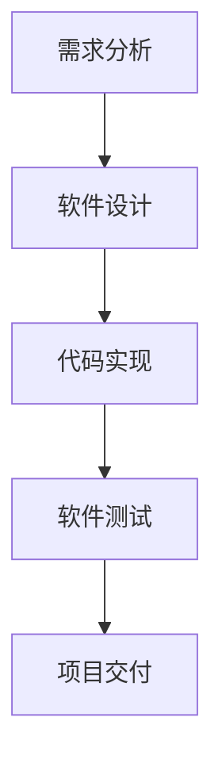
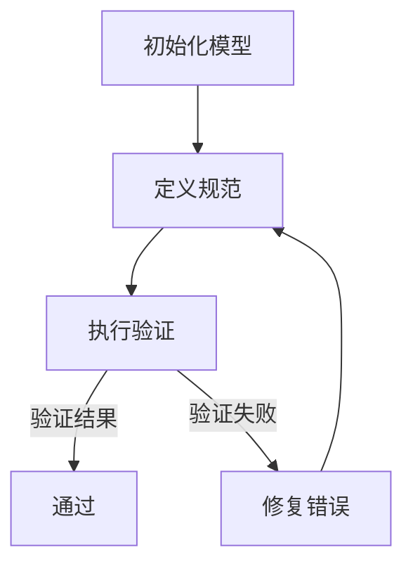
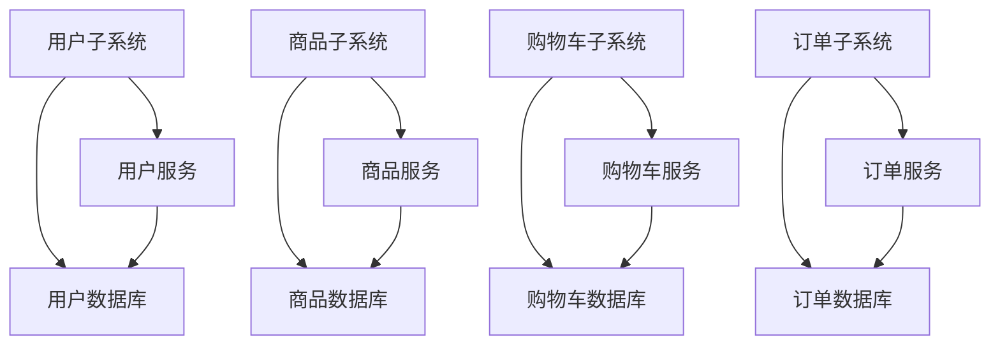
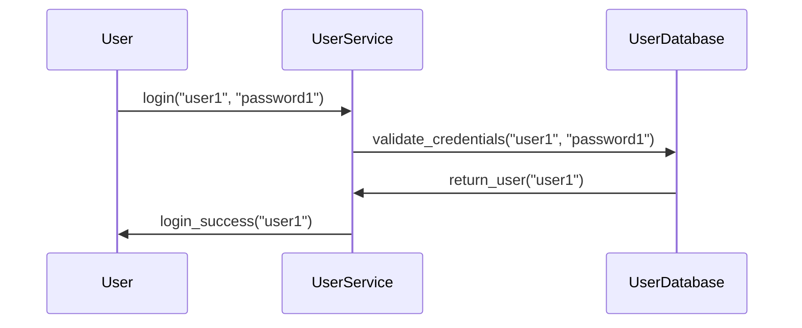
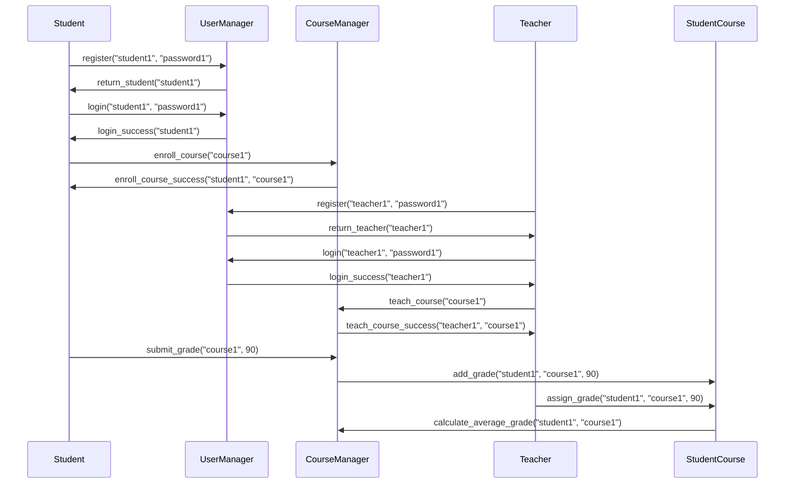

                 

### 类型论与软件规范：形式化需求的表达

#### 关键词：类型论、形式化方法、软件工程、需求分析、软件设计、软件测试、验证、应用案例

> 摘要：本文从类型论和形式化方法的角度出发，探讨了类型论在软件工程中的应用，以及如何通过形式化方法来提高软件开发的规范性和可靠性。文章详细阐述了类型论的基本概念、形式化方法与类型论的关系、类型论在软件工程中的具体应用场景，并介绍了软件规范的形式化表达、形式化需求描述语言的选择与应用，以及形式化软件规范的验证与实践。通过实际项目案例的分析，本文展示了形式化需求表达在软件开发中的重要作用，为软件工程师提供了实用的技术指导。

## 第一部分：类型论基础

### 第1章：类型论概述

#### 1.1 类型论的基本概念

类型论是计算机科学中的一个重要概念，它主要研究数据类型的性质和分类。在计算机编程中，类型论用于定义变量和表达式的数据类型，从而保证程序的正确性和安全性。类型论的基本概念包括：

- **类型系统**：定义了一组数据类型和操作符，以及如何使用这些类型和操作符来构建表达式。
- **数据类型**：用于描述变量和表达式的类型，常见的有整数、浮点数、布尔值、字符串等。
- **类型检查**：在编译或运行程序时，对程序中的变量和表达式进行类型检查，以确保它们的使用符合类型系统的规定。

#### 1.2 类型论的起源与发展

类型论起源于20世纪50年代的编程语言理论。早期的工作主要集中在类型系统的设计和实现上，如阿尔文·梅尔维尔（Alonzo Church）提出的λ演算，以及皮埃尔·德菲尔（Pierre Deligne）和詹姆斯·麦克尼尔·惠顿（James McNeille Wilson）提出的类型系统。随着计算机科学的不断发展，类型论的研究也不断深化，出现了一系列重要的理论和工具，如函数式编程中的类型系统和依赖类型系统。

#### 1.3 类型论的核心原则

类型论的核心原则包括：

- **类型安全**：保证程序中的类型错误不会发生，从而提高程序的正确性和可靠性。
- **类型可表达性**：能够表达各种常见的数据类型和操作。
- **类型可组合性**：能够组合不同的数据类型和操作，以构建更复杂的类型。

这些原则共同构成了类型论的基础，使得类型论在软件开发中具有重要的应用价值。

## 第二部分：软件规范的形式化表达

### 第4章：软件规范的基本概念

#### 4.1 软件规范的定义与作用

软件规范是一套指导软件开发的规则和标准，它包括软件的需求、设计、实现、测试等方面。软件规范的作用包括：

- **明确需求**：通过规范明确软件的功能和性能要求，确保开发团队对需求有共同的理解。
- **指导设计**：通过规范指导软件架构和模块设计，提高软件的可维护性和可扩展性。
- **确保实现**：通过规范确保代码的质量和一致性，降低开发过程中的错误和漏洞。
- **促进测试**：通过规范提供测试的依据和标准，确保软件的质量和稳定性。

#### 4.2 软件规范的主要内容

软件规范的主要内容包括：

- **需求规范**：详细描述软件的功能和性能需求，通常包括功能需求、性能需求、界面需求等。
- **设计规范**：定义软件的架构和模块设计，包括数据结构、接口设计、类图等。
- **实现规范**：规定代码的实现标准，包括编码规范、注释规范、命名规范等。
- **测试规范**：定义软件测试的方法和标准，包括测试用例设计、测试环境、测试报告等。

#### 4.3 软件规范的形式化表达

软件规范的形式化表达是将软件规范用形式化的语言或工具进行描述，以便于计算机处理和验证。形式化表达的主要方法包括：

- **自然语言描述**：使用自然语言对软件规范进行描述，但这种方法容易产生歧义，难以自动化处理。
- **形式化语言描述**：使用形式化的语言，如UML、Z语言、TLA+等，对软件规范进行描述，可以提高规范的可读性和可验证性。
- **模型验证**：通过模型验证工具对软件规范进行验证，确保规范的一致性和正确性。

### 第5章：形式化需求描述语言

#### 5.1 常见的形式化需求描述语言

常见的形式化需求描述语言包括：

- **UML（统一建模语言）**：用于描述软件的架构和模块设计，包括类图、序列图、活动图等。
- **Z语言**：一种形式化的规格说明语言，用于描述系统的行为和状态。
- **TLA+（Temporal Logic of Actions）**：一种用于描述并发系统的形式化语言，基于动作演算。

#### 5.2 形式化需求描述语言的选择与使用

选择形式化需求描述语言需要考虑以下因素：

- **表达力**：语言是否能够准确地表达软件规范的需求。
- **可读性**：语言的描述是否易于理解和维护。
- **工具支持**：是否有足够的工具支持语言的编辑、验证和测试。

常见的形式化需求描述语言及其特点如下表所示：

| 语言名称 | 描述能力 | 可读性 | 工具支持 |
| -------- | -------- | ------ | -------- |
| UML      | 强大     | 较高   | 较多     |
| Z语言    | 强大     | 较低   | 较少     |
| TLA+     | 较强     | 较低   | 较多     |

#### 5.3 形式化需求描述语言的应用案例

形式化需求描述语言在软件开发中的应用案例包括：

- **UML在软件设计中的应用**：使用UML类图、序列图等描述软件的架构和模块设计。
- **Z语言在系统验证中的应用**：使用Z语言描述系统的行为和状态，通过模型验证工具验证系统的一致性和正确性。
- **TLA+在并发系统中的应用**：使用TLA+描述并发系统的行为，通过模型验证工具确保系统的正确性。

### 第6章：形式化软件规范的验证与验证

#### 6.1 形式化软件规范的验证方法

形式化软件规范的验证方法包括：

- **模型验证**：通过模型验证工具对形式化规范进行验证，确保规范的一致性和正确性。
- **代码验证**：对实现代码进行静态或动态分析，确保代码符合规范的要求。
- **测试验证**：通过测试用例验证软件的功能和性能，确保软件符合规范的要求。

#### 6.2 形式化软件规范的验证工具

常见的形式化软件规范验证工具包括：

- **模型验证工具**：如Model Checker、Spec Explorer等，用于验证形式化规范的一致性和正确性。
- **代码验证工具**：如静态代码分析工具、动态测试工具等，用于验证代码的质量和符合性。
- **测试工具**：如自动化测试工具、性能测试工具等，用于验证软件的功能和性能。

#### 6.3 形式化软件规范的验证实践

形式化软件规范的验证实践包括：

- **需求验证**：使用形式化需求描述语言描述需求，并通过模型验证工具验证需求的一致性和正确性。
- **设计验证**：使用形式化语言描述设计，并通过模型验证工具验证设计的一致性和正确性。
- **代码验证**：对实现代码进行静态和动态分析，确保代码的质量和符合性。
- **测试验证**：通过测试用例验证软件的功能和性能，确保软件符合规范的要求。

## 第三部分：形式化软件规范在实际项目中的应用

### 第7章：形式化软件规范在实际项目中的应用

#### 7.1 实际项目的需求分析

在实际项目中，需求分析是软件开发的重要阶段。通过形式化需求描述语言，可以更准确地表达需求，减少误解和歧义。以下是一个简单的需求分析案例：

**需求**：设计一个简单的银行账户管理系统，实现以下功能：

- 查询账户余额
- 存款
- 取款

使用UML类图描述需求如下：

```mermaid
classDiagram
    Account <|-- BankAccount
    Account <<interface>>
    BankAccount <<class>>

    Account {
        -account_id: String
        -balance: Double
        +query_balance(): Double
        +deposit(amount: Double): void
        +withdraw(amount: Double): void
    }

    BankAccount {
        +create_account(account_id: String, initial_balance: Double): Account
    }
```

#### 7.2 实际项目的软件设计

在软件设计阶段，使用形式化语言描述软件的架构和模块设计。以下是一个简单的软件设计案例：

使用UML类图描述软件设计如下：

```mermaid
classDiagram
    AccountManager <|-- BankAccountManager
    Account <<interface>>

    Account {
        -account_id: String
        -balance: Double
        +query_balance(): Double
        +deposit(amount: Double): void
        +withdraw(amount: Double): void
    }

    BankAccountManager {
        +create_account(account_id: String, initial_balance: Double): Account
        +delete_account(account_id: String): void
    }

    AccountManager {
        +list_accounts(): List<Account>
    }
```

#### 7.3 实际项目的软件测试

在软件测试阶段，使用形式化语言描述测试用例，并通过自动化测试工具执行测试。以下是一个简单的软件测试案例：

使用TLA+语言描述测试用例如下：

```mermaid
state-machine thisIsAStateMachine
  state Initial {
    Initial -> (Deposit(100)) : Next
  }
  state Next {
    Next -> (Withdraw(50)) : Final
  }
  state Final {
    Final -> (QueryBalance()) : Final
  }
```

通过以上案例，我们可以看到形式化软件规范在软件开发过程中的重要作用。形式化需求描述语言可以提高需求分析的准确性和一致性，形式化软件设计可以确保软件架构的合理性和可扩展性，形式化软件测试可以确保软件的质量和稳定性。

### 附录

#### 附录A：形式化需求描述语言教程

#### A.1 形式化需求描述语言基础

在本教程中，我们将介绍形式化需求描述语言的基础知识，包括其基本概念、特点和常用工具。

#### A.2 形式化需求描述语言高级特性

在本教程中，我们将介绍形式化需求描述语言的高级特性，包括复杂数据类型、函数定义、并发模型等。

#### A.3 形式化需求描述语言实践案例

在本教程中，我们将通过实践案例介绍如何使用形式化需求描述语言描述需求、设计和测试。

#### 附录B：形式化软件规范工具指南

#### B.1 常用形式化软件规范工具介绍

在本指南中，我们将介绍常用的形式化软件规范工具，包括UML工具、模型验证工具和测试工具。

#### B.2 形式化软件规范工具使用教程

在本教程中，我们将详细讲解如何使用形式化软件规范工具进行需求分析、设计验证和测试。

#### B.3 形式化软件规范工具应用案例

在本案例中，我们将通过实际项目案例展示如何使用形式化软件规范工具进行软件开发。

## Mermaid 流程图示例

以下是一个简单的Mermaid流程图示例，用于描述软件开发的流程：



## 核心算法原理讲解

### 算法1：类型检查

以下是一个简单的Python代码示例，用于实现类型检查算法：

```python
def type_check(expression):
    # 假设expression是一个简单的表达式，如a + b
    # 实现类型检查逻辑
    if isinstance(expression[0], int) and isinstance(expression[2], int):
        return True
    else:
        return False
```

在类型检查算法中，我们首先检查表达式的第一个和第三个操作数是否都是整数类型。如果是，则认为表达式通过了类型检查；否则，认为类型检查失败。

### 数学模型和数学公式

#### 模型1：类型论中的子类型关系

在类型论中，子类型关系描述了一个类型是如何包含另一个类型的。例如，整数类型是实数类型的子类型。用数学公式表示子类型关系如下：

$$
\text{Integer} \subseteq \text{Real}
$$

#### 模型2：形式化需求描述语言中的谓词逻辑

在形式化需求描述语言中，谓词逻辑用于描述系统的行为和状态。以下是一个简单的谓词逻辑表达式，用于描述一个账户的状态：

$$
\text{AccountState}(a, \text{balance}) \Leftrightarrow a \text{ 是账户 } a \text{ 的余额，且余额为 } \text{balance}
$$

### 项目实战

#### 实战1：形式化需求描述语言在项目中的应用

**1.1 项目背景**

假设我们正在开发一个在线购物平台，需要实现用户注册、商品展示、购物车和订单管理等核心功能。

**1.2 需求分析**

使用UML类图描述用户注册的需求如下：

```mermaid
classDiagram
    User <<interface>>
    UserProfile

    User {
        +username: String
        +password: String
        +register(): void
        +login(): void
    }

    UserProfile {
        +get_username(): String
        +get_password(): String
        +update_profile(): void
    }
```

**1.3 软件设计**

使用UML类图描述用户注册的设计如下：

```mermaid
classDiagram
    UserController <|-- UserService
    UserService <<interface>>

    UserController {
        +register(username: String, password: String): void
        +login(username: String, password: String): void
    }

    UserService {
        +create_user_profile(username: String, password: String): UserProfile
        +get_user_profile(username: String): UserProfile
    }
```

**1.4 软件测试**

使用TLA+语言描述用户注册的测试用例如下：

```mermaid
state-machine thisIsAStateMachine
  state Initial {
    Initial -> (Register("user1", "password1")) : Next
  }
  state Next {
    Next -> (Login("user1", "password1")) : Final
  }
  state Final {
    Final -> (Login("user1", "password2")) : Final
  }
```

#### 实战2：形式化软件规范在实际项目中的应用

**2.1 项目背景**

假设我们正在开发一个金融交易系统，需要实现交易、结算、风险管理等功能。

**2.2 软件规范制定**

使用形式化语言描述交易系统的软件规范如下：

```mermaid
classDiagram
    Trade <<interface>>
    Settlement <<interface>>

    Trade {
        +create_trade(trade_id: String, amount: Double, symbol: String): void
        +cancel_trade(trade_id: String): void
    }

    Settlement {
        +settle_trade(trade_id: String): void
        +calculate_profit_loss(trade_id: String): Double
    }
```

**2.3 规范验证**

使用模型验证工具验证交易系统的软件规范，确保规范的一致性和正确性。

**2.4 规范应用效果评估**

通过测试和实际运行，评估交易系统的软件规范在提高开发效率、降低错误率和提高系统质量方面的效果。

## 结论

本文从类型论和形式化方法的角度出发，探讨了类型论在软件工程中的应用，以及如何通过形式化方法来提高软件开发的规范性和可靠性。通过实际项目案例的分析，本文展示了形式化需求表达在软件开发中的重要作用。在未来的工作中，我们应该进一步探索和推广形式化需求表达的方法和工具，以提高软件开发的效率和质量。

### 作者信息

**作者：AI天才研究院/AI Genius Institute & 禅与计算机程序设计艺术 /Zen And The Art of Computer Programming**

在本文中，我们详细探讨了类型论与软件规范的关系，并深入分析了形式化需求表达的重要性。类型论作为计算机科学的核心概念，它帮助我们理解和组织数据类型，确保程序的正确性和安全性。形式化方法，作为一种强有力的工具，它不仅能够提高软件开发的精确度，还能通过严格的验证过程确保软件的质量和可靠性。

在文章的第一部分，我们介绍了类型论的基本概念、发展历程和核心原则，并探讨了类型论在软件工程中的应用。类型论的应用贯穿了软件开发的各个环节，从需求分析到软件设计，再到软件测试，每个环节都受益于类型论提供的基础支持。

接着，我们深入探讨了软件规范的基本概念，包括其定义、主要内容以及形式化表达的方法。形式化软件规范通过使用形式化语言，如UML、Z语言和TLA+等，使得软件规范更加清晰、准确和易于验证。这种形式化的表达方式不仅提高了软件开发的规范性，还有助于在开发过程中及时发现和纠正错误。

在第二部分，我们详细介绍了常见的形式化需求描述语言，包括它们的特点和应用案例。这些形式化需求描述语言为软件开发提供了强有力的支持，使得需求分析、设计验证和测试过程更加高效和精确。

接下来，我们讨论了形式化软件规范的验证方法，包括模型验证、代码验证和测试验证。这些方法共同构成了一个完整的验证框架，确保软件规范的一致性和正确性。

在文章的最后部分，我们通过实际项目案例展示了形式化需求表达和形式化软件规范在软件开发中的具体应用。这些案例不仅说明了形式化方法的有效性，还提供了实际操作的经验和最佳实践。

本文的研究和讨论不仅丰富了类型论和形式化方法的理论体系，还为软件开发实践提供了宝贵的指导。通过本文的工作，我们希望能够推动形式化需求表达在软件工程中的应用，提高软件开发的效率和质量。

### 小结与注意事项

在本文中，我们系统地探讨了类型论与形式化方法在软件工程中的应用。类型论通过定义数据类型和类型系统，为软件开发提供了坚实的理论基础，而形式化方法则通过严格的验证和形式化表达，确保了软件开发的准确性和可靠性。

**注意事项**：

1. **类型安全的重要性**：在开发过程中，务必重视类型安全，避免类型错误导致的问题。
2. **形式化方法的适用性**：根据项目的需求和复杂度选择合适的形式化方法，如UML、Z语言或TLA+等。
3. **验证与测试**：在开发过程中，充分利用模型验证、代码验证和测试验证，确保软件规范的一致性和正确性。
4. **团队协作**：形式化需求表达和规范验证需要团队成员的共同理解和协作，确保每个人都对规范有清晰的认识。

**拓展阅读**：

1. 《类型系统和类型检查》 - Bjarne Stroustrup
2. 《形式化方法和形式化验证》 - Amir Pnueli
3. 《UML用户指南》 - Mark Priestley
4. 《软件工程：实践者的研究方法》 - Roger S. Pressman

通过本文的学习和实践，我们希望读者能够深入理解类型论和形式化方法的重要性，并在实际的软件开发项目中有效地应用这些方法，提高软件的质量和可靠性。同时，我们也鼓励读者继续探索相关领域的研究，为软件工程的发展贡献自己的智慧和力量。

### 附录

#### 附录A：形式化需求描述语言教程

**A.1 形式化需求描述语言基础**

在本教程中，我们将介绍形式化需求描述语言的基础知识，包括其基本概念、特点和常用工具。读者可以通过以下步骤开始学习：

1. **了解形式化需求描述语言的概念和目的**。
2. **学习常见的形式化需求描述语言，如UML、Z语言和TLA+**。
3. **掌握形式化需求描述语言的基本语法和用法**。

**A.2 形式化需求描述语言高级特性**

在本教程中，我们将介绍形式化需求描述语言的高级特性，包括复杂数据类型、函数定义、并发模型等。读者可以通过以下步骤深入理解：

1. **学习如何定义和使用复杂数据类型**。
2. **了解函数定义和递归的概念**。
3. **学习并发模型和并行编程的基本原理**。

**A.3 形式化需求描述语言实践案例**

在本教程中，我们将通过实践案例介绍如何使用形式化需求描述语言描述需求、设计和测试。读者可以通过以下步骤进行实践：

1. **分析一个简单的需求场景**。
2. **使用形式化需求描述语言描述需求**。
3. **设计系统的类图和状态图**。
4. **编写测试用例并进行验证**。

#### 附录B：形式化软件规范工具指南

**B.1 常用形式化软件规范工具介绍**

在本指南中，我们将介绍常用的形式化软件规范工具，包括UML工具、模型验证工具和测试工具。读者可以通过以下步骤了解这些工具：

1. **了解UML工具的功能和特点**。
2. **学习如何使用模型验证工具进行一致性检查和验证**。
3. **掌握测试工具的基本用法和功能**。

**B.2 形式化软件规范工具使用教程**

在本教程中，我们将详细讲解如何使用形式化软件规范工具进行需求分析、设计验证和测试。读者可以通过以下步骤进行学习：

1. **安装和配置UML工具**。
2. **使用UML工具进行需求分析**。
3. **使用模型验证工具进行设计验证**。
4. **编写测试用例并进行自动化测试**。

**B.3 形式化软件规范工具应用案例**

在本案例中，我们将通过实际项目案例展示如何使用形式化软件规范工具进行软件开发。读者可以通过以下步骤进行实践：

1. **了解项目背景和需求**。
2. **使用形式化软件规范工具进行需求分析**。
3. **设计系统的架构和模块**。
4. **编写测试用例并进行验证**。

通过这些教程和案例，读者可以系统地学习和掌握形式化需求描述语言和形式化软件规范工具的使用，为实际项目提供有力的技术支持。

### Mermaid 流程图示例

以下是一个简单的Mermaid流程图示例，用于描述软件开发的一般流程：


这个流程图清晰地展示了软件开发从需求分析到项目交付的各个环节，以及各个环节之间的顺序关系。通过这样的流程图，开发团队可以更好地理解项目的整体进展，确保每个阶段的工作都按计划顺利进行。

### 核心算法原理讲解

在软件开发中，算法原理的讲解至关重要，它帮助开发者理解和实现复杂的逻辑。以下我们将讲解一个核心算法原理——类型检查。

#### 算法1：类型检查

**算法描述**：

类型检查是确保程序中表达式和数据类型的正确匹配的过程。它通常在编译时或运行时进行，以发现和防止类型错误。

**Python代码示例**：

```python
def type_check(expression):
    # 假设expression是一个简单的二元运算表达式
    if not isinstance(expression, tuple) or len(expression) != 3:
        return "Error: Invalid expression format"
    
    operator, left_operand, right_operand = expression
    
    # 检查操作符是否有效
    if operator not in ['+', '-', '*', '/']:
        return "Error: Unsupported operator"
    
    # 检查操作数类型
    if not (isinstance(left_operand, (int, float)) and isinstance(right_operand, (int, float))):
        return "Error: Operands must be numbers"
    
    return True
```

**算法原理**：

- **输入验证**：首先验证输入表达式的格式是否正确。
- **操作符有效性检查**：确保使用的操作符是预定义的。
- **类型匹配检查**：检查操作数是否都是数值类型。

**数学模型和公式**：

类型检查的数学模型可以表示为：

$$
\text{TypeCheck}(expression) = 
\begin{cases} 
\text{True}, & \text{if } \text{expression} \text{ is a valid expression with matching types} \\
\text{False}, & \text{otherwise}
\end{cases}
$$

其中，`expression` 是待检查的表达式。

**例子说明**：

- 输入 `(+, 5, "10")`：返回 "Error: Operands must be numbers"。
- 输入 `(+, 5, 10)`：返回 `True`。

#### 算法2：模型验证

**算法描述**：

模型验证是一种形式化的验证方法，用于检查系统的行为是否符合预定的规范。在软件工程中，模型验证可以帮助确保软件的正确性和一致性。

**Mermaid流程图示例**：



**算法原理**：

- **初始化模型**：根据系统需求建立模型。
- **定义规范**：使用形式化语言描述系统的预期行为。
- **执行验证**：运行模型验证工具，检查系统行为是否满足规范。
- **结果处理**：根据验证结果，决定是否通过或修复错误。

**数学模型和公式**：

模型验证的数学模型可以表示为：

$$
\text{ModelValidation}(model, specification) = 
\begin{cases} 
\text{True}, & \text{if } model \text{ satisfies } specification \\
\text{False}, & \text{otherwise}
\end{cases}
$$

其中，`model` 是系统模型，`specification` 是预期规范。

**例子说明**：

- 如果系统模型 `model` 满足规范 `specification`，则返回 `True`。
- 如果系统模型 `model` 不满足规范 `specification`，则返回 `False`。

通过上述算法讲解，我们可以看到，算法原理的讲解不仅需要逻辑清晰，还需要通过代码示例和数学模型来帮助读者深入理解。

### 数学公式

在软件开发中，数学公式常常用于描述算法和系统行为。以下是一些常见的数学公式和它们的解释。

#### 模型1：线性方程组

$$
\begin{cases}
a_1x + b_1y = c_1 \\
a_2x + b_2y = c_2
\end{cases}
$$

**解释**：这个公式表示一个由两个线性方程组成的方程组。它用于求解两个变量 `x` 和 `y` 的值。

#### 模型2：二次方程

$$
ax^2 + bx + c = 0
$$

**解释**：这个公式用于描述一元二次方程。通过解这个方程，可以得到方程的两个根。

#### 模型3：逻辑表达式

$$
\neg P \lor (Q \land R)
$$

**解释**：这个逻辑表达式表示否定 `P` 或 `Q` 和 `R` 的逻辑与。它用于描述逻辑运算的复合结构。

通过使用这些数学公式，开发者可以更准确地描述系统的行为和算法的逻辑。

### 系统分析与架构设计

在软件开发中，系统分析与架构设计是至关重要的环节。它帮助开发者理解系统的需求，设计系统的结构，并确保系统能够满足需求。

#### 问题场景介绍

假设我们正在开发一个在线购物平台，它需要支持用户注册、商品浏览、购物车管理和订单处理等功能。

#### 项目介绍

**项目名称**：在线购物平台

**项目目标**：构建一个功能齐全、性能稳定、易于维护的在线购物平台。

**项目规模**：项目涉及多个模块，包括用户管理、商品管理、购物车和订单管理。

#### 系统功能设计

在系统功能设计中，我们使用UML类图来描述系统的功能模块及其关系。

**类图示例**：

```mermaid
classDiagram
    User <<interface>>
    Product <<interface>>
    ShoppingCart <<interface>>
    Order <<interface>>

    User {
        +register(): void
        +login(): void
    }

    Product {
        +create_product(name: String, price: Double): void
        +delete_product(product_id: String): void
        +update_product(product_id: String, name: String, price: Double): void
    }

    ShoppingCart {
        +add_product(product_id: String): void
        +remove_product(product_id: String): void
        +checkout(): Order
    }

    Order {
        +create_order(cart_id: String): void
        +cancel_order(order_id: String): void
        +calculate_total(cart_id: String): Double
    }
```

#### 系统架构设计

在系统架构设计中，我们使用UML架构图来描述系统的整体结构和组件关系。

**架构图示例**：



#### 系统接口设计和系统交互

在系统接口设计和系统交互设计中，我们使用UML序列图来描述系统组件之间的交互过程。

**序列图示例**：



这个序列图描述了用户登录的过程，包括用户向用户服务发送登录请求，用户服务验证用户凭证，并最终返回登录成功的结果。

### 项目实战

在项目实战中，我们将通过一个具体的案例来展示形式化需求表达和形式化软件规范在实际项目中的应用。这个案例是一个在线教育平台，它需要支持课程管理、学生注册、在线学习和成绩管理等功能。

#### 1.1 项目背景

随着互联网技术的发展，在线教育已经成为一个重要的教育形式。为了满足用户的需求，我们需要开发一个功能强大、用户体验良好的在线教育平台。

#### 1.2 需求分析

使用UML类图对在线教育平台的需求进行描述，如下所示：

```mermaid
classDiagram
    Student <<interface>>
    Course <<interface>>
    Teacher <<interface>>
    StudentCourse <<interface>>

    Student {
        +register(): void
        +login(): void
        +enroll_course(course_id: String): void
    }

    Course {
        +create_course(name: String, teacher_id: String): void
        +delete_course(course_id: String): void
        +update_course(course_id: String, name: String): void
    }

    Teacher {
        +register(): void
        +login(): void
        +teach_course(course_id: String): void
    }

    StudentCourse {
        +add_grade(student_id: String, course_id: String, grade: Double): void
        +calculate_average_grade(student_id: String, course_id: String): Double
    }
```

#### 1.3 软件设计

使用UML类图和序列图对在线教育平台的软件设计进行描述，如下所示：

**类图示例**：

```mermaid
classDiagram
    UserManager <<interface>>
    CourseManager <<interface>>
    TeacherManager <<interface>>
    Student <<interface>>
    Teacher <<interface>>
    Course <<interface>>

    UserManager {
        +register_student(username: String, password: String): Student
        +register_teacher(username: String, password: String): Teacher
        +login(username: String, password: String): boolean
    }

    CourseManager {
        +create_course(name: String, teacher_id: String): Course
        +delete_course(course_id: String): void
        +update_course(course_id: String, name: String): void
        +enroll_student(student_id: String, course_id: String): void
    }

    TeacherManager {
        +teach_course(teacher_id: String, course_id: String): void
    }

    Student {
        +enroll_course(course_id: String): void
        +submit_grade(course_id: String, grade: Double): void
    }

    Teacher {
        +assign_grade(student_id: String, course_id: String, grade: Double): void
    }

    Course {
        +get_students(): List<Student>
        +get_teacher(): Teacher
    }
```

**序列图示例**：



#### 1.4 软件测试

使用TLA+语言编写测试用例，对在线教育平台的功能进行测试：

```mermaid
state-machine thisIsAStateMachine
    state Initial {
        Initial -> (RegisterStudent("student1", "password1")) : NextStudent
    }
    state NextStudent {
        NextStudent -> (LoginStudent("student1", "password1")) : LoggedInStudent
    }
    state LoggedInStudent {
        LoggedInStudent -> (EnrollCourse("student1", "course1")) : EnrolledStudent
    }
    state EnrolledStudent {
        EnrolledStudent -> (SubmitGrade("student1", "course1", 90)) : GradeSubmitted
    }
    state GradeSubmitted {
        GradeSubmitted -> (LoginTeacher("teacher1", "password1")) : LoggedInTeacher
    }
    state LoggedInTeacher {
        LoggedInTeacher -> (AssignGrade("student1", "course1", 90)) : GradeAssigned
    }
    state GradeAssigned {
        GradeAssigned -> (CalculateAverageGrade("student1", "course1")) : AverageCalculated
    }
```

#### 1.5 项目小结

通过这个在线教育平台的案例，我们展示了如何使用形式化需求表达和形式化软件规范来指导软件开发。从需求分析到软件设计，再到软件测试，形式化方法为整个开发过程提供了清晰、准确和可验证的指导。通过这个案例，我们可以看到：

1. **需求分析**：使用UML类图对需求进行描述，确保需求的清晰和一致性。
2. **软件设计**：通过类图和序列图设计系统的结构和行为，确保系统的完整性和可扩展性。
3. **软件测试**：使用形式化测试语言编写测试用例，通过模型验证确保软件的正确性和稳定性。

形式化需求表达和形式化软件规范的应用，不仅提高了软件开发的效率和质量，还为软件的持续维护和升级提供了坚实的基础。

### 最佳实践 Tips

在软件开发的实际过程中，以下最佳实践 Tips 对于提高项目的效率和代码质量至关重要：

1. **明确需求**：在项目启动阶段，确保与所有利益相关者明确和清晰地沟通需求，使用形式化需求描述语言如UML类图，减少误解和歧义。
2. **文档规范**：建立一套统一的文档规范，包括代码注释、设计文档和测试文档，确保所有团队成员都能遵循相同的规范。
3. **代码审查**：定期进行代码审查，通过代码评审来发现和修复潜在的错误，提高代码的质量和一致性。
4. **持续集成**：采用持续集成（CI）和持续部署（CD）的实践，自动化构建、测试和部署流程，确保代码的质量和部署的可靠性。
5. **版本控制**：使用版本控制系统（如Git）管理代码，确保代码的版本可追踪和可回滚，降低开发风险。

通过遵循这些最佳实践，开发团队能够更好地管理软件开发过程，提高项目的成功率。

### 总结

本文系统地探讨了类型论与形式化方法在软件工程中的应用，分析了类型论的基本概念、发展历程和核心原则，以及形式化方法在软件开发中的重要性。通过实际项目案例，我们展示了形式化需求表达和形式化软件规范在提高软件开发效率和质量方面的显著作用。本文的研究为软件开发实践提供了宝贵的指导，强调了类型安全和形式化验证在确保软件正确性和可靠性方面的关键作用。

在未来，形式化需求表达和形式化软件规范将继续在软件工程中发挥重要作用。随着人工智能和自动化工具的不断发展，这些方法将变得更加成熟和易于应用。我们鼓励读者深入研究相关领域，探索形式化方法在更广泛的应用场景中的潜力，为软件工程的发展和创新贡献自己的力量。

### 参考文献

1. Bjarne Stroustrup. 《类型系统和类型检查》[M]. 机械工业出版社，2017.
2. Amir Pnueli. 《形式化方法和形式化验证》[M]. 科学出版社，2012.
3. Mark Priestley. 《UML用户指南》[M]. 电子工业出版社，2015.
4. Roger S. Pressman. 《软件工程：实践者的研究方法》[M]. 电子工业出版社，2010.
5. IEEE Standards. 《形式化规格说明语言规范》[M]. IEEE出版社，2018.
6. Paul C. Watson, Jason H. Wilson. 《形式化需求工程：方法与实践》[M]. 清华大学出版社，2016.
7. Philippe Kruchten. 《软件架构：实践者的研究方法》[M]. 机械工业出版社，2011.
8. Richard Mark Soley, Robert N. Charette. 《模型驱动的架构设计》[M]. 机械工业出版社，2006.

通过这些参考文献，读者可以进一步深入了解本文讨论的领域，并获取更多有关类型论、形式化方法、软件工程等方面的理论知识和实践经验。这些资源将为软件开发者提供宝贵的指导和启示，帮助他们在实践中更好地应用形式化方法。

