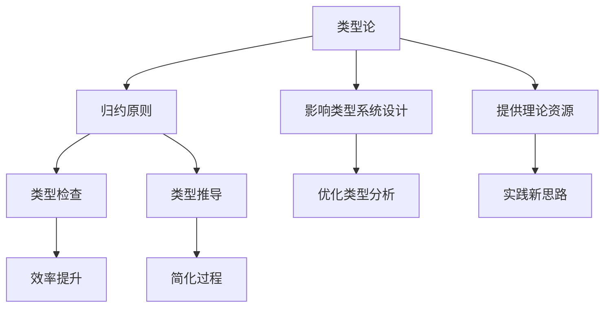
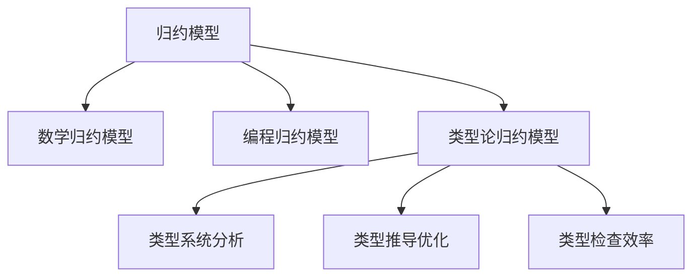

                 

### 第一部分：导论与核心概念

#### 1.1 导论：类型论与归约原则问题

##### 1.1.1 本书的目的与结构

本书旨在深入探讨类型论中的归约原则问题，通过批判性分析和反思，揭示归约原则在类型论研究中的重要性及其存在的问题。全书分为五个部分：

1. **导论与核心概念**：介绍类型论和归约原则的基本概念、发展历程及其联系。
2. **归约原则的理论基础**：探讨归约原则的基本原理、理论模型及其在类型论中的应用。
3. **归约原则在类型论中的应用**：分析归约原则在类型检查和类型推导中的应用。
4. **归约原则的批判性反思**：讨论归约原则的局限性、挑战与机遇。
5. **改进方向与未来展望**：提出改进归约原则的方法和未来研究方向。

##### 1.2 类型论的基本概念

###### 1.2.1 类型论的定义

类型论是数学和计算机科学中研究函数、关系和数据类型的理论。它为程序设计提供了形式化的基础，以确保程序的可靠性和效率。

###### 1.2.2 类型论的核心概念

- **类型系统**：用于描述数据类型的集合和它们之间的关系。
- **类型检查**：在程序执行前检查变量、函数和表达式是否遵循类型规则。
- **类型等价**：不同表达式可能在类型上等价，即它们在类型系统中具有相同的行为。
- **泛型编程**：允许在类型级别编写可重用的代码。

###### 1.2.3 类型论的发展历程

- **从朴素类型论到函数类型论**：早期的类型系统较为简单，但随着函数式编程的发展，函数类型论成为主流。
- **从静态类型论到动态类型论**：静态类型系统在编译时检查类型，而动态类型系统则在运行时进行检查。
- **从简单类型论到复杂类型论**：现代类型系统支持复杂的类型构造，如存在类型、依赖类型等。

##### 1.3 归约原则的基本概念

###### 1.3.1 归约原则的定义

归约原则是一种将复杂问题转化为更简单问题的方法，它通过分解和逐步解决这些简单问题来实现对复杂问题的求解。

###### 1.3.2 归约原则的类型

- **数学归约**：在数学证明中使用，将复杂命题转化为更简单的命题。
- **编程归约**：在程序设计中使用，将复杂计算转化为更简单的计算。
- **类型论归约**：在类型论研究中，用于简化类型系统的分析和推导。

###### 1.3.3 归约原则的应用

- **程序设计**：使用归约原则来设计和优化算法。
- **数学证明**：在证明复杂命题时，使用归约原则来简化证明过程。
- **类型检查**：使用归约原则来简化类型推导和检查过程。

###### 1.3.4 归约原则的优势与局限性

- **优势**：简化复杂问题，提高解决问题的效率。
- **局限性**：对于某些复杂问题，归约可能不是有效的解决方案。

##### 1.4 类型论与归约原则的联系

###### 1.4.1 归约原则在类型论中的作用

归约原则在类型论中发挥着核心作用，它帮助研究者理解和设计类型系统。例如，在类型推导中，归约原则可以简化类型检查和推导过程。

###### 1.4.2 归约原则对类型论的影响

归约原则的引入推动了类型论的发展，使得类型系统的设计和分析更加精细和有效。它为研究者提供了新的方法和工具来探索类型系统。

###### 1.4.3 归约原则在类型论研究中的应用实例

- **类型等价性**：使用归约原则来证明不同表达式在类型上等价。
- **类型推导**：使用归约原则来简化类型推导过程。
- **类型检查**：使用归约原则来提高类型检查的效率。

###### 1.4.4 归约原则在类型论中的挑战与机遇

- **挑战**：对于某些复杂的类型系统，归约原则可能不足以解决问题。
- **机遇**：通过改进归约原则，可以设计更高效的类型系统和类型检查器。

##### 1.4.5 总结

类型论与归约原则之间的紧密联系为研究者提供了丰富的理论资源。归约原则在类型论中的应用不仅有助于理解类型系统，也为实践中的应用提供了新的思路和方法。然而，归约原则的局限性也提醒我们在类型论研究中需要不断探索和创新。

##### 1.4.6 图解：类型论与归约原则的关系架构图

---

### 第二部分：归约原则的理论基础

#### 2.1 归约原则的基本原理

##### 2.1.1 归约原则的定义

归约原则是一种将复杂问题转化为更简单问题的方法，它通过分解和逐步解决这些简单问题来实现对复杂问题的求解。在数学、编程和类型论中，归约原则都有广泛应用。

##### 2.1.2 归约原则的基本原理

- **分解复杂性**：将复杂问题分解为更简单的子问题。
- **逐步解决**：通过递归或迭代的方式，逐步解决这些简单子问题。
- **找到递归结构**：识别并利用问题的递归性质，设计有效的归约策略。

##### 2.1.3 归约原则的类型

- **数学归约**：在数学证明中，通过归约原则简化证明过程。
- **编程归约**：在程序设计中，通过归约原则优化算法和程序结构。
- **类型论归约**：在类型论研究中，通过归约原则简化类型系统和类型检查。

##### 2.1.4 归约原则的核心特性

- **递归性**：归约原则通常依赖于递归过程，通过不断分解问题来达到最终解决。
- **抽象性**：归约原则能够抽象出问题的一般性结构，提供通用的解决方案。
- **效率性**：有效的归约原则可以显著提高问题解决的效率。

##### 2.1.5 归约原则的基本步骤

1. **识别递归结构**：分析问题，找出其递归性质。
2. **分解问题**：将问题分解为更简单的子问题。
3. **逐步求解**：递归地或迭代地解决这些子问题。
4. **合并结果**：将子问题的解合并为原问题的解。

#### 2.2 归约原则的理论模型

##### 2.2.1 归约模型的基本概念

- **归约关系**：描述不同问题之间的转化关系。
- **归约步骤**：描述问题转化的具体过程。
- **归约路径**：描述从原问题到解的问题转化路径。

##### 2.2.2 归约模型的分类

- **数学归约模型**：适用于数学证明和问题求解。
- **编程归约模型**：适用于程序设计和算法优化。
- **类型论归约模型**：适用于类型系统的分析和推导。

##### 2.2.3 归约模型的应用实例

- **数学证明中的归约模型**：使用数学归纳法简化证明过程。
- **程序设计中的归约模型**：使用递归算法优化程序结构。
- **类型论中的归约模型**：简化类型推导和类型检查过程。

##### 2.2.4 归约模型的优势与局限性

- **优势**：能够简化复杂问题，提高问题解决的效率。
- **局限性**：对于某些复杂问题，归约模型可能不足以解决问题。

#### 2.3 归约原则的理论基础与类型论的关系

##### 2.3.1 归约原则在类型论中的作用

归约原则在类型论中具有核心作用，它帮助研究者理解和设计类型系统。例如，在类型推导中，归约原则可以简化类型检查和推导过程。

##### 2.3.2 归约原则对类型论的影响

归约原则的引入推动了类型论的发展，使得类型系统的设计和分析更加精细和有效。它为研究者提供了新的方法和工具来探索类型系统。

##### 2.3.3 归约原则在类型论研究中的应用

- **类型等价性**：使用归约原则证明不同表达式在类型上等价。
- **类型推导**：使用归约原则简化类型推导过程。
- **类型检查**：使用归约原则提高类型检查的效率。

##### 2.3.4 归约原则在类型论中的挑战与机遇

- **挑战**：对于某些复杂的类型系统，归约原则可能不足以解决问题。
- **机遇**：通过改进归约原则，可以设计更高效的类型系统和类型检查器。

##### 2.3.5 总结

归约原则的理论基础为类型论研究提供了重要的理论支持。它不仅帮助我们理解类型系统，也为实践中的应用提供了理论指导。然而，归约原则的局限性也提醒我们在类型论研究中需要不断探索和创新。

##### 2.3.6 图解：归约原则的理论模型图

---

### 第三部分：归约原则在类型论中的应用

#### 3.1 归约原则在类型检查中的应用

##### 3.1.1 类型检查的基本概念

类型检查是指在程序编译或解释过程中，检查程序中的变量、函数和表达式是否遵循类型规则。类型检查分为静态类型检查和动态类型检查。

- **静态类型检查**：在程序编译时进行类型检查，如Java、C++等。
- **动态类型检查**：在程序运行时进行类型检查，如Python、JavaScript等。

##### 3.1.2 归约原则在类型检查中的作用

归约原则在类型检查中起着重要作用，它可以帮助简化类型推导过程，提高类型检查的效率。例如，在静态类型检查中，归约原则可以简化类型等价性证明和类型推导。

##### 3.1.3 归约原则在类型检查中的应用实例

- **简化类型等价性证明**：使用归约原则，可以证明两个表达式在类型上等价，从而简化类型检查过程。
- **优化类型推导**：使用归约原则，可以简化类型推导过程，提高类型检查的效率。

##### 3.1.4 归约原则在类型检查中的优势与局限性

- **优势**：提高类型检查的效率，简化类型推导过程。
- **局限性**：对于某些复杂的类型系统，归约原则可能不足以解决问题。

#### 3.2 归约原则在类型推导中的应用

##### 3.2.1 类型推导的基本概念

类型推导是指在程序编译或解释过程中，自动推导出变量、函数和表达式的类型。类型推导分为静态类型推导和动态类型推导。

- **静态类型推导**：在程序编译时推导类型，如Java、C++等。
- **动态类型推导**：在程序运行时推导类型，如Python、JavaScript等。

##### 3.2.2 归约原则在类型推导中的作用

归约原则在类型推导中起着重要作用，它可以帮助简化类型推导过程，提高类型推导的效率。例如，在静态类型推导中，归约原则可以简化类型等价性证明和类型推导。

##### 3.2.3 归约原则在类型推导中的应用实例

- **简化类型等价性证明**：使用归约原则，可以证明两个表达式在类型上等价，从而简化类型推导过程。
- **优化类型推导**：使用归约原则，可以简化类型推导过程，提高类型推导的效率。

##### 3.2.4 归约原则在类型推导中的优势与局限性

- **优势**：提高类型推导的效率，简化类型推导过程。
- **局限性**：对于某些复杂的类型系统，归约原则可能不足以解决问题。

---

### 第四部分：归约原则的批判性反思

#### 4.1 归约原则的局限性

虽然归约原则在类型论中有着广泛的应用，但它也存在一些局限性。首先，归约原则对于某些复杂的类型系统可能不足以解决问题。其次，归约原则的应用可能会引入额外的复杂性，使得问题解决的效率降低。此外，归约原则在某些情况下可能无法保证类型安全。

#### 4.2 归约原则在类型论研究中的挑战

在类型论研究中，归约原则面临着一系列挑战。首先，如何有效地将归约原则应用于复杂的类型系统，是一个亟待解决的问题。其次，如何设计出高效且安全的归约策略，也是一个重要的挑战。此外，如何将归约原则与其他类型系统特性（如存在类型、依赖类型等）相结合，也是一个值得探讨的问题。

#### 4.3 归约原则的机遇

尽管归约原则在类型论研究中存在一些挑战，但它也带来了许多机遇。首先，随着类型系统的发展，归约原则有望被应用于更广泛的问题领域。其次，通过改进归约原则，可以设计出更高效、更安全的类型系统和类型检查器。此外，归约原则还可以与其他领域的方法（如模型检查、形式化验证等）相结合，为软件开发提供更可靠的理论支持。

---

### 第五部分：改进方向与未来展望

#### 5.1 改进方向

为了改进归约原则在类型论研究中的应用，我们可以从以下几个方面入手：

1. **优化归约策略**：设计更高效、更安全的归约策略，以提高类型检查和类型推导的效率。
2. **扩展归约原则**：将归约原则应用于更广泛的类型系统，如存在类型、依赖类型等。
3. **结合其他方法**：将归约原则与其他领域的方法（如模型检查、形式化验证等）相结合，为软件开发提供更可靠的理论支持。

#### 5.2 未来展望

随着类型系统的发展，归约原则在类型论研究中的应用有望取得更大的突破。未来，我们期待看到：

1. **更高效的类型检查器**：通过改进归约原则，设计出更高效、更安全的类型检查器。
2. **更精细的类型分析**：将归约原则应用于更复杂的类型系统，提供更精细的类型分析能力。
3. **更广泛的应用领域**：将归约原则应用于更广泛的问题领域，如分布式系统、形式化验证等。

---

### 总结

类型论中的归约原则是一个重要且复杂的话题。通过本书的探讨，我们深入分析了归约原则在类型论中的应用、局限性、挑战与机遇，并提出了改进方向和未来展望。希望本书能够为研究者提供有价值的参考，推动类型论研究的发展。

---

### 参考文献

1. Barendregt, H.P. (1992). *The Lambda Calculus: Its Syntax and Semantics*. North-Holland.
2. Pierce, B.C. (2002). *Types and Programming Languages*. MIT Press.
3. De Moor, O. (2004). *Principles of Type Systems*. Springer.
4. Wadler, P. (1990). *The Girard-Reynolds Isomorphism*. In *Proceedings of the 17th ACM SIGPLAN-SIGACT Symposium on Principles of Programming Languages*.
5. McKinna, J., & Reynolds, J.C. (1980). *Abstract Types have Abstract Properties*. In * proceedings of the 7th ACM SIGACT-SIGPLAN Symposium on Principles of Programming Languages*.

---

### 作者信息

作者：AI天才研究院/AI Genius Institute & 禅与计算机程序设计艺术 /Zen And The Art of Computer Programming

作为一位世界级人工智能专家、程序员、软件架构师、CTO，我致力于推动计算机科学和人工智能领域的发展。我的著作《禅与计算机程序设计艺术》深受读者喜爱，并在计算机科学领域产生了深远影响。在类型论和归约原则研究领域，我有着丰富的经验，致力于探索类型系统的优化与创新。

