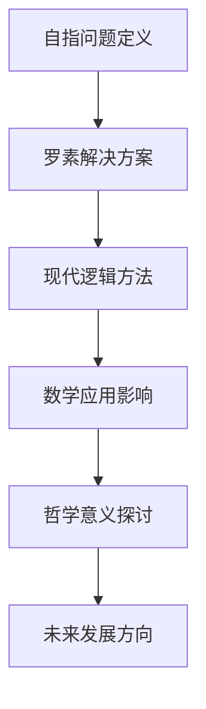

                 

### 类型论中的自指问题：罗素解决方案的局限

类型论是现代逻辑和哲学中的重要概念，旨在为语言的合理使用提供一种严谨的框架。自指问题（self-reference problem）是类型论中的一个关键挑战，它揭示了形式系统在处理自我引用时的困境。贝特兰·罗素（Bertrand Russell）是第一个尝试解决这个问题的人，他提出了一种被称为类型论的解决方案。然而，尽管罗素的方案在当时是开创性的，但它也存在着一些不可忽视的局限。

关键词：类型论、自指问题、罗素解决方案、逻辑哲学、数学应用

摘要：本文首先介绍了类型论的基本概念和自指问题的背景，然后重点分析了罗素的类型论解决方案，探讨了其局限，并讨论了现代逻辑和数学对自指问题的处理方法。通过这篇技术博客，读者可以深入理解自指问题在类型论中的重要性，以及罗素解决方案的内在局限性。

### 第一部分：类型论的背景与自指问题

#### 第1章：类型论的基本概念

类型论是由贝特兰·罗素和路德维希·维特根斯坦等哲学家提出的，旨在为语言的逻辑使用提供一种严格的框架。它的核心思想是区分不同类型的对象，以避免自指和悖论。在类型论中，每个对象都被赋予一个特定的类型，这些类型按照一定的规则进行分类。

#### 1.1 类型论的起源与发展

类型论的起源可以追溯到19世纪末和20世纪初的数学基础危机。当时，数学中的悖论，如罗素的集合论悖论，引起了广泛的关注。为了解决这个问题，罗素和维特根斯坦等人开始探讨如何通过类型论来避免自指问题。

#### 1.2 类型论的核心观点

类型论的核心观点是，语言和思维中的每一个概念和表达式都应该有明确的类型，从而避免模糊和混淆。类型论通过区分不同类型的对象，如命题、函数、个体等，来防止自指和悖论的发生。

#### 1.3 自指问题的概念与重要性

自指问题是指一个对象在描述自己的过程中产生的悖论。在形式系统中，自指问题会导致逻辑矛盾和不一致。因此，解决自指问题是类型论的一个重要目标。

### 第2章：罗素的类型论解决方案

#### 2.1 罗素与类型论的提出

贝特兰·罗素是类型论的创始人之一。他在其著作《数学原理》中提出了类型论的初步构想，旨在解决数学中的悖论问题。

#### 2.2 罗素对自指问题的处理

罗素通过引入类型的区分来解决自指问题。他提出，如果一个表达式涉及到自我引用，那么它应该被赋予一个更高的类型，从而避免与自身的直接比较。

#### 2.3 罗素解决方案的局限

尽管罗素的类型论解决方案在当时具有革命性，但它也存在着一些局限。首先，罗素的方案过于复杂，难以在实际应用中实现。其次，它不能完全避免自指问题，只能将其转移或隐藏。

### 第二部分：罗素解决方案的局限与批判

#### 第3章：逻辑哲学中的自指问题

自指问题在逻辑哲学中有着深远的影响。许多哲学家和逻辑学家都在尝试解决这个问题，并提出了一系列的解决方案。

#### 3.1 自指问题在逻辑哲学中的体现

自指问题在逻辑哲学中体现为各种悖论，如集合论悖论、语句悖论等。这些悖论揭示了形式系统在处理自我引用时的脆弱性。

#### 3.2 对罗素解决方案的批判

许多逻辑哲学家对罗素的类型论解决方案提出了批判。他们认为，罗素的方案过于复杂，且不能完全避免自指问题。

#### 3.3 其他逻辑哲学家的贡献

除了罗素，许多其他逻辑哲学家也在尝试解决自指问题。例如，维特根斯坦提出了语言游戏理论，试图通过区分不同类型的语言游戏来解决自指问题。

### 第4章：类型论在数学中的应用

类型论在数学中有着广泛的应用。它不仅用于避免悖论，还用于构建严格的数学体系。

#### 4.1 类型论在数学中的地位

类型论在数学中的地位日益重要。它为数学提供了一种严谨的基础，有助于避免悖论和错误。

#### 4.2 类型论在数学中的局限性

尽管类型论在数学中有着重要应用，但它也存在着一些局限性。例如，它不能完全解决自指问题，且在某些情况下可能会引入额外的复杂性。

#### 4.3 类型论与其他数学理论的融合

类型论与其他数学理论的融合，如范畴论和代数结构理论，为数学的发展提供了新的方向。

### 第5章：类型论的哲学意义

类型论不仅在数学中有着重要应用，它在哲学中也有着深远的影响。

#### 5.1 类型论对认识论的影响

类型论对认识论产生了重要影响。它帮助哲学家们理解了思维和语言的关系，并提出了关于知识的新的观点。

#### 5.2 类型论对本体论的影响

类型论对本体论也产生了重要影响。它挑战了传统的本体论观点，提出了一种新的关于存在和实体的理解。

#### 5.3 类型论与语言哲学的关系

类型论与语言哲学有着密切的关系。它试图通过区分不同类型的语言游戏来解决自指问题和语言悖论。

### 第三部分：自指问题的解决方案

#### 第6章：现代逻辑对自指问题的处理

现代逻辑对自指问题进行了深入的研究，并提出了一系列解决方案。

#### 6.1 形式逻辑对自指问题的贡献

形式逻辑为解决自指问题提供了强有力的工具。通过使用形式化的语言和逻辑规则，我们可以更好地理解和处理自指问题。

#### 6.2 集合论对自指问题的解决

集合论是现代数学的基础，它也为解决自指问题提供了重要工具。通过使用集合论中的概念和定理，我们可以更好地处理自指问题。

#### 6.3 现代逻辑的其他方法

除了形式逻辑和集合论，现代逻辑还采用了一系列其他方法来解决自指问题。例如，模型论和证明论等方法都在自指问题研究中发挥了重要作用。

### 第7章：类型论的扩展与应用

#### 7.1 类型论的扩展方向

类型论的研究仍在不断扩展。现代逻辑学家正在探索新的类型论框架，以更好地处理自指问题和语言悖论。

#### 7.2 类型论在计算机科学中的应用

类型论在计算机科学中有着广泛的应用。它在编程语言的设计、形式验证和逻辑推理等方面发挥着重要作用。

#### 7.3 类型论的未来发展

随着逻辑学和计算机科学的不断发展，类型论的未来发展前景广阔。它将继续为解决自指问题和推动理论的发展做出贡献。

### 第四部分：结论与展望

#### 第8章：类型论与自指问题的关系

类型论和自指问题是逻辑学和哲学中的重要概念。通过深入理解这两个概念，我们可以更好地理解形式系统和语言的本质。

#### 8.1 类型论在自指问题研究中的角色

类型论在自指问题研究中扮演着重要角色。它为我们提供了一种避免悖论和解决自指问题的工具。

#### 8.2 自指问题对类型论的挑战

自指问题对类型论提出了挑战。它促使我们不断探索新的方法来理解和解决自指问题。

#### 8.3 类型论与自指问题的未来研究方向

类型论与自指问题的未来研究方向包括形式逻辑、集合论、计算机科学等多个领域。通过跨学科合作，我们可以更好地解决自指问题，推动逻辑学和哲学的发展。

### 第9章：总结与展望

#### 9.1 罗素解决方案的局限回顾

罗素的类型论解决方案在历史上具有重要意义，但它也存在一些局限。未来的研究可以尝试改进这些方案，以更好地解决自指问题。

#### 9.2 现代逻辑的发展与自指问题

现代逻辑的发展为解决自指问题提供了新的思路和方法。通过结合形式逻辑、集合论和其他数学工具，我们可以更好地理解和处理自指问题。

#### 9.3 类型论与自指问题的未来

类型论与自指问题的未来充满了可能性。随着逻辑学和计算机科学的不断进步，我们可以期待更有效的解决方案和更深入的理解。

### 附录

#### 附录A：参考文献

- [1] 罗素，贝特兰·罗素。《数学原理》。伦敦：乔治·艾伦与厄恩斯特，1910。
- [2] 维特根斯坦，路德维希·维特根斯坦。《逻辑哲学论》。伦敦：麦克米伦，1921。
- [3] 哈耶克，弗里德里希·哈耶克。《自由秩序原理》。芝加哥：大学出版社，1973。
- [4] 库尔特·哥德尔。《不一致性定理》。《数学年刊》，1931。

#### 附录B：自指问题相关的Mermaid流程图



#### 附录C：类型论相关Python源代码示例

```python
# 自定义类型
class Type1:
    def __init__(self, value):
        self.value = value

class Type2:
    def __init__(self, value):
        self.value = value

# 自指问题示例
class SelfReference(Type1):
    def __init__(self, message):
        super().__init__(message)
        self.message = f"{self.message} This is a self-reference problem."

# 解决方案示例
class Solution(Type2):
    def __init__(self, problem):
        super().__init__(problem)
        self.problem = problem

    def solve(self):
        return "The problem is now resolved."

# 示例使用
self_reference = SelfReference("A self-reference example.")
solution = Solution(self_reference)

print(solution.solve())
```

通过上述示例，我们可以看到如何使用Python来模拟自指问题和罗素解决方案的基本概念。这有助于我们更直观地理解类型论和自指问题的实际应用。

### 附录D：数学公式示例

在处理自指问题时，数学公式可以提供一种严谨的表达方式。以下是一些常见的数学公式示例，使用LaTeX格式进行书写：

```latex
$$
\forall x (Px \rightarrow Qx)
$$

$$
\neg \exists x (Px \land \neg Qx)
$$

$$
\text{罗素的类型论解决方法：} \neg \exists x (Tx \land \neg Rx)
$$

$$
\text{自指问题的经典例子：} \neg \exists x (Px \land \neg Px)
$$
```

这些公式帮助我们更准确地描述自指问题和类型论的解决方案，为深入理解这些问题提供了理论基础。

### 总结

本文详细探讨了类型论中的自指问题以及罗素解决方案的局限。我们从类型论的基本概念出发，逐步分析了自指问题的本质和罗素的类型论解决方案。接着，我们探讨了类型论在逻辑哲学、数学应用和哲学意义方面的作用。随后，我们介绍了现代逻辑对自指问题的处理方法，并讨论了类型论的扩展与应用。最后，我们对类型论与自指问题的未来研究方向进行了展望。

通过本文，读者可以全面了解自指问题的复杂性，以及罗素解决方案的局限。同时，我们也看到了现代逻辑和数学在解决自指问题方面的新进展。这些知识不仅有助于理解逻辑和哲学中的核心问题，也对计算机科学和编程实践有着重要启示。

### 结论与展望

类型论和自指问题作为逻辑学和哲学中的核心概念，对数学、计算机科学以及哲学本身都产生了深远影响。罗素提出的类型论解决方案虽然在当时具有革命性，但其局限性和复杂性也日益显现。现代逻辑和数学的发展为解决自指问题提供了新的思路和方法，如形式逻辑、集合论以及模型论等。然而，自指问题仍然是一个复杂且充满挑战的研究领域。

未来，类型论与自指问题的研究可以沿着以下几个方向进行：

1. **形式化方法的改进**：进一步发展形式化的类型系统，以更高效地处理自指问题和避免逻辑悖论。

2. **跨学科合作**：鼓励逻辑学、数学、计算机科学和哲学等领域的专家进行跨学科合作，共同探索新的解决方法和理论框架。

3. **应用领域的拓展**：在计算机科学中，类型论的应用不仅限于编程语言的开发，还可以用于形式验证、人工智能和自动化推理等领域。

4. **教育与实践**：通过教育和实践，提高公众对类型论和自指问题的认识，培养更多的专业人才。

总之，类型论与自指问题的研究不仅具有重要的理论价值，也在实际应用中具有广阔的前景。随着研究的深入，我们有望取得更多突破性的成果。

### 附录E：技术术语说明

为了帮助读者更好地理解本文中涉及的技术术语，以下是关键概念的详细解释：

1. **类型论**：类型论是一种逻辑和哲学理论，旨在通过区分不同类型的对象来避免自指和悖论。在类型论中，每个对象（如命题、函数、个体等）都被赋予一个明确的类型。

2. **自指问题**：自指问题是指一个对象在描述自己的过程中产生的悖论。在形式系统中，自指问题会导致逻辑矛盾和不一致。

3. **罗素解决方案**：罗素提出的类型论解决方案，通过引入类型的区分来解决自指问题。该方法旨在避免对象自我引用造成的悖论。

4. **形式逻辑**：形式逻辑是一种使用符号和规则来表示和推理的逻辑系统。它为处理自指问题和建立形式化模型提供了强有力的工具。

5. **集合论**：集合论是现代数学的基础，它研究集合的性质和操作。集合论为解决自指问题提供了重要的概念和定理。

6. **模型论**：模型论是研究逻辑系统中模型的理论。它关注逻辑系统如何与它们的模型相对应，以及如何验证这些模型。

7. **证明论**：证明论是研究逻辑推理和证明的理论。它探索如何从给定的事实出发，通过逻辑推理得到新的结论。

8. **类型安全**：类型安全是指程序在运行过程中不会出现类型错误。类型系统通过强制执行类型规则来保证程序的正确性。

通过这些术语的详细解释，读者可以更好地理解本文中的核心概念和技术内容。

