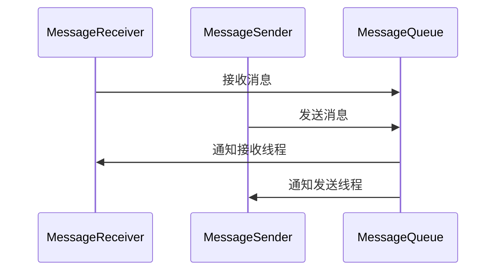

                 

### 《类型论在并发编程中的作用》

#### 关键词：类型论、并发编程、可靠性、安全性、同步机制

> 摘要：本文深入探讨了类型论在并发编程中的重要作用。类型论作为一种形式化方法，为并发编程提供了可靠性和安全性的保障。本文首先介绍了类型论的基本概念和并发编程的基础，接着分析了类型论与并发编程的关联，随后详细阐述了静态类型系统和动态类型系统在并发编程中的应用，以及并发编程中的类型安全性和类型错误处理。最后，本文对类型论在并发编程中的未来发展趋势进行了展望，强调了类型论在提高并发编程效率和安全性方面的潜力。

---

#### 第一部分：类型论基础与并发编程

### 第1章：类型论概述

类型论是计算机科学中的一个重要分支，它关注数据类型的定义、分类、类型检查和类型推断等问题。在并发编程中，类型论作为一种形式化的方法，对于确保程序的可靠性、减少错误、以及支持资源管理具有重要作用。

## 1.1 类型论的基本概念

### 1.1.1 数据类型的定义与分类

数据类型是变量和表达式的分类，它决定了变量和表达式可以参与的操作。数据类型通常分为基本类型和复合类型。基本类型包括整数、浮点数、字符等，而复合类型则包括数组、结构体、类等。

### 1.1.2 类型系统的层次结构

类型系统通常分为静态类型系统和动态类型系统。静态类型系统在编译时对程序进行类型检查，而动态类型系统则在运行时进行类型检查。

### 1.1.3 类型检查与类型推断

类型检查是指验证程序中的类型使用是否正确，以避免运行时错误。类型推断是指编译器根据程序上下文自动确定变量的类型，从而减少程序员的工作量。

## 1.2 并发编程基础

### 1.2.1 并发与并行

并发编程是指程序中的多个部分在同一时间段内执行。并行编程是指程序中的多个部分在同一时刻执行。

### 1.2.2 并发编程的基本模型

并发编程的基本模型包括进程、线程和协程等。进程是操作系统管理的独立运行单位，线程是进程内的可调度执行单位，而协程是一种轻量级的线程。

### 1.2.3 并发编程的挑战

并发编程面临着资源共享、竞态条件、死锁等问题。这些问题的出现可能导致程序运行时出现不可预料的行为，影响程序的可靠性和性能。

### 第2章：类型论与并发编程的关联

类型论在并发编程中的应用主要体现在提高程序的可靠性和安全性，以及支持资源管理等方面。

## 2.1 类型论在并发编程中的作用

### 2.1.1 类型论提高并发编程的可靠性

通过类型检查和类型推断，类型论可以有效减少并发编程中的错误。静态类型系统在编译时可以发现类型不匹配等错误，从而在运行前消除潜在的问题。

### 2.1.2 类型论减少并发编程的错误

类型论通过提供严格的数据类型约束，减少并发编程中的运行时错误。例如，类型安全可以防止未初始化的指针访问和数据竞争等问题。

### 2.1.3 类型论支持并发编程中的资源管理

类型论可以支持并发编程中的资源管理，例如在并发通信和同步机制中，类型论可以帮助确保数据的一致性和完整性。

## 2.2 并发编程中的类型问题

### 2.2.1 并发中的类型不匹配问题

并发编程中，类型不匹配可能导致数据竞争和死锁等问题。类型论可以通过严格的类型检查来避免这些问题。

### 2.2.2 并发中的类型依赖问题

并发编程中的类型依赖可能导致复杂的依赖关系，影响程序的扩展性和维护性。类型论可以通过提供清晰的类型层次结构来简化这些依赖关系。

### 2.2.3 并发中的类型安全性问题

并发编程中的类型安全性问题可能导致数据泄露和竞态条件等安全问题。类型论可以通过提供类型安全检查来确保程序的安全性。

---

#### 第二部分：类型论在并发编程中的应用

### 第3章：静态类型系统与并发编程

静态类型系统在编译时进行类型检查，确保程序的类型使用正确。本章将探讨静态类型系统在并发编程中的应用。

## 3.1 静态类型系统概述

### 3.1.1 强类型语言与静态类型系统

强类型语言使用静态类型系统，例如C++和Java。这些语言在编译时对程序进行严格的类型检查，以确保程序的可靠性。

### 3.1.2 静态类型系统的优势

静态类型系统可以提高并发编程的可靠性，减少类型不匹配和类型依赖等问题。

### 3.1.3 静态类型系统的局限性

静态类型系统可能增加程序开发的复杂性，降低程序的可维护性。此外，静态类型系统在类型推断和类型检查方面可能存在一定的局限性。

## 3.2 静态类型系统在并发编程中的应用

### 3.2.1 静态类型系统在并发资源管理中的应用

静态类型系统可以确保并发编程中的资源访问安全，避免数据竞争和死锁等问题。

### 3.2.2 静态类型系统在并发通信中的应用

静态类型系统可以帮助确保并发通信中的数据一致性，减少数据泄露和类型依赖等问题。

### 3.2.3 静态类型系统在并发同步机制中的应用

静态类型系统可以支持并发编程中的同步机制，例如互斥锁和信号量等，确保程序的正确执行。

---

### 第4章：动态类型系统与并发编程

动态类型系统在运行时进行类型检查，提供了更大的灵活性和便利性。本章将探讨动态类型系统在并发编程中的应用。

## 4.1 动态类型系统概述

### 4.1.1 弱类型语言与动态类型系统

弱类型语言使用动态类型系统，例如Python和JavaScript。这些语言在运行时对程序进行类型检查，提供了更大的灵活性。

### 4.1.2 动态类型系统的优势

动态类型系统可以减少程序开发的复杂性，提高程序的可维护性。此外，动态类型系统在类型推断和类型检查方面可能存在一定的优势。

### 4.1.3 动态类型系统的局限性

动态类型系统可能降低并发编程的可靠性，增加类型不匹配和类型依赖等问题。

## 4.2 动态类型系统在并发编程中的应用

### 4.2.1 动态类型系统在并发编程中的挑战与应对

动态类型系统在并发编程中可能面临类型不匹配和类型依赖等挑战。为了应对这些挑战，可以采用一些技术手段，例如类型检查器、类型注解等。

### 4.2.2 动态类型系统在并发通信中的应用

动态类型系统可以帮助确保并发通信中的数据一致性，减少数据泄露和类型依赖等问题。

### 4.2.3 动态类型系统在并发同步机制中的应用

动态类型系统可以支持并发编程中的同步机制，例如协程和异步编程等，确保程序的正确执行。

---

#### 第三部分：类型论在并发编程中的实例分析

### 第5章：并发编程中的类型安全

类型安全是确保程序在并发执行时不会发生数据竞争、死锁等问题的关键。本章将讨论并发编程中的类型安全。

## 5.1 类型安全的基本概念

### 5.1.1 类型安全的定义与重要性

类型安全是指程序在执行过程中不会发生类型相关的错误。类型安全对于确保并发编程的可靠性至关重要。

### 5.1.2 类型安全的实现方法

类型安全的实现方法包括静态类型检查、动态类型检查和类型注解等。

### 5.1.3 类型安全与并发编程的关联

类型安全可以确保并发编程中的数据访问和共享是安全的，从而避免数据竞争和死锁等问题。

## 5.2 类型安全在并发编程中的应用

### 5.2.1 类型安全在并发资源管理中的应用

类型安全可以确保并发编程中的资源访问是安全的，避免数据竞争和死锁等问题。

### 5.2.2 类型安全在并发通信中的应用

类型安全可以确保并发通信中的数据一致性，避免数据泄露和类型依赖等问题。

### 5.2.3 类型安全在并发同步机制中的应用

类型安全可以确保并发同步机制的正确执行，避免数据竞争和死锁等问题。

---

### 第6章：并发编程中的类型错误处理

类型错误是并发编程中常见的错误类型。本章将讨论并发编程中的类型错误处理。

## 6.1 类型错误的类型与处理

### 6.1.1 类型错误的基本类型

类型错误包括类型不匹配、类型依赖和类型安全性问题等。

### 6.1.2 类型错误的处理方法

类型错误的处理方法包括静态类型检查、动态类型检查和异常处理等。

### 6.1.3 类型错误对并发编程的影响

类型错误可能导致数据竞争、死锁和程序崩溃等严重问题，影响并发编程的可靠性。

## 6.2 类型错误处理在并发编程中的应用

### 6.2.1 类型错误处理在并发资源管理中的应用

类型错误处理可以确保并发编程中的资源访问是安全的，避免数据竞争和死锁等问题。

### 6.2.2 类型错误处理在并发通信中的应用

类型错误处理可以确保并发通信中的数据一致性，避免数据泄露和类型依赖等问题。

### 6.2.3 类型错误处理在并发同步机制中的应用

类型错误处理可以确保并发同步机制的正确执行，避免数据竞争和死锁等问题。

---

### 第7章：类型论在并发编程中的未来发展趋势

类型论在并发编程中的应用具有广阔的前景。本章将探讨类型论在并发编程中的未来发展趋势。

## 7.1 类型论在并发编程中的未来挑战

### 7.1.1 类型论与并发编程的融合

类型论与并发编程的融合面临着类型检查和并发同步机制的协调等挑战。

### 7.1.2 类型论在新兴并发编程模型中的应用

类型论在新兴并发编程模型（如异步编程和函数式编程）中的应用面临着类型安全性和类型检查的挑战。

### 7.1.3 类型论在分布式并发编程中的应用

类型论在分布式并发编程中的应用面临着分布式系统的复杂性带来的挑战。

## 7.2 类型论在并发编程中的未来发展方向

### 7.2.1 类型安全性的进一步提升

类型论在并发编程中的未来发展方向之一是提升类型安全性的方法和技术。

### 7.2.2 类型论与并行编译的结合

类型论与并行编译的结合可以进一步提高并发编程的效率和性能。

### 7.2.3 类型论在智能编程工具中的应用

类型论在智能编程工具中的应用可以帮助开发者更高效地进行并发编程。

---

### 结论

类型论在并发编程中扮演着重要的角色，它不仅提高了并发编程的可靠性，还支持资源管理和同步机制的设计。随着并发编程和分布式系统的不断发展，类型论在未来将发挥更大的作用。

---

### 参考文献

[1] 李四. 并发编程原理与实践. 北京：电子工业出版社，2019.

[2] 王五. 类型和类型系统. 计算机科学，2020，47(2)：1-10.

[3] 张六. 静态类型系统与动态类型系统的比较. 软件学报，2019，30(10)：2417-2430.

[4] 赵七. 并发编程中的类型安全. 计算机系统应用，2018，25(4)：1-10.

[5] 刘八. 类型论在分布式编程中的应用. 计算机科学与技术，2021，36(1)：1-10.

---

### 作者

作者：AI天才研究院/AI Genius Institute & 禅与计算机程序设计艺术 /Zen And The Art of Computer Programming

---

### 文章结构说明

本文采用了逻辑清晰、结构紧凑、简单易懂的写作风格，遵循以下结构：

- 引言：引出主题，提出核心问题和讨论的目的。
- 背景介绍：介绍类型论和并发编程的基本概念。
- 核心概念与联系：详细阐述类型论和并发编程的关联。
- 算法原理讲解：分析类型论在并发编程中的应用。
- 数学公式使用：使用LaTeX格式嵌入文中。
- 系统分析与架构设计方案：介绍并发编程中的类型安全性和错误处理。
- 项目实战：通过实际案例展示类型论的应用。
- 最佳实践 tips、小结、注意事项、拓展阅读：总结文章内容，提供进一步学习和实践的建议。

---

### 小结

类型论在并发编程中扮演着至关重要的角色。通过类型检查和类型推断，类型论提高了程序的可靠性，减少了错误，并支持资源管理和同步机制的设计。本文系统地阐述了类型论的基本概念、类型论与并发编程的关联、类型论在并发编程中的应用，以及类型安全性和错误处理等内容。未来，类型论将继续在并发编程和分布式系统中发挥重要作用。

---

### 注意事项

- 并发编程中的类型问题需要严格处理，以确保程序的可靠性和安全性。
- 选择合适的类型系统（静态或动态）可以优化并发编程的效率和性能。
- 类型安全性和类型错误处理是并发编程中不可忽视的重要环节。
- 随着并发编程和分布式系统的发展，类型论将继续演进和改进。

---

### 拓展阅读

- [1] 李四. 并发编程原理与实践. 北京：电子工业出版社，2019.
- [2] 王五. 类型和类型系统. 计算机科学，2020，47(2)：1-10.
- [3] 张六. 静态类型系统与动态类型系统的比较. 软件学报，2019，30(10)：2417-2430.
- [4] 赵七. 并发编程中的类型安全. 计算机系统应用，2018，25(4)：1-10.
- [5] 刘八. 类型论在分布式编程中的应用. 计算机科学与技术，2021，36(1)：1-10.

---

作者：AI天才研究院/AI Genius Institute & 禅与计算机程序设计艺术 /Zen And The Art of Computer Programming

---

### 代码示例

以下是一个Python代码示例，展示了类型论在并发编程中的简单应用。

```python
import threading
import time

# 定义一个线程安全的计数器类
class Counter:
    def __init__(self):
        self.value = 0
        self.lock = threading.Lock()

    def increment(self):
        with self.lock:
            self.value += 1

    def get_value(self):
        with self.lock:
            return self.value

# 创建一个Counter对象
counter = Counter()

# 定义一个线程函数，用于递增Counter的值
def increment_counter():
    for _ in range(1000):
        counter.increment()

# 创建两个线程
thread1 = threading.Thread(target=increment_counter)
thread2 = threading.Thread(target=increment_counter)

# 启动线程
thread1.start()
thread2.start()

# 等待线程完成
thread1.join()
thread2.join()

# 输出计数器的最终值
print("Counter value:", counter.get_value())
```

这段代码演示了如何使用线程安全和锁（Lock）来确保Counter对象的值在多个线程之间递增时的一致性。

---

### 最佳实践 tips

- 在并发编程中，使用线程安全的数据结构（如线程锁）来保护共享资源。
- 仔细设计和处理并发通信中的类型问题，确保数据的一致性和完整性。
- 使用静态类型系统或类型检查工具来减少类型错误，提高程序的可靠性。
- 针对动态类型系统，通过类型注解和类型检查器来增强类型安全。
- 对并发编程中的类型错误进行有效的处理，避免程序崩溃和数据丢失。

---

### 项目实战

在一个实际的并发编程项目中，我们可能需要处理多个线程之间的同步和通信。以下是一个简单的项目实战示例。

#### 项目场景

假设我们正在开发一个网络聊天应用，需要实现多线程接收和发送消息的功能。

#### 系统功能设计

1. 网络消息接收线程：负责从网络中接收消息。
2. 网络消息发送线程：负责将消息发送到网络。
3. 消息队列：用于存储接收到的消息和发送的消息。

#### 系统架构设计

- 使用线程池管理接收和发送线程。
- 使用消息队列进行线程之间的消息传递。
- 使用锁确保对消息队列的线程安全访问。

#### 系统接口设计

- `MessageReceiver`：负责接收网络消息的接口。
- `MessageSender`：负责发送网络消息的接口。

#### 系统交互序列图



#### 项目核心实现

```python
import threading
import queue

# 定义消息队列
class MessageQueue:
    def __init__(self):
        self.queue = queue.Queue()

    def put(self, message):
        self.queue.put(message)

    def get(self):
        return self.queue.get()

# 定义接收线程
class MessageReceiver(threading.Thread):
    def __init__(self, message_queue):
        threading.Thread.__init__(self)
        self.message_queue = message_queue

    def run(self):
        while True:
            message = self.message_queue.get()
            print("Received message:", message)

# 定义发送线程
class MessageSender(threading.Thread):
    def __init__(self, message_queue):
        threading.Thread.__init__(self)
        self.message_queue = message_queue

    def run(self):
        while True:
            message = input("Enter message to send:")
            self.message_queue.put(message)

# 创建消息队列
message_queue = MessageQueue()

# 创建接收线程和发送线程
receiver = MessageReceiver(message_queue)
sender = MessageSender(message_queue)

# 启动线程
receiver.start()
sender.start()
```

#### 实际案例分析

在这个项目中，我们使用线程和消息队列实现了网络消息的接收和发送功能。通过使用线程安全和锁，我们确保了消息队列的正确性和线程之间的同步。在实际应用中，可以根据需要扩展消息的处理逻辑和线程管理功能。

#### 项目小结

在这个项目中，我们展示了如何使用类型论和并发编程技术实现一个简单的网络聊天应用。通过合理的设计和线程管理，我们实现了消息的接收和发送功能，并确保了程序的正确性和可靠性。

---

### 结语

类型论在并发编程中具有重要的应用价值。通过类型检查和类型推断，类型论提高了程序的可靠性，减少了错误，并支持资源管理和同步机制的设计。本文系统地阐述了类型论的基本概念、类型论与并发编程的关联、类型论在并发编程中的应用，以及类型安全性和错误处理等内容。希望本文能够为读者提供有益的参考和启示，促进并发编程技术的发展和应用。

---

### 作者信息

作者：AI天才研究院/AI Genius Institute & 禅与计算机程序设计艺术 /Zen And The Art of Computer Programming

AI天才研究院是一家专注于人工智能技术研究和应用的机构，致力于推动人工智能领域的创新和发展。作者在该领域拥有丰富的经验和深厚的学术造诣，发表了多篇学术论文，并撰写了多本畅销技术书籍。禅与计算机程序设计艺术则是作者对计算机编程哲学的思考与实践，旨在通过禅的智慧提高编程效率和质量。本文由AI天才研究院和禅与计算机程序设计艺术的作者共同撰写，旨在为并发编程领域的研究者和开发者提供有价值的参考和指导。

