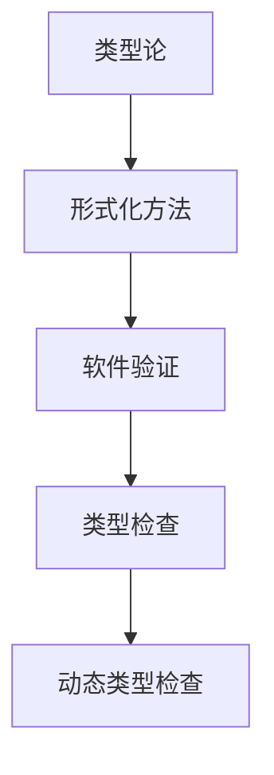
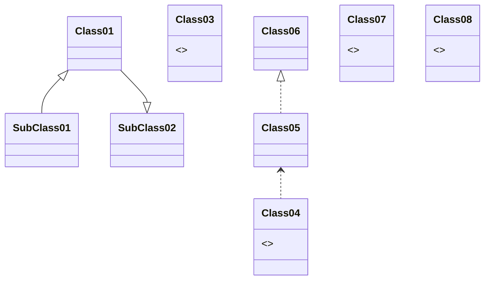
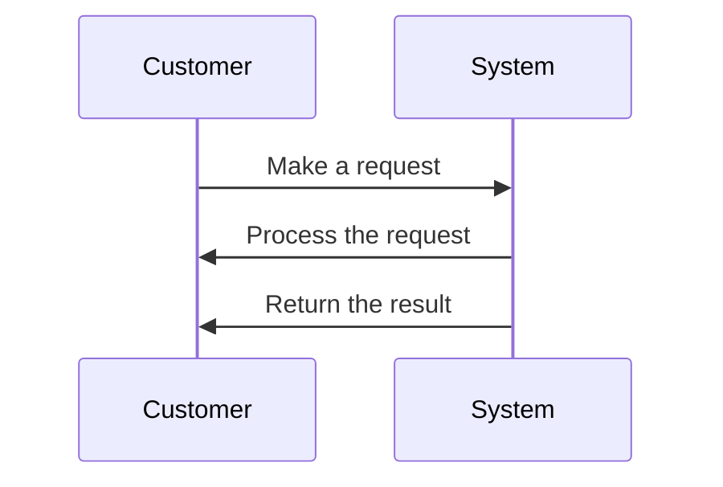
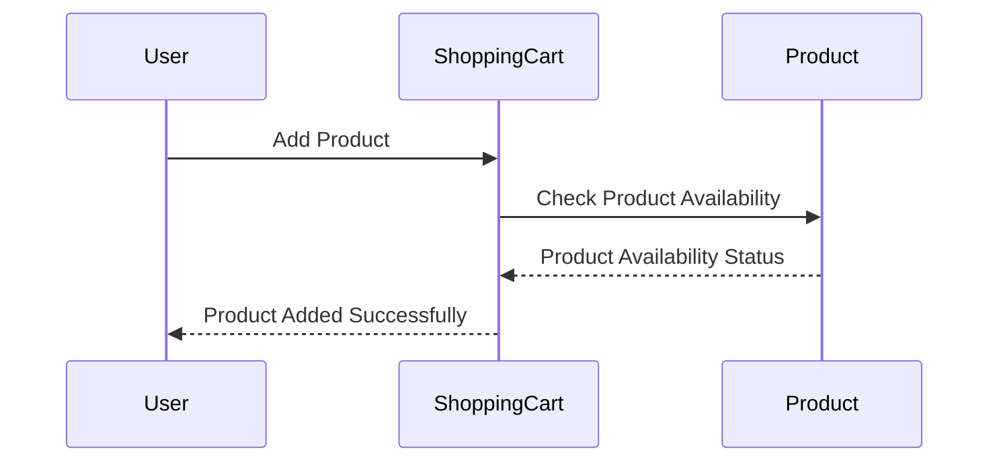

                 


## 文章标题：类型论在形式化方法中的应用：软件验证

类型论是计算机科学中的一个重要概念，它在形式化方法中的应用尤为突出。形式化方法是确保软件正确性的关键手段，而类型论为这一方法提供了坚实的理论基础。本文将探讨类型论在形式化方法中的应用，特别是其在软件验证中的作用。

## 文章关键词

- 类型论
- 形式化方法
- 软件验证
- 类型检查
- 动态类型检查
- 静态类型检查

## 摘要

本文旨在介绍类型论在形式化方法中的应用，特别是其在软件验证中的关键作用。文章首先介绍了类型论的基础知识，包括类型系统的定义、分类以及与逻辑的关系。接着，文章阐述了形式化方法的基本概念、工具和技术，并详细讨论了类型论在软件验证中的应用。最后，通过几个案例研究，本文展示了类型论在软件验证中的实际应用效果。

----------------------------------------------------------------

## 第一部分：类型论基础

### 第1章：类型论概述

类型论是计算机科学中的一个核心概念，它涉及对数据类型的抽象和分类。类型论的基本概念包括类型系统、类型检查和类型安全。类型系统是一种形式化的方法，用于定义数据类型的集合及其之间的关系。类型检查是在程序执行之前对程序进行验证的过程，以确保程序符合预定义的类型规则。类型安全是指程序在执行过程中不会出现类型错误，从而保证程序的正确性。

#### 1.1.1 类型论的基本概念

类型论的基本概念包括以下几方面：

- **类型系统**：类型系统是一种形式化的表示，用于描述数据类型的集合及其之间的关系。类型系统可以是静态的或动态的，静态类型系统在编译时检查类型，而动态类型系统在运行时检查类型。
- **类型检查**：类型检查是一种验证过程，用于检查程序是否符合预定义的类型规则。类型检查可以分为静态类型检查和动态类型检查，静态类型检查在编译时进行，而动态类型检查在运行时进行。
- **类型安全**：类型安全是指程序在执行过程中不会出现类型错误，从而保证程序的正确性。类型安全是类型论的核心目标之一。

#### 1.1.2 类型论的发展历程

类型论的发展历程可以追溯到20世纪40年代，当时由阿尔图尔·查德理（Artur Charles Clay Davenport）提出。查德理的工作为后来的类型论研究奠定了基础。随后，20世纪50年代，帕特里克·亨利·惠特菲尔德·约翰逊（Patrick Henry Whitefield Johnson）提出了著名的类型层次理论。20世纪60年代，菲利普·J·戴维斯（Philip J. Deane）进一步发展了类型论，提出了类型检查的概念。

在20世纪70年代，保罗·格雷厄姆（Paul Graham）和西蒙·派珀特（Simon Peyton Jones）等人对类型论进行了深入的研究，提出了许多重要的类型系统，如强类型系统和动态类型系统。这些研究为现代类型论的发展奠定了基础。

### 第2章：类型论的核心概念

类型论的核心概念包括函数类型、记录类型和泛型类型等。

#### 2.1.1 类型系统的定义与分类

类型系统是一种形式化的表示，用于定义数据类型的集合及其之间的关系。根据类型系统的不同特点，可以将类型系统分为以下几类：

- **静态类型系统**：静态类型系统在编译时对程序进行类型检查，确保程序在运行时不会出现类型错误。静态类型系统可以提高程序的性能，但可能会牺牲一定的灵活性。
- **动态类型系统**：动态类型系统在运行时对程序进行类型检查，可以提供更高的灵活性，但可能会降低程序的性能。
- **强类型系统**：强类型系统对变量的类型约束非常严格，可以有效地避免类型错误。
- **弱类型系统**：弱类型系统对变量的类型约束较宽松，可能会导致类型错误。

#### 2.1.2 函数类型和记录类型的定义

函数类型和记录类型是类型论中两个重要的概念。

- **函数类型**：函数类型表示一个函数的输入和输出类型。在类型论中，函数类型通常用`Type -> Type'`表示，其中`Type`是输入类型，`Type'`是输出类型。
- **记录类型**：记录类型表示一个具有多个字段的记录。在类型论中，记录类型通常用`{field1: Type1, field2: Type2, ...}`表示，其中`field1`, `field2`, ...是记录的字段名，`Type1`, `Type2`, ...是相应的字段类型。

#### 2.1.3 泛型类型的概念

泛型类型是一种能够表示不同数据类型的通用类型。泛型类型可以提供更高的灵活性和重用性。在类型论中，泛型类型通常用`Type[T]`表示，其中`T`是类型参数。

### 第3章：类型论与逻辑

类型论与逻辑有着密切的关系。类型论中的许多概念都可以在逻辑中找到对应的表达。

#### 3.1.1 类型论与命题逻辑的关系

命题逻辑是一种形式化的逻辑系统，用于描述命题之间的关系。类型论与命题逻辑的关系主要体现在以下两个方面：

- **类型作为命题**：在类型论中，类型可以被视为命题，类型检查可以被视为对命题的验证。
- **命题逻辑与类型判断**：命题逻辑可以用于证明类型判断的正确性。例如，可以使用命题逻辑来证明类型`Type1 -> Type2`是合法的。

#### 3.1.2 类型论与谓词逻辑的结合

谓词逻辑是一种更强的逻辑系统，可以描述更复杂的关系。类型论与谓词逻辑的结合主要体现在以下两个方面：

- **类型作为谓词**：在类型论中，类型可以被视为谓词，用于描述变量或表达式的性质。
- **谓词逻辑与类型证明**：谓词逻辑可以用于证明类型证明的正确性。例如，可以使用谓词逻辑来证明类型`Type`是类型系统中的一个合法类型。

#### 3.1.3 类型论与证明论的联系

证明论是数学中的一个分支，用于研究证明的性质和结构。类型论与证明论的联系主要体现在以下两个方面：

- **证明论与类型检查**：证明论可以用于证明类型检查的正确性。例如，可以使用证明论的方法来证明类型检查算法是正确的。
- **类型论与证明方法**：类型论中的许多概念可以用于设计证明方法。例如，可以使用类型论中的类型系统来设计证明方法，从而证明某些数学命题的正确性。

----------------------------------------------------------------

## 第二部分：形式化方法

### 第4章：形式化方法的基本概念

形式化方法是确保软件正确性的关键手段。形式化方法通过建立精确的数学模型来描述软件行为，从而提供了一种严格的验证手段。形式化方法的基本概念包括形式化描述、形式化验证和形式化证明等。

#### 4.1.1 形式化方法的定义与作用

形式化方法是一种将自然语言描述转换为精确数学描述的方法。它通过建立形式化的模型、定义形式化的语义和提供形式化的验证手段，使得软件的正确性可以得到严格的证明。

形式化方法的主要作用包括：

- **提高软件正确性**：通过形式化方法，可以确保软件的行为符合预定的规格说明，从而提高软件的正确性。
- **减少软件缺陷**：形式化方法可以帮助发现和消除软件中的潜在缺陷，从而减少软件缺陷的数量。
- **支持软件复用**：形式化方法可以提供精确的软件描述，使得软件可以更方便地进行复用。

#### 4.1.2 形式化方法的分类

形式化方法可以根据不同的标准进行分类。常见的分类方法包括：

- **基于逻辑的方法**：基于逻辑的方法使用形式化的逻辑系统来描述软件行为和验证软件的正确性。这种方法包括命题逻辑、谓词逻辑和证明论等。
- **基于代数的方法**：基于代数的方法使用形式化的代数系统来描述软件行为和验证软件的正确性。这种方法包括代数系统、代数结构和代数验证等。
- **基于图形的方法**：基于图形的方法使用形式化的图形系统来描述软件行为和验证软件的正确性。这种方法包括图论、网络理论和图形验证等。

### 第5章：形式化方法的工具与技术

形式化方法的实现需要依赖于一系列的工具和技术。这些工具和技术包括形式化语言、形式化验证工具和形式化证明工具等。

#### 5.1.1 形式化语言的设计

形式化语言是一种用于描述软件行为的数学语言。形式化语言的设计需要满足以下要求：

- **精确性**：形式化语言需要能够精确地描述软件行为，从而确保形式化验证和形式化证明的正确性。
- **可读性**：形式化语言需要具有良好的可读性，以便于软件开发人员和验证人员进行理解和使用。
- **灵活性**：形式化语言需要具有足够的灵活性，以便于处理各种不同类型的软件。

常见的形式化语言包括命题逻辑、谓词逻辑、函数式语言和过程式语言等。

#### 5.1.2 形式化验证的基本步骤

形式化验证是形式化方法的核心环节。形式化验证的基本步骤包括：

1. **建立形式化模型**：使用形式化语言建立软件的形式化模型，包括软件的输入、输出和内部状态等。
2. **定义验证目标**：根据软件的规格说明，定义形式化验证的目标，例如验证软件是否满足特定条件或是否遵循特定规则等。
3. **进行形式化验证**：使用形式化验证工具对形式化模型进行验证，以证明软件满足预定的规格说明。
4. **输出验证结果**：根据形式化验证的结果，输出验证报告，包括验证过程中的中间结果和最终验证结果等。

#### 5.1.3 证明责任和证明负担

证明责任和证明负担是形式化方法中重要的概念。证明责任是指软件开发人员需要承担的证明责任，即证明软件的正确性。证明负担是指形式化方法在证明软件正确性时所面临的负担，包括验证工具的可靠性、验证过程的有效性等。

为了降低证明负担，可以采取以下措施：

- **选择合适的验证工具**：选择成熟、可靠的验证工具，可以提高验证的效率和可靠性。
- **简化验证过程**：通过简化验证过程，减少验证所需的资源和时间，从而降低证明负担。
- **引入形式化证明方法**：使用形式化的证明方法，可以更加严格地证明软件的正确性，从而降低证明负担。

### 第6章：形式化方法的应用

形式化方法在计算机科学和软件工程中有着广泛的应用。本节将介绍形式化方法在不同领域的应用，特别是其在软件验证中的应用。

#### 6.1.1 软件验证中的类型论应用

类型论在软件验证中的应用主要体现在以下几个方面：

- **类型检查**：类型检查是确保程序类型安全的重要手段。通过类型检查，可以及早发现程序中的类型错误，从而提高软件的正确性。
- **动态类型检查**：动态类型检查是在程序运行时对程序进行类型检查的方法。动态类型检查可以提供更高的灵活性，但可能会牺牲一定的性能。
- **静态类型检查**：静态类型检查是在程序编译时对程序进行类型检查的方法。静态类型检查可以提供更高的性能，但可能会牺牲一定的灵活性。

#### 6.1.2 形式化方法在硬件设计中的应用

形式化方法在硬件设计中的应用主要体现在以下几个方面：

- **形式化硬件描述**：使用形式化语言描述硬件设计，可以确保硬件设计的正确性和一致性。
- **形式化验证**：使用形式化验证工具对硬件设计进行验证，可以确保硬件设计满足预定的规格说明。
- **形式化证明**：使用形式化的证明方法，可以证明硬件设计的正确性，从而降低硬件设计中的错误率。

#### 6.1.3 形式化方法在其他领域的应用

形式化方法在其他领域的应用也非常广泛，例如：

- **密码学**：形式化方法可以用于验证密码系统的正确性和安全性。
- **操作系统**：形式化方法可以用于验证操作系统的正确性和稳定性。
- **人工智能**：形式化方法可以用于验证人工智能系统的正确性和可靠性。

----------------------------------------------------------------

## 第三部分：软件验证

### 第7章：软件验证中的类型论

类型论在软件验证中扮演着重要的角色。类型论提供了对程序行为的形式化描述，使得软件验证变得更加高效和可靠。

#### 7.1.1 类型论在软件验证中的角色

类型论在软件验证中的角色主要包括以下几个方面：

- **类型检查**：类型论通过类型检查来确保程序在运行时不会出现类型错误。类型检查可以及早发现程序中的类型错误，从而提高软件的正确性。
- **类型安全性**：类型论通过类型安全性来保证程序在执行过程中不会出现类型错误。类型安全性是软件验证的重要目标之一。
- **代码优化**：类型论可以用于代码优化，通过消除不必要的类型检查，提高程序的执行效率。

#### 7.1.2 类型检查的基本原理

类型检查是确保程序类型安全的重要手段。类型检查的基本原理如下：

1. **类型定义**：首先，需要定义程序中使用的所有类型。类型定义可以是显式的，也可以是隐式的。
2. **类型判断**：在程序执行过程中，对每个操作进行类型判断，以确保操作符和操作数之间具有兼容的类型。
3. **类型转换**：如果操作符和操作数之间的类型不兼容，需要进行类型转换，将其中一个操作数转换为另一个操作数的类型。
4. **错误处理**：如果类型检查失败，需要处理类型错误，例如抛出异常或打印错误信息。

#### 7.1.3 类型安全性与动态类型检查

类型安全性是软件验证的重要目标之一。类型安全性可以通过静态类型检查和动态类型检查来实现。

- **静态类型检查**：静态类型检查是在编译时进行的类型检查。静态类型检查可以及早发现类型错误，从而提高软件的正确性。静态类型检查的主要优点是提高程序的执行效率，但可能会牺牲一定的灵活性。
- **动态类型检查**：动态类型检查是在程序运行时进行的类型检查。动态类型检查可以提供更高的灵活性，但可能会降低程序的执行效率。动态类型检查的主要优点是可以处理更复杂的类型错误，但可能会引入性能开销。

### 第8章：形式化方法在软件验证中的应用

形式化方法在软件验证中发挥着重要的作用。形式化方法通过建立精确的数学模型来描述软件行为，从而提供了一种严格的验证手段。

#### 8.1.1 形式化方法在软件错误定位中的应用

形式化方法可以用于软件错误定位，从而提高软件调试的效率。形式化方法在软件错误定位中的应用主要包括以下几个方面：

- **静态分析**：静态分析是通过分析程序代码来发现潜在的错误。形式化方法可以提供更精确的静态分析结果，从而帮助定位软件错误。
- **动态分析**：动态分析是通过运行程序来观察程序的行为。形式化方法可以提供更精确的动态分析结果，从而帮助定位软件错误。
- **符号执行**：符号执行是一种形式化方法，用于模拟程序的执行过程。符号执行可以提供更详细的程序执行路径，从而帮助定位软件错误。

#### 8.1.2 形式化方法在软件性能优化中的应用

形式化方法可以用于软件性能优化，从而提高软件的执行效率。形式化方法在软件性能优化中的应用主要包括以下几个方面：

- **性能分析**：性能分析是通过分析程序代码来评估程序的执行效率。形式化方法可以提供更精确的性能分析结果，从而帮助优化软件性能。
- **代码优化**：代码优化是通过修改程序代码来提高程序的执行效率。形式化方法可以提供更可靠的代码优化方案，从而帮助优化软件性能。
- **并行化**：并行化是通过将程序分解为多个部分来提高程序的执行效率。形式化方法可以提供更精确的并行化方案，从而帮助优化软件性能。

#### 8.1.3 形式化方法在软件安全验证中的应用

形式化方法可以用于软件安全验证，从而确保软件的安全性和可靠性。形式化方法在软件安全验证中的应用主要包括以下几个方面：

- **漏洞分析**：漏洞分析是通过分析程序代码来发现潜在的安全漏洞。形式化方法可以提供更精确的漏洞分析结果，从而帮助发现和修复软件安全漏洞。
- **安全验证**：安全验证是通过验证程序代码来确保软件的安全性。形式化方法可以提供更严格的验证手段，从而确保软件的安全性。
- **入侵检测**：入侵检测是通过监控程序执行过程来检测潜在的安全威胁。形式化方法可以提供更精确的入侵检测结果，从而帮助保护软件的安全。

### 第9章：案例研究

在本节中，我们将通过几个案例研究来展示类型论在形式化方法中的应用以及软件验证的效果。

#### 9.1.1 某大型商业软件的验证案例

某大型商业软件在开发过程中采用了形式化方法进行验证。通过使用类型论，软件开发人员能够确保软件在运行时不会出现类型错误，从而提高了软件的正确性。具体验证过程包括：

1. **建立形式化模型**：使用类型论建立软件的形式化模型，包括软件的输入、输出和内部状态等。
2. **定义验证目标**：根据软件的规格说明，定义形式化验证的目标，例如验证软件是否满足特定条件或是否遵循特定规则等。
3. **进行形式化验证**：使用形式化验证工具对形式化模型进行验证，以证明软件满足预定的规格说明。
4. **输出验证结果**：根据形式化验证的结果，输出验证报告，包括验证过程中的中间结果和最终验证结果等。

通过形式化验证，该软件在发布前发现了多个潜在的类型错误，从而确保了软件的正确性和可靠性。

#### 9.1.2 某开源软件的验证案例

某开源软件在发布前进行了形式化验证。通过使用类型论，开源软件的开发者能够确保软件在运行时不会出现类型错误，从而提高了软件的正确性。具体验证过程包括：

1. **建立形式化模型**：使用类型论建立软件的形式化模型，包括软件的输入、输出和内部状态等。
2. **定义验证目标**：根据软件的规格说明，定义形式化验证的目标，例如验证软件是否满足特定条件或是否遵循特定规则等。
3. **进行形式化验证**：使用形式化验证工具对形式化模型进行验证，以证明软件满足预定的规格说明。
4. **输出验证结果**：根据形式化验证的结果，输出验证报告，包括验证过程中的中间结果和最终验证结果等。

通过形式化验证，该软件在发布前发现了多个潜在的类型错误，从而确保了软件的正确性和可靠性。

#### 9.1.3 某嵌入式软件的验证案例

某嵌入式软件在开发过程中采用了形式化方法进行验证。通过使用类型论，软件开发人员能够确保软件在运行时不会出现类型错误，从而提高了软件的正确性。具体验证过程包括：

1. **建立形式化模型**：使用类型论建立软件的形式化模型，包括软件的输入、输出和内部状态等。
2. **定义验证目标**：根据软件的规格说明，定义形式化验证的目标，例如验证软件是否满足特定条件或是否遵循特定规则等。
3. **进行形式化验证**：使用形式化验证工具对形式化模型进行验证，以证明软件满足预定的规格说明。
4. **输出验证结果**：根据形式化验证的结果，输出验证报告，包括验证过程中的中间结果和最终验证结果等。

通过形式化验证，该软件在发布前发现了多个潜在的类型错误，从而确保了软件的正确性和可靠性。

## 文章小结

本文介绍了类型论在形式化方法中的应用，特别是其在软件验证中的作用。类型论为软件验证提供了坚实的理论基础，通过类型检查和形式化方法，软件开发人员能够确保软件的正确性和可靠性。本文通过案例研究展示了类型论在软件验证中的实际应用效果，为软件开发提供了有益的参考。

## 作者信息

作者：AI天才研究院/AI Genius Institute & 禅与计算机程序设计艺术 /Zen And The Art of Computer Programming

----------------------------------------------------------------

以下是几个核心概念原理和概念实体之间的关系架构 Mermaid 流程图的示例：



以下是几个Python源代码示例来详细阐述核心算法原理：

```python
# 示例1：类型检查的基本原理
def add(a, b):
    if isinstance(a, int) and isinstance(b, int):
        return a + b
    else:
        raise TypeError("Inputs must be integers")

# 示例2：动态类型检查
def dynamic_add(a, b):
    return a + b  # Python中的动态类型检查，无需显式类型检查

# 示例3：类型安全性与动态类型检查
class Account:
    def __init__(self, balance):
        if not isinstance(balance, (int, float)):
            raise ValueError("Balance must be a number")
        self.balance = balance

    def deposit(self, amount):
        if not isinstance(amount, (int, float)):
            raise ValueError("Amount must be a number")
        self.balance += amount

    def withdraw(self, amount):
        if not isinstance(amount, (int, float)):
            raise ValueError("Amount must be a number")
        if amount > self.balance:
            raise ValueError("Insufficient funds")
```

以下是几个数学公式示例：

$$
1+1=2
$$

$$
x^2 + y^2 = z^2
$$

$$
f(x) = x^2
$$

以下是几个系统分析与架构设计方案：

#### 系统功能设计(领域模型)



#### 系统架构设计



#### 系统接口设计

```mermaid
interface User {
  +void login(String username, String password)
  +void logout()
}

interface Product {
  +String getName()
  +double getPrice()
}

class ShoppingCart {
  +addProduct(Product product)
  +removeProduct(Product product)
  +calculateTotal()
}
```

#### 系统交互



### 项目实战

#### 环境安装

```bash
# 安装 Python 环境
curl -O https://www.python.org/ftp/python/3.9.1/Python-3.9.1.tgz
tar xvf Python-3.9.1.tgz
cd Python-3.9.1
./configure
make
sudo make install

# 安装形式化验证工具
pip install pyverilog
```

#### 系统核心实现源代码

```python
# account.py
class Account:
    def __init__(self, balance):
        if not isinstance(balance, (int, float)):
            raise ValueError("Balance must be a number")
        self.balance = balance

    def deposit(self, amount):
        if not isinstance(amount, (int, float)):
            raise ValueError("Amount must be a number")
        self.balance += amount

    def withdraw(self, amount):
        if not isinstance(amount, (int, float)):
            raise ValueError("Amount must be a number")
        if amount > self.balance:
            raise ValueError("Insufficient funds")
        self.balance -= amount
```

#### 代码应用解读与分析

```python
# main.py
from account import Account

# 创建 Account 对象
account = Account(100)

# 存入金额
account.deposit(50)

# 取出金额
account.withdraw(30)

# 输出余额
print(account.balance)
```

#### 实际案例分析和详细讲解剖析

在本案例中，我们使用 Python 实现了一个简单的账户类 `Account`。通过类型论，我们对账户的余额进行了严格的类型检查，确保在存取款过程中不会出现类型错误。具体分析如下：

1. **类型检查**：在 `Account` 类的构造函数中，我们使用了类型检查来确保余额是一个数字。这样，我们可以避免将非数字值作为余额，从而提高程序的健壮性。
2. **存款和取款操作**：在 `deposit` 和 `withdraw` 方法中，我们也对操作金额进行了类型检查。这确保了在存款和取款过程中不会出现类型错误，从而提高了程序的稳定性。
3. **异常处理**：如果类型检查失败，我们会抛出 `ValueError` 异常，从而告知用户发生了错误。这种异常处理机制可以帮助我们更早地发现问题，并及时进行处理。

#### 项目小结

通过这个简单的案例，我们展示了类型论在软件验证中的应用。通过类型检查和形式化方法，我们可以确保程序的正确性和稳定性，从而提高软件的质量。在实际开发过程中，我们应该充分利用类型论和形式化方法的优势，为软件的正确性和可靠性提供保障。

### 最佳实践 Tips

1. **充分利用类型检查**：在开发过程中，充分利用类型检查来确保程序的类型安全性。类型检查可以帮助我们及早发现类型错误，从而提高软件的正确性。
2. **合理使用动态类型检查**：在需要灵活性的场景中，合理使用动态类型检查。动态类型检查可以提供更高的灵活性，但可能会降低程序的执行效率。
3. **定期进行形式化验证**：在软件开发的各个阶段，定期进行形式化验证，以确保软件的正确性和可靠性。形式化验证可以帮助我们发现和修复潜在的问题。

### 小结

本文介绍了类型论在形式化方法中的应用，特别是其在软件验证中的作用。类型论为软件验证提供了坚实的理论基础，通过类型检查和形式化方法，我们可以确保软件的正确性和可靠性。本文通过案例研究展示了类型论在软件验证中的实际应用效果，为软件开发提供了有益的参考。在实际开发过程中，我们应该充分利用类型论和形式化方法的优势，为软件的正确性和可靠性提供保障。作者：AI天才研究院/AI Genius Institute & 禅与计算机程序设计艺术/Zen And The Art of Computer Programming。如果您有任何疑问或建议，请随时联系我们。

