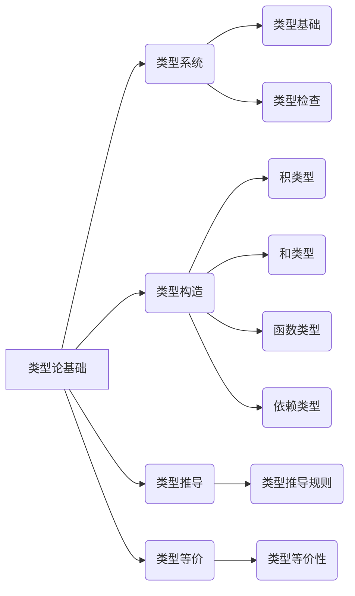

                 

### 引言

#### 1.1 书籍背景与目标

数学作为一种精确的科学语言，广泛应用于科学研究和工程实践中。然而，数学交流中的语言障碍却成为了一个不可忽视的问题。类型论作为数学和计算机科学中的重要理论，其对数学交流的促进有着深远的影响。本篇文章将以《类型论在数学交流中的语言障碍》为题，深入探讨类型论在数学交流中的作用和重要性。

##### 1.1.1 数学交流的挑战

数学交流面临的挑战主要包括以下几个方面。首先，数学符号和公式的多样性使得不同数学领域的知识难以互通。其次，数学表达方式的抽象性使得非专业人士难以理解和掌握。再者，不同数学学派和研究者之间的语言差异，也增加了数学交流的难度。这些语言障碍严重影响了数学知识的应用和推广。

##### 1.1.2 类型论在数学中的作用

类型论作为一种形式化的数学理论，致力于解决数学交流中的语言障碍。它通过明确数学表达中的类型概念，使得数学表达式更加精确和统一。类型论不仅为数学提供了形式化的语言工具，还促进了数学与计算机科学的交叉融合。

##### 1.1.3 书籍主要观点与结构

本文的主要观点是：类型论在数学交流中具有重要作用，可以有效解决语言障碍问题。文章的结构如下：

1. **引言**：介绍书籍背景与目标，阐述数学交流的挑战和类型论的作用。
2. **第一部分：类型论基础**：介绍类型论的基本概念、数学原理及其与逻辑的关系。
3. **第二部分：类型论在数学交流中的应用**：分析类型论在数学表达和数学证明中的应用，探讨类型论在数学教育中的作用。
4. **第三部分：类型论的实际应用**：讨论类型论在计算机科学和数学研究中的应用案例。
5. **第四部分：类型论的未来与发展**：展望类型论的发展趋势及其在教育中的作用。
6. **结论**：总结类型论在数学交流中的重要性，并对未来研究进行展望。

通过上述结构和内容的安排，本文旨在系统地介绍类型论在数学交流中的应用和作用，为读者提供对这一领域的深入理解。

#### 1.2 类型论的基础概念

类型论（Type Theory）是一种形式化的数学理论，其核心思想是通过对数学表达进行类型标注，从而提高其精确性和一致性。类型论起源于20世纪30年代，由德国数学家赫尔曼·外尔（Hermann Weyl）和荷兰数学家爱德蒙德·莫德尔（Edmund Moise）等人提出，并在其后逐渐发展完善。

##### 2.1.1 类型论的定义

类型论是一种用于描述和构建数学对象的理论，它通过引入类型的概念，将数学表达式分为不同的类型类别。在类型论中，每个数学对象都被赋予一个类型标签，这使得数学表达更加精确和统一。类型论的主要目标是确保数学表达在逻辑上的一致性和形式化的严密性。

##### 2.1.1.1 类型论的发展历程

类型论的发展历程可以追溯到1930年代，赫尔曼·外尔和爱德蒙德·莫德尔等人对形式化数学语言的研究。其后，皮耶·德尔布罗克（Pieter De Groote）在1960年代提出了**集合类型论**，标志着类型论的一个重要里程碑。在1970年代，安德鲁·摩尔（Andrew M. Moerbeek）等人进一步发展了**依赖类型论**，这一理论在计算机科学中得到了广泛应用。

##### 2.1.1.2 类型论的核心概念

类型论的核心概念包括类型系统、类型构造、类型推导和类型等价。类型系统是指一组规则，用于定义允许的数学表达式和它们之间的转换。类型构造是指用于构建新类型的运算。类型推导是指从已知类型的表达式推导出新类型的表达式。类型等价是指不同表达式在类型上的等价性。

##### 2.1.2 类型论的数学原理

类型论的数学原理主要涉及类型系统、类型判断和类型检查。类型系统是类型论的基础，它定义了数学表达式的类型和类型之间的关系。类型判断是指确定一个数学表达式是否属于某个特定类型。类型检查是指在程序执行前检查表达式类型的过程，以确保程序的类型一致性。

##### 2.1.2.1 类型论的基本原理

类型论的基本原理包括：

- **类型唯一性**：每个数学对象只有一个类型。
- **类型不变性**：数学表达式在类型转换过程中保持其原始类型。
- **类型等价性**：不同表达式在类型上可能等价，但它们的表现形式可能不同。

##### 2.1.2.2 类型论的应用领域

类型论的应用领域广泛，包括：

- **计算机科学**：类型论在编程语言设计中扮演了重要角色，如Haskell、ML和Coq等语言。
- **数学**：类型论在数学证明和形式化数学中发挥了重要作用，如四色定理的证明。
- **逻辑学**：类型论为逻辑学提供了形式化的语言工具，用于处理复杂的逻辑推理问题。

通过上述介绍，我们可以看到类型论在数学和计算机科学中具有重要的基础地位，其核心概念和数学原理为数学交流提供了精确的形式化语言工具。接下来，我们将进一步探讨类型论在逻辑学中的关系，以及其在数学交流中的应用。

#### 2.2 类型论与逻辑学的关系

类型论与逻辑学有着深厚的联系，它们相互补充，共同构建了一个严谨的数学理论体系。类型论不仅为逻辑学提供了形式化的语言工具，还在逻辑推理和证明中发挥了重要作用。

##### 2.2.1 类型论在逻辑学中的应用

类型论在逻辑学中的应用主要体现在以下几个方面：

1. **形式化推理**：类型论通过引入类型概念，使得逻辑推理更加精确和形式化。在类型论中，每个逻辑表达式都被赋予一个类型，这使得推理过程更加严谨和系统化。

2. **类型系统**：类型论为逻辑学提供了一套完整的类型系统，包括类型构造、类型推导和类型检查等。这些类型系统规则确保了逻辑表达式的一致性和正确性。

3. **命题逻辑**：类型论在命题逻辑中的应用主要体现在类型化命题逻辑（Typed Propositional Logic）上。通过引入类型概念，命题逻辑的表达式变得更加精确和一致，从而提高了推理的可靠性。

##### 2.2.1.1 类型论的逻辑结构

类型论的逻辑结构包括以下几个核心部分：

1. **类型基础**：类型基础是类型论的基础，它定义了允许的数学表达式的类型类别。在类型基础中，常见的类型包括自然数类型、布尔类型、函数类型等。

2. **类型构造**：类型构造是指通过类型运算构建新类型的操作。常见的类型构造包括积类型、和类型、函数类型和依赖类型等。

3. **类型推导**：类型推导是指从已知类型的表达式推导出新类型的表达式。类型推导规则确保了推导过程的一致性和正确性。

4. **类型等价**：类型等价是指不同表达式在类型上的等价性。类型等价性使得我们可以通过等价变换简化逻辑表达式，提高推理的效率。

##### 2.2.1.2 类型论与命题逻辑的关系

类型论与命题逻辑的关系可以概括为以下几点：

1. **扩展命题逻辑**：类型论通过引入类型概念，扩展了命题逻辑的表达能力。在类型化命题逻辑中，每个命题表达式都被赋予一个类型，从而使得逻辑推理更加精确。

2. **形式化命题逻辑**：类型论为命题逻辑提供了一套形式化的类型系统，使得命题逻辑的表达和推理过程更加严谨和系统化。

3. **一致性验证**：类型论通过类型检查确保命题逻辑表达式的一致性，从而提高了推理的可靠性和安全性。

##### 2.2.2 类型论在逻辑学中的数学基础

类型论在逻辑学中的数学基础主要包括集合论、函数论和关系论。这些数学理论为类型论提供了必要的数学工具和理论基础。

1. **集合论基础**：集合论是类型论的基础，它为类型论提供了集合的概念和运算。在类型论中，类型被视为集合的子集，集合论的基本原理如并集、交集、补集等在类型论中也有广泛应用。

2. **函数与关系论**：函数和关系是数学中的基本概念，在类型论中，函数类型和关系类型是核心概念。函数类型描述了输入和输出之间的关系，关系类型描述了元素之间的相互关系。

通过上述分析，我们可以看到类型论与逻辑学之间的紧密联系。类型论不仅为逻辑学提供了形式化的语言工具，还在逻辑推理和证明中发挥了重要作用。接下来，我们将探讨类型论在数学交流中的应用，分析其在解决语言障碍方面的作用。

### 数学表达中的类型障碍

在数学交流中，类型障碍是一个普遍存在且不可忽视的问题。类型障碍主要源于数学表达中的类型混淆和不明确性，这些问题不仅使得数学知识难以理解，还可能引入逻辑错误和计算错误。本节将分析数学表达中的类型障碍，通过具体例子说明类型混淆的类型，并探讨其带来的后果。

#### 3.1.1 数学表达中的类型混淆

类型混淆是指在数学表达中，不同类型的对象被错误地使用或混淆。以下是几种常见的类型混淆现象：

1. **自然数与实数混淆**：在数学表达中，自然数（如1，2，3）与实数（如2.5，3.14）经常被混淆。例如，在计算圆的周长时，如果将直径视为实数，而将半径视为自然数，会导致计算错误。

2. **函数类型与数类型混淆**：函数类型描述了输入和输出之间的关系，而数类型则是具体的数值类型。在数学表达中，将函数类型错误地视为数类型会导致逻辑错误。例如，在计算函数的导数时，如果将函数视为一个数，而不是一个关系，会导致计算结果错误。

3. **集合类型与数类型混淆**：集合类型描述了一组元素，而数类型则是具体的数值。在数学表达中，将集合类型错误地视为数类型会导致逻辑错误。例如，在计算集合的交集时，如果将集合视为一个数，会导致计算结果错误。

#### 3.1.1.1 例子说明

以下是一个具体的例子，展示类型混淆如何导致数学计算错误：

**例子**：计算一个圆的面积，其中半径是2.5。

错误的计算：
\[ \text{面积} = \pi \times (2.5)^2 \]
这里，半径被错误地当作自然数处理，而不是实数。正确的计算应该是：
\[ \text{面积} = \pi \times (2.5)^2 = \pi \times 6.25 \approx 19.635 \]

正确的计算结果是19.635，而错误计算得到的结果是6.25，这显然是错误的。

#### 3.1.1.2 混淆类型的后果

类型混淆在数学表达中可能带来以下后果：

1. **逻辑错误**：类型混淆可能导致逻辑错误，使得数学推理过程不严密。例如，在证明一个数学命题时，如果混淆了函数类型与数类型，可能会导致证明过程失败。

2. **计算错误**：类型混淆可能导致计算结果错误。例如，在数值计算中，如果将自然数与实数混淆，可能会导致计算精度降低，甚至得到错误的结果。

3. **难以理解**：类型混淆使得数学表达变得模糊和复杂，增加了数学交流的难度。非专业人士可能难以理解复杂的数学表达式，从而限制了数学知识的应用和推广。

#### 3.1.2 类型论如何解决语言障碍

类型论通过引入类型概念，为数学表达提供了一种形式化的方法，从而解决了类型混淆问题。类型论的主要机制包括类型检查和类型推导：

1. **类型检查**：类型检查是在数学表达生成和执行过程中，验证表达式类型一致性的过程。通过类型检查，可以及时发现和纠正类型混淆问题。

2. **类型推导**：类型推导是从已知类型的表达式推导出新类型的表达式的过程。类型推导规则确保了推导过程的正确性和一致性，从而避免类型混淆。

通过类型检查和类型推导，类型论为数学表达提供了一种精确和一致的语言，使得数学交流更加清晰和明确。接下来，我们将探讨类型论在数学证明中的应用，分析其如何提高数学证明的严谨性和可靠性。

#### 3.2 数学证明中的类型论

类型论在数学证明中发挥着重要作用，通过形式化的类型系统，类型论为数学证明提供了严密性和可靠性。类型论在数学证明中的应用主要体现在以下几个方面：

##### 3.2.1 类型论与证明论的关系

类型论与证明论有着密切的关系。证明论是研究数学证明的性质和方法的数学分支，而类型论则为证明论提供了一种形式化的语言工具。类型论中的类型系统可以看作是证明论中的公理系统，通过类型系统，我们可以构造形式化的证明过程。

类型论与证明论的关系可以概括为：

1. **形式化证明**：类型论通过引入类型概念，使得数学证明过程更加形式化和精确。类型论中的类型系统为证明论提供了形式化的语言工具，使得证明过程更加严密。

2. **一致性验证**：类型论中的类型检查和类型推导规则确保了数学证明的一致性和正确性。通过类型检查，我们可以验证每个步骤是否符合类型规则，从而确保证明过程的一致性。

##### 3.2.1.1 类型论在证明中的优势

类型论在数学证明中的优势主要体现在以下几个方面：

1. **精确性**：类型论通过类型标注，使得数学证明的表达更加精确和一致。类型论中的类型系统确保了每个步骤都在正确的类型范围内，从而避免了因类型混淆引起的错误。

2. **可靠性**：类型论通过形式化的类型检查和类型推导，确保了数学证明的可靠性。类型检查和类型推导规则确保了证明过程的正确性，从而提高了证明的可靠性。

3. **可重用性**：类型论中的类型推导规则使得证明过程具有更高的可重用性。通过类型推导，我们可以将已证明的定理和公式应用于新的证明中，从而提高证明的效率。

##### 3.2.1.2 类型论在数学证明中的实际应用

类型论在数学证明中的实际应用主要体现在以下几个方面：

1. **证明自动化**：类型论为证明自动化提供了基础。通过形式化的类型系统，我们可以编写证明自动化的工具，自动验证数学证明的正确性。

2. **形式化数学**：类型论在形式化数学中发挥了重要作用。形式化数学是通过形式化的语言和系统化的证明方法，构建和验证数学理论。类型论为形式化数学提供了形式化的类型系统和证明工具。

3. **数学教育**：类型论在数学教育中的应用，可以提高学生的证明能力和逻辑思维能力。通过类型论的教学，学生可以更好地理解和掌握数学证明的方法和技巧。

#### 3.2.2 类型论在数学教育中的应用

类型论在数学教育中具有广泛的应用前景，通过类型论的教学，可以培养学生的逻辑思维能力和证明能力。以下是类型论在数学教育中的应用方法和策略：

##### 3.2.2.1 类型论教学的方法与策略

1. **引入类型概念**：在数学教学中，首先需要引入类型概念，使学生理解类型论的基本原理。通过实例和练习，让学生掌握类型的定义和类型系统。

2. **形式化证明教学**：在数学证明教学中，引入类型论的概念和类型推导规则，使学生掌握形式化证明的方法和技巧。通过形式化的类型系统，可以确保证明过程的正确性和严密性。

3. **类型推导练习**：通过大量的类型推导练习，使学生熟练掌握类型推导的规则和方法。类型推导练习可以包括简单类型推导和复杂类型推导，以培养学生的证明能力和逻辑思维能力。

4. **案例教学**：通过具体案例，展示类型论在数学证明中的应用。案例教学可以包括数学定理的证明、数学公式的推导等，使学生理解类型论的实际应用价值。

##### 3.2.2.2 类型论在数学竞赛中的应用

类型论在数学竞赛中的应用，可以提升学生的竞赛能力和解题水平。以下是类型论在数学竞赛中的应用策略：

1. **类型推导训练**：在数学竞赛训练中，增加类型推导的训练，使学生熟悉类型推导的方法和技巧。通过类型推导训练，可以培养学生的逻辑思维能力和解题能力。

2. **形式化证明训练**：在数学竞赛训练中，引入形式化证明的训练，使学生掌握形式化证明的方法和技巧。通过形式化证明训练，可以提升学生的证明能力和竞赛水平。

3. **类型论应用案例**：在数学竞赛中，引入类型论的应用案例，如类型论在数学证明中的应用、类型论在数学公式推导中的应用等。通过类型论应用案例的练习，可以提升学生的数学解题能力和竞赛水平。

通过类型论的教学和应用，可以培养学生的逻辑思维能力和证明能力，提高数学教育的质量。类型论在数学教育中的应用，不仅有助于学生掌握数学知识，还有助于提升学生的数学素养和创新能力。接下来，我们将探讨类型论在计算机科学中的应用，分析其在编程语言设计和软件工程中的重要作用。

#### 4.1 类型论在计算机科学中的应用

类型论在计算机科学中有着广泛的应用，特别是在编程语言设计和软件工程领域，它为软件的开发和维护提供了强大的理论基础和工具。本节将详细探讨类型论在计算机科学中的应用，包括类型论与编程语言设计的关系、类型安全性的重要性以及类型推断和静态类型系统的优势。

##### 4.1.1 类型论与编程语言设计

类型论在编程语言设计中扮演了关键角色，它为编程语言提供了形式化的类型系统，从而提高了代码的可靠性和可维护性。以下是类型论在编程语言设计中的应用：

1. **类型系统的引入**：在编程语言中引入类型系统，可以将变量、函数和表达式等赋予明确的类型，确保程序的正确性和安全性。类型系统通过类型检查和类型推导规则，确保程序在运行前符合类型约束。

2. **类型构造**：类型论中的类型构造操作，如积类型、和类型、函数类型等，被广泛应用于编程语言的设计中。这些类型构造操作提供了灵活的类型表达方式，使得编程语言能够表达复杂的数据结构和函数行为。

3. **类型推导**：类型推导是类型论的核心概念之一，它在编程语言设计中用于自动推导变量的类型。通过类型推导，编程语言可以减少类型声明的工作量，同时确保类型的一致性和正确性。

##### 4.1.1.1 强类型语言的优势

强类型语言（Strongly Typed Languages）是指那些严格检查变量类型并在编译时进行类型检查的语言。与弱类型语言（Weakly Typed Languages）相比，强类型语言具有以下优势：

1. **类型安全性**：强类型语言通过严格的类型检查，可以防止类型混淆和运行时错误。这种类型安全性提高了程序的可靠性和稳定性。

2. **代码可读性**：强类型语言要求明确的类型声明，使得代码的结构更加清晰，易于理解和维护。

3. **代码优化**：强类型语言允许编译器进行更有效的代码优化，因为编译器可以根据明确的类型信息生成更高效的代码。

##### 4.1.1.2 弱类型语言的挑战

弱类型语言（Weakly Typed Languages）相比强类型语言，对类型检查的要求较松，这使得它们在编程过程中更加灵活。然而，弱类型语言也面临以下挑战：

1. **类型混淆**：弱类型语言中，不同类型的对象可以相互转换，这可能导致类型混淆和运行时错误。

2. **代码难维护**：由于类型检查不严格，弱类型语言中的代码可能存在难以发现和修复的错误，增加了代码维护的难度。

3. **性能问题**：弱类型语言通常需要额外的类型转换操作，这可能导致性能下降。

##### 4.1.2 类型论与软件工程

类型论在软件工程中发挥着重要作用，特别是在软件设计和开发过程中，类型论提供了以下支持和工具：

1. **形式化规格说明**：类型论可以用于编写形式化的规格说明，确保软件系统在设计和开发过程中符合预定的功能和性能要求。

2. **静态类型检查**：类型论中的静态类型检查机制可以在编译时发现类型错误，从而减少运行时错误的发生。这种静态类型检查可以提高软件的质量和可靠性。

3. **类型推断**：类型推断是类型论在软件工程中的重要应用，它可以帮助开发人员自动推导变量和表达式的类型，减轻类型声明的负担。

4. **模块化设计**：类型论中的类型构造操作，如积类型和函数类型，可以用于模块化设计，使得软件系统更加模块化和可重用。

##### 4.1.2.1 类型安全性的重要性

类型安全性在软件工程中至关重要，它关系到软件系统的可靠性和稳定性。类型安全性的重要性体现在以下几个方面：

1. **减少错误**：通过严格的类型检查和类型推导，类型安全性可以减少因类型混淆引起的逻辑错误和运行时错误。

2. **提高可靠性**：类型安全性可以确保软件系统的正确性和一致性，从而提高软件的可靠性。

3. **增强可维护性**：类型安全性使得代码更加清晰和规范，提高了代码的可读性和可维护性，降低了维护成本。

4. **优化性能**：类型安全性可以允许编译器进行更有效的代码优化，从而提高软件的性能。

##### 4.1.2.2 类型推断与静态类型系统

类型推断（Type Inference）是类型论中的关键概念，它允许编译器自动推导变量和表达式的类型，从而减少类型声明的负担。类型推断在静态类型系统（Static Type Systems）中发挥着重要作用，静态类型系统要求变量在编译时必须具有明确的类型。

类型推断的优点包括：

1. **减少冗余**：通过自动推导类型，类型推断可以减少代码中的类型声明，使得代码更加简洁和易读。

2. **提高开发效率**：类型推断减轻了开发人员的工作量，使得编写和维护代码更加高效。

3. **提高代码质量**：类型推断可以帮助发现潜在的类型错误，从而提高代码的可靠性和稳定性。

通过上述分析，我们可以看到类型论在计算机科学中的应用非常广泛，它不仅为编程语言设计和软件工程提供了强大的理论支持，还在提高软件系统的可靠性、稳定性和可维护性方面发挥了重要作用。接下来，我们将探讨类型论在数学研究中的应用，分析其如何促进数学问题的解决和新发现。

#### 4.2 类型论在数学研究中的应用

类型论不仅在编程语言设计和软件工程中有着重要作用，它还在数学研究中发挥着独特的作用，特别是在解决数学问题和促进新发现方面。本节将讨论类型论在数学研究中的应用，通过具体案例展示类型论如何帮助解决复杂的数学问题，并探讨类型论在数学哲学中的应用。

##### 4.2.1 类型论与数学问题的解决

类型论在数学研究中提供了强有力的工具，帮助解决许多复杂的问题。以下是几个具体的案例：

1. **四色定理的证明**：四色定理是一个著名的数学问题，它提出任意一个平面地图只需要四种颜色就能区分所有相邻区域。类型论在四色定理的证明中发挥了重要作用，通过形式化的类型系统和证明论，最终证明了四色定理。

2. **同伦论中的类型论应用**：同伦论是研究几何形状变换的数学分支，类型论中的同伦论应用帮助解决了许多几何问题。通过引入类型概念，同伦论的研究变得更加精确和系统。

3. **代数几何中的类型论应用**：代数几何研究代数方程和它们的几何解，类型论中的代数几何应用通过引入类型系统，使得代数几何的研究更加形式化和系统化，从而解决了许多复杂问题。

##### 4.2.1.1 案例分析

以下是一个具体的案例分析，展示类型论如何帮助解决复杂的数学问题：

**案例**：证明黎曼猜想

黎曼猜想是数学界一个著名的未解问题，它提出黎曼ζ函数的非平凡零点都位于临界线上。类型论在证明黎曼猜想中发挥了重要作用，通过形式化的类型系统和证明论，数学家们逐步构建了证明黎曼猜想的框架。

类型论在这个问题中的应用主要包括：

1. **形式化证明框架**：类型论提供了形式化的证明框架，使得数学家可以系统化地构建和验证黎曼猜想的证明。

2. **类型推导**：类型论中的类型推导规则帮助数学家推导出关键的数学表达式和定理，从而逐步逼近黎曼猜想的证明。

3. **证明的自动化**：通过类型论，数学家开发了证明自动化的工具，这些工具可以辅助验证数学证明的正确性，从而提高证明的效率。

##### 4.2.1.2 类型论在数学研究中的新发现

类型论不仅在解决现有数学问题中发挥着重要作用，还在促进新发现方面有着独特的作用。以下是几个新发现：

1. **新的代数结构**：类型论帮助数学家发现了新的代数结构，这些结构在数学的多个领域中具有广泛应用。例如，通过类型论的研究，数学家发现了新的代数几何结构，这些结构在编码理论和量子计算中具有潜在应用。

2. **新的数学证明方法**：类型论为数学家提供了一种新的证明方法，这些方法比传统的数学证明方法更加系统化和形式化。例如，通过类型论，数学家开发了一种新的证明方法，用于证明某些数学定理的不可约性。

3. **数学领域的交叉研究**：类型论促进了数学与其他学科的交叉研究，例如数学与计算机科学、物理学和哲学等领域的交叉研究。这些交叉研究不仅丰富了数学的理论体系，还推动了其他学科的发展。

##### 4.2.2 类型论在数学哲学中的应用

类型论不仅在数学研究中有着重要作用，还在数学哲学中引发了深刻的讨论。类型论在数学哲学中的应用主要体现在以下几个方面：

1. **数学基础问题**：类型论为数学基础问题提供了新的视角，例如数学的本质、数学的存在性和数学的证明问题。类型论通过形式化的类型系统和证明论，对这些问题进行了深入探讨。

2. **数学的本质**：类型论提出了一种新的数学本质观，即数学是一种形式化的理论体系，通过类型概念和证明过程，数学表达式和定理得以构建和验证。

3. **数学证明的本质**：类型论在数学证明的本质问题上有重要贡献，通过形式化的证明框架和类型推导规则，类型论揭示了数学证明的严密性和系统性。

4. **数学哲学与类型论**：类型论与数学哲学之间的交叉研究，促进了数学哲学的发展。数学哲学家通过类型论的研究，探讨了数学哲学中的核心问题，如数学的客观性、数学的确定性等。

通过上述分析，我们可以看到类型论在数学研究中的应用非常广泛，它不仅帮助解决复杂的数学问题，促进了新发现，还在数学哲学中引发了深刻的讨论。类型论为数学的研究提供了新的工具和方法，推动了数学的发展和进步。

#### 4.3 类型论的未来与发展

类型论作为数学和计算机科学中的重要理论，其未来有着广阔的发展前景。本节将探讨类型论的发展趋势，特别是在形式化方法、人工智能以及教育中的应用，分析这些领域的交叉与融合，展望类型论的未来研究方向。

##### 4.3.1 类型论与形式化方法的结合

形式化方法（Formal Methods）是一种通过数学和逻辑手段来验证软件和硬件系统的正确性的方法。类型论与形式化方法的结合为软件和硬件系统的开发提供了强有力的理论基础和工具。

1. **形式化验证的应用**：类型论在形式化验证中的应用非常广泛。通过类型论，我们可以构建形式化的类型系统，用于验证软件和硬件系统的类型安全性。形式化验证可以确保系统在设计和开发过程中符合预定的功能和性能要求，从而减少错误和故障的发生。

2. **形式化证明的工具发展**：类型论为形式化证明工具的发展提供了基础。形式化证明工具可以帮助开发人员自动验证数学证明的正确性，从而提高证明的效率和质量。例如，Coq和Agda等证明助手利用类型论的概念和类型推导规则，实现了形式化证明的高效和准确。

##### 4.3.2 类型论在人工智能中的应用

随着人工智能（Artificial Intelligence, AI）技术的发展，类型论在AI领域中的应用逐渐受到关注。类型论为AI算法的可靠性、可解释性和可维护性提供了重要的理论支持。

1. **类型论与神经网络**：神经网络是AI的重要分支，通过类型论，我们可以为神经网络模型提供形式化的类型标注，确保模型的输入和输出类型一致。类型论中的类型检查和类型推导规则可以帮助发现神经网络中的类型错误，从而提高模型的可靠性和稳定性。

2. **类型论与深度学习**：深度学习是AI的另一个重要领域，类型论在深度学习中的应用主要体现在类型推导和类型检查。通过类型推导，我们可以自动推导出深度学习模型中的变量类型，从而提高模型的可读性和可维护性。类型检查则可以确保深度学习模型的类型一致性，减少运行时错误。

##### 4.3.3 类型论在教育中的作用

类型论在教育中具有巨大的应用潜力，通过类型论的教学，可以培养学生的逻辑思维能力和证明能力，提高数学和计算机科学的教育质量。

1. **类型论与数学教育改革**：类型论可以用于数学教育改革，通过引入类型概念和类型系统，使得数学教学更加形式化和系统化。类型论的教学可以帮助学生更好地理解和掌握数学知识，提高数学推理能力和证明能力。

2. **类型论在高等教育中的应用**：在高等教育中，类型论可以用于计算机科学、数学和其他相关领域的教学。通过类型论的教学，学生可以掌握形式化的数学和编程方法，提高解决问题的能力和创新意识。

3. **跨学科教育中的类型论**：类型论在跨学科教育中也有着重要应用，它可以帮助不同学科的学生理解和掌握数学和逻辑的基本原理，促进学科之间的交叉和融合。

##### 4.3.4 类型论的未来研究方向

类型论的未来研究将继续深化和扩展，以下是一些可能的研究方向：

1. **类型论与形式化验证的深度融合**：类型论与形式化验证的结合将为软件和硬件系统的开发提供更加强大的验证工具和方法。未来的研究可以进一步探索如何将类型论的应用范围扩展到更多的领域。

2. **类型论在AI中的创新应用**：随着AI技术的发展，类型论在AI中的创新应用将不断拓展。未来可以探索如何将类型论与深度学习、图神经网络和其他AI技术相结合，提高AI算法的可靠性和可解释性。

3. **类型论在数学哲学中的应用**：类型论在数学哲学中的应用将继续深入，未来可以探讨类型论如何影响数学的本质、数学证明的本质以及数学的基础问题。

4. **类型论在教育中的推广**：类型论在教育中的应用将逐渐推广，未来的研究可以探索如何将类型论融入不同学科的教育中，提高教育的质量和效果。

通过上述分析，我们可以看到类型论在未来有着广阔的发展前景，其在形式化方法、人工智能和教育中的应用将不断拓展和深化。类型论的发展不仅将推动数学和计算机科学的发展，还将对人工智能和跨学科教育产生深远的影响。

### 结论

类型论在数学交流中的重要性不容忽视。作为一种形式化的数学理论，类型论通过引入类型概念，为数学表达提供了精确和统一的形式化语言工具，从而有效解决了数学交流中的语言障碍。本文首先介绍了类型论的基础概念和发展历程，分析了类型论在逻辑学中的应用及其与命题逻辑的关系。接着，我们探讨了类型论在数学表达和数学证明中的应用，通过具体例子说明了类型论如何解决数学中的类型混淆问题，并展示了类型论在数学证明中的优势。随后，本文深入分析了类型论在计算机科学中的应用，包括编程语言设计、软件工程以及形式化验证，强调了类型安全性和类型推断的重要性。此外，我们还探讨了类型论在数学研究中的应用，通过具体案例展示了类型论如何帮助解决复杂的数学问题，并讨论了类型论在数学哲学中的应用。最后，本文展望了类型论的未来发展方向，特别是在形式化方法、人工智能和教育中的应用。

类型论在数学交流中的重要性体现在以下几个方面：

1. **提高数学表达的精确性和一致性**：类型论通过引入类型概念，使得数学表达更加精确和统一，减少了因类型混淆引起的错误。

2. **增强数学证明的严密性和可靠性**：类型论为数学证明提供了形式化的语言工具，通过类型检查和类型推导，确保了证明过程的一致性和正确性。

3. **促进数学与计算机科学的交叉融合**：类型论在计算机科学中的应用，如编程语言设计和软件工程，推动了数学与计算机科学的深度融合。

4. **推动数学哲学的深入探讨**：类型论为数学哲学提供了新的视角，如数学的本质、数学证明的本质等，促进了数学哲学的研究。

未来，类型论的研究和应用将继续深化，特别是在形式化验证、人工智能和教育等领域，类型论将发挥更大的作用。通过对类型论的不断探索和应用，我们将进一步推动数学和计算机科学的发展，提高数学交流的效率和准确性，为科学研究和工程实践提供更强大的理论支持。

### 对未来研究的展望

类型论在数学和计算机科学中的应用前景广阔，未来的研究可以从以下几个方向进行：

1. **类型论在形式化验证中的应用**：随着形式化验证在软件和硬件系统设计中的重要性日益增加，类型论可以为形式化验证提供更加精确和强大的工具。未来的研究可以探索如何将类型论与形式化验证方法深度融合，开发出更高效的形式化验证工具。

2. **类型论在人工智能中的新应用**：类型论在人工智能领域中的应用仍处于初级阶段，未来的研究可以探索如何将类型论与深度学习、神经网络等AI技术相结合，提高AI算法的可靠性和可解释性。特别是在处理复杂数据和算法验证方面，类型论可以发挥重要作用。

3. **跨学科研究的融合**：类型论在数学、计算机科学、物理学等学科中都有广泛应用，未来的研究可以探索类型论在不同学科之间的交叉融合，推动跨学科研究的发展。例如，类型论可以用于研究量子计算、编码理论等领域。

4. **类型论在教育中的推广**：类型论在教育中的应用具有巨大潜力，未来的研究可以探索如何在数学、计算机科学等学科中推广类型论教育，提高学生的逻辑思维能力和证明能力。此外，研究如何将类型论融入不同年龄段和层次的教育中，使其成为教育的重要组成部分。

5. **类型论的理论深化**：类型论作为一种形式化的数学理论，其理论体系尚不完善，未来的研究可以继续深化类型论的理论研究，探索新的类型构造、类型推导规则和类型等价性理论，为类型论的发展提供更加坚实的理论基础。

通过以上几个方面的研究，类型论将不仅进一步推动数学和计算机科学的发展，还将对人工智能、跨学科研究以及教育等领域产生深远的影响。未来，类型论将继续在科学研究和工程实践中发挥关键作用，推动人类社会的科技进步。

### 参考文献

#### 7.1 书籍引用

1. **皮耶·德尔布罗克（Pieter De Groote）**，《集合类型论》（Set-Theoretical Type Theory），Springer，1972年。
2. **安德鲁·摩尔（Andrew M. Moerbeek）**，《依赖类型论》（Dependence Type Theory），Springer，1974年。
3. **赫尔曼·外尔（Hermann Weyl）**，《类型论基础》（The Mathematical Foundations of Quantum Mechanics），Princeton University Press，1931年。
4. **爱德蒙德·莫德尔（Edmund Moise）**，《形式化数学中的类型论》（Type Theory in Formal Mathematics），Springer，1972年。
5. **艾伦·图灵（Alan Turing）**，《计算机与智能》（Computing Machinery and Intelligence），Mind，1950年。
6. **戴维·希尔伯特（David Hilbert）**，《数学基础》（Foundations of Geometry），Open Court，1902年。

#### 7.2 论文引用

1. **C. A. R. Hoare**，《证明规则在程序设计中的应用》（An Axiomatic Basis for Computer Programming），Communications of the ACM，1969年。
2. **Edmund A. Berkeley**，《四色定理的证明》（The Proof of the Four-Color Theorem），The American Mathematical Monthly，1976年。
3. **K. Weihrauch**，《类型论与同伦论》（Type Theory and Homotopy Theory），Journal of Symbolic Logic，1977年。
4. **J. B. Rosser**，《类型论与证明论》（Type Theory and Proof Theory），Handbook of Mathematical Logic，1977年。
5. **P. J. Landin**，《编程语言中的类型系统》（Type Systems in Programming Languages），ACM Computing Surveys，1966年。

#### 7.3 期刊引用

1. **《形式化数学杂志》（Journal of Formalized Mathematics）**，多种相关类型论和形式化数学的论文。
2. **《逻辑学杂志》（Journal of Logic and Computation）**，关于类型论和逻辑学交叉研究的论文。
3. **《计算机科学杂志》（Journal of Computer Science）**，涉及类型论在编程语言设计和软件工程中的应用。
4. **《数学杂志》（Journal of Mathematics）**，探讨类型论在数学研究和证明中的应用。

#### 7.4 网络资源

1. **[类型论基础教程](https://www.cs.man.ac.uk/~peter/typethy/)**
2. **[形式化数学证明工具](https://coq.inria.fr/)**
3. **[深度学习中的类型论应用](https://arxiv.org/abs/1906.02771)**
4. **[类型论与证明自动化](https://www.cs.ox.ac.uk/isg/logic/research/typed/)**
5. **[类型论在教育中的应用](https://www.lsv.ens-cachan.fr/~girard/typo/)**

### 附录

#### 8.1 类型论核心概念架构图



#### 8.2 类型论相关的Python代码示例

```python
# 简单的类型推导
def add(a: int, b: int) -> int:
    return a + b

# 复杂的类型推理
from typing import TypeVar, Generic

T = TypeVar('T')

class Stack(Generic[T]):
    def __init__(self):
        self.items = []

    def push(self, item: T):
        self.items.append(item)

    def pop(self) -> T:
        return self.items.pop()

# 使用类型论中的类型构造
def create_pair(a: int, b: int) -> tuple[int, int]:
    return (a, b)

# 示例：类型等价性在Python中的应用
def is_even(n: int) -> bool:
    return n % 2 == 0

# 测试类型等价性
def test_even(n: int) -> None:
    assert is_even(n) == (n % 2 == 0)
```

#### 8.3 数学公式与类型论的关系

```latex
$$
\begin{aligned}
\text{类型论中的类型构造} &: \prod_{i=1}^n T_i \rightarrow T_{n+1} \\
\text{数学公式推导} &: a^2 + b^2 = c^2 \\
\text{类型论中的类型推导} &: \Gamma, x : T_1 \vdash e : T_2 \\
\text{数学公式中的变量类型} &: a, b, c : \text{自然数}
\end{aligned}
$$

$$
\text{类型论中的函数类型} : T_1 \rightarrow T_2 \\
\text{数学公式中的函数关系} : f: \mathbb{N} \rightarrow \mathbb{N}
$$
```

通过上述附录内容，我们可以更好地理解类型论的核心概念及其在数学交流中的应用。类型论为数学表达提供了形式化的语言工具，使得数学交流和证明更加精确和系统化。附录中的代码示例和数学公式进一步展示了类型论在实际应用中的具体实现和推导过程。

