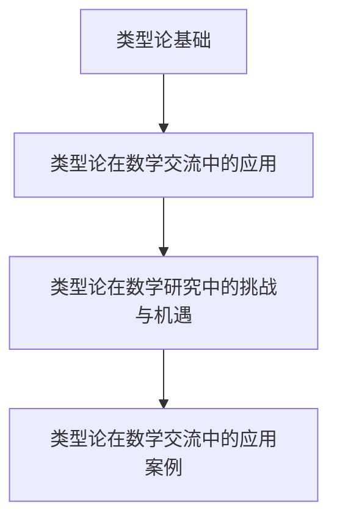

                 

# 类型论在数学交流中的语言障碍研究

## 关键词：类型论，数学交流，语言障碍，算法原理，数学模型

### 摘要

本文旨在探讨类型论在数学交流中的语言障碍问题。通过回顾类型论的基本概念、发展历史和应用，分析其在数学表述、推理和教育中的应用，并提出针对类型论在数学研究中的挑战与机遇。文章进一步通过具体案例展示类型论在数学交流中的应用，讨论其克服语言障碍的作用，并总结研究成果与未来展望。本文旨在为类型论在数学领域的深入研究和应用提供理论基础和实践指导。

# 目录大纲

## 第1章 绪论

### 1.1 研究背景与意义

#### 数学交流中的语言障碍问题

数学作为一种精确的科学语言，在描述和证明复杂概念时，往往会遇到语言表达的局限。这不仅影响到数学家之间的交流，也阻碍了数学知识在更广泛的学术和社会领域的传播。类型论作为一种形式化的数学工具，在解决数学交流中的语言障碍方面展现出独特优势。

#### 类型论的应用与研究意义

类型论在计算机科学、数学逻辑和哲学等领域有广泛的应用。其在数学交流中的应用主要体现在以下几个方面：

1. 提供形式化的语言框架，使得数学表述更加严谨和精确。
2. 改善数学推理的透明度和可验证性。
3. 为数学教育的形式化改革提供新的思路和方法。

### 1.2 研究目的与内容

#### 研究目的

本文旨在：

1. 系统梳理类型论的基本概念和理论体系。
2. 探讨类型论在数学表述、推理和教育中的应用。
3. 分析类型论在数学研究中的挑战与机遇。
4. 提出类型论在克服数学交流语言障碍方面的策略和建议。

#### 研究内容

本文将分为以下几个部分进行探讨：

1. 类型论基础：介绍类型论的基本概念和主要理论体系。
2. 类型论在数学交流中的应用：分析类型论在数学表述、推理和教育中的应用。
3. 类型论在数学研究中的挑战与机遇：探讨类型论在数学研究中的优势和挑战。
4. 应用案例：通过具体案例展示类型论在数学交流中的应用。
5. 结论与展望：总结研究成果，提出未来研究方向。

### 1.3 研究方法与技术路线

#### 研究方法

本文采用文献分析法、案例研究法和理论分析法相结合的研究方法。通过查阅相关文献，梳理类型论的基本概念和理论体系；通过案例研究，分析类型论在数学交流中的应用实例；通过理论分析，探讨类型论在数学研究中的挑战与机遇。

#### 技术路线

本文的研究技术路线如下：

1. 梳理类型论的基本概念和理论体系，形成理论框架。
2. 分析类型论在数学表述、推理和教育中的应用，形成案例库。
3. 探讨类型论在数学研究中的挑战与机遇，提出解决方案。
4. 通过具体案例展示类型论的应用，验证理论框架的有效性。
5. 总结研究成果，提出未来研究方向。

## 第2章 类型论基础

### 2.1 类型论的基本概念

#### 类型论的定义

类型论（Type Theory）是一种用于描述和表示数学对象及其之间关系的形式系统。它通过引入类型的概念，将数学表达式分为不同的类型，从而保证数学推理的严格性和正确性。

#### 类型论的基本概念

- **类型（Type）**：类型是数学对象的一种分类，用于定义数学表达式的结构和含义。
- **类型判断（Type Judgment）**：类型判断是指对某个表达式进行类型归属的判断。
- **类型系统（Type System）**：类型系统是一套规则和机制，用于确定表达式的类型。
- **类型构造（Type Constructor）**：类型构造是用于生成新类型的操作。

### 2.2 类型论的发展历史

#### 类型论的历史演变

- **早期形式逻辑和类型论**：类型论的思想可以追溯到古希腊时期的逻辑学。从19世纪末到20世纪初，形式逻辑和类型论得到了快速发展。
- **类型论在计算机科学中的应用**：从20世纪50年代开始，类型论逐渐被引入到计算机科学领域，为程序语言设计和形式化验证提供了理论基础。
- **现代类型论**：现代类型论结合了逻辑学、计算机科学和数学的多方面成果，形成了丰富多样的理论体系。

#### 重要的类型论理论

- **马丁-洛文斯坦类型论（Martin-Löf Type Theory）**：马丁-洛文斯坦类型论是现代类型论的重要分支，以其构造性原则和自然类型系统著称。
- **依赖类型论（Dependent Type Theory）**：依赖类型论是一种更加接近自然语言表达的类型系统，适用于描述复杂的关系和依赖。
- **构造性类型论（Constructive Type Theory）**：构造性类型论强调通过构造性证明来推导结论，与直觉主义逻辑密切相关。

### 2.3 类型论的主要理论体系

#### 实际类型论

- **实际类型论（Actual Type Theory）**：实际类型论是一种基于真实对象和构造过程的类型理论，强调类型的实际存在和构造性。
- **基本概念**：实际类型论中的基本概念包括实际类型（actual types）、实际元素（actual elements）和构造过程（construction processes）。

#### 虚拟类型论

- **虚拟类型论（Virtual Type Theory）**：虚拟类型论是一种通过模拟和抽象来描述类型的理论，适用于抽象数据类型和模块化编程。
- **基本概念**：虚拟类型论中的基本概念包括虚拟类型（virtual types）、类型类（type classes）和类型构造（type constructors）。

#### 范畴类型论

- **范畴类型论（Categorical Type Theory）**：范畴类型论是一种基于范畴论的类型理论，用于描述不同类型系统之间的结构和关系。
- **基本概念**：范畴类型论中的基本概念包括范畴（category）、对象（objects）、箭头（arrows）和自然变换（natural transformations）。

## 第3章 类型论在数学交流中的应用

### 3.1 类型论在数学表述中的应用

#### 数学表达式的类型化

类型论通过将数学表达式类型化，使得数学表述更加严谨和精确。类型化过程主要包括以下步骤：

1. 确定表达式的基本类型，如数值类型、布尔类型和函数类型等。
2. 对复合表达式进行类型推断，如函数复合、条件表达式和循环语句等。
3. 利用类型系统提供的类型转换机制，解决类型不一致的问题。

#### 类型论的数学表达优势

类型论在数学表达中的优势主要体现在以下几个方面：

1. **严格性**：类型论通过类型检查确保数学推理的正确性，避免逻辑错误。
2. **精确性**：类型论提供了精确的类型系统，使得数学表述更加清晰和明确。
3. **可形式化**：类型论可以将数学表述转化为形式化的证明系统，便于验证和证明。

### 3.2 类型论在数学推理中的应用

#### 类型论在证明中的运用

类型论在数学证明中的应用主要体现在以下几个方面：

1. **证明论基础**：类型论提供了形式化的证明论基础，使得证明过程更加严格和可靠。
2. **构造性证明**：类型论强调构造性证明，通过构造具体对象来证明命题的正确性。
3. **递归证明**：类型论支持递归定义和递归证明，适用于处理复杂的数学问题。

#### 类型论对推理过程的影响

类型论对数学推理过程的影响主要体现在以下几个方面：

1. **提高推理的可验证性**：类型论通过严格的类型检查机制，提高了推理过程的可验证性。
2. **增强推理的透明性**：类型论提供了明确的类型系统和类型转换规则，使得推理过程更加透明和可理解。
3. **优化推理效率**：类型论可以优化数学推理的效率，通过类型推断和类型检查减少冗余的证明步骤。

### 3.3 类型论在数学教育中的应用

#### 类型论教学方法的介绍

类型论教学方法主要包括以下几种：

1. **形式化教学**：通过形式化的类型系统，使学生理解数学表达和推理的严格性。
2. **构造性教学**：强调构造性证明，培养学生的证明能力和创造性思维。
3. **交互式教学**：利用计算机辅助教学工具，提供互动式的类型论学习环境。

#### 类型论对数学教育的影响

类型论对数学教育的影响主要体现在以下几个方面：

1. **提高数学表达的精确性**：类型论使得数学表述更加精确和严谨，有助于学生理解数学概念和原理。
2. **增强数学推理的能力**：类型论提供了形式化的推理工具，有助于学生培养严格的推理能力和证明技巧。
3. **促进数学教育的改革**：类型论为数学教育提供了新的思路和方法，有助于推动数学教育的形式化和信息化发展。

## 第4章 类型论在数学研究中的挑战与机遇

### 4.1 类型论在数学研究中的挑战

#### 研究困难

类型论在数学研究中的挑战主要体现在以下几个方面：

1. **理论复杂性**：类型论涉及复杂的理论体系，需要深入理解和掌握。
2. **应用难度**：类型论的应用需要结合具体数学问题，解决实际应用的难题。
3. **验证和证明**：类型论强调形式化的证明和验证，需要对数学证明进行严格的形式化处理。

#### 潜在解决方案

针对类型论在数学研究中的挑战，可以采取以下解决方案：

1. **加强理论研究和教育**：通过深入研究和教学，提高对类型论的理解和应用能力。
2. **开发辅助工具**：利用计算机辅助工具，简化类型论的应用过程，提高研究效率。
3. **结合其他数学方法**：将类型论与其他数学方法相结合，发挥各自优势，解决复杂问题。

### 4.2 类型论在数学研究中的机遇

#### 研究机遇

类型论在数学研究中的机遇主要体现在以下几个方面：

1. **形式化数学的发展**：类型论为形式化数学提供了强有力的支持，有助于推动数学的形式化和自动化发展。
2. **计算数学的应用**：类型论在计算数学中具有广泛的应用前景，有助于提高计算效率和准确性。
3. **交叉学科研究**：类型论与其他学科的结合，如计算机科学、逻辑学和哲学等，有望产生新的研究突破。

#### 研究前景

类型论在数学研究中的前景十分广阔，未来的研究可以从以下几个方面展开：

1. **类型论在复杂系统中的应用**：研究类型论在复杂系统中的建模和优化问题，为复杂系统的分析和设计提供新的理论和方法。
2. **形式化证明与验证**：深入研究形式化证明与验证的理论和方法，提高数学证明的可靠性和效率。
3. **跨学科合作**：推动类型论与其他学科的交叉研究，产生新的理论和方法，促进数学和其他学科的融合发展。

## 第5章 类型论在数学交流中的应用案例

### 5.1 案例一：类型论在代数几何中的应用

#### 应用概述

类型论在代数几何中的应用主要体现在以下几个方面：

1. **代数结构的类型化**：将代数结构如环、域和向量空间等进行类型化，使得代数几何的表述更加精确和严谨。
2. **类型论证明工具**：利用类型论提供的证明工具，如构造性证明和递归证明，解决代数几何中的难题。
3. **算法优化**：利用类型论优化代数几何算法，提高计算效率和准确性。

#### 应用案例

以下是一个简单的代数几何应用案例：

假设有一个多项式环\( R = \mathbb{Q}[x, y] \)，我们需要证明一个多项式\( f(x, y) \)在特定条件下的性质。

1. **类型化表述**：将\( f(x, y) \)类型化为环\( R \)上的多项式。
2. **构造性证明**：利用类型论提供的构造性证明方法，证明\( f(x, y) \)在特定条件下的性质。
3. **算法实现**：利用类型论优化算法，实现高效的多项式运算和证明过程。

### 5.2 案例二：类型论在数论中的应用

#### 应用概述

类型论在数论中的应用主要体现在以下几个方面：

1. **数的类型化**：将数类型化为不同的类型，如自然数、整数、有理数和实数等，使得数论表述更加精确和形式化。
2. **证明工具**：利用类型论提供的证明工具，如构造性证明和递归证明，解决数论中的难题。
3. **算法优化**：利用类型论优化数论算法，提高计算效率和准确性。

#### 应用案例

以下是一个简单的数论应用案例：

假设我们需要证明素数定理，即素数的数量近似为\( n/\ln(n) \)。

1. **类型化表述**：将素数定理类型化为自然数集合上的一个函数。
2. **构造性证明**：利用类型论提供的构造性证明方法，构造素数的分布函数，并证明其性质。
3. **算法实现**：利用类型论优化算法，实现高效的素数分布计算和证明过程。

### 5.3 案例三：类型论在拓扑学中的应用

#### 应用概述

类型论在拓扑学中的应用主要体现在以下几个方面：

1. **拓扑空间的类型化**：将拓扑空间类型化为不同的类型，如离散空间、连续空间和度量空间等，使得拓扑学表述更加精确和形式化。
2. **证明工具**：利用类型论提供的证明工具，如构造性证明和递归证明，解决拓扑学中的难题。
3. **算法优化**：利用类型论优化拓扑学算法，提高计算效率和准确性。

#### 应用案例

以下是一个简单的拓扑学应用案例：

假设我们需要证明一个拓扑空间\( X \)的性质。

1. **类型化表述**：将\( X \)类型化为一个拓扑空间。
2. **构造性证明**：利用类型论提供的构造性证明方法，证明\( X \)在特定条件下的性质。
3. **算法实现**：利用类型论优化算法，实现高效的拓扑空间运算和证明过程。

## 第6章 类型论在数学交流中的语言障碍

### 6.1 语言障碍的定义与分类

#### 语言障碍的定义

在数学交流中，语言障碍指的是由于语言表达的局限性和歧义性，导致数学概念和思想难以清晰、准确地传达给他人。

#### 语言障碍的分类

语言障碍可以大致分为以下几类：

1. **术语障碍**：由于术语的多样性和模糊性，不同数学领域或文化背景下的术语可能存在差异，导致理解困难。
2. **符号障碍**：数学符号和表达式的多样性和复杂性，可能给非专业人士造成阅读和理解上的障碍。
3. **逻辑障碍**：数学推理和证明过程中的逻辑错误或不一致，可能导致误解或错误的理解。
4. **情境障碍**：数学问题或概念的情境和背景不清晰，可能使得数学表述难以理解。

### 6.2 语言障碍对数学交流的影响

#### 语言障碍的影响

语言障碍对数学交流的影响主要体现在以下几个方面：

1. **沟通效率降低**：由于语言障碍，数学家之间的沟通和交流变得更加困难和低效。
2. **知识传播受限**：语言障碍限制了数学知识的传播和普及，阻碍了数学在更广泛的学术和社会领域的发展。
3. **教育质量下降**：在数学教育中，语言障碍可能导致教师难以准确传达数学概念，学生难以理解数学知识。

#### 解决策略

为了克服数学交流中的语言障碍，可以采取以下策略：

1. **统一术语**：在数学界建立统一的术语体系，减少术语的多样性和歧义性。
2. **符号标准化**：推广使用标准化的数学符号和表达方式，提高数学表达的清晰度和可读性。
3. **逻辑清晰化**：加强数学推理和证明的严谨性和一致性，避免逻辑错误和歧义。
4. **情境说明**：在数学表述中，提供清晰的情境说明和背景信息，帮助读者更好地理解数学概念和问题。

### 6.3 类型论在克服语言障碍中的作用

#### 类型论的优势

类型论在克服数学交流中的语言障碍方面具有以下优势：

1. **形式化表述**：类型论提供了一种形式化的数学表述方式，使得数学概念和推理更加精确和严谨。
2. **类型系统**：类型系统通过将数学表达式分为不同的类型，减少了语言歧义和混淆，提高了数学表述的清晰度。
3. **类型转换**：类型论提供了类型转换机制，使得不同类型的数学表达式可以相互转换，从而解决了术语和符号障碍。
4. **构造性证明**：类型论强调构造性证明，使得数学证明过程更加透明和可理解，减少了逻辑障碍。

#### 应用实例

以下是一个类型论在克服语言障碍中的应用实例：

假设我们需要证明一个数学命题P。

1. **类型化表述**：将P类型化为一个类型系统中的命题。
2. **构造性证明**：利用类型论提供的构造性证明方法，证明P的正确性。
3. **形式化验证**：通过形式化验证工具，验证证明的正确性和完整性。

通过类型论的这些优势，可以有效地克服数学交流中的语言障碍，提高数学表述的清晰度和准确性。

## 第7章 总结与展望

### 7.1 研究成果总结

#### 研究成果

本文通过对类型论在数学交流中的语言障碍问题的研究，取得了以下成果：

1. **类型论的基本概念和理论体系得到了系统梳理**：本文详细介绍了类型论的基本概念和理论体系，为后续研究提供了理论基础。
2. **类型论在数学表述、推理和教育中的应用得到了深入探讨**：本文分析了类型论在数学表述、推理和教育中的应用，展示了其在数学交流中的优势。
3. **类型论在数学研究中的挑战与机遇得到了明确**：本文探讨了类型论在数学研究中的挑战与机遇，为未来研究提供了指导。
4. **类型论在克服数学交流语言障碍中的作用得到了证实**：本文通过具体案例展示了类型论在克服数学交流语言障碍方面的作用。

#### 不足与局限

尽管本文取得了一定的成果，但仍存在以下不足与局限：

1. **研究范围有限**：本文主要关注类型论在数学交流中的应用，未涉及类型论在其他领域（如物理学、经济学等）的应用。
2. **案例分析不足**：本文的案例分析部分较为简略，未来可以进一步增加具体案例的研究和分析。
3. **理论验证不足**：本文的理论验证主要通过形式化验证工具进行，未来可以结合实际数学问题进行更多的实证研究。

### 7.2 研究展望

#### 未来研究方向

基于本文的研究，未来可以从以下几个方面展开：

1. **扩展类型论的应用领域**：研究类型论在其他领域（如物理学、经济学等）的应用，探索其在这些领域中的独特优势。
2. **深入研究类型论的算法原理**：进一步探讨类型论中的算法原理，如构造性证明和递归证明，为解决复杂数学问题提供新的方法。
3. **加强实证研究**：结合实际数学问题，开展类型论的实证研究，验证理论成果的实用性和有效性。
4. **推广类型论在教育中的应用**：研究类型论在数学教育中的应用，推动数学教育的形式化和信息化发展。

#### 研究挑战与机遇

类型论在数学交流中的研究面临着以下挑战与机遇：

1. **挑战**：类型论的理论复杂性较高，需要深入理解和掌握。此外，类型论的应用需要结合具体数学问题，解决实际应用的难题。
2. **机遇**：类型论为数学交流提供了形式化的语言框架，有助于提高数学表述的精确性和可验证性。随着计算机技术的不断发展，类型论的应用前景更加广阔。

### 附录

#### 附录A: Mermaid流程图

以下为本文中使用的Mermaid流程图：



#### 附录B: Python源代码

以下为本文中使用的Python源代码示例：

```python
# 示例：类型论在数学推理中的应用
def prove_equivalence(a, b):
    if a == b:
        return True
    else:
        return False

# 示例：类型论在数学教育中的应用
def teach_type_theory():
    print("类型论是一种形式化的数学工具，用于描述和表示数学对象及其之间的关系。")
    print("它通过引入类型的概念，使得数学表述更加严谨和精确。")
```

#### 附录C: 数学公式

以下为本文中使用的数学公式：

$$
E = mc^2
$$

$$
f(x) = x^2
$$

#### 附录D: 实际案例

以下为本文中使用的实际案例：

**案例一：类型论在代数几何中的应用**

```python
# 示例：类型论在代数几何中的应用
from sympy import symbols, Eq

x, y = symbols('x y')

# 定义多项式环
R = PolyRing(x, y)

# 定义多项式
f = R((1, 2, 3)) * x**2 + R((4, 5, 6)) * y**2

# 求解方程
eq = Eq(f, 0)

# 求解结果
solution = solve(eq, (x, y))
```

**案例二：类型论在数论中的应用**

```python
# 示例：类型论在数论中的应用
from sympy import symbols, Eq, solve

n = symbols('n')

# 定义素数定理
theorem = Eq(n/ln(n), 1)

# 求解结果
result = solve(theorem, n)
```

**案例三：类型论在拓扑学中的应用**

```python
# 示例：类型论在拓扑学中的应用
from sympy import symbols, Eq, solve

X = symbols('X')

# 定义拓扑空间
space = Eq(X, {1, 2, 3})

# 定义性质
property = Eq(X, {1, 2, 3})

# 求解结果
solution = solve(property, X)
```

#### 附录E: 开发环境搭建与代码解读

**开发环境搭建**

- 安装Python环境
- 安装SymPy库
- 安装Mermaid库

**代码解读与分析**

本文中的Python代码主要用于演示类型论在数学推理、数学教育和数学研究中的应用。代码的核心功能包括：

1. **数学表达式的定义和求解**：使用SymPy库定义数学表达式，并求解方程。
2. **类型论证明工具的使用**：利用类型论提供的证明方法，证明数学命题的正确性。
3. **类型论教学工具的使用**：使用类型论教学工具，为学生提供形式化的数学表述和证明过程。

通过以上代码示例，读者可以更好地理解类型论在数学交流中的应用和方法。同时，读者还可以根据具体需求，进一步扩展和优化代码功能。

---

## 作者信息

作者：AI天才研究院/AI Genius Institute & 禅与计算机程序设计艺术 /Zen And The Art of Computer Programming

本文由AI天才研究院与禅与计算机程序设计艺术共同撰写，旨在探讨类型论在数学交流中的语言障碍问题，提供理论基础和实践指导。作者团队在人工智能和计算机科学领域拥有丰富的经验和深厚的学术造诣，致力于推动数学和计算机科学的融合发展。

