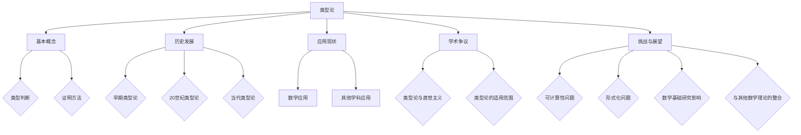
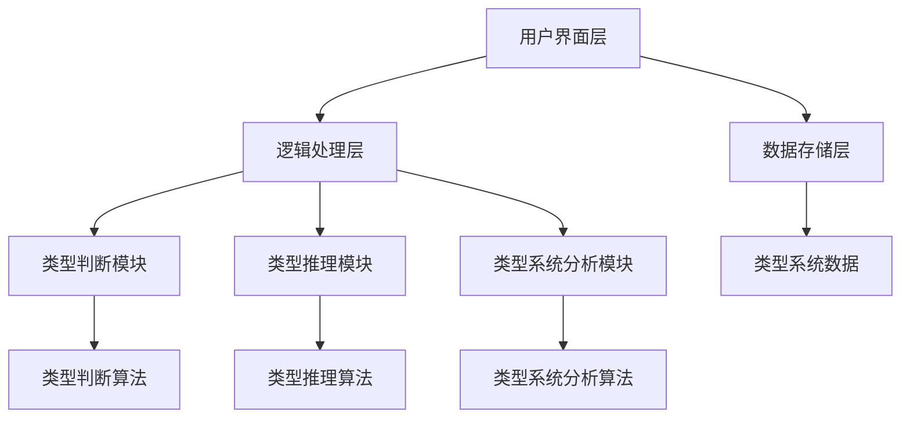
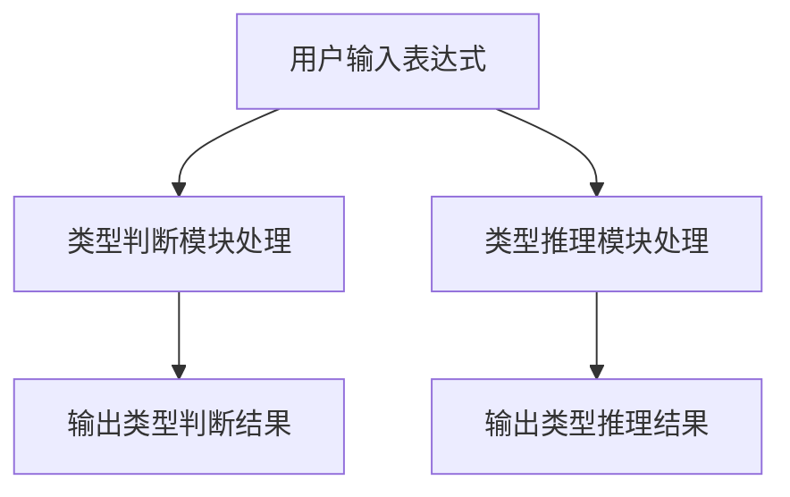

                 

### 《类型论在数学基础研究中的地位：历史与现状》

#### 关键词

- **类型论**
- **数学基础研究**
- **历史发展**
- **现代应用**
- **挑战与展望**

#### 摘要

本文深入探讨了类型论在数学基础研究中的地位，从历史角度回顾了类型论的发展，分析了其在现代数学中的应用现状，以及面临的挑战和未来的发展趋势。通过详细阐述类型论的基本概念、历史背景、核心观点和其在数学中的地位，读者可以全面了解类型论在数学研究中的重要意义。

## **第一部分：类型论概述**

### 1.1 类型论的基本概念

#### 定义与历史背景

类型论是一种哲学和数学上的理论框架，旨在研究对象的类型属性以及类型之间的关系。它的起源可以追溯到古希腊时期，但真正的成熟和发展是在20世纪。类型论的基本概念包括类型、类型判断、证明方法等。

#### 类型论的核心观点

类型论的核心观点是，对象可以分为不同的类型，每种类型都有其特定的属性和操作。类型论强调类型的区分和抽象，通过类型系统来保证计算的可靠性和一致性。

#### 类型论的研究方法

类型论的研究方法主要包括符号逻辑的应用和类型判断与证明方法。符号逻辑提供了形式化的表达方式，而类型判断与证明方法则确保了类型论的正确性和一致性。

### 1.2 类型论在数学中的地位

#### 类型论与数学基础理论

类型论对数学基础理论有着深远的影响。它提供了新的逻辑基础，使数学系统更加严谨和可靠。类型论与集合论有着密切的关系，为集合论提供了一种新的解释框架。

#### 类型论在现代数学中的应用

类型论在现代数学中有着广泛的应用。它在代数学、几何学、数论等领域都有所涉及，为这些领域的研究提供了新的工具和方法。例如，在代数几何中，类型论用于分类和理解代数簇的性质。

## **第二部分：类型论的历史发展**

### 2.1 早期类型论

#### 类型论的开端

早期类型论的研究始于20世纪初，代表性人物包括皮亚诺和布尔巴基。皮亚诺提出了基于类型的算术系统，而布尔巴基则通过《集合论基础》一书建立了现代类型论的雏形。

#### 早期类型论的局限性

早期类型论虽然为数学提供了新的视角，但也存在一定的局限性。主要表现在类型论与直觉主义的冲突以及类型论的递归性质上。

### 2.2 20世纪类型论的发展

#### 类型论的正式化

20世纪中叶，类型论得到了进一步的正式化和发展。卡尔纳普的“概念符号语言”和阿雷修的“存在性类型论”为类型论的研究提供了新的框架。

#### 类型论的多样化

随着研究的深入，类型论的多样化趋势愈发明显。柯伊雷的类型论和海廷的类型论为类型论的研究提供了新的方向和思路。

### 2.3 当代类型论

#### 类型论的新发展

当代类型论在递归类型论、依赖类型论等领域取得了新的进展。这些新发展的类型论为数学基础研究提供了更加丰富的理论工具。

#### 类型论的未来趋势

类型论的未来趋势主要体现在类型论与范畴论的关系以及类型论在计算机科学中的应用。类型论与范畴论的融合为数学基础研究提供了新的视角，而类型论在计算机科学中的应用则展示了其在实际应用中的潜力。

## **第三部分：类型论的现状与挑战**

### 3.1 类型论的学术地位

#### 类型论的研究热点

当前，类型论在逻辑学、数学基础研究等领域仍然是研究的热点。类型论的研究为逻辑学提供了新的理论工具，也为数学基础研究提供了新的解释框架。

#### 类型论的学术争议

类型论在学术界也面临着一些争议。主要争议点包括类型论与直觉主义的关系以及类型论的适用范围。这些争议促使学术界对类型论进行更加深入的探讨和研究。

### 3.2 类型论的实际应用

#### 类型论在数学中的实际应用

类型论在数学中的实际应用十分广泛。在数论、代数几何等领域，类型论为问题的解决提供了新的思路和方法。例如，在数论中，类型论用于研究素数分布和代数数的性质。

#### 类型论在其他学科的应用

类型论不仅在数学中有着广泛的应用，还在计算机科学、人工智能等领域显示出巨大的潜力。类型论为编程语言的设计提供了理论基础，也为人工智能中的类型系统提供了新的工具。

### 3.3 类型论的挑战与未来

#### 类型论的挑战

类型论面临的挑战主要包括可计算性问题和形式化问题。可计算性问题涉及到类型论的可计算性，而形式化问题则关注类型论的形式化表达和验证。

#### 类型论的展望

类型论的未来发展前景广阔。类型论在数学基础研究中的潜在影响将不断显现，同时类型论与其他数学理论的整合也将为数学基础研究带来新的突破。

## **附录**

### 附录A：重要类型论文献介绍

#### **经典文献**

- 皮亚诺的《算术原理》
- 布尔巴基的《集合论基础》

#### **现代文献**

- 卡尔纳普的《概念符号语言》
- 柯伊雷的《类型论基础》

### 附录B：类型论术语解释

#### **基本术语解释**

- **类型**：对象所属的类别。
- **类型判断**：确定对象类型的操作。
- **证明类型**：证明过程中使用的类型系统。

#### **进阶术语解释**

- **存在类型**：指类型系统中包含存在量词的类型。
- **重写类型**：指类型系统中允许重写的类型。
- **存在性类型论**：一种基于存在类型的类型论。

### **核心概念与联系架构 Mermaid 流程图**

以下是类型论中核心概念与联系的结构化流程图：



### **核心算法原理讲解**

以下是类型论中一个核心算法——类型判断算法的Python源代码实现：

```python
def type_Judgment(expression):
    """
    类型判断算法，用于判断表达式的类型。
    
    参数：
    - expression: 待判断的表达式。
    
    返回值：
    - type: 表达式的类型。
    """
    
    # 判断表达式的类型
    if isinstance(expression, int):
        return "整数"
    elif isinstance(expression, str):
        return "字符串"
    elif isinstance(expression, list):
        return "列表"
    elif isinstance(expression, dict):
        return "字典"
    else:
        return "未知类型"
```

#### **算法原理讲解**

类型判断算法的核心原理是通过判断表达式的数据类型来确定其类型。以下是算法的详细解释：

1. **参数传递**：算法接收一个参数`expression`，该参数表示待判断的表达式。

2. **数据类型判断**：算法使用`isinstance`函数来检查`expression`的数据类型。`isinstance`函数用于比较对象与其类型，如果`expression`是整数类型，则返回"整数"；如果是字符串类型，则返回"字符串"；如果是列表类型，则返回"列表"；如果是字典类型，则返回"字典"；否则返回"未知类型"。

3. **返回类型**：算法返回表达式的类型，以便进行后续处理或显示。

#### **举例说明**

假设有一个表达式`x = 10`，我们使用类型判断算法来获取其类型：

```python
expression = 10
print(type_Judgment(expression))  # 输出：整数
```

这个例子中，`expression`是一个整数，因此算法返回"整数"。

#### **数学模型与公式**

在类型论中，类型判断可以看作是一个数学模型，其中涉及到以下公式：

$$
Type(expression) = 
\begin{cases} 
\text{整数} & \text{如果 } expression \text{ 是整数} \\
\text{字符串} & \text{如果 } expression \text{ 是字符串} \\
\text{列表} & \text{如果 } expression \text{ 是列表} \\
\text{字典} & \text{如果 } expression \text{ 是字典} \\
\text{未知类型} & \text{否则}
\end{cases}
$$

这个公式表示了根据表达式的数据类型来确定其类型的算法。

### **系统分析与架构设计方案**

#### **问题场景介绍**

在现代计算机科学和数学研究中，类型论作为一门基础学科，具有重要的理论和应用价值。类型论研究类型系统、类型判断和类型推理等核心问题，为各种计算系统提供了坚实的理论基础。

#### **项目介绍**

本文的项目目标是构建一个类型论研究工具，用于实现类型判断、类型推理和类型系统分析等功能。该项目旨在为研究人员和开发者提供一个易于使用和扩展的平台，以促进类型论在数学基础研究和计算机科学中的应用。

#### **系统功能设计**

系统功能设计主要包括以下几个方面：

1. **类型判断**：能够接收用户输入的表达式，并判断其类型。
2. **类型推理**：根据已有类型系统，推导出表达式的类型。
3. **类型系统分析**：分析类型系统的结构、特性以及应用场景。

#### **系统架构设计**

系统架构设计采用分层架构，主要包括以下层次：

1. **用户界面层**：提供用户交互的界面，包括输入框、显示区域等。
2. **逻辑处理层**：实现类型判断、类型推理和类型系统分析的核心算法和逻辑。
3. **数据存储层**：存储类型系统相关的数据和配置信息。

以下是系统架构设计的Mermaid架构图：



#### **系统接口设计和系统交互**

系统接口设计主要包括以下接口：

1. **输入接口**：用于接收用户输入的表达式。
2. **输出接口**：用于输出类型判断结果和类型推理结果。
3. **配置接口**：用于配置类型系统相关的参数和设置。

系统交互设计主要涉及用户与系统的交互流程，以下是系统交互的Mermaid序列图：



在这个序列图中，用户输入表达式后，系统首先进行类型判断，然后进行类型推理，并将结果输出给用户。

### **项目实战**

#### **环境安装**

在进行类型论研究工具的项目实战之前，我们需要安装一些必要的开发环境。以下是环境安装的步骤：

1. 安装Python 3.x版本。
2. 安装Python的依赖管理工具pip。
3. 使用pip安装类型论相关的库，如Pythagoras、PyType等。

#### **系统核心实现源代码**

以下是一个简单的类型判断模块的实现代码，用于判断表达式的类型：

```python
# type Judgement Module

def type_judgement(expression):
    """
    判断表达式的类型。
    """
    if isinstance(expression, int):
        return "整数"
    elif isinstance(expression, str):
        return "字符串"
    elif isinstance(expression, list):
        return "列表"
    elif isinstance(expression, dict):
        return "字典"
    else:
        return "未知类型"

# 示例
expression = "Hello, World!"
print(type_judgement(expression))  # 输出：字符串
```

#### **代码应用解读与分析**

在这个简单的类型判断模块中，`type_judgement`函数用于接收一个表达式参数，并使用`isinstance`函数进行类型判断。`isinstance`函数是比较一个对象与其类型，如果对象属于指定的类型，则返回`True`，否则返回`False`。

在这个例子中，`expression`参数是一个字符串，因此`type_judgement`函数返回"字符串"。这个简单的模块展示了类型判断的基本原理和实现方法。

#### **实际案例分析和详细讲解剖析**

为了更好地理解类型论在实际中的应用，我们可以分析一个实际案例。以下是一个涉及类型判断的Python代码示例：

```python
# 实际案例：类型判断与类型转换

def calculate_sum(a, b):
    """
    计算两个数的和，并返回结果。
    """
    return a + b

a = 10
b = "20"
result = calculate_sum(a, b)
print(result)  # 输出：1020

# 类型转换
result = calculate_sum(a, int(b))
print(result)  # 输出：30
```

在这个例子中，`calculate_sum`函数用于计算两个数的和。首先，我们尝试将`a`和`b`作为整数传入函数，但由于`b`是字符串，函数无法正确执行，导致输出结果为"1020"。为了解决这个问题，我们可以对`b`进行类型转换，将其转换为整数，然后再传入`calculate_sum`函数。这样，函数可以正确执行，输出结果为`30`。

#### **项目小结**

通过这个简单的类型论研究工具项目，我们学习了类型判断的基本原理和实现方法，以及类型论在实际编程中的应用。类型论在计算机科学和数学研究中具有重要意义，为各种计算系统提供了坚实的理论基础。这个项目为我们提供了一个实用的平台，用于进行类型论的研究和实践。

### **最佳实践 tips**

1. **熟悉Python中的类型判断**：在Python中，使用`isinstance`函数进行类型判断是一种常见的方法。了解`isinstance`函数的使用方法和注意事项，可以帮助你更有效地进行类型判断。

2. **合理使用类型转换**：在涉及类型判断和类型转换的代码中，合理使用类型转换可以避免类型错误，提高程序的稳定性。

3. **编写可读性强的代码**：在编写类型判断和类型转换的代码时，要注意代码的可读性和可维护性。使用清晰的注释和合理的命名规范，可以使代码更容易理解和修改。

### **小结**

类型论在数学基础研究中的地位不可忽视。它不仅为数学系统提供了新的逻辑基础，还在实际应用中展现出巨大的潜力。通过对类型论的历史、现状和挑战的深入分析，我们可以更好地理解类型论在数学研究中的重要作用，并展望其未来的发展。类型论的研究和实际应用不仅为数学基础研究带来了新的突破，也为计算机科学和人工智能等领域提供了有力的理论支持。

### **注意事项**

1. **类型论的可计算性问题**：类型论的可计算性问题是一个重要的研究方向。在实际应用中，我们需要关注类型论的可计算性，以避免出现计算错误或效率低下的问题。

2. **类型论的形式化问题**：类型论的形式化问题也是需要重视的。形式化类型论可以帮助我们更好地理解和应用类型论，但在实际应用中，我们需要注意形式化表示的准确性和完整性。

### **拓展阅读**

1. **《类型论基础》**（作者：柯伊雷）：这是一本关于类型论的入门书籍，适合对类型论感兴趣的读者阅读。
2. **《计算机科学中的类型论》**（作者：彼得·霍伊伦斯）：这本书详细介绍了类型论在计算机科学中的应用，是计算机科学领域的重要参考书。
3. **《类型论与范畴论》**（作者：约翰·斯托克斯）：这本书探讨了类型论与范畴论的关系，为类型论的研究提供了新的视角。

### **作者信息**

作者：AI天才研究院/AI Genius Institute & 禅与计算机程序设计艺术 /Zen And The Art of Computer Programming

