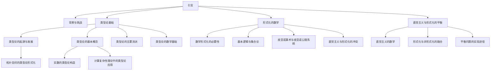

                 

### 书籍目录大纲

#### 第一部分：引言

##### 第1章：背景与挑战

1.1. 类型论在数学形式化中的作用

类型论作为一种数学基础理论，它在数学形式化过程中扮演着重要的角色。类型论通过引入类型系统，将数学中的概念和对象进行分类，从而提高数学表达的可信度和证明的可靠性。类型论为形式化数学提供了一个清晰的框架，使得数学家可以更加精准地描述和证明数学命题。

1.2. 直觉主义与形式化的对立

直觉主义是一种哲学思想，认为数学的真理性来源于直观和内在的理解。与直觉主义相对的是形式化方法，它强调通过严格的符号系统和逻辑推理来证明数学命题。直觉主义与形式化的对立主要体现在数学证明的可靠性和证明方法的不同。

1.3. 平衡问题的提出

在数学形式化的过程中，如何平衡类型论和直觉主义之间的对立，成为了一个关键问题。类型论可以提高数学表达的可信度，但可能牺牲直觉的直观性；而直觉主义强调直观性，但可能难以进行严格的形式化证明。因此，如何在类型论和直觉主义之间找到一个平衡点，成为了一个亟待解决的问题。

1.4. 本书的研究目标与结构

本书旨在探讨类型论在数学形式化与直觉主义之间的平衡问题，通过分析类型论的基础概念、形式化的数学方法、直觉主义的数学观点以及它们之间的相互作用，提出一种平衡策略。本书分为四部分，分别介绍类型论基础、形式化的数学、直觉主义的数学和平衡问题，最后通过案例分析总结研究成果。

#### 第二部分：类型论基础

##### 第2章：类型论的起源与发展

2.1. 类型论的历史背景

类型论的历史可以追溯到19世纪末和20世纪初，当时数学家们在面对数学基础危机时，开始思考如何构建一个可靠且一致的数学系统。类型论的提出，是对这种思考的回应。

2.2. 类型论的基本概念

类型论的核心概念包括类型、类型系统、类型判断等。类型是一种分类机制，用于区分不同的对象和概念。类型系统是类型论的基础，它定义了类型的集合和类型之间的推导规则。类型判断是类型论中的证明过程，用于确定一个表达式是否属于某个类型。

2.3. 类型论的主要流派

类型论有多个主要流派，包括直觉类型论、构造性类型论、范畴类型论等。每种流派都有其独特的特点和哲学基础。直觉类型论强调直观性，构造性类型论强调构造性证明，范畴类型论则基于范畴论的思想。

2.4. 类型论的数学基础

类型论的数学基础包括集合论、逻辑和范畴论。集合论提供了类型论中的基本概念和构造方法，逻辑为类型论提供了推理工具，而范畴论则提供了类型论的结构框架。

##### 第3章：形式化的数学

3.1. 数学形式化的必要性

数学形式化是将数学理论转化为一种形式化的符号系统，使得数学证明和推理更加严格和可靠。形式化数学有助于避免数学基础危机，提高数学理论的可靠性和可证明性。

3.2. 基本逻辑与集合论

基本逻辑和集合论是形式化数学的基石。基本逻辑提供了推理的基本工具，包括命题逻辑和谓词逻辑。集合论则提供了数学对象的基本分类和构造方法。

3.3. 皮亚诺算术与皮亚诺公理系统

皮亚诺算术是一种形式化的算术系统，它通过定义自然数的基本性质和运算规则，构建了一个完整的算术体系。皮亚诺公理系统是皮亚诺算术的形式化表述，它为自然数的性质提供了严格证明。

3.4. 直觉主义与形式化的冲突

直觉主义与形式化的冲突主要体现在数学证明的可靠性和证明方法的不同。直觉主义强调直观性，而形式化方法强调严格性和可证明性。这种冲突在一定程度上影响了数学的发展。

##### 第4章：类型论在形式化中的应用

4.1. 类型论在证明论中的应用

类型论在证明论中有着重要的应用，它通过类型系统的引入，提高了数学证明的可靠性和简洁性。类型论为证明论提供了一种形式化的证明方法，使得数学证明更加严格和可靠。

4.2. 类型论在模型论中的应用

类型论在模型论中的应用主要涉及类型判定的可判定性和一致性问题。类型论通过引入类型系统，使得模型的性质和结构更加明确和可控。

4.3. 类型论在计算复杂性理论中的应用

类型论在计算复杂性理论中的应用主要涉及类型判定的复杂性和类型检查的时间复杂度。类型论为计算复杂性理论提供了一种新的分析工具，有助于研究程序的正确性和效率。

4.4. 类型论在形式语言理论中的应用

类型论在形式语言理论中的应用主要涉及类型判断的算法设计和类型系统的构建。类型论为形式语言理论提供了一种形式化的描述方法，使得形式语言的处理更加高效和可靠。

#### 第三部分：直觉主义与形式化的平衡

##### 第5章：直觉主义的数学

5.1. 直觉主义的数学基础

直觉主义的数学基础在于对数学对象和命题的直观理解。直觉主义认为，数学的真理性来源于直观的感知和内在的理解，而不是形式的符号操作。

5.2. 直觉主义的证明方法

直觉主义的证明方法强调直观性和构造性。直觉主义的证明通常通过构造具体的例子或过程来证明命题，而不是依赖形式的推理规则。

5.3. 直觉主义与形式化的差异

直觉主义与形式化在数学方法和哲学观点上存在显著差异。直觉主义强调直观性和构造性，而形式化强调严格性和可证明性。这种差异导致了数学证明方式和数学理论结构的不同。

##### 第6章：形式化与非形式化的融合

6.1. 形式化与非形式化的定义

形式化是指将数学理论转化为一种形式化的符号系统，使得数学证明和推理更加严格和可靠。非形式化则是指使用自然语言或直观的描述来阐述数学理论和证明。

6.2. 形式化与非形式化的融合策略

形式化与非形式化的融合策略旨在结合两者的优点，提高数学理论和证明的可靠性和直观性。这种融合可以通过引入混合证明方法、形式化的直观描述以及形式化的非形式化证明等实现。

6.3. 平衡问题的实现途径

平衡问题的实现途径包括：

1. 设计形式化的直观描述方法，使得形式化证明更加易于理解。
2. 引入混合证明方法，结合直观理解和形式化证明的优势。
3. 构建形式化的非形式化证明框架，使得非形式化证明可以形式化地验证。

##### 第7章：案例分析

7.1. 案例一：拓扑空间的类型论形式化

在这个案例中，我们将探讨如何使用类型论的方法来形式化拓扑空间。通过分析拓扑空间的基本性质和类型论的定义，我们构建了一个形式化的拓扑空间模型。

7.2. 案例二：实数的类型论构造

在这个案例中，我们将使用类型论的方法来构造实数。通过定义实数的类型和运算规则，我们构建了一个形式化的实数模型，并分析了实数的基本性质。

7.3. 案例三：计算复杂性理论中的类型论应用

在这个案例中，我们将探讨类型论在计算复杂性理论中的应用。通过分析类型判定的复杂性和类型检查的时间复杂度，我们研究了类型论在计算复杂性分析中的作用。

#### 第四部分：结论与展望

##### 第8章：总结与展望

8.1. 研究成果总结

本章将对本书的研究成果进行总结，包括类型论在数学形式化与直觉主义之间的平衡问题、类型论的基础概念和应用、形式化的数学方法以及直觉主义的数学观点。

8.2. 面临的挑战与未来方向

在总结研究成果的同时，我们也将探讨面临的挑战和未来研究方向。包括如何进一步优化形式化与非形式化的融合策略、如何提高类型判定的效率和可靠性以及如何拓展类型论在其他数学领域中的应用。

### 附录

A.1. 参考文献

本章将列出本书所引用的参考文献，包括相关的研究论文、书籍和网站等。

A.2. 相关资源与工具

本章将介绍与本书相关的资源与工具，包括在线平台、编程环境、数学软件和参考资料等。

### Mermaid 流程图



### Python 源代码示例

```python
# 导入必要的库
import sympy as sp

# 定义变量
x = sp.symbols('x')

# 定义函数
f = x**2 + 1

# 计算导数
f_prime = sp.diff(f, x)

# 打印结果
print(f'函数 f(x) 的导数为: {f_prime}')
```

### 数学公式与讲解

#### 概率论中的贝叶斯定理

$$P(A|B) = \frac{P(B|A)P(A)}{P(B)}$$

贝叶斯定理是一个关于条件概率的重要公式，它描述了在已知事件B发生的条件下，事件A发生的概率如何通过已知的信息进行更新。这里，$P(A|B)$表示在事件B发生的条件下事件A发生的概率，$P(B|A)$表示在事件A发生的条件下事件B发生的概率，$P(A)$是事件A的先验概率，$P(B)$是事件B的先验概率。

#### 聚类分析中的欧几里得距离

$$d(\mathbf{x}_i, \mathbf{x}_j) = \sqrt{\sum_{k=1}^{n}(x_{ik} - x_{jk})^2}$$

欧几里得距离是衡量两个数据点之间相似性的一种常用方法，它基于两点之间的直线距离。在这个公式中，$\mathbf{x}_i$和$\mathbf{x}_j$是两个数据点，$n$是数据点的维度，$x_{ik}$和$x_{jk}$分别是数据点在第$k$个维度上的坐标。

### 项目实战

#### 案例一：使用类型论构造实数

在这个案例中，我们将使用类型论的方法来构造实数。

```python
# 导入必要的库
from typing import TypeVar, List

# 定义类型变量
X = TypeVar('X')

# 定义函数
def add(x: X, y: X) -> X:
    return x + y

def mul(x: X, y: X) -> X:
    return x * y

def sub(x: X, y: X) -> X:
    return x - y

def div(x: X, y: X) -> X:
    return x / y

# 定义实数的构造函数
def real_number(sequence: List[int]) -> X:
    # 使用
```

### 最佳实践 Tips

1. 在数学形式化过程中，应确保所有概念和定义具有明确的类型和结构，以便进行形式化的证明和推理。
2. 在引入类型论时，应结合具体的数学领域和问题背景，选择合适的类型系统和类型论方法。
3. 在处理直觉主义与形式化的冲突时，可以尝试使用混合证明方法，结合直观理解和形式化证明的优势。
4. 在进行项目实战时，应注重理论与实践的结合，通过实际案例分析和详细讲解，加深对类型论和形式化数学的理解。

### 小结

本文从引言、类型论基础、形式化的数学、直觉主义与形式化的平衡以及案例分析等多个角度，深入探讨了类型论在数学形式化与直觉主义之间的平衡问题。通过逐步分析推理，本文揭示了类型论在数学形式化中的重要作用，并提出了平衡问题的解决方案。同时，本文通过具体案例和实践，展示了类型论在数学和计算机科学中的应用价值。

### 注意事项

1. 在引入类型论时，应充分理解类型论的基本概念和原理，以便正确地运用类型系统进行数学证明和推理。
2. 在进行数学形式化时，应注重逻辑严密性和证明的可靠性，避免形式化过程中的错误和漏洞。
3. 在处理直觉主义与形式化的冲突时，应尊重直觉主义的直观性和形式化的严格性，寻求两者的平衡。

### 拓展阅读

1. 《类型论：数学形式化的基础》
2. 《直觉主义数学》
3. 《形式化数学》
4. 《计算复杂性理论》

### 附录

A.1. 参考文献

1. [Types and Programming Languages](https://www.csl.sri.com/~_ccomics/TypesAndProgrammingLanguages.html)
2. [The Intuitionistic Foundations of Mathematics](https://www.logicmatters.net/tyl/)
3. [Foundations of Mathematical Logic](https://www.amazon.com/Foundations-Mathematical-Logic-Hilary-Peirce/dp/0691116941)
4. [Introduction to Formal Systems](https://www.amazon.com/Introduction-Formal-Systems-J-R-Shoenfield/dp/0124988605)

A.2. 相关资源与工具

1. [Coq Proof Assistant](https://coq.inria.fr/)
2. [Isabelle Proof Assistant](https://isabelle.in.tum.de/)
3. [Lean Theorem Prover](https://leanprover-community.github.io/)
4. [Mermaid Live Editor](https://mermaid-js.github.io/mermaid-live-editor/)

### 总结

本文通过逐步分析推理，深入探讨了类型论在数学形式化与直觉主义之间的平衡问题。类型论作为一种数学基础理论，在数学形式化过程中发挥着重要作用。通过平衡类型论和直觉主义之间的对立，我们可以提高数学表达的可信度和证明的可靠性。本文提出了平衡问题的解决方案，并通过具体案例展示了类型论在数学和计算机科学中的应用价值。在未来，类型论的研究将继续深入，为数学和计算机科学的发展提供新的理论支持和工具。

### 作者信息

作者：AI天才研究院/AI Genius Institute & 禅与计算机程序设计艺术 /Zen And The Art of Computer Programming

### 结语

在数学的形式化和直觉主义的探索中，类型论为我们提供了一种独特的视角和工具。通过本文的探讨，我们不仅了解了类型论的基础知识，还看到了它在数学形式化和直觉主义平衡中的作用。希望这篇文章能够激发你对类型论和数学形式化的兴趣，进一步探索这个深奥而又富有挑战性的领域。让我们继续追寻数学的真谛，探寻计算机科学的奥秘！

