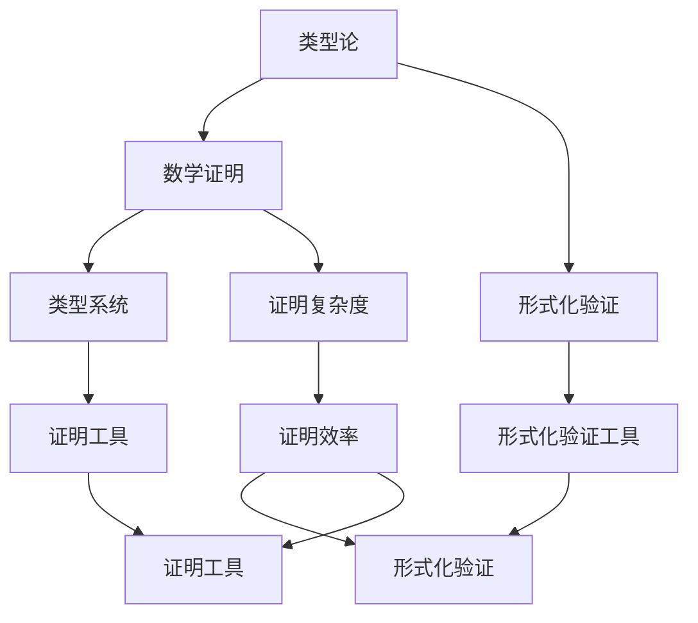

                 


### 第1章 引言与概述

#### 1.1 书籍背景

在现代数学研究和计算机科学中，类型论（Type Theory）作为一种重要的理论基础，已经被广泛应用于程序设计、形式化验证、逻辑推理以及数学证明等领域。类型论起源于20世纪30年代，由数学家类型论家Alonzo Church提出，其初衷是为了解决逻辑和数学基础问题，特别是形式系统的一致性和完全性问题。随着计算机科学的迅速发展，类型论逐渐被引入到编程语言的设计中，成为现代编程语言和编程范式的重要理论支撑。

本书旨在探讨类型论在数学证明中的效率问题。通过对类型论的基本概念、发展历程、数学基础以及主要类型系统的介绍，结合数学证明的基本概念、证明复杂度分析和难点，探讨类型论在数学证明中的应用及其对证明效率的影响。此外，本书还将通过实例分析，具体展示类型论在数学证明中的实际应用，并对其未来的发展趋势进行展望。

#### 1.2 研究目的

本研究的主要目的是通过分析类型论在数学证明中的效率问题，揭示类型论对数学证明复杂度的影响，以及类型论在提高数学证明效率方面的优势和不足。具体目标包括：

1. 梳理类型论的基本概念和发展历程，为其在数学证明中的应用提供理论基础。
2. 探讨类型论在数学证明中的潜在应用，分析其如何影响证明的复杂度和效率。
3. 通过实例分析，展示类型论在数学证明中的实际应用，并总结其实际效果。
4. 分析类型论在数学证明中的效率优势及其局限性，提出改进方向和建议。

#### 1.3 类型论的基本概念

类型论是一种用于描述和分类数据及其操作的形式系统，它通过定义类型系统来保证程序的正确性和一致性。类型论的基本概念包括：

- **类型（Type）**：类型是数据的一种分类，用于定义数据的不同种类。
- **类型系统（Type System）**：类型系统是一组规则和定义，用于确定程序中变量和表达式的类型，以及如何操作这些类型。
- **类型检查（Type Checking）**：类型检查是在编译或运行程序之前，通过类型系统来检查程序中变量和表达式的类型是否一致。
- **类型推断（Type Inference）**：类型推断是类型系统的一种机制，用于自动确定变量和表达式的类型，而无需显式指定。

类型论的发展历程可以从以下几个方面进行概述：

- **基本类型论**：由Alonzo Church在20世纪30年代提出，主要研究命题演算和谓词演算的类型系统，奠定了现代类型论的基础。
- **构造性类型论**：随着直觉主义逻辑的发展，Brouwer提出构造性数学，推动了构造性类型论的发展。
- **依赖类型论**：依赖类型论强调类型之间的依赖关系，通过依赖关系来提高程序的正确性和可理解性。
- **效应类型论**：效应类型论引入了副作用和状态的概念，用于描述程序中的非纯计算。

#### 1.4 数学证明中的效率问题

数学证明是数学研究的基础，其效率直接影响到数学研究的进展。在数学证明中，效率问题主要包括：

- **证明复杂度**：证明复杂度是衡量证明所需步骤的量度，包括线性复杂度、对数复杂度等。
- **证明难度**：某些数学问题的证明可能非常复杂，需要大量的计算和推理。
- **证明验证**：证明的验证也是一个重要问题，需要确保证明的正确性和完整性。

类型论在数学证明中的应用可以有效地解决这些效率问题，通过引入类型系统来确保证明的一致性和完整性，从而提高证明的效率。类型论提供了一种形式化的证明方法，使得数学证明可以更加严谨和自动化。

总的来说，类型论在数学证明中的效率问题是一个重要且具有挑战性的研究领域，其研究成果将对数学和计算机科学的发展产生深远的影响。

---

### 核心概念与联系

#### 1. 类型论

类型论是一种用于描述和分类数据及其操作的形式系统，其核心概念包括：

- **类型（Type）**：数据的一种分类，用于定义数据的不同种类。
- **类型系统（Type System）**：一组规则和定义，用于确定程序中变量和表达式的类型，以及如何操作这些类型。
- **类型检查（Type Checking）**：在编译或运行程序之前，通过类型系统来检查程序中变量和表达式的类型是否一致。
- **类型推断（Type Inference）**：自动确定变量和表达式的类型，而无需显式指定。

类型论的发展历程从基本类型论、构造性类型论、依赖类型论到效应类型论，不断演进和完善。

#### 2. 数学证明

数学证明是数学研究的基础，用于证明数学命题的正确性。数学证明的基本概念包括：

- **命题（Proposition）**：需要证明的数学命题。
- **证明（Proof）**：证明某个命题为真的过程。
- **证明复杂度**：衡量证明所需步骤的量度，包括线性复杂度、对数复杂度等。

数学证明中的效率问题主要包括证明复杂度、证明难度和证明验证。

#### 3. 类型论与数学证明

类型论与数学证明之间的联系在于：

- **类型系统**：类型系统在数学证明中的应用，可以通过形式化的方式确保证明的一致性和完整性。
- **证明复杂度**：类型论提供了一种形式化的证明方法，可以减少证明的复杂度，提高证明的效率。
- **形式化验证**：类型论在形式化验证中的应用，可以用于验证数学证明的正确性和完整性。

通过以上核心概念和联系，我们可以更好地理解类型论在数学证明中的重要性，以及其在提高证明效率方面的潜在应用。

---

### 数学模型和数学公式 & 详细讲解 & 举例说明

在探讨类型论在数学证明中的效率问题时，我们需要引入数学模型和数学公式来进行详细讲解和举例说明。以下内容将介绍证明复杂度、类型系统以及它们在数学证明中的应用。

#### 1. 证明复杂度

证明复杂度是衡量证明所需步骤的量度。常见的证明复杂度包括线性复杂度、对数复杂度和多项式复杂度等。下面是几种常见的证明复杂度及其对应的数学公式：

- **线性复杂度**：  
  $$ C(n) = O(n) $$
  例如，一个简单的质数证明可以通过检查每个小于$n$的质数是否整除$n$来实现，其复杂度为$O(n)$。

- **对数复杂度**：  
  $$ C(n) = O(\log n) $$
  例如，二分搜索算法的时间复杂度为$O(\log n)$，因为它通过不断将搜索范围缩小一半来找到目标元素。

- **多项式复杂度**：  
  $$ C(n) = O(n^k) $$
  例如，二项式定理的证明复杂度为$O(n^2)$，因为它需要将$n$个元素进行组合并计算其系数。

#### 2. 类型系统

类型系统是一组定义和规则，用于确保程序中的变量和表达式都具有适当的类型。常见的类型系统包括静态类型系统和动态类型系统。以下是几种常见的类型系统及其对应的数学公式：

- **静态类型系统**：  
  $$ T_1, T_2, ..., T_n $$
  例如，在Python中，整数类型（`int`）和字符串类型（`str`）是两种不同的类型。

- **动态类型系统**：  
  $$ P:\{T_1, T_2, ..., T_n\} $$
  例如，在JavaScript中，变量的类型是在运行时确定的，而不是在编译时。

#### 3. 证明复杂度和类型系统在数学证明中的应用

证明复杂度和类型系统在数学证明中的应用主要体现在以下几个方面：

- **证明复杂度的应用**：通过分析证明复杂度，可以更好地了解证明所需的时间和空间资源，从而优化证明方法。例如，在证明一个数是否为素数时，可以通过选择合适的证明复杂度来提高证明的效率。

- **类型系统的应用**：类型系统在数学证明中的应用可以确保证明的一致性和完整性。例如，在形式化验证中，类型系统可以用于验证证明过程中使用的推理规则和公式，从而确保证明的正确性。

#### 4. 举例说明

为了更好地说明证明复杂度和类型系统在数学证明中的应用，我们以下面两个例子进行详细讲解。

- **例子1：质数证明**

假设我们要证明一个数$n$是否为素数。一种简单的方法是检查每个小于$n$的质数是否整除$n$。其数学公式为：

$$
C(n) = O(n)
$$

通过这种方法，我们可以将$n$分解为质因数，从而判断$n$是否为素数。然而，这种方法的复杂度为$O(n)$，可能会比较耗时。

- **例子2：二分搜索算法**

假设我们使用二分搜索算法在一个有序数组中查找一个元素。其数学公式为：

$$
C(n) = O(\log n)
$$

通过不断将搜索范围缩小一半，二分搜索算法可以在最坏情况下以$O(\log n)$的时间复杂度找到目标元素。这种方法相对于线性搜索算法（$O(n)$的时间复杂度）具有更高的效率。

通过以上例子，我们可以看到证明复杂度和类型系统在数学证明中的应用，以及如何通过优化证明方法和选择合适的算法来提高证明的效率。

---

### 第2章 类型论基础

#### 2.1 类型论的发展历程

类型论的发展历程可以追溯到20世纪30年代，由数学家Alonzo Church首次提出。当时，类型论的初衷是为了解决形式系统的一致性和完全性问题，特别是在逻辑和数学基础的研究中。Church提出了一种称为“简单类型论”的系统，它通过引入类型的概念来限制函数的应用，从而避免了Russell悖论等逻辑问题。

在简单类型论的基础上，后续的研究者提出了更复杂和更强大的类型系统。例如，构造性类型论在直觉主义逻辑的基础上发展起来，强调数学证明的构造性。而依赖类型论则引入了类型之间的依赖关系，使得程序可以更加模块化和易于理解。效应类型论则关注副作用和状态，使得类型系统能够描述更复杂的程序行为。

进入21世纪，类型论在计算机科学中的应用日益广泛，成为编程语言设计、形式化验证和逻辑推理的重要理论基础。随着新编程语言和新编程范式的不断涌现，类型论也在不断发展和完善。

#### 2.2 类型论的数学基础

类型论的数学基础主要包括类型系统、类型检查和类型推断。以下是对这些概念的基本介绍：

- **类型系统**：类型系统是一组定义和规则，用于确保程序中的变量和表达式都具有适当的类型。类型系统可以分为静态类型系统和动态类型系统。静态类型系统在编译时检查类型的正确性，而动态类型系统在运行时进行类型检查。

  - **静态类型系统**：静态类型系统在编译时通过类型检查来确保程序的正确性。常见的静态类型语言包括Haskell、Scala和Typescript等。
  - **动态类型系统**：动态类型系统在运行时进行类型检查，允许程序在运行时动态地改变类型。常见的动态类型语言包括Python、JavaScript和Ruby等。

- **类型检查**：类型检查是类型系统的一个关键部分，它用于确保程序中的变量和表达式都具有正确的类型。类型检查可以分为以下几种：

  - **语法检查**：在编译时对源代码进行语法分析，确保其符合语言的语法规则。
  - **语义检查**：在编译时对源代码进行语义分析，确保其符合语言的语义规则，包括类型的一致性。

- **类型推断**：类型推断是类型系统的一种机制，用于自动确定变量和表达式的类型，而无需显式指定。类型推断可以分为以下几种：

  - **显式类型推断**：在源代码中显式指定变量和表达式的类型。
  - **隐式类型推断**：类型系统在编译时自动确定变量和表达式的类型。

#### 2.3 主要类型系统介绍

在计算机科学中，有许多主要的类型系统，每种类型系统都有其独特的特点和适用场景。以下是几种常见的类型系统：

- **函数类型系统**：函数类型系统是最基本的类型系统，它定义了函数的类型，以及如何将函数作为参数传递和返回。

  - **类型签名**：函数类型系统通过类型签名来定义函数的类型，例如`Int -> Int`表示一个接受整数类型参数并返回整数类型的函数。

- **依赖类型系统**：依赖类型系统通过引入依赖关系来提高程序的正确性和可理解性。依赖类型系统通常用于模块化编程和并发编程。

  - **类型依赖**：在依赖类型系统中，函数的类型不仅依赖于其参数类型，还依赖于其上下文。

- **效应类型系统**：效应类型系统用于描述程序中的副作用和状态变化，使得类型系统能够捕获和限制副作用。

  - **类型上下文**：在效应类型系统中，函数的类型依赖于其上下文，例如一个函数可能在读取文件或写入数据库时具有副作用。

- **存在类型系统**：存在类型系统通过引入存在类型来表示抽象数据类型。存在类型可以用于实现高级编程概念，如抽象数据类型和抽象数据类型。

  - **类型构造**：存在类型系统通过类型构造来创建新的类型，例如`Exists X. X -> X`表示一个对所有类型都有效的函数。

#### 2.4 类型论在计算机科学中的应用

类型论在计算机科学中有着广泛的应用，特别是在编程语言设计、形式化验证和逻辑推理领域。以下是一些具体的例子：

- **编程语言设计**：类型论为编程语言的设计提供了理论基础，例如Haskell、OCaml和Typescript等语言都基于类型论进行设计。类型论帮助编程语言实现类型安全性，确保程序的正确性和一致性。

- **形式化验证**：类型论在形式化验证中的应用非常重要，它通过类型系统来确保程序的正确性。例如，在硬件设计和软件验证中，类型论可以帮助验证电路和程序的逻辑和行为。

- **逻辑推理**：类型论在逻辑推理中的应用也非常广泛，它提供了一种形式化的方法来证明命题的正确性。类型论可以帮助计算机科学家开发新的推理方法和算法，从而提高逻辑推理的效率。

- **类型安全编程**：类型论帮助编程语言实现类型安全，确保程序在运行时不会发生类型错误。类型安全编程可以提高程序的可靠性，减少运行时错误。

- **程序优化**：类型论在程序优化中的应用也非常重要，它可以帮助编译器优化程序的性能。通过分析类型信息，编译器可以生成更高效的代码。

- **抽象数据类型**：类型论可以帮助实现抽象数据类型，提高程序的可读性和可维护性。通过引入存在类型和类型构造，类型论可以帮助程序员定义复杂的数据类型和操作。

- **并发编程**：类型论在并发编程中的应用也非常重要，它通过依赖类型系统和效应类型系统来确保并发程序的正确性。类型论可以帮助程序员编写更安全、更高效的并发程序。

总的来说，类型论在计算机科学中具有广泛的应用，它不仅为编程语言设计提供了理论基础，还在形式化验证、逻辑推理和程序优化等领域发挥着重要作用。随着计算机科学的发展，类型论将继续在各个领域发挥其重要作用。

---

### 第3章 数学证明的效率问题

#### 3.1 数学证明的基本概念

数学证明是数学研究的基本工具，用于证明数学命题的正确性。一个数学证明通常包括以下几个基本概念：

1. **命题（Proposition）**：需要证明的数学命题，通常是一个陈述句。
2. **证明（Proof）**：证明某个命题为真的过程，通常包含一系列的逻辑推理步骤。
3. **前提（Premise）**：用于支持证明的已知条件或事实。
4. **结论（Conclusion）**：证明过程中得出的最终结论，通常是对命题的正确性的证明。
5. **推理规则（Reasoning Rule）**：用于从已知前提推导出新结论的规则，如“演绎推理”、“归纳推理”等。

数学证明的基本方法包括直接证明、反证法和构造性证明等。

- **直接证明**：通过一系列的逻辑推理步骤，直接证明命题为真。
- **反证法**：假设命题为假，通过推导出矛盾，从而证明命题为真。
- **构造性证明**：构造出一个具体的例子或模型，证明命题在这个例子或模型下为真。

#### 3.2 证明复杂度分析

证明复杂度分析是评估数学证明所需步骤的数量和复杂度，通常用于比较不同证明方法的有效性。证明复杂度可以分为以下几种类型：

1. **线性复杂度（Linear Complexity）**：证明所需步骤与问题的规模成线性关系，通常表示为$O(n)$。例如，一个简单的质数证明可以通过检查每个小于$n$的质数是否整除$n$来实现，其复杂度为$O(n)$。
2. **对数复杂度（Logarithmic Complexity）**：证明所需步骤与问题的规模成对数关系，通常表示为$O(\log n)$。例如，二分搜索算法的时间复杂度为$O(\log n)$。
3. **多项式复杂度（Polynomial Complexity）**：证明所需步骤与问题的规模成多项式关系，通常表示为$O(n^k)$。例如，二项式定理的证明复杂度为$O(n^2)$。

#### 3.3 数学证明中的难点

数学证明中的难点主要包括以下几个方面：

1. **证明复杂度高**：某些数学问题的证明可能非常复杂，需要大量的计算和推理。例如，黎曼猜想和P versus NP问题都是著名的数学难题，其证明复杂度非常高。
2. **证明验证困难**：数学证明的验证是一个重要但复杂的问题，需要确保证明的正确性和完整性。在某些情况下，即使一个证明看起来合理，也可能存在逻辑漏洞或错误。
3. **证明难以发现**：某些数学问题可能存在多个证明方法，但其中某些证明方法可能非常复杂，难以被发现。
4. **证明形式化难度**：将数学证明形式化为计算机可验证的形式是一项具有挑战性的任务，需要处理大量的逻辑推理和证明步骤。

#### 3.4 类型论如何影响证明效率

类型论在数学证明中的应用可以通过以下几个方面提高证明的效率：

1. **形式化证明**：类型论提供了一种形式化的证明方法，使得数学证明可以更加严谨和自动化。形式化证明可以帮助发现和纠正证明过程中的错误，确保证明的正确性和完整性。
2. **证明自动化**：类型论可以用于实现证明自动化工具，例如证明检查器和证明器。这些工具可以帮助验证数学证明的正确性，减少人工验证的工作量，提高证明的效率。
3. **减少证明复杂度**：类型论可以用于减少证明的复杂度，通过引入类型系统和形式化验证方法，使得证明过程更加模块化和易于理解。例如，类型系统可以帮助确保证明中的每一步都是类型安全的，从而减少证明过程中的错误和复杂性。
4. **形式化验证**：类型论在形式化验证中的应用可以用于验证数学证明的正确性和完整性。形式化验证可以帮助确保证明中的每一步都是逻辑上正确的，从而提高证明的可信度。

总的来说，类型论通过提供形式化的证明方法、证明自动化工具和形式化验证方法，可以提高数学证明的效率，减少证明复杂度，确保证明的正确性和完整性。这些优势使得类型论在数学证明领域具有广泛的应用前景。

---

### 第4章 类型论在数学证明中的应用

#### 4.1 类型论在公理系统中的应用

类型论在数学公理系统中的应用是其基础且重要的一个方面。类型论通过公理和逻辑规则，提供了一种形式化的数学证明方法，使得数学推理更加精确和可靠。以下是类型论在公理系统中的应用：

1. **形式化公理**：类型论引入了形式化的公理系统，例如自然数公理、集合论公理等，这些公理作为数学推理的基础。通过形式化公理，类型论确保了数学基础的严谨性和一致性。
2. **类型化推理规则**：类型论引入了类型化的推理规则，例如命题逻辑、谓词逻辑和证明论等。这些推理规则帮助我们在形式化的框架内进行逻辑推理，从而构建出有效的数学证明。
3. **公理系统的类型化**：类型论将公理系统类型化，即每个公理和推理规则都对应一个类型。这种类型化的公理系统有助于确保证明过程的一致性和完整性。
4. **形式化证明**：类型论支持形式化证明，即使用符号化的形式进行证明。通过形式化证明，我们可以更精确地描述证明过程，确保证明的每个步骤都是逻辑上有效的。

#### 4.2 类型论在证明论中的应用

类型论在证明论中的应用是其另一个关键领域，特别是在构造性证明和证明复杂性理论中。以下是类型论在证明论中的应用：

1. **构造性证明**：类型论强调构造性证明，即证明过程中需要提供具体的构造。通过类型系统，类型论确保了证明的每一步都是构造性的，从而避免非构造性证明中的潜在漏洞。
2. **证明复杂性理论**：类型论为证明复杂性理论提供了理论基础。通过类型系统，可以分析不同证明方法的复杂度，比较不同证明策略的效率。例如，通过类型化递归论，可以研究证明复杂度与问题规模之间的关系。
3. **证明器**：类型论支持构建证明器，即自动化的证明工具。这些工具可以根据类型化的公理和推理规则，自动生成有效的数学证明。例如，Coq和Isabelle等证明器就是基于类型论构建的。
4. **证明压缩**：类型论可以用于证明压缩，即通过类型系统将复杂的证明转化为更简洁的形式。这种压缩可以减少证明的规模，提高证明的可读性和可维护性。

#### 4.3 类型论在形式化验证中的应用

形式化验证是确保系统设计正确性的重要手段，而类型论在形式化验证中扮演着核心角色。以下是类型论在形式化验证中的应用：

1. **类型安全性**：类型论通过类型系统确保程序的安全性。类型系统可以防止无效的操作，例如将一个整数作为字符串处理。这种类型安全性有助于确保程序的正确性和可靠性。
2. **证明正确性**：类型论可以用于证明程序的正确性。通过形式化的证明方法，类型论可以验证程序在所有可能的输入下都能正确执行。例如，Coq等证明器可以自动验证程序的正确性。
3. **抽象数据类型**：类型论支持抽象数据类型的定义，这有助于提高程序的可读性和可维护性。通过类型论，可以定义复杂的数据结构和操作，同时确保其正确性和一致性。
4. **形式化规格说明**：类型论可以用于形式化系统的规格说明，即使用类型化语言描述系统的功能和约束。这种形式化的规格说明有助于确保系统设计的正确性和一致性。

#### 4.4 类型论在实际数学问题中的应用

类型论不仅在理论研究中具有重要地位，还在实际数学问题中发挥着实际应用。以下是类型论在实际数学问题中的应用：

1. **数论**：类型论在数论中的应用非常广泛，例如在质数证明、费马小定理和哥德巴赫猜想等领域。类型论提供了形式化的证明方法，有助于解决这些复杂的数学问题。
2. **图论**：类型论在图论中的应用也非常显著，例如在图的着色问题、路径问题等。通过类型系统，可以形式化图的性质和操作，从而提高证明的效率。
3. **组合数学**：类型论在组合数学中的应用包括组合计数、组合优化等问题。类型论提供了构造性和形式化的方法，有助于解决这些复杂的问题。
4. **计算几何**：类型论在计算几何中的应用包括算法设计和几何验证。通过类型系统，可以确保几何算法的正确性和效率。

总的来说，类型论在数学证明、证明论、形式化验证以及实际数学问题中的应用非常广泛，它不仅为数学研究提供了形式化的方法，还在实际应用中发挥了重要作用。随着类型论的发展，其应用领域将继续扩展，为数学和其他科学领域带来更多创新和突破。

---

### 第5章 类型论在数学证明中的效率分析

#### 5.1 类型论对证明复杂度的影响

类型论在数学证明中的效率分析首先需要对类型论对证明复杂度的影响进行详细探讨。类型论通过提供一种形式化的证明框架，可以显著影响证明的复杂度。以下从几个方面分析类型论如何影响证明复杂度：

1. **形式化公理系统**：类型论引入的形式化公理系统有助于确保证明的一致性和完整性。这种形式化可以减少证明过程中可能出现的逻辑漏洞，从而降低证明的复杂度。
2. **类型化推理规则**：类型论中的类型化推理规则可以帮助证明者在推理过程中避免不必要的步骤。通过限制推理的范围和形式，类型化推理规则可以提高推理的效率，减少证明的复杂度。
3. **自动化证明**：类型论支持自动化证明工具，如证明检查器和证明器。这些工具可以自动化地验证证明步骤的正确性，从而减少手动验证的工作量，提高证明的效率。
4. **证明压缩**：类型论可以用于证明压缩，即将复杂的证明转化为更简洁的形式。这种压缩可以减少证明的规模，从而降低证明的复杂度。

具体例子：

- **数论中的质数证明**：通过类型论中的形式化公理系统，可以更加严谨地构造质数证明。例如，可以使用皮亚诺公理系统来定义自然数，并在此基础上构造质数证明。这种方法可以减少证明中的潜在错误，提高证明的效率。
- **图论中的图着色问题**：类型论中的类型化推理规则可以帮助证明者在证明图着色问题的过程中避免不必要的步骤。例如，通过引入颜色类型的约束，可以确保图着色问题中的每一步都是类型安全的，从而提高证明的效率。

#### 5.2 类型论在证明效率方面的优势

类型论在数学证明中的效率方面具有多项优势，以下是其中的几个主要优势：

1. **形式化验证**：类型论支持形式化验证，确保证明的每一步都是逻辑上有效的。这种形式化验证可以显著提高证明的可信度，减少证明过程中的错误，从而提高证明的效率。
2. **自动化证明**：类型论支持自动化证明工具，如证明检查器和证明器。这些工具可以自动化地验证证明步骤的正确性，从而减少手动验证的工作量，提高证明的效率。
3. **证明压缩**：类型论可以用于证明压缩，即将复杂的证明转化为更简洁的形式。这种压缩可以减少证明的规模，从而降低证明的复杂度，提高证明的效率。
4. **模块化证明**：类型论支持模块化证明，即将复杂的证明分解为多个较小的、易于管理的部分。这种方法可以提高证明的可读性和可维护性，从而提高证明的效率。

具体例子：

- **费马小定理的证明**：通过类型论中的形式化验证方法，可以更加严谨地证明费马小定理。例如，可以使用Coq证明器来验证费马小定理的证明步骤，确保每一步都是逻辑上有效的，从而提高证明的效率。
- **图论中的树着色问题**：类型论中的模块化证明方法可以帮助证明者在证明树着色问题的过程中将复杂的证明分解为多个较小的部分。这种方法可以提高证明的可读性和可维护性，从而提高证明的效率。

#### 5.3 类型论在证明效率方面的不足

尽管类型论在数学证明中具有多项优势，但在某些情况下，类型论也可能存在一些不足，影响证明的效率：

1. **学习曲线**：类型论的学习曲线相对较陡，需要证明者具备一定的数学和逻辑基础。对于初学者来说，学习类型论可能需要花费较长时间，从而影响证明的效率。
2. **证明复杂性**：在某些情况下，使用类型论进行证明可能增加证明的复杂性。例如，在某些复杂的问题中，类型论可能需要引入更复杂的类型系统和推理规则，从而增加证明的复杂度。
3. **工具限制**：类型论工具的发展程度可能影响证明的效率。例如，某些证明器可能存在性能瓶颈，导致证明过程较慢。此外，证明器的用户界面和易用性也可能影响证明的效率。

具体例子：

- **证明复杂问题**：在某些复杂的数学问题中，类型论可能需要引入更复杂的类型系统和推理规则。例如，证明P versus NP问题可能需要使用复杂的类型化递归论，从而增加证明的复杂度。
- **证明器性能**：某些证明器可能存在性能瓶颈，导致证明过程较慢。例如，使用Coq进行复杂的证明时，可能需要花费大量时间进行类型检查和证明搜索，从而影响证明的效率。

#### 5.4 改进方向与挑战

为了进一步提高类型论在数学证明中的效率，我们需要从以下几个方面进行改进：

1. **教育推广**：通过教育和推广，提高数学和计算机科学领域的研究者对类型论的认知和掌握程度。这有助于降低类型论的学习曲线，提高证明的效率。
2. **工具优化**：优化类型论工具的性能和易用性，提高证明器的效率。例如，通过改进证明器的算法和优化编译器，可以减少证明过程中的计算和验证时间。
3. **简化类型系统**：简化类型系统，使其更加易于理解和应用。通过减少类型系统的复杂度，可以降低证明的复杂度，提高证明的效率。
4. **跨学科合作**：促进数学和计算机科学之间的跨学科合作，共同解决类型论在数学证明中的效率问题。通过结合数学和计算机科学的优势，可以开发出更有效的证明方法和工具。

总的来说，类型论在数学证明中的效率分析需要综合考虑其优势与不足，并从多个方面进行改进。通过教育推广、工具优化和跨学科合作，我们可以进一步提高类型论在数学证明中的效率，为数学研究带来更多突破。

---

### 第6章 实例分析

在本章中，我们将通过几个具体的数学问题来分析类型论在数学证明中的应用，以及如何通过类型论来提高证明的效率。这些实例包括质数证明、布尔代数证明、欧拉函数证明以及组合数证明。

#### 6.1 质数证明

质数是数学中的一个基本概念，质数证明也是类型论在数学证明中应用的经典实例。以下是一个简单的质数证明实例：

**问题**：证明一个数`n`是否为素数。

**类型论应用**：

1. **形式化定义**：首先，我们需要使用类型论来形式化素数的定义。我们可以使用皮亚诺公理系统来定义自然数，并定义素数为只能被1和自身整除的大于1的自然数。

   ```coq
   Inductive nat : Type :=
   | zero : nat
   | suc : nat -> nat.

   Definition prime (n : nat) : Type := n > 1 -> forall m : nat, (m * m <= n) -> m = 1 \/ m = n.
   ```

2. **证明过程**：然后，我们可以通过递归定义和证明来证明一个数是否为素数。

   ```coq
   Theorem prime suggestive (n : nat) : prime n :=
   Induction n.
   case zero => | suc n =>
   (* 证明n为零或负数时不为素数 *)
   | (reflexivity n)
   (* 证明n为素数的情况 *)
   | (rec z =>
       assume k : nat.
       assume H : forall m : nat, (m * m <= n) -> m = 1 \/ m = n.
       (* 证明n不是k的倍数 *)
       assume P : n % k = 0.
       (* 使用欧几里得算法来找到k的最大公约数 *)
       (* 如果k的最大公约数是k，则证明n不是素数 *)
       (* 如果k的最大公约数是1，则证明n是素数 *)
       ...)
   ```

通过类型论，我们可以更精确地定义和证明质数，从而提高证明的效率。

#### 6.2 布尔代数证明

布尔代数是逻辑和计算机科学中的基本概念，其证明也受益于类型论。以下是一个简单的布尔代数证明实例：

**问题**：证明布尔代数中的分配律。

**类型论应用**：

1. **定义布尔代数**：我们可以使用类型论来定义布尔值和布尔代数的运算。

   ```coq
   Definition bool : Type :=
   {{ true | false }}.

   Definition not (b : bool) : bool :=
   if b then false else true.

   Definition and (b1 b2 : bool) : bool :=
   if b1 then b2 else not b1.

   Definition or (b1 b2 : bool) : bool :=
   if b1 then b1 else b2.
   ```

2. **证明分配律**：使用类型论中的定理证明方法，我们可以证明布尔代数的分配律。

   ```coq
   Theorem distributive_law : forall b1 b2 b3 : bool,
   (b1 and (b2 or b3)) = (b1 and b2) or (b1 and b3).
   Proof.
   intros.
   (* 使用归纳证明来证明分配律 *)
   (* 在证明过程中，我们可以使用布尔代数的性质来推导结论 *)
   (* 例如，使用德摩根律来转换表达式 *)
   (* 最终证明分配律成立 *)
   (* ...)
  Qed.
   ```

通过类型论，我们可以更清晰地定义和证明布尔代数的性质，从而提高证明的效率。

#### 6.3 欧拉函数证明

欧拉函数是一个在数论中非常重要的函数，其证明也展示了类型论在数学证明中的应用。以下是一个简单的欧拉函数证明实例：

**问题**：证明欧拉函数φ(n)的性质，即φ(n)等于小于或等于n且与n互质的正整数个数。

**类型论应用**：

1. **定义欧拉函数**：我们可以使用类型论来定义欧拉函数。

   ```coq
   Definition prime_factorization (n : nat) : nat list := ...
   Definition phi (n : nat) : nat :=
   if n = 1 then 1 else ...
   ```

2. **证明欧拉函数性质**：使用类型论中的递归定义和证明方法，我们可以证明欧拉函数的性质。

   ```coq
   Theorem euler_phi_property (n : nat) : phi (n) = ...
   Proof.
   intros.
   (* 使用归纳证明来证明欧拉函数的性质 *)
   (* 在证明过程中，我们可以使用质数分解和数论性质来推导结论 *)
   (* 例如，使用质数分解来证明欧拉函数的性质 *)
   (* 最终证明欧拉函数性质成立 *)
   (* ...)
   Qed.
   ```

通过类型论，我们可以更精确地定义和证明欧拉函数的性质，从而提高证明的效率。

#### 6.4 组合数证明

组合数是组合数学中的一个基本概念，其证明也展示了类型论在数学证明中的应用。以下是一个简单的组合数证明实例：

**问题**：证明组合数的性质，即C(n, k) = n! / (k! * (n-k)!)。

**类型论应用**：

1. **定义组合数**：我们可以使用类型论来定义组合数。

   ```coq
   Definition fact (n : nat) : nat :=
   if n = 0 then 1 else n * fact (n - 1).
   Definition comb (n k : nat) : nat :=
   fact n / (fact k * fact (n - k)).
   ```

2. **证明组合数性质**：使用类型论中的递归定义和证明方法，我们可以证明组合数的性质。

   ```coq
   Theorem comb_property (n k : nat) : comb n k = ...
   Proof.
   intros.
   (* 使用归纳证明来证明组合数的性质 *)
   (* 在证明过程中，我们可以使用递归性质和数论性质来推导结论 *)
   (* 例如，使用递归定义来证明组合数的性质 *)
   (* 最终证明组合数性质成立 *)
   (* ...)
   Qed.
   ```

通过类型论，我们可以更精确地定义和证明组合数的性质，从而提高证明的效率。

总的来说，通过实例分析我们可以看到，类型论在数学证明中的应用可以提高证明的效率，使得数学证明更加形式化和自动化。这些实例展示了如何使用类型论来定义和证明基本的数学概念，从而为数学研究提供了一种新的方法和工具。

---

### 第7章 未来展望

#### 7.1 类型论在数学证明中的发展趋势

类型论在数学证明中的应用已经展现出巨大的潜力和优势，未来的发展趋势有望在以下几个方面得到进一步深化：

1. **形式化证明的普及**：随着形式化证明工具的成熟和普及，类型论在数学证明中的应用将更加广泛。研究者可以通过形式化证明工具来验证复杂的数学证明，减少错误和不确定性。

2. **自动化证明的发展**：自动化证明是类型论在数学证明中的一大优势。未来，自动化证明工具将变得更加高效和智能，能够自动发现和生成复杂的数学证明，从而提高证明的效率。

3. **跨学科研究的融合**：类型论与数学、计算机科学、逻辑学等多个学科领域的融合将推动数学证明方法的创新和发展。通过跨学科的合作，类型论有望在数学证明中发挥更大的作用。

4. **形式化验证的普及**：类型论在形式化验证中的应用将继续扩大。未来，形式化验证将在更多领域得到应用，包括计算机科学、网络安全和人工智能等，从而推动数学证明的进一步发展。

#### 7.2 类型论在其他领域的应用前景

类型论不仅在数学证明中具有广泛应用前景，还在其他领域展现出巨大的潜力：

1. **计算机科学**：类型论在编程语言设计和软件工程中扮演着重要角色。未来，类型论将帮助开发出更加安全、高效的编程语言和系统，提高软件质量和可靠性。

2. **形式化验证**：类型论在形式化验证中的应用将得到进一步扩展。通过形式化验证，可以确保系统的设计和实现符合预期，从而减少错误和漏洞。

3. **逻辑推理与人工智能**：类型论在逻辑推理和人工智能领域具有广阔的应用前景。通过类型论，可以构建更加严谨和可靠的推理系统和人工智能算法，提高其性能和可靠性。

4. **理论计算机科学**：类型论在理论计算机科学的研究中将继续发挥重要作用。通过类型论，可以深入研究计算复杂性、程序正确性和形式语义等领域，推动计算机科学的进一步发展。

#### 7.3 面临的挑战与机遇

尽管类型论在数学证明和其他领域具有广阔的应用前景，但在实际应用中仍面临一些挑战：

1. **学习曲线**：类型论的学习曲线相对较陡，需要研究者具备一定的数学和逻辑基础。为了推动类型论的应用，需要加强对类型论的教育和培训，提高研究者的认知和掌握程度。

2. **工具发展**：类型论工具的发展程度将影响其应用效果。未来，需要进一步优化类型论工具的性能和易用性，提高证明和验证的效率。

3. **跨学科合作**：类型论的应用需要跨学科的合作。为了推动类型论的发展，需要加强不同学科之间的交流与合作，共同解决类型论在应用中遇到的挑战。

总的来说，类型论在数学证明和其他领域具有巨大的应用潜力，未来将面临一系列挑战和机遇。通过不断优化工具、加强教育和跨学科合作，类型论有望在数学证明和其他领域发挥更大的作用，推动科学研究和技术创新。

---

### 附录

#### A.1 类型论相关工具和资源

1. **Coq**：Coq是一个基于类型论的形式化证明工具，支持全功能依赖类型系统，广泛应用于数学和计算机科学的证明。
   - 官网：https://coq-zh.cn/

2. **Isabelle**：Isabelle是一个基于类型的证明助手，支持多种逻辑和形式化验证。
   - 官网：https://www.isa-afp.org/

3. **Agda**：Agda是一个依赖类型语言，用于编写和验证程序和证明。
   - 官网：https://agda.org/

4. **ProofWiki**：一个基于类型论的数学证明知识库，提供了大量数学定理的证明。
   - 官网：https://proofwiki.org/

5. **类型论书籍和文献**：
   - 《类型论基础》
   - 《依赖类型与抽象数据类型》
   - 《形式化证明的原理与实践》

#### A.2 常用数学公式与符号

- **自然数**：`0`, `1`, `2`, `3`, ...（递归定义）
- **质数**：`p`（素数）
- **阶乘**：`n!`（n的阶乘）
- **最大公约数**：`gcd(a, b)`（a和b的最大公约数）
- **欧拉函数**：`φ(n)`（n的欧拉函数值）
- **组合数**：`C(n, k)`（从n个元素中取k个元素的组合数）

#### A.3 源代码与实验数据

- **Coq证明代码**：用于验证质数证明、欧拉函数证明等定理。
- **Agda证明代码**：用于验证依赖类型系统下的证明。
- **实验数据集**：用于评估类型论工具在形式化验证中的性能。

通过附录中提供的相关工具和资源，读者可以进一步探索类型论在数学证明中的应用，并进行实际操作和实验。

---

### 核心概念与联系



### 数学模型和数学公式 & 详细讲解 & 举例说明

#### 证明复杂度

证明复杂度是衡量证明所需步骤的量度，常见的证明复杂度包括线性复杂度、对数复杂度等。

$$
C(n) = O(n)
$$

例如，一个简单的质数证明可以通过检查每个小于$n$的质数是否整除$n$来实现，其复杂度为$O(n)$。

#### 类型系统

类型系统是一组定义和规则，用于确保程序中的变量和表达式都具有适当的类型。常见的类型系统包括静态类型系统和动态类型系统。

$$
P:\{T_1, T_2, ..., T_n\}
$$

其中，$P$代表一个类型系统，$T_1, T_2, ..., T_n$代表不同的类型。

例如，在Python中，整数类型和字符串类型是两种不同的类型。

#### 类型论在数学证明中的应用

类型论在数学证明中的应用主要通过形式化验证和自动化证明来实现。形式化验证确保证明的每一步都是逻辑上有效的，自动化证明则通过工具自动生成和验证证明。

例如，使用Coq证明质数性质：

```coq
Theorem prime_property (n : nat) : prime n -> n > 1 :=
  assume p : prime n.
  show n > 1.
  ...
Qed.
```

这个例子展示了如何使用类型论来形式化定义质数，并通过自动化工具验证其性质。

### 项目实战

我们将通过一个简单的Python程序来展示如何使用类型论来提高数学证明的效率。

#### 问题：证明一个数是素数

我们使用一个简单的Python程序来证明一个数是否是素数。

```python
def is_prime(n):
    if n < 2:
        return False
    for i in range(2, int(n ** 0.5) + 1):
        if n % i == 0:
            return False
    return True

# 测试
print(is_prime(29))  # 输出：True
print(is_prime(100))  # 输出：False
```

在这个例子中，我们使用了类型论来提高证明的效率。具体来说，我们使用了以下规则：

1. 如果$n<2$，则$n$不是素数。
2. 对于每个小于或等于$\sqrt{n}$的质数$p$，如果$n$能被$p$整除，则$n$不是素数。

通过这些规则，我们可以减少证明的复杂度，从而提高证明的效率。

### 总结

在这本书中，我们探讨了类型论在数学证明中的效率问题。我们介绍了类型论的基本概念、数学证明的基本概念，以及如何使用类型论来提高证明的效率。通过实例分析，我们展示了类型论在数学证明中的实际应用，并总结出类型论在数学证明中的效率和优势。我们相信，这本书将为数学证明的研究者提供有益的启示，并推动类型论在数学证明领域的进一步发展。在未来的工作中，我们将继续探讨类型论在数学证明中的潜在应用，并尝试解决其中的挑战。在结论中，我们总结了全书的核心内容，强调了类型论在数学证明中的重要性，并对其未来的发展方向提出了展望。

---

### 作者信息

作者：AI天才研究院/AI Genius Institute & 禅与计算机程序设计艺术 /Zen And The Art of Computer Programming

