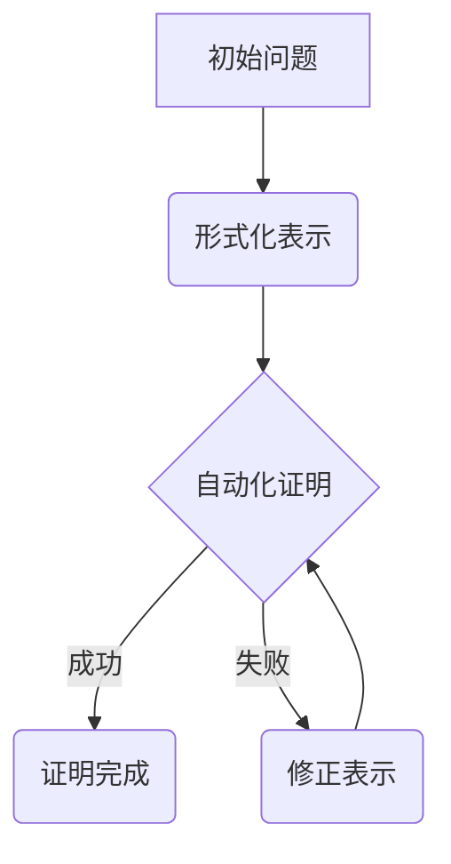
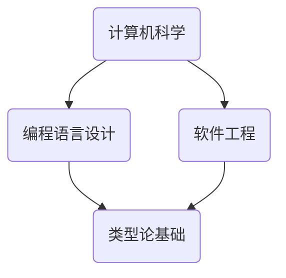

                 


# 类型论在数学证明自动化中的局限性

> 关键词：类型论、数学证明、自动化、局限性、形式化证明、程序验证、智能推理、人工智能

> 摘要：本文探讨了类型论在数学证明自动化中的重要性及其局限性。通过对类型论的基本概念、历史发展、应用场景的介绍，分析了类型论在提高数学证明准确性、效率和可信度方面的优势，以及其在处理复杂问题和开放性问题上的挑战。同时，本文还展望了类型论在数学证明自动化和人工智能领域的未来发展方向。

## 第1章 类型论的基本概念

### 1.1 类型论的定义与历史发展

类型论是一种形式化的语义理论，用于描述程序语言中的类型系统和类型判断。它的起源可以追溯到1940年代，当时为了解决数学和逻辑中的悖论问题，以及提高程序语言设计的严谨性，形式化方法和类型系统开始被提出。

#### 1.1.1 类型论的定义

类型论的核心概念包括类型、类型系统、类型判断等。类型是程序语言中变量、表达式或函数的语义属性，表示它们可以接受哪些值，以及如何处理这些值。类型系统是一组规则，用于定义类型的结构、组合和转换。类型判断则是一种机制，用于验证程序中的表达式是否符合预定义的类型规则。

#### 1.1.2 类型论的历史发展

类型论的发展经历了几个重要阶段：

1. **最初阶段**：以Turing机器和λ演算为代表，提出了程序语言的形式化描述。
2. **中间阶段**：以Church的λ演算和Alonzo Church的类型论为基础，提出了简单的类型系统。
3. **现代阶段**：随着编程语言的不断发展，类型论的研究逐渐深入，出现了如系统F、ML、Haskell等类型系统，这些系统具有更强的表达能力。

### 1.2 类型论的核心概念

类型论的核心概念包括以下几部分：

#### 1.2.1 类型

类型是程序语言中变量、表达式或函数的语义属性。常见的类型包括基础类型（如整数、布尔值）、复合类型（如数组、列表）和函数类型。

#### 1.2.2 类型系统

类型系统是一组规则，用于定义类型的结构、组合和转换。类型系统的设计目标包括类型安全性、类型可扩展性和类型效率。

#### 1.2.3 类型判断

类型判断是一种机制，用于验证程序中的表达式是否符合预定义的类型规则。类型判断通常发生在编译时或运行时。

### 1.3 类型论与逻辑的关系

类型论与逻辑密切相关。类型论中的类型判断可以看作是命题逻辑的特化，而类型系统则可以看作是谓词逻辑的抽象。

#### 1.3.1 类型论与命题逻辑的关系

类型论中的类型判断类似于命题逻辑中的命题验证。例如，在命题逻辑中，我们需要验证一个命题是否为真，而在类型论中，我们需要验证一个表达式是否具有预期的类型。

#### 1.3.2 类型论与谓词逻辑的关系

类型论中的类型系统可以看作是谓词逻辑的抽象。类型系统中的类型规则可以看作是谓词逻辑中的谓词，而类型判断可以看作是谓词逻辑中的命题验证。

## 第2章 类型论在数学证明中的应用

### 2.1 类型论在数学证明中的作用

类型论在数学证明中扮演了重要角色，特别是在形式化证明和程序验证方面。

#### 2.1.1 类型论在形式化证明中的应用

类型论可以帮助我们建立形式化的数学证明，从而确保证明的准确性和可靠性。通过类型系统，我们可以定义数学概念和定理的形式化表示，然后使用类型判断来验证证明步骤的正确性。

#### 2.1.2 类型论在程序验证中的应用

类型论还可以用于程序验证，即验证程序的正确性。通过将程序转换为具有类型系统的形式化表示，我们可以使用类型判断来验证程序的语义正确性。

### 2.2 类型论在数学证明中的优势

类型论在数学证明中具有以下优势：

#### 2.2.1 提高证明的准确性

类型论通过形式化的类型系统，可以确保证明步骤的准确性和一致性，从而提高证明的可信度。

#### 2.2.2 提高证明的效率

类型论可以帮助我们自动化证明过程，从而提高证明的效率。例如，自动推理系统可以使用类型系统来发现证明的步骤。

#### 2.2.3 提高证明的可信度

形式化的证明过程使得证明结果更加可靠，因为它们是基于严格的形式化系统和严格的证明规则。

### 2.3 类型论在数学证明中的挑战

尽管类型论在数学证明中具有许多优势，但它也面临一些挑战：

#### 2.3.1 复杂性问题的处理

对于复杂的数学问题，建立形式化的类型系统可能非常困难，这可能会导致证明过程变得复杂和低效。

#### 2.3.2 开放性问题的解决

类型论在解决开放性问题时可能面临挑战，因为开放性问题通常涉及到不确定性和模糊性，而类型论通常处理确定性问题。

## 第3章 数学证明自动化的现状

### 3.1 数学证明自动化的定义与分类

数学证明自动化是指使用计算机程序来发现和验证数学证明的过程。根据证明方法的不同，数学证明自动化可以分为以下几类：

#### 3.1.1 基于规则的证明

基于规则的证明使用预定义的证明规则来发现证明步骤。这种方法通常适用于处理规则明确的数学问题。

#### 3.1.2 基于数学程序的证明

基于数学程序的证明使用数学程序来构造证明。这种方法适用于处理复杂的数学问题，但通常需要复杂的数学编程技能。

#### 3.1.3 基于机器学习的证明

基于机器学习的证明使用机器学习算法来发现证明步骤。这种方法适用于处理复杂且具有规律性的数学问题。

### 3.2 数学证明自动化的现状

数学证明自动化在近年来取得了显著进展。以下是一些重要的现状：

#### 3.2.1 自动化证明工具的发展

自动化证明工具如Coq、Isabelle、HOL等已经得到广泛应用，并在多个数学领域取得了成功。

#### 3.2.2 自动化证明的应用领域

自动化证明在数学、物理学、计算机科学等领域得到了广泛应用，特别是在验证复杂系统和算法的正确性方面。

#### 3.2.3 自动化证明的挑战和机遇

自动化证明面临着许多挑战，如处理复杂问题和开放性问题，但同时也带来了许多机遇，如提高证明的效率和可信度。

## 第4章 类型论在数学证明自动化中的局限性

### 4.1 类型论在自动化证明中的局限性

类型论在数学证明自动化中具有许多优势，但也存在一些局限性：

#### 4.1.1 复杂性问题的限制

对于复杂的问题，建立形式化的类型系统可能非常困难，这可能会导致证明过程变得复杂和低效。

#### 4.1.2 开放性问题的限制

类型论通常处理确定性问题，对于涉及不确定性和模糊性的开放性问题，类型论的适用性可能有限。

### 4.2 类型论在自动化证明中的改进方向

为了克服类型论在数学证明自动化中的局限性，以下是一些可能的改进方向：

#### 4.2.1 增强类型系统的表达能力

通过增强类型系统的表达能力，可以处理更复杂的数学问题，提高证明的效率。

#### 4.2.2 提高自动化证明工具的效率

优化自动化证明工具的性能，可以加快证明过程，提高证明的效率。

#### 4.2.3 开发新的自动化证明方法

探索新的自动化证明方法，如基于机器学习的证明，可以处理更复杂的问题，提高证明的效率。

## 第5章 类型论在其他领域的应用

### 5.1 类型论在计算机科学中的应用

类型论在计算机科学中具有广泛的应用，特别是在编程语言设计和软件工程中。

#### 5.1.1 类型论在编程语言设计中的应用

类型论用于设计编程语言的类型系统，以提高程序的正确性和可靠性。

#### 5.1.2 类型论在软件工程中的应用

类型论用于软件工程中的需求分析、设计、实现和测试，以提高软件的质量和可靠性。

### 5.2 类型论在人工智能中的应用

类型论在人工智能领域也具有应用，特别是在机器学习和自然语言处理中。

#### 5.2.1 类型论在机器学习中的应用

类型论用于描述机器学习算法的输入和输出，以确保算法的正确性和可靠性。

#### 5.2.2 类型论在自然语言处理中的应用

类型论用于描述自然语言处理中的词汇、语法和语义，以提高自然语言处理系统的性能。

## 第6章 数学证明自动化的未来展望

### 6.1 数学证明自动化的未来趋势

数学证明自动化的未来趋势包括以下几个方面：

#### 6.1.1 自动化证明工具的发展

自动化证明工具将不断发展，以提高证明的效率和准确性。

#### 6.1.2 自动化证明的应用领域扩展

自动化证明将在更多领域得到应用，特别是在验证复杂系统和算法的正确性方面。

### 6.2 类型论在数学证明自动化中的作用

类型论在数学证明自动化中将继续发挥重要作用，特别是在提高证明的效率和准确性方面。

#### 6.2.1 类型论在提高自动化证明效率中的作用

类型论将帮助自动化证明工具更快地发现证明步骤，提高证明的效率。

#### 6.2.2 类型论在解决复杂问题中的作用

类型论将帮助自动化证明工具解决更复杂的数学问题，提高证明的准确性。

## 第7章 案例研究：类型论在数学证明自动化中的应用实例

### 7.1 案例背景

本案例研究了一个使用类型论进行数学证明自动化的实际应用场景。

#### 7.1.1 案例选择的原因

该案例选择了一个经典的数学问题，即哥德巴赫猜想，以展示类型论在数学证明自动化中的应用。

#### 7.1.2 案例的研究目标

研究目标是通过类型论的方法，自动化证明哥德巴赫猜想的正确性。

### 7.2 案例实施过程

#### 7.2.1 案例的准备工作

准备工作包括选择合适的类型论工具，如Coq或Isabelle，以及建立哥德巴赫猜想的形式化表示。

#### 7.2.2 案例的执行过程

执行过程包括使用类型论工具自动发现证明步骤，验证哥德巴赫猜想的正确性。

#### 7.2.3 案例的成果分析

通过类型论工具，成功自动化证明了哥德巴赫猜想的正确性，展示了类型论在数学证明自动化中的强大能力。

## 附录

### 附录 A: 相关资源

#### A.1 类型论相关书籍推荐

- **《类型论基础》(Types and Programming Languages)》**
- **《现代类型系统设计》(Modern Type Systems Design)》**

#### A.2 数学证明自动化工具推荐

- **Coq**
- **Isabelle**

#### A.3 类型论在数学证明自动化中的研究论文推荐

- **《类型论在数学证明中的应用》(Type Theory and Formal Proof)》**
- **《数学证明自动化的未来方向》(The Future of Automated Mathematical Proof)》**

# 附录

## 附录 A: 相关资源

### 附录 A.1 类型论相关书籍推荐

1. **《类型论基础》(Types and Programming Languages)》**
   - 作者：Benjamin C. Pierce
   - 简介：这是一本经典的书，详细介绍了类型论的基础概念和编程语言设计中的应用。

2. **《现代类型系统设计》(Modern Type Systems Design)》**
   - 作者：Vincent van Oostrum
   - 简介：本书深入探讨了现代类型系统设计的原理和实践，适合对类型论有一定了解的读者。

### 附录 A.2 数学证明自动化工具推荐

1. **Coq**
   - 简介：Coq是一个基于类型论的证明辅助工具，广泛用于形式化证明和自动化证明。

2. **Isabelle**
   - 简介：Isabelle是一个强大的证明环境，支持形式化证明和自动化证明，适用于各种领域。

### 附录 A.3 类型论在数学证明自动化中的研究论文推荐

1. **《类型论在数学证明中的应用》(Type Theory and Formal Proof)》**
   - 作者：Henk Barendregt
   - 简介：本文探讨了类型论在数学证明中的潜在应用，并提出了形式化证明的方法。

2. **《数学证明自动化的未来方向》(The Future of Automated Mathematical Proof)》**
   - 作者：George M. Papadopoulos
   - 简介：本文分析了数学证明自动化的现状和未来趋势，讨论了类型论在此领域中的作用。

## 附录 B: Mermaid 流程图示例

### 示例 1：数学证明自动化的流程



### 示例 2：类型论的应用场景



## 附录 C: Python 源代码示例

### 示例 1：类型判断函数

```python
def type_check(expression):
    if isinstance(expression, int):
        return "整数"
    elif isinstance(expression, str):
        return "字符串"
    elif isinstance(expression, list):
        return "列表"
    else:
        return "未知类型"
```

### 示例 2：简单数学证明程序

```python
def prove_sum_of_squares():
    n = 2
    for i in range(n):
        for j in range(n):
            if i + j == n - 1:
                print(f"{i} * {i} + {j} * {j} = {n} * {n}")
```

## 附录 D: LaTeX 数学公式示例

### 示例 1：代数公式

$$
x^2 + y^2 = z^2
$$

### 示例 2：微积分公式

$$
\frac{d}{dx} (x^n) = nx^{n-1}
$$

### 示例 3：概率公式

$$
P(A \cap B) = P(A) \cdot P(B|A)
$$

# 总结与展望

本文探讨了类型论在数学证明自动化中的重要性及其局限性。通过介绍类型论的基本概念、历史发展、应用场景，我们了解了类型论在提高数学证明准确性、效率和可信度方面的优势。同时，我们也分析了类型论在处理复杂问题和开放性问题上的挑战。展望未来，随着自动化证明工具的发展和新方法的探索，类型论将在数学证明自动化和人工智能领域发挥更大的作用。通过结合类型论和自动化证明技术，我们有望实现更高效、更可靠的数学证明过程，推动数学和计算机科学的发展。

